AIのこれまでのブームのうち、第2次AIブーム後の冬の時代について

# 第2次AIブーム後の冬の時代 - 初学者のための完全ガイド

## 🔍 一言要約
AIが「万能の夢」から「現実の壁」にぶつかり、研究資金と期待が凍りついた15年間の停滞期

## 📚 目次

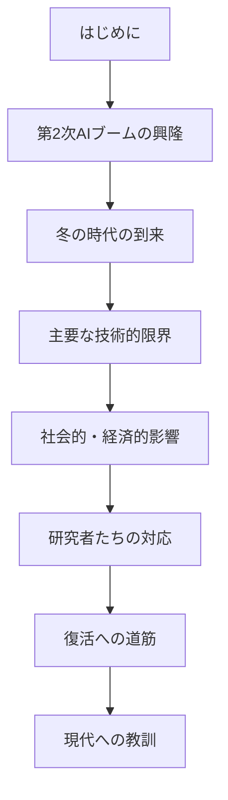

## 🌟 はじめに

「人工知能が人間を超える！」そんな夢に満ちた時代の後に訪れる、厳しい現実。それが**AI冬の時代**です。

まるで株価の大暴落のように、AIへの期待と投資が一気に冷え込んだ時期を指します。これは単なる技術の停滞ではなく、**人間の期待と技術の現実のギャップ**が生み出した、AI発展史上最も過酷な試練の時代でした。

現在のAIブームを理解するためには、この「冬の教訓」を知ることが不可欠です。

## 🚀 第2次AIブームの興隆（1980年代前半）

### ブームの背景

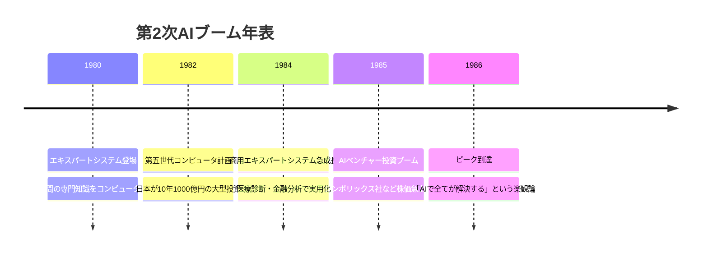

### エキスパートシステムとは？

**日常例で理解する**：
- 人間の医師の診断知識を「もし○○なら△△」というルール集にして、コンピュータに覚えさせたもの
- まるで「超詳細な取扱説明書」を持つコンピュータ助手のようなイメージ

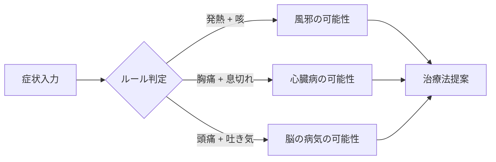

## ❄️ 冬の時代の到来（1987年〜2000年代初頭）

### 崩壊の引き金

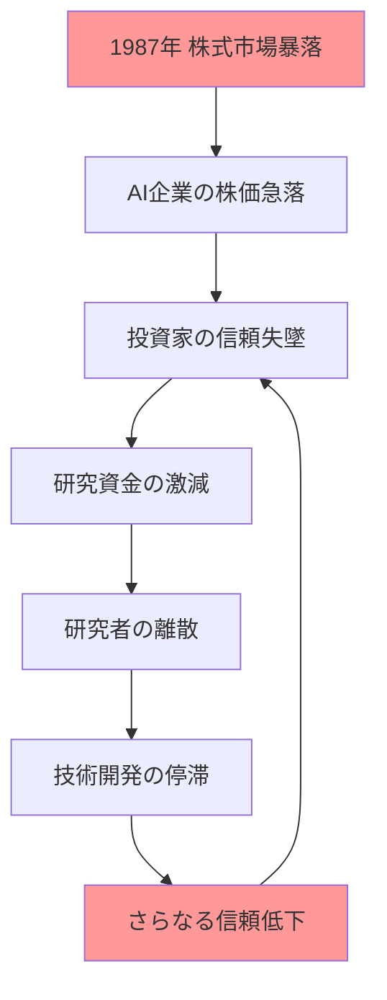

## 🧱 主要な技術的限界

### 1. 知識獲得のボトルネック

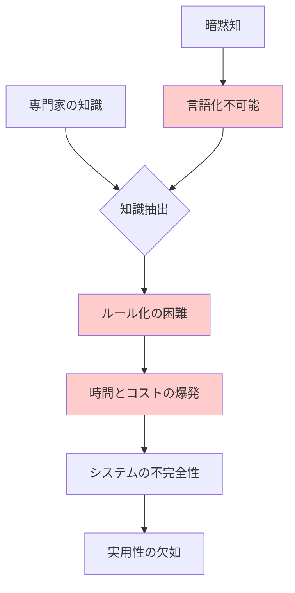

**日常例**：
自転車の乗り方を「ルール」で説明してみてください。「バランスを取って...」と言っても、実際にはできませんよね。人間の知識の多くは、このような「説明できない技術」なのです。

### 2. スケーラビリティの壁

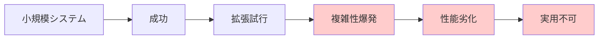

### 3. コンピュータ性能の限界

**当時のコンピュータ環境**：
- CPU速度：現在の1/1000程度
- メモリ：現在の1/100程度  
- ストレージ：現在の1/10000程度

## 📗 関連する用語

### 同義語・類義語
- **AI冬の時代** = AIウィンター = 人工知能の冬
- **エキスパートシステム** = 知識ベースシステム = ルールベースシステム
- **知識獲得** = 知識抽出 = ナレッジエンジニアリング

### 対義語・反義語
- **AIブーム** ⟷ **AI冬の時代**
- **楽観論** ⟷ **悲観論**
- **投資拡大** ⟷ **資金枯渇**

### 多義語の理解
**「人工知能」の意味の変遷**：
- 1980年代：エキスパートシステム中心
- 1990年代：機械学習・統計手法
- 2010年代以降：深層学習・ニューラルネットワーク

## 💔 社会的・経済的影響

### 産業への打撃

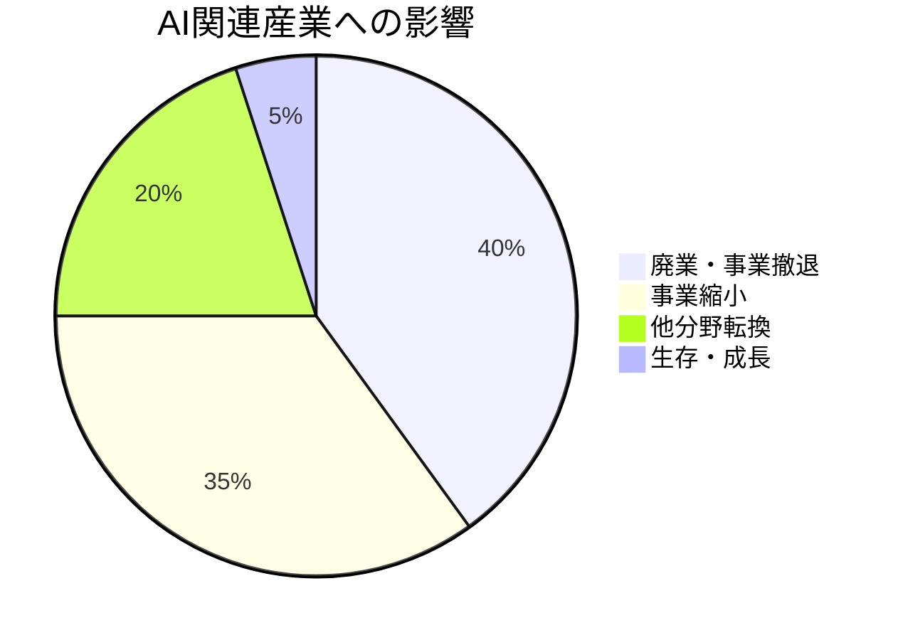

### 研究機関への影響

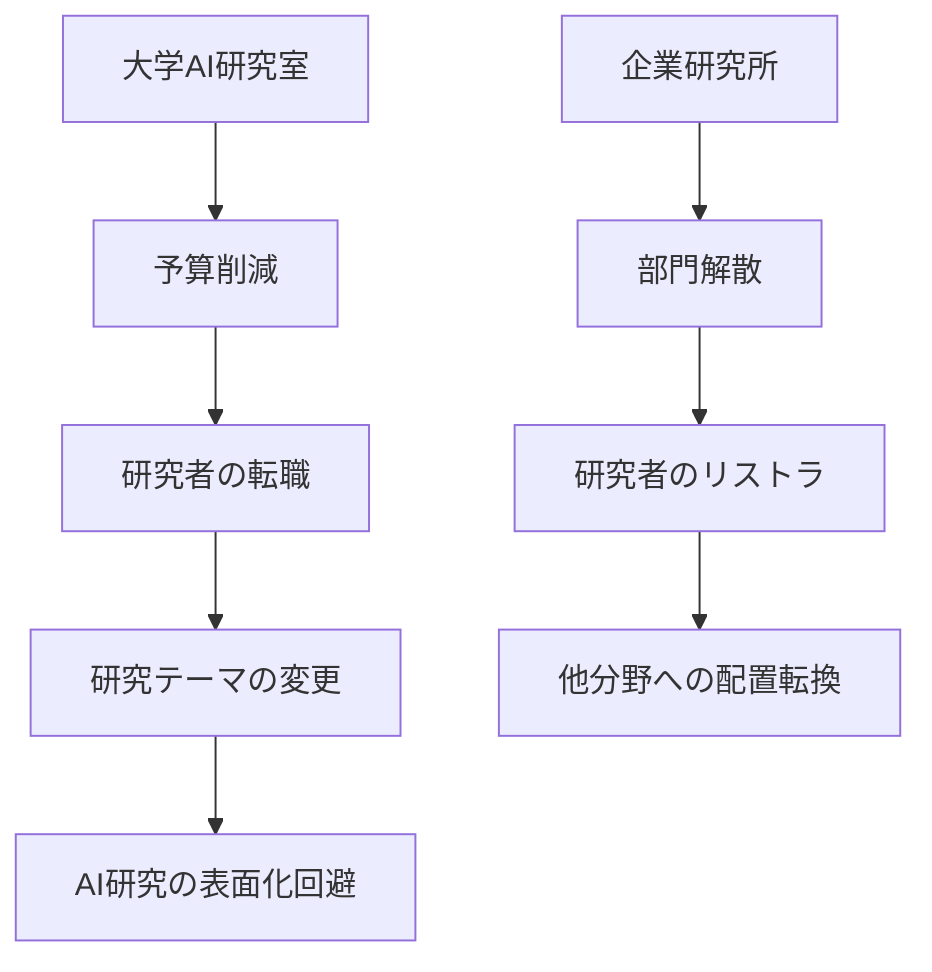

## 🛡️ 研究者たちの生存戦略

### 名前を変える戦略

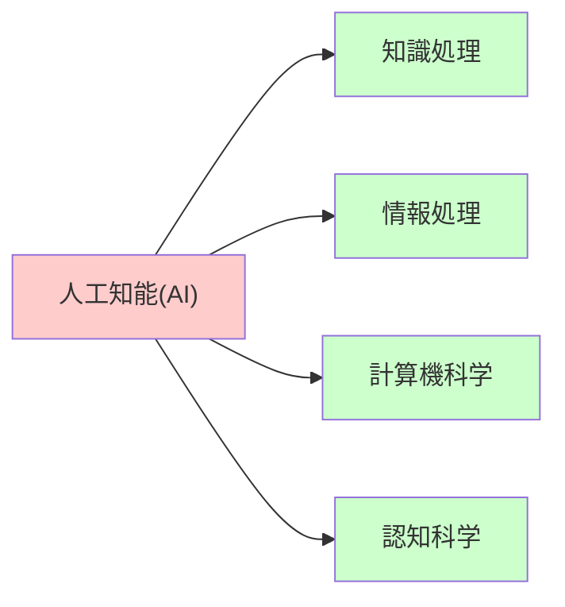

**生存の知恵**：
「AI」という言葉を使わず、より地味で堅実な名前で研究を続けました。まるで「派手な看板を下ろして、質実剛健な看板に掛け替えた」ようなものです。

### 基礎研究への回帰

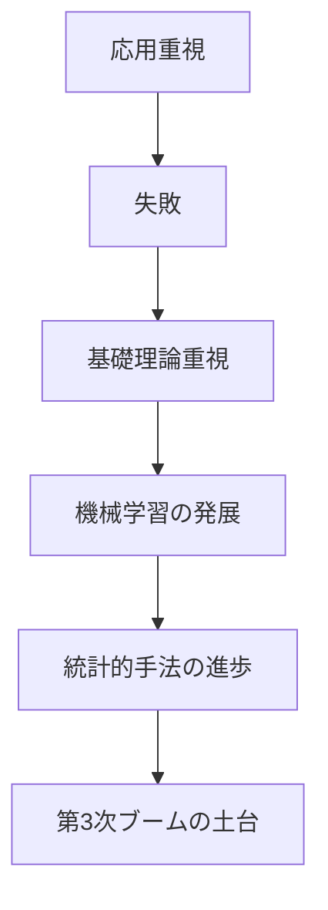

## 💡 メリットとデメリット

### AI冬の時代のメリット

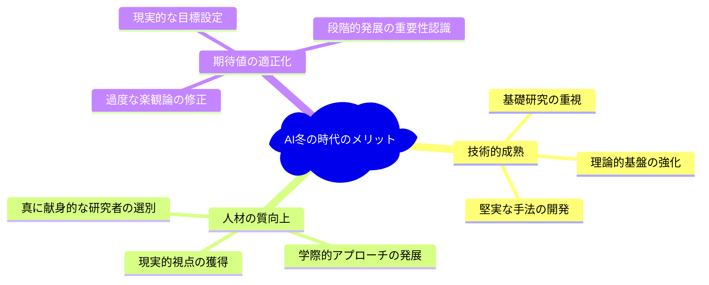

### デメリット

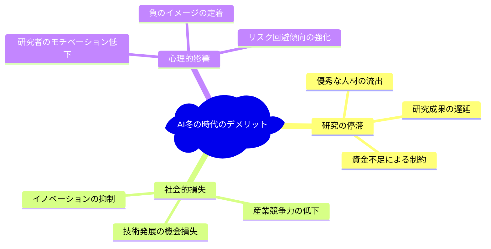

## 🌱 復活への道筋

### 第3次ブームへの布石

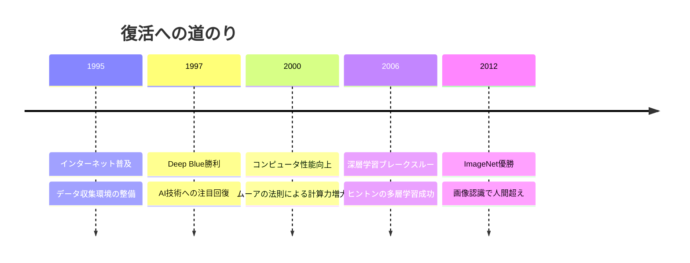

### 技術的基盤の変化

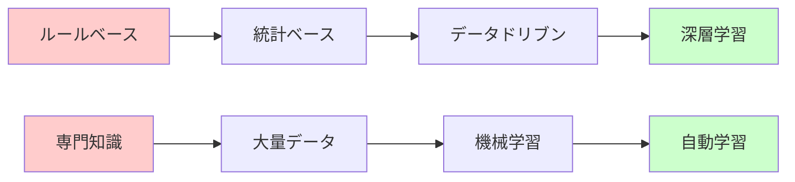

## 🚀 置換・変遷

### 何を置き換えたか

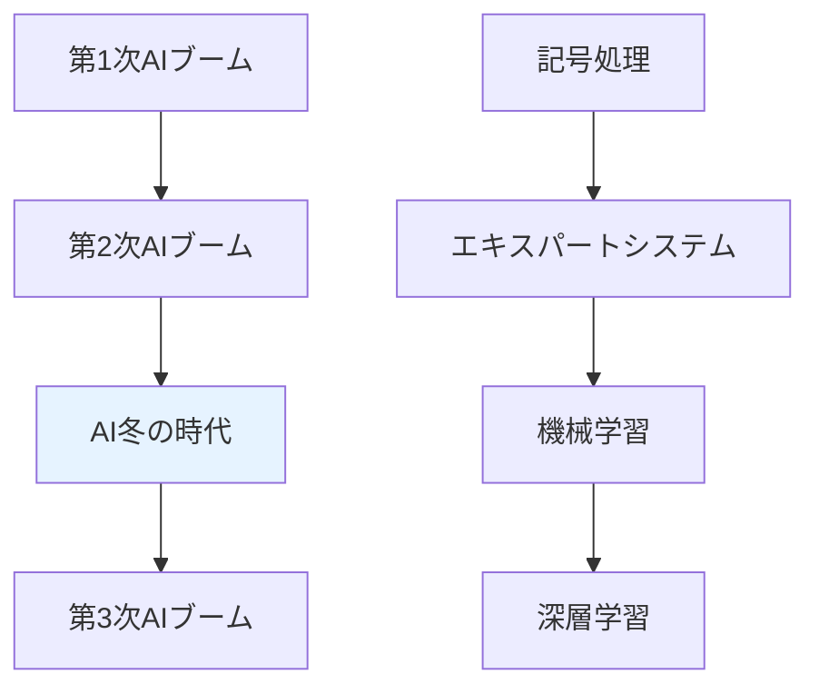

**継承関係**：
- **継承したもの**：問題解決への情熱、自動化の理想
- **継承されたもの**：現実的なアプローチ、データの重要性認識

## 🚀 代替・競合

### 代替関係

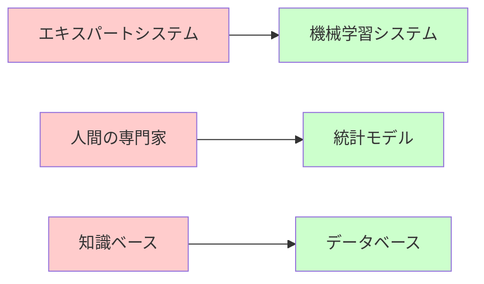

### 競合技術

**当時のAIの競合**：
- 従来の統計処理システム
- データベース管理システム
- 専門家による人的サービス

## 🌍 実世界への影響とその後の発展

### 長期的影響

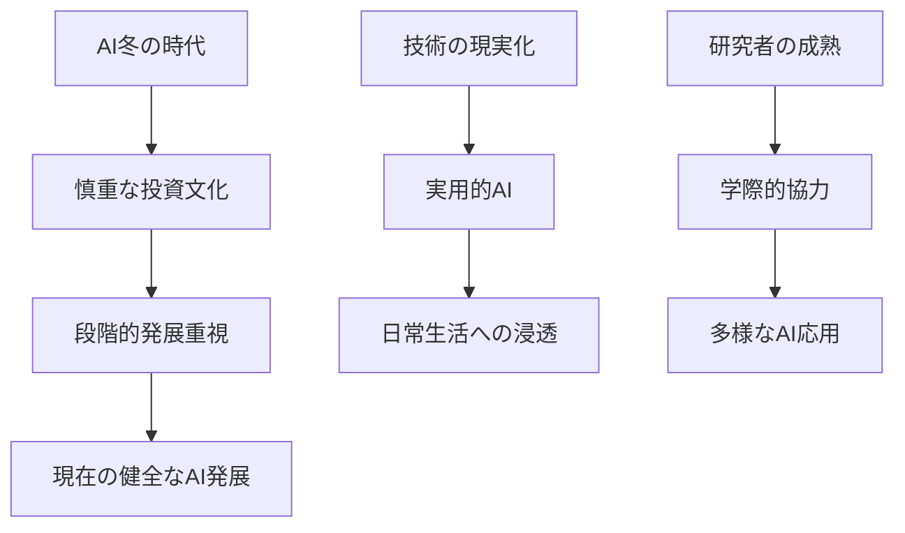

### 現代への教訓

**重要な学び**：

1. **期待管理の重要性**
   - 技術の限界を正しく理解する
   - 段階的な発展目標の設定

2. **基礎研究の価値**
   - 地味でも堅実な研究の継続
   - 長期的視点での投資

3. **多様性の重要性**
   - 単一アプローチへの依存回避
   - 複数の技術的選択肢の維持

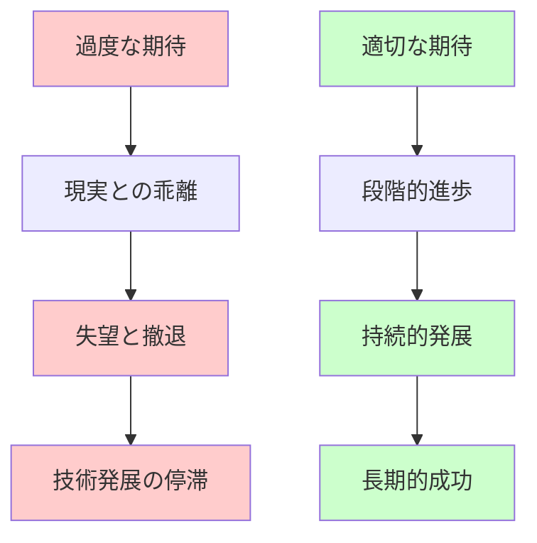

---

この資料により、AI冬の時代が単なる技術の停滞ではなく、現在のAI発展の重要な基盤を築いた「必要な試練」だったことが理解できるでしょう。
