AIのこれまでのブームのうち、第3次AIブームについて

# 第3次AIブーム - 初学者のための完全ガイド

## 🔍 一言要約
機械が人間のように学習し始めた革命的な時代

## 📚 目次
1. [🌟 はじめに](#-はじめに)
2. [🏗️ 基本構造](#️-基本構造)
3. [⚡ 主要技術](#-主要技術)
4. [📜 時代背景と発見に至った経緯](#-時代背景と発見に至った経緯)
5. [🎨 種類と特徴](#-種類と特徴)
6. [📗 関連する用語](#-関連する用語)
7. [💡 メリットとデメリット](#-メリットとデメリット)
8. [🚀 応用と実例](#-応用と実例)
9. [🔄 置換、変遷](#-置換変遷)
10. [🤝 代替、競合](#-代替競合)
11. [🌍 実世界への影響とその後の発展](#-実世界への影響とその後の発展)

## 🌟 はじめに

第3次AIブームは、まるで「機械が人間の赤ちゃんのように学習を始めた」革命的な時代です。

これまでコンピューターは「プログラムされたことしかできない従順な道具」でした。しかし第3次AIブームでは、機械が「経験から自分で学び、パターンを見つけて、予測する」ことができるようになりました。

例えば、あなたがNetflixで映画を見るたびに「次に何を見たいか」を予測したり、写真を見ただけで「この中に猫がいる」と判断したりする技術。これらはすべて第3次AIブームの成果です。

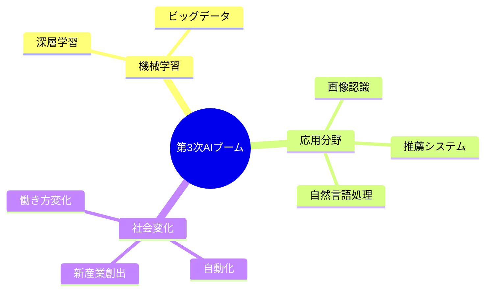

## 🏗️ 基本構造

第3次AIブームの基本構造は「データ → 学習 → 予測」という3つのステップで説明できます。

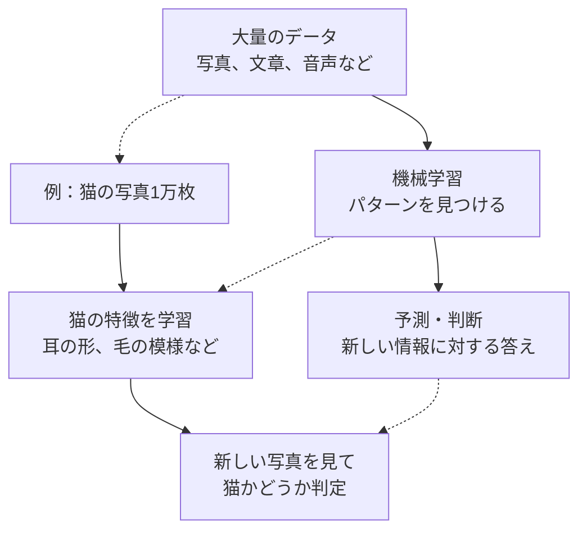

この構造により、人間が明示的に「猫の判定ルール」をプログラムしなくても、機械が自動的に猫を認識できるようになりました。

## ⚡ 主要技術

第3次AIブームの中核技術は「**深層学習（ディープラーニング）**」です。これを日常例で説明してみましょう。

### 深層学習とは
人間の脳の神経細胞の仕組みを真似した技術です。まるで「電子版の脳」を作ったようなものです。

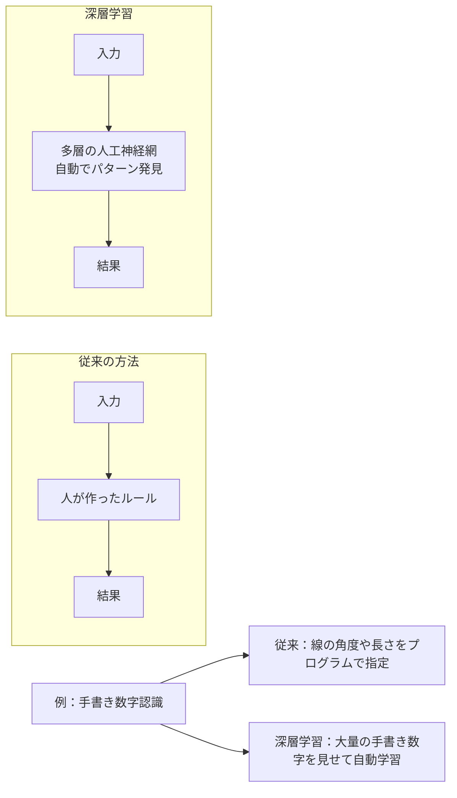

### 主な技術要素

1. **ビッグデータ** = 機械の「教科書」
   - インターネットの普及で膨大なデータが利用可能に
   - 写真、動画、テキスト、音声データなど

2. **コンピューター性能の向上** = 機械の「頭の良さ」
   - GPU（画像処理チップ）の活用
   - 並列処理による高速化

3. **アルゴリズムの改良** = 機械の「学習方法」
   - より効率的な学習手法の開発
   - 誤差を減らす仕組みの改善

## 📜 時代背景と発見に至った経緯

第3次AIブームが生まれた背景には、まるで「パズルのピースが全て揃った」ような偶然の重なりがありました。

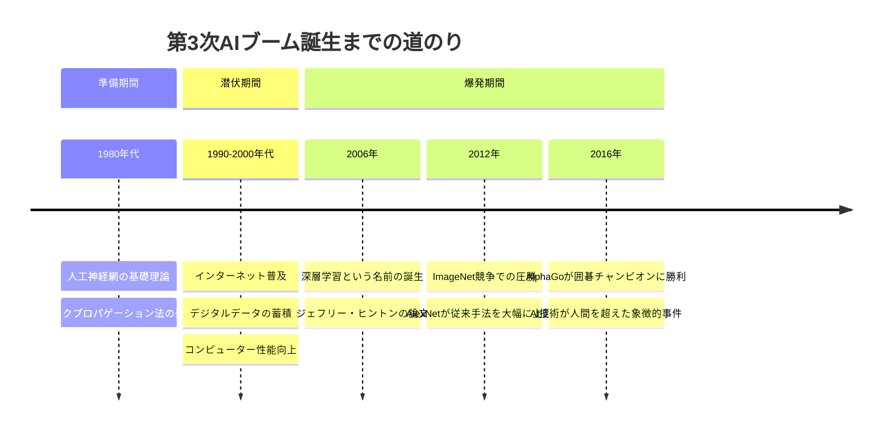

### なぜ2010年代に爆発したのか？

1. **データの爆発的増加**
   - スマートフォンの普及
   - SNSでの写真・動画共有
   - インターネットショッピングの履歴

2. **計算能力の向上**
   - GPU（ゲーム用チップ）のAI活用
   - クラウドコンピューティング

3. **アルゴリズムの改良**
   - 深い層でも学習できる手法の発見
   - 過学習を防ぐ技術の開発

これらが同時に揃ったのが2010年代でした。まるで「レシピ」「材料」「調理器具」が全て揃って、初めて美味しい料理ができたような状況です。

## 🎨 種類と特徴

第3次AIブームの技術は、「何を学習するか」によって大きく3つに分類できます。

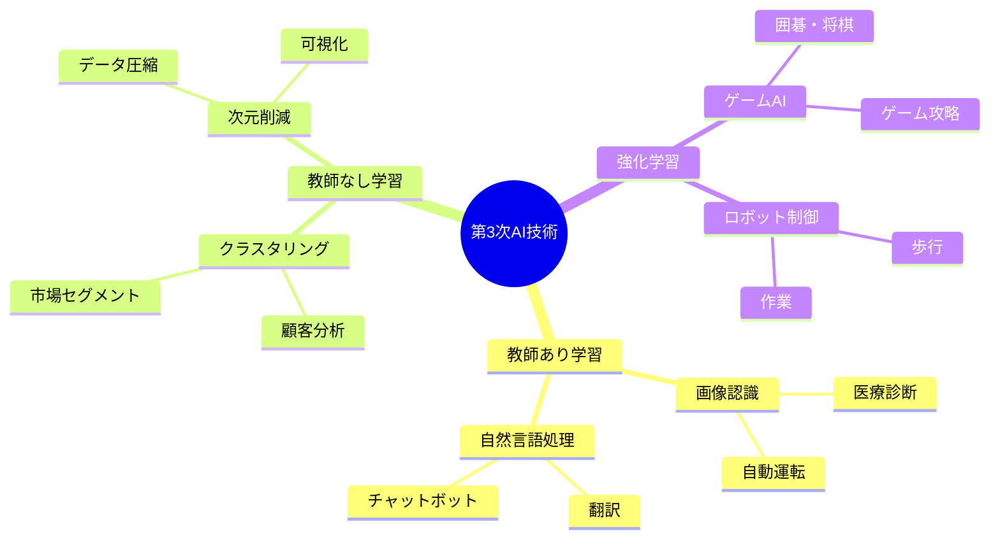

### 1. 教師あり学習 = 「正解付きドリル」
- **特徴**: 正解がわかっているデータで学習
- **例**: 猫の写真に「これは猫」というラベル付きで学習
- **応用**: 画像認識、音声認識、翻訳

### 2. 教師なし学習 = 「自分でパターン発見」
- **特徴**: 正解がないデータから隠れたパターンを見つける
- **例**: 顧客の購買データから似た傾向のグループを発見
- **応用**: 推薦システム、異常検知、データ分析

### 3. 強化学習 = 「試行錯誤で上達」
- **特徴**: 行動の結果（報酬・罰）から最適な行動を学習
- **例**: ゲームで勝ち負けを繰り返して強くなる
- **応用**: ゲームAI、ロボット制御、自動取引

## 📗 関連する用語

第3次AIブームを理解するための重要な用語を、日常的な言葉で説明します。

### 基本用語
| 専門用語 | 日常の表現 | 簡単な説明 |
|----------|------------|------------|
| 機械学習 | 機械の勉強 | コンピューターが自動でパターンを見つける技術 |
| 深層学習 | 多段階の学習 | 人間の脳を真似した、複雑な問題を解く技術 |
| ニューラルネットワーク | 人工神経網 | 脳の神経細胞を真似したコンピューターの仕組み |
| ビッグデータ | 超大量データ | 普通では処理しきれない膨大な情報 |
| アルゴリズム | 問題解決の手順 | コンピューターが問題を解くための決まった方法 |

### 類義語の比較
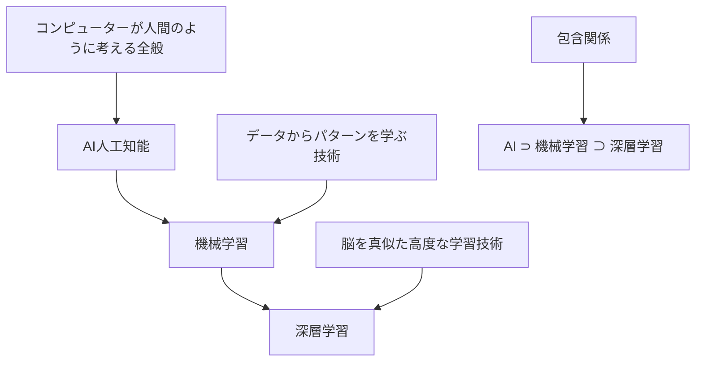

### 多義語の整理
- **学習**: 機械学習では「データからパターンを発見すること」
- **訓練**: モデルにデータを与えて性能を向上させること
- **推論**: 学習済みモデルが新しいデータに対して予測すること

## 💡 メリットとデメリット

第3次AIブームは社会に大きな変化をもたらしましたが、光と影の両面があります。

### 🌟 メリット

1. **自動化による効率化**
   - 単純作業の自動化
   - 24時間365日稼働可能
   - 人間のミス削減

2. **新しい発見と洞察**
   - 人間が気づかないパターンの発見
   - 大量データの活用
   - 予測精度の向上

3. **個人に最適化されたサービス**
   - 推薦システム（Netflix、Amazon）
   - 個別学習支援
   - パーソナライズ医療

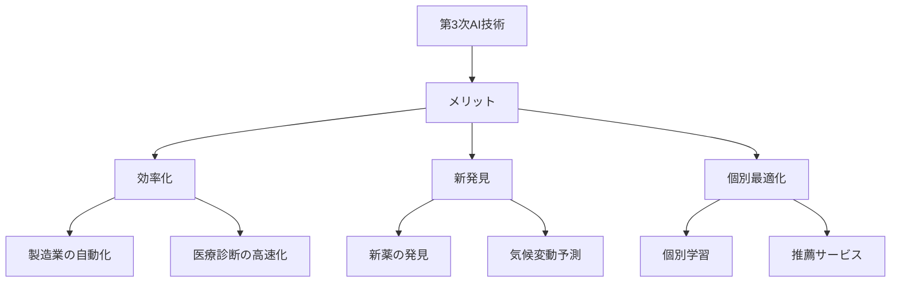

### ⚠️ デメリット

1. **雇用への影響**
   - 一部の職業の自動化
   - スキル変化への対応必要
   - 格差拡大の懸念

2. **プライバシーとセキュリティ**
   - 個人情報の大量収集
   - データ漏洩のリスク
   - 監視社会への懸念

3. **判断の不透明性**
   - AIの決定過程が見えない（ブラックボックス問題）
   - バイアスの可能性
   - 責任の所在が不明確

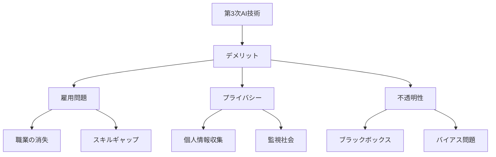

## 🚀 応用と実例

第3次AIブームの技術は、私たちの日常生活のあらゆる場面で活用されています。

### 身近な実例

#### 1. スマートフォン
- **音声アシスタント**: Siri、Google Assistant
- **カメラ機能**: 人物認識、夜景モード
- **翻訳アプリ**: Google翻訳の精度向上

#### 2. エンターテイメント
- **動画配信**: Netflix、YouTubeの推薦システム
- **音楽配信**: Spotifyのプレイリスト自動生成
- **ゲーム**: NPC（ノンプレイヤーキャラクター）の知能化

#### 3. 電子商取引
- **商品推薦**: Amazon、楽天の「おすすめ商品」
- **価格最適化**: 動的な価格設定
- **在庫管理**: 需要予測による効率化

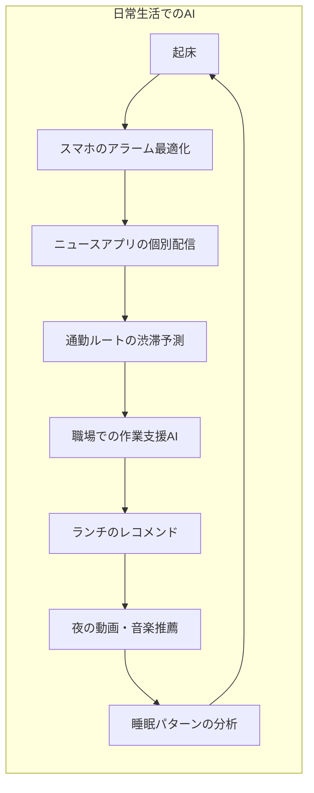

### 産業での応用

#### 製造業
- **品質検査**: 不良品の自動検出
- **予知保全**: 機械の故障予測
- **生産最適化**: 需要予測に基づく計画

#### 医療・ヘルスケア
- **画像診断**: レントゲン、CTスキャンの異常検出
- **新薬開発**: 分子構造の最適化
- **個別医療**: 遺伝子データに基づく治療

#### 金融業
- **信用評価**: 融資審査の自動化
- **不正検知**: クレジットカード詐欺の防止
- **アルゴリズム取引**: 市場データに基づく自動売買

## 🔄 置換、変遷

第3次AIブームは、従来の技術や産業構造に大きな変革をもたらしました。

### 何を置き換えたか

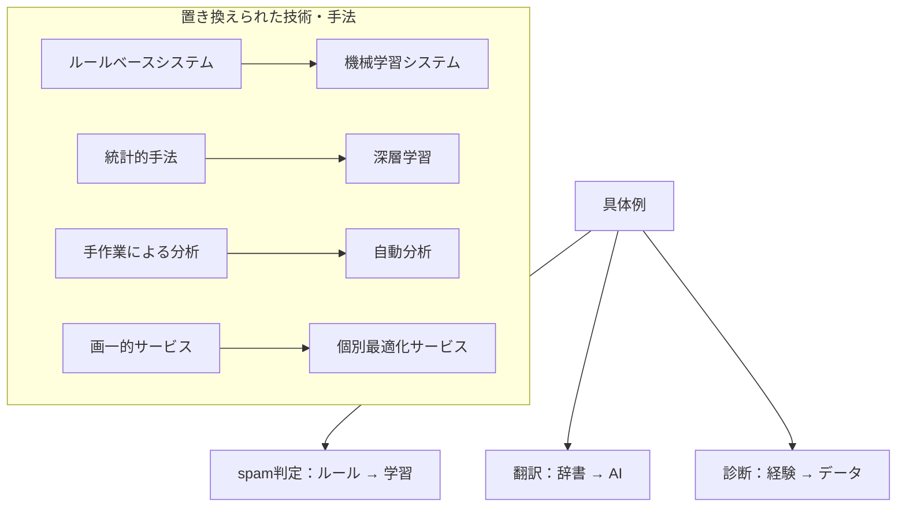

### 何に置き換えられる可能性があるか

将来的に第3次AI技術も進化し、新しい技術に置き換えられる可能性があります：

1. **第4次AIブーム**（予測）
   - 汎用人工知能（AGI）への発展
   - 量子コンピューティングとの融合
   - 脳科学との深い連携

2. **新しいパラダイム**
   - エッジAI：デバイス内での処理
   - 分散学習：プライバシー保護しながら学習
   - 説明可能AI：判断理由を明確化

### 継承と被継承の関係

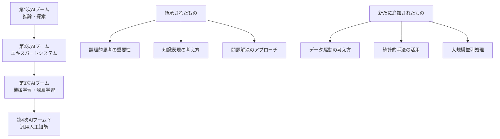

## 🤝 代替、競合

第3次AIブームの技術は、他の技術との競合・協調関係にあります。

### 代替できる技術・手法

1. **従来のプログラミング**
   - 条件分岐による判定 → 機械学習による分類
   - 手作業でのデータ分析 → 自動パターン発見

2. **統計的手法**
   - 単純な回帰分析 → 深層学習による非線形モデリング
   - 従来の時系列分析 → RNN/LSTMによる予測

### 代替される可能性

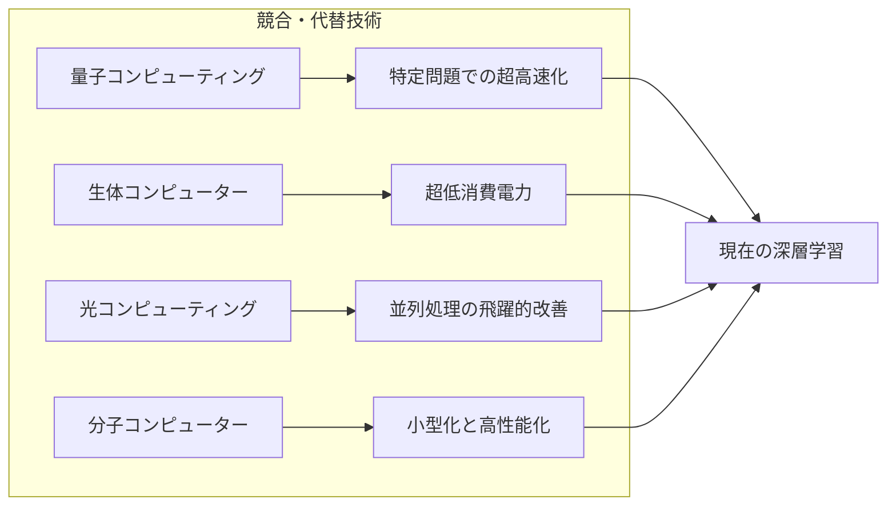

### 競合する分野

1. **技術レベル**
   - 従来の最適化手法（遺伝的アルゴリズム、粒子群最適化）
   - 新しい機械学習手法（Transformer、GAN）

2. **プラットフォームレベル**
   - クラウドAI vs エッジAI
   - 汎用GPU vs 専用AIチップ

3. **ビジネスレベル**
   - 人間の専門家 vs AI診断システム
   - 従来のソフトウェア vs AI機能統合製品

## 🌍 実世界への影響とその後の発展

第3次AIブームは、社会の根本的な変革を促しています。

### 社会への影響

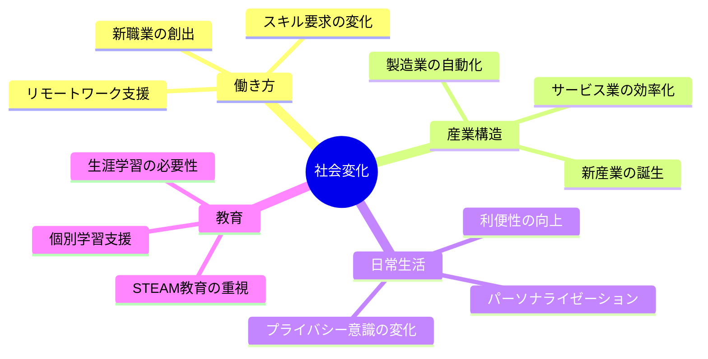

### 今後の発展予想

#### 短期（2025-2030年）
1. **技術の成熟**
   - 深層学習の効率化
   - エッジAIの普及
   - マルチモーダルAIの実用化

2. **社会実装の拡大**
   - 自動運転の部分的実用化
   - 医療AIの診断支援拡大
   - 教育AIの個別指導化

#### 中期（2030-2040年）
1. **汎用化への進歩**
   - AGI（汎用人工知能）への接近
   - 複数タスクの同時実行
   - 常識的推論の改善

2. **社会基盤の変革**
   - スマートシティの本格化
   - 労働市場の再編
   - 新しい経済モデルの出現

#### 長期（2040年以降）
1. **人間とAIの協調**
   - 人機協調の新しい形
   - 創造性分野での協力
   - 意思決定の支援高度化

2. **新たなパラダイム**
   - 第4次AIブームの到来？
   - 量子AI、生体AIとの融合
   - シンギュラリティ（技術的特異点）への接近

### 課題と対策

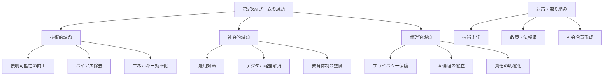

---

この資料により、初学者が第3次AIブームの本質を体系的に理解し、その社会的意義と未来への影響を把握できるようになります。
