AIのこれまでのブームのうち、第3次AIブーム後の冬の時代について
2025/09/27時点の予測


# 第3次AIブーム後の冬の時代 - 初学者のための完全ガイド

## 🔍 一言要約
AIの期待と現実のギャップが生む「冷却期間」

## 📚 目次
1. [はじめに](#🌟-はじめに)
2. [AI冬の時代の基本構造](#🏗️-基本構造)
3. [第3次AIブームの振り返り](#⚡-第3次aiブームの振り返り)
4. [冬の時代が訪れる背景と経緯](#📜-時代背景と発見に至った経緯)
5. [冬の時代の種類と特徴](#🎨-種類と特徴)
6. [関連する用語](#📗-関連する用語)
7. [メリットとデメリット](#💡-メリットとデメリット)
8. [現実世界での実例](#🚀-応用と実例)
9. [過去の冬の時代との比較](#🚀-置換-変遷)
10. [代替技術と競合関係](#🚀-代替-競合)
11. [実世界への影響と未来展望](#🌍-実世界への影響とその後の発展)

## 🌟 はじめに

「AI冬の時代」とは、まるで自然界の冬のように、AI技術への関心や投資が一時的に冷え込む時期のことです。

想像してみてください。新しいスマートフォンが「革命的！」と宣伝されて大きな話題になったものの、実際に使ってみると期待ほどではなかった経験はありませんか？AI業界でも同じようなことが起こります。

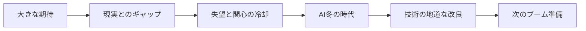

## 🏗️ 基本構造

AI冬の時代の構造は、まるで経済の景気循環のような周期的なパターンを持っています。

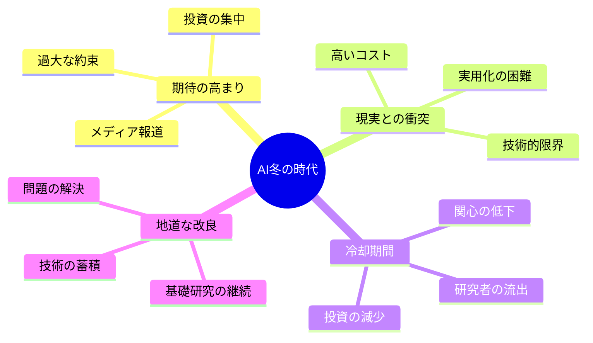

この構造を理解するポイントは3つです：

1. **期待バブル**：新技術への過度な期待が膨らむ
2. **現実チェック**：実際の性能や限界が明らかになる
3. **調整期間**：現実的な評価と技術改良の時期

## ⚡ 第3次AIブームの振り返り

第3次AIブーム（2010年代）は、まるでスマートフォンが普及した時のような衝撃をもたらしました。

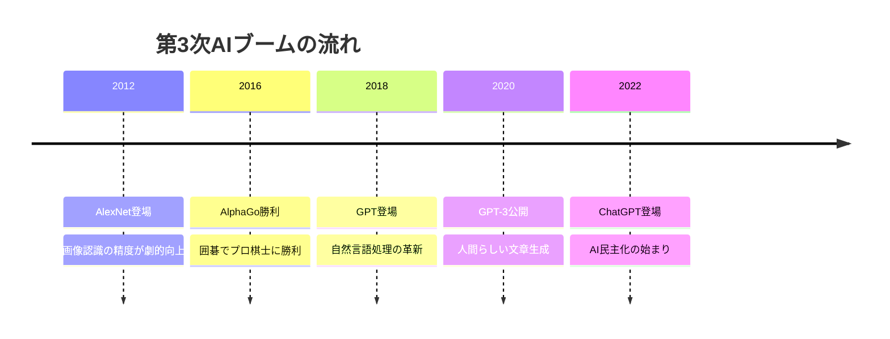

### 何がすごかったのか？

- **画像認識**：人間と同じか、それ以上の精度で写真の中身を理解
- **自然言語処理**：まるで人間のような自然な会話や文章作成
- **ゲーム**：世界最強の囲碁棋士にも勝利する戦略的思考

まさに「SF映画が現実になった」ような体験でした。

## 📜 時代背景と発見に至った経緯

### なぜ冬の時代が訪れるのか？

この現象は、まるで「新しいダイエット法」のようなものです。最初は「これで絶対痩せる！」と大きな期待を持ちますが、実際にやってみると想像以上に大変で、結局続かなくて失望する...そんなサイクルです。

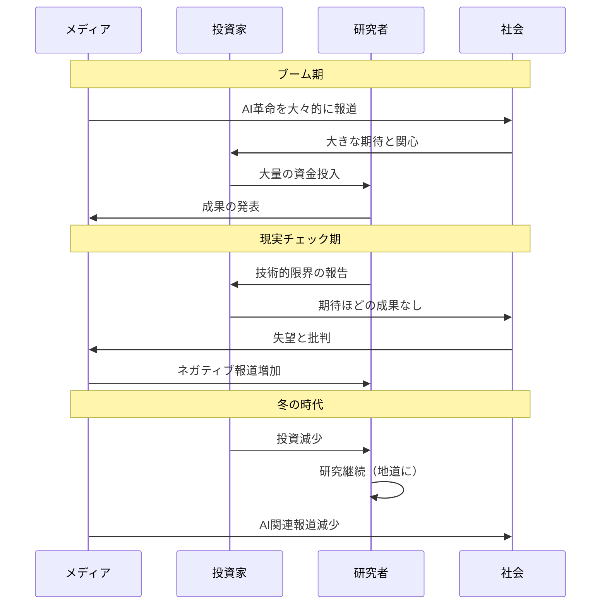

### 歴史的パターン

AI業界では、これまで2回の大きな冬の時代を経験しています：

1. **第1次AI冬（1970年代）**：推論システムへの過度な期待の後
2. **第2次AI冬（1980年代後半）**：エキスパートシステムブームの後

そして今、第3次ブーム後の冬が到来する可能性が議論されています。

## 🎨 種類と特徴

AI冬の時代にも、実はいくつかのタイプがあります。

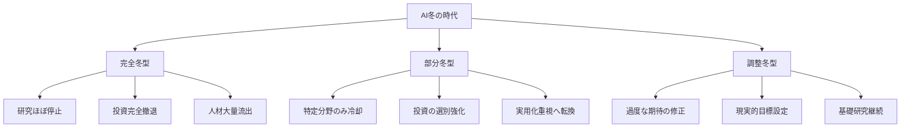

### 特徴比較表

| タイプ | 期間 | 研究継続度 | 投資レベル | 人材流動 |
|--------|------|------------|------------|----------|
| 完全冬型 | 10-15年 | 極低 | ほぼゼロ | 大量流出 |
| 部分冬型 | 5-10年 | 中程度 | 選別的 | 一部流出 |
| 調整冬型 | 2-5年 | 高 | 現実的 | 最小限 |

## 📗 関連する用語

### 同義語・類似語
- **AIバブル崩壊**：AI冬の経済的側面を強調した表現
- **ハイプサイクルの幻滅期**：ガートナー社が提唱する技術普及曲線の一段階
- **テクノロジー不況**：技術分野全般の冷え込み

### 対義語
- **AIブーム**：AI技術への関心と投資が高まる時期
- **AIスプリング**：冬の後の技術復活期
- **AI黄金時代**：技術が成熟し実用化が進む理想的な状態

### 関連概念の比較

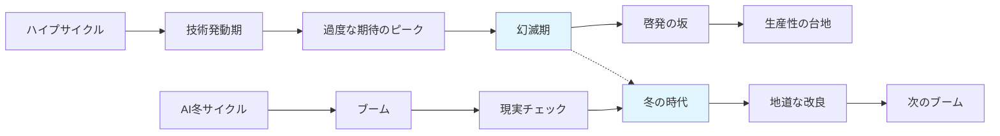

## 💡 メリットとデメリット

### メリット：冬の時代の意外な恩恵

冬の時代は決して悪いことばかりではありません。自然界の冬が土壌を豊かにするように、AI冬も技術発展に重要な役割を果たします。

#### 🌟 主要メリット
1. **現実的な期待値設定**
   - 過度な期待が修正される
   - より実用的な研究にフォーカス

2. **技術の地道な改良**
   - 基礎研究に集中できる
   - 本当に重要な問題の解決

3. **人材の質的向上**
   - 真に技術に興味のある研究者が残る
   - より深い専門性の追求

4. **資源の効率的配分**
   - 無駄な投資が減る
   - 有望な研究への集中

### デメリット：冬の厳しさ

一方で、冬の時代は多くの困難ももたらします。

#### ❄️ 主要デメリット
1. **研究資金の枯渇**
   - プロジェクト中止
   - 研究継続困難

2. **人材の流出**
   - 優秀な研究者の転職
   - 知識とノウハウの散逸

3. **技術発展の遅延**
   - イノベーションの停滞
   - 競争力低下

4. **社会的信頼の失墜**
   - AI技術への懐疑的な見方
   - 将来投資への消極性

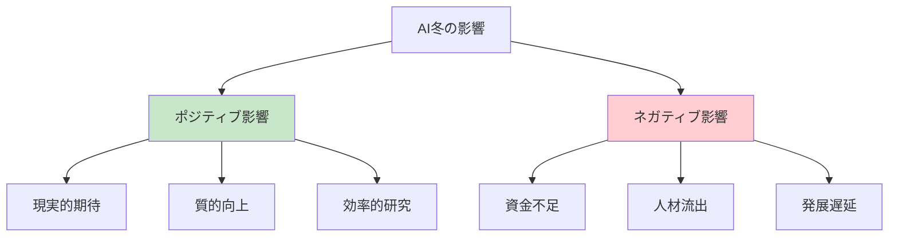

## 🚀 応用と実例

### 身近な実例：スマート家電の例

AI冬の現象は、私たちの身の回りでも観察できます。

**スマートスピーカーの例**
- **ブーム期**（2017-2019）：「家のすべてをAIが管理！」
- **現実チェック**（2020-2021）：「思ったより使わない...」
- **調整期**（2022-現在）：「音楽再生と天気予報が主な用途」

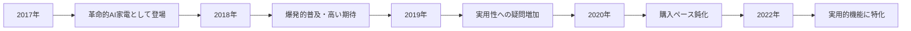

### 企業レベルの実例

#### Google
- **ブーム期**：「AI First」戦略を宣言
- **調整期**：実用的なAI機能に集中（検索、翻訳など）

#### 自動運転業界
- **ブーム期**：「2020年には完全自動運転！」
- **現実チェック**：技術的困難さが明らかに
- **調整期**：段階的自動化への方針転換

## 🚀 置換・変遷

### 何を置き換えたか
AI冬の概念は、従来の「技術発展は直線的」という考え方を置き換えました。

**従来の考え方**
```
研究開始 → 技術向上 → 実用化 → 普及
```

**AI冬を含む現実**
```
研究開始 → ブーム → 冬 → 地道な改良 → 実用化 → 普及
```

### 何かに置き換えられたか

現在、AI冬の概念は以下のような新しい理解に発展しています：

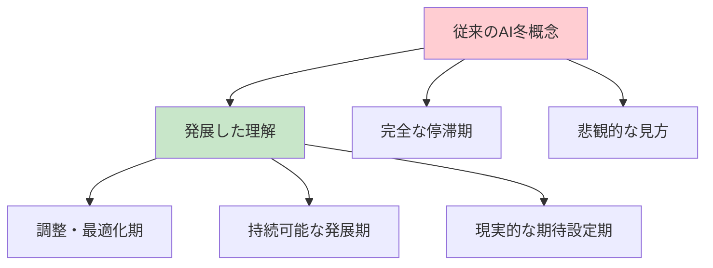

### 継承関係

**AI冬が継承したもの**
- 経済学の景気循環理論
- 技術普及のハイプサイクル
- イノベーション理論

**AI冬から継承されたもの**
- テクノロジーバブル崩壊の予測モデル
- 持続可能な技術開発手法
- 現実的な期待管理手法

## 🚀 代替・競合

### 代替できるもの
AI冬の概念の代わりに使える考え方：

1. **調整期理論**：より前向きな表現
2. **成熟化プロセス**：自然な発展段階として理解
3. **現実化フェーズ**：期待の現実化として捉える

### 競合する概念

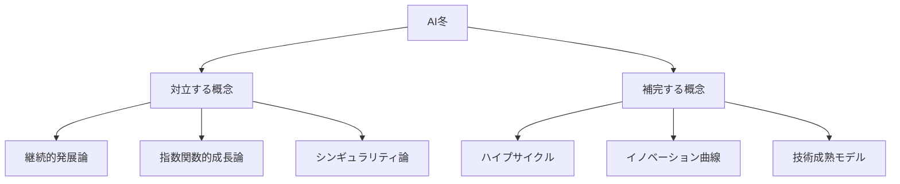

**継続的発展論との対比**
- AI冬論：「技術発展には停滞期がある」
- 継続的発展論：「技術は常に進歩し続ける」

## 🌍 実世界への影響とその後の発展

### 現在の影響

2023年以降、ChatGPTやGPT-4の登場により、AI業界は再び大きな注目を集めています。しかし、同時に「次の冬は来るのか？」という議論も活発化しています。

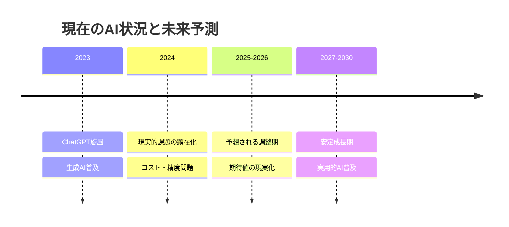

### 未来展望

#### シナリオ1：軽微な調整期（最も可能性高）
- 期間：2-3年
- 特徴：選別的投資、実用化重視
- 結果：より健全な業界発展

#### シナリオ2：本格的AI冬（中程度の可能性）
- 期間：5-8年
- 特徴：大幅な投資削減、研究縮小
- 結果：次世代技術の準備期間

#### シナリオ3：冬なしの継続発展（可能性低）
- 期間：継続的成長
- 特徴：技術的ブレークスルー継続
- 結果：SF的未来の実現

### 学ぶべき教訓

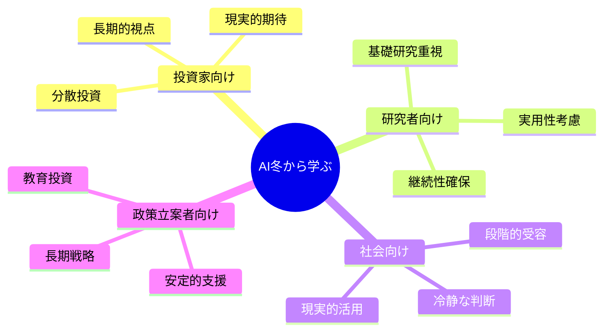

### 最終的な洞察

AI冬の時代は、決して技術の終わりではありません。それは自然界の冬が春への準備期間であるように、より強固で実用的なAI技術が花開くための準備期間なのです。

重要なのは、ブームに踊らされることなく、また冬に絶望することなく、長期的な視点でAI技術の発展を見守り、支援し続けることです。

---


この資料により、初学者はAI冬の時代を単なる「停滞期」ではなく、「技術発展の自然なサイクル」として理解し、長期的で現実的な視点でAI技術の発展を捉えることができるようになります。
