AIのこれまでのブームのうち、第4次AIブームについて

# 第4次AIブーム - 初学者のための完全ガイド

## 🔍 一言要約
**生成AIによる創造革命時代**

## 📚 目次
1. [🌟 はじめに](#-はじめに)
2. [🏗️ 基本構造](#️-基本構造)
3. [⚡ 主要技術](#-主要技術)
4. [📜 時代背景と発見に至った経緯](#-時代背景と発見に至った経緯)
5. [🎨 種類と特徴](#-種類と特徴)
6. [📗 関連する用語](#-関連する用語)
7. [💡 メリットとデメリット](#-メリットとデメリット)
8. [🚀 応用と実例](#-応用と実例)
9. [🔄 置換、変遷](#-置換変遷)
10. [🆚 代替、競合](#-代替競合)
11. [🌍 実世界への影響とその後の発展](#-実世界への影響とその後の発展)

## 🌟 はじめに

第4次AIブームは、まるで「魔法の杖」を手に入れたような技術革命です。これまでは人間だけができると思われていた「創造する」「会話する」「理解する」といった能力を、コンピューターが身につけました。

スマホで写真を撮ると自動で美しく加工されたり、文章を書くとAIが続きを提案してくれたり、質問すると人間のように答えてくれる—これらすべてが第4次AIブームの恩恵です。

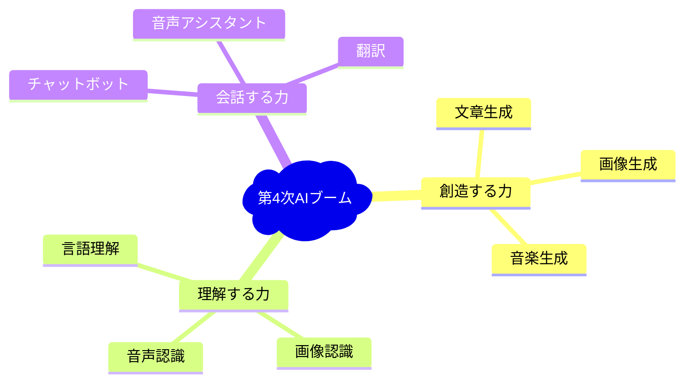

## 🏗️ 基本構造

第4次AIブームの中心は「**大規模言語モデル（LLM）**」という技術です。これは、インターネット上の膨大な文章を読み込んで学習した、超巨大な「言葉の専門家」のようなものです。

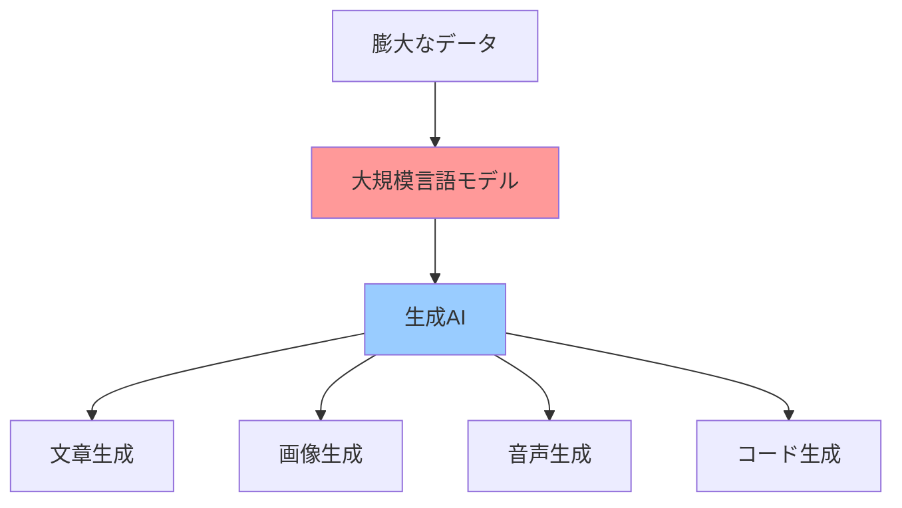

**仕組みの例え話：**
図書館にある全ての本を読破した「超博識な司書さん」を想像してください。この司書さんは、どんな質問にも適切な答えを組み立てて返してくれます。大規模言語モデルは、この司書さんのデジタル版なのです。

## ⚡ 主要技術

### 1. **トランスフォーマー（Transformer）**
- **日常例え**: 文章の「翻訳機」
- **役割**: 文章の前後関係を理解して、適切な返答を生成

### 2. **GPT（Generative Pre-trained Transformer）**
- **日常例え**: 「作文の天才」
- **役割**: 与えられたお題に対して、自然で創造的な文章を書く

### 3. **拡散モデル（Diffusion Model）**
- **日常例え**: 「霧から絵を描く芸術家」
- **役割**: ランダムなノイズから美しい画像を生成

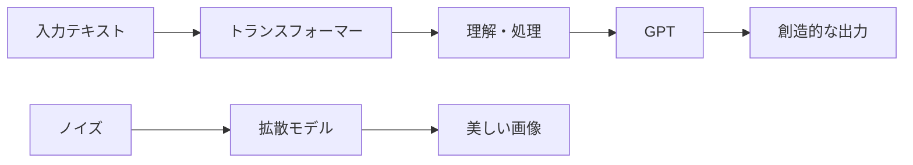

## 📜 時代背景と発見に至った経緯

### **物語：AIの4つの冒険**

昔々、コンピューターの世界で4つの大きな冒険がありました...

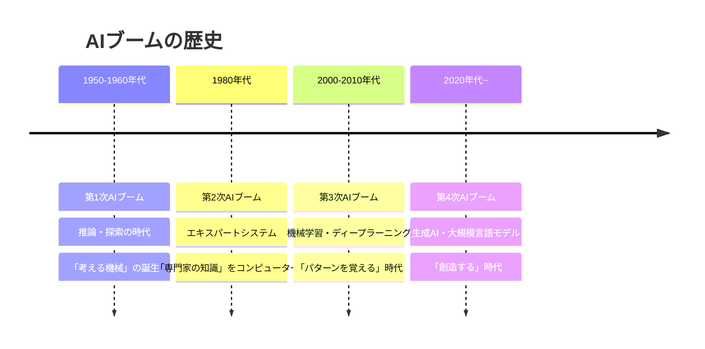

**第4次ブームの転換点：2022年**
- ChatGPTの登場で一般の人々がAIを日常的に使用開始
- 「AI = 専門家だけのもの」から「AI = みんなのもの」へ

## 🎨 種類と特徴

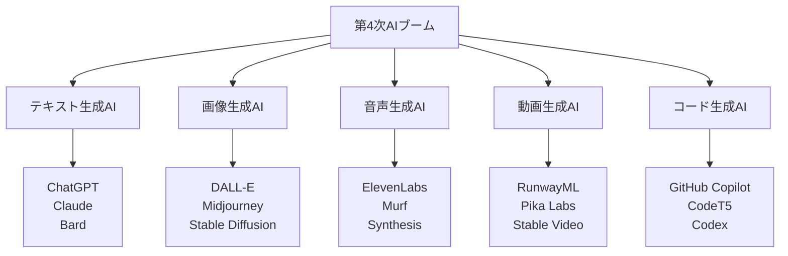

| 種類 | 特徴 | 日常での使用例 |
|------|------|----------------|
| **テキスト生成** | 人間らしい文章作成 | メール作成、レポート執筆、翻訳 |
| **画像生成** | 言葉から画像創造 | イラスト作成、デザイン案、商品画像 |
| **音声生成** | 自然な音声合成 | ナレーション、音声ガイド、歌声合成 |
| **動画生成** | 動画コンテンツ作成 | 広告動画、教育コンテンツ、アニメーション |
| **コード生成** | プログラム自動作成 | アプリ開発、バグ修正、コード最適化 |

## 📗 関連する用語

### **基本用語**
- **生成AI（ジェネレーティブAI）**: 新しいコンテンツを「生み出す」AI
- **プロンプト**: AIに出す「指示書」や「お題」
- **ハルシネーション**: AIが「事実ではない情報を真実として答える」現象

### **技術用語の日常翻訳**
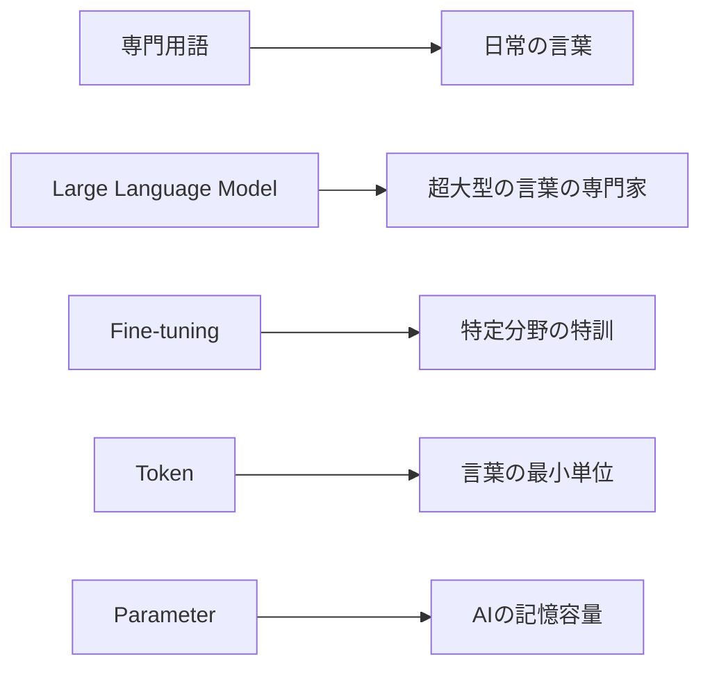

### **類義語の比較**
- **機械学習 vs AI**: 機械学習はAIの一部分（AIという大きな傘の下の技術）
- **深層学習 vs 機械学習**: 深層学習は機械学習の進化版
- **生成AI vs 判別AI**: 生成AIは「作る」、判別AIは「分類する」

## 💡 メリットとデメリット

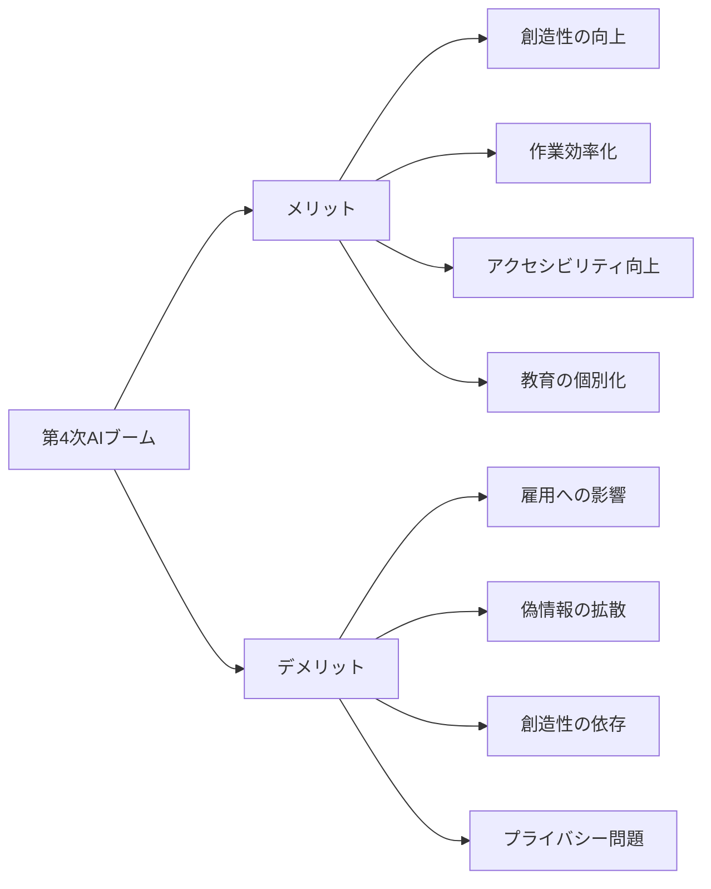

### **メリット**
1. **創造活動の民主化**: 絵が描けない人でも美しいイラストが作れる
2. **学習支援の革命**: 個人に合わせた説明やサポートが受けられる
3. **言語バリアの解消**: 自動翻訳の精度向上で国境を超えたコミュニケーション
4. **作業の効率化**: 単純作業から解放され、より創造的な仕事に集中可能

### **デメリット**
1. **雇用構造の変化**: 一部の職業が自動化される可能性
2. **情報の真偽判断**: AIが生成した偽の情報と真実の区別が困難
3. **思考力への影響**: AIに頼りすぎることで人間の考える力が衰える懸念
4. **倫理的課題**: 著作権や個人情報の取り扱いに関する問題

## 🚀 応用と実例

### **日常生活での活用例**

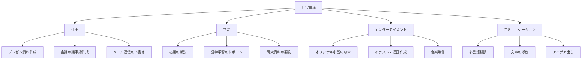

### **具体的な成功事例**
1. **医療分野**: AIが新薬発見を加速（通常10年→3年に短縮）
2. **教育分野**: 個別指導AIが学習効果を30%向上
3. **芸術分野**: AI生成アートが国際コンテストで受賞
4. **ビジネス分野**: カスタマーサポートの自動化で24時間対応実現

## 🔄 置換、変遷

### **何を置き換えたか**

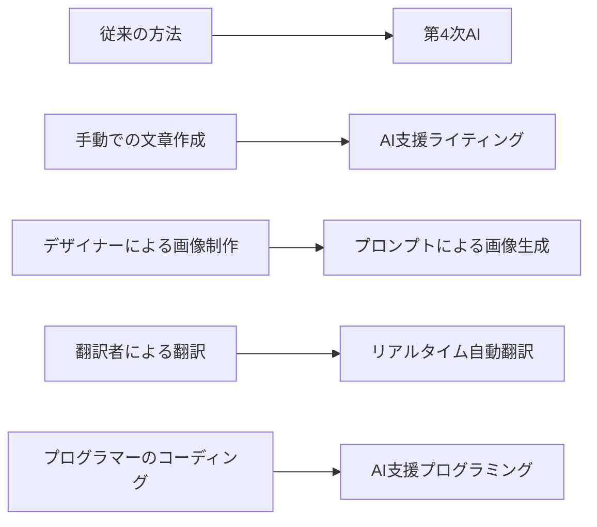

### **何に置き換えられる可能性があるか**
- **短期的（5年以内）**: 定型的な文書作成、基本的な画像編集
- **中期的（10年以内）**: 一部の創作活動、初級プログラミング
- **長期的（20年以内）**: 高度な分析業務、専門的コンサルティング

### **継承関係**
- **継承したもの**: 第3次ブームの機械学習技術を基盤として発展
- **継承されるもの**: 次世代AIの基礎技術として継承予定

## 🆚 代替、競合

### **代替関係**

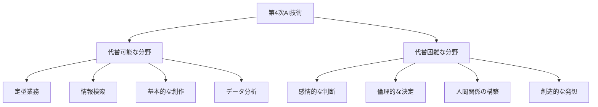

### **競合技術**
1. **従来の検索エンジン vs 対話型AI**: Google検索からChatGPT質問への移行
2. **従来のソフトウェア vs AI統合ツール**: 単機能ツールから多機能AI統合ツールへ
3. **人間のサービス vs AIサービス**: カスタマーサポート、翻訳、コンテンツ制作の競争

## 🌍 実世界への影響とその後の発展

### **社会への影響**

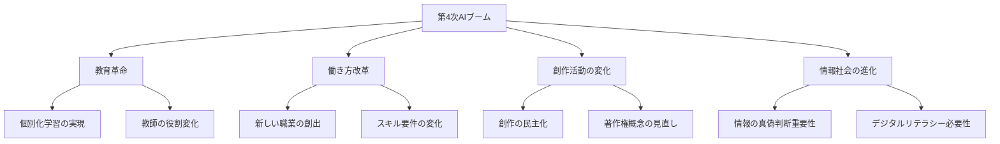

### **未来への発展予測**

**短期展望（2025-2027年）**
- マルチモーダルAI（文字、画像、音声を同時処理）の普及
- AIエージェント（自律的にタスクを実行するAI）の実用化
- 個人専用AIアシスタントの一般化

**中期展望（2028-2032年）**
- AGI（汎用人工知能）への道筋が見え始める
- AIとVR/ARの融合による新体験
- 量子コンピューティングとAIの統合

**長期展望（2033年以降）**
- 人間とAIの協働が当たり前の社会
- 新たな創造性の概念の確立
- 第5次AIブームの萌芽

### **私たちができること**
1. **AI活用スキルの習得**: プロンプトエンジニアリングの基礎を学ぶ
2. **批判的思考力の向上**: AI生成情報の真偽を判断する力を養う
3. **創造性の追求**: AIでは代替できない人間らしい創造性を磨く
4. **倫理観の醸成**: AI時代にふさわしい倫理観を身につける

---

この資料により、読者は第4次AIブームの本質を理解し、自分の生活や仕事にどう活用できるかが明確になります。次のステップとして、具体的なAIツールの使い方やプロンプトエンジニアリングの学習をおすすめします。
