AIのこれまでのブームのうち、第4次AIブーム後の冬の時代について
2025/09/27時点の予測


# 第4次AIブーム後の冬の時代 - 初学者のための完全ガイド

## 🔍 一言要約
「AI革命」の熱狂が冷めた後に訪れる現実的な調整期間と、そこから生まれる真の価値創造期

## 📚 目次
1. [🌟 はじめに - なぜAI冬の時代を学ぶのか](#-はじめに---なぜai冬の時代を学ぶのか)
2. [🏗️ AI冬の時代の基本構造](#️-ai冬の時代の基本構造)
3. [⚡ AI冬の時代の主要特徴](#-ai冬の時代の主要特徴)
4. [📜 AIブームの歴史と第4次ブームの特異性](#-aiブームの歴史と第4次ブームの特異性)
5. [🎨 AI冬の時代の種類と段階](#-ai冬の時代の種類と段階)
6. [📗 関連する用語解説](#-関連する用語解説)
7. [💡 AI冬のメリットとデメリット](#-ai冬のメリットとデメリット)
8. [🚀 現実的な影響と対応策](#-現実的な影響と対応策)
9. [🔄 過去から学ぶ置換と変遷](#-過去から学ぶ置換と変遷)
10. [⚔️ 代替技術と競合関係](#️-代替技術と競合関係)
11. [🌍 社会への長期的影響と未来展望](#-社会への長期的影響と未来展望)

---

## 🌟 はじめに - なぜAI冬の時代を学ぶのか

想像してください。お祭りが終わった後の会場を片付ける作業を。華やかな屋台は撤去され、賑やかだった音楽も止み、残るのは現実的な清掃作業です。

**AI冬の時代**とは、まさにこの「お祭り後の片付け期間」に似ています。第4次AIブーム（2010年代後半〜2020年代前半）で「AI革命だ！」「すべてがAIで変わる！」と騒がれた熱狂が冷め、現実的な課題と向き合う時期のことです。

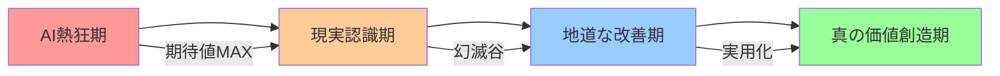

この時期を理解することで、AI技術の**本当の価値**と**現実的な限界**を見極められるようになります。

---

## 🏗️ AI冬の時代の基本構造

AI冬の時代は、まるで「バブル経済の崩壊」に似た構造を持っています。

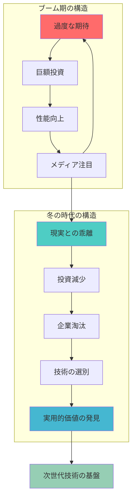

### 基本的な流れ
1. **熱狂の終焉**: 「AIで何でもできる」という期待の現実化
2. **投資の冷却**: ベンチャーキャピタルや企業投資の大幅減少
3. **企業の選別**: 本当に価値のある企業だけが生き残り
4. **技術の洗練**: 派手さより実用性を重視した開発へシフト

---

## ⚡ AI冬の時代の主要特徴

AI冬の時代には、以下のような特徴的な現象が見られます：

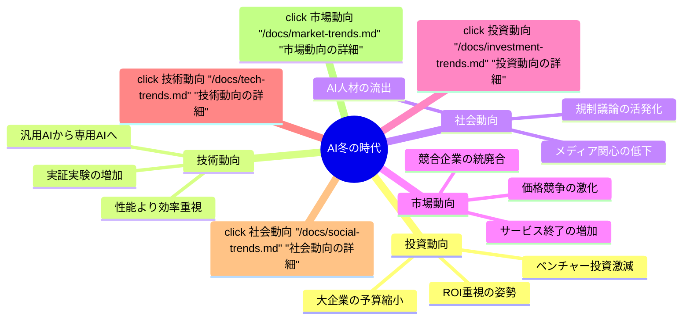

### 特に重要な変化

**1. 期待値の正常化**
- 「AIが人間を超える」→「AIは人間を補助する」
- 「すべての仕事がAIに」→「特定の作業がAIで効率化」

**2. 投資基準の厳格化**
- 「将来性への投資」→「現在の収益性重視」
- 「技術の新しさ」→「ビジネス価値の明確さ」

**3. 実用化の加速**
- 「研究開発中心」→「実際の問題解決中心」
- 「汎用技術」→「特化型ソリューション」

---

## 📜 AIブームの歴史と第4次ブームの特異性

AIの歴史は「期待と幻滅の繰り返し」として知られています。まるで恋愛関係のように、熱烈な期待の後に現実に直面するパターンを繰り返してきました。

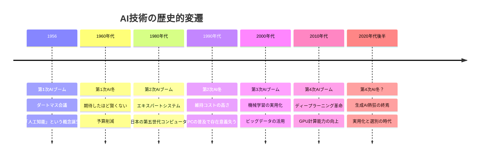

### 第4次ブームの特異性

**規模の違い**
- 過去のブーム：学術界・一部企業中心
- 第4次ブーム：全世界の消費者まで巻き込む

**技術の成熟度**
- 過去：理論先行、実用性に課題
- 第4次：実際に使える技術として普及

**社会的影響**
- 過去：限定的な業界への影響
- 第4次：労働市場全体への影響懸念

---

## 🎨 AI冬の時代の種類と段階

AI冬の時代は、一様ではありません。まるで季節の変化のように、段階的に進行します。

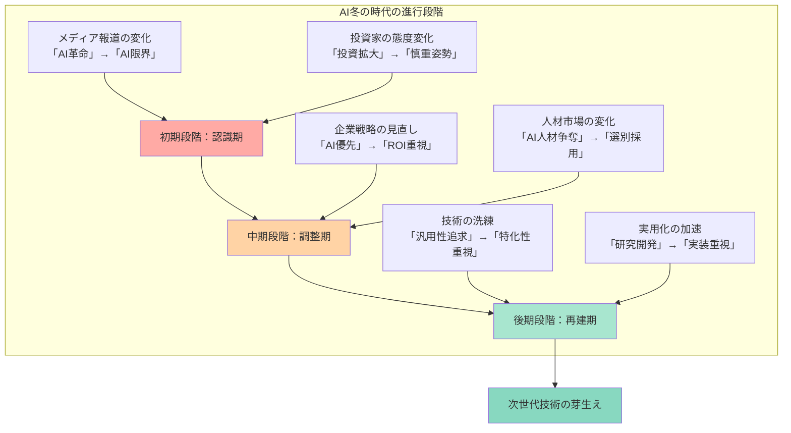

### 各段階の特徴

**初期段階：認識期（1-2年）**
- AI技術の限界が明らかになる時期
- メディアの論調が批判的に変化
- 投資額の減少が始まる

**中期段階：調整期（2-3年）**
- 企業の事業戦略大幅見直し
- AI関連企業の統廃合が活発化
- 技術者の転職・転業が増加

**後期段階：再建期（3-5年）**
- 実用的なAI技術に絞った開発
- 特定分野での確実な価値創造
- 次世代技術の基盤形成

---

## 📗 関連する用語解説

AI冬の時代を理解するために知っておくべき重要な用語を、日常的な例えで説明します。

### 🔤 基本用語

**AIバブル（AI Bubble）**
- **意味**: AI技術への過度な期待と投資が生み出す市場の歪み
- **例え**: 不動産バブルと同じ。実際の価値以上に評価が高騰する状態
- **関連語**: テックバブル、ドットコムバブル

**ハイプサイクル（Hype Cycle）**
- **意味**: 新技術が「期待の頂点→幻滅の谷→実用化」を辿る周期
- **例え**: 新しいダイエット法の流行と定着のパターン
- **段階**: 黎明期 → 過度な期待 → 幻滅の谷 → 啓発の坂 → 生産性の高原

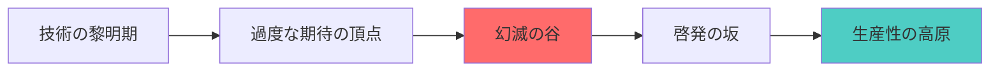

### 🔄 比較用語

**汎用AI vs 特化型AI**
- **汎用AI**: 人間のようにあらゆることができるAI（まだ実現していない）
- **特化型AI**: 特定の作業に特化したAI（現在の主流）
- **例え**: 汎用AI = 万能選手、特化型AI = 専門スペシャリスト

**AGI vs ANI**
- **AGI（Artificial General Intelligence）**: 人工汎用知能
- **ANI（Artificial Narrow Intelligence）**: 人工狭知能（現在のAI）

---

## 💡 AI冬のメリットとデメリット

AI冬の時代は、一見するとネガティブに思えますが、実際にはメリットとデメリットが混在しています。

### ✅ メリット（良い面）

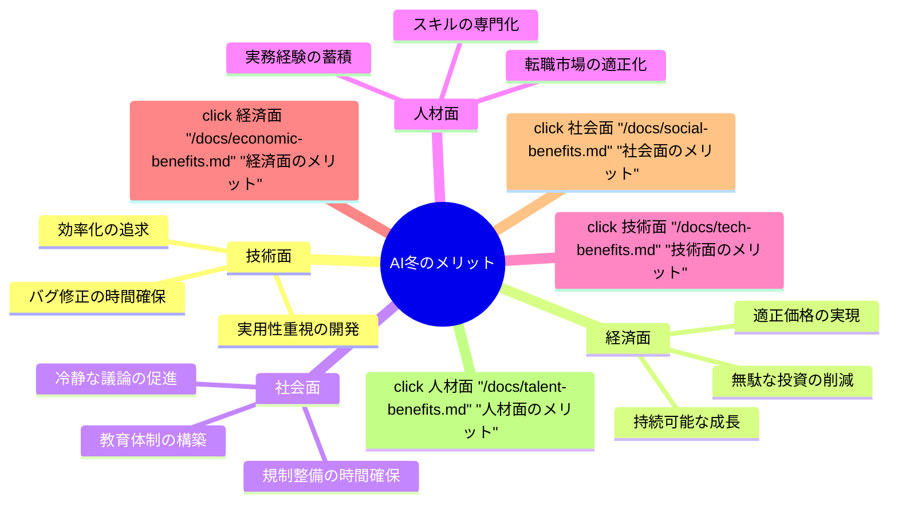

**1. 技術の質向上**
- 派手な機能より、確実に動く機能を重視
- セキュリティや安全性への配慮が向上
- 長期間使える安定した技術の開発

**2. 市場の健全化**
- 過度な競争から協調的な発展へ
- 適正な価格設定とサービス品質
- 消費者にとってより良い選択肢

**3. 人材の成熟**
- 「AI万能論」から脱却した現実的な技術者
- 地道な改善を重視する文化
- 実際のビジネス価値を理解した人材

### ❌ デメリット（課題面）

**1. 投資・研究の停滞**
- 基礎研究への資金減少
- 長期的な技術革新の遅れ
- 優秀な研究者の他分野流出

**2. 雇用への影響**
- AI関連企業での大規模リストラ
- スタートアップの倒産増加
- 関連業界全体の縮小

**3. 技術発展の遅れ**
- 革新的なアイデアへの投資減少
- 安全志向による挑戦の回避
- 国際競争力の一時的低下

---

## 🚀 現実的な影響と対応策

AI冬の時代が私たちの日常生活や仕事にどのような影響を与え、どう対応すべきかを具体的に見ていきましょう。

### 📊 業界別影響度マップ

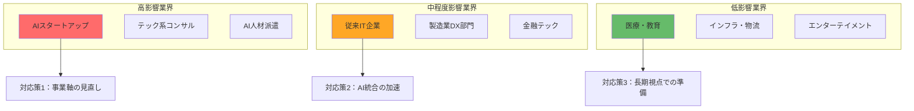

### 🎯 個人レベルでの対応策

**技術者の場合**
1. **スキルの多様化**: AI一辺倒から、従来技術との組み合わせ重視
2. **実務経験の重視**: 理論より実際のプロジェクト経験を積む
3. **業界知識の習得**: AI技術を活かす具体的な業界を深く理解

**ビジネスパーソンの場合**
1. **冷静な判断力**: AI導入の費用対効果を厳密に評価
2. **段階的導入**: 小規模な実証実験から始める
3. **人間の価値再認識**: AIで代替できない人間の強みを伸ばす

**投資家の場合**
1. **デューデリジェンスの強化**: 技術力だけでなく収益性を重視
2. **長期視点**: 短期的な流行より持続可能な価値創造を評価
3. **リスク分散**: AI関連投資の比重を調整

### 🏢 企業レベルでの対応策

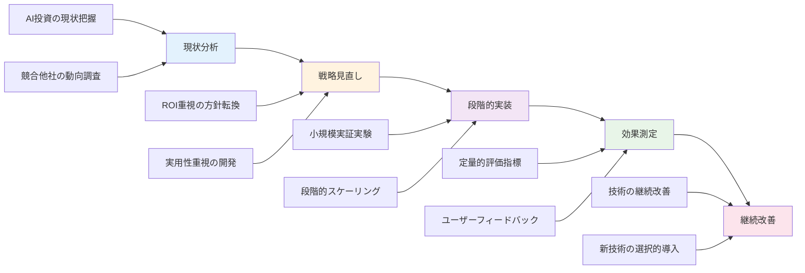

---

## 🔄 過去から学ぶ置換と変遷

AI技術の発展は、他の技術分野との複雑な関係の中で進化してきました。

### 🔄 何を置き換えたか

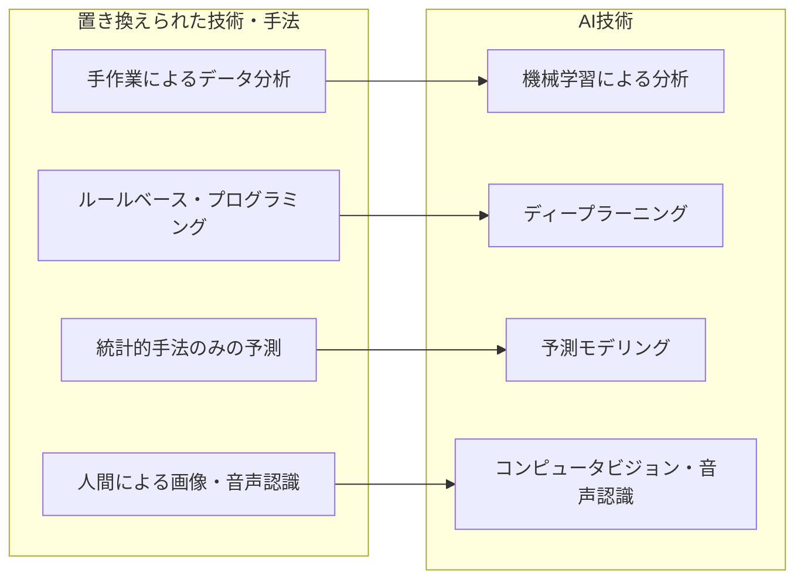

### 🔄 何に置き換えられる可能性があるか

**短期的（2-5年）**
- より効率的なAIアルゴリズム
- エッジコンピューティング技術
- 量子コンピューティングの限定的応用

**長期的（5-15年）**
- 生体模倣型コンピューティング
- 完全な量子AI
- 新しい計算パラダイム

### 📈 継承関係の系譜

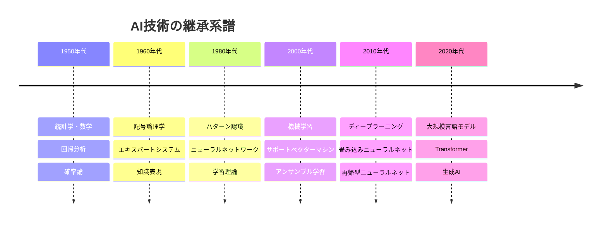

---

## ⚔️ 代替技術と競合関係

AI冬の時代には、AI技術以外の解決手段が再評価される傾向があります。

### 🆚 主要な代替技術

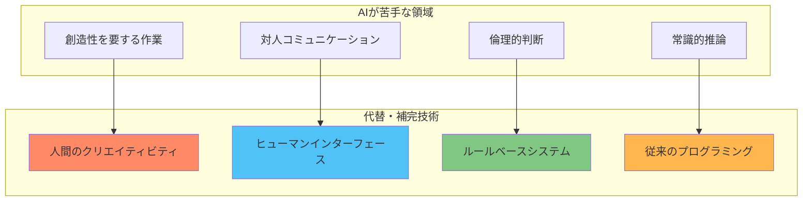

### 🤝 競合から協調への転換

**従来の競合関係**
- AI vs 人間の労働
- AI vs 従来システム
- AI企業同士の技術競争

**冬の時代の協調関係**
- AI + 人間の協働
- AI + 既存システムの統合
- AI企業同士の標準化協力

### 💊 薬事・医療分野での特殊事情

医療AIは他分野と異なる特殊な状況にあります：

**規制の厳しさ**
- FDA承認の長期間化
- 医療事故責任の明確化
- 患者データプライバシー

**冬の時代への抗性**
- 人命に関わる重要性
- 継続的な研究開発資金
- 長期的視点での投資

---

## 🌍 社会への長期的影響と未来展望

AI冬の時代は、一時的な停滞期ではなく、AI技術が社会に根付くための重要な調整期間です。

### 📊 社会システムへの影響予測

```mermaid
sankey-beta
    %% 社会への影響の流れ図
    AI冬の時代,教育システム,30
    AI冬の時代,労働市場,40
    AI冬の時代,規制政策,20
    AI冬の時代,国際競争,10
    
    教育システム,AI素養教育,15
    教育システム,従来スキル再評価,15
    
    労働市場,職種の再定義,20
    労働市場,スキル要件変化,20
    
    規制政策,AI倫理ガイドライン,10
    規制政策,安全基準策定,10
    
    国際競争,技術標準争い,5
    国際競争,人材獲得競争,5
```

### 🔮 10年後の予測シナリオ

**楽観シナリオ（60%の確率）**
- AIが特定分野で確実な価値を提供
- 人間とAIの役割分担が明確化
- 新しい産業分野の創出

**中立シナリオ（30%の確率）**
- AI技術の段階的な改善継続
- 現在の延長線上での発展
- 大きな革命的変化なし

**悲観シナリオ（10%の確率）**
- AI技術への信頼失墜
- 長期間の技術停滞
- 他国との技術格差拡大

### 🌱 次世代技術の芽生え

AI冬の時代の中で、次の技術革命の種が育っています：

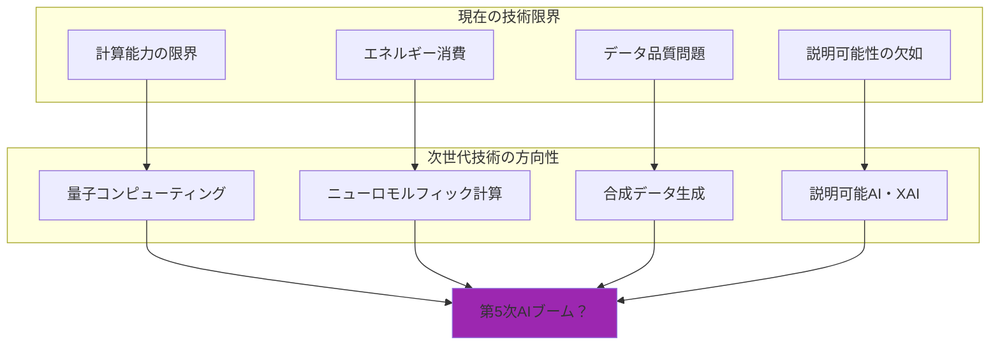

### 🎯 個人・組織の長期戦略

**個人レベル**
1. **技術リテラシーの継続学習**: 基礎的なAI知識を維持しつつ、実用的なスキルを習得
2. **AIに代替されにくいスキルの習得**: 創造性、対人関係、批判的思考力の向上
3. **柔軟性の維持**: 技術変化に対応できる適応力の養成
4. **長期視点の投資**: 一時的な流行に惑わされない学習計画

**組織レベル**
1. **技術投資の最適化**: ROIを重視した段階的なAI導入
2. **人材育成の継続**: AI冬の時代こそ人材への投資を強化
3. **リスク分散**: AI技術への依存度を適切にコントロール
4. **標準化への参画**: 業界標準の策定プロセスへの積極的関与

### 🌈 希望的未来像

AI冬の時代を経て実現される理想的な未来：

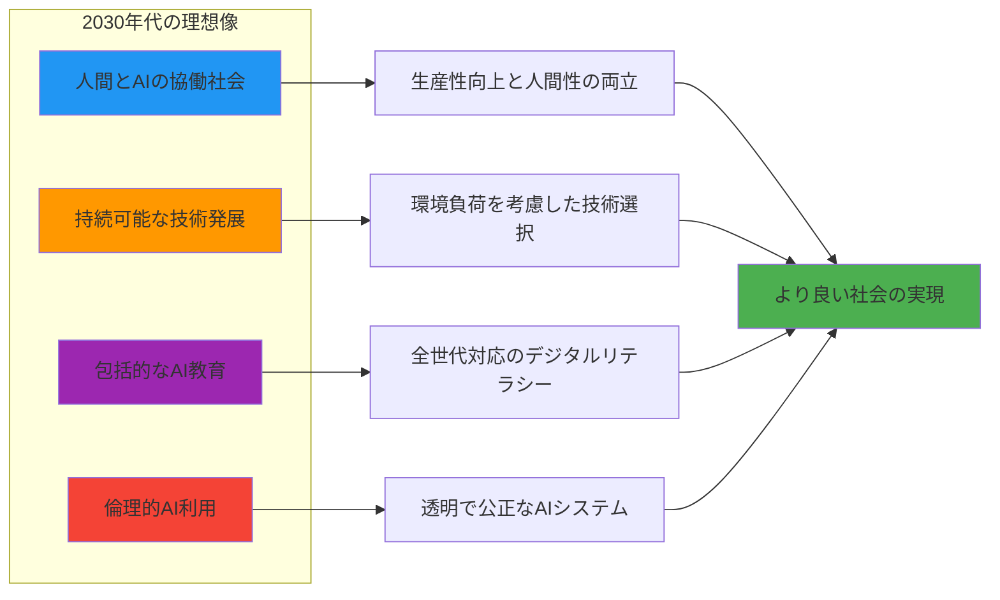

---

## 🏆 まとめ：AI冬の時代を生き抜く知恵

AI冬の時代は、決して悲観すべき時期ではありません。むしろ、AI技術が本当に価値のある形で社会に定着するための**必要な調整期間**です。

### 🎯 重要なポイントの再確認

1. **冷静な現実認識**: AI技術の可能性と限界を正しく理解
2. **長期的視点**: 一時的な流行に惑わされない持続可能な戦略
3. **人間の価値再発見**: AIでは代替できない人間独自の強みを活かす
4. **段階的アプローチ**: 小さな成功を積み重ねる実用的な導入方法
5. **協調的発展**: 競争より協力を重視した技術発展

### 🌟 最終メッセージ

歴史が示すように、技術の「冬の時代」は次の「春」への準備期間です。AI冬の時代を恐れるのではなく、**真に価値のあるAI技術を育てる貴重な機会**として捉えましょう。

この時期に培われた実用的な知識と経験は、次世代のAI技術革新の確固たる基盤となります。私たちは今、AI技術の歴史における重要な転換点に立っているのです。

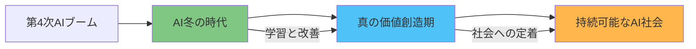

---

## 📚 参考資料とさらなる学習

### 🔗 関連リンク
- [AI技術の歴史詳細](/docs/ai-history-detailed.md)
- [投資動向分析レポート](/docs/investment-trend-analysis.md)
- [業界別影響度調査](/docs/industry-impact-survey.md)
- [次世代技術予測](/docs/next-gen-tech-prediction.md)

### 📖 推薦図書
- 「AIの歴史と未来」- 技術発展の周期性を学ぶ
- 「ハイプサイクル理論」- 技術普及のパターン理解
- 「デジタル変革の現実」- 企業変革の実践事例

### 🎓 学習コース
- [AI冬の時代サバイバルガイド](/courses/ai-winter-survival.md)
- [実用的AI導入戦略](/courses/practical-ai-strategy.md)
- [次世代技術準備コース](/courses/next-gen-tech-prep.md)

---

**📅 最終更新**: 2025年9月
**📊 文書バージョン**: 1.0
**🔄 次回更新予定**: 2025年12月

---

*この資料は、AI冬の時代を理解し、適切に対応するための包括的なガイドです。技術の変化は継続的であり、柔軟な思考と継続的な学習が成功の鍵となります。*
