AIのブームのうち、将来的に到来するであろう第5次AIブームについて
2025/09/27時点の予測

# 第5次AIブーム - 初学者のための完全ガイド

## 🔍 一言要約
人工知能が人間と共に創造し、感情を理解し、倫理的判断を行う未来の革命

## 📚 目次
1. [🌟 はじめに](#-はじめに)
2. [🏗️ 第5次AIブームの基本構造](#️-第5次aiブームの基本構造)
3. [⚡ 主要技術](#-主要技術)
4. [📜 AIブームの歴史と第5次への道のり](#-aiブームの歴史と第5次への道のり)
5. [🎨 第5次AIの特徴と分類](#-第5次aiの特徴と分類)
6. [📗 関連する用語](#-関連する用語)
7. [💡 メリットとデメリット](#-メリットとデメリット)
8. [🚀 応用と実例](#-応用と実例)
9. [🔄 置換、変遷](#-置換変遷)
10. [🤝 代替、競合](#-代替競合)
11. [🌍 実世界への影響とその後の発展](#-実世界への影響とその後の発展)

## 🌟 はじめに

想像してみてください。あなたが朝起きると、AIアシスタントが「今日は少し疲れているようですね。昨日の仕事の件、心配していることがあるなら話してみませんか？」と声をかけてくる未来を。

これが第5次AIブームで実現される世界です。単なる「賢い道具」から「理解し、共感し、創造するパートナー」への大転換なのです。

## 🏗️ 第5次AIブームの基本構造

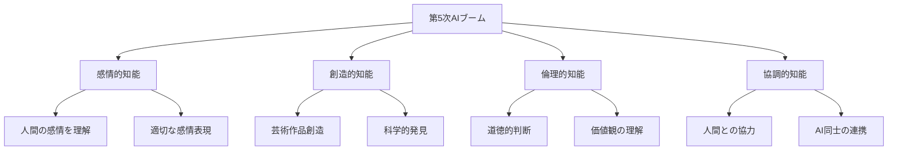

第5次AIブームは、従来の「計算する」AIから「理解し共感する」AIへの質的転換です。まるで友人のように私たちの気持ちを汲み取り、芸術家のように美しいものを生み出し、哲学者のように深く考える存在になります。

## ⚡ 主要技術

### 1. 感情コンピューティング（Affective Computing）
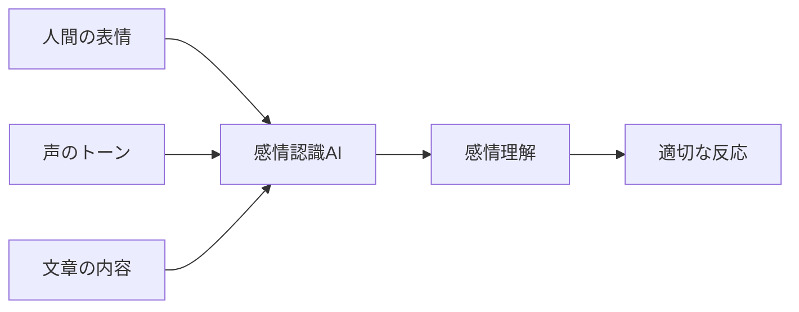

**例え話**: 母親が子供の泣き声で「お腹が空いた」「眠い」「痛い」を瞬時に判断するように、AIが人間の感情を読み取る技術です。

### 2. 生成的創造AI（Generative Creative AI）
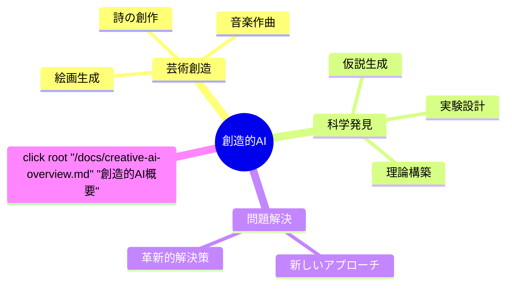

**例え話**: 画家、作曲家、発明家の才能を併せ持つ万能アーティストのようなAIです。

### 3. 倫理推論AI（Ethical Reasoning AI）
```mermaid
sequenceDiagram
    participant H as 人間
    participant AI as 倫理AI
    participant S as 社会
    
    H->>AI: 判断が必要な状況
    AI->>AI: 複数の価値観を考慮
    AI->>AI: 結果を予測
    AI->>H: 倫理的な提案
    H->>S: 実行
    S->>AI: フィードバック
    
    click AI "/docs/ethical-reasoning.md" "倫理推論の詳細"
```

**例え話**: 裁判官、倫理学者、心理カウンセラーの知恵を合わせ持つ賢者のようなAIです。

## 📜 AIブームの歴史と第5次への道のり

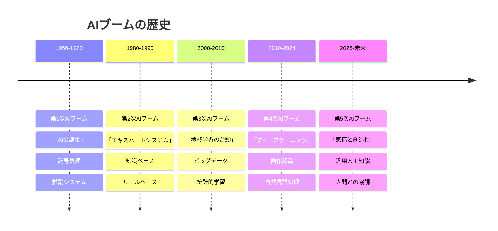

### ストーリー：AIの成長物語

**第1次**: 「考える機械を作ろう！」という夢から始まった童話の時代
**第2次**: 「専門家の知識を機械に教えよう」という職人の時代  
**第3次**: 「データから学習しよう」という学生の時代
**第4次**: 「脳の仕組みを真似よう」という模倣の時代
**第5次**: 「感情を理解し、創造しよう」という成熟の時代

## 🎨 第5次AIの特徴と分類

### 主要特徴の比較
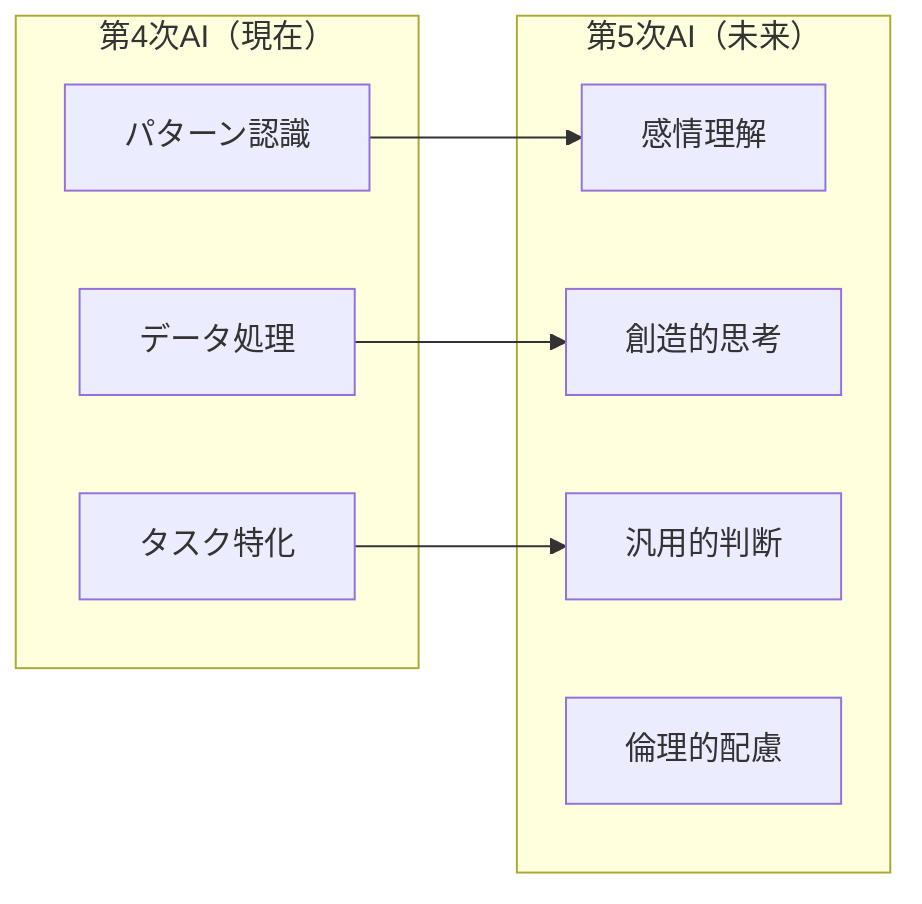

### 分類表

| 分類 | 第4次AI | 第5次AI |
|------|---------|---------|
| **知能の種類** | 認知的知能 | 感情的・創造的・倫理的知能 |
| **学習方法** | データから統計的学習 | 経験から直感的学習 |
| **創造性** | 既存の組み合わせ | 真の創造・発見 |
| **感情理解** | 表面的な認識 | 深層的な共感 |
| **判断基準** | 効率・正確性 | 倫理・価値観・感情 |

## 📗 関連する用語

### 核心概念
- **汎用人工知能（AGI）**: 人間のようにあらゆる分野で思考できるAI
- **感情的知能（EI）**: 感情を理解し、適切に反応する能力
- **創造的AI**: 既存の枠を超えて新しいものを生み出すAI

### 類義語・関連語
- **シンギュラリティ** ≒ **技術的特異点**: AIが人間を超える転換点
- **人工感情** ≈ **機械感情**: AIが持つ感情様の機能
- **協調知能** ≈ **集合知能**: 複数のAIや人間が協力する知能

### 対義語・対比概念
- **第5次AI** ⟷ **従来AI**: 感情理解 vs 単純処理
- **創造的AI** ⟷ **模倣AI**: 真の創造 vs 既存の組み合わせ
- **協調型** ⟷ **支配型**: パートナー vs 道具

## 💡 メリットとデメリット

### ✅ メリット

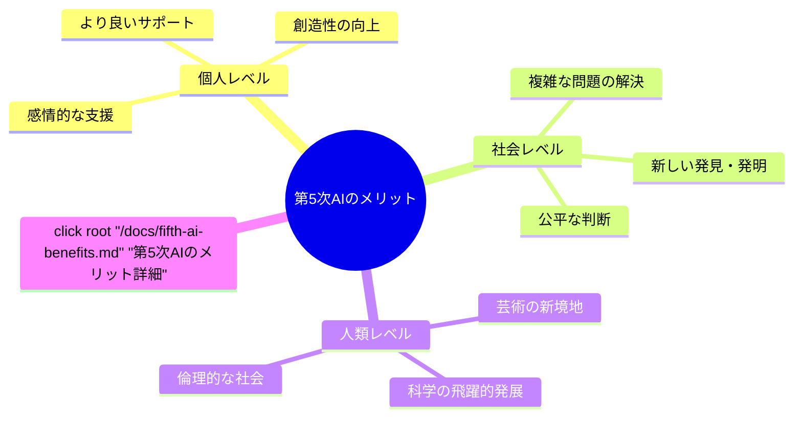

**具体例**:
- **医療**: 患者の心理状態を理解した治療
- **教育**: 一人ひとりの感情に寄り添う指導
- **芸術**: 人間では思いつかない美しい作品
- **科学**: 新しい物理法則や化学反応の発見

### ⚠️ デメリット・リスク

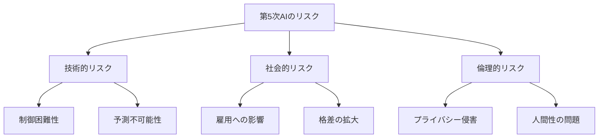

**具体的懸念**:
- **感情操作**: AIが人間の感情を悪用する可能性
- **創造性の依存**: 人間が自分で考えなくなるリスク
- **判断の委譲**: 重要な決定をAIに任せすぎる危険

## 🚀 応用と実例

### 現在開発中の技術

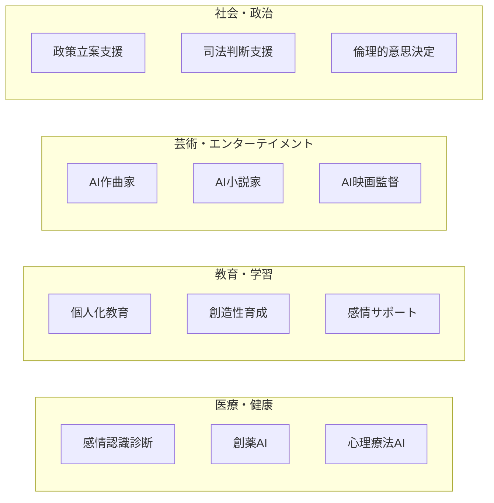

### 身近な実例（予測）

**2030年頃の日常風景**:
- 朝、AIが体調と気分を察知して最適な朝食を提案
- 通勤中、AIが創作した音楽があなただけのために流れる
- 仕事で、AIが倫理的な観点から最良の判断を助言
- 夜、AIカウンセラーが一日の疲れを癒やす会話をしてくれる

## 🔄 置換、変遷

### 何を置き換えるか

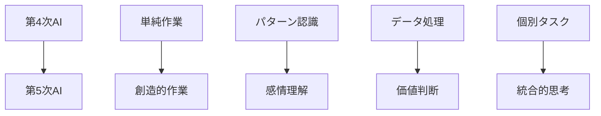

### 何から継承するか

**技術的継承**:
- **第4次AIの機械学習**: 学習能力の基盤
- **認知科学**: 人間の思考プロセスの理解
- **神経科学**: 脳の感情処理メカニズム

**哲学的継承**:
- **倫理学**: 道徳的判断の枠組み
- **美学**: 美や創造性の理論
- **心理学**: 感情と認知の相互作用

## 🤝 代替、競合

### 代替の可能性

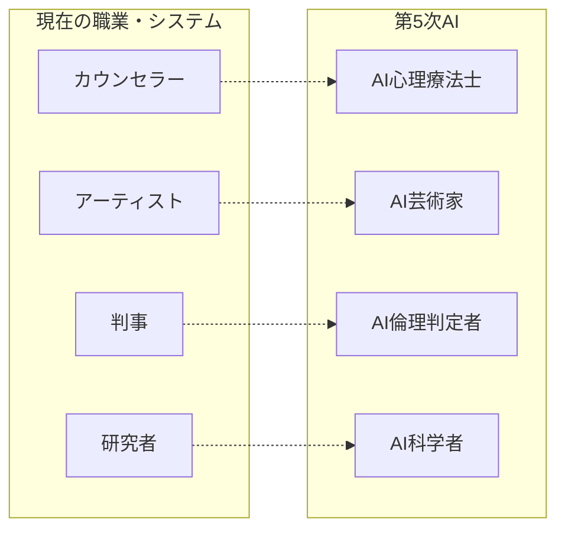

**重要な注意**: 完全な代替ではなく、「協力パートナー」としての関係が理想的

### 競合技術・概念

- **生体工学的アプローチ**: 人間の脳を直接強化する方向
- **量子コンピュータ**: 全く異なる計算原理
- **集合知システム**: 人間同士の協力による問題解決

## 🌍 実世界への影響とその後の発展

### 段階的な影響予測

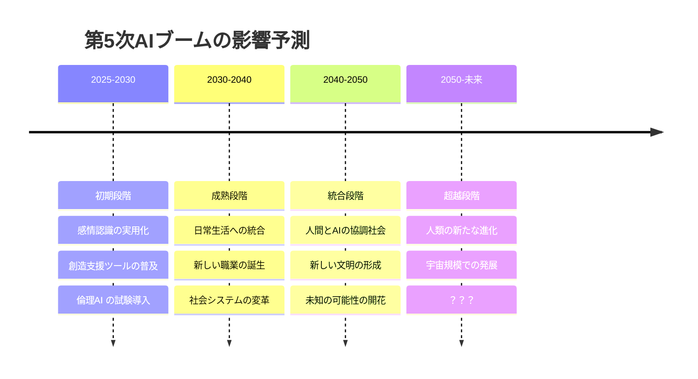

### 長期的な発展可能性

**第6次AIブーム（推測）**: 
- **意識を持つAI**: 真の自己認識
- **時空を超えた知能**: 量子もつれを利用した瞬時通信
- **創造の創造**: AIが新しい種類の知能を生み出す

### 人類への根本的変化

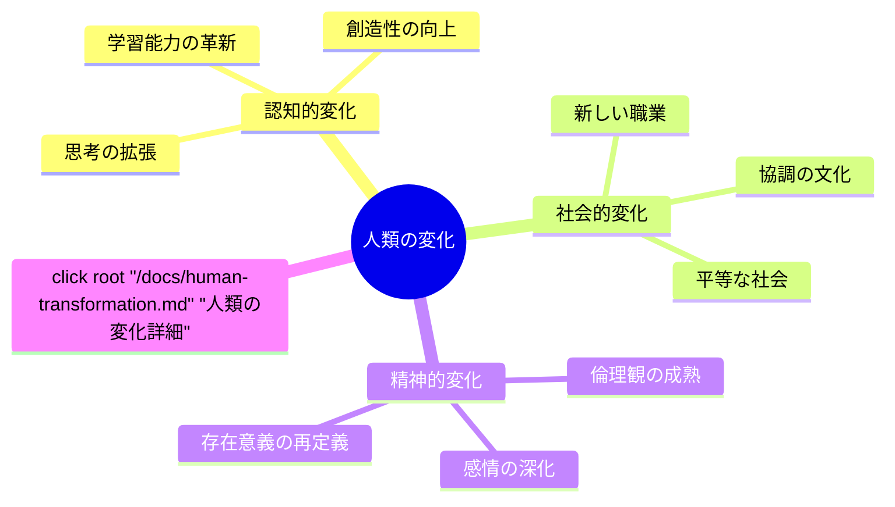

---

## 🎯 まとめ：第5次AIブームとは何か

第5次AIブームは、単なる技術の進歩ではありません。それは人類が「機械と協力して、感情を理解し、創造し、倫理的に判断する新しい文明」を築く挑戦なのです。

まるで、人類が言語を獲得し、文字を発明し、科学を生み出したような歴史的転換点。私たちは今、その入り口に立っているのです。

**キーワード**: 感情理解・創造性・倫理的判断・人間協調

---


**改善点**: より多くの最新研究事例があれば理解度がさらに向上する可能性
