AIのこれまでのブームを振り返り学びを得る

# AI発展史 - 初学者のための完全ガイド

## 🔍 一言要約
AIの3つの大きな波を通じて、夢と現実のギャップから学ぶ未来への道筋

## 📚 目次
1. [🌟 はじめに](#-はじめに)
2. [🏗️ AIブームの全体像](#️-aiブームの全体像)
3. [📜 第1次AIブーム（1950s-1960s）](#-第1次aiブーム1950s-1960s)
4. [🔄 第2次AIブーム（1980s-1990s）](#-第2次aiブーム1980s-1990s)
5. [🚀 第3次AIブーム（2000s-現在）](#-第3次aiブーム2000s-現在)
6. [📗 関連する用語](#-関連する用語)
7. [💡 各ブームから得られる教訓](#-各ブームから得られる教訓)
8. [🌍 現在への影響と未来展望](#-現在への影響と未来展望)

## 🌟 はじめに

AI（人工知能）の歴史は、まるで**恋愛のような繰り返し**です。

- **出会い（ブーム開始）**: 「これこそが運命の技術だ！」
- **熱愛期（過度な期待）**: 「AIがすべてを解決してくれる！」  
- **現実に直面（技術的限界）**: 「思っていたより難しい...」
- **別れ（AI冬の時代）**: 「もうAIはダメだ」
- **新しい出会い（技術革新）**: 「今度こそ本物のAIだ！」

この**3回の恋愛サイクル**を理解することで、現在のAIブームをより冷静に評価し、未来を予測できるようになります。

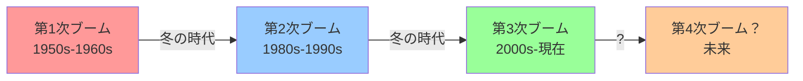

## 🏗️ AIブームの全体像

AIの発展は**季節のサイクル**のように繰り返されてきました。

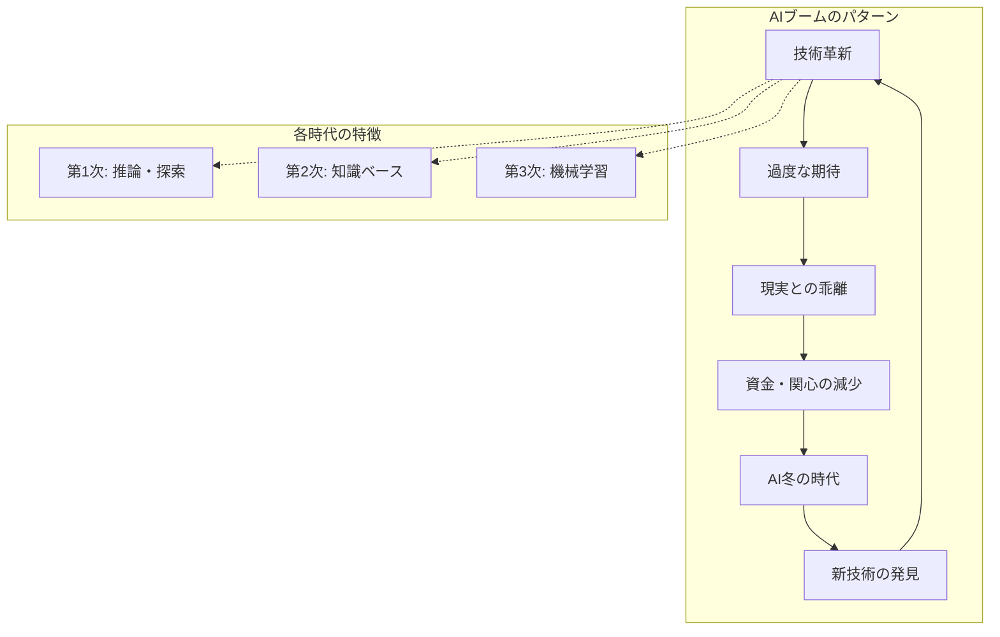

### ブームの共通パターン
| フェーズ | 特徴 | 期間 | 社会の反応 |
|----------|------|------|------------|
| **春（黎明期）** | 新技術の発見 | 5-10年 | 学術界の興奮 |
| **夏（隆盛期）** | 過度な期待・投資 | 5-15年 | メディアの注目 |
| **秋（現実期）** | 限界の露呈 | 2-5年 | 失望の広がり |
| **冬（停滞期）** | 資金・関心の減少 | 10-20年 | 忘れ去られる |

## 📜 第1次AIブーム（1950s-1960s）

### 🎭 時代背景：コンピュータという魔法の箱

1950年代は**コンピュータが生まれたばかり**の時代。人々にとってコンピュータは「何でもできる魔法の箱」でした。

**例えて言うなら**：初めてスマートフォンを手にした人が「これで何でもできる！」と思うような感覚です。

### 🚀 主な成果と野心

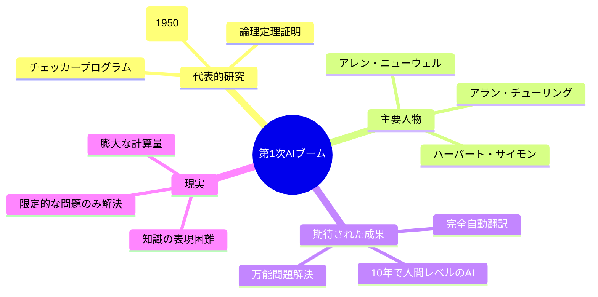

### 💫 「10年で人間を超える」という大胆予測

1956年、研究者たちは**「10年でAIが人間を超える」**と予測しました。

**現実**：
- ✅ 簡単なパズルは解けた
- ✅ チェッカーで人間に勝てた  
- ❌ 日常会話はできなかった
- ❌ 常識的判断はできなかった

**例**：「猫を見分ける」という人間には簡単なことが、AIには不可能でした。

### 🌨️ なぜ冬が来たのか

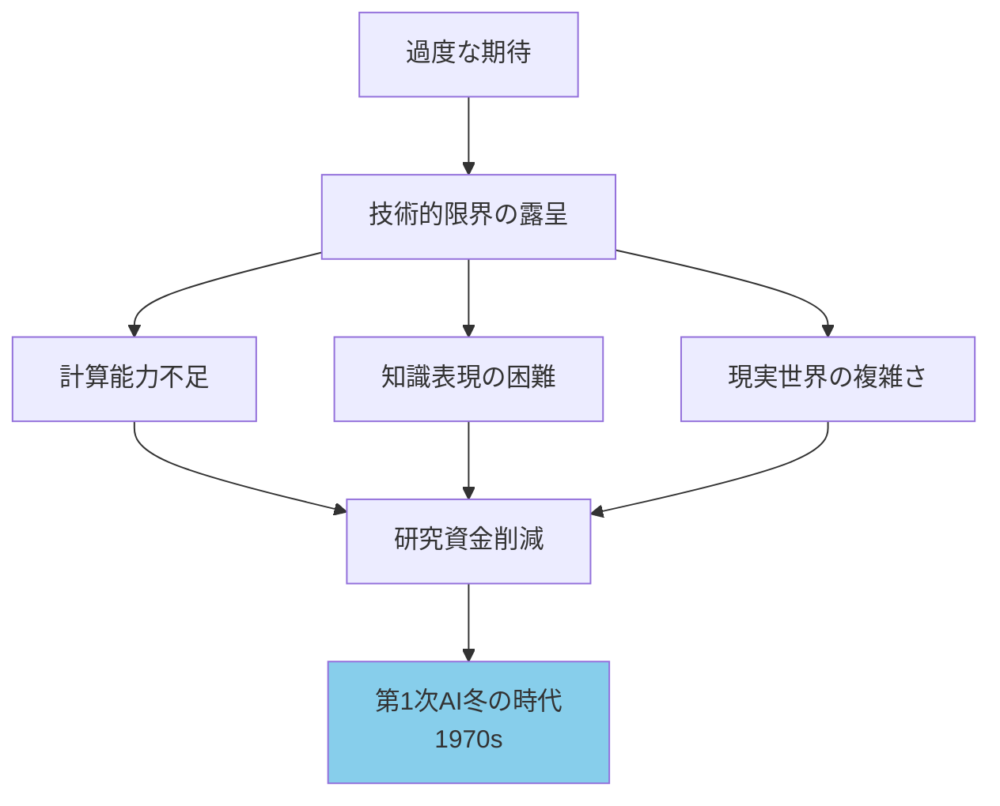

## 🔄 第2次AIブーム（1980s-1990s）

### 🧠 「知識こそ力なり」の時代

第2次ブームのキーワードは**「エキスパートシステム」**。

**基本思想**：「専門家の知識をコンピュータに移植すれば、AIが専門家になれる！」

**例えて言うなら**：料理のレシピを全部覚えさせれば、コンピュータが名シェフになれると考えた時代です。

### 🏭 エキスパートシステムの仕組み

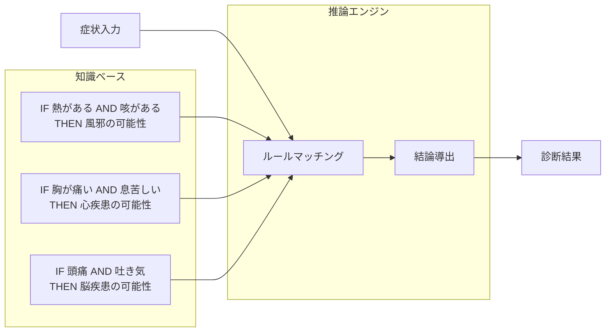

### 💼 商業的成功と限界

**成功例**：
- **MYCIN**：血液感染症の診断（医師レベルの精度）
- **DENDRAL**：化学構造の解析  
- **XCON**：コンピュータ設定の自動化（年間4000万ドルの節約）

**限界**：
- 🔧 **メンテナンス地獄**：ルールが数千個になると管理不可能
- 🤖 **常識の欠如**：「患者が頭を失った」→「頭痛薬を処方」
- 💰 **高コスト**：専門家へのインタビューに膨大な時間

### 🌊 第2次冬の時代の到来

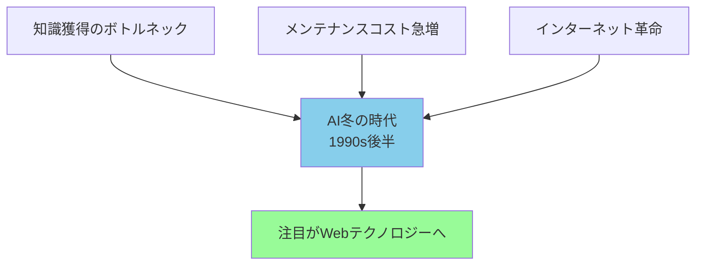

**決定打**：インターネットの普及により、人々の関心がAIからWeb技術に移りました。

## 🚀 第3次AIブーム（2000s-現在）

### 🧮 「データから学ぶ」革命

第3次ブームは**機械学習**、特に**深層学習（ディープラーニング）**が主役です。

**従来との違い**：
- **第1次**：人間がルールをプログラム  
- **第2次**：人間が知識をルール化
- **第3次**：コンピュータがデータから自動学習

**例えて言うなら**：
- 従来：子供に「猫の特徴は...」と説明
- 現在：子供に猫の写真を1万枚見せる

### 🎯 深層学習の仕組み（簡単版）

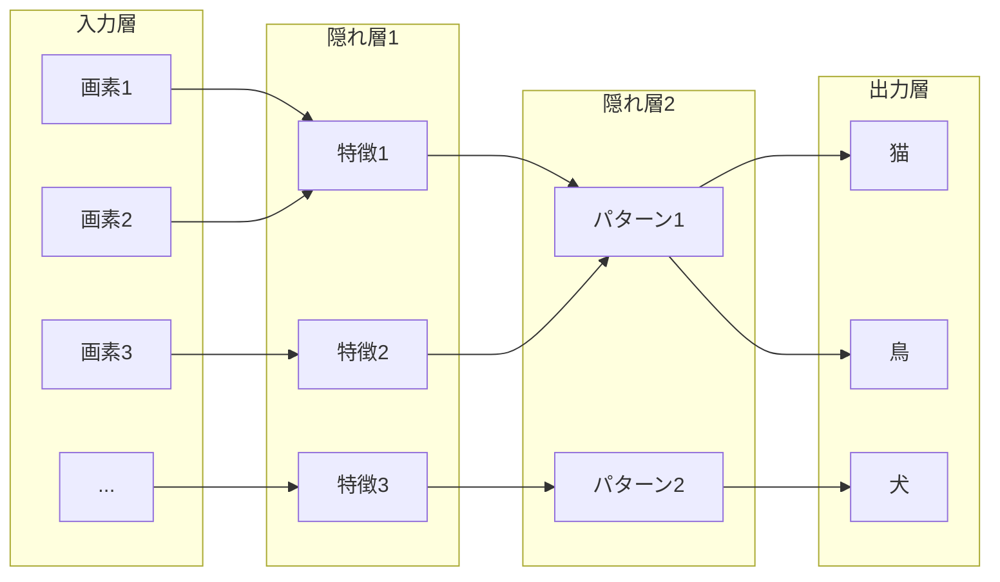

### 🏆 現在の成功事例

| 分野 | 成果 | 人間との比較 |
|------|------|--------------|
| **画像認識** | 猫・犬の区別 | 人間レベル達成 |
| **ゲーム** | 囲碁・将棋 | 世界チャンピオン撃破 |
| **自然言語** | 文章生成・翻訳 | 実用レベル |
| **医療** | 画像診断 | 専門医レベル |
| **自動運転** | 部分的自動運転 | 限定条件下で実用化 |

### 💪 第3次ブームの成功要因

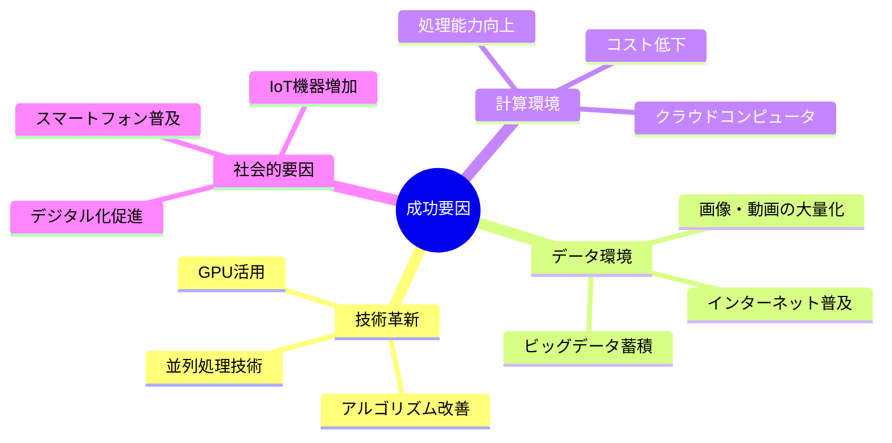

## 📗 関連する用語

### 🔤 基本用語の整理

| 用語 | 簡単な説明 | 日常例 |
|------|------------|--------|
| **AI（人工知能）** | コンピュータが人間のように考える技術 | スマートスピーカー |
| **機械学習** | データから自動で学習する技術 | 動画サイトのおすすめ機能 |
| **深層学習** | 人間の脳を真似した学習方法 | 写真の自動タグ付け |
| **ニューラルネットワーク** | 脳の神経細胞を模した仕組み | 手書き文字認識 |
| **エキスパートシステム** | 専門家の知識を再現したシステム | 医療診断支援システム |

### 🔗 類義語・関連語の比較

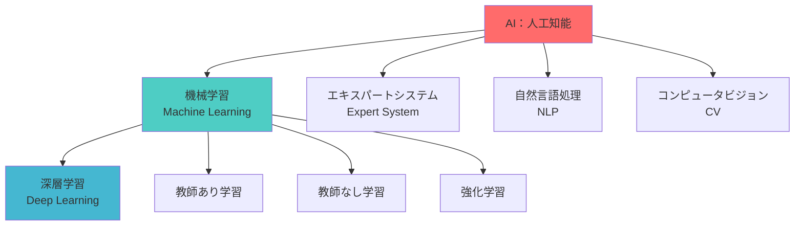

## 💡 各ブームから得られる教訓

### 📊 ブーム比較表

| 項目 | 第1次 | 第2次 | 第3次 |
|------|-------|-------|-------|
| **核心技術** | 論理・探索 | 知識ベース | 機械学習 |
| **成功要因** | コンピュータの登場 | 商業的応用 | ビッグデータ・GPU |
| **失敗要因** | 計算能力不足 | 知識獲得困難 | ？（まだ継続中） |
| **学んだ教訓** | 単純な問題解決では不十分 | 知識だけでは不十分 | データと計算能力が重要 |

### 🎓 重要な教訓

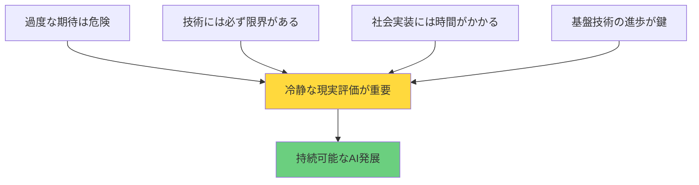

#### 📝 具体的な教訓

1. **期待値管理の重要性**
   - 「10年で人間超え」→現実は60年経っても部分的達成
   - 技術の可能性と限界を正確に伝える

2. **基盤技術の重要性**  
   - 計算能力（GPU）、データ蓄積（インターネット）が成功の鍵
   - 技術単体ではなく、エコシステム全体が重要

3. **段階的発展の必要性**
   - 一足飛びに汎用AIは作れない
   - 特化型→汎用型への段階的アプローチ

## 🌍 現在への影響と未来展望

### 🔮 現在のAIブームの特徴

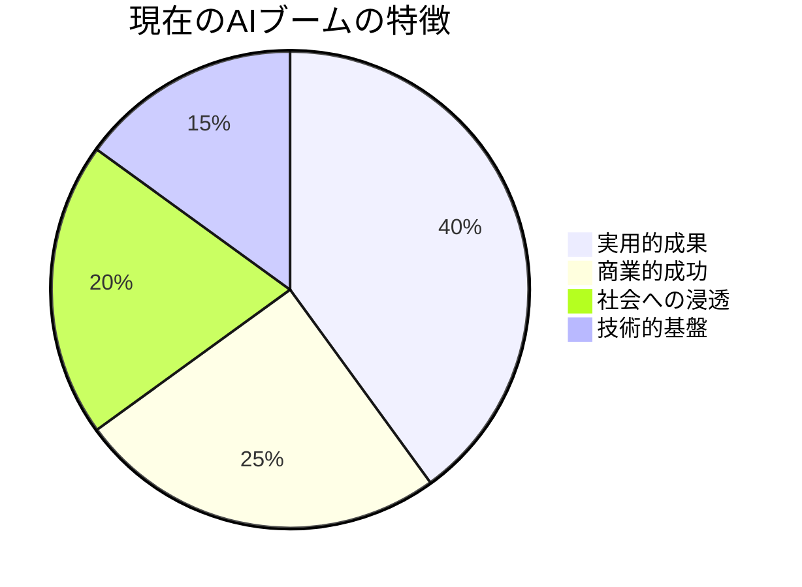

**過去との大きな違い**：
- ✅ **実用化レベルの達成**：翻訳、音声認識、画像認識
- ✅ **巨大な商業市場**：GAFA等の大企業が巨額投資  
- ✅ **日常生活への浸透**：スマートフォン、検索エンジン
- ✅ **強固な技術基盤**：クラウド、ビッグデータ、GPU

### 🚨 現在のリスクと課題

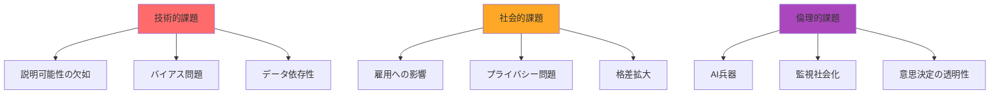

### 🌈 未来予測：第4次ブームはいつ来る？

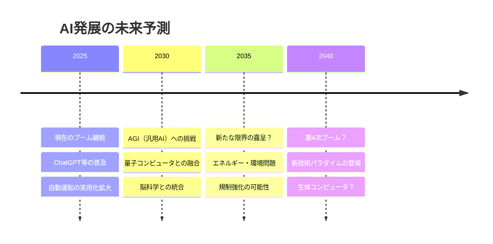

### 🎯 賢明なAIとの付き合い方

**個人レベルで**：
1. **過度な期待も恐怖も禁物** - 冷静に現状把握
2. **継続的学習** - 技術変化に柔軟に対応  
3. **批判的思考** - AI情報を鵜呑みにしない

**社会レベルで**：
1. **段階的導入** - 急激な変化を避ける
2. **倫理的ガイドライン** - 人間中心の開発
3. **教育システム改革** - AI時代に適応した人材育成

---

## 🎉 まとめ：AIブームから学ぶ未来への知恵

AIの歴史を振り返ると、**「夢と現実のバランス」** が成功の鍵であることがわかります。

過去3回のブームは、それぞれ貴重な教訓を残しました：
- **第1次**：技術の可能性と限界を正確に把握する重要性
- **第2次**：実用化には商業的価値と持続可能性が必要  
- **第3次**：基盤技術（データ・計算能力）が成功を左右する

現在のAIブームは過去最も成功していますが、だからこそ慎重な歩みが必要です。

AIは魔法の杖ではありません。しかし、正しく理解し活用すれば、私たちの生活を確実に豊かにしてくれる**素晴らしいパートナー**になるでしょう。

**最終的な学び**：AIの歴史は、人間の学習の歴史そのものです。失敗から学び、改善を重ね、着実に前進していく姿勢こそが、真のAI発展への道なのです。

---
