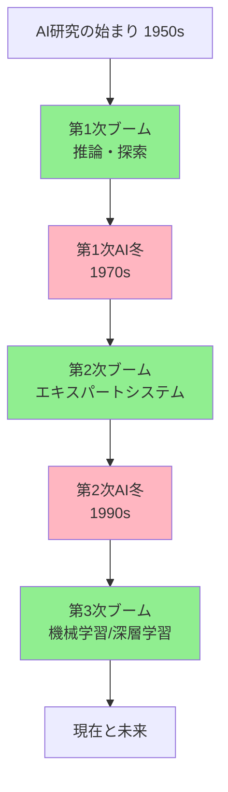
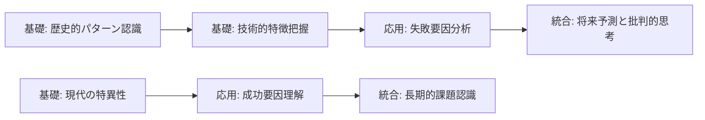
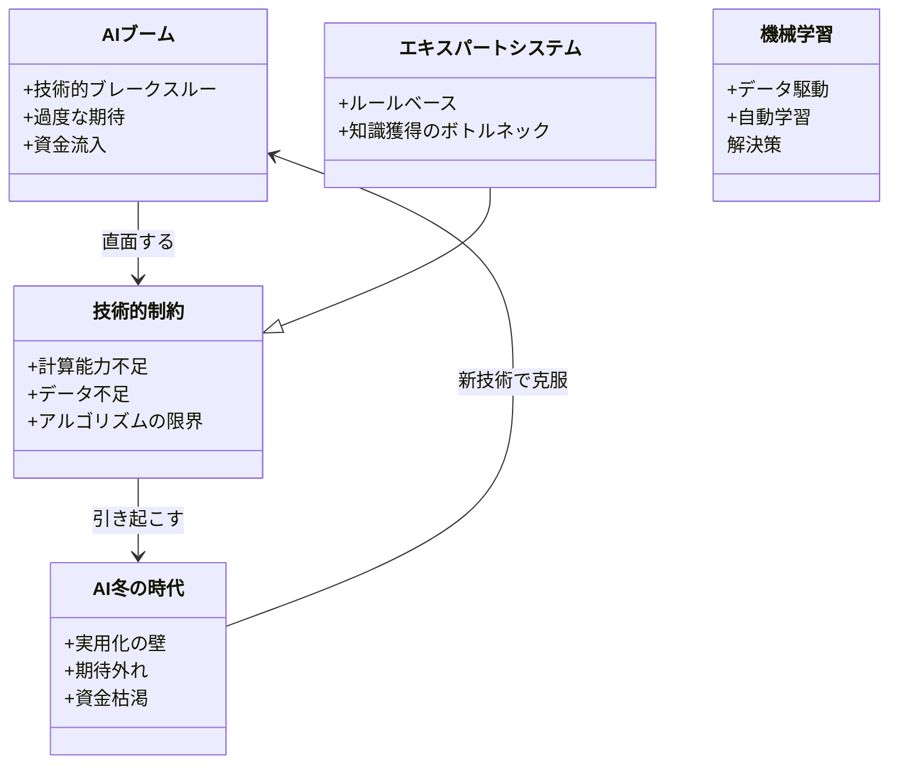
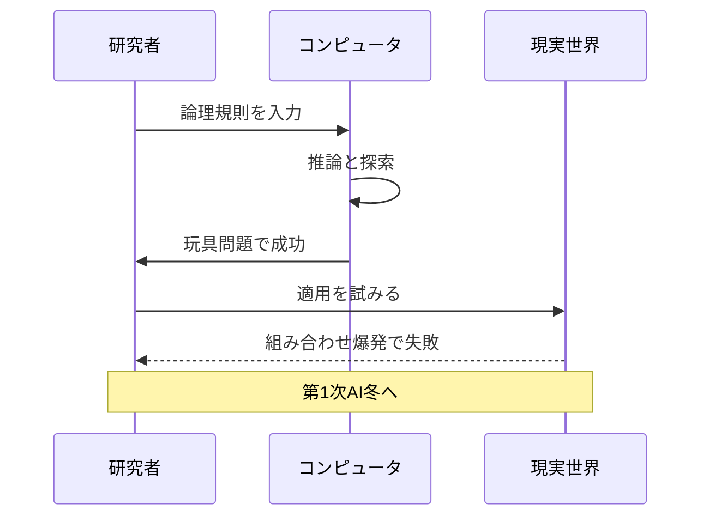
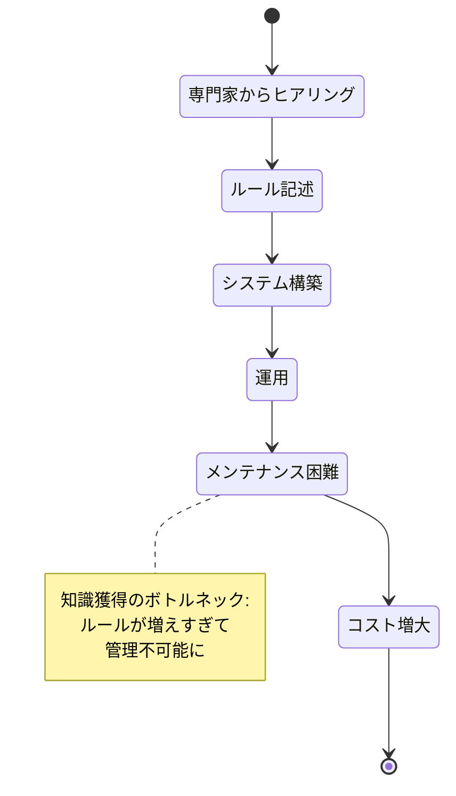
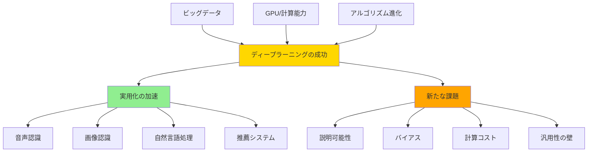
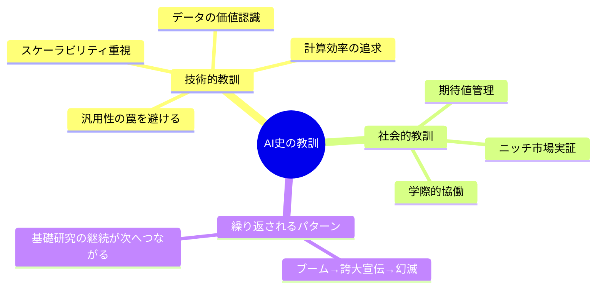
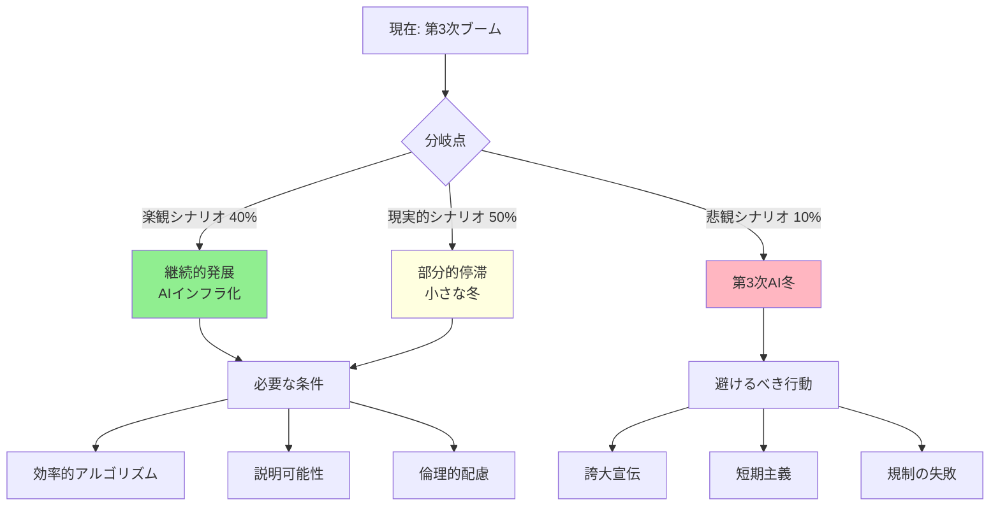
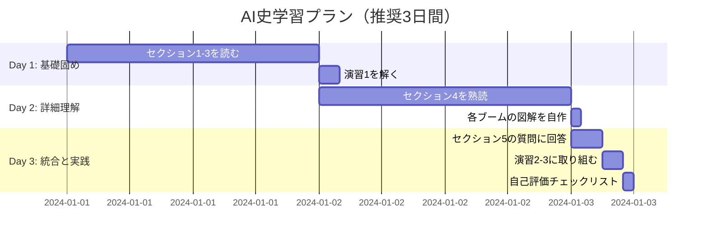

# AIブームの歴史: 段階的理解ガイド

> **学習目標**: AI発展の3つの主要ブームとその背景を理解し、現在のAI技術への示唆を得る
> **推奨学習時間**: 2-3時間
> **前提知識**: なし（初学者向け）

---

## 1. 全体マップ

人工知能（AI）は1950年代の誕生以来、**3回の大きなブームと2回の「冬の時代」**を経験してきました。各ブームは技術的ブレークスルーへの期待で始まり、実用化の壁にぶつかって終焉を迎えました。

**学習範囲**:
- 含む: 各ブームの技術的特徴、終焉の原因、得られた教訓
- 含まない: 詳細な数学的アルゴリズム、個別企業の動向

**主要トピック**:
1. 第1次ブーム（1950-60年代）: 推論と探索の時代
2. 第1次AI冬の時代（1970年代）
3. 第2次ブーム（1980年代）: エキスパートシステムの台頭
4. 第2次AI冬の時代（1990年代前半）
5. 第3次ブーム（2010年代-現在）: 機械学習とディープラーニング
6. 各時代からの教訓
7. 今後への示唆



---

## 2. ガイド質問

### 基礎理解（★☆☆）
- Q1: なぜAIは「ブーム」と「冬の時代」を繰り返してきたのか?
- Q2: 各ブームの主要技術は何だったか?
- Q3: 第3次ブームが過去と異なる点は何か?

### 応用理解（★★☆）
- Q4: エキスパートシステムが失敗した根本的な理由は何か?
- Q5: ビッグデータとGPU性能がなぜ第3次ブームを支えたのか?
- Q6: 過去の失敗から現代のAI開発者は何を学べるか?

### 統合理解（★★★）
- Q7: 第3次ブームが「冬の時代」を迎える可能性はあるか? その条件は?
- Q8: AIの歴史から見て、汎用人工知能（AGI）実現の課題は何か?



---

## 3. 核心概念

**重要用語と定義**:

1. **AI冬の時代**（AI Winter）: 資金削減や社会的関心の低下により研究が停滞した期間
2. **推論と探索**（Reasoning & Search）: 第1次ブームの中核技術。記号処理により問題を解く手法
3. **エキスパートシステム**（Expert System）: 専門家の知識をIF-THENルールで表現したシステム
4. **知識獲得のボトルネック**（Knowledge Acquisition Bottleneck）: 人間の知識を機械に入力する作業の困難さ
5. **機械学習**（Machine Learning）: データからパターンを自動で学習する技術
6. **ディープラーニング**（Deep Learning）: 多層ニューラルネットワークを用いた機械学習手法
7. **ビッグデータ**（Big Data）: 機械学習に必要な大量の訓練データ
8. **過度な期待サイクル**（Hype Cycle）: 新技術が期待→幻滅→成熟を経るパターン

**概念間の関係**:



**記憶補助** (ニーモニック):
- **3つのブームの特徴**: 「**推** 論・**エ** キスパート・**機** 械学習」（推エ機）

---

## 4. 段階的詳細展開

### 4.1 第1次ブーム（1950-60年代）: 推論と探索の時代

#### 層1: 導入
AIという用語が1956年のダートマス会議で生まれ、コンピュータによる「思考」への期待が急速に高まりました。この時期の研究者たちは、論理的推論と問題探索により、人間の知的活動を再現できると考えました。

#### 層2: 展開
**主要な技術成果**:
- **チェスプログラム**: コンピュータが戦略ゲームで人間と対戦
- **定理証明**: 数学的命題を論理規則で自動証明
- **ELIZA**: 自然言語で会話するプログラム（ただし表面的な応答のみ）

**具体例**: ELIZAはパターンマッチングで「私は悲しい」→「なぜ悲しいのですか?」と返答しましたが、実際には文の意味を理解していませんでした。

**一般的な誤解**: 当時の研究者は「10年以内に機械が人間と同等の知能を持つ」と予測しましたが、これは**トイプロブレム**（玩具問題）での成功を実世界に過度に一般化した結果でした。

**ブーム終焉の原因**:
1. **組み合わせ爆発**: チェスのような問題で、探索すべき選択肢が指数関数的に増加
2. **計算能力の限界**: 当時のコンピュータは実用的な問題を解くには非力すぎた
3. **現実世界の複雑さ**: 制約のない環境では推論アプローチが機能しなかった

#### 層3: 要約
第1次ブームは「記号処理=知能」という仮説の限界を示しました。しかし、探索アルゴリズムや論理プログラミングといった基礎技術は現代AIにも引き継がれています。



---

### 4.2 第1次AI冬の時代（1970年代）

#### 層1: 導入
過度な期待に応えられなかったAI研究は、1970年代に資金削減と社会的懐疑の対象となりました。特に英国では1973年の「ライトヒルレポート」がAI研究の非生産性を指摘し、研究予算が大幅に削減されました。

#### 層2: 展開
**冬の時代の特徴**:
- 軍事・政府資金の削減
- 「AI」という言葉自体が忌避される風潮
- 多くの研究者が他分野へ移動

**しかし停滞期ではなかった**: 
この時期に**フレーム理論**（状況を構造化して表現する方法）や**意味ネットワーク**（概念間の関係を網状に表現）といった知識表現の研究が進みました。これらは次のブームの基盤となります。

**実世界での影響**: 産業界はAIへの投資を控え、より確実なソフトウェア工学へと焦点を移しました。

#### 層3: 要約
AI冬の時代は「誇大宣伝のツケ」が回ってきた期間でしたが、基礎研究は地道に継続され、次のブームへの種が蒔かれました。

---

### 4.3 第2次ブーム（1980年代）: エキスパートシステムの台頭

#### 層1: 導入
1980年代、AI研究は新たな実用的アプローチで復活しました。「汎用的な知能」ではなく、**特定領域の専門知識**をコンピュータに実装するエキスパートシステムが注目を集めました。

#### 層2: 展開
**エキスパートシステムの仕組み**:
```
IF 患者に発熱がある AND 咳がある 
THEN インフルエンザの可能性が高い
```
このようなIF-THENルールを大量に集め、専門家の判断を模倣しました。

**成功事例**:
- **MYCIN**: 血液感染症の診断で専門医並みの精度
- **XCON**: コンピュータシステムの構成設計を自動化（DECで年間4000万ドルのコスト削減）
- **DENDRAL**: 化学物質の分子構造を推定

**日本の第五世代コンピュータプロジェクト**: 日本政府は1982年、AIを国家戦略として10年・総額570億円を投資。これが世界的なAIブームを加速させました。

**致命的な問題 - 知識獲得のボトルネック**:
エキスパートシステムは専門家から知識を引き出し、ルールとして記述する作業が必要でした。しかし:
- 専門家は自分の判断プロセスを明確に説明できない（**暗黙知**の問題）
- ルールの数が増えると矛盾や例外処理が爆発的に増加
- 領域が少し変わるとゼロから構築し直す必要

**メンテナンスの悪夢**: XCONは最終的に10,000以上のルールを持ちましたが、製品ラインが変わるたびに大規模な修正が必要で、維持コストが膨大になりました。

#### 層3: 要約
第2次ブームは「知識を手作業で入力する」アプローチの限界を露呈しました。AIが実用化されるには、**知識を自動で獲得する方法**が必要だという教訓が得られました。



---

### 4.4 第2次AI冬の時代（1990年代前半）

#### 層1: 導入
1980年代末から1990年代初頭、エキスパートシステムのメンテナンスコストと限界が明らかになり、再びAIへの投資が冷え込みました。特に日本の第五世代プロジェクトの「失敗」宣言が象徴的でした。

#### 層2: 展開
**冬到来の要因**:
1. **ROIの問題**: 初期開発に数百万ドル、維持に毎年数十万ドルのコストがかかり、投資対効果が見合わない
2. **デスクトップPC革命**: より安価で実用的な汎用ソフトウェアが普及
3. **「AI」ブランドの毀損**: 企業は「AI」という言葉を避け、「意思決定支援システム」などと呼称を変更

**しかし革命の種は育っていた**:
この時期、機械学習の基礎研究は着実に進展していました:
- **サポートベクターマシン**（1995年）: 効率的な分類アルゴリズム
- **ランダムフォレスト**（1995年）: 実用的な予測モデル
- **LSTM**（1997年）: 長期依存関係を扱えるニューラルネットワーク

これらは第3次ブームの技術基盤となります。

#### 層3: 要約
第2次AI冬は「手作業でのルール構築」という根本的アプローチの破綻を示しました。次のブレークスルーには、データから自動で学習する技術の成熟が必要でした。

---

### 4.5 第3次ブーム（2010年代-現在）: 機械学習とディープラーニング

#### 層1: 導入
2010年代から始まった第3次ブームは、**データ駆動型アプローチ**への完全な転換により、過去とは質的に異なる成功を収めています。人間が明示的にルールを書く代わりに、AIは大量のデータから自動でパターンを学習します。

#### 層2: 展開
**ブーム開始の転換点 - ImageNet 2012**:
画像認識コンペティションで、トロント大学のチームがディープラーニングを用いて、従来手法を**10%以上**も上回る精度を達成。AI研究者に「これは違う」と確信させた歴史的瞬間でした。

**第3次ブームを支える3つの柱**:

1. **ビッグデータ**: 
   - インターネット、SNS、スマートフォンから日々生成される膨大なデータ
   - ImageNetプロジェクト: 1400万枚の画像を人手でラベル付け

2. **計算能力の向上**:
   - **GPU**（画像処理用チップ）がAI計算に適していることが判明
   - クラウドコンピューティングで誰でも強力な計算資源にアクセス可能
   - 例: 2012年の研究は1週間かかったが、2020年には同じ計算が数時間

3. **アルゴリズムの進化**:
   - **畳み込みニューラルネットワーク**（CNN）: 画像認識で人間を超える精度
   - **Transformer**（2017年）: 自然言語処理の革命
   - **強化学習**: AlphaGoが世界チャンピオンに勝利（2016年）

**過去のブームとの決定的な違い**:

| 項目 | 第1-2次ブーム | 第3次ブーム |
|------|---------------|-------------|
| アプローチ | ルールベース（演繹的） | データ駆動（帰納的） |
| 知識の獲得 | 人間が手作業で入力 | データから自動学習 |
| 適用範囲 | 限定的な領域 | 多様な領域に汎化可能 |
| スケーラビリティ | データが増えても性能向上せず | データが増えるほど改善 |
| 実用化 | 少数のニッチ用途 | 日常生活に浸透 |

**実世界での成功例**:
- **音声認識**: Siri、Alexa（エラー率5%以下、人間並み）
- **画像認識**: 医療診断で特定がんの検出率が専門医を上回る
- **自然言語処理**: ChatGPT、機械翻訳の実用化
- **自動運転**: レベル2-3の実用化
- **推薦システム**: Netflix、Amazonの売上を大幅に増加

**現在の課題と懸念**:
1. **説明可能性**: なぜその判断をしたか説明できない（ブラックボックス問題）
2. **データバイアス**: 訓練データの偏りが差別を生む可能性
3. **計算コスト**: 大規模モデルの訓練に数億円規模の費用
4. **汎用性の限界**: 特定タスクには強いが、人間のような柔軟な対応は困難
5. **過度な期待**: AGI（汎用人工知能）への期待がまた非現実的になっている兆候

#### 層3: 要約
第3次ブームは「データから学ぶ」という根本的パラダイムシフトにより、実用化に成功しています。ただし、説明可能性や汎用性など新たな課題も顕在化しており、これらが次の「冬」を防げるかが注目されます。



---

### 4.6 各時代からの教訓

#### 層1: 導入
AI史を振り返ると、技術的教訓と社会的教訓の両面で学ぶべき点が浮かび上がります。これらは現在進行形のAI開発にも適用可能です。

#### 層2: 展開

**技術的教訓**:

1. **汎用性の罠**:
   - 教訓: 「全てを解決する万能AI」を目指すと失敗する
   - 具体例: 第1次ブームの研究者は「10年で人間レベルのAI」と予測したが、特定問題すら満足に解けなかった
   - 現代への示唆: AGI（汎用人工知能）への過度な期待を避け、実用的な特化型AIの積み重ねが重要

2. **スケーラビリティの重要性**:
   - 教訓: 小規模では成功しても、規模が大きくなると破綻するアプローチは持続不可能
   - 具体例: エキスパートシステムは100ルールでは機能したが、10,000ルールではメンテナンス不可能に
   - 現代への示唆: 機械学習はデータが増えるほど性能向上する「正のフィードバック」を持つ

3. **データの価値**:
   - 教訓: アルゴリズムだけでなく、良質なデータがAIの性能を決定する
   - 具体例: ImageNetのような大規模データセットの構築が第3次ブームの前提条件だった
   - 現代への示唆: 「データは新しい石油」- データ収集・整備への投資が競争力を生む

4. **計算資源の制約**:
   - 教訓: 理論的に可能でも、計算コストが実用範囲を超えると普及しない
   - 具体例: ニューラルネットワークは1980年代に理論は確立していたが、GPUの登場を待つ必要があった
   - 現代への示唆: 環境負荷やコストを考慮した「効率的なAI」の研究が重要に

**社会的・経営的教訓**:

5. **期待値管理の失敗**:
   - 教訓: 過度な宣伝は必然的に失望を生み、長期的に業界全体を損なう
   - 具体例: 第1次ブームの「10年で人間並み」、第2次ブームの「知識工学で全産業が変わる」
   - 現代への示唆: 現在のAIも「できること」と「できないこと」を明確に区別して伝える責任がある

6. **ニッチ市場での実証**:
   - 教訓: 最初から巨大市場を狙わず、限定的な領域で確実に価値を証明する
   - 具体例: MYCINは血液感染症という狭い領域で専門医レベルを達成し、AI医療の可能性を示した
   - 現代への示唆: スタートアップはニッチでの成功を積み重ねるべき

7. **学際的アプローチ**:
   - 教訓: 技術だけでなく、人間の認知、倫理、社会的影響を統合的に考える必要
   - 具体例: エキスパートシステムは認知科学の「暗黙知」理論を軽視した結果失敗
   - 現代への示唆: AIの社会実装には技術者だけでなく、倫理学者、心理学者、政策立案者の協働が必須

**パターンの認識**:

ブームと冬の繰り返しには共通パターンがあります:

```
1. 技術的ブレークスルー
   ↓
2. メディアと投資家の過剰な期待
   ↓
3. 短期的な成功例
   ↓
4. 実用化の壁にぶつかる
   ↓
5. 期待外れと資金枯渇
   ↓
6. 基礎研究の継続（冬の時代）
   ↓
7. 新たなブレークスルー（新しいブームへ）
```

このサイクルを理解することで、現在の位置を冷静に評価できます。

#### 層3: 要約
AI史の教訓は「技術の進歩は非線形である」ことを示しています。失敗から学び、過度な期待を避け、着実な実用化を積み重ねることが持続可能なAI発展の鍵です。



---

### 4.7 今後への示唆

#### 層1: 導入
AI史を踏まえ、第3次ブームの今後と、次の「冬」を避けるための考察をまとめます。楽観と懐疑の両面から検討することが重要です。

#### 層2: 展開

**第3次ブームが持続する可能性**:

**楽観的要因**:
1. **実用化の広がり**: 過去のブームと異なり、日常生活に深く浸透（スマートフォン、検索、翻訳など）
2. **経済的基盤**: GAFAMなどの巨大企業が長期投資を継続中
3. **データの継続的増加**: インターネットが存続する限り訓練データは増え続ける
4. **技術の多様化**: 画像、音声、言語、強化学習など複数の柱が確立

**第4次AI冬のリスク要因**:

**懸念される兆候**:
1. **AGIへの過度な期待**: 一部の研究者やメディアが「5-10年でAGIが実現」と予測
   - 過去と同じパターン: 「できること」を過大評価し、「できないこと」を過小評価
   
2. **収穫逓減の可能性**: 
   - 大規模言語モデルは「大きくすればするほど賢くなる」が、いつまで続くか不明
   - GPT-3→GPT-4の改善幅は GPT-2→GPT-3より小さい傾向
   
3. **計算コストの爆発**:
   - GPT-4の訓練コストは推定1億ドル超
   - 持続可能性への疑問が高まっている
   
4. **社会的バックラッシュ**:
   - 雇用への影響、フェイクニュース、プライバシー侵害などへの懸念
   - 規制強化がイノベーションを阻害する可能性

**今後10年のシナリオ**:

**シナリオA: 継続的発展** (確率40%)
- 効率的なアルゴリズムにより計算コスト問題が解決
- 説明可能AIや公平性保証技術が成熟
- 規制とイノベーションのバランスが取れる
- 結果: AIは電気や インターネット並みの「インフラ」として定着

**シナリオB: 部分的停滞** (確率50%)
- 一部領域（画像認識、音声など）は成熟し安定
- AGIへの道は依然として遠く、過度な期待が幻滅に
- 投資は減速するが、実用アプリケーションは継続
- 結果: 「小さな冬」- 研究資金は減るが、産業応用は続く

**シナリオC: 第3次AI冬** (確率10%)
- 大規模モデルの限界が露呈し、劇的な進歩が停止
- 計算コスト問題が解決できず、環境負荷への批判が投資を冷やす
- 規制強化により研究開発が大幅に制約
- 結果: 1990年代型の停滞が再来

**冬を避けるための提言**:

**研究者・開発者へ**:
- 誠実なコミュニケーション: できることとできないことを明確に区別
- 効率性の追求: より少ないデータ・計算で成果を出す研究
- 説明可能性への投資: ブラックボックス問題の解決

**企業・投資家へ**:
- 長期視点: 四半期ごとの成果を求めすぎない
- ニッチ戦略: 確実に価値を生む領域に集中
- 倫理的配慮: 短期利益より社会的信頼を優先

**政策立案者へ**:
- バランス型規制: イノベーションを殺さない適度な規制
- 基礎研究支援: ブームに関係なく継続的な研究資金
- 教育投資: AI時代に適応できる人材育成

#### 層3: 要約
第3次ブームは過去より強固な基盤を持ちますが、AGIへの過度な期待や計算コストの問題など、冬のリスクも存在します。歴史の教訓を活かし、誠実で持続可能なAI発展を目指すことが重要です。



---

## 5. 統合・実践

### ガイド質問への模範回答

**Q1: なぜAIは「ブーム」と「冬の時代」を繰り返してきたのか? (★☆☆)**

**回答**: 技術的ブレークスルーが過度な期待を生み、その期待が実用化の壁にぶつかるというサイクルが原因です。具体的には：(1) 限定的な成功を汎用的な能力と誤認、(2) メディアや投資家が短期的成果を求めすぎる、(3) 技術的制約（計算能力、データ不足）を過小評価、という要因が繰り返されてきました。各ブームは次のブームの基礎研究を生むため、完全な失敗ではありません。

---

**Q4: エキスパートシステムが失敗した根本的な理由は何か? (★★☆)**

**回答**: **知識獲得のボトルネック**が根本原因です。専門家の知識をIF-THENルールで表現する作業が極めて困難で：(1) 専門家は自分の判断プロセスを言語化できない（暗黙知）、(2) ルールが数千に達すると矛盾や例外処理が爆発、(3) 領域が変わるたびゼロから構築が必要、という問題がありました。さらに、デスクトップPC革命により、より安価な汎用ソフトウェアとの競争にも敗れました。

---

**Q7: 第3次ブームが「冬の時代」を迎える可能性はあるか? その条件は? (★★★)**

**回答**: 可能性はあります（確率50-60%で何らかの停滞）。リスク要因は：

**技術的条件**:
- 大規模モデルのスケーリング則が破綻（これ以上大きくしても改善しない）
- 計算コスト問題が解決できず、環境負荷への批判が高まる
- AGI実現への期待が裏切られ、投資家が離れる

**社会的条件**:
- AI による大規模失業や社会不安
- フェイクニュース、プライバシー侵害などで規制が過度に強化
- 差別的バイアスによる訴訟や信頼失墜

ただし、第3次ブームは過去より実用化が進んでおり、完全な「冬」ではなく「部分的停滞」の可能性が高いです。

---

### 統合演習問題

**演習1: 歴史的パターン分析**

以下の表を完成させ、各ブームの共通点と相違点を整理してください。

| 項目 | 第1次ブーム | 第2次ブーム | 第3次ブーム |
|------|-------------|-------------|-------------|
| 中核技術 | 推論・探索 | エキスパートシステム | 機械学習・深層学習 |
| 知識の源泉 | 論理規則 | 専門家のルール | データ |
| 失敗の原因 | ？ | ？ | （未定） |
| 残した遺産 | ？ | ？ | （進行中） |

<details>
<summary>解答例を見る</summary>

| 項目 | 第1次ブーム | 第2次ブーム | 第3次ブーム |
|------|-------------|-------------|-------------|
| 失敗の原因 | 組み合わせ爆発、計算能力不足 | 知識獲得のボトルネック、メンテナンスコスト | 潜在的リスク：計算コスト、過度な期待、説明可能性の欠如 |
| 残した遺産 | 探索アルゴリズム、論理プログラミング | 知識表現理論、「データから学ぶ」への転換の必要性認識 | 実用的AIインフラ、大規模データセット、GPU活用 |

</details>

---

**演習2: 未来予測ワークショップ**

あなたがAI企業のCTOだと仮定して、今後5年間の戦略を立ててください。以下の観点を含めること：
- 投資すべき技術領域
- 避けるべきリスク
- AI史の教訓の活用方法

---

**演習3: 批判的思考演習**

以下の主張について、AI史の観点から賛否を論じてください：

**主張**: 「ChatGPTの成功により、AGI（汎用人工知能）は10年以内に実現する」

**考慮すべき点**:
- 過去の予測の精度
- 「玩具問題」と「実世界問題」のギャップ
- 現在のAIの実際の能力と限界

---

### 自己評価チェックリスト

学習後、以下の項目を確認してください：

**基礎理解** (80%以上で合格):
- [ ] 3つのブームの時期と主要技術を説明できる
- [ ] 「AI冬の時代」が何を意味するか理解している
- [ ] 組み合わせ爆発と知識獲得のボトルネックを説明できる
- [ ] 第3次ブームの3つの柱（データ、計算、アルゴリズム）を挙げられる

**応用理解** (70%以上で目標):
- [ ] なぜエキスパートシステムが失敗したか、構造的理由を説明できる
- [ ] 第3次ブームが過去と異なる点を3つ以上挙げられる
- [ ] 現在のAIの限界（説明可能性、汎用性など）を理解している
- [ ] ブームと冬の繰り返しパターンを認識している

**統合理解** (60%以上で優秀):
- [ ] AI史の教訓を現代のAI開発に適用できる
- [ ] 第3次ブームが冬を迎えるリスク要因を評価できる
- [ ] AGI実現の難しさを歴史的文脈で説明できる
- [ ] 技術的課題と社会的課題の両面から AI の未来を論じられる

---

### 推奨学習スケジュール



---

## 学習の次のステップ

この資料でAI史の全体像を把握できたら、以下のテーマで学習を深めることをお勧めします：

**技術的深堀り**:
1. **機械学習の基礎**: 教師あり学習、教師なし学習、強化学習の違い
2. **ニューラルネットワークの仕組み**: バックプロパゲーション、活性化関数
3. **Transformerアーキテクチャ**: なぜ自然言語処理を革命したのか

**社会的・倫理的側面**:
4. **AIの倫理**: バイアス、公平性、説明責任
5. **AI規制の動向**: EU AI Act、各国の規制フレームワーク
6. **AI と雇用**: 自動化が社会に与える影響

**発展的トピック**:
7. **AGI への道**: 現在の AI とAGI のギャップ
8. **AI安全性研究**: アライメント問題、制御可能性
9. **量子コンピューティングとAI**: 次の計算パラダイム

---
