チューリングテスト


# チューリングテスト - 初学者のための完全ガイド

## 🔍 一言要約
「コンピューターが人間のように考えているかを判断する、究極のおしゃべりゲーム」

## 📚 目次
1. [🌟 はじめに](#-はじめに)
2. [🏗️ 基本構造](#️-基本構造)  
3. [⚡ 主要技術](#-主要技術)
4. [📜 時代背景と発見に至った経緯](#-時代背景と発見に至った経緯)
5. [🎨 種類と特徴](#-種類と特徴)
6. [📗 関連する用語](#-関連する用語)
7. [💡 メリットとデメリット](#-メリットとデメリット)
8. [🚀 応用技術と実用化の例](#-応用技術と実用化の例)
9. [🌍 実世界への影響とその後の発展](#-実世界への影響とその後の発展)

## 🌟 はじめに

想像してみてください。チャットで知り合った相手が、実は人間ではなくコンピューターだったら？そんな「人間らしいコンピューター」を見分けるテストが**チューリングテスト**です。

まるで探偵が偽装を見破るように、人間の審査員がコンピューターと会話して「これは人間か？機械か？」を判定するゲームのようなものです。もしコンピューターが人間だと誤認されれば、そのコンピューターは「知能を持っている」と認められます。

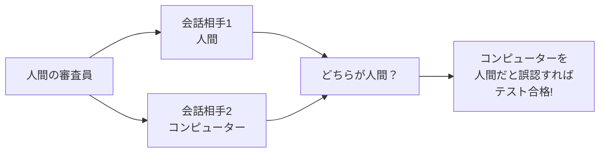

## 🏗️ 基本構造

チューリングテストは、まるで**三角関係の心理ゲーム**のような構造を持っています：

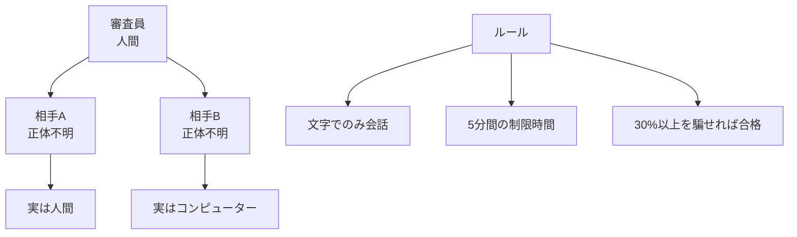

### 基本的な仕組み
1. **隠された身元**: 審査員は相手の正体を知らない
2. **文字のみの会話**: 声や見た目で判断できない
3. **時間制限**: 短時間で本質を見抜く必要がある
4. **統計的判定**: 多数の審査員による総合判断

## ⚡ 主要技術

チューリングテストを支える核となる技術を、料理に例えて説明します：

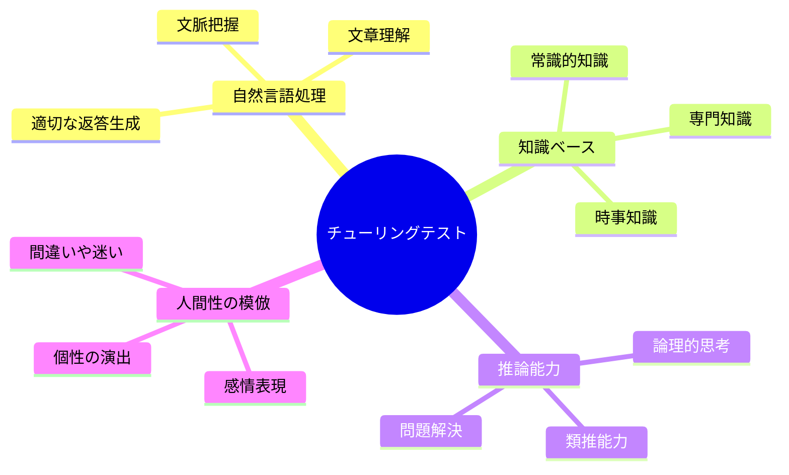

### 1. 自然言語処理（レシピの理解力）
- **材料認識**: 人間の言葉を正確に理解する
- **調理法理解**: 文脈や行間を読み取る
- **味付け**: 適切な返答を生成する

### 2. 知識ベース（料理の引き出し）
- **基本の味**: 日常的な常識
- **専門の味**: 特定分野の深い知識  
- **季節の味**: 最新の情報

### 3. 人間らしさの演出（料理人の個性）
- **完璧すぎない**: 時々間違える
- **感情の表現**: 喜怒哀楽を示す
- **個性的な反応**: 独特のクセや好み

## 📜 時代背景と発見に至った経緯

### 天才数学者の悩み（1950年）

イギリスの数学者**アラン・チューリング**は、第二次世界大戦でドイツの暗号「エニグマ」を解読した英雄でした。戦後、彼は一つの疑問に悩まされていました：

> 「機械は本当に考えることができるのだろうか？」

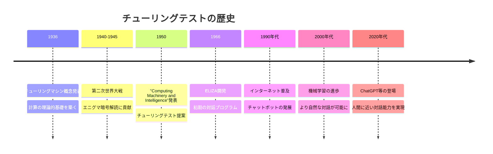

### 発想の転換

チューリングは「機械が考えているか」という哲学的な問いを、**実用的なテスト**に変換しました。まるで「美味しい料理とは何か」という抽象的な問いを「お客さんが美味しいと言う料理」という具体的な基準に置き換えたようなものです。

「考えているように見える = 考えている」という革命的な発想でした。

## 🎨 種類と特徴

チューリングテストには、料理のコースのように様々なバリエーションがあります：

```mermaid
graph TD
    A[チューリングテストの種類] --> B[標準チューリングテスト]
    A --> C[逆チューリングテスト]
    A --> D[全チューリングテスト]
    A --> E[制限チューリングテスト]
    
    B --> F[5分間の文字会話<br/>30%の人を騙せば合格]
    C --> G[人間が機械だと<br/>誤認されないか確認]
    D --> H[ロボットとの<br/>物理的な交流も含む]
    E --> I[特定分野に<br/>限定した会話]
    
    click B "/docs/standard-test.md" "標準テストの詳細"
    click C "/docs/reverse-test.md" "逆テストの説明" 
    click D "/docs/total-test.md" "全テストの概要"
    click E "/docs/restricted-test.md" "制限テストの用途"
```

### 比較表

| テストタイプ | 難易度 | 実用性 | 特徴 |
|--------------|--------|--------|------|
| 標準テスト | ⭐⭐⭐ | ⭐⭐⭐⭐ | 最も一般的、AI開発の指標 |
| 逆テスト | ⭐⭐ | ⭐⭐⭐ | CAPTCHA等で実用化 |
| 全テスト | ⭐⭐⭐⭐⭐ | ⭐ | 理論的、まだ実現困難 |
| 制限テスト | ⭐ | ⭐⭐⭐⭐⭐ | 専門分野で活用中 |

## 📗 関連する用語

### 同義語・関連語
- **人工知能テスト**: AI の知能を測るテスト全般
- **イミテーションゲーム**: チューリングテストの別名
- **機械知能判定**: 機械の思考能力を判定すること

### 対義語・対比概念  
- **チャイニーズルーム**: 理解なしに動作する機械の例え
- **哲学的ゾンビ**: 意識のない存在の思考実験

### 多義語の比較
**「知能」の意味**
- **人工知能分野**: 問題解決能力や学習能力
- **心理学分野**: IQで測定される認知能力  
- **チューリングテスト**: 人間らしい応答能力

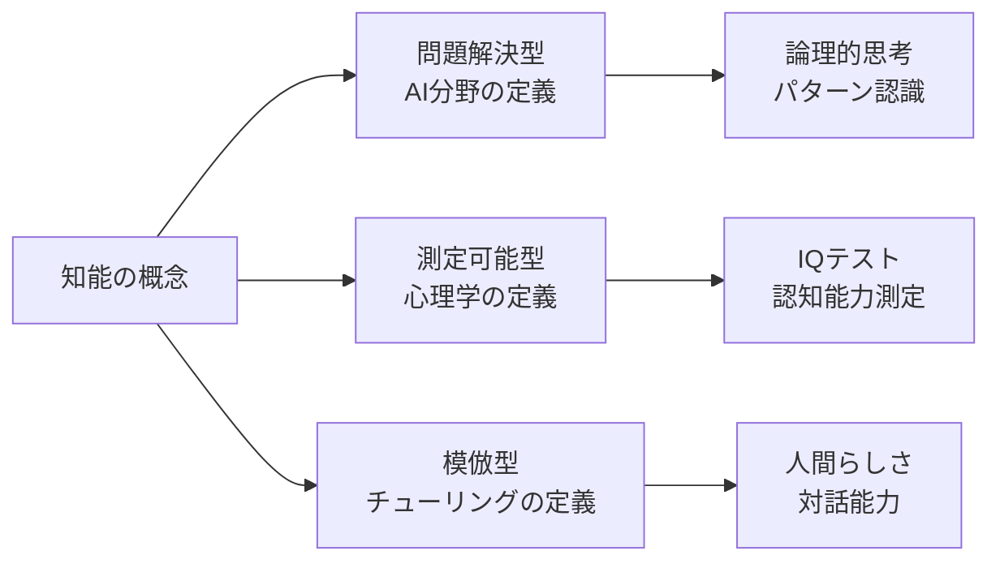

## 💡 メリットとデメリット

### 🌟 メリット（光の側面）

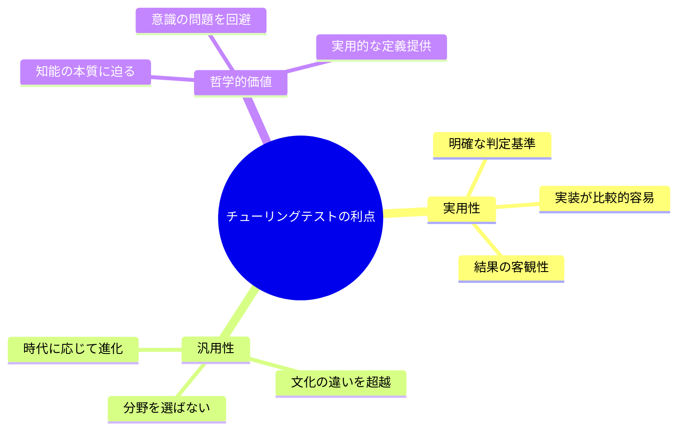

1. **料理の味見のような明確さ**: 複雑な「知能」を「人間らしさ」という分かりやすい基準で判定
2. **万能な測定器**: どんな分野のAIでも同じ基準で評価可能
3. **哲学者の悩みを解決**: 「機械は考えるか？」という答えの出ない問いを実用的な問題に変換

### 🌧️ デメリット（影の側面）

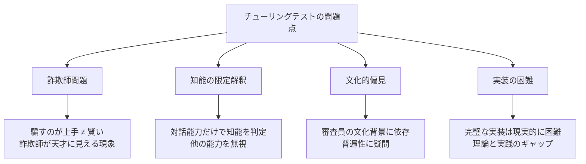

1. **詐欺師の逆説**: 上手に嘘をつくプログラムが「知的」と判定される危険性
2. **知能の偏見**: 言語能力だけで知能全体を判断する限界
3. **文化の壁**: 審査員の文化的背景が結果を左右する可能性

## 🚀 応用技術と実用化の例

チューリングテストの考え方は、現代の様々な場面で活用されています：

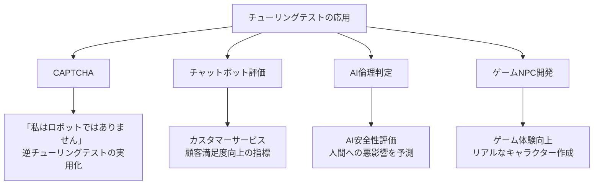

### 身近な実例

#### 1. CAPTCHA（キャプチャ）
ウェブサイトでよく見る「私はロボットではありません」のチェックボックス。これは**逆チューリングテスト**の実用化です。

#### 2. 音声アシスタント
SiriやAlexaの「自然な会話」評価基準として、チューリングテストの概念が活用されています。

#### 3. カスタマーサポート
企業のチャットボットが「人間的な対応」をできているかの判定に使用されています。

### 応用フロー図

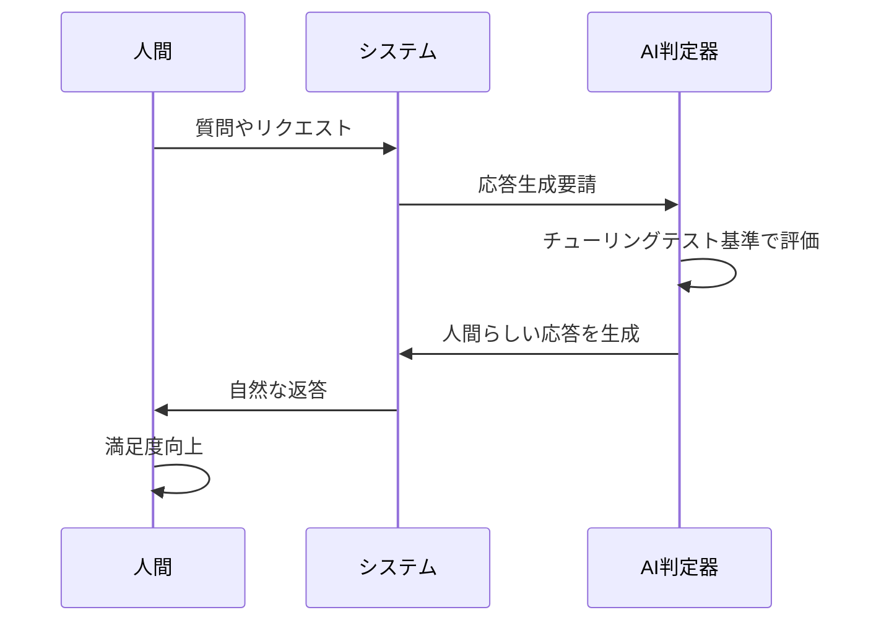

## 🌍 実世界への影響とその後の発展

チューリングテストは、単なる学術的な思考実験を超えて、現代社会に広範囲な影響を与えました：

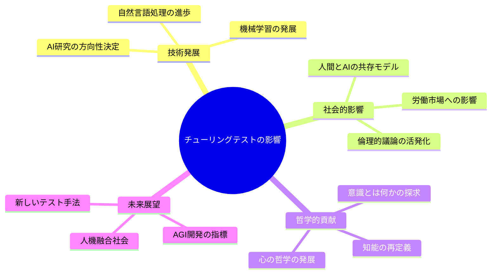

### 影響度マップ

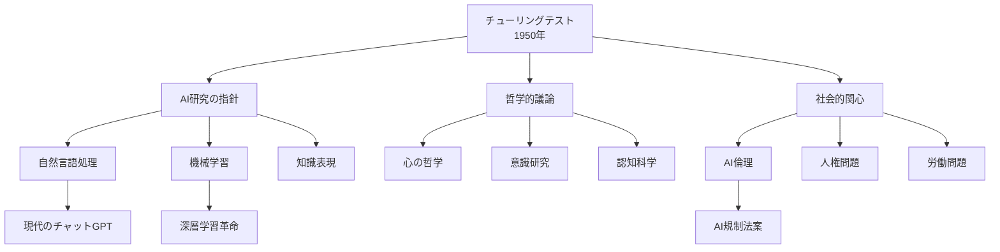

### 未来への展望

#### 1. 次世代テストの開発
- **マルチモーダルテスト**: 文字、音声、画像を統合した総合的な知能測定
- **連続学習テスト**: リアルタイムで学習・適応する能力の測定
- **創造性テスト**: 新しいアイデアや芸術を生み出す能力の評価

#### 2. 社会制度への統合
- **AI市民権**: チューリングテスト合格AIの法的地位
- **教育システム**: AI教師の能力認定基準
- **医療分野**: AI診断システムの信頼性評価

#### 3. 人間性の再定義
チューリングテストの発展とともに、「人間らしさとは何か」という根本的な問いも進化し続けています。AIが人間以上に人間らしく振る舞えるようになったとき、私たちは自分たちの特別さをどこに見出すのでしょうか？

---


この資料により、初学者はチューリングテストを「人間らしさを競うゲーム」として理解し、その現代的意義まで体系的に学習できます。
