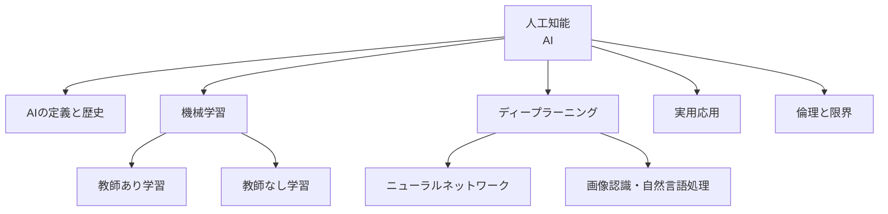
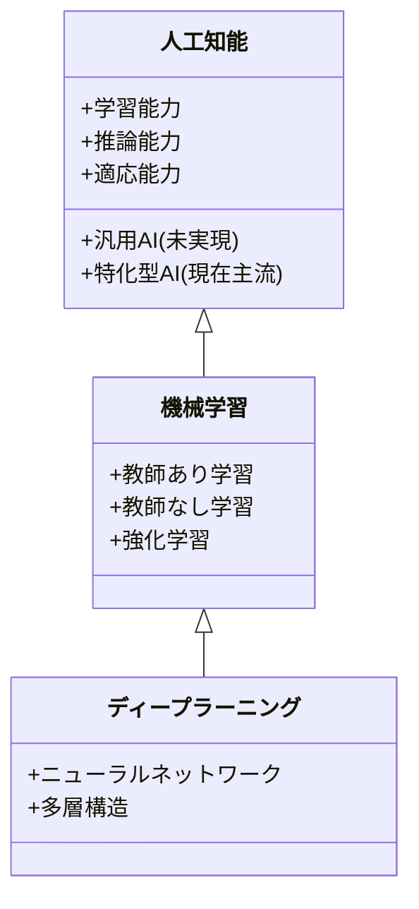
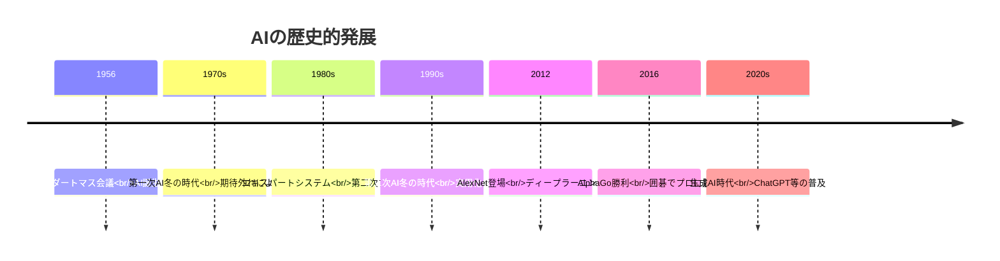
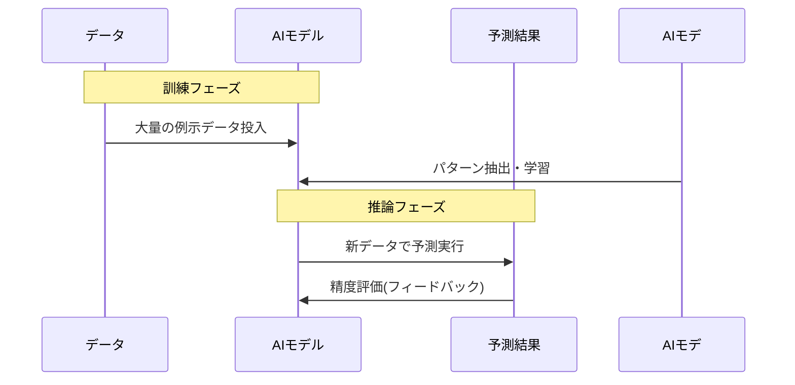
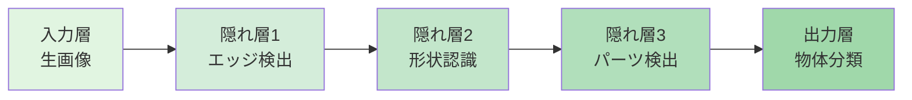
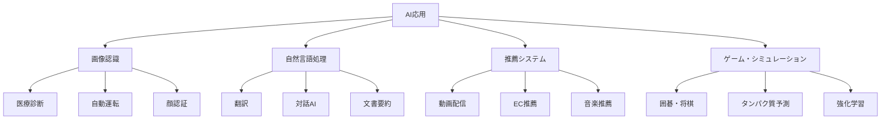
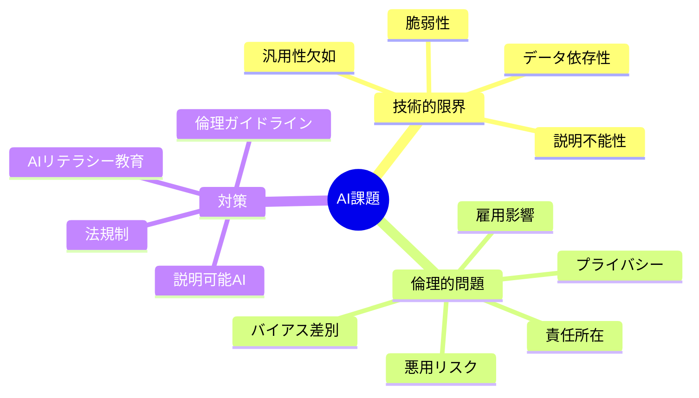
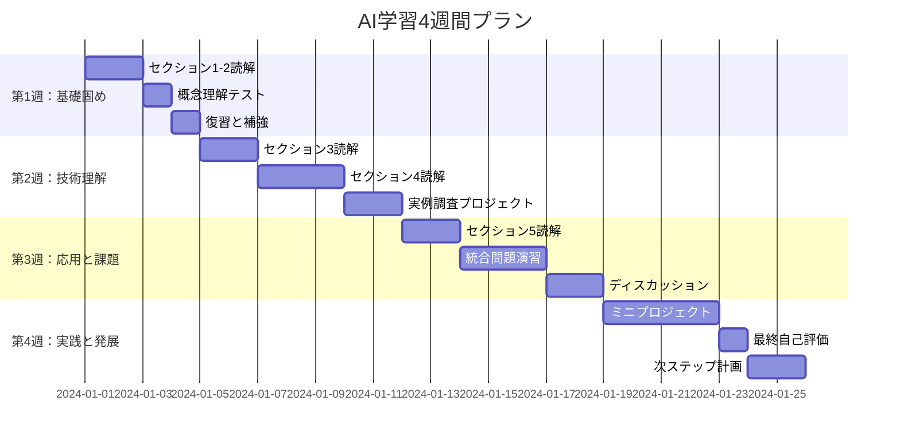
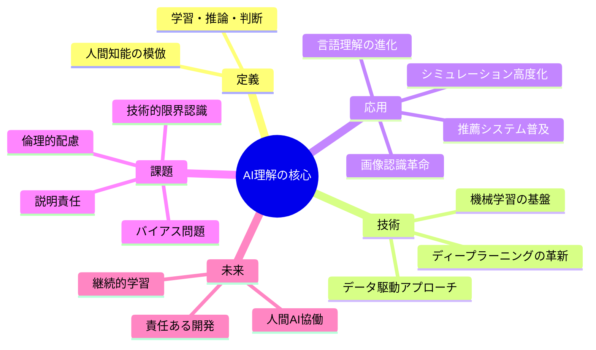

# 人工知能: 段階的理解ガイド

> **学習目標**: AIの基本概念、主要技術、社会的影響を理解し、実世界での応用例を説明できる
> **推奨学習時間**: 3-4時間
> **前提知識**: 不要（基礎から解説）

---

## 1. 全体マップ

**人工知能（AI: Artificial Intelligence）**とは、人間の知的活動をコンピュータで模倣・実現する技術の総称です。1950年代から研究が始まり、現在は機械学習とディープラーニングの発展により第三次AIブームを迎えています。

### 学習範囲
**含むもの**: AI基礎概念、機械学習、ディープラーニング、実用例、倫理的課題
**含まないもの**: プログラミング実装、高度な数学的証明、専門的アルゴリズム詳細

### 主要サブトピック
1. AIの定義と歴史
2. 機械学習の基本原理
3. ディープラーニングとニューラルネットワーク
4. 実世界での応用例
5. AIの限界と倫理的課題

*図1: AIの全体構造 - 5つの主要領域と相互関係*

---

## 2. ガイド質問

各質問に取り組むことで、段階的に理解が深まります。

### AIの基礎（★☆☆）
- **Q1**: 人工知能と通常のプログラムの違いは何ですか？
- **Q2**: AIの歴史における「冬の時代」とは何を指しますか？
- **Q3**: なぜ2010年代にAIが急速に発展したのですか？

### 技術的理解（★★☆）
- **Q4**: 機械学習において「学習する」とは具体的にどういう意味ですか？
- **Q5**: ディープラーニングが画像認識で優れている理由は何ですか？
- **Q6**: 教師あり学習と教師なし学習の使い分けはどう判断しますか？

### 応用と課題（★★★）
- **Q7**: AIが得意なタスクと苦手なタスクをどう見分けますか？
- **Q8**: AI倫理における主要な懸念事項を3つ挙げてください
- **Q9**: 強いAI（汎用AI）と弱いAI（特化型AI）の違いを説明してください

*図2: 質問の難易度階層 - 色は認知負荷レベルを表す*

---

## 3. 核心概念

以下の10の概念がAI理解の土台となります。

### 基本用語
1. **人工知能（AI）**: 人間の知的活動（学習、推論、判断）をコンピュータで実現する技術
2. **機械学習（Machine Learning）**: データからパターンを自動的に発見し、予測や分類を行う手法
3. **ディープラーニング（Deep Learning）**: 多層ニューラルネットワークを使った機械学習の一種
4. **教師あり学習**: 正解ラベル付きデータから学習する方法（例: 猫画像+「猫」ラベル）
5. **教師なし学習**: ラベルなしデータから構造やパターンを発見する方法

### 発展概念
6. **ニューラルネットワーク**: 人間の脳神経回路を模倣した計算モデル
7. **訓練データ**: AIモデルの学習に使用するデータセット
8. **過学習（Overfitting）**: 訓練データに適応しすぎて新データで性能が落ちる現象
9. **汎用AI vs 特化型AI**: あらゆるタスクをこなすAI vs 特定タスクに特化したAI
10. **バイアス**: データやアルゴリズムに含まれる偏り・不公平性

### 記憶補助（頭文字: MLNDTNO-BGS）
**M**achine Learning, **N**eural Network, **D**eep Learning が技術の3本柱

*図3: AI概念の階層構造 - ディープラーニングは機械学習の一部分*

---

## 4. 段階的詳細展開

### 4.1 AIの定義と歴史

#### 層1: 導入
人工知能は1956年のダートマス会議で正式に研究分野として確立されました。「考える機械」という人類の夢は、過去70年間で3度のブームと2度の冬の時代を経験しています。

#### 層2: 展開
**第一次AIブーム（1950-1960年代）**: 推論・探索に基づくAIが期待を集めました。チェスプログラムや定理証明などが開発されましたが、複雑な現実問題には対応できず、1970年代に最初の「AI冬の時代」を迎えます。

**第二次AIブーム（1980年代）**: 専門家の知識をルールとして記述する「エキスパートシステム」が流行しました。医療診断や化学分析で成功例が生まれましたが、知識の獲得と更新が困難で再び停滞期に入ります。

**第三次AIブーム（2010年代〜現在）**: ディープラーニングの登場により画像認識や音声認識の精度が劇的に向上しました。大量データとGPU（画像処理装置）の計算力により、AIは実用段階に到達しています。

**一般的な誤解**: 「AIは人間のように考える」は誤りです。現在のAIは統計的パターン認識であり、人間の思考プロセスとは根本的に異なります。

**実世界での応用**: スマートフォンの顔認識、音声アシスタント（Siri、Alexa）、Netflix・YouTubeのレコメンドシステムなど日常生活に浸透しています。

#### 層3: 要約
AIは70年の歴史を通じて「ルールベース→知識ベース→データ駆動」へと進化し、現在はディープラーニングにより実用化が加速している段階にあります。次のセクションでは、この成功を支える「機械学習」の原理を見ていきます。

*図4: AIの歴史タイムライン - ブームと冬の時代の繰り返し*

---

### 4.2 機械学習の基本原理

#### 層1: 導入
機械学習はAIの中核技術で、「プログラマがルールを書く」のではなく「データからコンピュータ自身がルールを学習する」アプローチです。この発想の転換が現代AIの成功の鍵となっています。

#### 層2: 展開
**伝統的プログラミング vs 機械学習**:
- **従来**: プログラマが「IF 気温>30℃ THEN エアコンON」とルール記述
- **機械学習**: 過去の「気温とエアコン使用データ」からAIが自動的にルール発見

**教師あり学習の仕組み**:
1. **データ収集**: 大量の入力データと正解ラベルを用意（例: 1万枚の犬猫画像+ラベル）
2. **学習（訓練）**: AIモデルがデータのパターンを統計的に抽出
3. **予測**: 新しい画像が入力されたとき、学習したパターンで分類

**例**: メールのスパムフィルタ
- **訓練データ**: 過去10,000通のメール（スパム/正常のラベル付き）
- **学習内容**: 「無料」「今すぐ」等の単語頻度、送信者パターン
- **予測**: 新着メールを自動的にスパム判定

**教師なし学習の例**: 
顧客データから「似た購買パターンを持つグループ」を自動抽出（クラスタリング）。Amazonの「この商品を買った人はこちらも」はこの技術です。

**一般的な誤解**: 「機械学習は万能」は誤りです。学習には大量の質の高いデータが必要で、訓練データにない状況には対応できません。

#### 層3: 要約
機械学習は「ルールの手動記述」から「データからの自動学習」へのパラダイムシフトであり、教師あり・なしの2つのアプローチで様々な問題を解決します。次は機械学習の最先端技術「ディープラーニング」を掘り下げます。

*図5: 機械学習の基本サイクル - 訓練と推論の2段階プロセス*

---

### 4.3 ディープラーニングとニューラルネットワーク

#### 層1: 導入
ディープラーニングは機械学習の一手法で、人間の脳神経回路を模倣した「ニューラルネットワーク」を多層化することで、従来不可能だった複雑なパターン認識を実現しました。

#### 層2: 展開
**ニューラルネットワークの仕組み**:
- **ニューロン（ノード）**: 入力を受け取り計算して出力する基本単位
- **層構造**: 入力層→隠れ層（複数）→出力層の階層構造
- **学習**: 出力の誤差を逆方向に伝播させ、各ノードの重みを調整（バックプロパゲーション）

**人間の視覚との類似性**:
人間が犬を認識する際、「エッジ→形状→パーツ→全体」と階層的に処理します。ディープラーニングも同様に、浅い層で単純な特徴（線・色）を検出し、深い層で複雑な特徴（目・耳→犬全体）を認識します。

**具体例 - 画像認識**:
- **第1層**: 縦線・横線・色の濃淡を検出
- **第2層**: 線の組み合わせでエッジや曲線を検出
- **第3層**: エッジから形状（円・四角）を検出
- **第4-5層**: 形状から物体パーツ（目・耳・鼻）を検出
- **出力層**: パーツの組み合わせで「犬」と判定

**ブレイクスルーの要因**:
1. **ビッグデータ**: ImageNet等の大規模データセット（100万枚超）
2. **GPU**: 並列計算により学習時間が数週間→数時間に短縮
3. **アルゴリズム改良**: ReLU活性化関数、Dropout等の技術革新

**一般的な誤解**: 「ディープラーニング=AI全体」は誤りです。ディープラーニングは機械学習の一部であり、単純な問題では従来手法の方が効率的な場合も多いです。

**実世界での応用**:
- **画像認識**: 自動運転の物体検出、医療画像診断（がん検出）
- **自然言語処理**: ChatGPT、翻訳サービス、音声アシスタント
- **生成AI**: 画像生成（DALL-E）、音楽作曲、動画合成

#### 層3: 要約
ディープラーニングは多層ニューラルネットワークにより階層的特徴抽出を実現し、画像・音声・言語など非構造化データの処理で革命的成果を上げています。次は具体的な応用例を見ていきます。

*図6: ディープラーニングの層構造 - 抽象度が徐々に上がる階層的処理*

---

### 4.4 実世界での応用例

#### 層1: 導入
AIは既に日常生活のあらゆる場面に浸透しており、「AIを使っている」意識なく私たちは毎日数十回AIと接触しています。ここでは主要な応用分野を4つ紹介します。

#### 層2: 展開

**1. 画像認識と視覚AI**
- **顔認識**: スマホのロック解除、空港の入国審査、防犯カメラ
- **医療診断**: X線画像からの肺がん検出（専門医と同等の精度）、網膜画像からの糖尿病診断
- **自動運転**: 歩行者・車両・標識の検出、走行経路の判断
- **成功要因**: 畳み込みニューラルネットワーク（CNN）により、人間以上の認識精度を実現

**2. 自然言語処理**
- **翻訳**: Google翻訳、DeepL（100以上の言語に対応）
- **対話AI**: ChatGPT、Siri、Alexa（質問応答、タスク実行）
- **文書要約**: 長文ニュースの自動要約、会議議事録の生成
- **感情分析**: SNS投稿からの商品評判分析、カスタマーサポート
- **技術基盤**: Transformer、BERT、GPT等の大規模言語モデル

**3. 推薦システム**
- **Netflix**: 視聴履歴から次に見たい作品を予測（視聴時間の80%が推薦から）
- **Amazon**: 購入履歴と類似ユーザー行動から商品提案
- **Spotify**: 音楽の好みを学習してプレイリスト自動生成
- **仕組み**: 協調フィルタリング（似た嗜好のユーザーを見つける）とコンテンツベースフィルタリング（商品特徴の類似性）の組み合わせ

**4. ゲームとシミュレーション**
- **AlphaGo**: 囲碁でプロ棋士に勝利（2016年）
- **AlphaFold**: タンパク質の立体構造予測（ノーベル賞級の成果）
- **強化学習**: 試行錯誤を通じて最適戦略を学習（ロボット制御、資源管理）

**業界別インパクト**:
- **製造業**: 不良品検査の自動化、生産計画の最適化
- **金融**: 信用スコア算出、不正取引検出、アルゴリズム取引
- **小売**: 需要予測、在庫最適化、価格の動的調整
- **農業**: ドローン画像から作物の健康状態診断、収穫量予測

#### 層3: 要約
AIは画像、言語、推薦、シミュレーションの4大分野で実用化が進み、産業全体の効率と精度を向上させています。しかし技術の進歩とともに新たな課題も浮上しており、次のセクションで限界と倫理を検討します。

*図7: AI応用の4大分野と具体例 - 実世界での多様な活用領域*

---

### 4.5 AIの限界と倫理的課題

#### 層1: 導入
AIの目覚ましい発展の裏側には、技術的限界と社会的リスクが存在します。責任あるAI活用には、これらの課題を理解し対処することが不可欠です。

#### 層2: 展開

**技術的限界**

**1. データ依存性**
- AIの性能は訓練データの質と量に完全依存します
- 例: 日本語データが少ない言語AIは日本語処理が苦手
- 稀な状況（珍しい病気、極端な天候）への対応が困難

**2. 説明可能性の欠如（ブラックボックス問題）**
- ディープラーニングは「なぜその判断をしたか」説明できません
- 例: がん診断AIが「がん」と判定した理由を医師に説明できない
- 重要な決定（融資審査、採用）での利用に課題

**3. 汎用性の欠如**
- 現在のAIはすべて「特化型AI」（狭いAI）です
- 例: 画像認識AIは画像しか処理できず、文章は理解不能
- 人間のような柔軟な知能（汎用AI）は未だ実現していません

**4. 対抗的攻撃への脆弱性**
- 人間には無害な微小なノイズでAIが誤判定
- 例: ストップ標識にシールを貼るだけで自動運転が誤認識

**倫理的課題**

**1. バイアスと差別**
- 訓練データの偏りがAIに継承されます
- 実例: Amazon採用AIが女性を不当に低評価（過去の男性優位データで学習）
- 顔認識AIの精度が人種により異なる問題

**2. プライバシー侵害**
- 大量の個人データ収集が必要→プライバシーリスク
- 監視社会の懸念: 中国の社会信用システム、顔認証による追跡
- データ漏洩のリスク: 医療AI、金融AIでの機密情報

**3. 雇用への影響**
- AIによる仕事の自動化→失業リスク
- 影響を受けやすい職種: データ入力、単純作業、一部の専門職
- 新たな職種も創出されるが、移行期の混乱は不可避

**4. 責任の所在**
- AI判断による事故時の責任は誰に？（製造者・ユーザー・AIそのもの?）
- 例: 自動運転車の交通事故、医療AIの誤診

**5. 悪用のリスク**
- ディープフェイク: 偽動画による名誉毀損、選挙介入
- 自律型兵器: 人間の判断なしで攻撃する兵器開発
- 大規模監視: 権威主義国家での反対派弾圧

**対策の方向性**
- **技術面**: 説明可能AI（XAI）の開発、公平性を考慮したアルゴリズム
- **制度面**: AI規制法（EUのAI Act）、倫理ガイドライン
- **教育面**: AIリテラシー教育、批判的思考の育成

#### 層3: 要約
AIには技術的限界（データ依存、ブラックボックス、特化型のみ）と倫理的課題（バイアス、プライバシー、責任、悪用）が存在し、技術・制度・教育の総合的アプローチが求められています。

*図8: AI課題の全体像 - 技術と倫理の両面からのアプローチが必要*

---

## 5. 統合・実践

### ガイド質問への模範回答

**Q1: 人工知能と通常のプログラムの違いは何ですか？（★☆☆）**
通常のプログラムはプログラマが記述したルールに従って動作しますが、AIはデータから自動的にルールを学習します。例えば、スパムフィルタの従来型は「特定単語を含むメールをブロック」とルール記述しますが、AI型は過去のメール履歴からスパム判定基準を自動学習します。

**Q4: 機械学習において「学習する」とは具体的にどういう意味ですか？（★★☆）**
大量のデータからパターンや規則性を統計的に抽出し、それを数学的モデル（パラメータ）として保存するプロセスです。例えば猫画像1万枚から「尖った耳、ひげ、丸い瞳」等の特徴量を自動抽出し、新しい画像が入力された時に猫かどうか判定できる状態になることを指します。

**Q7: AIが得意なタスクと苦手なタスクをどう見分けますか？（★★★）**
**得意**: パターンが明確、大量データあり、明確な正解が存在（画像分類、翻訳、音声認識）
**苦手**: 常識・文脈理解が必要、データ少ない、創造性・倫理判断が必要、説明が求められる
判断基準は「ルール化・データ化が可能か」「例外が少ないか」「人間でも大量反復で習得する内容か」です。

### 統合応用問題

**問題1**: あなたの勤務先が「AI採用システム」導入を検討しています。技術的・倫理的観点から、どのようなリスクがあり、どう対処すべきか論じてください。

解答例を見る

**技術的リスク**:
- 過去の採用データに男性優位の傾向があれば、AIがそれを学習し女性を不当に低評価する可能性（Amazon事例）
- 履歴書フォーマットの違い、非典型的経歴への対応不足

**倫理的リスク**:
- 人種・性別・年齢によるバイアス
- 説明責任の欠如（不採用理由を説明できない）
- プライバシー懸念（SNS情報の過度な収集）

**対処策**:
1. 多様性を反映した訓練データの確保
2. 定期的なバイアス監査の実施
3. AIは補助ツールとし最終判断は人間が行う
4. 透明性の確保（判断基準の開示）
5. 不採用者への説明義務を設定

**問題2**: 医療画像診断AIが「肺がんの可能性90%」と判定しましたが、ベテラン医師は「がんではない」と判断しました。この状況でどう意思決定すべきか、AI利用の原則を踏まえて論じてください。

解答例を見る

**考慮すべき要素**:
- AIの精度実績データ（感度・特異度）
- 医師の専門性と経験年数
- AIが「なぜ90%と判定したか」説明できるか
- 患者の他の臨床情報（症状、血液検査等）
- 追加検査の侵襲性とコスト

**推奨アプローチ**:
1. **セカンドオピニオン**: 別の専門医に相談
2. **追加検査**: CT、生検等でさらに精査
3. **AI結果の詳細分析**: どの画像領域が判定に寄与したか確認
4. **総合判断**: AI・複数医師・検査結果を統合して決定

**原則**: AIは「診断支援ツール」であり「最終判断者」ではない。人間の専門知識とAIの統計的分析力を組み合わせた「人間・AI協働」が最善です。特に命に関わる判断では、AIに過度に依存せず、複数の情報源を総合的に評価すべきです。

**問題3**: あなたが中小企業の経営者だとします。どの業務にAIを導入すべきか、また導入すべきでない業務は何か、具体的な判断基準とともに提案してください。

解答例を見る

**導入すべき業務**:
1. **顧客対応の初期段階**: チャットボットでFAQ対応（24時間対応可能、コスト削減）
2. **在庫管理・需要予測**: 過去の販売データから最適在庫量を算出（過剰在庫・欠品防止）
3. **請求書処理**: OCR+AIで書類のデジタル化・自動仕訳（事務作業の効率化）

**導入判断基準**:
- 反復的で定型化されたタスク ✓
- 大量データが存在 ✓
- 人的リソースの不足 ✓
- ROI（投資対効果）が明確 ✓

**導入すべきでない業務**:
1. **クレーム対応**: 感情理解・柔軟な対応が必要
2. **新規事業戦略立案**: 創造性・直感・業界知識が重要
3. **重要な人事判断**: 多面的評価・潜在能力の見極めが必要

**段階的アプローチ**:
- フェーズ1: 小規模パイロット導入（リスク低い業務から）
- フェーズ2: 効果測定と改善
- フェーズ3: 段階的拡大
- 常に「AIツール + 人間の監督」体制を維持

---

### 自己評価チェックリスト

学習の定着度を確認しましょう。各項目に自信を持って「はい」と答えられるか確認してください。

**基礎理解（セクション1-2）**
- [ ] AIの定義を自分の言葉で説明できる
- [ ] AI3つのブームと冬の時代の理由を説明できる
- [ ] 機械学習とディープラーニングの関係を図で示せる
- [ ] 教師あり学習と教師なし学習の違いを例を挙げて説明できる

**技術理解（セクション3-4）**
- [ ] ニューラルネットワークの基本構造を説明できる
- [ ] ディープラーニングが画像認識で優れている理由を理解している
- [ ] 訓練データと過学習の関係を説明できる
- [ ] AI応用4分野（画像・言語・推薦・シミュレーション）の具体例を3つずつ挙げられる

**批判的思考（セクション5）**
- [ ] AIの技術的限界を3つ挙げられる
- [ ] AIバイアスの問題と対策を説明できる
- [ ] 汎用AIと特化型AIの違いと現状を理解している
- [ ] AI導入の意思決定における判断基準を持っている

**総合評価**:
- **12項目以上クリア**: 優秀！次のステップへ進む準備ができています
- **8-11項目**: 良好。不確かな箇所を復習しましょう
- **7項目以下**: セクション1-3を再読することをお勧めします

---

### 推奨学習スケジュール

*図9: 4週間学習プラン - 理解→応用→実践の段階的進行*

**週次目標**:
- **第1週**: AI基礎概念の理解、歴史的背景の把握
- **第2週**: 機械学習・ディープラーニングの技術的理解、実例研究
- **第3週**: 限界と倫理の理解、批判的思考の育成
- **第4週**: 実践的問題解決、学習内容の統合

---

## 学習の次のステップ

### 発展的テーマ

**技術を深める**:
1. **機械学習の数学的基礎**: 線形代数、確率統計、最適化理論
2. **実装入門**: Python + TensorFlow/PyTorchでの簡単なモデル構築
3. **専門分野**: コンピュータビジョン、自然言語処理、強化学習のいずれかに特化

**応用を広げる**:
4. **AI活用戦略**: ビジネスプロセスへのAI統合手法
5. **AI倫理と政策**: 規制、ガバナンス、社会実装の課題
6. **業界別AI**: 医療AI、金融AI、製造業AIなど特定領域の深掘り

---

## まとめ：重要ポイントの再確認

*図10: AI理解の全体統合マップ - 4つの柱と未来志向*

**最重要メッセージ**:
1. **AIは万能ではない** - 特化型技術であり、人間の判断を補助するツール
2. **データが命** - AIの性能は訓練データの質と量に完全依存
3. **倫理が不可欠** - 技術発展と並行して、バイアス・プライバシー・責任への配慮が必須
4. **継続学習が鍵** - AI技術は急速進化中、常に最新情報をキャッチアップ
5. **人間・AI協働** - AIに置き換えられるのではなく、AIを活用する能力が重要

**あなたの学習はここから始まります**。このガイドで得た基礎知識を土台に、興味のある分野を深掘りし、実践的なスキルを積み上げていってください。AI時代を生き抜く鍵は、技術を正しく理解し、批判的に評価し、倫理的に活用する能力です。

---

**学習時間の記録**: ___時間___分 | **理解度**: ___/100 | **次回学習日**: ___/___/___
