音声アシスタント（VoiceAssistant）に関連する技術のうち、意図理解（
Natural Language Understanding）について

# Natural Language Understanding (NLU) - 初学者のための完全ガイド

## 🔍 一言要約
人間の言葉を機械が理解可能な形に変換する技術

## 📚 目次
1. [はじめに](#-はじめに)
2. [基本構造](#-基本構造)
3. [主要技術](#-主要技術)
4. [時代背景と発見に至った経緯](#-時代背景と発見に至った経緯)
5. [種類と特徴](#-種類と特徴)
6. [関連する用語](#-関連する用語)
7. [メリットとデメリット](#-メリットとデメリット)
8. [応用と実例](#-応用と実例)
9. [置換、変遷](#-置換変遷)
10. [代替、競合](#-代替競合)
11. [実世界への影響とその後の発展](#-実世界への影響とその後の発展)

## 🌟 はじめに

友人に「明日の午後、空いてる?」と聞かれたとき、あなたは瞬時に理解します。これは単なる質問ではなく、「一緒に何かしよう」という誘いだと。この「行間を読む力」をコンピューターに与える技術が**Natural Language Understanding（NLU：意図理解）**です。

音声アシスタントに「明日の天気教えて」と話しかけたとき、裏側では以下が起きています：

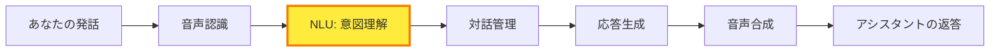

NLUは、人間の曖昧で複雑な言葉を、機械が処理できる明確な「意図」と「情報」に翻訳する翻訳者なのです。

## 🏗️ 基本構造

NLUは大きく3つの仕事をします：

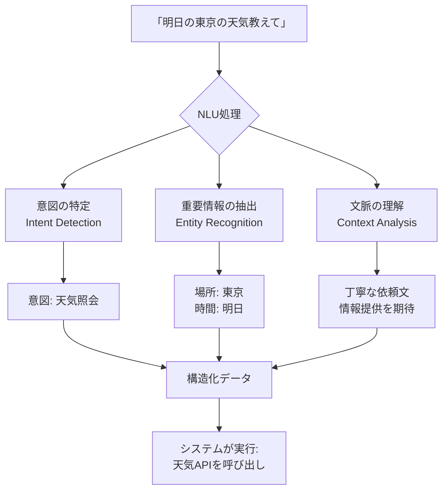

### 3つの柱

1. **意図検出（Intent Detection）**
   - 「何をしたいのか」を見抜く
   - 例：質問なのか、命令なのか、雑談なのか

2. **エンティティ抽出（Entity Recognition）**
   - 「重要な情報」を拾い出す
   - 例：日時、場所、人物名、数値

3. **文脈理解（Context Analysis）**
   - 「前後関係」を踏まえる
   - 例：代名詞が何を指すか、会話の流れ

## ⚡ 主要技術

NLUを支える技術は時代と共に進化してきました：

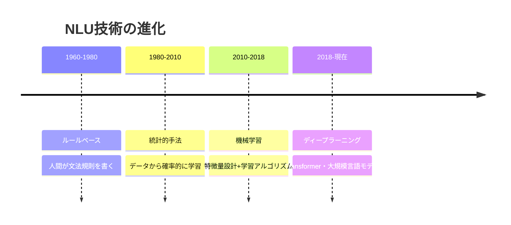

### 現代の主要技術

**1. Transformerアーキテクチャ**
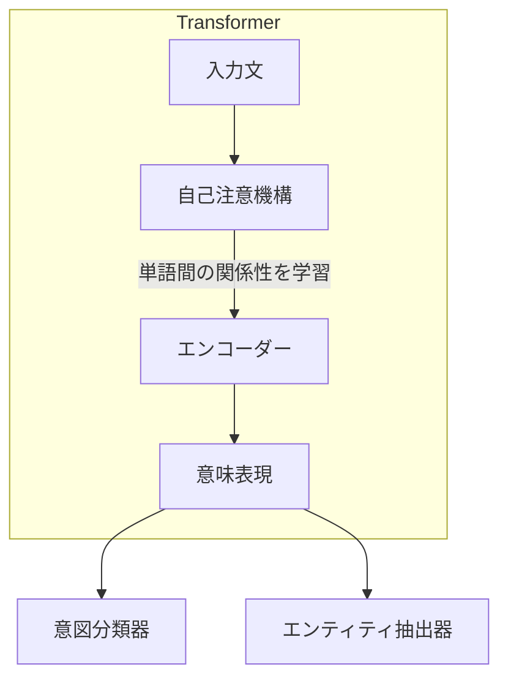

**重要な仕組み：**
- **自己注意機構**：文中のどの単語が重要かを自動判断
- **文脈ベクトル**：単語を数値の羅列（ベクトル）として表現し、意味を数学的に捉える

**2. 大規模言語モデル（LLM）**
- BERT、GPTなどの事前学習モデル
- 膨大なテキストから言語の「常識」を学習済み
- 少量のデータでも高精度の意図理解が可能

## 📜 時代背景と発見に至った経緯

### 物語：コンピューターに「心」を宿す挑戦

**第1章：夢の始まり（1950年代）**

1950年、アラン・チューリングが問いました。「機械は考えることができるか？」この問いから、人工知能研究が始まります。初期の研究者たちは、人間の言葉を理解する機械を作ろうと挑戦しました。

**第2章：ルールとの格闘（1960-1980年代）**

最初のアプローチは「文法規則を全部書き出す」というものでした。

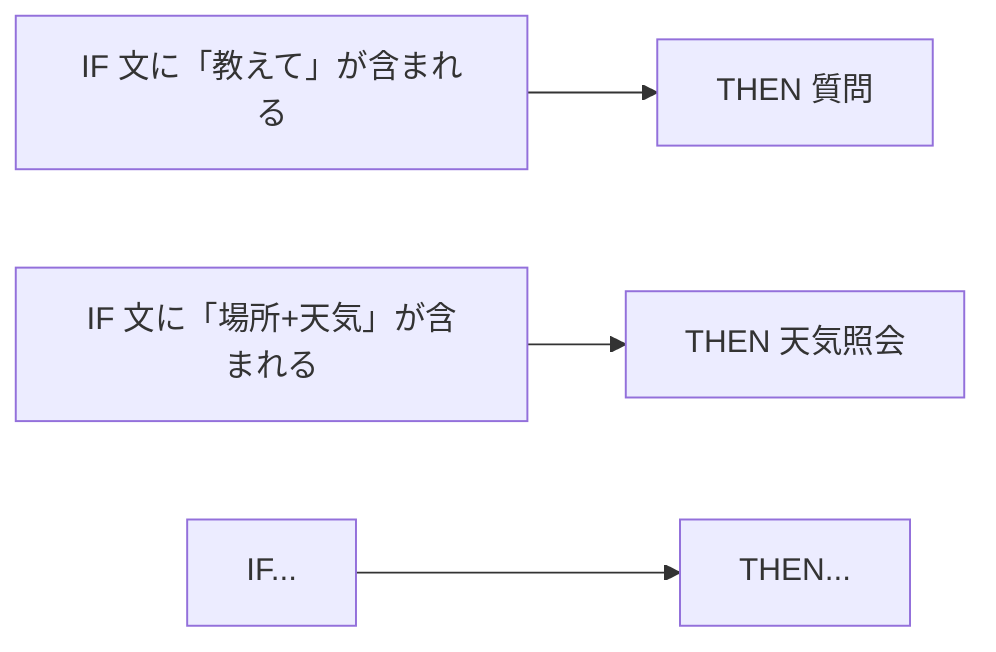

しかし、人間の言葉は複雑すぎました：
- 「天気どう？」
- 「外は？」
- 「傘いる？」

これらすべてが「天気を知りたい」意図なのに、ルールで網羅するのは不可能でした。

**第3章：データに学ぶ転換（1980-2000年代）**

研究者は方針を変えました。「ルールを書くのではなく、データから学習させよう」

統計的手法により、大量の「人間の会話例」から自動的にパターンを見つける技術が生まれます。

**第4章：機械学習の台頭（2000-2010年代）**

サポートベクターマシン（SVM）、条件付き確率場（CRF）などの機械学習手法が登場。音声アシスタントの実用化が始まりました：
- 2011年：Siri登場
- 2014年：Alexa登場
- 2016年：Google Assistant登場

**第5章：革命（2017年-現在）**

2017年、Googleが発表した「Transformer」が全てを変えました。自己注意機構により、文脈を深く理解できるようになったのです。

2018年のBERT、2020年のGPT-3により、NLUは人間に近い理解力を獲得しました。

## 🎨 種類と特徴

NLUには目的や実装方法によって様々な種類があります：

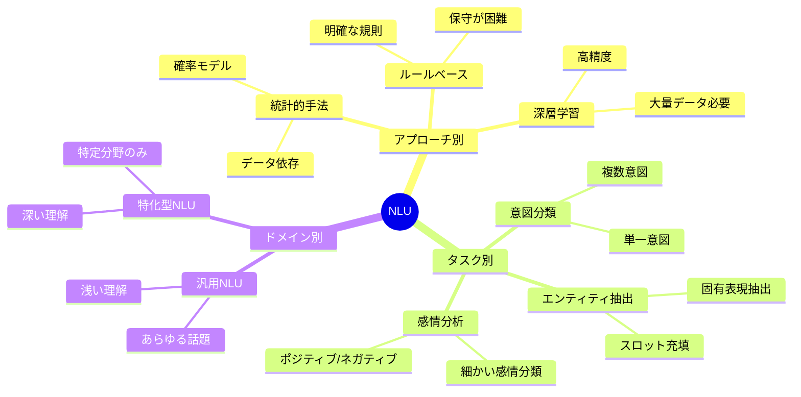

### 主要な種類の比較

| 種類 | 仕組み | 得意なこと | 苦手なこと | 使用例 |
|------|--------|------------|------------|--------|
| **ルールベースNLU** | 人間が書いた規則で判断 | 正確性が必要な場面 | 柔軟性に欠ける | 医療システム、法律相談 |
| **統計的NLU** | 確率モデルで判断 | 限定的なデータでも動作 | 複雑な文脈理解 | 初期の音声アシスタント |
| **深層学習NLU** | ニューラルネットで学習 | 複雑な文脈・曖昧な表現 | 大量データが必要 | 現代の音声アシスタント |
| **ハイブリッドNLU** | 複数手法の組み合わせ | バランスが良い | 開発が複雑 | 企業向けチャットボット |

## 📗 関連する用語

### 同義語・類似概念
- **Natural Language Processing (NLP)**: 自然言語処理全般（NLUはNLPの一部）
- **Intent Recognition**: 意図認識（NLUの中核機能）
- **Semantic Analysis**: 意味解析（NLUとほぼ同義）
- **Language Understanding**: 言語理解（NLUの別称）

### 対比される用語
- **Natural Language Generation (NLG)**: 自然言語生成（理解ではなく文章を作る）
- **Speech Recognition**: 音声認識（音声→テキスト変換、意味理解はしない）
- **Sentiment Analysis**: 感情分析（感情に特化、意図全般は扱わない）

### 多義語の整理
**「理解」という言葉の使い分け：**

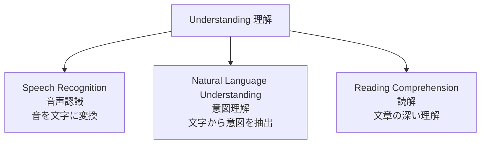

### 類義語の比較

| 用語 | 焦点 | 範囲 | 具体例 |
|------|------|------|--------|
| **NLU** | 意図と情報の抽出 | 文〜短い会話 | 「天気教えて」→天気照会意図 |
| **NLP** | 言語処理全般 | 認識から生成まで | 翻訳、要約、質問応答すべて |
| **対話理解** | 会話の流れ全体 | 複数ターンの会話 | 文脈を保持した対話管理 |

## 💡 メリットとデメリット

### メリット

**1. 自然なコミュニケーション**
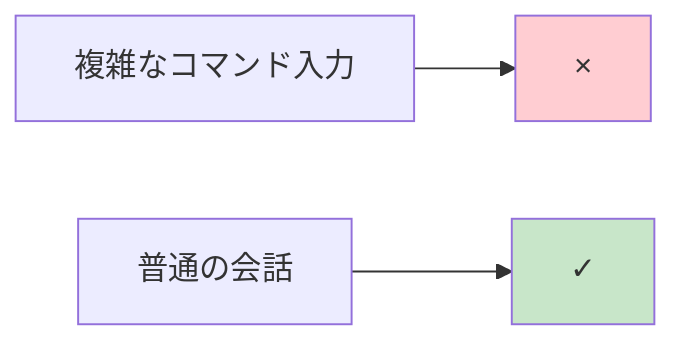
- 専門知識不要で誰でも使える
- 高齢者や子供にも優しい

**2. 多様な表現に対応**
- 「天気は？」「外の様子は？」「傘いる？」すべて理解
- 方言や個人のクセにも適応

**3. 効率的な情報取得**
- タイピング不要
- ハンズフリー操作
- マルチタスクが可能

**4. パーソナライズ**
- 使うほど個人の話し方を学習
- 文脈を記憶して賢くなる

### デメリット

**1. 曖昧性の処理困難**
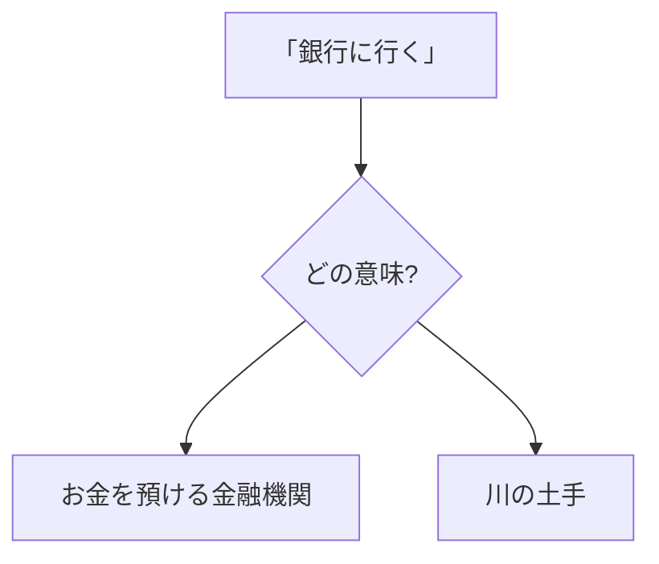
- 人間なら文脈で判断できるが、機械には難しい

**2. プライバシーの懸念**
- 会話内容の収集・分析が必要
- 個人情報漏洩のリスク

**3. 言語・文化依存**
- 言語ごとにモデルが必要
- 文化的背景知識が不可欠
- マイナー言語は精度が低い

**4. 学習コスト**
- 大量の会話データが必要
- 高性能なハードウェアが必須
- 継続的なアップデートが不可欠

**5. エラーの影響**
- 誤解すると間違った行動
- 訂正が難しい場合がある

## 🚀 応用と実例

### 身近な実例

**1. スマートスピーカー**
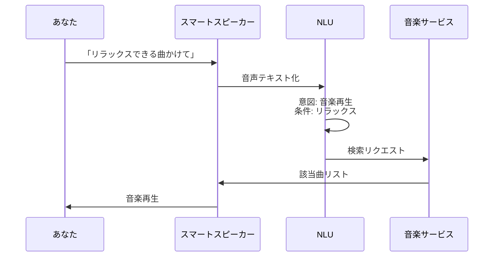

**2. カスタマーサポートチャットボット**
- 「注文をキャンセルしたい」→キャンセル意図 + 注文ID抽出
- 「配送状況は？」→追跡意図 + 注文番号確認
- 「返品方法を教えて」→情報提供意図 + 返品手続き案内

**3. スマートホーム**
- 「寒い」→暖房ON（意図を推測）
- 「映画見る」→照明暗く、テレビON（複数操作）
- 「おやすみ」→全照明OFF、施錠（シーン理解）

**4. 車載アシスタント**
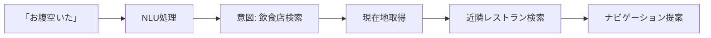

### 高度な応用

**5. 医療分野**
- 患者の症状説明から病名候補を推定
- 医療記録の自動要約
- 診療予約の自動受付

**6. 金融分野**
- 「住宅ローン、金利安いの教えて」→商品推薦
- 不正取引検出（通話内容分析）
- 投資相談チャットボット

**7. 教育分野**
- 学習アシスタント（質問の意図を理解して適切な教材提示）
- 自動採点（記述式回答の意図理解）
- 個別学習パス生成

## 🚀 置換、変遷

### 何かを置き換えたか

**従来技術からの置き換え：**

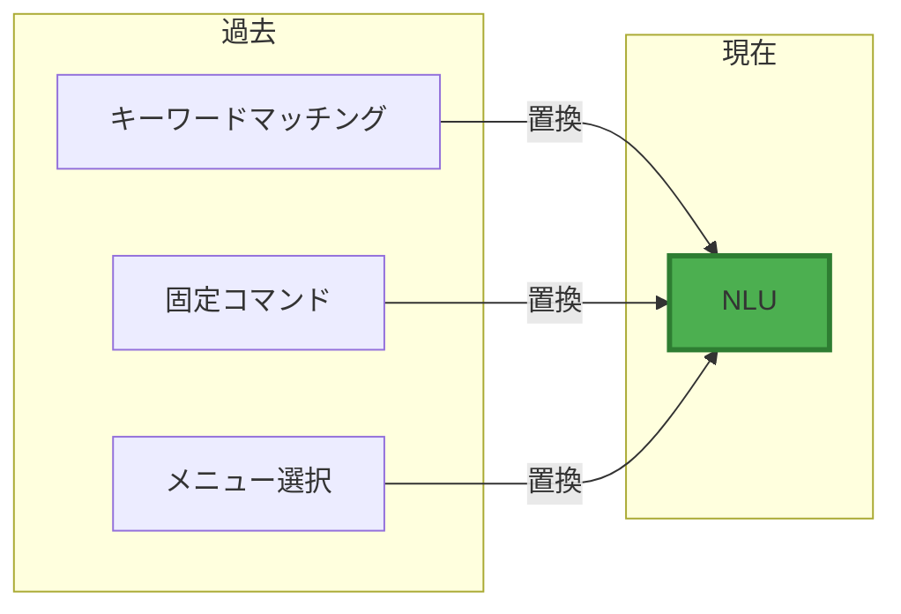

**具体例：**

| 旧技術 | NLUによる改善 |
|--------|--------------|
| 「天気 東京」のようなキーワード入力 | 「明日の東京の天気どう？」自然な文章 |
| 「コマンド1」「コマンド2」の数字選択 | 「これとあれとそれ」代名詞や指示語 |
| プッシュボタン式メニュー | 「〇〇したい」直接的な意図表明 |

### 何かに置き換えられたか・置き換えられつつあるか

**現在進行中の変化：**

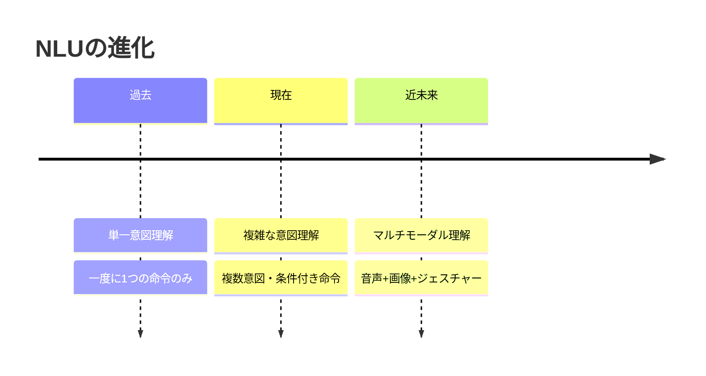

**次世代技術への移行：**
- **マルチモーダルNLU**：言葉だけでなく、表情、ジェスチャー、画像も同時理解
- **共感的NLU**：感情やニュアンスまで深く理解
- **予測的NLU**：言いたいことを先回りして理解

### 何かを継承したか

**NLUが継承した技術：**

1. **言語学の知見**
   - 文法理論
   - 意味論
   - 語用論

2. **情報検索技術**
   - キーワード抽出
   - ランキング手法
   - 関連性評価

3. **パターン認識**
   - 分類アルゴリズム
   - クラスタリング
   - 異常検知

### 何かに継承されたか・継承されつつあるか

**NLUが影響を与えた技術：**

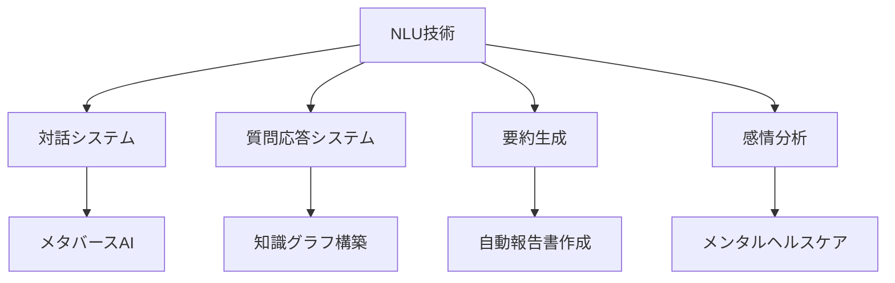

## 🚀 代替、競合

### 何かに代替できるか

**NLUが代替可能なもの：**

1. **人間のオペレーター（一部）**
   - 簡単な問い合わせ対応
   - 予約受付
   - FAQ回答

2. **GUIインターフェース（部分的）**
   - 複雑なメニュー階層
   - 検索フォーム
   - フィルタリング操作

3. **マニュアル・ヘルプドキュメント**
   - 即座の回答提供
   - 個別状況への対応

**限界：**
- 複雑な判断は人間が必要
- クリエイティブな対話は困難
- 責任を伴う決定は不可

### 何かに代替されるか

**NLUを脅かす技術：**

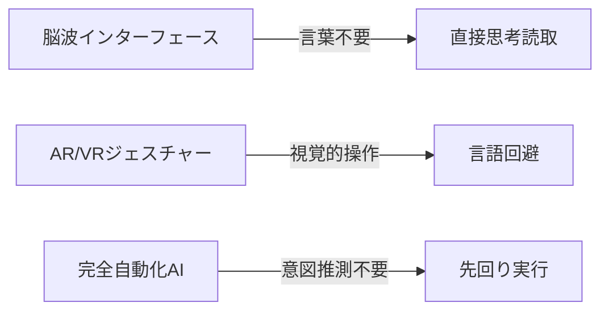

しかし、当面は**共存・融合**の方向：
- 脳波 + NLU：より正確な意図把握
- ジェスチャー + NLU：マルチモーダル理解
- 予測AI + NLU：より自然な対話

### 何かと競合するか

**競合技術領域：**

| 技術 | 競合内容 | 住み分け |
|------|----------|----------|
| **画像認識** | 意図伝達手段 | 視覚情報 vs 言語情報 |
| **ジェスチャー認識** | 操作インターフェース | 非言語 vs 言語 |
| **予測AI** | 事前意図推測 | 明示的 vs 暗黙的 |
| **知識グラフ** | 情報構造化手法 | 動的 vs 静的 |

**協調の方向性：**
現実には競合ではなく**相互補完**が主流：

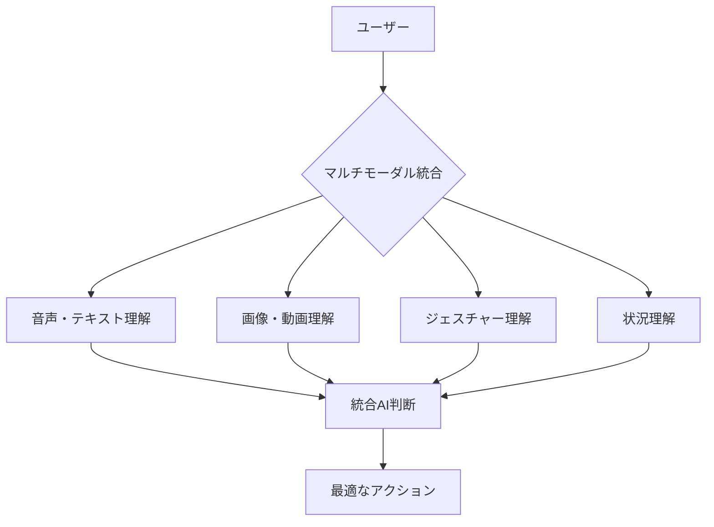

## 🌍 実世界への影響とその後の発展

### 現在の影響

**1. 社会インフラとしての定着**
- 世界中で数十億台のデバイスに搭載
- 日常生活の一部として浸透
- アクセシビリティの向上（障がい者支援）

**2. ビジネスモデルの変革**
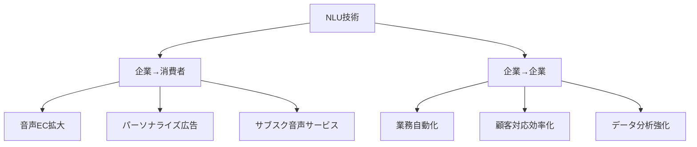

**3. 労働市場への影響**
- 新職種の創出：対話デザイナー、NLUエンジニア
- 既存職種の変化：カスタマーサポート、受付業務
- スキルシフト：人間にしかできない対応へ

### 今後の発展予測

**短期（2025-2027年）**
- **感情理解の高度化**：声のトーン、言葉選びから心理状態を把握
- **マルチ言語シームレス対応**：リアルタイム翻訳との統合
- **プライバシー強化**：デバイス内処理（オンデバイスNLU）の普及

**中期（2027-2030年）**
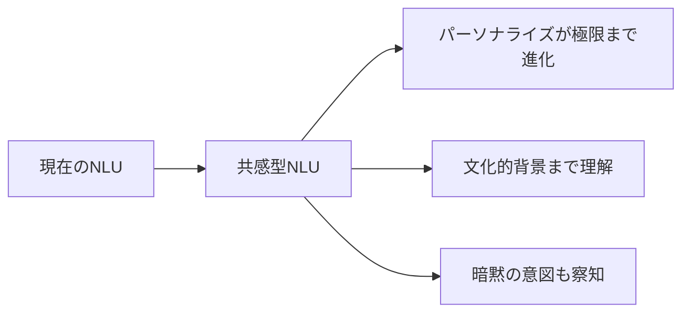

- **状況理解の深化**：周囲の状況、過去の履歴から意図を先読み
- **倫理的判断**：不適切な要求を断る、有害情報を提供しない
- **創造的対話**：単なる命令実行から、提案・アイデア出しへ

**長期（2030年以降）**
- **汎用人工知能（AGI）への統合**：人間並みの総合的理解力
- **脳波インターフェースとの融合**：思考と言語の境界が曖昧に
- **意識の哲学的問題**：機械は本当に「理解」しているのか？

### 未来の課題

**技術的課題**
1. 真の常識理解（物理法則、社会常識）
2. 長期記憶と一貫性の維持
3. 説明可能性（なぜそう理解したか）

**社会的課題**
1. プライバシーと利便性のバランス
2. 技術格差（デジタルディバイド）
3. 依存症・人間関係への影響
4. 雇用構造の変化への対応

**倫理的課題**
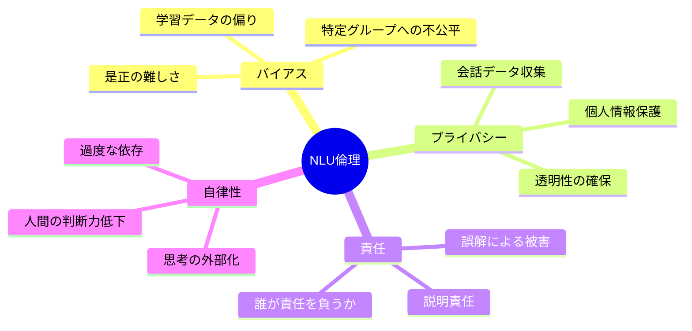

### 結び：人間とAIの新しい関係

NLUは、人間とコンピューターの関係を根本から変えつつあります。かつて機械は「操作する対象」でしたが、今では「対話する相手」になりました。

しかし重要なのは、NLUは人間を置き換えるのではなく、**人間の能力を拡張する**技術だということです。機械が言葉を理解するほど、人間はより人間らしい創造的な活動に集中できるようになります。

未来のNLUは、あなたの最高の秘書であり、通訳であり、友人かもしれません。その未来を作るのは、この技術を理解し、適切に使う私たち自身なのです。

---

## 📚 参考リンク

- [Transformerの仕組み詳細](./transformer.md)
- [音声アシスタント全体構成](./voice-assistant-architecture.md)
- [対話管理システム](./dialogue-management.md)
- [エンティティ抽出技術](./entity-extraction.md)

---
