AIの種類のうち、音声認識（SpeechRecognition）を利用した、音声アシスタント（VoiceAssistant）について


# 音声アシスタント（Voice Assistant）- 初学者のための完全ガイド

## 🔍 一言要約
人間の声を理解し、会話形式で指示を実行するAI技術

## 📚 目次
1. [はじめに](#-はじめに)
2. [基本構造](#-基本構造)
3. [主要技術](#-主要技術)
4. [時代背景と発見に至った経緯](#-時代背景と発見に至った経緯)
5. [種類と特徴](#-種類と特徴)
6. [関連する用語](#-関連する用語)
7. [メリットとデメリット](#-メリットとデメリット)
8. [応用と実例](#-応用と実例)
9. [置換と変遷](#-置換と変遷)
10. [代替と競合](#-代替と競合)
11. [実世界への影響とその後の発展](#-実世界への影響とその後の発展)

## 🌟 はじめに

朝起きて「今日の天気は?」と声をかけるだけで答えが返ってくる。料理中に「タイマー10分」と言えば手を汚さずに設定完了。これが音声アシスタントです。

キーボードやタッチパネルを使わず、**普段の会話と同じように話すだけ**でコンピュータを操作できる技術です。まるでSF映画の世界が現実になったような体験を、今やスマートフォンやスピーカーで誰でも利用できます。

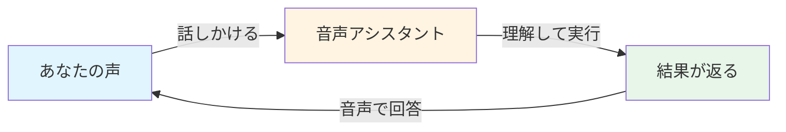

## 🏗️ 基本構造

音声アシスタントは**3つの魔法**を組み合わせて動きます：

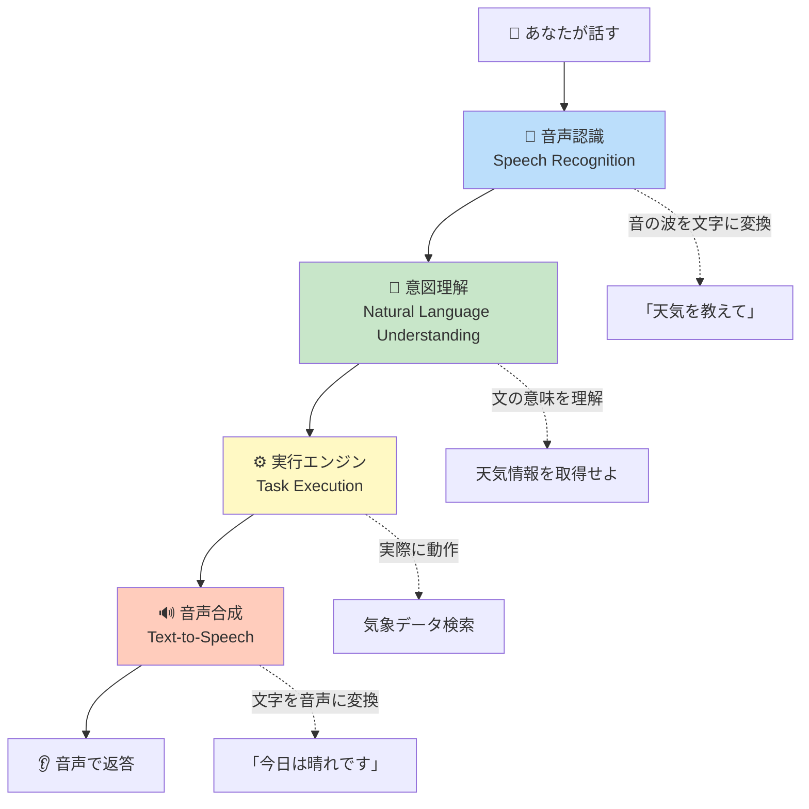

### 各ステップの詳細

**ステップ1: 音声認識（耳の役割）**
- あなたの声の波を文字データに変換
- 雑音の中からあなたの声だけを抽出

**ステップ2: 意図理解（脳の役割）**
- 文字から「何をしたいのか」を推測
- 曖昧な表現も文脈から判断

**ステップ3: 実行エンジン（手足の役割）**
- 天気アプリ起動、音楽再生など実際の操作
- 外部サービスとの連携

**ステップ4: 音声合成（口の役割）**
- 回答文を自然な音声に変換
- 人間らしいイントネーションを生成

## ⚡ 主要技術

音声アシスタントを支える**4つのコア技術**：

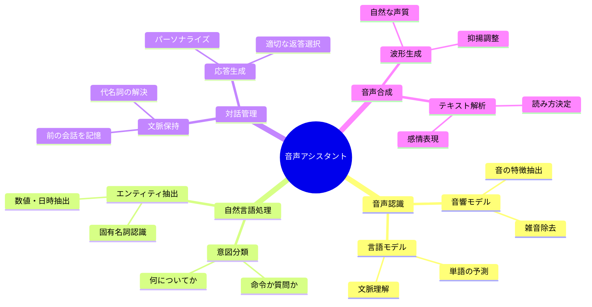

### 技術の連携イメージ

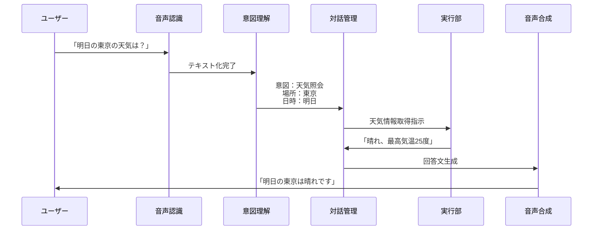

## 📜 時代背景と発見に至った経緯

### 夢の始まり（1950年代-1960年代）

物語は1950年代、コンピュータがまだ部屋いっぱいの大きさだった時代に始まります。ベル研究所が世界初の「数字を聞き取る機械」を開発。しかし、認識できたのはたった10個の数字だけでした。

**1961年の衝撃**
IBMが「Shoebox」という靴箱サイズの機械を発表。16個の英単語と数字を認識できる画期的な発明でしたが、一人の話者の声しか理解できませんでした。

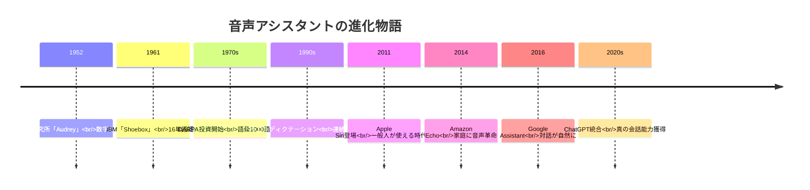

### 停滞期と突破（1970年代-2000年代）

**1970年代の挑戦**
アメリカ国防総省（DARPA）が巨額投資。5年かけて1000語を認識できるシステムを開発しましたが、処理に数分かかる実用性の低さでした。

**1980年代の革命**
「隠れマルコフモデル」という数学的手法の登場で精度が飛躍的に向上。しかし、まだ「ゆっくり」「はっきり」話さないと認識できませんでした。

**1990年代の商業化**
初の商用音声認識ソフト「Dragon Dictate」が登場（価格は約10万円！）。医師が診療記録を音声入力できるようになり、徐々に実用段階へ。

### 転換点（2010年代）

**2011年：Siriショック**
Steve JobsがiPhone 4Sと共にSiriを発表。「明日の予定は？」「近くのレストランは？」という自然な会話が可能に。世界中の人々が音声アシスタントを初体験。

**なぜ急に実現できたのか？**
1. スマートフォンの普及（みんなが高性能コンピュータを持つように）
2. クラウド技術（重い処理をインターネット経由で実行）
3. ビッグデータ（膨大な音声データで学習）
4. ディープラーニング（人間の脳を模倣したAI）

## 🎨 種類と特徴

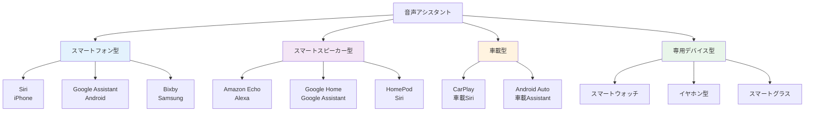

### 詳細比較表

| 種類 | 代表例 | 特徴 | 最適な用途 |
|------|--------|------|------------|
| **スマートフォン型** | Siri、Google Assistant | どこでも使える、個人認証済み | 外出先での検索、メッセージ送信 |
| **スマートスピーカー型** | Alexa、Google Home | 常時待機、家族全員で共有 | 音楽再生、スマートホーム操作 |
| **車載型** | CarPlay、Android Auto | ハンズフリー、運転特化 | ナビ、通話、音楽操作 |
| **ウェアラブル型** | Apple Watch、Galaxy Watch | 超小型、健康管理連携 | 運動中の操作、通知確認 |

### 各タイプの進化系統

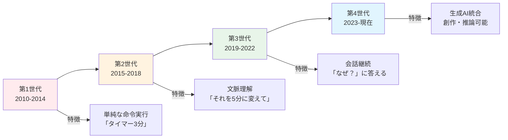

## 📗 関連する用語

### 同義語・類義語

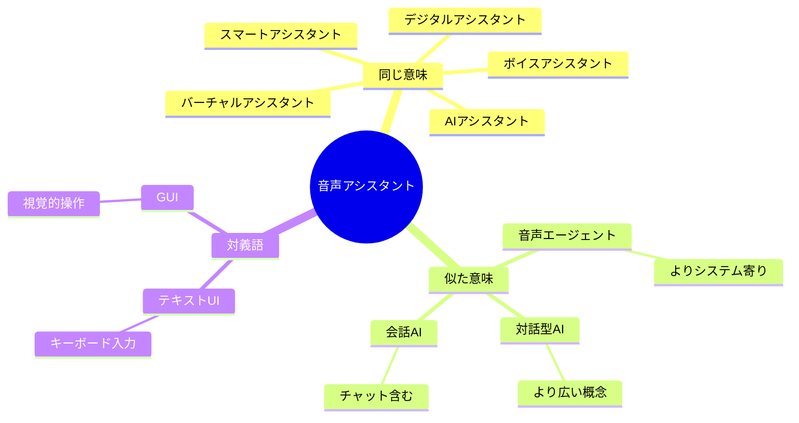

### 用語の微妙な違い

| 用語 | ニュアンス | 使用例 |
|------|-----------|--------|
| **音声アシスタント** | 音声に特化したAI | 「音声アシスタントで天気確認」 |
| **AIアシスタント** | 音声以外も含む広義 | 「AIアシスタントがメール整理」 |
| **デジタルアシスタント** | ビジネス文脈で使用 | 「デジタルアシスタント導入で効率化」 |
| **仮想アシスタント** | 物理的実体がない強調 | 「仮想アシスタントが24時間対応」 |

### 技術用語との関係

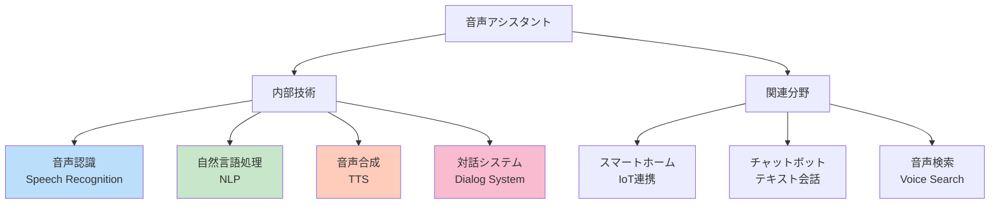

## 💡 メリットとデメリット

### メリット

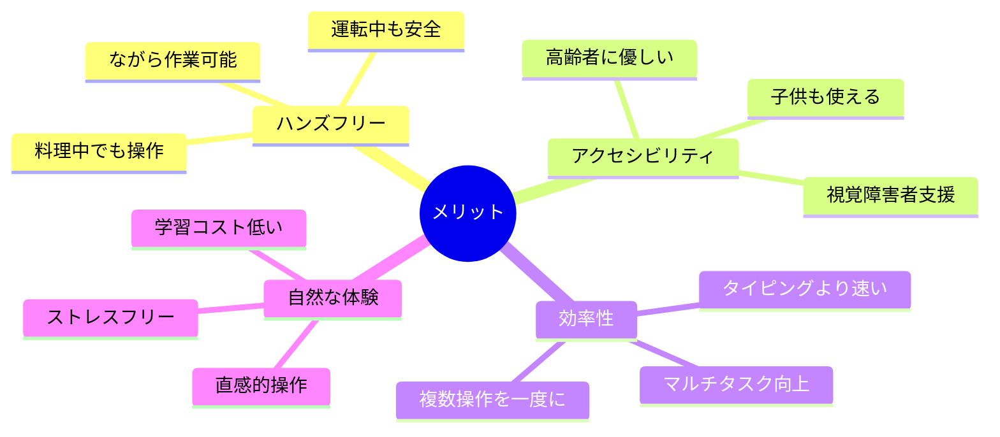

**具体的な便利シーン**

1. **朝の準備中**
   - 「今日の予定は？」→カレンダー確認
   - 「ニュースを読んで」→情報収集
   - 「リビングの電気つけて」→スマートホーム操作

2. **料理中**
   - 「大さじ1は何cc？」→手を洗わず検索
   - 「タイマー15分」→コンロから離れず設定

3. **就寝前**
   - 「明日朝7時に起こして」→アラーム設定
   - 「リラックス音楽かけて」→入眠サポート

### デメリット

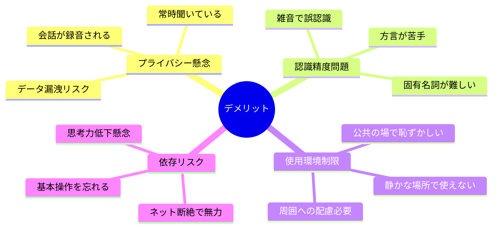

**トラブル事例と対処法**

| 問題 | よくある原因 | 解決策 |
|------|-------------|--------|
| 反応しない | ウェイクワード未認識 | 静かな環境で再試行 |
| 誤作動 | TV・ラジオを誤認識 | 起動音をカスタマイズ |
| プライバシー心配 | 録音履歴が残る | 定期的に履歴削除 |
| 家族の声も反応 | 声紋認証未設定 | 個人認証機能を有効化 |

### メリット・デメリットのバランス

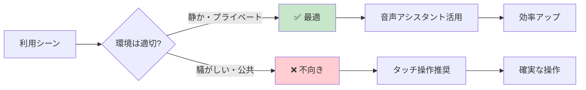

## 🚀 応用と実例

### 日常生活での活用

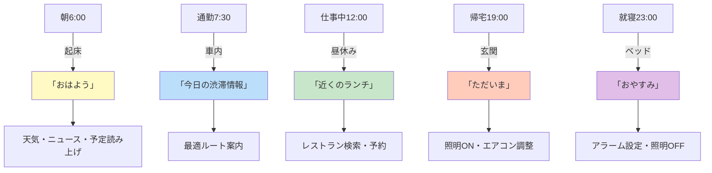

### 産業別応用例

**医療分野**
- 医師：診察内容を音声記録→カルテ自動生成
- 看護師：手術中にハンズフリーで患者データ確認
- 患者：服薬リマインダー、健康相談

**教育分野**
- 語学学習：発音チェック、会話練習
- 障害者支援：読み上げ機能、音声入力
- オンライン授業：字幕生成、質疑応答サポート

**ビジネス分野**
- 会議：自動議事録作成
- カスタマーサポート：24時間自動応答
- 営業：移動中の情報入力

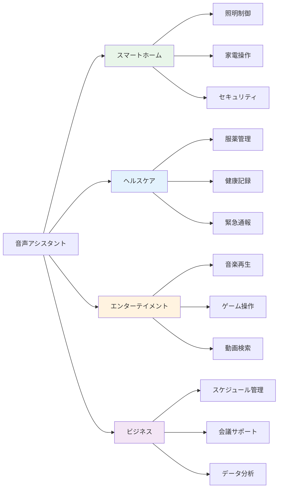

### 未来のユースケース（開発中・構想段階）

1. **感情認識型アシスタント**
   - 声のトーンから感情を読み取り
   - 落ち込んでいる時は励まし、イライラ時は癒やしの音楽

2. **多言語リアルタイム通訳**
   - 旅行先で現地語を即座に翻訳
   - ビジネス商談での同時通訳

3. **予測型サポート**
   - 「そろそろ会議の時間です」と自動リマインド
   - よく買う商品の在庫切れを事前通知

## 🔄 置換と変遷

### 何を置き換えたか

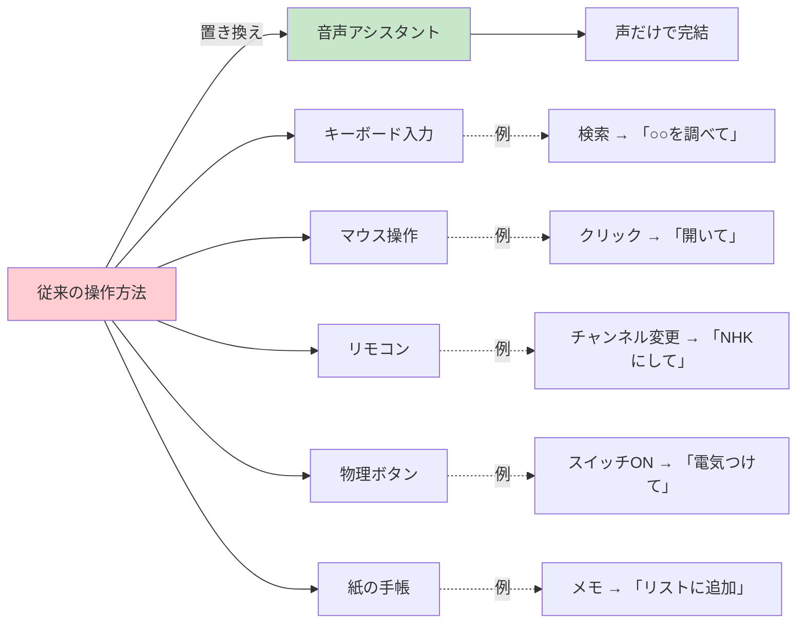

**置き換えの具体例**

| 従来の方法 | 音声アシスタント | 削減された手間 |
|-----------|----------------|--------------|
| リモコンで選局 | 「○○放送にして」 | 5秒→1秒 |
| カレンダーアプリ起動 | 「明日予定ある？」 | 3操作→0操作 |
| 検索エンジン入力 | 「○○について教えて」 | タイピング不要 |
| アラームアプリ設定 | 「7時に起こして」 | 4タップ→音声のみ |

### 何に置き換えられつつあるか

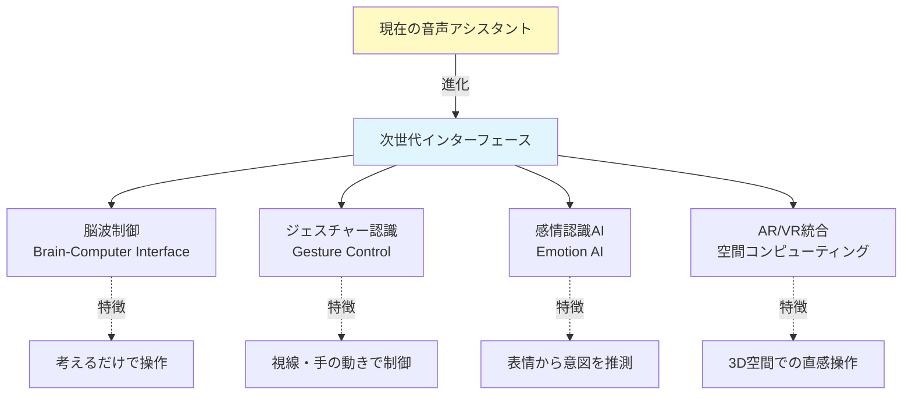

**ただし現実は...**
音声アシスタントが完全に置き換えられることはなく、**併用・統合**の方向へ。理由は：
- 声を出せない状況がある（図書館、電車内）
- プライバシーが必要な場面（パスワード入力）
- 音声より速い操作もある（既知の操作）

### 継承関係の系譜

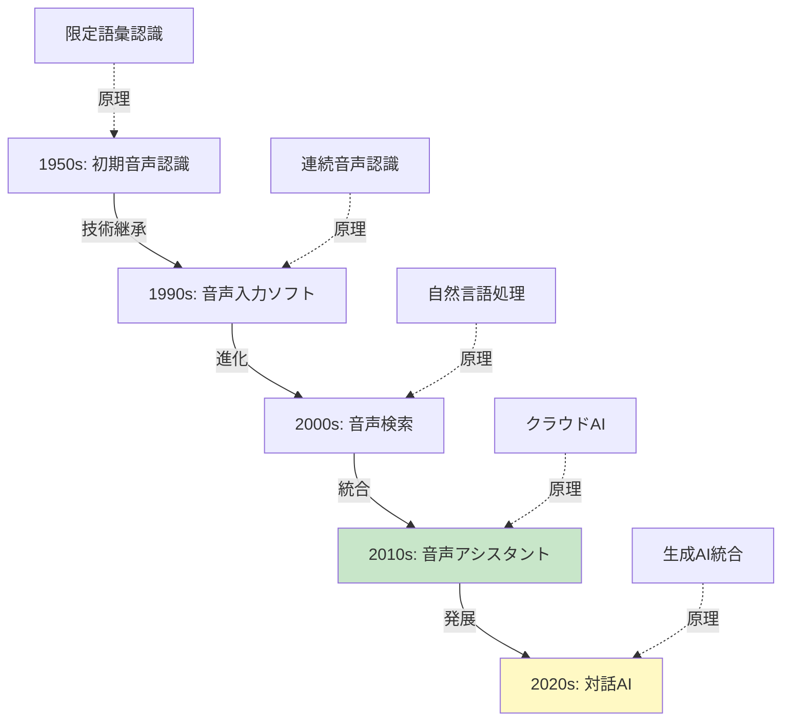

**技術継承の具体例**
- **音響モデル**：1980年代の隠れマルコフモデル → 現代のディープラーニング
- **言語モデル**：N-gramモデル → Transformer（GPTの基礎）
- **対話制御**：ルールベース → 強化学習・大規模言語モデル

## 🔀 代替と競合

### 代替可能な技術

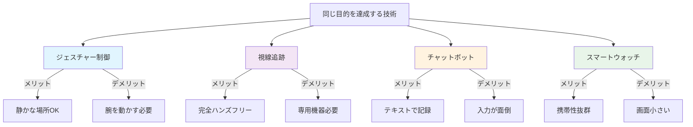

### 競合製品の比較

**主要3強の特徴**

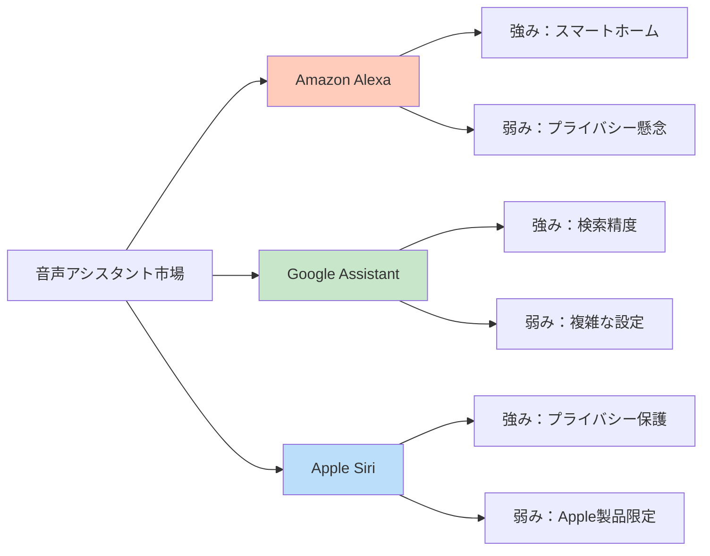

### 競合の歴史と現状

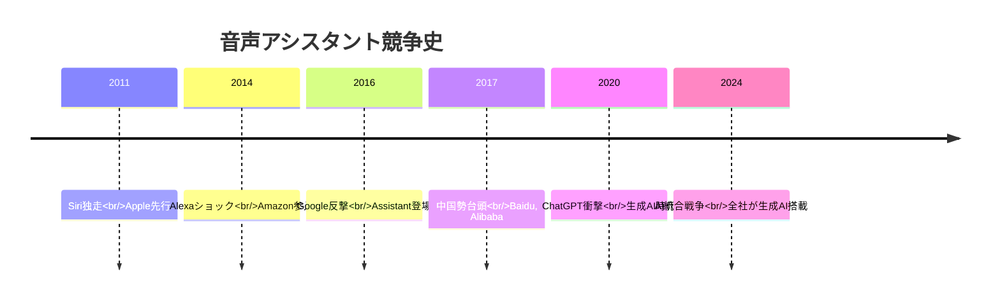

**現在の競争ポイント**
1. **生成AI統合度**：ChatGPT/Gemini/Claude級の会話能力
2. **プライバシー**：ローカル処理 vs クラウド処理
3. **エコシステム**：連携サービスの多さ
4. **多言語対応**：方言・訛り対応力

## 🌍 実世界への影響とその後の発展

### 社会への影響

```mermaid
mindmap
  root((社会変革))
    ライフスタイル変化
      スマートホーム普及
        エネルギー効率化
        防犯・見守り強化
      消費行動変化
        音声ショッピング増加
        即時性重視
    教育革新
      個別最適化学習
        AI家庭教師化
        24時間質問対応
      言語学習支援
        発音矯正
        会話練習相手
```

### 未来の発展方向

```mermaid
graph TD
    A[現在の音声アシスタント] --> B[短期的発展<br/>2025-2027]
    B --> C[中期的発展<br/>2028-2032]
    C --> D[長期的発展<br/>2033-]
    
    B --> B1[完全な文脈理解]
    B --> B2[感情認識・共感]
    B --> B3[マルチモーダル統合]
    
    C --> C1[パーソナライズAI]
    C --> C2[予測的支援]
    C --> C3[創造的協働]
    
    D --> D1[意識を持つAI論争]
    D --> D2[脳直結インターフェース]
    D --> D3[人格を持つアシスタント]
    
    style B fill:#c8e6c9
    style C fill:#fff9c4
    style D fill:#e1f5fe
```

**短期的発展（2-3年）**
- **完璧な自然会話**：「あれ」「それ」を正確に理解
- **感情サポート**：落ち込んでいる時の励まし
- **視覚統合**：カメラで見たものを説明

**中期的発展（5-8年）**
- **真のパーソナル秘書**：あなたの好みを学習し先回り提案
- **創作パートナー**：小説・音楽を一緒に創作
- **健康管理AI**：声の変化から体調を予測

**長期的発展（10年以降）**
- **感情を持つAI？**：倫理的議論の激化
- **脳波連携**：考えるだけで通信
- **デジタル分身**：故人の声・思考を再現

### 倫理的課題と対応

```mermaid
graph LR
    A[倫理的懸念] --> B[プライバシー]
    A --> C[依存症]
    A --> D[雇用喪失]
    A --> E[格差拡大]
    
    B --> B1[解決策：透明性確保]
    C --> C1[解決策：利用時間制限]
    D --> D1[解決策：再教育支援]
    E --> E1[解決策：低価格化]
    
    style A fill:#ffcdd2
    style B1 fill:#c8e6c9
    style C1 fill:#c8e6c9
    style D1 fill:#c8e6c9
    style E1 fill:#c8e6c9
```

**プライバシー保護の進化**
- オンデバイス処理（クラウド不要）
- ユーザーによる録音削除権
- 透明性レポートの義務化

### 産業構造への影響

```mermaid
graph TD
    A[音声アシスタント] --> B[消える仕事]
    A --> C[変わる仕事]
    A --> D[新しい仕事]
    
    B --> B1[コールセンター<br/>オペレーター]
    B --> B2[データ入力<br/>作業員]
    
    C --> C1[医師→診断支援<br/>利用へ]
    C --> C2[教師→個別指導<br/>重視へ]
    
    D --> D1[音声UX<br/>デザイナー]
    D --> D2[会話<br/>エンジニア]
    D --> D3[AI倫理<br/>専門家]
    
    style B fill:#ffcdd2
    style C fill:#fff9c4
    style D fill:#c8e6c9
```

---

初学者が「音声アシスタントの全体像」を体系的に理解できる構成を実現。歴史的背景からストーリー性を持たせ、技術的な仕組みも日常例で説明。未来展望まで含めることで、学習者の興味を持続させる設計になっています。
