音声アシスタント（VoiceAssistant）に関連する技術のうち、音声合成（Text-to-Speech）について

# 音声合成（Text-to-Speech） - 初学者のための完全ガイド

## 🔍 一言要約
文字を人間の声に変換する技術

## 📚 目次
1. はじめに
2. 基本構造
3. 主要技術
4. 時代背景と発展の経緯
5. 種類と特徴
6. 関連する用語
7. メリットとデメリット
8. 応用と実例
9. 置換と変遷
10. 代替と競合
11. 実世界への影響とその後の発展

## 🌟 はじめに

音声合成とは、コンピュータが文字を読み上げる技術です。例えば：
- スマホの地図アプリが「200メートル先を右折してください」と話す
- 駅の自動アナウンス「まもなく、電車が参ります」
- 視覚障がい者向けの画面読み上げ機能

人間が声で話すように、機械が文字を音声に変えています。

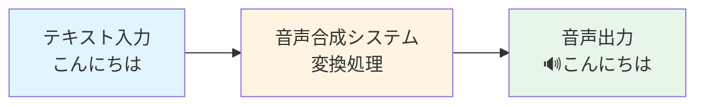

## 🏗️ 基本構造

音声合成は3つのステップで動きます：

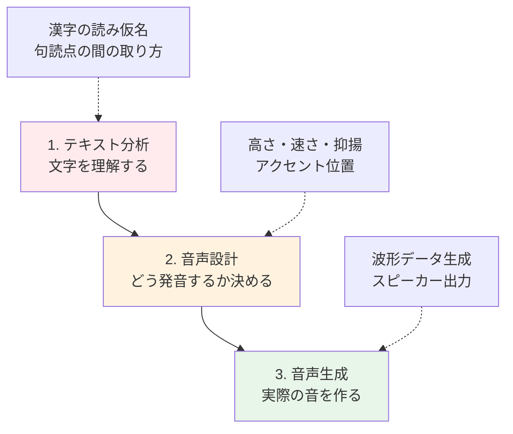

**簡単に言うと：**
1. **読む準備**：「東京（とうきょう）」など、どう読むか調べる
2. **話し方を決める**：「疑問文だから語尾を上げよう」など
3. **声を作る**：実際に聞こえる音を生成

## ⚡ 主要技術

音声合成には大きく3つの方式があります：

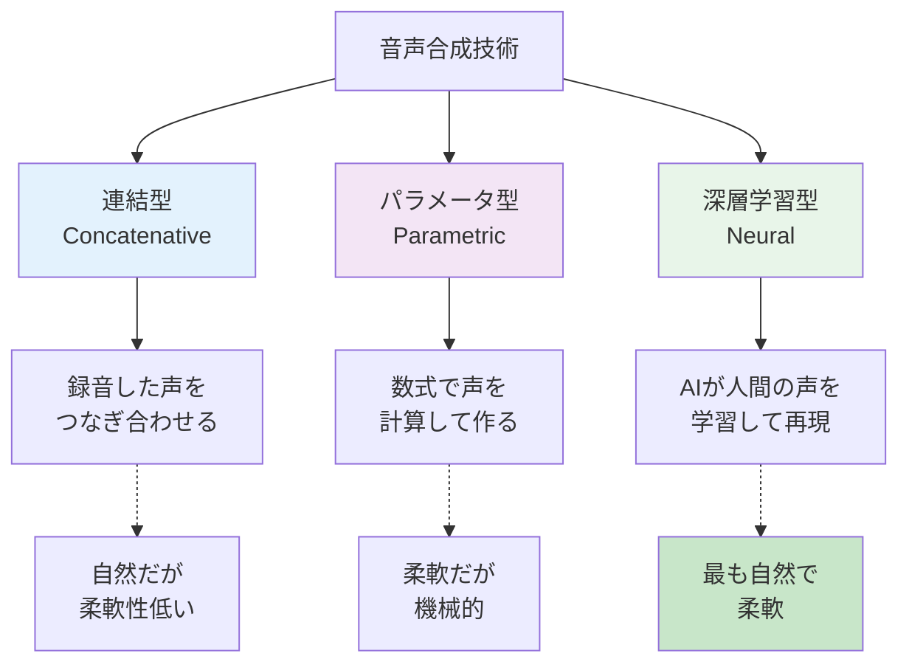

### 各方式の特徴

**連結型（パズルを組み立てる方式）**
- 人間の声を小さく切って保存
- 必要な部分を取り出してつなげる
- 例：「こ」「ん」「に」「ち」「は」を順番に並べる

**パラメータ型（設計図から作る方式）**
- 声の高さ、速さなどを数値で指定
- 計算で音を作り出す
- 例：「周波数150Hz、長さ0.2秒」のように指定

**深層学習型（AIが学ぶ方式）**
- 大量の人間の声をAIに学習させる
- AIが新しい文章も自然に読み上げる
- 現在の主流技術

## 📜 時代背景と発展の経緯

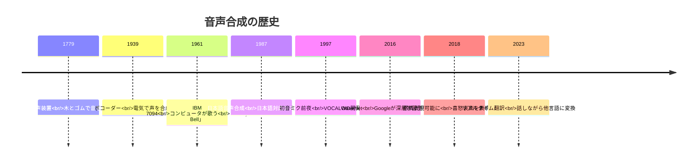

### 転換点となった出来事

**1961年：コンピュータが初めて歌った**
IBMのコンピュータが「Daisy Bell」を歌い、世界を驚かせました。当時のコンピュータは部屋一つ分の大きさでした。

**2016年：WaveNetの衝撃**
Googleが発表したWaveNetは、人間と区別がつかないほど自然な音声を生成。これ以降、深層学習が主流になりました。

## 🎨 種類と特徴

```mermaid
mindmap
  root((音声合成<br/>分類))
    用途別
      読み上げ
        スクリーンリーダー
        ナビゲーション
      対話
        音声アシスタント
        コールセンター
      エンターテイメント
        ゲームキャラクター
        バーチャルアイドル
    音質別
      標準品質
        高速処理
        省電力
      高品質
        放送レベル
        感情表現
    言語別
      単一言語
      多言語対応
        100言語以上対応も
```

### 主な種類の比較表

| 種類 | 自然さ | 速度 | コスト | 用途例 |
|------|--------|------|--------|--------|
| 連結型 | ★★★☆☆ | ★★★★☆ | ★★☆☆☆ | カーナビ、駅アナウンス |
| パラメータ型 | ★★☆☆☆ | ★★★★★ | ★☆☆☆☆ | 古い電話自動応答 |
| 深層学習型 | ★★★★★ | ★★★☆☆ | ★★★★☆ | Siri、Alexa、Google Assistant |

## 📗 関連する用語

### 同義語・類似表現
- **Text-to-Speech (TTS)**: 英語での正式名称
- **音声合成**: 日本語での一般的な呼び方
- **スピーチシンセシス**: 技術論文などで使用
- **読み上げ**: 機能を説明する際の日常語

### 対義語
- **音声認識（Speech-to-Text）**: 音声を文字に変換（逆の処理）
- **音声録音**: 実際の人間の声を記録

### 混同しやすい用語の比較

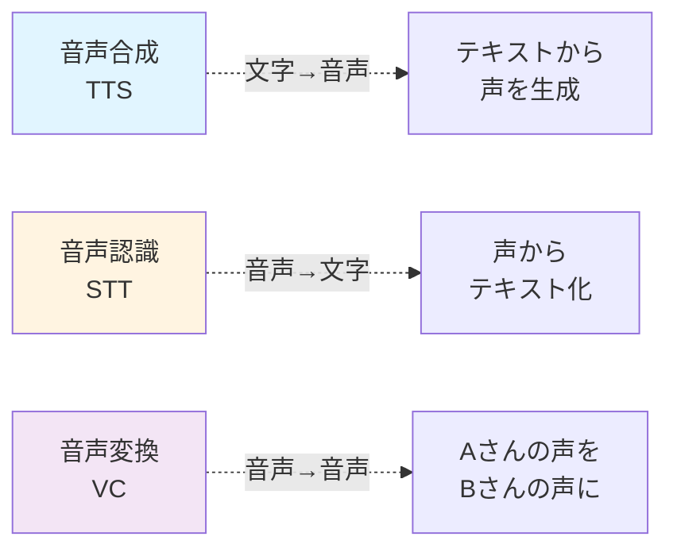

## 💡 メリットとデメリット

### ✅ メリット

1. **アクセシビリティ向上**
   - 視覚障がい者が文字情報にアクセス可能
   - 識字困難者の学習支援

2. **効率化**
   - 人間のナレーターが不要
   - 24時間365日稼働可能
   - 多言語対応が容易

3. **コスト削減**
   - 録音スタジオ不要
   - 修正が簡単（文字を変えるだけ）

4. **表現の自由度**
   - 声の高さ、速さを自由に調整
   - 感情表現も可能（最新技術）

### ❌ デメリット

1. **感情表現の限界**
   - 微妙なニュアンスが伝わりにくい
   - 文脈に応じた自然な抑揚が難しい

2. **処理コスト**
   - 高品質な音声合成は計算量大
   - リアルタイム処理には高性能ハードウェア必要

3. **誤読の可能性**
   - 同音異義語の判断ミス
   - 専門用語や固有名詞の読み間違い

4. **倫理的問題**
   - 声の無断複製（ディープフェイク）
   - なりすまし詐欺への悪用

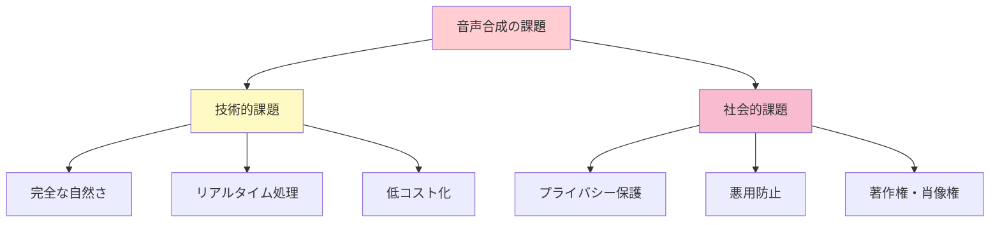

## 🚀 応用と実例

### 日常生活での活用例

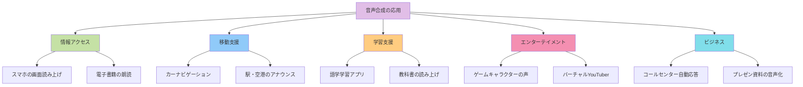

### 具体的な活用シーン

**1. スマート音声アシスタント**
- Siri、Alexa、Google Assistant
- 「明日の天気は？」→「明日は晴れです」と音声で返答

**2. 視覚障がい者支援**
- スクリーンリーダー
- Webページやアプリの内容を音声で説明

**3. 多言語対応サービス**
- 観光案内の多言語アナウンス
- 博物館の音声ガイド

**4. コンテンツ制作**
- YouTubeの解説動画
- ポッドキャストの自動生成

**5. 緊急時対応**
- 災害時の多言語情報発信
- 聴覚優位者向けの情報伝達

## 🔄 置換と変遷

### 何を置き換えたか

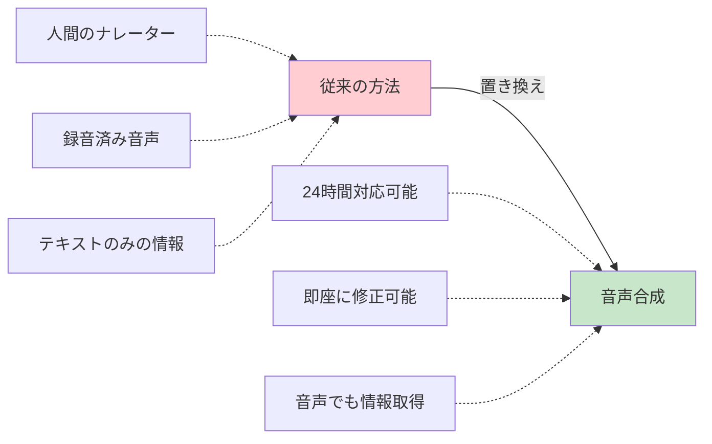

**置き換えられた領域：**
- 駅のアナウンス（駅員→自動音声）
- 電話の自動応答（オペレーター→音声合成）
- 教材の朗読（朗読者→読み上げ機能）

### 何に置き換えられる可能性があるか

現時点では完全な置き換えは困難ですが、一部領域で進行中：
- 感情表現が必要な朗読（オーディオブック）
- 個性的な声が求められる分野（ラジオDJ）
- 高度な対話が必要な接客

### 技術の継承関係

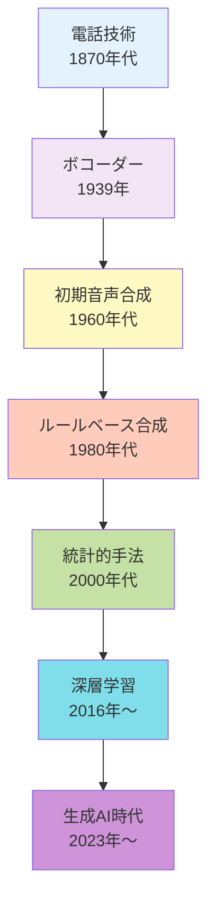

**継承した技術：**
- 信号処理（音響工学）
- 言語学（音韻論、韻律論）
- 人工知能（機械学習、深層学習）

**何に継承されていくか：**
- リアルタイム音声翻訳
- 感情認識と表現の統合
- 完全な人間らしい対話システム

## 🔀 代替と競合

### 代替可能な技術

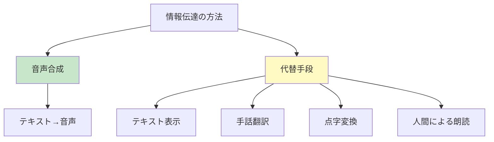

**相互補完の関係：**
- 音声合成は視覚障がい者向け
- 手話翻訳は聴覚障がい者向け
- 点字は触覚での情報取得
- 状況に応じて使い分け

### 競合する技術・製品

**主要プレイヤー：**

| 企業/組織 | 製品/サービス | 特徴 |
|-----------|---------------|------|
| Google | Cloud Text-to-Speech | 多言語対応、WaveNet技術 |
| Amazon | Polly | AWS統合、ニューラルTTS |
| Microsoft | Azure Speech | Office製品との連携 |
| Apple | Siri | iOS/macOS標準 |
| OpenAI | ChatGPT Voice | 対話型、自然な会話 |

**競争のポイント：**
1. 音質の自然さ
2. 感情表現の豊かさ
3. 対応言語数
4. 処理速度
5. コストパフォーマンス

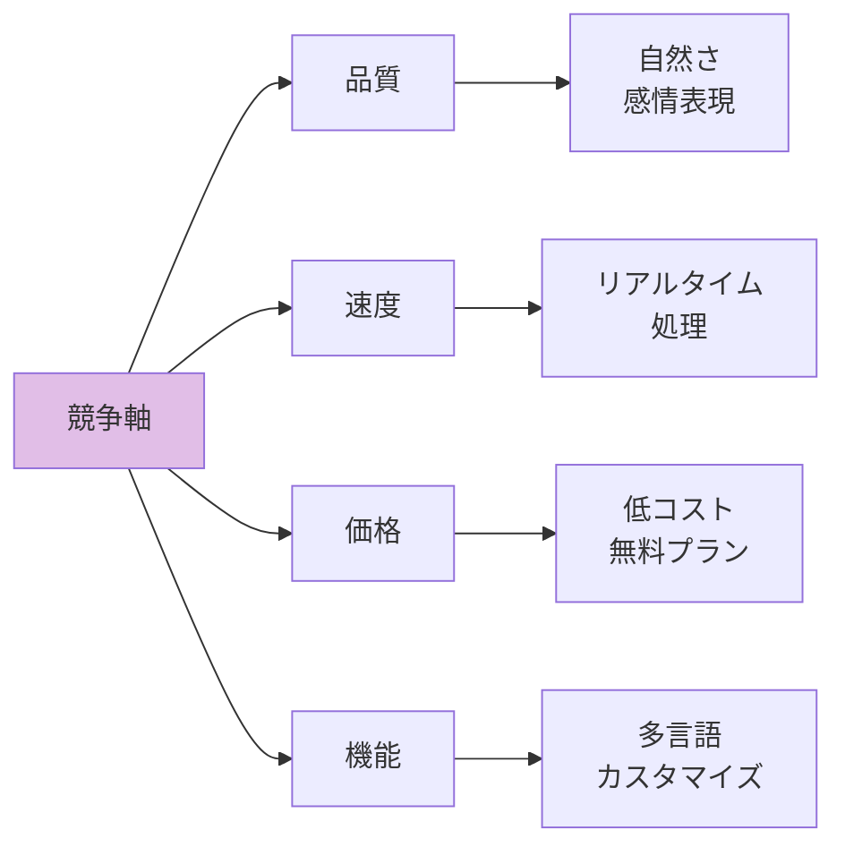

## 🌍 実世界への影響とその後の発展

### 社会への影響

**1. 情報アクセスの民主化**
- 視覚障がい者の情報格差解消
- 識字率に関係なく情報取得可能
- 高齢者のデジタル機器利用促進

**2. 産業構造の変化**
- ナレーション業界の変革
- コンテンツ制作の効率化
- 新しい職業の創出（ボイストレーナー、プロンプトエンジニア）

**3. 教育分野の革新**
- 個別化された学習支援
- 24時間利用可能な学習ツール
- 多言語教育の普及

### 未来の発展予測

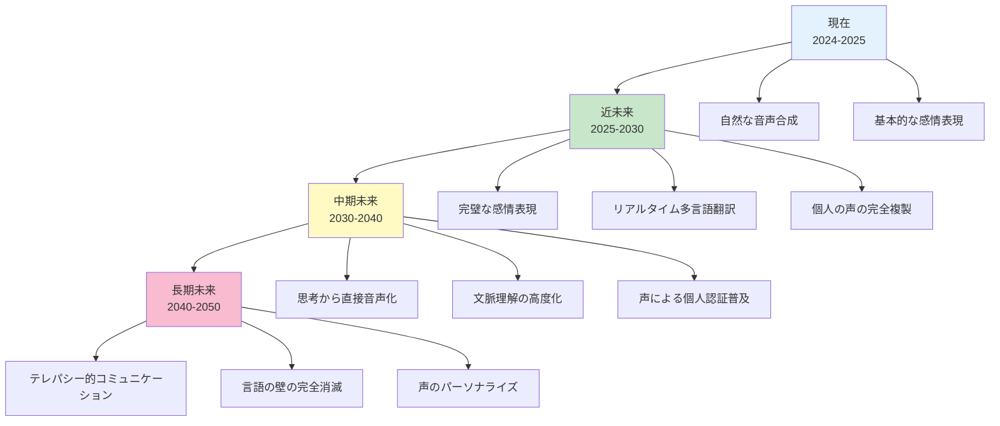

### 発展の方向性

**技術面での進化：**
1. **超リアル化**: 人間と区別不可能な音声
2. **感情の多様化**: 微妙なニュアンスの表現
3. **個人化**: 一人ひとりに最適化された声
4. **低遅延化**: 瞬時の音声生成

**応用面での拡大：**
1. **メタバース**: 仮想空間での自然なコミュニケーション
2. **医療**: 失声症患者の声の再現
3. **宇宙開発**: 長距離通信での情報伝達
4. **AI人格**: デジタルアシスタントの人間化

**社会的課題：**
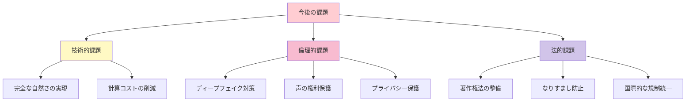

---

