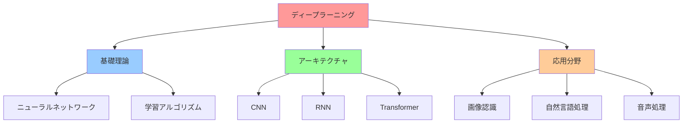
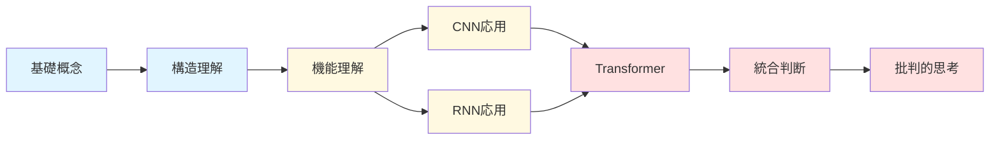
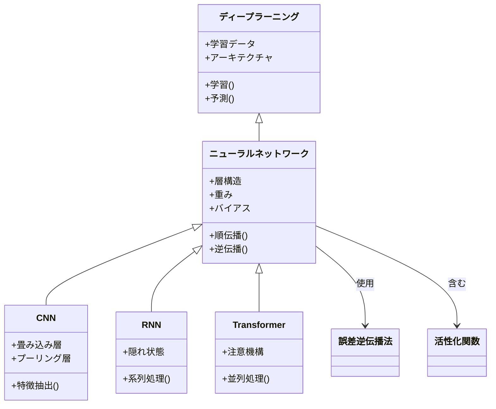
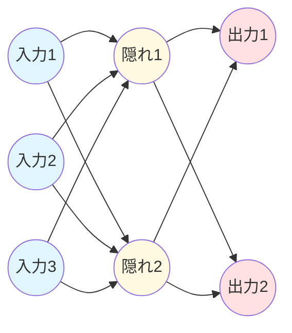
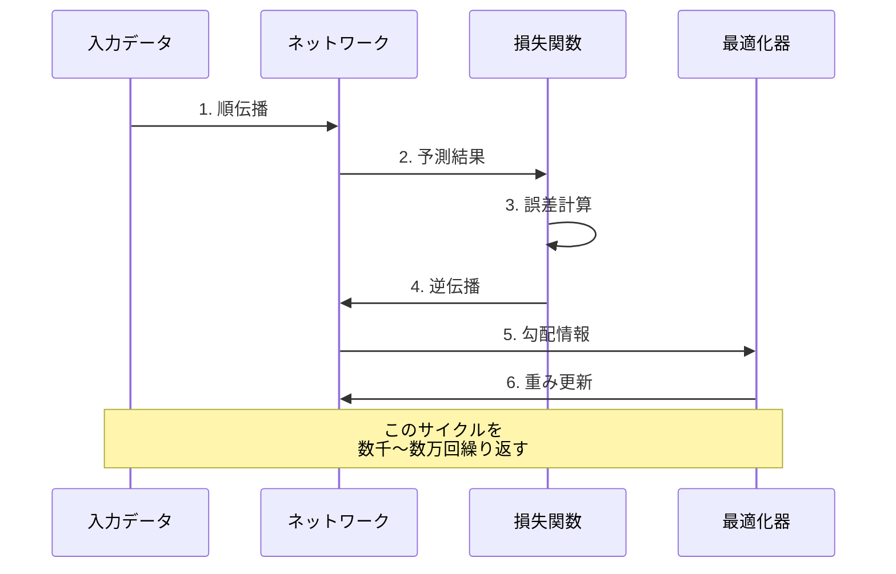
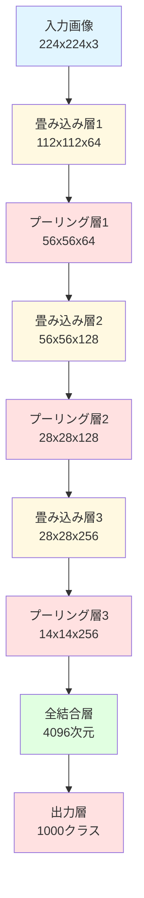
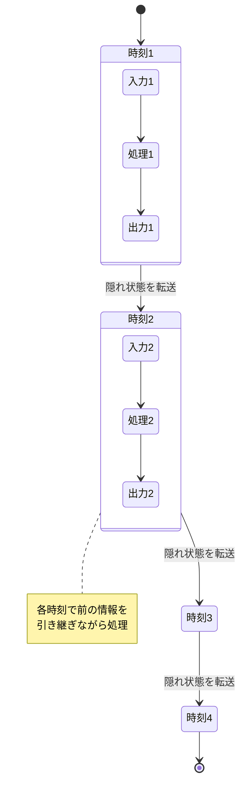
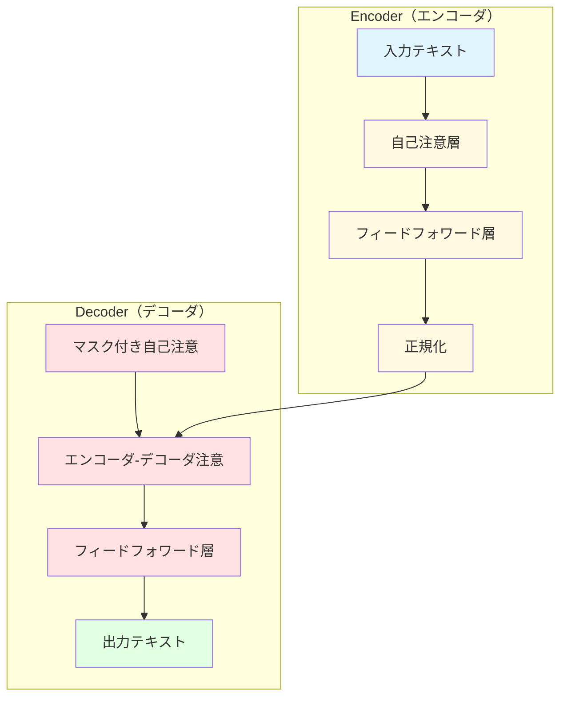
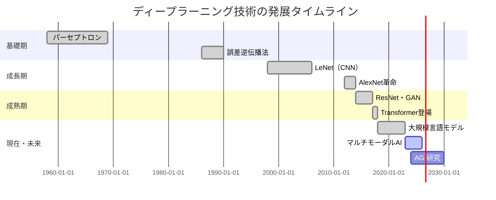

# ディープラーニング: 段階的理解ガイド

> **学習目標**: ディープラーニングの基本原理、主要アーキテクチャ、実用的応用を理解し、自分で簡単なモデルを構築できる基礎知識を習得する
> **推奨学習時間**: 8-10時間
> **前提知識**: 基本的な数学（行列、微分）、プログラミングの初歩

## 1. 全体マップ

ディープラーニングは、人間の脳の神経回路を模倣した多層ニューラルネットワークを用いる機械学習手法です。画像認識、自然言語処理、音声認識など幅広い分野で革新的な成果を上げています。

**学習範囲**:
- **含む**: 基本概念、主要アーキテクチャ（CNN、RNN、Transformer）、学習プロセス、実用例
- **含まない**: 高度な数学的証明、最新研究、大規模システム構築の詳細

**主要サブトピック**:
1. ニューラルネットワークの基礎
2. 学習メカニズム（誤差逆伝播法）
3. 畳み込みニューラルネットワーク（CNN）
4. 再帰型ニューラルネットワーク（RNN）
5. Transformer アーキテクチャ
6. 実用的応用と課題

## 2. ガイド質問

### 基礎理解
**Q1**: ディープラーニングと従来の機械学習の違いは何か？ ★☆☆
**Q2**: ニューラルネットワークの「層」は何を表しているのか？ ★☆☆
**Q3**: 活性化関数の役割は何か？ ★★☆

### 応用理解
**Q4**: なぜ画像認識にCNNが適しているのか？ ★★☆
**Q5**: RNNが系列データに強い理由は？ ★★☆
**Q6**: Transformerの「注意機構」とは何か？ ★★★

### 統合理解
**Q7**: 異なるアーキテクチャをどのように使い分けるべきか？ ★★★
**Q8**: ディープラーニングの限界と今後の課題は何か？ ★★★

## 3. 核心概念

### 重要用語と定義

**ニューラルネットワーク**: 入力層、隠れ層、出力層から成る計算グラフで、各層のノード（ニューロン）が重み付き接続で結ばれた構造

**誤差逆伝播法（Backpropagation）**: 出力の誤差を逆向きに伝播させ、各層の重みを調整する学習アルゴリズム

**活性化関数**: ニューロンの出力を非線形変換する関数（ReLU、Sigmoid、Tanhなど）で、複雑なパターンの学習を可能にする

**畳み込み層（Convolutional Layer）**: 画像の局所的特徴を抽出するフィルタを適用する層

**再帰構造（Recurrent Structure）**: 前の時刻の情報を保持し次の処理に利用する仕組み

**注意機構（Attention Mechanism）**: 入力の重要な部分に焦点を当てる重み付けメカニズム

**過学習（Overfitting）**: 訓練データに過度に適合し、未知データへの汎化性能が低下する現象

**ドロップアウト（Dropout）**: 過学習を防ぐため、学習時にランダムにニューロンを無効化する正則化手法

**記憶法**: **NABRO** - **N**eural network（ニューラル）、**A**ctivation（活性化）、**B**ackpropagation（逆伝播）、**R**ecurrent（再帰）、**O**verfitting（過学習）

## 4. 段階的詳細展開

### 4.1 ニューラルネットワークの基礎

#### 層1: 導入
ニューラルネットワークは、脳の神経細胞の働きを数学的にモデル化したものです。複数の層に配置されたノード（ニューロン）が、重み付けされた接続を通じて情報を伝達します。

#### 層2: 展開
基本構造は**入力層**→**隠れ層**（1層以上）→**出力層**の3種類です。各ニューロンは前の層からの入力を受け取り、重みを掛けて合計し、活性化関数を通して次の層へ出力します。

数式で表すと：出力 = 活性化関数(Σ(入力 × 重み) + バイアス)

**具体例**: 手書き数字認識の場合
- 入力層: 28×28ピクセル=784ノード（各ピクセルの明るさ）
- 隠れ層: 128ノード（特徴を抽出）
- 出力層: 10ノード（0-9の確率）

**一般的な誤解**: 「層が多ければ必ず性能が上がる」→実際には過学習のリスクが増加し、適切な層数の選択が重要です。

#### 層3: 要約
ニューラルネットワークは重み付き接続と活性化関数により、入力を段階的に変換して目的の出力を得る仕組みです。次は、この重みをどう学習するかを見ていきます。

### 4.2 学習メカニズム（誤差逆伝播法）

#### 層1: 導入
ディープラーニングの学習は、予測と正解の誤差を最小化するよう重みを調整する最適化問題です。誤差逆伝播法がこの調整を効率的に実行します。

#### 層2: 展開
学習プロセスは以下の4ステップで進行します：

1. **順伝播**: 入力データを前から後ろへ伝播させて予測を得る
2. **誤差計算**: 予測と正解の差を損失関数で数値化
3. **逆伝播**: 誤差を出力層から入力層へ逆向きに伝播
4. **重み更新**: 各層の重みを勾配降下法で調整

**具体例**: 猫の画像を「犬」と誤認識した場合
- 損失関数が大きな誤差を検出
- 「犬」の出力ノードの重みを減少
- 「猫」の出力ノードの重みを増加
- 中間層の猫特徴検出器の重みを強化

**学習率**は重みの更新幅を制御するパラメータで、大きすぎると不安定、小さすぎると学習が遅くなります（典型値：0.001-0.1）。

**実世界での応用**: この仕組みにより、数百万枚の画像から自動的にパターンを学習できるため、手動での特徴設計が不要になりました。

#### 層3: 要約
誤差逆伝播法は、誤差を逆向きに伝え各層の重みを最適化する効率的な学習アルゴリズムです。このメカニズムが様々なアーキテクチャの基盤となります。

### 4.3 畳み込みニューラルネットワーク（CNN）

#### 層1: 導入
CNNは画像認識に特化したアーキテクチャで、画像の局所的パターンを効率的に検出します。全結合層だけでは扱いきれない画像の空間構造を保持した処理が可能です。

#### 層2: 展開
CNNは主に3種類の層で構成されます：

**畳み込み層**: 小さなフィルタ（例：3×3ピクセル）を画像全体にスライドさせ、エッジや色の変化などの特徴を検出。同じフィルタを共有するため、パラメータ数が大幅に削減されます。

**プーリング層**: 特徴マップを縮小し、位置の微小な変化に対する頑健性を向上。最大プーリングは各領域の最大値を取る手法です。

**全結合層**: 抽出された特徴を最終的な分類結果に変換します。

**具体例**: 顔認識システム
- 第1層: エッジ検出（縦線、横線）
- 第2層: 単純な形状（目、鼻の輪郭）
- 第3層: 複雑なパーツ（顔全体の構造）
- 最終層: 個人の識別

**一般的な誤解**: 「CNNは画像専用」→実際には音声スペクトログラムや時系列データにも応用可能です。

**実世界での応用**: 自動運転の物体検出、医療画像診断、顔認証システムなど、ピクセルレベルの情報から高度な判断を要するタスクで活躍しています。

#### 層3: 要約
CNNは畳み込み演算により画像の階層的特徴を効率的に抽出し、視覚タスクで卓越した性能を発揮します。次は時系列データに強いRNNを見ていきます。

### 4.4 再帰型ニューラルネットワーク（RNN）

#### 層1: 導入
RNNは系列データ（文章、音声、時系列）を扱うアーキテクチャで、前の時刻の情報を記憶しながら処理を進めます。文脈依存性が重要なタスクに適しています。

#### 層2: 展開
RNNの核心は**隠れ状態**という内部メモリです。各時刻で、現在の入力と前の隠れ状態を組み合わせて、新しい隠れ状態と出力を生成します。

数式: h_t = tanh(W_h × h_{t-1} + W_x × x_t + b)

しかし基本的なRNNには**勾配消失問題**があり、長い系列では初期の情報が失われます。この解決策として**LSTM**（Long Short-Term Memory）と**GRU**（Gated Recurrent Unit）が開発されました。

**LSTM**は「ゲート機構」により、どの情報を記憶・忘却・出力するかを学習します：
- 忘却ゲート: 不要な情報を捨てる
- 入力ゲート: 新情報を取り込む
- 出力ゲート: 出力する情報を選択

**具体例**: 機械翻訳（英→日）
- "The cat sat on the mat" を順次読み込み
- 各単語の文脈（主語、動詞、場所）を記憶
- 日本語の語順に合わせて「猫がマットの上に座った」と生成

**実世界での応用**: 株価予測、音声認識、テキスト生成（チャットボット）、動画キャプション生成など、時間的依存関係が重要な分野で使用されています。

#### 層3: 要約
RNNは隠れ状態により系列の文脈を保持し、時系列データの処理を可能にします。しかし長い依存関係には限界があり、これがTransformerの登場につながります。

### 4.5 Transformer アーキテクチャ

#### 層1: 導入
Transformerは2017年に登場した革新的アーキテクチャで、RNNの逐次処理の制約を克服し、並列計算と長距離依存の両方を実現しました。現代の大規模言語モデル（GPT、BERTなど）の基盤です。

#### 層2: 展開
Transformerの核心技術は**注意機構（Attention Mechanism）**、特に**自己注意（Self-Attention）**です。これは入力系列内の各要素が、他のすべての要素とどれだけ関連しているかを計算します。

**自己注意の仕組み**:
1. 各単語を3つのベクトル（Query、Key、Value）に変換
2. Query と Key の類似度を計算（注意スコア）
3. スコアで Value を重み付けして合計

**具体例**: "The animal didn't cross the street because it was too tired"
- "it" という単語を処理する際
- 注意機構が "animal"（0.8）と "street"（0.2）の注意スコアを計算
- "animal" を強く参照して "it = 動物" と解釈

**マルチヘッド注意**: 複数の注意パターンを並列に学習（例：文法的関係、意味的関係）。8〜16ヘッドが一般的です。

**位置エンコーディング**: 単語の順序情報を正弦波関数で埋め込み、系列の位置関係を保持します。

**実世界での応用**: 
- GPT系: テキスト生成、コード生成
- BERT系: 質問応答、文書分類
- 画像版Transformer（ViT）: 画像認識

**TransformerとRNNの比較**:
- 利点: 並列処理可能、長距離依存に強い、学習が高速
- 欠点: メモリ使用量が多い（系列長の2乗に比例）、短い系列では過剰

#### 層3: 要約
Transformerは注意機構により全要素間の関係を直接モデル化し、自然言語処理を飛躍的に進化させました。現在はマルチモーダル（テキスト+画像+音声）への拡張が進んでいます。

### 4.6 実用的応用と課題

#### 層1: 導入
ディープラーニングは学術研究から実用製品まで幅広く展開されていますが、同時に解決すべき技術的・倫理的課題も抱えています。

#### 層2: 展開

**主要応用分野**:

1. **コンピュータビジョン**
   - 物体検出・追跡（自動運転、監視カメラ）
   - 医療画像診断（がん検出、CT/MRI解析）
   - 顔認証、画像生成（DALL-E、Stable Diffusion）

2. **自然言語処理**
   - 機械翻訳（Google翻訳、DeepL）
   - チャットボット、文書要約
   - コード生成（GitHub Copilot）

3. **音声技術**
   - 音声認識（Siri、Alexa）
   - 音声合成（自然な読み上げ）
   - 音楽生成

4. **その他**
   - ゲームAI（AlphaGo、Dota 2）
   - 創薬（タンパク質構造予測）
   - 推薦システム（Netflix、Amazon）

**技術的課題**:

- **データ要求**: 高性能には大量のラベル付きデータが必要（数万〜数百万サンプル）
- **計算コスト**: 大規模モデルの学習に数千万円規模の計算資源
- **解釈可能性**: なぜその予測をしたのか説明が困難（ブラックボックス問題）
- **過学習**: 訓練データに過適合し、未知データで性能低下
- **敵対的攻撃**: 意図的な微小ノイズで誤認識を誘発可能

**倫理的・社会的課題**:

- **バイアス**: 訓練データの偏りが差別的予測につながる（例：採用AIの性別バイアス）
- **プライバシー**: 学習データからの個人情報漏洩リスク
- **悪用**: ディープフェイク動画、自動化された偽情報生成
- **雇用への影響**: 自動化による職種の変化

**対策と今後の方向性**:

- 少数データ学習（Few-shot Learning）、転移学習
- 説明可能AI（XAI: Explainable AI）の開発
- フェアネス・プライバシー保護技術
- 人間との協調システム設計

#### 層3: 要約
ディープラーニングは多くの分野で実用化が進む一方、データ・計算・倫理面の課題があり、技術と社会制度の両面での改善が求められています。

## 5. 統合・実践

### ガイド質問への模範回答

**Q1: ディープラーニングと従来の機械学習の違いは何か？**
従来の機械学習は人間が手動で特徴量を設計する必要がありましたが、ディープラーニングは多層構造により生データから自動的に階層的特徴を学習します。例えば画像認識では、従来は「エッジ検出器」を手動設計していましたが、CNNは自動的にエッジ→形状→物体という特徴階層を獲得します。

**Q2: ニューラルネットワークの「層」は何を表しているのか？**
各層は特定レベルの抽象度の特徴を表現します。浅い層は低レベル特徴（線、色）、深い層は高レベル特徴（顔、物体）を捉えます。層を重ねることで、単純な特徴から複雑な概念を段階的に構築する表現学習が実現されます。

**Q3: 活性化関数の役割は何か？**
活性化関数は非線形性を導入し、複雑なパターンの学習を可能にします。線形変換だけでは単純な境界線しか学べませんが、ReLUなどの非線形関数により、曲線的で複雑な決定境界を表現できます。また、生物学的ニューロンの発火メカニズムを模倣する役割もあります。

**Q4: なぜ画像認識にCNNが適しているのか？**
CNNは3つの特性で画像に最適です：(1) 局所性—近隣ピクセルの関係を捉える畳み込み、(2) 平行移動不変性—同じフィルタを画像全体で共有、(3) 階層性—低レベル特徴から高レベル物体へ段階的構築。これにより、全結合層より少ないパラメータで効率的に視覚情報を処理できます。

**Q5: RNNが系列データに強い理由は？**
RNNは隠れ状態という内部メモリにより、過去の情報を現在の処理に活用できます。文章では前の単語が後の単語の意味を決定し、株価では過去のトレンドが将来を予測する手がかりになります。この時間的依存性をモデル化できることがRNNの強みです。

**Q6: Transformerの「注意機構」とは何か？**
注意機構は入力の各要素が他の要素とどれだけ関連するかを動的に計算する仕組みです。文章の "it" という単語を処理する際、文中のすべての名詞との関連度を計算し、最も関連の高い単語（例：「犬」）に注目します。これにより、RNNのような逐次処理なしに長距離依存を捉えられます。

**Q7: 異なるアーキテクチャをどのように使い分けるべきか？**
データの性質で選択します：(1) 画像—CNN（空間構造重視）、(2) 固定長系列—RNN/LSTM（短〜中距離依存）、(3) 可変長系列や長距離依存—Transformer（計算資源が豊富な場合）、(4) 小規模データ—転移学習済みモデルの活用。タスクの要件（速度、精度、解釈性）と計算予算も考慮します。

**Q8: ディープラーニングの限界と今後の課題は何か？**
主要な限界：(1) 大量データへの依存、(2) 計算コストの高さ、(3) 解釈困難性、(4) 常識推論の欠如、(5) 少数事例への脆弱性。今後の方向性：少数データ学習、ニューロシンボリックAI（記号推論との融合）、エネルギー効率化、説明可能性の向上、人間との協調設計が重要です。

### 応用統合問題

**問題1: マルチモーダル統合**
音声付き動画から話者の感情を分析するシステムを設計してください。どのアーキテクチャをどう組み合わせますか？

**模範解答**:
- **映像処理**: 3D CNN（時空間特徴抽出）→顔の表情変化を捉える
- **音声処理**: RNN/LSTM（音声の韻律・ピッチ変化）→声の感情的特徴
- **統合層**: Transformer（マルチモーダル注意機構）→視覚・聴覚情報の相互参照
- 最終層で感情カテゴリ（喜び、悲しみ等）を出力

**問題2: 実装上の判断**
小規模スタートアップが商品推薦システムを構築します。1万ユーザー、10万商品、100万購買履歴のデータがあります。どうアプローチしますか？

**模範解答**:
1. **初期**: 転移学習—既存の埋め込みモデル（Word2Vec的手法）を商品・ユーザーに適用
2. **アーキテクチャ**: 浅いニューラルネットワーク（2-3層）で十分、過学習リスク管理
3. **データ拡張**: ユーザー属性、商品カテゴリで補完
4. **評価**: A/Bテストで実ビジネス指標を測定
5. **スケール**: データ増加後に深いモデルへ移行

**問題3: 倫理的判断**
医療診断AIが特定人種で精度が低いと判明しました。技術的・倫理的にどう対処すべきですか？

**模範解答**:
- **技術対応**: (1) データバランシング—少数派のデータを増強、(2) フェアネス制約—人種間の精度差を損失関数に組み込む、(3) ドメイン適応—人種特有のバイアス補正
- **倫理対応**: (1) 透明性—バイアスの存在を公開、(2) 人間監督—AIは補助に留め最終判断は医師、(3) 継続監視—デプロイ後も人種別精度を追跡
- **組織対応**: 多様なチーム編成、外部倫理審査

### 自己評価チェックリスト

**基礎理解** (5項目)
- [ ] ニューラルネットワークの3層構造を図示できる
- [ ] 活性化関数の必要性を説明できる
- [ ] 誤差逆伝播法の4ステップを述べられる
- [ ] 過学習とその対策を3つ挙げられる
- [ ] 勾配降下法の仕組みを理解している

**アーキテクチャ理解** (5項目)
- [ ] CNNとRNNの適用領域の違いを説明できる
- [ ] 畳み込み層とプーリング層の役割を区別できる
- [ ] LSTMがRNNの何を改善したか説明できる
- [ ] 注意機構の基本原理を理解している
- [ ] 各アーキテクチャの長所と短所を比較できる

**応用・実践理解** (5項目)
- [ ] 与えられたタスクに適切なアーキテクチャを選択できる
- [ ] データ量と計算資源の制約を考慮した設計ができる
- [ ] ディープラーニングの3つ以上の倫理的課題を挙げられる
- [ ] 転移学習の概念と利点を説明できる
- [ ] 実装時の主要ハイパーパラメータを列挙できる

**達成度判定**:
- 13-15項目: 優秀—次のステップへ進む準備完了
- 10-12項目: 良好—弱点分野を重点復習
- 7-9項目: 要復習—セクション4を再読
- 0-6項目: 基礎から再学習を推奨

```mermaid
gantt
    title 推奨学習スケジュール（10時間）
    dateFormat HH:mm
    axisFormat %H:%M
    
    section Day 1
    全体マップ把握 :done, 00:00, 1h
    基礎理論学習 :done, 01:00, 2h
    休憩 :crit, 03:00, 15min
    
    section Day 2
    CNN詳細学習 :active, 03:15, 1h30min
    実装演習 :active, 04:45, 1h
    休憩 :crit, 05:45, 15min
    
    section Day 3
    RNN/Transformer :06:00, 2h
    応用事例研究 :08:00, 1h
    総合演習 :09:00, 1h
```

---

## 学習の次のステップ

### 推奨発展テーマ

**技術的深化**:
1. **実装スキル**: PyTorch/TensorFlowでの実装演習（MNIST→CIFAR-10→カスタムデータセット）
2. **最適化技術**: Adam、学習率スケジューリング、バッチ正規化の詳細
3. **高度なアーキテクチャ**: ResNet、Attention is All You Need論文の精読、GANs（生成モデル）
4. **デプロイメント**: モデルの軽量化、エッジデバイスへの実装

**理論的深化**:
1. **数学的基礎**: 線形代数、最適化理論、情報理論
2. **学習理論**: 汎化誤差、VC次元、PAC学習
3. **確率的アプローチ**: ベイジアンディープラーニング、不確実性推定

**応用領域**:
1. **コンピュータビジョン**: 物体検出（YOLO、R-CNN）、セグメンテーション
2. **NLP**: 大規模言語モデル（GPT、BERT）のファインチューニング
3. **強化学習**: DQN、AlphaGoのアルゴリズム

**実践プロジェクト例**:
- 画像分類器の構築（猫vs犬、花の種類識別）
- シンプルなチャットボット開発
- 時系列予測（株価、気温）
- スタイル転送（画像のアート風変換）

### 参考リソース

**実装環境**:
- Google Colab（無料GPU）
- Kaggleコンペティション（実践経験）

このガイドで基礎を固めた後、興味ある分野に特化して深めていきましょう。実装と理論の往復が最も効果的な学習法です。
