# 機械学習: 段階的理解ガイド

> **学習目標**: 機械学習の基本概念、主要手法、実践的応用を理解し、問題解決への適用判断ができる
> **推奨学習時間**: 4-6時間
> **前提知識**: 基本的な数学（四則演算、グラフの読み方）

## 1. 全体マップ

機械学習とは、コンピュータがデータから自動的にパターンを見つけ出し、予測や判断を行えるようにする技術です。人間が明示的にルールをプログラムする代わりに、例から学習します。

**学習範囲**:
- ✅ 含む：基本的な学習タイプ、代表的アルゴリズム、応用例
- ❌ 含まない：高度な数学的証明、詳細な実装コード

**主要トピック**:
1. 機械学習の定義と位置づけ
2. 3つの学習タイプ（教師あり・なし・強化学習）
3. 代表的アルゴリズム
4. 学習プロセスと評価
5. 実世界での応用
6. 課題と限界
7. 倫理的考慮事項

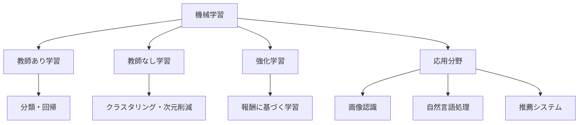

---

## 2. ガイド質問

### 基礎理解
- ★☆☆ 機械学習と従来のプログラミングはどう違うのか？
- ★☆☆ 「学習する」とはコンピュータにとって何を意味するのか？
- ★★☆ 教師あり学習と教師なし学習の違いは何か？

### 応用理解
- ★★☆ どのような問題が機械学習に適しているのか？
- ★★★ 過学習（オーバーフィッティング）とは何で、なぜ問題なのか？
- ★★★ モデルの性能をどう評価すべきか？

### 統合理解
- ★★★ 機械学習を実際のビジネス課題に適用する際の注意点は？
- ★★★ 機械学習の倫理的課題にはどのようなものがあるか？

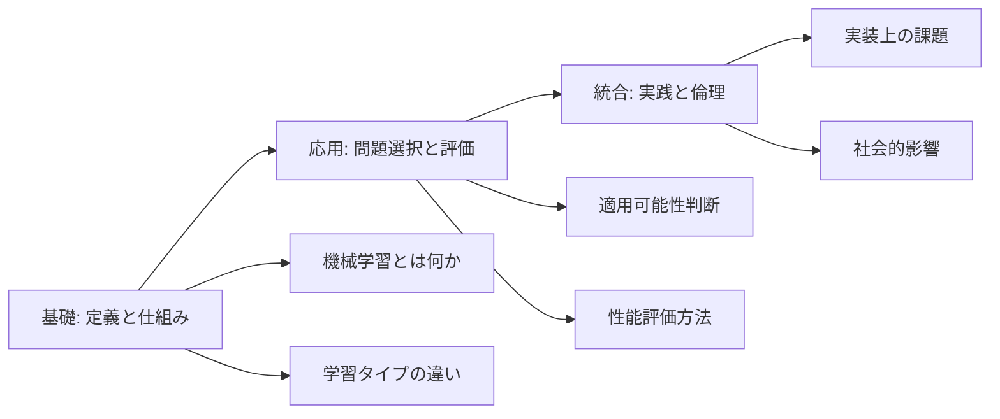

---

## 3. 核心概念

**機械学習（Machine Learning）**: データから自動的にパターンを抽出し、新しいデータに対して予測や判断を行う技術。

**訓練データ（Training Data）**: モデルが学習するために使用される例のデータセット。

**モデル（Model）**: データのパターンを表現する数学的構造。学習の成果物。

**特徴量（Feature）**: モデルが判断材料として使用するデータの属性や変数。

**教師あり学習（Supervised Learning）**: 正解ラベル付きデータから学習する手法。分類と回帰を含む。

**教師なし学習（Unsupervised Learning）**: ラベルなしデータから隠れた構造を発見する手法。

**過学習（Overfitting）**: 訓練データに特化しすぎて、新しいデータへの対応力が低下する現象。

**汎化性能（Generalization）**: 未知のデータに対してどれだけ正確に予測できるかを示す能力。

**記憶補助**: 「**訓練**データで**モデル**を作り、**特徴量**から予測し、**過学習**を避けて**汎化**させる」

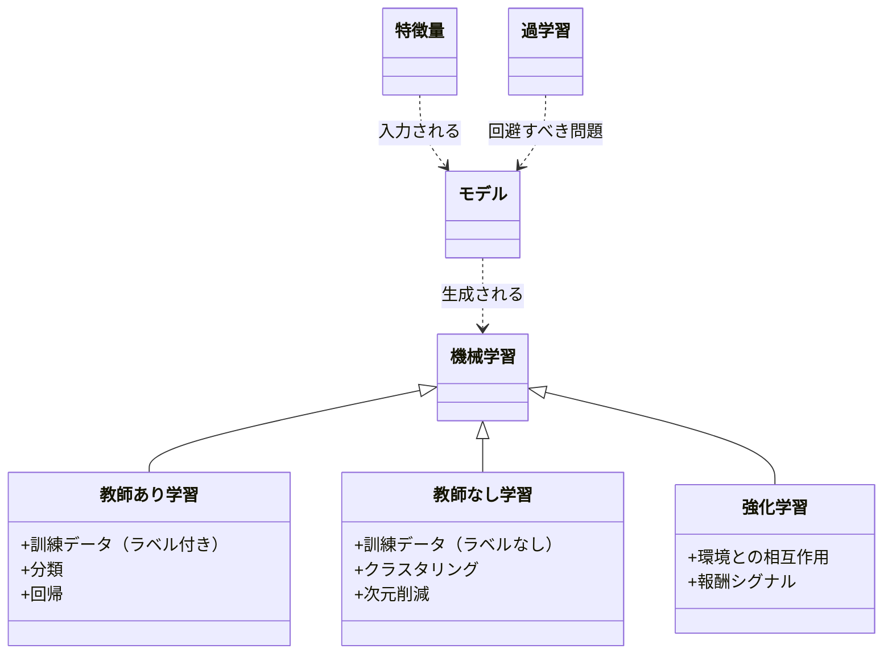

---

## 4. 段階的詳細展開

### 4.1 機械学習とは何か

**導入**: 機械学習は人工知能の一分野で、明示的にプログラムされることなくコンピュータが経験から学習する能力を扱います。従来のプログラミングでは人間がすべてのルールを記述しますが、機械学習ではデータから自動的にルールを発見します。

**展開**: 
例えば、スパムメールフィルターを考えてみましょう。従来の方法では「『無料』という単語が5回以上出たらスパム」のようなルールを人間が書きます。機械学習では、数千のメール例（スパムと通常メールのラベル付き）をコンピュータに見せると、どの特徴がスパムを示すかを自動的に学習します。

機械学習が特に有効なのは：
- ルールが複雑すぎて人間が明示できない場合（音声認識など）
- ルールが時間とともに変化する場合（株価予測など）
- 個人ごとにカスタマイズが必要な場合（推薦システムなど）

一般的な誤解：機械学習は「魔法」ではありません。良質なデータと適切な設計なしには機能しません。

**要約**: 機械学習はデータから自動的にパターンを学習する技術で、ルールが複雑・可変・個別化される問題に特に有効です。次は具体的な学習タイプを見ていきましょう。

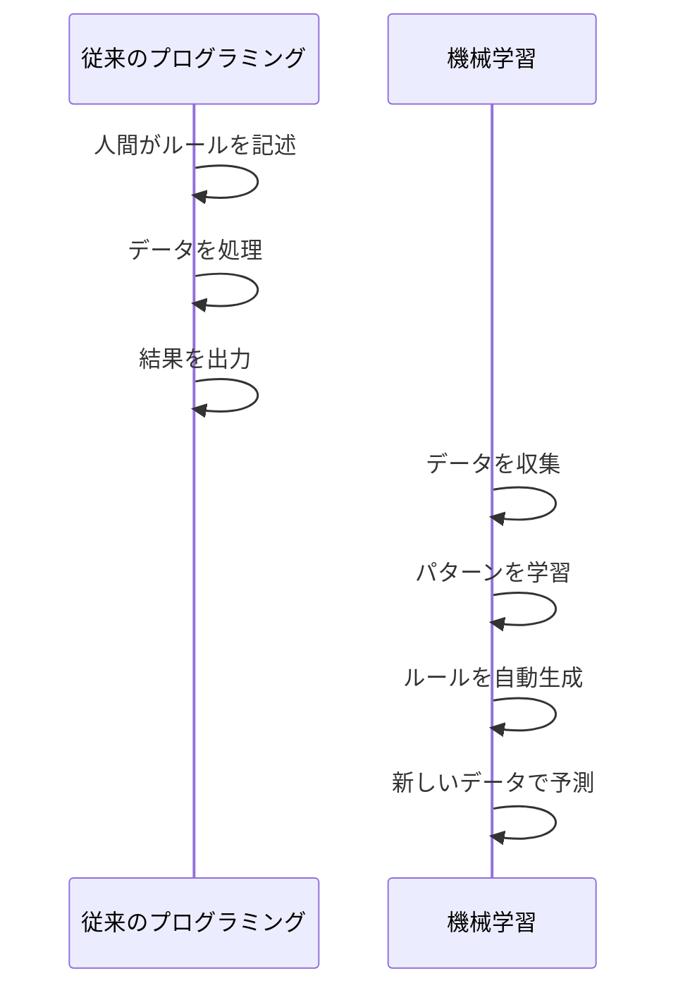

### 4.2 教師あり学習

**導入**: 教師あり学習は最も一般的な機械学習のタイプで、「正解」付きのデータから学習します。「教師」とは各データに付けられた正解ラベルのことを指します。

**展開**:
教師あり学習には2つの主要タイプがあります：

**分類（Classification）**: 離散的なカテゴリを予測します。
- 例：メールがスパムか通常か、画像に写っているのが猫か犬か
- 代表的手法：決定木、ランダムフォレスト、サポートベクターマシン、ニューラルネットワーク

**回帰（Regression）**: 連続的な数値を予測します。
- 例：住宅価格の予測、明日の気温、売上予測
- 代表的手法：線形回帰、多項式回帰、ニューラルネットワーク

学習プロセス：
1. 訓練データ（特徴量+正解ラベル）を収集
2. モデルがパターンを学習
3. テストデータで性能を評価
4. 新しいデータに対して予測を実行

実世界の応用例：医療診断（画像から病変を分類）、信用スコアリング（返済能力を予測）、音声認識（音声を文字に変換）。

**要約**: 教師あり学習は正解ラベル付きデータから学習し、分類と回帰という2つの主要タスクを扱います。次は正解がない場合の学習方法を見ていきます。

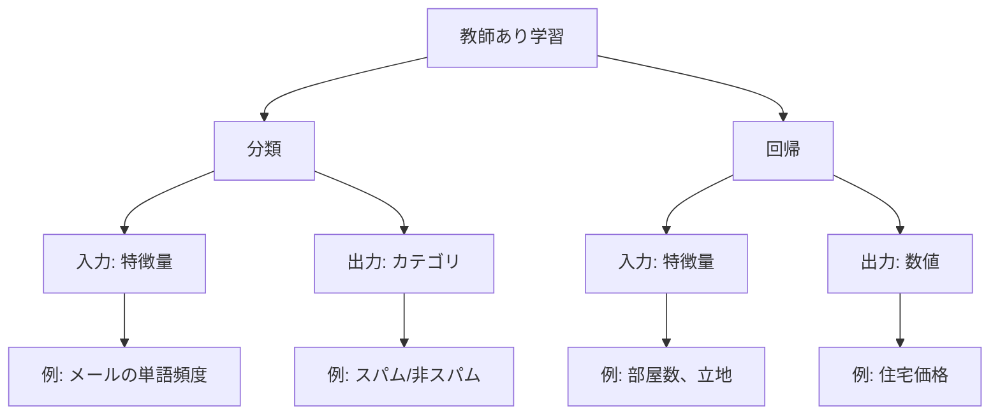

### 4.3 教師なし学習

**導入**: 教師なし学習では正解ラベルのないデータから隠れた構造やパターンを発見します。「何を探すべきか」を事前に指定せず、データ自体が持つ構造を明らかにします。

**展開**:
主要な手法：

**クラスタリング**: データを似た者同士のグループに分けます。
- 例：顧客セグメンテーション（購買行動が似た顧客をグループ化）
- 手法：k-means、階層的クラスタリング、DBSCAN

**次元削減**: 多数の特徴量を少数の重要な特徴に圧縮します。
- 例：数百の質問項目を数個の「性格特性」にまとめる
- 手法：主成分分析（PCA）、t-SNE

**異常検知**: 通常のパターンから外れたデータを発見します。
- 例：クレジットカード不正使用の検出、製造ラインの不良品検出

教師なし学習の利点は、ラベル付けという高コストな作業が不要なことです。しかし、発見されたパターンが有用かどうかの判断には人間の解釈が必要です。

**要約**: 教師なし学習はラベルなしデータから構造を発見し、クラスタリングや次元削減などのタスクに使用されます。次は試行錯誤から学ぶ強化学習を見ていきます。

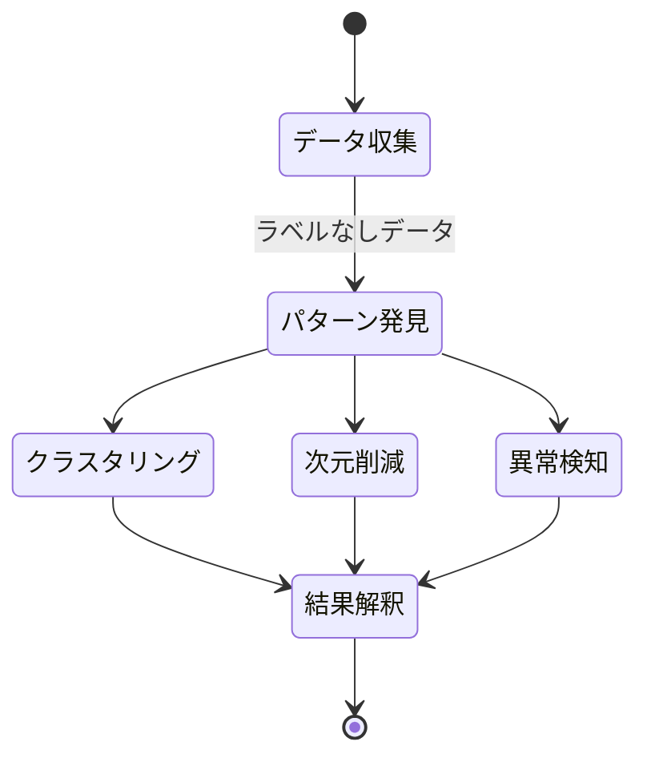

### 4.4 強化学習

**導入**: 強化学習は環境との相互作用を通じて試行錯誤しながら学習する手法です。正解を直接教える代わりに、行動に対する「報酬」や「ペナルティ」というフィードバックから学習します。

**展開**:
基本構成要素：
- **エージェント**: 学習し行動する主体
- **環境**: エージェントが相互作用する世界
- **状態**: 現在の状況
- **行動**: エージェントが取れる選択肢
- **報酬**: 行動の良し悪しを示すシグナル

学習プロセス：エージェントは様々な行動を試し、長期的に報酬を最大化する戦略（方策）を学習します。短期的には報酬が少なくても、長期的に有利な行動を学ぶこともあります。

代表的応用：
- ゲームAI（囲碁、チェス、ビデオゲーム）
- ロボット制御（歩行、物体操作）
- 自動運転
- リソース管理（データセンターの電力最適化）

教師あり学習との違い：正解が事前に分からない場合や、行動の良し悪しが遅れて判明する場合に有効です。

**要約**: 強化学習は試行錯誤と報酬フィードバックから最適な行動戦略を学習し、動的な意思決定問題に適用されます。次は学習プロセスと評価方法を詳しく見ていきます。

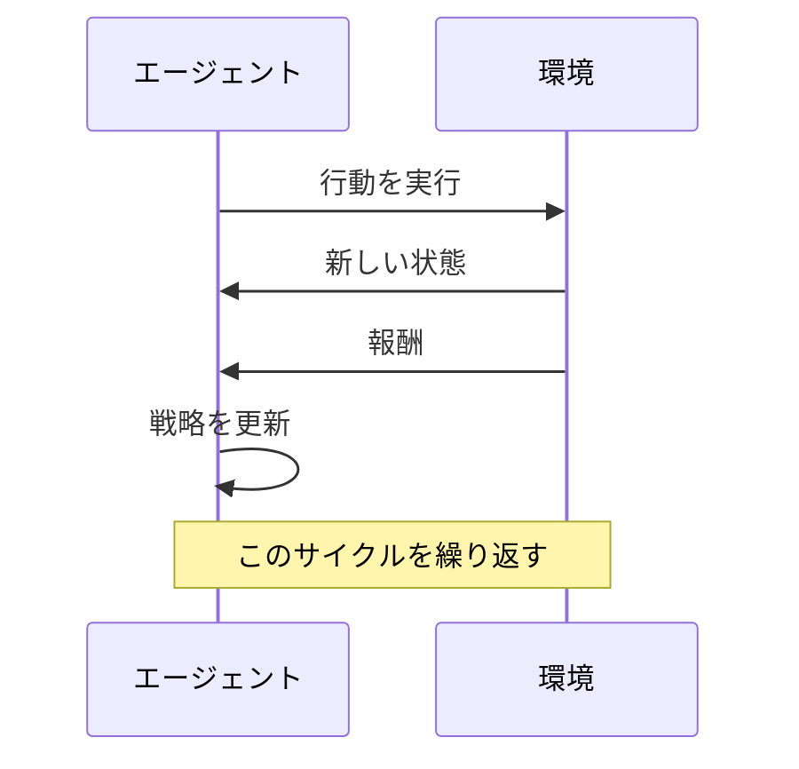

### 4.5 学習プロセスと評価

**導入**: 効果的な機械学習には適切な学習プロセスとモデル評価が不可欠です。このセクションでは訓練から評価までの標準的なワークフローと、よくある落とし穴について説明します。

**展開**:
**標準ワークフロー**:
1. **問題定義**: 何を予測したいか明確化
2. **データ収集**: 十分な量と質のデータ取得
3. **データ前処理**: 欠損値処理、正規化、特徴量エンジニアリング
4. **データ分割**: 訓練データ（70%）、検証データ（15%）、テストデータ（15%）
5. **モデル選択と訓練**: アルゴリズム選択と学習実行
6. **評価**: 各種指標でモデル性能測定
7. **チューニング**: ハイパーパラメータ調整
8. **本番運用**: 実環境への展開

**重要概念：過学習と汎化**:
- **過学習**: 訓練データに特化しすぎて新しいデータで性能が落ちる現象
- 原因：モデルが複雑すぎる、データが少なすぎる
- 対策：データ量増加、正則化、クロスバリデーション

**評価指標**:
- 分類：正解率、適合率、再現率、F値
- 回帰：平均二乗誤差（MSE）、決定係数（R²）

訓練データでの性能だけでなく、**未知データでの汎化性能**こそが真の目標です。

**要約**: 適切なデータ分割と評価指標を用いて過学習を避け、汎化性能を最大化することが機械学習成功の鍵です。次は実世界での応用例を見ていきます。

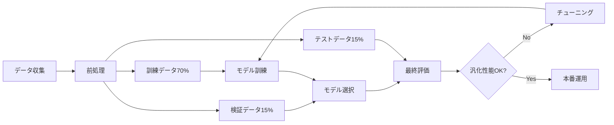

### 4.6 実世界での応用

**導入**: 機械学習は現代社会のあらゆる分野に浸透しています。ここでは主要な応用分野と、それぞれで機械学習がどう活用されているかを見ていきます。

**展開**:
**主要応用分野**:

1. **コンピュータビジョン（画像認識）**
   - 顔認識、物体検出、医療画像診断
   - 技術：畳み込みニューラルネットワーク（CNN）

2. **自然言語処理（NLP）**
   - 機械翻訳、感情分析、チャットボット
   - 技術：トランスフォーマー、大規模言語モデル

3. **推薦システム**
   - Netflix、Amazon、YouTubeの推薦機能
   - 技術：協調フィルタリング、深層学習

4. **金融**
   - 不正検知、アルゴリズム取引、信用リスク評価
   - 技術：異常検知、時系列予測

5. **医療・ヘルスケア**
   - 疾病予測、創薬支援、個別化医療
   - 技術：教師あり学習、深層学習

6. **製造業**
   - 品質管理、予知保全、プロセス最適化
   - 技術：異常検知、強化学習

実装時の考慮事項：データの質と量、計算リソース、専門知識の必要性、倫理的配慮、説明可能性の要求。

**要約**: 機械学習は画像認識から医療まで幅広く応用されており、各分野で特化した技術が発展しています。次は機械学習の課題と限界について考察します。

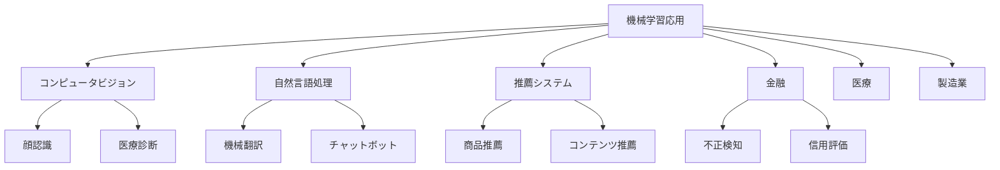

### 4.7 課題と倫理的考慮事項

**導入**: 機械学習の普及に伴い、技術的課題だけでなく倫理的・社会的問題も重要になっています。このセクションでは主要な課題と、責任ある開発のための考慮事項を扱います。

**展開**:
**技術的課題**:
- **データ依存性**: 質の高い大量データが必要
- **説明可能性**: なぜその判断をしたか説明困難（特に深層学習）
- **計算コスト**: 大規模モデルの訓練に膨大なリソースが必要
- **ロバスト性**: 敵対的サンプルに脆弱

**倫理的・社会的課題**:

1. **バイアスと公平性**
   - 訓練データの偏りがモデルに反映される
   - 例：採用支援AIが特定の性別や人種を不当に評価

2. **プライバシー**
   - 個人データの収集と使用
   - 匿名化されたデータからの個人特定リスク

3. **説明責任**
   - AIの判断による不利益が生じた場合の責任の所在
   - 医療や司法など重要な決定への適用

4. **雇用への影響**
   - 自動化による仕事の変化や消失

5. **環境への影響**
   - 大規模モデル訓練の電力消費とCO2排出

**対応策**:
- 多様なデータセットの使用
- バイアス検出と緩和手法の適用
- 説明可能なAI（XAI）の開発
- 倫理ガイドラインの策定と遵守
- 人間の監督とオーバーライド機能の維持

**要約**: 機械学習には技術的・倫理的課題が存在し、責任ある開発と使用には意識的な配慮が必要です。これで主要トピックの詳細展開は完了です。

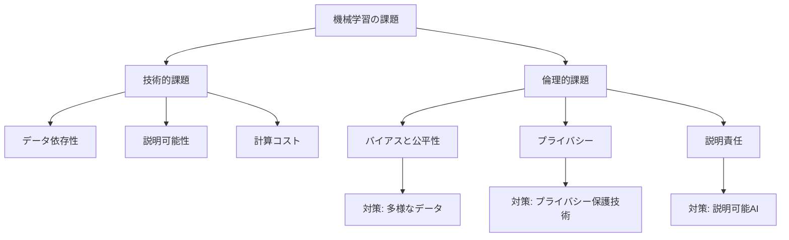

---

## 5. 統合・実践

### ガイド質問への模範回答

**Q: 機械学習と従来のプログラミングはどう違うのか？**
A: 従来のプログラミングでは人間が明示的にルールを記述しますが、機械学習ではデータから自動的にルールを学習します。例えば、スパム検出で従来は「『無料』という単語が5回以上ならスパム」と書きますが、機械学習では多数の例から判断基準を自動抽出します。

**Q: 教師あり学習と教師なし学習の違いは何か？**
A: 教師あり学習は正解ラベル付きデータから学習し（例：スパム/非スパムのラベル付きメール）、分類や回帰に使用されます。教師なし学習は正解ラベルなしでデータの構造を発見し（例：顧客の購買パターンからグループ分け）、クラスタリングや次元削減に使用されます。

**Q: 過学習とは何で、なぜ問題なのか？**
A: 過学習は訓練データに特化しすぎて、新しいデータへの対応力が低下する現象です。例えば、試験問題の丸暗記のようなもので、似た問題は解けても少し変わると対応できません。対策としてデータ量の増加、正則化、クロスバリデーションなどがあります。

### 統合応用問題

**問題1**: あなたは小売店のマネージャーです。顧客の購買履歴データがあり、それを活用したいと考えています。以下の3つの目的それぞれに、どのタイプの機械学習（教師あり/なし/強化）が最適か、理由とともに答えてください。
- (a) 顧客を購買パターンが似たグループに分ける
- (b) 新規顧客が1年以内にリピート購入するか予測する
- (c) 動的な価格設定戦略を最適化する

**模範解答**:
- (a) 教師なし学習（クラスタリング）: 正解ラベルがなく、データの自然な構造を発見したいため
- (b) 教師あり学習（分類）: 過去の顧客のリピート有無という正解ラベルがあり、新規顧客を分類するため
- (c) 強化学習: 価格変更の効果が遅れて判明し、長期的な売上最大化という目標のもと試行錯誤が必要なため

**問題2**: 医療診断支援システムを開発する際、特に注意すべき技術的・倫理的課題を3つ挙げ、それぞれの対策を提案してください。

**模範解答**:
1. **説明可能性**: 診断根拠が不明だと医師が信頼できない → 説明可能AIを使用し、判断根拠を可視化
2. **バイアス**: 訓練データが特定人口層に偏ると診断精度に差 → 多様な人口統計のデータを収集・バランス調整
3. **責任の所在**: 誤診時の責任が不明確 → 医師の最終判断を必須とし、AIは補助ツールと位置づける

### 自己評価チェックリスト

以下の質問に「はい」と答えられれば、基本的理解が達成されています：

- [ ] 機械学習の定義を自分の言葉で説明できる
- [ ] 教師あり・なし・強化学習の違いを例を挙げて説明できる
- [ ] 分類と回帰の違いを理解している
- [ ] 過学習の概念とその対策を説明できる
- [ ] 機械学習が適した問題と適さない問題を区別できる
- [ ] 少なくとも3つの実世界応用例を挙げられる
- [ ] 機械学習の倫理的課題を2つ以上説明できる
- [ ] 訓練データ、テストデータの役割を理解している

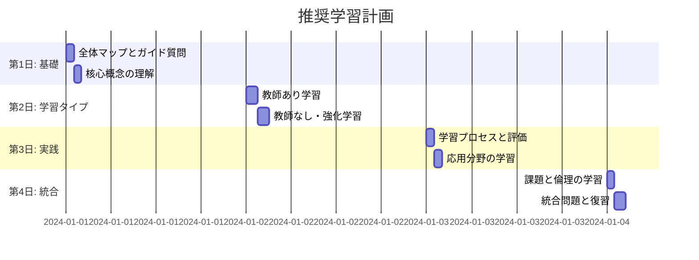

---

## 学習の次のステップ

基礎を理解したら、以下のトピックで知識を深めましょう：

**技術的発展**:
- ディープラーニング（深層学習）の詳細
- 特定アルゴリズム（ランダムフォレスト、SVM、ニューラルネットワーク）
- 特徴量エンジニアリング
- ハイパーパラメータチューニング

**実践的スキル**:
- Python/R での機械学習実装（scikit-learn、TensorFlow、PyTorch）
- データ前処理とクリーニング
- モデルの本番運用（MLOps）

**専門分野**:
- コンピュータビジョン
- 自然言語処理
- 時系列予測
- 説明可能AI（XAI）

