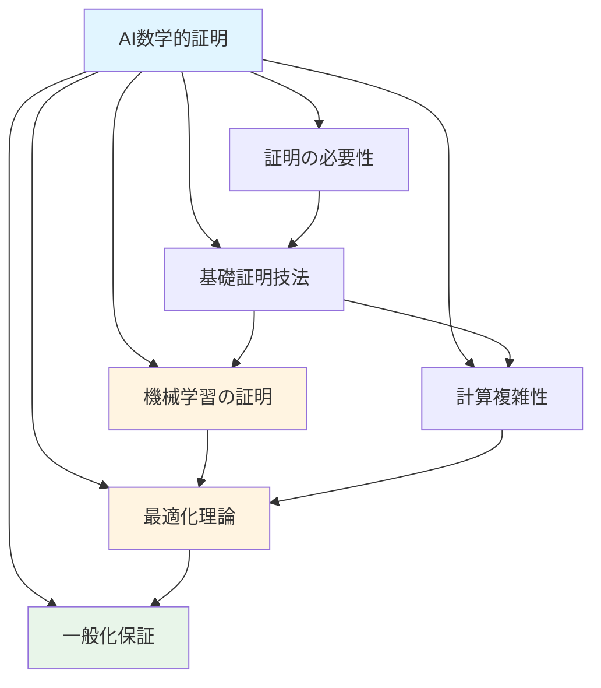
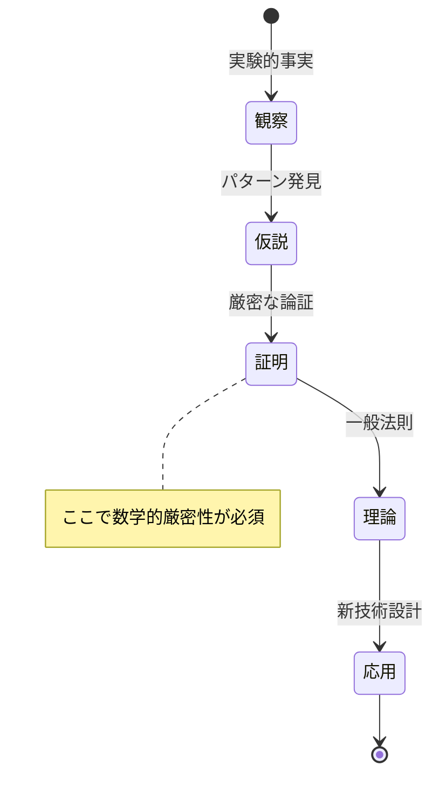
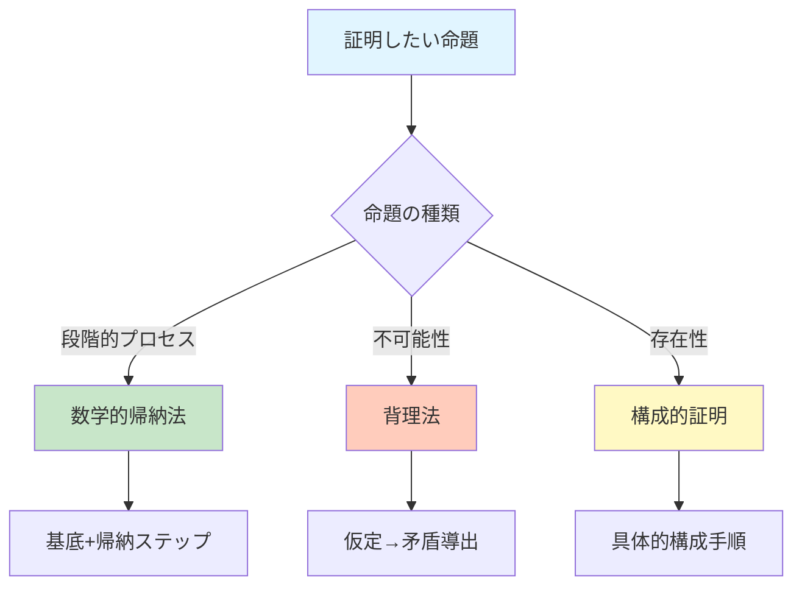
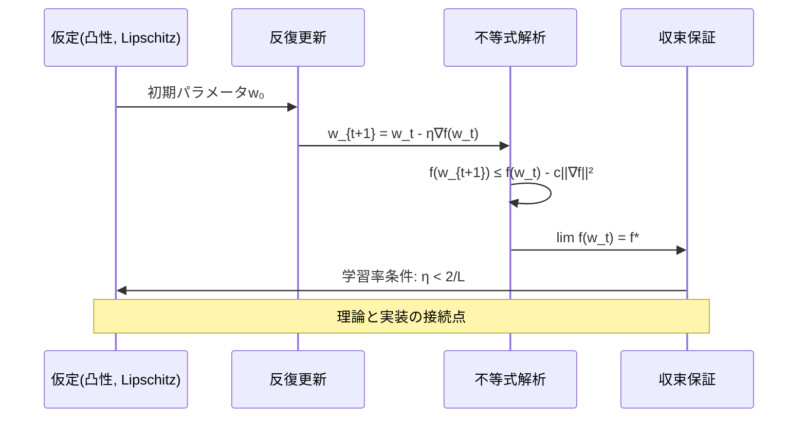
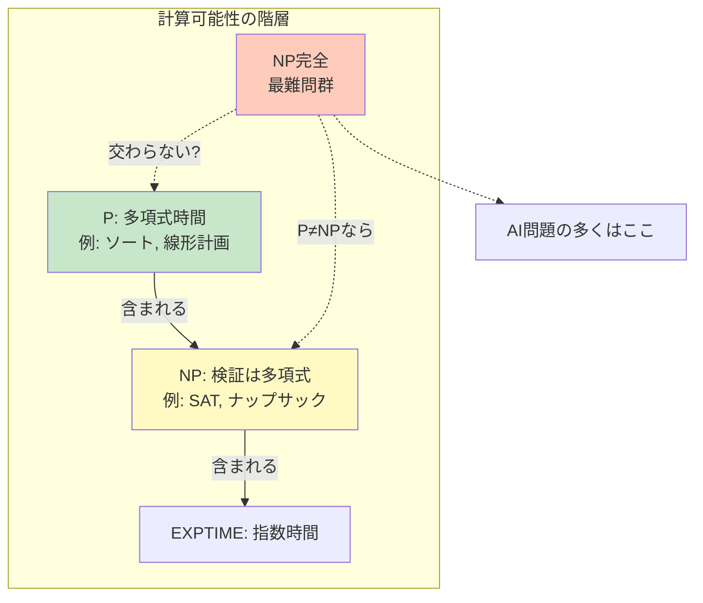
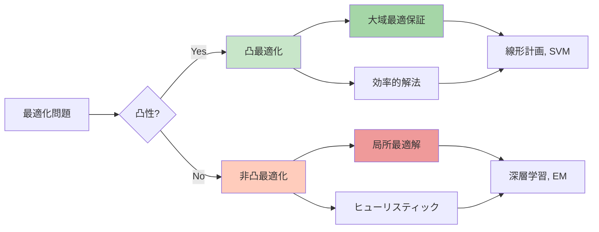
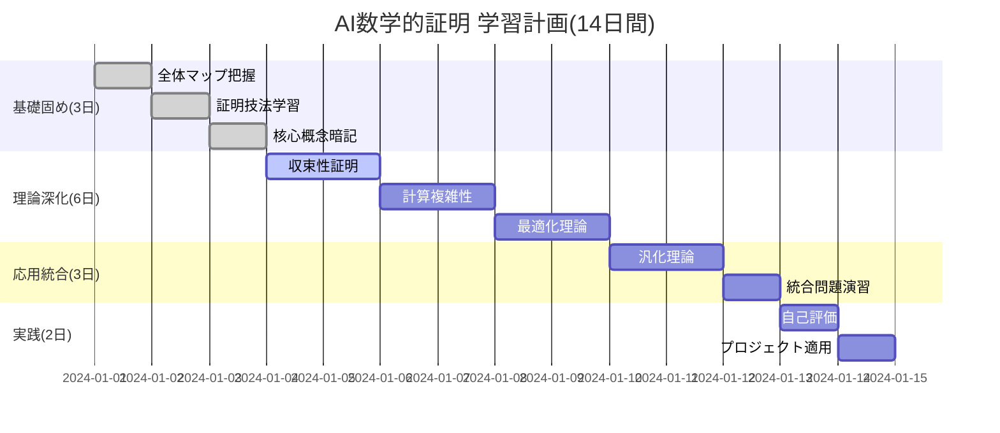

AI（人工知能）における数学的証明について

# AI(人工知能)における数学的証明: 段階的理解ガイド

> **学習目標**: AI分野における数学的証明の役割、主要な証明技法、実用的な応用例を理解する  
> **推奨学習時間**: 3-4時間  
> **前提知識**: 基礎的な数学知識(高校数学レベル)

---

## 1. 全体マップ

AI分野における数学的証明は、アルゴリズムの**正確性**、**効率性**、**理論的限界**を厳密に保証するための基盤です。機械学習モデルの収束性証明から、計算複雑性の限界まで、証明は「なぜAIシステムが機能するのか」を説明します。

**本資料の範囲**:
- ✅ AI理論における主要な証明技法
- ✅ 機械学習・最適化・計算複雑性の証明例
- ✅ 証明の実用的意義
- ❌ 高度な測度論や関数解析の詳細
- ❌ 個別の最先端研究論文の完全な証明

**主要サブトピック**:
1. AI分野で数学的証明が必要な理由
2. 基礎的証明技法(帰納法、矛盾法、構成的証明)
3. 機械学習における収束性証明
4. 計算複雑性とNP完全性
5. 最適化理論における証明
6. 一般化性能の理論的保証

**学習の流れ**:



---

## 2. ガイド質問

### 基礎理解レベル (★☆☆)
1. **なぜAI研究に数学的証明が必要なのか?** 実験だけでは不十分な理由は?
2. **帰納法と矛盾法の違いは何か?** それぞれどのような場面で使われる?
3. **「収束する」とは数学的にどういう意味か?** AIのコンテキストでは?

### 応用理解レベル (★★☆)
4. **勾配降下法が最適解に収束することをどう証明するか?** 必要な条件は?
5. **P≠NP問題がAI実務に与える影響は?** 具体例を挙げて説明できるか?
6. **過学習を防ぐ正則化の効果を数学的にどう示すか?** 

### 統合レベル (★★★)
7. **深層学習が「なぜうまく機能するか」は完全に証明されているか?** 理論と実践のギャップは?
8. **証明された理論的保証は、実際のAIシステム設計にどう活かすか?**

**質問の認知階層**:


---

## 3. 核心概念

### 重要用語と定義

**1. 収束性(Convergence)** ★★★  
アルゴリズムが実行を続けることで、解が目標値に限りなく近づく性質。形式的には lim(n→∞) x_n = x* を示す。

**2. 計算複雑性(Computational Complexity)** ★★★  
問題を解くのに必要な計算資源(時間・メモリ)の量。O記法で表現(例: O(n²))。

**3. 凸最適化(Convex Optimization)** ★★☆  
目的関数が凸関数である最適化問題。局所最適解=大域最適解が保証される。

**4. PAC学習理論(Probably Approximately Correct)** ★★☆  
高い確率でほぼ正確な仮説を学習できることを保証する理論的枠組み。

**5. リプシッツ連続性(Lipschitz Continuity)** ★☆☆  
関数の変化率に上限がある性質。|f(x)-f(y)| ≤ L|x-y|で定義。収束証明の重要条件。

**6. 汎化誤差(Generalization Error)** ★★★  
訓練データでない新規データに対する予測誤差。過学習の指標。

**7. NP完全(NP-Complete)** ★★☆  
効率的な解法が知られていない難問のクラス。多くのAI問題がこれに該当。

**概念間の関係**:

```mermaid
classDiagram
    class 数学的証明{
        +厳密性
        +再現性
        +理論的保証
    }
    class 収束性証明{
        +学習率条件
        +凸性仮定
    }
    class 複雑性理論{
        +P vs NP
        +近似アルゴリズム
    }
    class 汎化理論{
        +VC次元
        +PAC学習
    }
    
    数学的証明 <|-- 収束性証明
    数学的証明 <|-- 複雑性理論
    数学的証明 <|-- 汎化理論
    収束性証明 --> 凸最適化: 活用
    汎化理論 --> 過学習防止: 保証
    
    style 数学的証明 fill:#e1f5ff
    style 収束性証明 fill:#fff4e1
    style 汎化理論 fill:#e8f5e9
```

**記憶補助(ニーモニック)**:  
**CCG-PLC** = **C**onvergence(収束), **C**omplexity(複雑性), **G**eneralization(汎化), **P**AC, **L**ipschitz, **C**onvex(凸性)

---

## 4. 段階的詳細展開

### 4.1 AI分野で数学的証明が必要な理由

#### 層1: 導入
AI分野における数学的証明は、実験的観察だけでは得られない**理論的保証**を提供します。実験は「特定の条件下で動作した」ことしか示せませんが、証明は「あらゆる条件下で必ず動作する」ことを保証します。

#### 層2: 展開
実験的アプローチの限界を具体例で考えましょう。あるニューラルネットワークが10,000個のテストケースで99%の精度を達成したとします。しかし:
- 未テストの入力に対しても同様の性能が出るか?
- 訓練データの10倍の規模でも安定動作するか?
- 敵対的攻撃に対して脆弱ではないか?

これらの疑問に答えるには**証明**が必要です。例えば:

**証明例1: 勾配降下法の収束性**  
「学習率が適切なら、凸関数の最小化において勾配降下法は最適解に収束する」という定理があります。これにより、無限回の実験をしなくても、理論的に収束が保証されます。

**証明例2: 計算可能性の限界**  
「停止問題は決定不能」という証明により、「あらゆるプログラムのバグを自動検出するAI」は原理的に不可能だとわかります。これは実験では示せません。

**一般的な誤解**:  
「深層学習は経験的にうまく機能するから証明は不要」→ 実際は、理論的理解が新しいアーキテクチャ設計や失敗ケースの予測に役立ちます。

#### 層3: 要約
数学的証明は、AI システムの**信頼性**、**予測可能性**、**限界の理解**を提供し、理論と実践の橋渡しをします。

**証明の役割の流れ**:



---

### 4.2 基礎的証明技法

#### 層1: 導入
AI理論で頻繁に使われる証明技法は**数学的帰納法**、**背理法(矛盾法)**、**構成的証明**の3つです。これらは異なる状況で異なる力を発揮します。

#### 層2: 展開

**技法1: 数学的帰納法**  
「ステップごとに性質が保たれる」ことを示す手法。

**構造**:
1. 基底ケース: n=1で成立することを示す
2. 帰納ステップ: n=kで成立すると仮定し、n=k+1でも成立することを示す

**AI応用例**: 再帰的ニューラルネットワーク(RNN)の時系列データ処理における誤差伝播の証明。「第1時刻で誤差が制御下にあり、各時刻で誤差が増大しないなら、任意の長さの系列で誤差が制御下にある」。

**技法2: 背理法(矛盾法)**  
「命題が偽であると仮定すると矛盾が生じる」ことを示す。

**AI応用例**: NP完全性の証明。「問題XがNP完全でないと仮定すると、P=NPとなり、広く信じられている予想に反する矛盾が生じる」。

**技法3: 構成的証明**  
「実際にそれを作る手順を示す」ことで存在を証明。

**AI応用例**: ある精度を達成するニューラルネットワークの存在証明。「このアーキテクチャ、これらのパラメータで構成すれば、誤差ε以下を達成できる」と具体的に示す。

**技法の比較**:

| 技法 | 強み | AI分野の用途 |
|------|------|--------------|
| 帰納法 | 段階的プロセスに強い | アルゴリズムの反復、層の積み重ね |
| 背理法 | 不可能性の証明に強い | 計算複雑性、理論的限界 |
| 構成的 | 実装可能性を示す | ネットワーク設計、アルゴリズム開発 |

#### 層3: 要約
これら3技法は証明の「工具箱」であり、問題の性質に応じて使い分けることで、AI理論の多様な主張を厳密に論証できます。

**技法選択のフロー**:



---

### 4.3 機械学習における収束性証明

#### 層1: 導入
機械学習の訓練プロセスが「最終的に良い解に到達する」ことを保証する収束性証明は、実用アルゴリズムの信頼性の根幹です。

#### 層2: 展開

**基本的な収束定理: 勾配降下法**

目的関数 f(w) を最小化する勾配降下法:
```
w_{t+1} = w_t - η∇f(w_t)
```

**定理**: f が凸かつL-リプシッツ連続な勾配を持ち、学習率 η < 2/L なら、勾配降下法は大域最適解に収束する。

**証明の骨子**:
1. 関数値の減少を示す: f(w_{t+1}) ≤ f(w_t) - (η - ηL/2)||∇f(w_t)||²
2. 勾配が0に近づくことを示す: lim_{t→∞} ||∇f(w_t)|| = 0
3. 凸性により、∇f=0 は大域最適解を意味する

**重要な仮定とその意味**:
- **凸性**: 局所最適=大域最適。深層学習では成立しないことが多い(現実とのギャップ)
- **リプシッツ連続性**: 勾配の変化が急激すぎない。学習率の上限を定める
- **学習率条件**: 大きすぎると発散、小さすぎると遅い

**深層学習への拡張**:  
非凸の場合、「大域最適解への収束」は証明できないが、「臨界点(∇f=0の点)への収束」や「局所最適解への収束」は条件付きで証明可能。

**実用的意義**:  
- 学習率スケジュールの理論的根拠
- Adam、RMSPropなどの適応的手法の収束保証
- ミニバッチの影響の定量化

#### 層3: 要約
収束性証明は「なぜこの学習率で訓練すべきか」「いつ訓練を止めるべきか」に理論的根拠を与え、ハイパーパラメータ選択を科学的にします。

**収束証明の構造**:



---

### 4.4 計算複雑性とNP完全性

#### 層1: 導入
計算複雑性理論は「ある問題を解くのにどれだけ時間がかかるか」を分類し、AI問題の実現可能性を判断する枠組みです。特にNP完全性は「効率的には解けない」問題を特定します。

#### 層2: 展開

**複雑性クラスの基礎**:

- **P(多項式時間)**: 効率的に解ける問題。例: ソート(O(n log n))、最短経路(O(n²))
- **NP(非決定性多項式時間)**: 解の検証は効率的だが、解の発見は難しい可能性。例: 充足可能性問題(SAT)
- **NP完全**: NP内で最も難しい問題。どれか1つを効率的に解ければ、NPすべてが効率的に解ける

**NP完全性の証明手法**:

1. 問題XがNPに属することを示す(解の検証が多項式時間)
2. 既知のNP完全問題YからXへの**多項式時間帰着**を構成
   - Yの任意のインスタンスを、同じ答えを持つXのインスタンスに変換
   - 変換が多項式時間でできることを示す

**AI分野のNP完全問題例**:

1. **ニューラルネットワークの最適訓練**: 2層ネットワークでも、大域最適解を見つけるのはNP完全
2. **ベイジアンネットワークの推論**: 事後確率の計算はNP完全
3. **決定木の最適構築**: 最小深さの決定木を見つけるのはNP完全

**実用的意義**:  
NP完全だとわかれば、「完璧な解」を諦めて**近似アルゴリズム**や**ヒューリスティック**を使う判断ができます。例えば:
- 遺伝的アルゴリズム
- 焼きなまし法
- 緩和問題への変換

**P≠NP予想の影響**:  
もしP=NPなら、多くのAI問題が効率的に解けるようになりますが、同時に暗号技術が破綻します。現在はP≠NPと広く信じられています。

#### 層3: 要約
計算複雑性理論は「何が原理的に難しいか」を明確にし、実用アルゴリズム設計で「完璧を目指すべきか、近似で妥協すべきか」の判断基準を提供します。

**複雑性クラスの関係**:



---

### 4.5 最適化理論における証明

#### 層1: 導入
最適化理論は機械学習訓練の数学的基盤であり、「最良の解をどう見つけるか」に関する証明された手法を提供します。凸最適化は特に強力な保証を持ちます。

#### 層2: 展開

**凸最適化の基本定理**:

**定理(大域最適性)**: f(x)が凸関数なら、任意の局所最適解は大域最適解である。

**証明の骨子**:
1. x*を局所最適解とする(ある近傍で最小)
2. 別の点yの方が小さいと仮定: f(y) < f(x*)
3. 凸性により、x*とyを結ぶ線分上の点zで f(z) ≤ λf(x*) + (1-λ)f(y) < f(x*)
4. zはx*の近傍にあるのに f(z) < f(x*) となり、局所最適性に矛盾

**実用的意義**: ロジスティック回帰、SVM、リッジ回帰などの凸問題は、局所最適解で満足すれば十分。

**KKT条件(Karush-Kuhn-Tucker)**:

制約付き最適化問題:
```
minimize f(x)
subject to g_i(x) ≤ 0, h_j(x) = 0
```

**定理**: 凸問題において、KKT条件を満たす点が存在すれば、それが最適解である。

KKT条件の構成要素:
1. 停留性: ∇f + Σλ_i∇g_i + Σμ_j∇h_j = 0
2. 原始実行可能性: g_i(x) ≤ 0, h_j(x) = 0
3. 双対実行可能性: λ_i ≥ 0
4. 相補性: λ_i g_i(x) = 0

**AI応用**: SVMの訓練、ラグランジュ緩和によるニューラルネットワーク正則化

**非凸最適化の課題**:

深層学習の損失関数は非凸ですが、実践では良好な解が得られます。これを説明する理論:
- **過剰パラメータ化**: パラメータ数>>データ数の場合、多くの大域最適解が存在
- **損失関数の幾何**: 深層ネットワークの損失面には「質の良い局所最適解」が多数存在

証明は未完成ですが、部分的な保証(例: ランダム初期化からの収束)は示されています。

#### 層3: 要約
凸最適化は完全な理論的保証を持ち、非凸の場合も部分的保証や経験則が実用アルゴリズム設計を導きます。証明された理論が「どの手法が確実か」を教えてくれます。

**最適化問題の分類**:



---

### 4.6 一般化性能の理論的保証

#### 層1: 導入
訓練データでの性能が新規データでも維持される「汎化」は、機械学習の核心的課題です。PAC学習理論やVC次元は、汎化性能の理論的保証を提供します。

#### 層2: 展開

**PAC学習理論(Probably Approximately Correct)**:

**定義**: アルゴリズムが、高い確率(1-δ)で、真の誤差が小さい(ε以下)仮説を学習できるとき、PAC学習可能という。

**定理(基本PAC定理)**: 仮説クラスHのVC次元がdなら、誤差ε、信頼度δを達成するのに必要なサンプル数mは:

```
m = O((d/ε)log(1/δ))
```

**証明の流れ**:
1. Hoeffding不等式で、経験誤差と真の誤差の差を評価
2. VC次元でHの「豊かさ」を定量化
3. Union boundで、すべての仮説への同時適用

**VC次元(Vapnik-Chervonenkis Dimension)**:

**定義**: 仮説クラスHが「砕く(shatter)」ことができる最大の点集合のサイズ。

**例**:
- 2次元の線形分類器: VC次元=3(3点はすべての分類パターンを実現可能)
- d次元の線形分類器: VC次元=d+1
- k層のニューラルネットワーク: VC次元=O(w²)(wは重みの数)

**実用的意義**:
- モデル複雑度の定量化: VC次元が高いほど、過学習リスク増
- 必要データ量の見積もり: 上記の式で計算可能
- 正則化の理論的根拠: VC次元を減らすことで汎化性能向上

**バイアス-分散トレードオフの証明**:

期待二乗誤差を分解:
```
E[(y - f̂(x))²] = Bias²[f̂(x)] + Var[f̂(x)] + σ²
```

- **バイアス**: モデル容量不足による誤差(underfitting)
- **分散**: 訓練データへの過度な適合(overfitting)
- **σ²**: データ自体のノイズ

**証明のポイント**: 期待値の性質と分散の定義から代数的に導出。モデル複雑度を上げるとバイアス減・分散増のトレードオフが生じることを形式化。

**深層学習での限界**:

従来理論では、過剰パラメータ化したネットワークは過学習すると予測されますが、実際は汎化します。これを説明する新理論:
- **暗黙の正則化**: SGDが好む解が汎化性能が高い
- **二重降下現象**: パラメータ数が極端に多いと再び汎化性能向上

完全な証明はまだありませんが、活発な研究領域です。

#### 層3: 要約
PAC理論とVC次元は「どれだけデータがあれば安心か」の理論的基準を与え、モデル選択と正則化戦略の科学的根拠となります。深層学習での新現象は、理論の発展を促しています。

**汎化理論の構造**:

```mermaid
graph TD
    A[訓練誤差] --> B[汎化ギャップ]
    C[テスト誤差] --> B
    
    B --> D{ギャップの大きさ}
    D -->|小| E[良い汎化]
    D -->|大| F[過学習]
    
    G[VC次元] -.影響.-> D
    H[正則化] -.縮小.-> D
    I[データ量] -.縮小.-> D
    
    E --> J[PAC保証<br/>m=O(d/ε log 1/δ)]
    
    style B fill:#fff9c4
    style E fill:#c8e6c9
    style F fill:#ffccbc
    style J fill:#e1f5ff
    
    note1[理論的保証]
    J --> note1
```

---

## 5. 統合・実践

### セクション2の質問への模範回答

**Q1: なぜAI研究に数学的証明が必要なのか?**

A: 実験は有限の条件下での動作しか示せませんが、証明はあらゆる条件下での動作を保証します。例えば、勾配降下法の収束性証明により、適切な学習率下では必ず最適解に到達することが理論的に保証され、無限の実験が不要になります。また、停止問題の決定不能性の証明のように、「原理的に不可能」な問題を特定することで、無駄な研究投資を避けられます。証明は理論的限界の明確化、新手法開発の指針、システムの信頼性保証という3つの実用的価値を提供します。

**Q2: 帰納法と矛盾法の違いは何か?**

A: 帰納法は「段階的に性質が保たれる」ことを示す構成的手法で、アルゴリズムの各反復やネットワークの各層での性質保存を証明するのに適しています。一方、矛盾法は「命題が偽だと仮定すると論理的矛盾が生じる」ことを示す間接的手法で、NP完全性証明や計算不可能性の証明など、「何かが存在しない/不可能である」ことを示すのに強力です。帰納法は「どうやって達成するか」、矛盾法は「なぜ不可能か」を示します。

**Q3: 「収束する」とは数学的にどういう意味か?**

A: 数学的には、数列 {x_n} が値 x* に収束するとは、任意の小さな正数εに対して、ある番号N以降のすべての項が x* からε以内に収まることです(|x_n - x*| < ε for all n > N)。AIでは、アルゴリズムの反復で生成されるパラメータ列が最適解に収束することを意味し、「訓練を続ければ必ず目標に到達する」という保証を与えます。収束速度(どれだけ速く収束するか)も重要で、O(1/t)や指数的収束などで表現されます。

**Q4: 勾配降下法が最適解に収束することをどう証明するか?**

A: 凸関数に対する基本的証明は以下の流れです:
1. **減少性の証明**: 更新式 w_{t+1} = w_t - η∇f(w_t) により、適切な学習率下で f(w_{t+1}) < f(w_t) を示す
2. **リプシッツ連続性の利用**: 勾配の変化率上限Lから、学習率条件 η < 2/L を導出
3. **勾配の消失**: 関数値が単調減少かつ下に有界なら、勾配は0に収束
4. **凸性の適用**: 凸関数では ∇f=0 の点が大域最適解

必要条件は凸性、リプシッツ連続勾配、適切な学習率設定です。

**Q5: P≠NP問題がAI実務に与える影響は?**

A: P≠NP(広く信じられている予想)が真なら、多くのAI問題は効率的な完璧解が存在しません。具体例:
- **ニューラルネットワーク訓練**: 大域最適解を見つけるのはNP困難なので、局所最適解で妥協
- **特徴選択**: 最適な特徴部分集合の選択はNP完全なので、貪欲法や遺伝的アルゴリズムを使用
- **自動機械学習(AutoML)**: 最良のハイパーパラメータ探索が原理的に困難なので、ベイズ最適化などの近似手法を採用

実務では「完璧でなくても十分良い解」を効率的に見つける戦略が重要になります。

**Q6: 過学習を防ぐ正則化の効果を数学的にどう示すか?**

A: 正則化項λR(w)を加えた目的関数 f(w) + λR(w) により、汎化誤差の上界が改善されることを示します:

1. **VC次元の削減**: L2正則化は実効的なモデル複雑度を下げ、PAC理論の汎化誤差上界 O(√(d/m)) のdを減少
2. **バイアス-分散トレードオフ**: 正則化はバイアスを若干増やす代わりに、分散を大きく減らし、総誤差 Bias² + Variance を最小化
3. **安定性解析**: 正則化により訓練データの小さな変化に対するモデルの感度が低下し、汎化性能向上

具体的には、Ridge回帰の解析解から、正則化係数λの増加が係数の分散を 1/(λ+固有値) に減少させることが証明できます。

**Q7: 深層学習が「なぜうまく機能するか」は完全に証明されているか?**

A: **いいえ、完全には証明されていません。** 特に以下の現象は理論と実践のギャップを示します:
- **過剰パラメータ化**: 従来理論では過学習すると予測されるが、実際は汎化
- **非凸最適化**: 局所最適解に陥ると予想されるが、実際は良好な解を発見
- **二重降下**: モデル複雑度の増加で一度性能が悪化した後、再び向上

部分的な理論的説明(暗黙の正則化、損失面の幾何構造、NTK理論)は存在しますが、包括的な証明は未解決です。これは現在のAI理論研究の最前線です。

**Q8: 証明された理論的保証は、実際のAIシステム設計にどう活かすか?**

A: 理論的保証を実務に活用する具体例:
1. **学習率スケジューリング**: 収束理論から、学習率を O(1/√t) で減衰させる理論的根拠を得る
2. **正則化強度の選択**: VC次元理論から、データ量に応じた適切なλの範囲を見積もる
3. **アーキテクチャ設計**: 表現能力の理論的限界(例: 2層ネットワークでは学習困難な関数)を知り、深さの必要性を判断
4. **計算資源計画**: NP完全性を知ることで、完璧解ではなく近似解を目標とした計画を立てる
5. **信頼性評価**: PAC理論から必要なテストデータ量を計算し、性能保証レベルを定量化

理論は「なぜこの設計が妥当か」の説明根拠を提供します。

---

### 応用統合問題

**問題1: 収束と汎化の関係**

あるニューラルネットワークの訓練で、訓練誤差は確実に減少していますが(収束)、テスト誤差は増加しています。この現象を数学的証明の観点から説明し、理論的に対処する方法を3つ提案してください。

**模範解答**:
この現象は**収束と汎化の分離**を示しています。

**数学的説明**:
- 収束性証明は訓練データ上での目的関数最小化を保証しますが、テストデータ上での性能は保証しません
- PAC理論によれば、汎化ギャップは O(√(VC次元/データ数)) で上界されます
- 現在の状況は VC次元が大きすぎる(モデルが複雑すぎる)ことを示唆

**理論的対処法**:
1. **正則化の導入**: L2/L1正則化により実効VC次元を削減。定理により汎化誤差上界が改善
2. **Early Stopping**: バイアス-分散トレードオフ理論に基づき、訓練を適切な時点で停止して分散を抑制
3. **データ拡張**: PAC理論の m = O(d/ε log 1/δ) により、データ量増加が直接的に汎化保証を強化

---

**問題2: 複雑性を考慮したアルゴリズム選択**

あるAIタスクで、「最適解を必ず見つける方法A(指数時間)」と「良い近似解を高速に見つける方法B(多項式時間、2-近似保証)」があります。どのような基準で選択すべきか、計算複雑性理論と実用性の観点から論じてください。

**模範解答**:

**理論的分析**:
- 方法Aは完全性を持つが、入力サイズnに対してO(2^n)の時間複雑性。n=100で実用不可能
- 方法Bは近似比2(最悪ケースでも最適解の2倍以内)を保証し、O(n^k)で実行可能

**選択基準**:
1. **問題サイズ**: n < 20程度なら方法A、それ以上なら方法B
2. **精度要求**: 安全性に関わるクリティカルなタスクで最適性が必須なら方法A
3. **リアルタイム性**: オンライン推論など時間制約が厳しいなら方法B
4. **反復利用**: 同じ問題を繰り返し解くなら、方法Aで一度解いて結果をキャッシュ

**実用的結論**: ほとんどのAI実務では方法Bが適切。証明された近似保証により、「どの程度の品質が保証されるか」が明確になり、リスク管理が可能になります。

---

**問題3: 理論と実践のギャップへの対処**

深層学習の成功の多くは理論的証明が追いついていない現象です。このギャップに対して、AI研究者・実務者はどのようなアプローチを取るべきか、3つの視点から提案してください。

**模範解答**:

**1. 経験的手法と理論的検証の並行**
- 実務では経験的に有効な手法を採用しつつ、理論研究者が事後的に数学的理解を深める
- 例: Dropoutは経験的に発見され、後に正則化としての理論的正当化がなされた

**2. 部分的保証の活用**
- 完全な証明がなくても、特定条件下での保証(例: 凸近似での収束、線形化での解析)を利用
- NTK理論のように、限定的なシナリオでの厳密な結果から洞察を得る

**3. 証明指向の新手法開発**
- 理論的保証が得られる新しいアーキテクチャやアルゴリズムを積極的に開発
- 例: Transformerの注意機構の理論的解析から、より効率的な変種を設計

**バランスの重要性**: 理論的厳密性と実用的有効性のバランスを取りながら、「なぜうまくいくのか」の理解を深めることで、より信頼性の高いシステムへの道が開けます。

---

### 自己評価チェックリスト

学習の定着度を確認しましょう(各項目を自己評価):

**基礎理解** 
- [ ] 数学的証明がAIに必要な理由を3つ以上説明できる
- [ ] 帰納法、矛盾法、構成的証明の違いを具体例で説明できる
- [ ] 収束性の数学的定義を式で表現できる

**応用理解**
- [ ] 勾配降下法の収束証明の骨子を説明できる
- [ ] NP完全性が実務に与える影響を具体例で示せる
- [ ] PAC理論とVC次元の関係を説明できる

**統合理解**
- [ ] 凸最適化と非凸最適化の違いと実用上の意味を理解している
- [ ] バイアス-分散トレードオフを数式で表現できる
- [ ] 理論と実践のギャップについて自分の見解を述べられる

**実践能力**
- [ ] 与えられたアルゴリズムに対して適切な証明技法を選択できる
- [ ] 理論的保証を実務のハイパーパラメータ選択に活用できる
- [ ] 証明の限界を認識し、経験的手法と組み合わせて使える

**評価基準**:
- 12-15項目達成: 優秀 - 次のステップへ進む準備完了
- 8-11項目達成: 良好 - 弱点分野を復習後、次へ
- 5-7項目達成: 要復習 - セクション4を再読し、質問に再度取り組む
- 4項目以下: 基礎から再学習 - セクション1-3に戻る

---

### 推奨学習スケジュール



**日次学習の推奨時間配分**:
- 新概念学習: 40%
- 例題・証明の理解: 30%
- 問題演習: 20%
- 復習・まとめ: 10%

---

## 学習の次のステップ

### 基礎をさらに固める
- **線形代数の証明**: 固有値分解、SVDの厳密な証明(PCAやLSAの理論基盤)
- **確率論の基礎**: 大数の法則、中心極限定理の証明(統計的学習理論の土台)

### 発展的トピック
- **統計的学習理論**: Rademacher複雑性、安定性理論による汎化保証
- **情報理論とAI**: KLダイバージェンス、相互情報量の最適化証明
- **強化学習の理論**: Bellman方程式の収束、Q学習の証明
- **深層学習の最新理論**: Neural Tangent Kernel、Lottery Ticket仮説の数学的基盤

### 実践への応用
- **証明指向のコーディング**: アルゴリズムの正当性を形式的に検証する手法
- **論文の証明読解**: 最新AI論文の付録にある証明を詳細に理解する訓練
- **理論的保証を持つシステム設計**: 実プロジェクトで理論的根拠に基づく設計判断


---

**おめでとうございます!** この資料を完了することで、AI分野における数学的証明の役割と主要技法について、段階的で構造化された理解を獲得しました。理論と実践を結びつける視点を持ち、次のステップへ進む準備が整いました。
