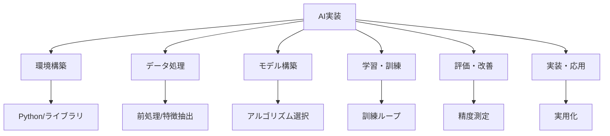
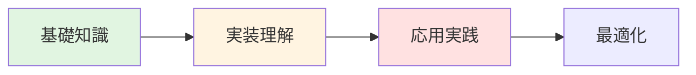
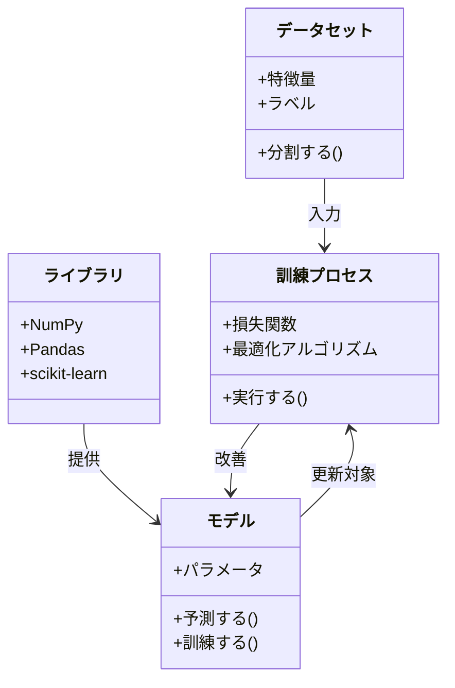
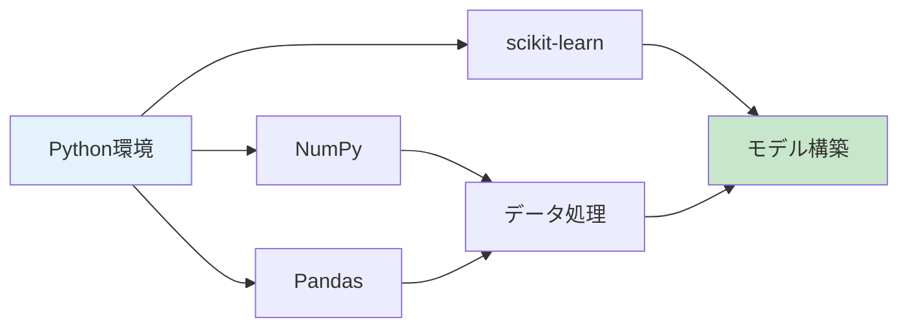
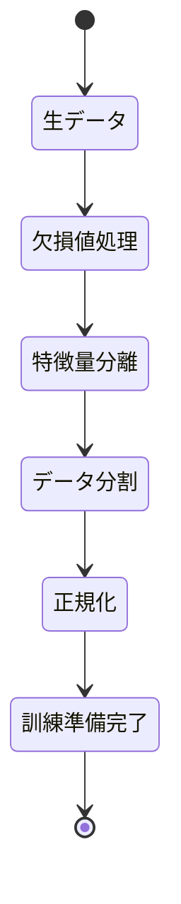
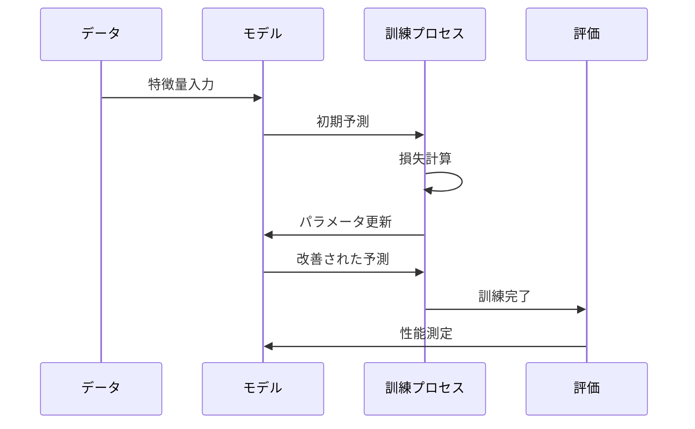
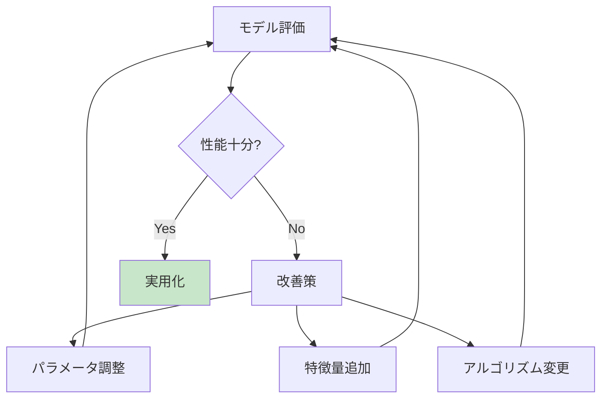
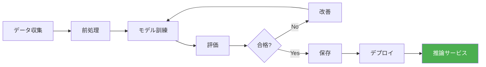

AI（人工知能）におけるプログラミング実装について

# AI（人工知能)におけるプログラミング実装: 段階的理解ガイド

> **学習目標**: AIシステムの基本構造を理解し、簡単なAIプログラムを実装できる
> **推奨学習時間**: 6-8時間
> **前提知識**: プログラミングの基礎知識（変数、関数、条件分岐）

---

## 1. 全体マップ

### AIプログラミング実装の全体像

AI実装とは、コンピュータが学習・推論・判断を行えるようにプログラムすることです。本ガイドでは、理論ではなく**実際にコードを書く方法**に焦点を当てます。

**学習範囲**:
- ✅ 含む: 基本的なAIアルゴリズムの実装、機械学習ライブラリの使用、実践的なコード例
- ❌ 含まない: 高度な数学理論、AIの歴史、大規模システムの設計

**主要トピック**:
1. AI実装の基礎環境
2. データ処理とモデル構築
3. 学習アルゴリズムの実装
4. モデルの評価と改善
5. 実用的なAIアプリケーション



---

## 2. ガイド質問

### 基礎レベル (★☆☆)
**環境構築について**:
- Q1: AIプログラミングに必要な主要ライブラリは何か?
- Q2: データをモデルに入力する前にどのような準備が必要か?

**モデル構築について**:
- Q3: 機械学習モデルとは何か、どう作るのか?

### 応用レベル (★★☆)
**学習プロセスについて**:
- Q4: モデルはどのようにしてデータから「学習」するのか?
- Q5: 過学習(overfitting)とは何か、どう防ぐのか?

**実装について**:
- Q6: 分類問題と回帰問題の実装の違いは何か?

### 統合レベル (★★★)
**応用・最適化について**:
- Q7: 実際のプロジェクトでAIモデルを実装する際の手順は?
- Q8: モデルの性能を向上させるための実装テクニックは?



*図: 質問の難易度進行。緑=基礎、黄=応用、赤=高度*

---

## 3. 核心概念

### 重要用語と定義

**1. ライブラリ (Library)**
定義: 事前に書かれたコードの集まりで、AI実装を簡単にする道具。NumPy、Pandas、scikit-learnなどが代表的。

**2. データセット (Dataset)**
定義: モデルが学習するための入力例の集合。特徴量(features)とラベル(labels)から構成される。

**3. モデル (Model)**
定義: 入力から出力への変換ルールを表すプログラム構造。ニューラルネットワークや決定木など形式は様々。

**4. 訓練 (Training)**
定義: データを使ってモデルのパラメータを調整し、正確な予測ができるようにするプロセス。

**5. 損失関数 (Loss Function)**
定義: モデルの予測と正解の差を数値化する関数。訓練ではこの値を最小化する。

**6. 推論 (Inference)**
定義: 訓練済みモデルを使って新しいデータに対して予測を行うこと。

**7. ハイパーパラメータ (Hyperparameter)**
定義: 学習前に人間が設定する値(学習率、層の数など)。モデルの性能を左右する。

**概念間の関係**:
ライブラリを使い、データセットからモデルを構築→訓練で損失関数を最小化→推論で実用化



*図: AI実装の核心概念の関係性*

---

## 4. 段階的詳細展開

### 4.1 環境構築とライブラリ

#### 層1: 導入
AI実装には適切なプログラミング環境とライブラリが必要です。Pythonが事実上の標準言語となっており、豊富なライブラリエコシステムが利用可能です。

#### 層2: 展開

**必須ライブラリ**:

1. **NumPy**: 数値計算の基礎
```python
import numpy as np
# 配列操作
data = np.array([1, 2, 3, 4, 5])
mean = np.mean(data)  # 平均計算
```

2. **Pandas**: データ管理
```python
import pandas as pd
# CSVファイル読み込み
df = pd.read_csv('data.csv')
df.head()  # 最初の5行表示
```

3. **scikit-learn**: 機械学習の実装
```python
from sklearn.linear_model import LogisticRegression
model = LogisticRegression()
```

4. **Matplotlib/Seaborn**: データ可視化
```python
import matplotlib.pyplot as plt
plt.plot(data)
plt.show()
```

**環境構築の実践**:
```bash
# 仮想環境作成
python -m venv ai_env
# ライブラリインストール
pip install numpy pandas scikit-learn matplotlib
```

**一般的な誤解**: 「TensorFlowやPyTorchが必須」→実際は基本的なAIならscikit-learnで十分です。

#### 層3: 要約
Pythonとscikit-learn中心のエコシステムで、ほとんどのAI実装が可能です。次はこれらを使ったデータ処理を学びます。



*図: AI実装の技術スタック*

---

### 4.2 データ処理とモデル準備

#### 層1: 導入
生のデータはそのままではモデルに使えません。前処理と特徴抽出がAI実装の成否を分けます。

#### 層2: 展開

**データ前処理の基本手順**:

1. **データ読み込み**:
```python
import pandas as pd
data = pd.read_csv('dataset.csv')
print(data.info())  # データ型確認
```

2. **欠損値処理**:
```python
# 欠損値確認
print(data.isnull().sum())
# 平均値で補完
data['age'].fillna(data['age'].mean(), inplace=True)
# または行ごと削除
data.dropna(inplace=True)
```

3. **特徴量とラベルの分離**:
```python
X = data.drop('target', axis=1)  # 特徴量
y = data['target']  # ラベル(予測対象)
```

4. **データ分割**:
```python
from sklearn.model_selection import train_test_split
X_train, X_test, y_train, y_test = train_test_split(
    X, y, test_size=0.2, random_state=42
)
```

5. **正規化(スケーリング)**:
```python
from sklearn.preprocessing import StandardScaler
scaler = StandardScaler()
X_train = scaler.fit_transform(X_train)
X_test = scaler.transform(X_test)
```

**実世界の例**: 住宅価格予測では、部屋数・面積・築年数を特徴量、価格をラベルとして使用します。

**よくあるミス**: テストデータで学習してしまう(データリーケージ)→必ず分割後に処理。

#### 層3: 要約
適切な前処理により、モデルが学習可能な形式にデータを整形します。これで訓練の準備が整いました。



*図: データ前処理の流れ*

---

### 4.3 モデル構築と訓練

#### 層1: 導入
モデルの選択と訓練は、AI実装の中核です。問題の種類に応じて適切なアルゴリズムを選び、データから学習させます。

#### 層2: 展開

**分類問題の実装例**:
```python
from sklearn.ensemble import RandomForestClassifier
from sklearn.metrics import accuracy_score

# モデル作成
model = RandomForestClassifier(
    n_estimators=100,  # 木の数
    max_depth=5,       # 木の深さ
    random_state=42
)

# 訓練
model.fit(X_train, y_train)

# 予測
y_pred = model.predict(X_test)

# 評価
accuracy = accuracy_score(y_test, y_pred)
print(f'精度: {accuracy:.2f}')
```

**回帰問題の実装例**:
```python
from sklearn.linear_model import LinearRegression
from sklearn.metrics import mean_squared_error

model = LinearRegression()
model.fit(X_train, y_train)

y_pred = model.predict(X_test)
mse = mean_squared_error(y_test, y_pred)
print(f'平均二乗誤差: {mse:.2f}')
```

**主要アルゴリズムの選択基準**:

| アルゴリズム | 用途 | 特徴 |
|------------|------|------|
| 線形回帰 | 数値予測 | シンプル、解釈容易 |
| ロジスティック回帰 | 2値分類 | 確率出力、高速 |
| ランダムフォレスト | 分類・回帰 | 高精度、過学習に強い |
| SVM | 分類 | 高次元データに強い |
| k-NN | 分類・回帰 | シンプル、訓練不要 |

**訓練プロセスの詳細**:
```python
# 学習曲線の可視化
from sklearn.model_selection import learning_curve

train_sizes, train_scores, test_scores = learning_curve(
    model, X_train, y_train, cv=5
)

# プロット
plt.plot(train_sizes, train_scores.mean(axis=1), label='訓練')
plt.plot(train_sizes, test_scores.mean(axis=1), label='検証')
plt.legend()
plt.show()
```

**実用例**: スパムメール判別では、単語の出現頻度を特徴量とし、ランダムフォレストでスパム/非スパムを分類。

#### 層3: 要約
適切なアルゴリズム選択と訓練により、データパターンを学習したモデルが完成します。次は性能評価と改善方法を学びます。



*図: モデル訓練の流れ*

---

### 4.4 モデル評価と改善

#### 層1: 導入
訓練したモデルの性能を正しく評価し、改善することで実用レベルのAIを実現します。

#### 層2: 展開

**評価指標の実装**:

1. **分類問題の評価**:
```python
from sklearn.metrics import classification_report, confusion_matrix

# 詳細レポート
print(classification_report(y_test, y_pred))

# 混同行列
cm = confusion_matrix(y_test, y_pred)
print(cm)
```

2. **回帰問題の評価**:
```python
from sklearn.metrics import r2_score, mean_absolute_error

r2 = r2_score(y_test, y_pred)
mae = mean_absolute_error(y_test, y_pred)
print(f'R²スコア: {r2:.3f}')
print(f'平均絶対誤差: {mae:.3f}')
```

**交差検証による信頼性向上**:
```python
from sklearn.model_selection import cross_val_score

# 5分割交差検証
scores = cross_val_score(model, X_train, y_train, cv=5)
print(f'平均スコア: {scores.mean():.3f} (+/- {scores.std():.3f})')
```

**ハイパーパラメータチューニング**:
```python
from sklearn.model_selection import GridSearchCV

# 探索パラメータ
param_grid = {
    'n_estimators': [50, 100, 200],
    'max_depth': [3, 5, 7],
    'min_samples_split': [2, 5, 10]
}

# グリッドサーチ
grid_search = GridSearchCV(
    RandomForestClassifier(),
    param_grid,
    cv=5,
    scoring='accuracy'
)
grid_search.fit(X_train, y_train)

print(f'最適パラメータ: {grid_search.best_params_}')
print(f'最高スコア: {grid_search.best_score_:.3f}')
```

**過学習の検出と対策**:
```python
# 訓練データとテストデータの性能比較
train_score = model.score(X_train, y_train)
test_score = model.score(X_test, y_test)

if train_score - test_score > 0.1:
    print('過学習の可能性あり')
    # 対策: 正則化、データ増量、モデル簡素化
```

**特徴量重要度の分析**:
```python
# ランダムフォレストの場合
importances = model.feature_importances_
feature_names = X.columns

# 重要度順に表示
for name, importance in sorted(zip(feature_names, importances), 
                               key=lambda x: x[1], reverse=True):
    print(f'{name}: {importance:.3f}')
```

#### 層3: 要約
適切な評価指標と改善手法により、モデルの実用性を高めることができます。最後に、実践的な実装例を見ていきましょう。



*図: モデル改善サイクル*

---

### 4.5 実用的なAIアプリケーション実装

#### 層1: 導入
これまで学んだ要素を統合し、実際に動作する完全なAIアプリケーションを構築します。

#### 層2: 展開

**完全な実装例: 画像分類器**:
```python
# 1. ライブラリインポート
import numpy as np
import pandas as pd
from sklearn.model_selection import train_test_split
from sklearn.ensemble import RandomForestClassifier
from sklearn.metrics import classification_report
import joblib  # モデル保存用

# 2. データ読み込みと前処理
def load_and_preprocess_data(filepath):
    data = pd.read_csv(filepath)
    
    # 欠損値処理
    data.fillna(data.mean(), inplace=True)
    
    # 特徴量とラベル分離
    X = data.drop('label', axis=1)
    y = data['label']
    
    return train_test_split(X, y, test_size=0.2, random_state=42)

# 3. モデル構築と訓練
def train_model(X_train, y_train):
    model = RandomForestClassifier(
        n_estimators=100,
        max_depth=10,
        random_state=42
    )
    model.fit(X_train, y_train)
    return model

# 4. 評価
def evaluate_model(model, X_test, y_test):
    y_pred = model.predict(X_test)
    print(classification_report(y_test, y_pred))
    return y_pred

# 5. モデル保存
def save_model(model, filepath='model.pkl'):
    joblib.dump(model, filepath)
    print(f'モデルを{filepath}に保存しました')

# 6. 推論関数
def predict_new_data(model, new_data):
    prediction = model.predict(new_data)
    probability = model.predict_proba(new_data)
    return prediction, probability

# メイン実行
if __name__ == '__main__':
    # データ準備
    X_train, X_test, y_train, y_test = load_and_preprocess_data('data.csv')
    
    # 訓練
    model = train_model(X_train, y_train)
    
    # 評価
    evaluate_model(model, X_test, y_test)
    
    # 保存
    save_model(model)
    
    # 新しいデータで予測
    new_sample = np.array([[5.1, 3.5, 1.4, 0.2]])
    pred, prob = predict_new_data(model, new_sample)
    print(f'予測: {pred}, 確率: {prob}')
```

**Webアプリ化の例(Flask使用)**:
```python
from flask import Flask, request, jsonify
import joblib

app = Flask(__name__)
model = joblib.load('model.pkl')

@app.route('/predict', methods=['POST'])
def predict():
    data = request.json['features']
    prediction = model.predict([data])
    return jsonify({'prediction': int(prediction[0])})

if __name__ == '__main__':
    app.run(debug=True)
```

**実装のベストプラクティス**:
1. **モジュール化**: 機能ごとに関数分割
2. **エラーハンドリング**: try-except文で例外処理
3. **ログ記録**: 訓練過程と予測結果を記録
4. **バージョン管理**: モデルとコードをGitで管理
5. **ドキュメント**: 関数にdocstring追加

**実世界の応用例**:
- 顧客離脱予測システム
- 在庫需要予測
- 異常検知システム
- レコメンドエンジン

#### 層3: 要約
実装の各段階を統合し、保存・読み込み・APIサービス化まで行うことで、実用的なAIシステムが完成します。



*図: AI実装の完全なワークフロー*

---

## 5. 統合・実践

### ガイド質問への模範回答

**Q1: AIプログラミングに必要な主要ライブラリは何か?**
回答: Python環境で、NumPy(数値計算)、Pandas(データ管理)、scikit-learn(機械学習)、Matplotlib(可視化)が基本セットです。より高度な実装にはTensorFlowやPyTorchを使用します。

**Q2: データをモデルに入力する前にどのような準備が必要か?**
回答: (1)欠損値処理、(2)特徴量とラベルの分離、(3)訓練/テストデータ分割、(4)正規化・スケーリングの順に処理します。

**Q3: 機械学習モデルとは何か、どう作るのか?**
回答: 入力から出力への変換ルールを持つプログラム構造です。scikit-learnでは`model = RandomForestClassifier()`のようにインスタンス化し、`model.fit(X, y)`で訓練します。

**Q4: モデルはどのようにしてデータから「学習」するのか?**
回答: 予測と正解の差(損失)を計算し、その差を小さくするようパラメータを反復的に調整します。これを訓練データ全体で繰り返します。

**Q5: 過学習(overfitting)とは何か、どう防ぐのか?**
回答: 訓練データに過度に適合し、新しいデータで性能が落ちる現象です。対策は交差検証、正則化、データ増量、モデル簡素化です。

**Q6: 分類問題と回帰問題の実装の違いは何か?**
回答: 分類は離散的なカテゴリ予測(例: スパム判定)、回帰は連続値予測(例: 価格予測)です。評価指標と損失関数が異なりますが、実装フローは類似しています。

**Q7: 実際のプロジェクトでAIモデルを実装する際の手順は?**
回答: (1)問題定義、(2)データ収集、(3)前処理、(4)モデル選択、(5)訓練、(6)評価、(7)チューニング、(8)デプロイ、(9)モニタリングの9ステップです。

**Q8: モデルの性能を向上させるための実装テクニックは?**
回答: 特徴量エンジニアリング、ハイパーパラメータチューニング、アンサンブル学習、データ拡張、交差検証の活用が効果的です。

---

### 統合演習問題

**問題1: 実装統合 (★★☆)**
以下の要件でAIシステムを実装してください:
- データ: Iris花データセット(scikit-learn内蔵)
- タスク: 花の種類を3クラス分類
- 要求: 訓練、評価、モデル保存までの完全なコード

**問題2: 実践応用 (★★★)**
顧客データ(年齢、収入、購入履歴)から、次月に購入する確率を予測するシステムを設計してください。データ前処理、モデル選択、評価方法を具体的に説明してください。

**問題3: デバッグ (★★☆)**
以下のコードの問題点を3つ指摘し、修正してください:
```python
model = RandomForestClassifier()
model.fit(X, y)
X_test = scaler.fit_transform(X_test)
accuracy = model.score(X_test, y_test)
```

---

### 自己評価チェックリスト

学習完了の目安として、以下を確認してください:

**基礎理解**
- [ ] 必要なライブラリをインポートし、基本操作ができる
- [ ] データを読み込み、前処理の各ステップを実行できる
- [ ] モデルを作成し、訓練・予測ができる

**実装能力**
- [ ] 分類・回帰それぞれの完全なコードを書ける
- [ ] 適切な評価指標を選択し、モデル性能を測定できる
- [ ] ハイパーパラメータをチューニングできる

**応用・統合**
- [ ] 実データで0からモデル構築まで実行できる
- [ ] 過学習の検出と対策ができる
- [ ] モデルを保存し、新しいデータで推論できる

**実践スキル**
- [ ] エラーが出た際、自力でデバッグできる
- [ ] 性能が低い場合、改善策を複数試せる
- [ ] コードをモジュール化し、再利用可能にできる

---

### 推奨学習計画

```mermaid
gantt
    title AI実装習得プラン(8時間)
    dateFormat HH:mm
    axisFormat %H:%M
    
    section 基礎固め
    環境構築とライブラリ     :a1, 00:00, 1h
    データ処理実践           :a2, after a1, 1.5h
    
    section モデル構築
    分類問題実装            :b1, after a2, 1.5h
    回帰問題実装            :b2, after b1, 1h
    
    section 応用
    評価と改善              :c1, after b2, 1.5h
    統合プロジェクト         :c2, after c1, 1.5h
```



---

## 学習の次のステップ

### 深化テーマ
1. **ディープラーニング実装**: TensorFlow/Kerasでニューラルネットワーク構築
2. **自然言語処理**: テキストデータのAI処理(BERT、Transformers)
3. **コンピュータビジョン**: 画像認識・物体検出の実装
4. **強化学習**: エージェントが環境と相互作用して学習

### 実践提案
1. 個人プロジェクトで実データに適用
2. GitHubでコードを公開し、ポートフォリオ作成
3. Kaggleで他者のコードを読み、テクニックを吸収

これでAI実装の基礎から実践まで、段階的に学習する
