# 人間のメンタルモデルと自然言語インタフェースの最適化

## 📋 文書概要
- **対象読者**: 初心者（AI利用者全般）
- **想定読了時間**: 15分
- **前提知識**: 基本的なAI対話経験（ChatGPT等の使用経験）

---

## 1. 全体像：メンタルモデルと言語インタフェースの関係

### 1.1 メンタルモデルとは何か

**前提**: 日常的な思考と言語使用の経験

人間の「メンタルモデル」とは、世界の仕組みや物事の関係性について、私たちが頭の中に持っている理解の枠組みです。例えば「ファイル」と聞いたとき、あなたは物理的な紙の束ではなく、コンピュータ上のデータ単位を思い浮かべるでしょう。これはあなたのメンタルモデルがデジタル時代に適応している証拠です。AIとの対話では、このメンタルモデルが言語を通じて表現され、AIはその言語からあなたの意図を推測します。しかし、あなたの頭の中のイメージ（メンタルモデル）と実際に発する言葉（言語表現）の間には常にギャップが存在し、このギャップが誤解や不満足な結果を生み出す主要因となります。

**Mermaid図: メンタルモデルから言語を経てAI理解に至る情報変換プロセス**

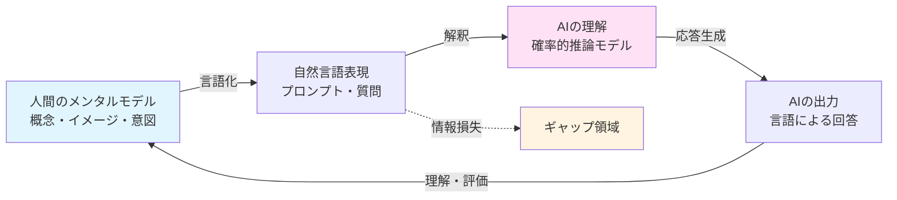

**図の読み取りポイント**: 
- 青色（人間側）と桃色（AI側）の間に位置する「自然言語」が唯一の接点
- ギャップ領域では、メンタルモデルの豊かさが言語の制約により圧縮される
- このサイクルは継続的に改善可能（対話を通じた精緻化）

**次への接続**: では、なぜこのギャップが生じるのか？それは人間とAIの「理解の仕組み」の根本的な違いにあります。

---

### 1.2 人間とAIの理解メカニズムの相違

**前提**: メンタルモデルの概念理解

人間の理解は「経験に基づく類推」で機能します。「リンゴ」と聞けば、味、触感、過去の記憶が瞬時に活性化します。一方、AIは「統計的パターン認識」で機能し、大量のテキストデータから「リンゴ」という単語が他のどの単語と共起しやすいかを学習しています。この違いは決定的です。あなたが「このデザイン、もっと温かみのある感じにして」と言ったとき、あなたのメンタルモデルには具体的な色味、質感、感情的な響きがありますが、AIには「温かみ」に関連する単語群の確率分布しかありません。だからこそ、あなたの内的イメージを言語という橋を通じて正確に渡すスキルが、AI時代の必須能力となるのです。

**Mermaid図: 人間とAIの理解プロセスの構造的違い**

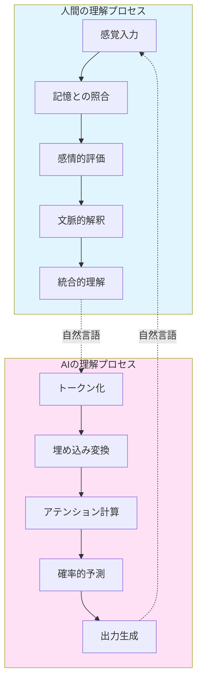

**図の読み取りポイント**:
- 人間：上から下への流れは経験と感情が統合されていく過程
- AI：機械的な段階的処理で、各ステップは数学的変換
- 両者をつなぐ「自然言語」は、それぞれ異なるプロセスの入出力点

**次への接続**: この構造的な違いを踏まえ、なぜメンタルモデルの明示的な言語化が重要なのかを見ていきます。

---

## 2. メンタルモデルの言語化が重要な理由

### 2.1 暗黙知の問題：「わかっているつもり」の罠

**前提**: 人間とAIの理解メカニズムの違いの認識

私たちは日常会話で多くを「言わずに済ませて」います。友人に「昨日のアレ、どうだった？」と聞けば、共有された文脈から「アレ」が何かは明白です。しかしAIには、あなたと共有する過去の経験、非言語的な手がかり、社会的文脈がありません。あなたの頭の中では完全に明確な「マーケティング資料を作って」という指示も、AIにとっては業界、対象顧客、トーン、長さ、目的など無数のパラメータが未指定の不完全な情報です。この「暗黙知」（言葉にしていない知識）が大きいほど、AIの出力とあなたの期待のズレが大きくなります。メンタルモデルの言語化とは、この見えない氷山を水面上に引き上げる作業なのです。

**Mermaid図: 暗黙知と明示知の氷山モデル**

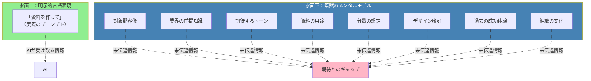

**図の読み取りポイント**:
- 緑の水面上部分（明示的な言葉）は全体の一部に過ぎない
- 青の水面下（暗黙知）には8つもの未伝達要素が存在
- AIは水面上しか見えないため、赤のギャップが発生

**次への接続**: では、この暗黙知を効果的に言語化するには何が必要でしょうか？

---

### 2.2 精緻化の段階：粗い概念から詳細指示へ

**前提**: 暗黙知と明示知の区別の理解

メンタルモデルの言語化は一度に完璧にはできません。「良い記事を書いて」→「ビジネスパーソン向けの1500字の記事」→「30代管理職向けに、時間管理術について、実践的なトーン、3つの具体例を含む1500字の記事」というように、段階的に精緻化していくプロセスが自然です。この過程で重要なのは「自分が何を知っていて、何を前提としているか」のメタ認知です。初心者が陥りがちなのは、最初から完璧な指示を出そうとして手が止まることです。実際には、粗い指示→AIの出力→ギャップの認識→精緻化された指示、という反復サイクルこそが、あなたのメンタルモデルを効果的に言語化する実践的な方法なのです。

**Mermaid図: メンタルモデル精緻化の反復サイクル**

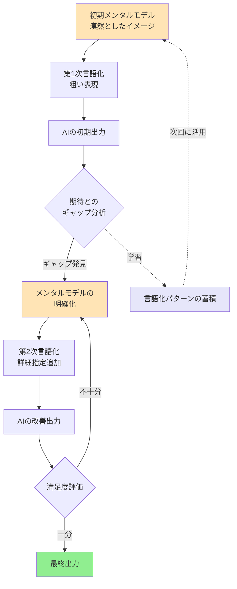

**図の読み取りポイント**:
- 左側の流れ：単純な一方向ではなく、中央でループする構造
- ギャップ分析（菱形）が精緻化の鍵となる意思決定ポイント
- 紫の破線：このサイクル全体が将来の言語化スキル向上につながる

**次への接続**: この精緻化プロセスを効果的に進めるには、メンタルモデルの構造を理解する必要があります。

---

## 3. メンタルモデルの構造と言語化戦略

### 3.1 メンタルモデルの階層構造

**前提**: 精緻化プロセスの理解

あなたのメンタルモデルは単一の平面的なイメージではなく、階層構造を持っています。最上層には「目的・ゴール」（なぜそれが必要か）があり、中間層には「概念・原則」（どのような性質であるべきか）、最下層には「具体的要素」（何を含むべきか）が位置します。例えば「プレゼン資料」というメンタルモデルは、最上層では「投資家を説得する」という目的、中間層では「信頼性」「明快さ」という原則、最下層では「市場データ」「財務予測」といった具体要素から構成されます。AI への指示が不十分な時、多くの場合は最下層の具体要素だけを伝え、上層の目的や原則を省略しています。しかし、AIが真に有用な出力を生成するには、この階層全体の情報が必要なのです。

**Mermaid図: メンタルモデルの3層構造と情報の流れ**

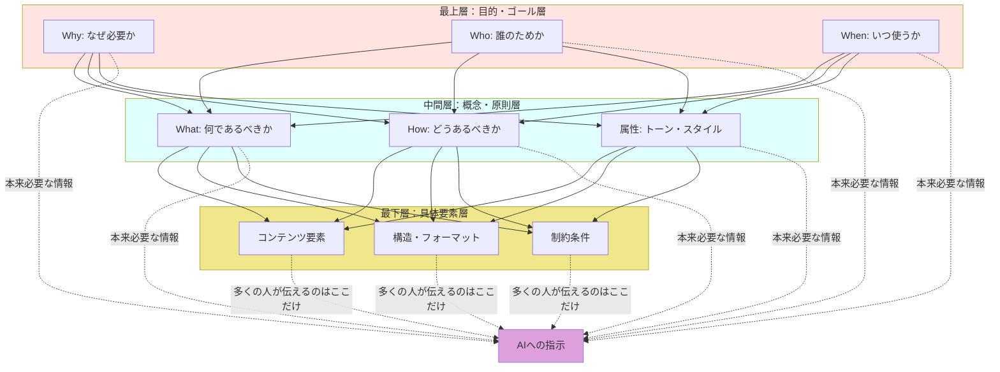

**図の読み取りポイント**:
- ピラミッド構造：上位層が下位層を規定する関係性
- 実線の矢印：各層間の論理的依存関係
- 破線の矢印：通常伝達される情報（黄色のみ）vs 本来必要な情報（全層）

**次への接続**: この階層構造を踏まえて、実践的な言語化テクニックを見ていきましょう。

---

### 3.2 効果的な言語化の5つの次元

**前提**: メンタルモデルの階層構造の理解

メンタルモデルを言語化する際、以下の5つの次元を意識すると網羅性が高まります。**(1) 文脈次元**：この情報はどのような状況で使われるか？誰が読むのか？(2) **構造次元**：どのような要素で構成されるべきか？どんな順序や関係性があるか？(3) **属性次元**：どのような性質・特徴を持つべきか？トーンや雰囲気は？(4) **制約次元**：何をしてはいけないか？どんな限界があるか？(5) **評価次元**：何をもって「良い」とするか？どう判断するか？多くの失敗例は、これらの次元のうち1-2つしか言語化していません。例えば「短い文章で書いて」は制約次元のみで、他の4次元が欠落しています。5次元を意識することで、あなたのメンタルモデルはより完全にAIに伝わります。

**Mermaid図: 言語化の5次元フレームワーク**

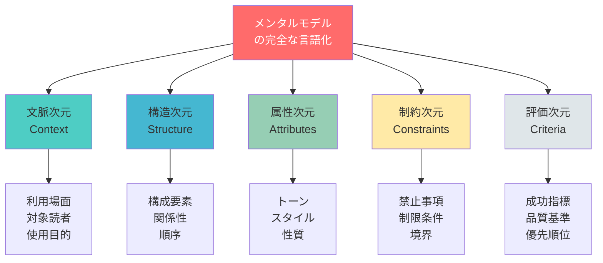

**図の読み取りポイント**:
- 中央の赤：完全な言語化は5次元すべてを含む
- 5色の円：各次元は独立しており、それぞれ重要
- 各次元配下の3要素：具体的なチェックポイント

**次への接続**: 理論を理解したところで、実際にどう応用するかを具体例で見ていきます。

---

## 4. 実践例：メンタルモデルの言語化ビフォー・アフター

### 4.1 ケーススタディ1：ビジネス文書作成

**前提**: 5次元フレームワークの理解

**不十分な指示の例**：
「新製品のプレスリリースを書いて」

この指示では、書き手のメンタルモデルにある豊富な情報（製品の革新性、ターゲットメディア、企業のブランドトーン、競合との差別化ポイントなど）が一切伝わっていません。

**改善された指示の例**：
「B2B SaaS企業の新製品プレスリリースを作成してください。【文脈】IT専門メディアとビジネス誌向けで、資金調達発表と同時に出します。【構造】見出し、リード文、3つの主要機能説明、CEOコメント、会社概要の順。【属性】革新的だが誇張しない、データドリブンなトーン。【制約】800字以内、競合名は出さない。【評価】記者が『なぜ今これが重要か』を即座に理解できることが成功基準です。」

この違いは、メンタルモデルの氷山を言語という道具で丁寧に掬い上げたかどうかの差です。

**Mermaid図: 指示の情報量比較**

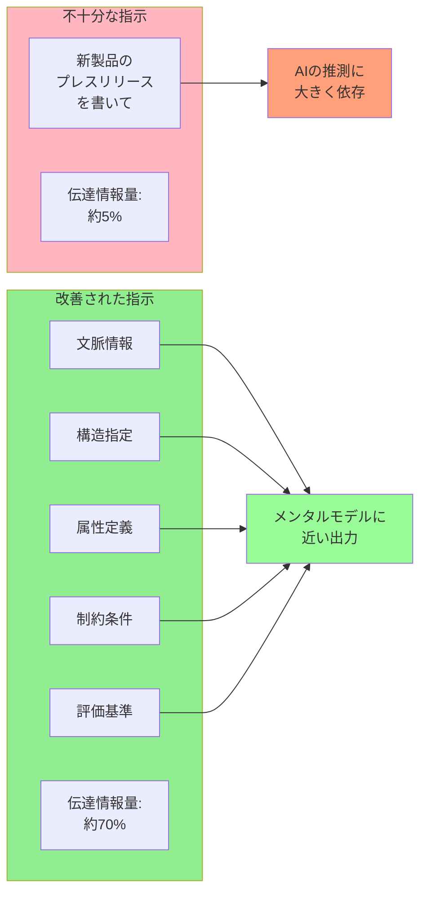

**図の読み取りポイント**:
- 左側（赤系）：単一要素のみで推測の余地が大きい
- 右側（緑系）：5要素が揃うことで推測の余地を削減
- 情報量の数値化：主観的だが体感的な理解を助ける

**次への接続**: もう一つ、創造的タスクでの応用例を見てみましょう。

---

### 4.2 ケーススタディ2：創造的タスクにおける言語化

**前提**: ビジネス文書での応用例の理解

創造的なタスクでは、メンタルモデルの言語化がさらに重要です。なぜなら「良いデザイン」「面白いストーリー」といった概念は、人によって全く異なるメンタルモデルを持つからです。

**不十分な指示の例**：
「子供向けの教育的な短編ストーリーを作って」

**改善された指示の例**：
「7-9歳児向けの短編ストーリーを作成してください。【文脈】小学校の道徳授業で先生が読み聞かせる教材として使用。【構造】問題発生→試行錯誤→気づき→解決の4部構成、10分で読める長さ。【属性】説教臭くなく、子供が『自分で考えた』と感じられる展開。動物キャラクター使用。【制約】暴力表現なし、明確な『正解』を押し付けない。【評価】子供が翌日も話題にしたくなり、複数の解釈が可能なことが成功基準。」

この例では、あなたの頭の中にある「子供向け」「教育的」という抽象概念が、具体的な年齢、使用場面、望ましい反応といった観察可能な要素に翻訳されています。これこそがメンタルモデルの効果的な言語化です。

**Mermaid図: 抽象概念の具体化プロセス**

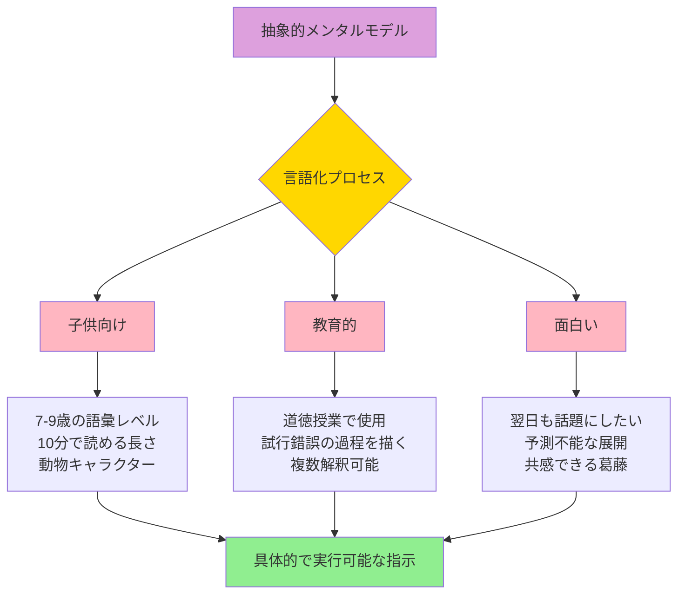

**図の読み取りポイント**:
- 紫（上部）：元の漠然とした概念
- ピンク（中段）：まだ抽象的な要素
- 各ピンク要素が3つの具体的指標に分解される
- 緑（下部）：AIが実行できる明確な指示

**次への接続**: これらの実践を支える、より深い認知的メカニズムを探ります。

---

## 5. 認知科学的基盤：なぜ言語化は難しいのか

### 5.1 言語化の認知的障壁

**前提**: 実践例による言語化の重要性の認識

なぜ私たちは、自分の頭の中にあることを言葉にするのが難しいのでしょうか？認知科学では主に3つの障壁が指摘されています。**(1) 暗黙的処理の優位性**：脳は効率のため、多くの判断を意識下で行います。あなたが「これは良いデザインだ」と感じる時、その判断に至る数十の要素（色のバランス、空白の使い方、視線の流れなど）を意識的に言語化していません。**(2) 言語の粒度の限界**：感覚や直感は連続的で多次元ですが、言語は離散的で線形です。「少し明るめの温かい赤」という表現でも、あなたの頭の中の色は完全には伝わりません。**(3) ワーキングメモリの制約**：人間は同時に約7つの情報しか保持できません。複雑なメンタルモデル全体を一度に言語化することは、認知的に困難なのです。

**Mermaid図: 言語化における3つの認知的障壁**

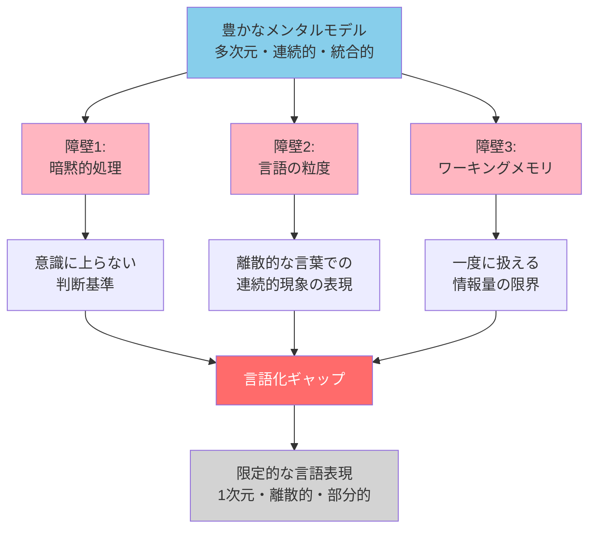

**図の読み取りポイント**:
- 上部の青：本来の豊かなメンタルモデル
- 3つのピンク：それぞれ独立した障壁
- 中央の赤：3つの障壁が生み出す複合的なギャップ
- 下部のグレー：結果として貧弱になった言語表現

**次への接続**: この障壁を克服するための具体的戦略を見ていきます。

---

### 5.2 認知的障壁を克服する3つの戦略

**前提**: 言語化の認知的障壁の理解

これらの障壁は完全には克服できませんが、軽減する戦略があります。**(1) 外在化と反射**：まず不完全でも言語化してAIに出力させ、それを見て「違う、こうじゃない」と感じることで、暗黙知を顕在化させます。これは鏡を見て自分の姿を確認するような行為です。**(2) 多角的記述**：一つの概念を複数の言い方で表現します。「温かみのある」を「親しみやすい」「柔らかい」「非公式的な」と言い換えることで、言語の粒度の限界を補います。**(3) 階層的分割**：複雑なメンタルモデルを一度に言語化せず、まず大枠、次に詳細と段階的に進めます。ワーキングメモリの制約を、時間軸で分散させるのです。これらは単なるテクニックではなく、認知的制約と協働する知恵なのです。

**Mermaid図: 認知的障壁の克服戦略とそのメカニズム**

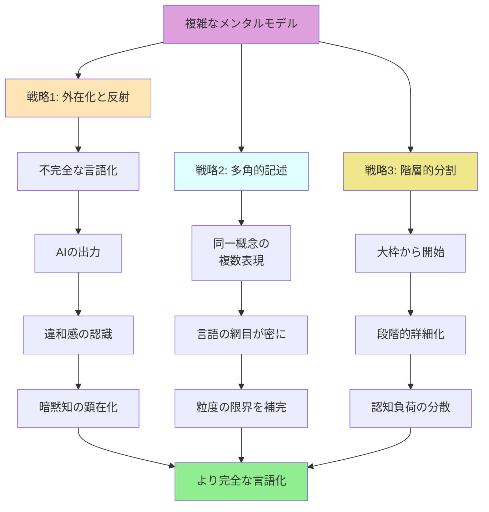

**図の読み取りポイント**:
- 紫（起点）：言語化前の複雑なメンタルモデル
- 3つの色分けされた戦略：それぞれが異なる認知的障壁に対応
- 各戦略の下位ステップ：段階的なプロセスを示す
- 緑（終点）：3戦略の統合による改善された言語化

**次への接続**: 理論と戦略を踏まえて、日常的に実践できる具体的な方法論に進みます。

---

## 6. 実践的メソッド：日常のAI対話での応用

### 6.1 「5W1H+2」フレームワーク

**前提**: 認知的障壁の克服戦略の理解

ジャーナリズムの基本である5W1H（Who, What, When, Where, Why, How）に、AIとの対話では「What kind（どんな性質）」と「How much（どの程度）」を加えた「5W1H+2」が有効です。このフレームワークは、あなたのメンタルモデルを構造的に言語化する足場となります。

**実践例**：「論文の要約を作って」という指示を展開する
- **Who**: 誰が読むのか？（同分野の研究者 vs 一般読者）
- **What**: 何を要約するのか？（全体 vs 特定セクション）
- **When**: いつ使うのか？（プレゼンの前 vs アーカイブ用）
- **Where**: どこで使うのか？（学会 vs 社内報告）
- **Why**: なぜ必要なのか？（理解のため vs 評価のため）
- **How**: どのように構成するか？（箇条書き vs 段落形式）
- **What kind**: どんな性質であるべきか？（客観的 vs 批判的）
- **How much**: どの程度の詳しさか？（100字 vs 500字）

この8要素すべてに答える必要はありませんが、チェックリストとして意識することで、重要な情報の漏れを防げます。

**Mermaid図: 5W1H+2フレームワークの適用プロセス**

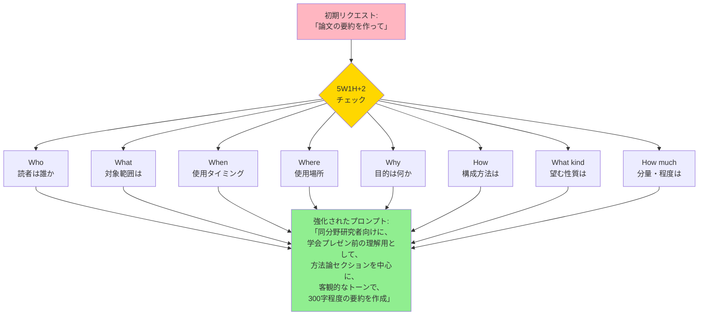

**図の読み取りポイント**:
- 左上（ピンク）：漠然とした初期リクエスト
- 中央（金色）：構造化のための8つの質問
- 右下（緑）：8要素を経て具体化された指示
- すべての要素が統合されて初めて完全な指示になる

**次への接続**: このフレームワークを、より動的な対話の中でどう使うかを見ていきます。

---

### 6.2 反復的精緻化：対話を通じた言語化の改善

**前提**: 5W1H+2フレームワークの理解

完璧な初回プロンプトを目指すより、対話を通じた段階的改善が実践的です。これは「プロトタイプ思考」に似ています。**(ステップ1) 最小限の言語化**：まず核心だけを伝えて出力を得る。「マーケティング戦略の提案書を作って」(ステップ2) **ギャップの特定**：出力を見て「どこが違うか」を言語化する。「もっとデータ重視で、競合分析が弱い」**(ステップ3) 差分の追加**：特定したギャップを埋める指示を追加。「3社の競合分析を追加し、各提案に市場データの根拠を付けて」**(ステップ4) 評価と反復**：改善された出力を評価し、必要なら繰り返す。

このプロセスは効率的なだけでなく、あなた自身のメンタルモデルを明確化する学習機会でもあります。「なぜ最初の出力に満足しなかったのか」を考えることで、自分が何を重視しているかを発見できます。

**Mermaid図: 反復的精緻化の実践サイクル**

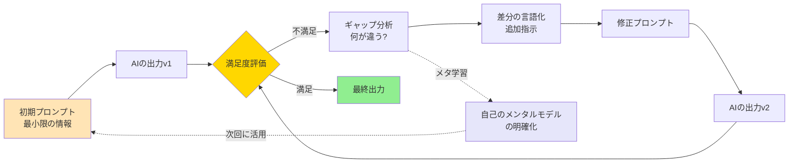

**図の読み取りポイント**:
- 左から右への流れ：時間経過に伴う改善プロセス
- 金色の菱形：重要な評価ポイント（ループの分岐点）
- 紫の破線：対話から得られるメタ認知的な学習
- この学習が次回の初期プロンプト（左端）の質を向上させる

**次への接続**: 個人レベルの実践から、さらに高度な応用技術へと進みます。

---

## 7. 高度な応用：メンタルモデルの共有と進化

### 7.1 プロンプトライブラリ：個人知の資産化

**前提**: 反復的精緻化による実践経験

あなたが時間をかけて精緻化したプロンプトは、単発の成果物ではなく再利用可能な資産です。「良い結果を生んだプロンプト」を体系的に保存することで、あなた自身のメンタルモデルの外部記憶装置を構築できます。効果的なプロンプトライブラリには以下の要素が含まれます：**(1) プロンプトの本体**：実際の指示文、**(2) コンテキスト情報**：どんな状況で使ったか、**(3) 成功パターン**：なぜうまくいったか、**(4) 改善履歴**：どう進化させたか。これは単なるコピー＆ペースト集ではなく、あなたの思考プロセスの結晶です。6ヶ月後に見返したとき、「当時の自分はこう考えていたのか」という気づきが、さらなるメンタルモデルの洗練につながります。

**Mermaid図: プロンプトライブラリの構造と活用サイクル**

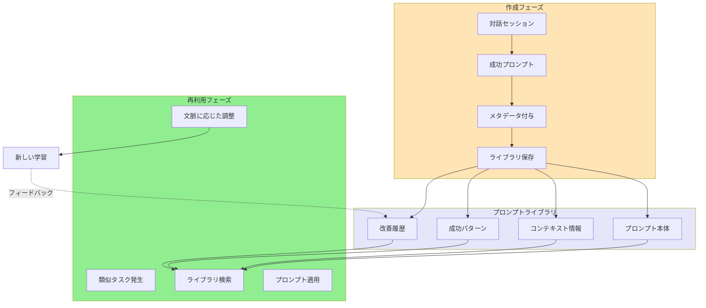

**図の読み取りポイント**:
- 左側（黄色）：経験からの抽出プロセス
- 中央（紫）：構造化された知識ベース（4要素）
- 右側（緑）：実践への再投入と継続的改善
- 破線：使用経験が元のライブラリを豊かにする循環

**次への接続**: 個人の実践を超えて、組織やコミュニティでの応用を考えます。

---

### 7.2 集合知としてのメンタルモデル共有

**前提**: プロンプトライブラリによる個人知の蓄積

メンタルモデルの言語化は、個人的な技能にとどまらず、集合知として共有できます。専門職種（弁護士、医師、エンジニアなど）には、その分野特有の思考パターンや判断基準があります。これらを言語化し共有することで、AIとの対話品質が職能集団全体で向上します。例えば、法律分野では「法的リスク分析のプロンプトパターン」、医療分野では「鑑別診断支援のプロンプト構造」といった、専門的メンタルモデルの標準化が進んでいます。重要なのは、これは単なるテンプレート集ではなく、「その分野の専門家がどう考えるか」という認知プロセスの外在化だということです。AIが民主化される時代において、専門性とはもはや知識の独占ではなく、優れたメンタルモデルとその言語化能力なのです。

**Mermaid図: 個人知から集合知への進化プロセス**

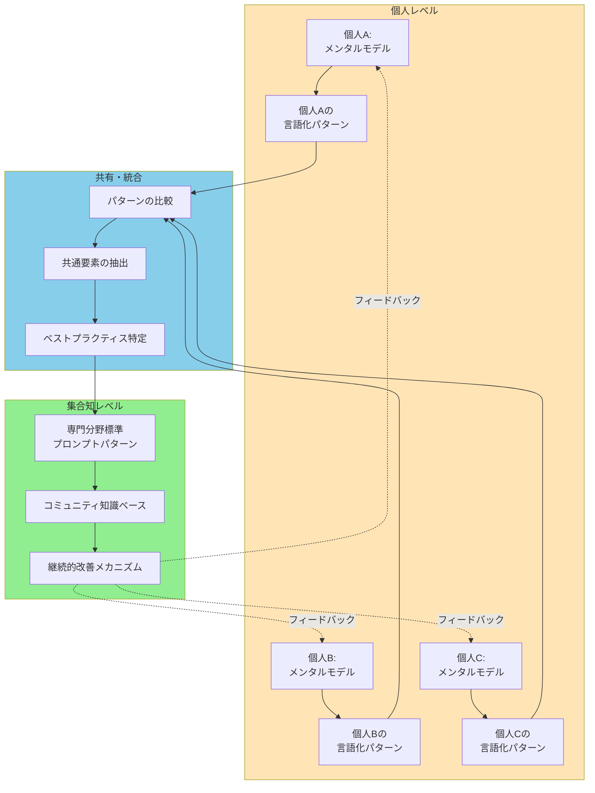

**図の読み取りポイント**:
- 上部（黄色）：多様な個人の経験と実践
- 中央（青）：共有と統合のプロセス（3段階）
- 下部（緑）：結晶化された集合知（3要素構造）
- 破線：集合知が個人の実践を向上させる良循環

**次への接続**: 最後に、未来展望と継続的学習の視点を提供します。

---

## 8. 未来展望：メンタルモデルと言語化の進化

### 8.1 AIの進化とメンタルモデル言語化の変化

**前提**: 現在のAI対話における言語化の重要性の理解

AIが進化すると、言語化の重要性は減るのでしょうか？答えは逆説的です。AIがより高度になるほど、正確なメンタルモデルの伝達はより重要になります。現在のAIは「補完」に長けています。不足情報を統計的に埋める能力です。しかし将来、AIがより複雑なタスク（戦略立案、創造的問題解決など）を担うようになると、あなたの意図の微妙なニュアンスが結果に大きく影響します。例えば、「リスクを取る」という同じ言葉でも、起業家とリスク管理者では全く異なるメンタルモデルを持ちます。高度なAIほど、この違いを理解して適切に対応する必要があり、それには精密な言語化が不可欠です。つまり、AI時代の本質的スキルは「AIに任せる技術」ではなく、「自分の思考を明瞭に表現する技術」なのです。

**Mermaid図: AI能力とメンタルモデル言語化の重要性の関係**

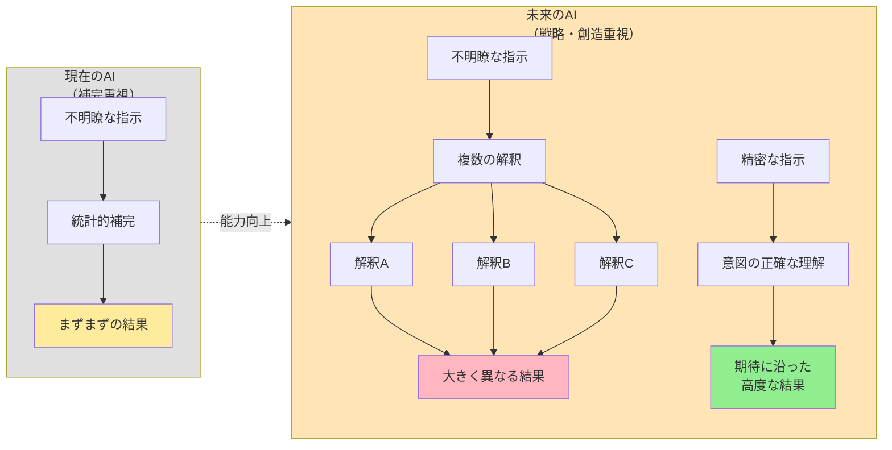

**図の読み取りポイント**:
- 左側（グレー）：現在のAIは補完能力で不明瞭さをカバー
- 右側（黄色）：未来のAIでは不明瞭さが複数の解釈を生む
- 赤系：不明瞭な指示がもたらす発散
- 緑：精密な指示がもたらす収束と高品質

**次への接続**: この未来を見据えて、今から育むべき能力を整理します。

---

### 8.2 メタ認知能力の育成：継続的な自己改善

**前提**: AI進化に伴う言語化スキルの重要性増大の理解

メンタルモデルの言語化能力を高める最も効果的な方法は、メタ認知（自分の思考について考えること）の訓練です。具体的には、以下の3つの習慣が有効です。**(1) 言語化の振り返り**：AIとの対話後、「なぜ最初のプロンプトは不十分だったのか」「どの情報を追加したら改善したか」を記録する。これは失敗の分析ではなく、自己の思考パターンの発見です。**(2) 他者の優れた言語化の分析**：効果的なプロンプト例を見たとき、「なぜこれは明確か」「自分なら何を省いてしまうか」を考える。他人の思考プロセスは、自分のメンタルモデルを相対化する鏡です。**(3) 日常での言語化練習**：AI利用時以外でも、自分の考えを構造的に言語化する練習をする。例えば「今日の昼食の選択基準は何だったか」を5W1H+2で分析してみる。これらの習慣は、あなたの思考そのものを明瞭にし、AI時代の最も貴重な資産となります。

**Mermaid図: メタ認知能力育成の3つの柱と相互作用**

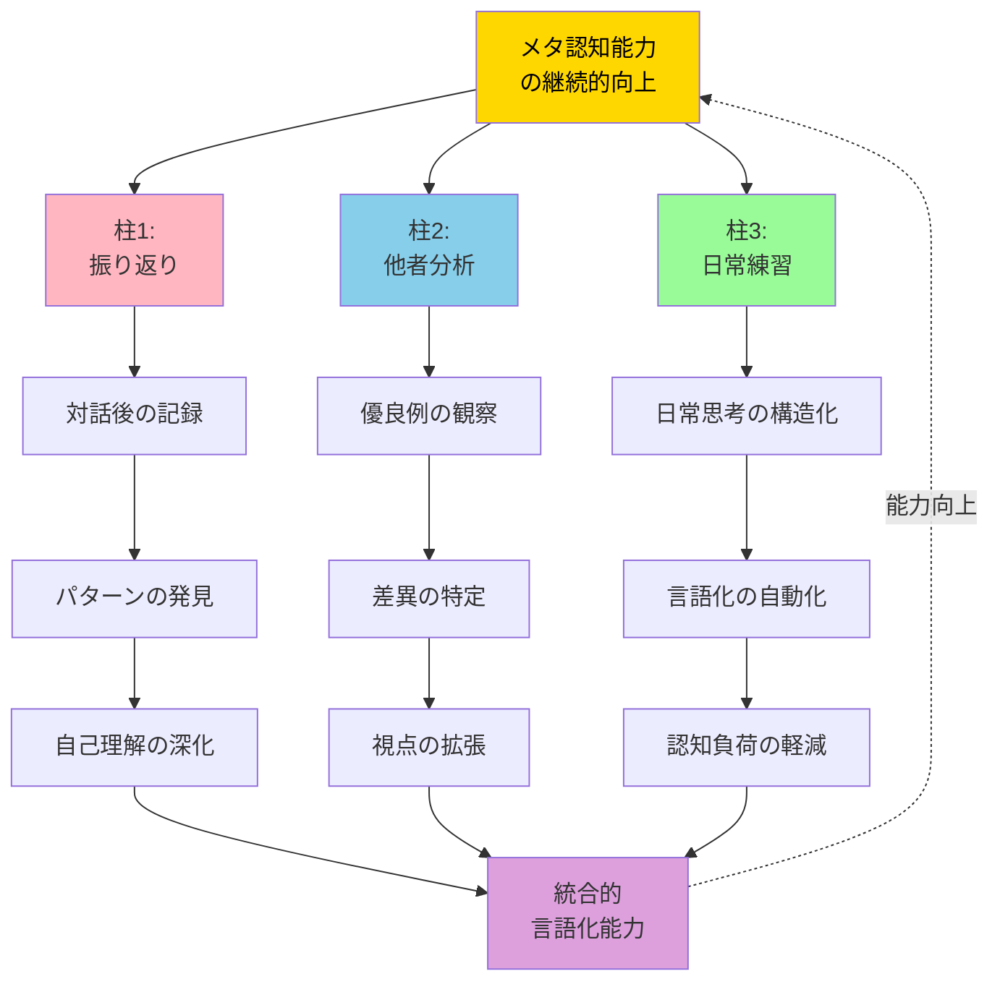

**図の読み取りポイント**:
- 中央（金色）：育成目標となるメタ認知能力
- 3色の柱：それぞれ異なるアプローチ（内省・外部観察・実践）
- 各柱の3段階：習慣から能力獲得までの進行
- 紫（下部）：3つの柱が統合されて生まれる総合力
- 破線：継続的な向上サイクル

---

## 📚 まとめ

### 重要ポイント

1. **メンタルモデルと言語のギャップ理解**
   - 人間の豊かな内的イメージと言語表現の間には本質的なギャップが存在する
   - AIは言語しか受け取れないため、このギャップが対話品質を決定する

2. **暗黙知の明示化が鍵**
   - 多くの重要情報は「言わずもがな」として省略されているが、AIには伝わらない
   - 階層構造（目的・概念・具体要素）を意識した言語化が効果的

3. **段階的精緻化のアプローチ**
   - 完璧な初回プロンプトより、対話を通じた反復改善が実践的
   - このプロセス自体が自己のメンタルモデルを明確化する学習機会

4. **5W1H+2フレームワークの活用**
   - 構造的な質問によって言語化の漏れを防ぐ
   - 全要素に答える必要はないが、チェックリストとして有効

5. **メタ認知能力の継続的育成**
   - AIが高度化するほど、精密な意図伝達の重要性が増す
   - 振り返り、他者分析、日常練習の3つの柱で能力を磨く

### 次に学ぶべきトピック

- **プロンプトエンジニアリングの技法**：より技術的な指示最適化手法
- **認知バイアスと言語化**：自己の思考の歪みを認識し補正する方法
- **マルチモーダルAIとメンタルモデル**：画像・音声も含めた総合的な意図伝達
- **組織のプロンプトガバナンス**：チームや企業レベルでの知識共有システム構築

---

**最後に**：メンタルモデルの言語化は、単なるAI活用技術ではありません。それは「自分が何を考え、何を求めているのか」を明確にする思考の訓練です。この能力は、AI時代においてあなたの最も価値ある資産となるでしょう。今日から、一つのプロンプトを丁寧に精緻化してみてください。その過程で、あなた自身の思考の明瞭さが増していくことを実感できるはずです。
