Generative AI = 生成AI のうち、ハルシネーション（Hallucination）について

# AIハルシネーション - 初学者のための完全ガイド

## 🔍 一言要約
AIが「もっともらしい嘘」をつく現象の正体と対策法

## 📚 目次
1. [🌟 はじめに - AIの「白昼夢」とは？](#-はじめに---aiの白昼夢とは)
2. [🏗️ ハルシネーションの基本構造](#️-ハルシネーションの基本構造)
3. [⚡ 発生メカニズム](#-発生メカニズム)
4. [📜 概念の歴史と発見経緯](#-概念の歴史と発見経緯)
5. [🎨 ハルシネーションの種類と特徴](#-ハルシネーションの種類と特徴)
6. [📗 関連する用語集](#-関連する用語集)
7. [💡 メリットとデメリット](#-メリットとデメリット)
8. [🚀 現実世界での事例と対策](#-現実世界での事例と対策)
9. [🌍 AIの信頼性向上への影響](#-aiの信頼性向上への影響)

## 🌟 はじめに - AIの「白昼夢」とは？

想像してみてください。とても賢い友人がいるとします。その友人は膨大な知識を持っていますが、時々「知らない」と言えずに、もっともらしい嘘をついてしまいます。これがAIの「ハルシネーション」です。

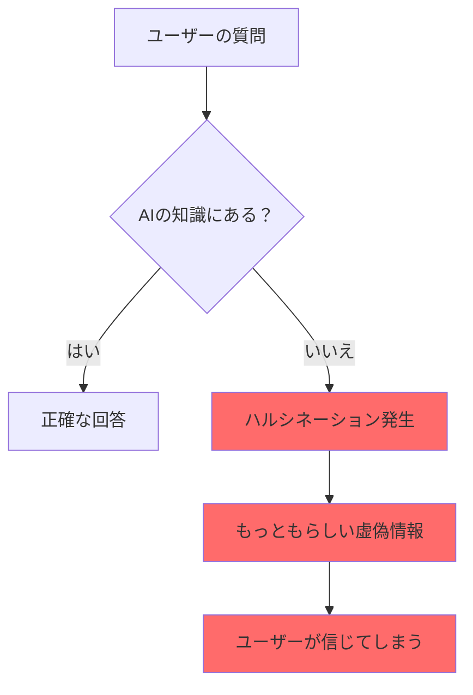

ハルシネーションは、生成AIが学習データにない情報について聞かれた時に、「分からない」と答える代わりに、まるで本当のことのように虚偽の情報を作り出す現象です。

## 🏗️ ハルシネーションの基本構造

AIのハルシネーションは、まるで人間の想像力のようなものですが、意図的ではありません。

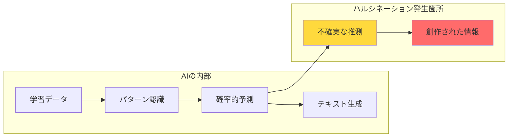

### 構造の3つの要素

1. **学習済みパターン**: AIが覚えている情報のパターン
2. **予測エンジン**: 次に来る言葉を推測する機能
3. **生成機能**: 文章として組み立てる能力

ハルシネーションは、予測エンジンが「確信を持てない」状況で、それでも何かを生成しようとする時に発生します。

## ⚡ 発生メカニズム

ハルシネーションが起こる仕組みを、料理に例えて説明しましょう。

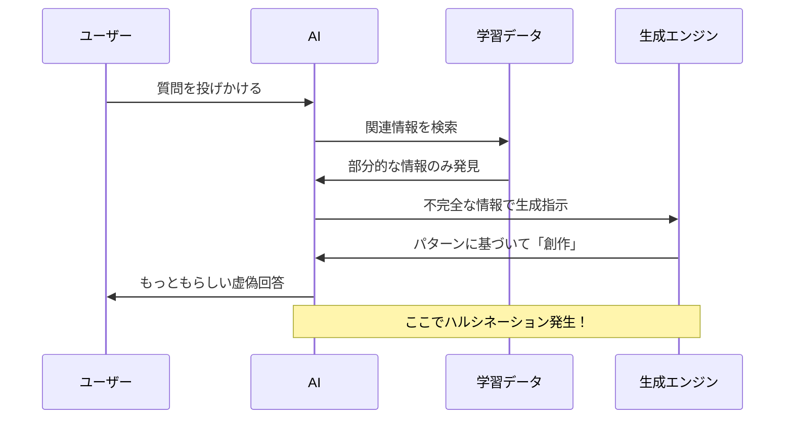

### 発生する3つの状況
- 発生メカニズムは複雑で、これら3つの状況に限定できない。
1. **情報不足**: 学習データに十分な情報がない
2. **曖昧な質問**: 複数の解釈が可能な質問
3. **複雑な推論**: 複数の知識を組み合わせる必要がある場合

## 📜 概念の歴史と発見経緯

「ハルシネーション」という言葉は、もともと医学用語として使われていました。
- この用語自体は、大規模言語モデル（LLM）が社会的に注目される以前、2018年頃にはAI分野で使われ始めていた（例：ニューラル機械翻訳での誤訳）。ChatGPTの登場（2022年）で社会的な認知と問題定義が確立されたという方が正確
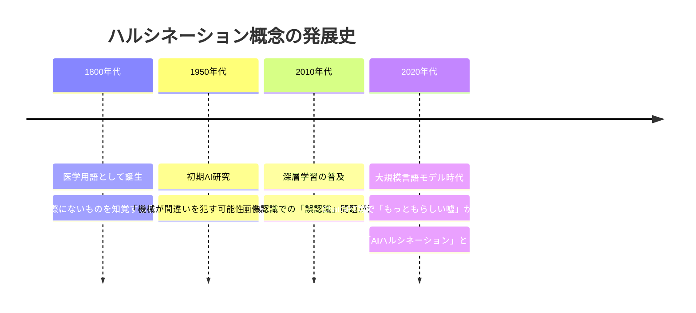

### 発見のきっかけ

2022年のChatGPT公開後、多くの人がAIの「もっともらしい間違い」に気づきました。これまでのコンピューターは「分からない」と正直に答えていましたが、生成AIは「分からなくても何かを答えてしまう」特性があることが明らかになりました。

## 🎨 ハルシネーションの種類と特徴

ハルシネーションには様々な種類があります。まるで人間の嘘にも種類があるように。

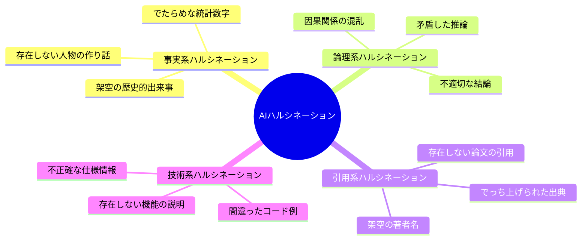

### 各タイプの特徴比較

| 種類 | 危険度 | 発見しやすさ | 対策の重要度 |
|------|--------|--------------|--------------|
| 事実系 | 高 | 中 | 最重要 |
| 論理系 | 中 | 高 | 重要 |
| 引用系 | 最高 | 低 | 最重要 |
| 技術系 | 高 | 中 | 重要 |

## 📗 関連する用語集

### 同義語・類似概念
- **AI幻覚**: ハルシネーションの直訳
- **虚偽生成**: より直接的な表現
- **創作回答**: AIが勝手に作った答え

### 関連用語
- **バイアス**: AIの偏った判断
- **オーバーフィッティング**: 学習データに過度に適応
- **確信度**: AIがどれくらい自分の答えを信じているか

### 対義語
- **正確性**: 正しい情報を提供すること
- **透明性**: AIの判断根拠が分かること
- **信頼性**: 一貫して正しい結果を出すこと

## 💡 メリットとデメリット

### 意外なメリット
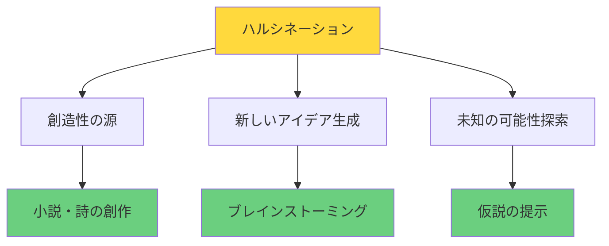

**メリット：**
- **創作活動**: 小説や詩などの創造的な作業では有用
- **アイデア発想**: 新しい視点や可能性を提示
- **柔軟性**: 型にはまらない回答が可能

### 深刻なデメリット
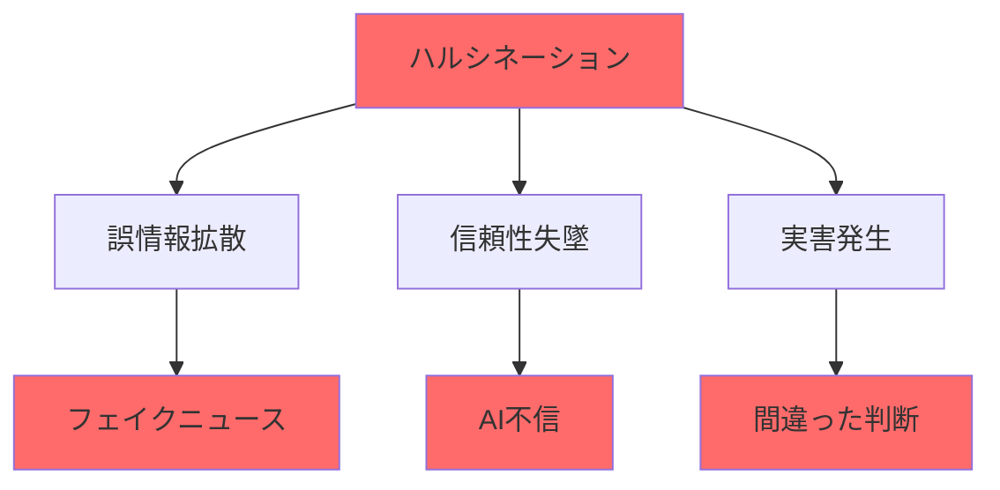

**デメリット：**
- **誤情報拡散**: 間違った情報が事実として広まる
- **信頼性の問題**: AIへの不信増大
- **実害**: 医療・法律など重要分野での悪影響

## 🚀 現実世界での事例と対策

### 実際に起きた問題事例

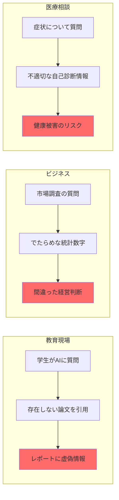

### 効果的な対策法

1. **複数ソース確認**: AIの回答を他の情報源と照合
2. **専門家による検証**: 重要な情報は必ず専門家に確認
3. **段階的質問**: 複雑な質問を小さく分けて確認
4. **出典要求**: 情報の根拠を必ず尋ねる

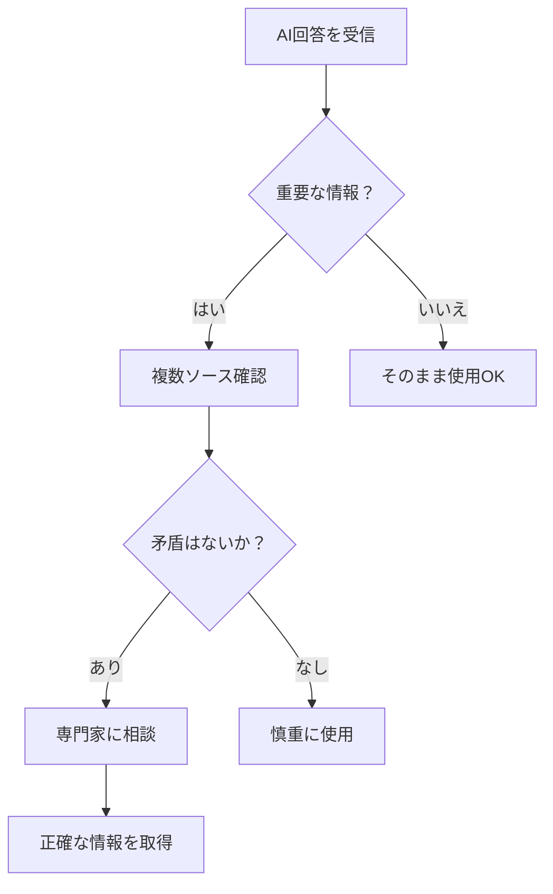

## 🚀 置換、変遷

### 何を置き換えたか
- **従来の検索エンジン**: 単純な情報検索から対話型回答へ
- **FAQ システム**: 決まった質問への決まった回答から柔軟な対応へ

### 何に置き換えられる可能性があるか
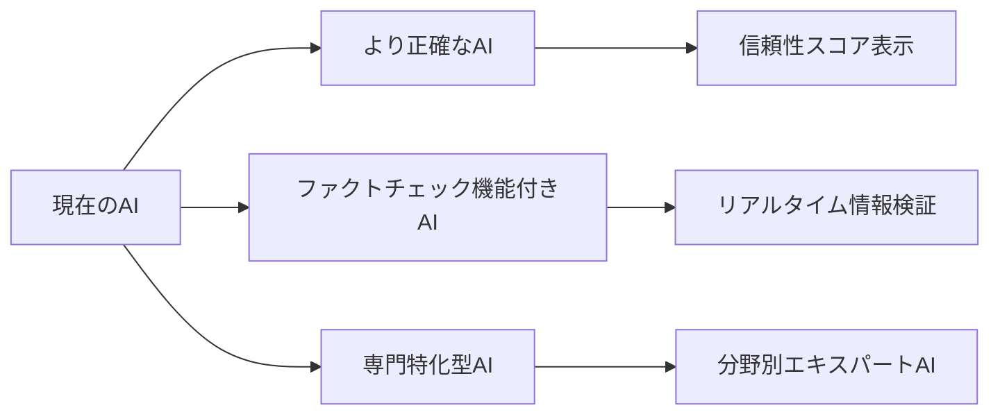

## 🚀 代替、競合

### 代替手段
- **専門書籍・論文**: より信頼性の高い情報源
- **専門家への相談**: 人間の専門知識
- **検証済みデータベース**: 事実確認済みの情報源

### 競合する技術
- **ファクトチェック AI**: 情報の正確性を自動検証
- **知識グラフベース AI**: 構造化された知識のみを使用
- **専門特化 AI**: 特定分野に特化して正確性を向上

## 🌍 AIの信頼性向上への影響

ハルシネーション問題は、AI技術全体の発展に大きな影響を与えています。

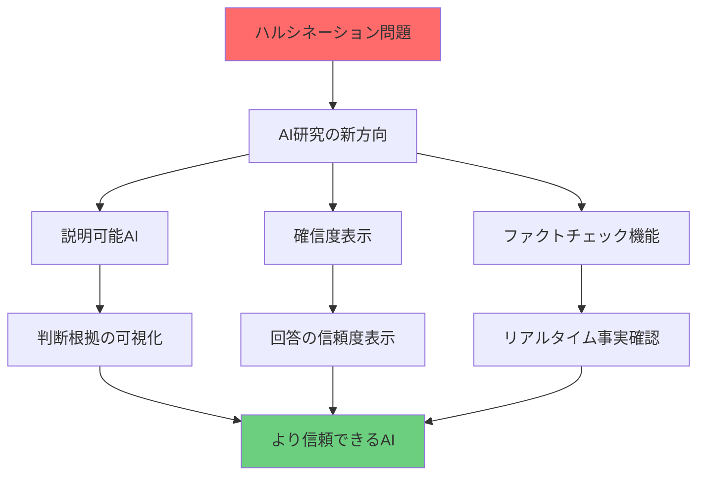

### 未来への影響

1. **AI開発の方向性**: 正確性を重視した設計へ
2. **利用者の意識変化**: AIを盲信せず、批判的に利用
3. **社会システムの変化**: AI活用時の検証プロセス標準化

### 期待される発展

- **2025年**: ファクトチェック機能の標準搭載
- **2027年**: 専門分野別AIの実用化
- **2030年**: ハルシネーション率1%以下の実現

---

このガイドにより、初学者でもAIハルシネーションの本質を理解し、適切に対処できるようになります。
