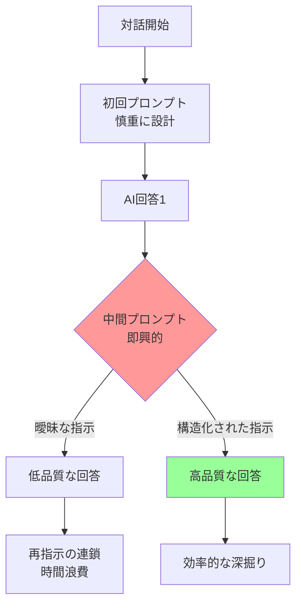
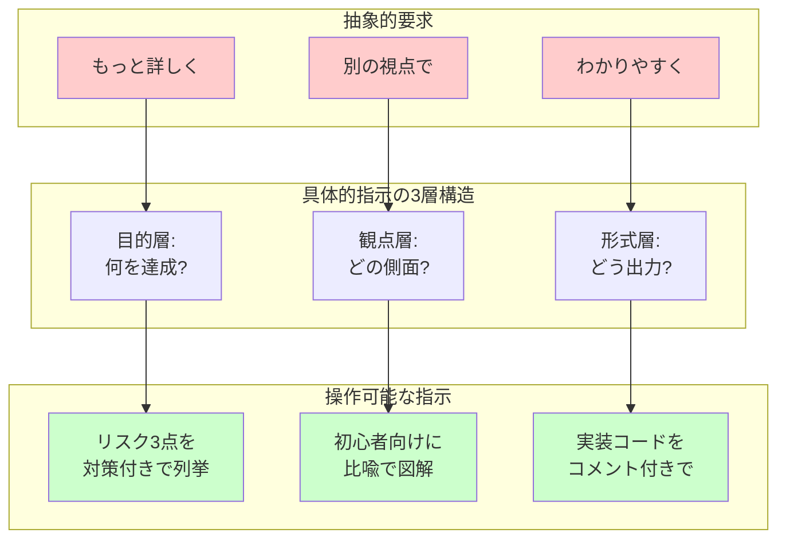
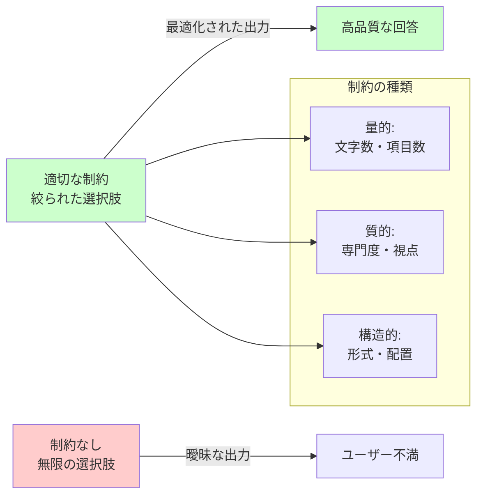
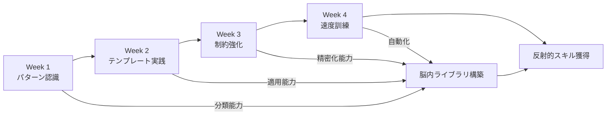
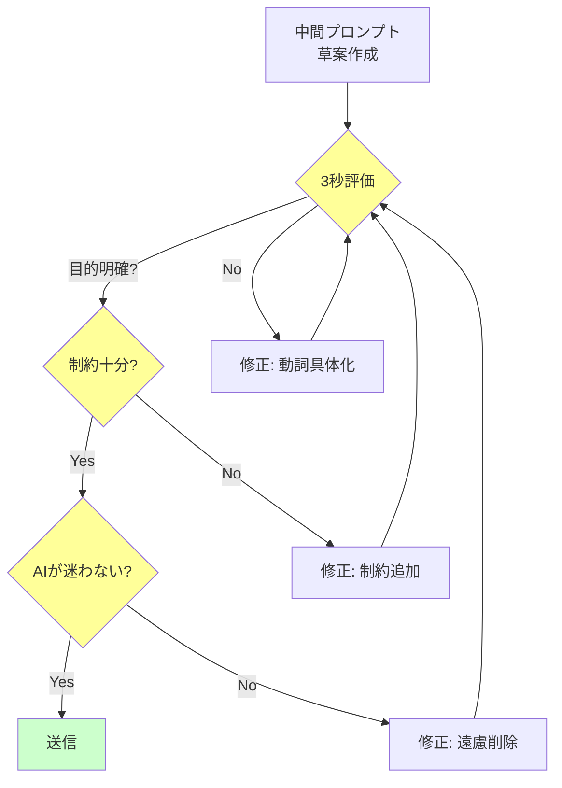
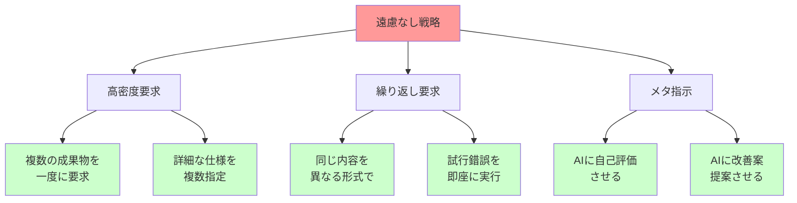
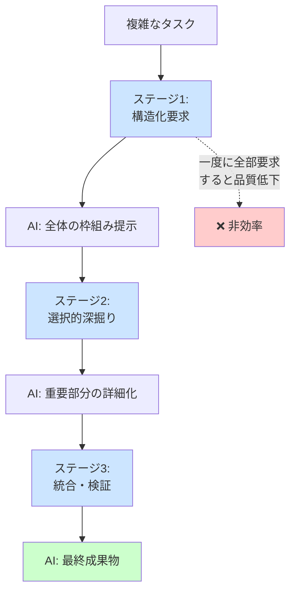

# AI対話における中間プロンプト最適化トレーニング

## 📋 文書概要
- **対象読者**: AI活用の効率化を目指す中級者
- **想定読了時間**: 15分
- **前提知識**: 基本的なAI対話経験(プロンプトの概念理解)

---

## 1. 全体像：中間プロンプトの特性理解

### 1.1 問題の構造

**前提**: AIとの基本的な対話経験がある

AIとの対話では、初回プロンプトは慎重に設計されることが多いが、**対話途中の指示（中間プロンプト）は即興的になりがち**です。しかし、この中間プロンプトこそが対話の方向性を決定的に変える重要な分岐点となります。

人間同士の会話では「文脈の共有」により曖昧な指示でも通じますが、AIは各メッセージを構造的に解釈します。「もっと詳しく」「別の角度で」といった抽象的指示は、AIにとって**最適化目標が不明確**な状態を生み出します。

特に重要なのは、**AIには遠慮が不要**という特性です。「手間をかけて申し訳ない」という心理的制約を外すことで、指示の質が劇的に向上します。

**Mermaid図: 中間プロンプトが対話品質に与える影響の構造**

**図の読み取りポイント**: 中間プロンプトの品質が、その後の対話効率を分岐させる決定的要因であることに注目してください。赤色ノードが問題発生点、緑色が目指すべき状態です。

---

## 2. 主要構成要素：効果的な中間プロンプトの設計原則

### 2.1 具体性の階層構造

**前提**: AIが「曖昧さを嫌う」システムであることの理解

効果的な中間プロンプトは、**抽象的要求を操作可能な指示に変換**します。以下の3層構造で指示を設計します：

1. **目的層**: 何を達成したいか（「理解を深めたい」→「矛盾点を発見したい」）
2. **観点層**: どの側面に注目するか（「技術的詳細」「ビジネス影響」「実装手順」）
3. **形式層**: どう出力するか（「箇条書き3点」「比較表」「コード例付き」）

例えば「もっと詳しく」という指示を変換すると：
- ❌ 曖昧：「もっと詳しく説明して」
- ✅ 具体的：「セキュリティリスクの観点から、3つの具体的攻撃シナリオを、対策案とセットで説明して」

**Mermaid図: 具体性の階層と指示の変換プロセス**

**図の読み取りポイント**: 左側の曖昧な要求は、中央の3層構造フィルターを通すことで、右側の操作可能な指示に変換されます。この変換を反射的に行えることが目標です。

### 2.2 制約の明示による最適化

**前提**: AIが「無限の選択肢」を持つがゆえに迷うシステムであることの理解

制約は創造性を阻害するのではなく、**探索空間を最適化**します。中間プロンプトでは以下の制約を明示することで、AIの出力を劇的に改善できます：

- **量的制約**: 「3点に絞って」「200字以内で」「5ステップで」
- **質的制約**: 「専門用語なしで」「コード例必須で」「反対意見も含めて」
- **構造的制約**: 「表形式で」「Before/After比較で」「Q&A形式で」

人間に対しては無茶に感じる「表形式で3×4のマトリクスにまとめて、各セルは50字以内」という指示も、AIには最適な作業指示となります。

**Mermaid図: 制約による探索空間の最適化**

**図の読み取りポイント**: 制約は選択肢を「制限」するのではなく、AIの処理能力を「集中」させるツールです。3種類の制約を組み合わせることで、精密な出力制御が可能になります。

---

## 3. 実践トレーニング方法：反射神経的スキルの習得

### 3.1 パターン認識トレーニング

**前提**: 前述の具体性階層と制約設計の理解

反射的に良質な中間プロンプトを生成するには、**典型パターンのライブラリ**を脳内に構築する必要があります。以下の4週間プログラムで習得します：

**Week 1: パターン分類練習（毎日10分）**
自分の過去の中間プロンプトを以下に分類：
- 「深掘り型」（もっと詳しく系）
- 「転換型」（別角度で系）
- 「簡略化型」（わかりやすく系）
- 「検証型」（正しいか確認系）

**Week 2: テンプレート実践（毎日15分）**
各パターンに対応するテンプレートを使用：
- 深掘り型：「[観点]の側面から、[数]点を[形式]で」
- 転換型：「今度は[新視点]の立場で、[制約]付きで」
- 簡略化型：「[対象者]向けに、[比喩/図]を使って[長さ]で」
- 検証型：「[主張]に対する反論を[数]点、根拠付きで」

**Week 3: 制約強化練習（毎日20分）**
故意に厳しい制約を追加：
- 「3点、各50字、表形式、具体例必須」
- 「5ステップ、図解付き、エラーケース含む、コード例あり」

**Week 4: 速度訓練（毎日15分）**
タイマーを使い30秒以内に中間プロンプトを設計。質より速度を重視し、反射神経を養成。

**Mermaid図: 4週間トレーニングプログラムの進行**

**図の読み取りポイント**: 各週の訓練は独立ではなく、すべて「脳内ライブラリ構築」という共通基盤に貢献します。Week 4で速度が上がるのは、前3週間の蓄積が自動化されるためです。

### 3.2 メタ認知トレーニング

**前提**: 基本的なパターン認識ができている状態

自分の中間プロンプトを**リアルタイムで評価・修正**する能力を養います。対話中に以下のチェックリストを瞬時に実行：

**即時評価の3秒ルール**:
1. 目的は明確か？（1秒）
2. 制約は十分か？（1秒）
3. AIが迷わないか？（1秒）

評価が「No」なら、送信前に以下の修正パターンを適用：
- 曖昧な動詞を具体化：「説明→列挙」「考察→比較」「まとめ→構造化」
- 制約を追加：数・形式・視点のいずれかを1つ追加
- AIへの「遠慮」を削除：「できれば→必ず」「少し→明確に」

**実践例**:
- ❌ 送信前：「この部分、もう少し説明してくれる?」
- 🤔 3秒評価：目的不明確、制約なし、AIが迷う
- ✅ 修正後：「この部分の技術的仕組みを、初心者向けに3段階のフロー図で説明して。各段階に具体例を1つ付けて」

**Mermaid図: リアルタイム評価・修正プロセス**

**図の読み取りポイント**: 評価は直列プロセスではなく、どこかで「No」が出たら即座に修正ループに入ります。修正後は必ず再評価することで、品質を段階的に向上させます。

---

## 4. 高度な技法：AI特性の積極的活用

### 4.1 「遠慮なし」の戦略的活用

**前提**: AIが疲労しない・感情を持たないシステムであることの理解

人間に対しては非礼とされる指示も、AIには**最適な作業仕様書**となります。以下の「遠慮なし戦略」を積極的に活用：

**高密度要求の実践**:
- 「5つの表を作成し、それぞれに3×4のマトリクスを配置。各セルは30字。表の下に100字の解説を付けて」
- 「前の回答を3つの異なる専門レベル（小学生・大学生・専門家）で書き直して、各200字で」
- 「10個の代替案を生成し、それぞれに対して長所3点・短所3点・実装難易度（5段階）を付けて」

**繰り返し要求の活用**:
人間には失礼な「やり直し」も、AIには通常の反復プロセス：
- 「全部消して、今度は逆の結論で同じ構造の議論を作って」
- 「さっきの説明を3回、毎回異なる比喩で説明して」

**メタ指示の活用**:
AIに自己評価・改善を指示：
- 「今の回答の問題点を3つ指摘し、それぞれ改善版を提示して」
- 「この説明で初心者が誤解しそうな点を5つ予測し、予防的な補足を追加して」

**Mermaid図: 遠慮なし戦略の活用領域**

**図の読み取りポイント**: 赤色の「遠慮なし戦略」は人間には適用困難ですが、緑色の各活用法はすべてAIに対して有効です。これらを組み合わせることで、人間では不可能な高密度作業を実現できます。

### 4.2 連鎖的中間プロンプトの設計

**前提**: 単一の中間プロンプトでは限界があることの認識

複雑なタスクでは、**計画的な連鎖プロンプト**が効果的です。以下の3段階設計を実践：

**ステージ1: 構造化要求**
最初の中間プロンプトで「枠組み」を要求：
- 「このテーマを5つの主要観点に分解して、それぞれを1行で説明して」
- 「この問題の解決策を、短期・中期・長期の3層で構造化して」

**ステージ2: 選択的深掘り**
構造を見て、重要部分だけ詳細化：
- 「さっきの5観点のうち、3番目を300字で詳説して、具体例2つ付きで」
- 「中期戦略のリスク面だけを、5点の箇条書きで掘り下げて」

**ステージ3: 統合・検証**
最後に全体を統合または検証：
- 「今までの議論を、意思決定者向けの1枚スライド（200字+図）にまとめて」
- 「この結論に対する反論を3つ生成し、それぞれに再反論を付けて」

**Mermaid図: 連鎖的プロンプトの戦略的設計**

**図の読み取りポイント**: 青色のステージを順番に実行することで、各段階でAIの処理負荷を分散し、全体として高品質な成果を得られます。点線で示した「一度に全部」は避けるべきアンチパターンです。

---

## 5. 実践的トレーニング演習

### 5.1 即興変換ドリル

**前提**: これまでの原則とパターンの理解

以下の「ダメな中間プロンプト」を、30秒以内に改善する練習を毎日10回実施：

**練習セット1: 曖昧さの除去**
1. 「もっと詳しく」→「セキュリティリスクを3点、各100字で、対策付き」
2. 「わかりやすく」→「高校生向けに、身近な比喩2つ使って200字で」
3. 「別の視点で」→「反対の立場から、3つの論点で再構成」

**練習セット2: 制約の追加**
1. 「例を挙げて」→「成功例2つ・失敗例1つを、表形式で比較」
2. 「まとめて」→「意思決定者向け、3行の結論+5点の根拠」
3. 「説明して」→「フロー図で、各ステップに所要時間付き」

**練習セット3: 遠慮の削除**
1. 「できれば図も」→「必ず図を3種類（概念図・フロー図・比較表）作成」
2. 「少し詳しく」→「全側面を網羅、各観点300字、優先度付き」

**自己評価基準**:
- ✅ 3秒ルール（目的・制約・明確性）をパス
- ✅ AIが即座に実行可能な具体性
- ✅ 遠慮表現がゼロ

### 5.2 実戦シミュレーション

**前提**: 基本ドリルで80%以上の成功率

実際の対話をシミュレートし、**連続した中間プロンプト**の設計を練習：

**シナリオ1: 技術調査タスク**
1. 初回: 「Rustの所有権システムについて教えて」
2. 中間1: 「今のを、C++開発者向けに、既知概念との対応表で」
3. 中間2: 「表の3行目（借用チェッカー）を、500字で詳説、コード例付き」
4. 中間3: 「よくあるエラー5つと、それぞれの解決法を表形式で」

**シナリオ2: 意思決定支援**
1. 初回: 「クラウド移行のメリット・デメリットは?」
2. 中間1: 「デメリットを、財務・技術・組織の3観点で再分類」
3. 中間2: 「技術面のリスクTop3を、発生確率(%)と影響度(5段階)付きで」
4. 中間3: 「これを経営層向けの1枚スライド(200字+図)にまとめて」

**評価ポイント**:
- 各中間プロンプトが前の回答を活用しているか
- 段階的に詳細度が適切に増しているか
- 最終成果物が実用レベルか

---

## 📚 まとめ

### 核心原則
1. **具体性の3層構造**: 目的・観点・形式を常に明示
2. **制約は武器**: 量的・質的・構造的制約でAIを最適化
3. **遠慮なし戦略**: AIの特性を活かした高密度要求
4. **連鎖的設計**: 構造化→深掘り→統合の3段階

### トレーニングロードマップ
- **Week 1-2**: パターン認識とテンプレート習得
- **Week 3-4**: 制約強化と速度訓練
- **継続的**: 毎日10分の即興変換ドリル

### 次のステップ
このスキルを習得したら、以下に進むことを推奨：
- **高度なプロンプトエンジニアリング**: システムプロンプトやチェーン技法
- **AI協働デザイン**: AIを「拡張された認知ツール」として活用する作業設計
- **ドメイン特化最適化**: 自分の専門分野における最適パターンのライブラリ化
