会話の初めに投入するプロンプトでもそうなんだが、特に会話の途中で挟むプロンプトについて。

AI との会話の結果の回答に対して、次の指示を簡潔に挟むことがある


その簡潔に挟んだ プロンプトの結果次第 で大きく回答の精度が変わってしまうことは目にする


しかしながら いちいち 間のフロントに対して フロントエンジニアリングをするような 余裕もない

このため ユーザーは経験則的に反射神経的に間のプロンプトを指示する必要があり

注意点として、対人間には無茶な指示でも、AIには遠慮なく指示できるという点です。

このようなAIの性質を感覚として把握したうえで効果的に質の高い回答を得られるような手法を身につけるトレーニング方法は。

# プロンプト即興力トレーニングシステム 🎯

## 🔍 一言要約
**AIとの対話中に投げる「追加指示」の精度を、反射神経レベルで高めるトレーニング手法**

---

## 📚 目次
1. [はじめに - なぜ「間のプロンプト」が重要か](#はじめに)
2. [基本構造 - プロンプトの3層モデル](#基本構造)
3. [主要技術 - 即興プロンプトの5つのパターン](#主要技術)
4. [トレーニング手法 - 段階的習得システム](#トレーニング手法)
5. [実践例 - シーン別即興プロンプト集](#実践例)
6. [評価指標 - 成長の測り方](#評価指標)

---

## 🌟 はじめに

### なぜ「間のプロンプト」が重要か

カフェで注文するとき、最初は「コーヒーください」と言いますが、店員さんが「ホットですか?」と聞いてきたら「あ、アイスで」と即答しますよね。

**AIとの対話も同じです。**

- **初回プロンプト** = 最初の注文（丁寧に作り込む）
- **間のプロンプト** = 追加の微調整（反射的に投げる）

しかし、人間相手なら「ちょっと待って考えさせて」が通用しますが、AIには**その場で的確な指示**を出さないと、会話の質が落ちてしまいます。

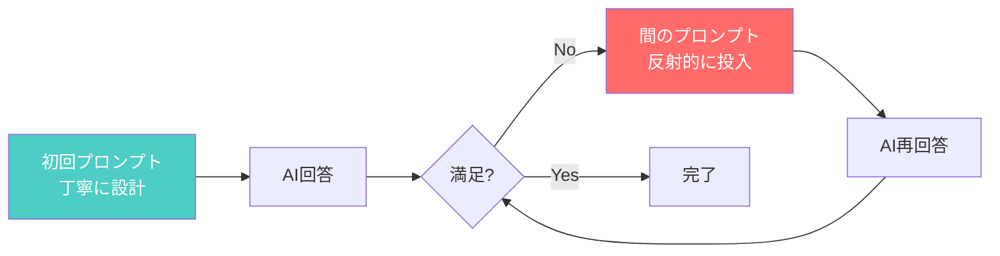

---

## 🏗️ 基本構造

### プロンプトの3層モデル

AIへの指示は、料理のレシピと同じ3層構造です。

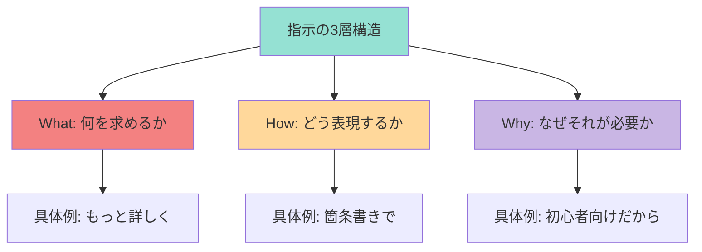

### 日常例で理解する

| 状況 | What | How | Why |
|------|------|-----|-----|
| 料理注文 | ラーメン | 麺硬め | お腹空いてるから |
| AI指示 | 説明追加 | 図解付きで | 視覚的に理解したいから |

---

## ⚡ 主要技術

### 即興プロンプトの5つのパターン

現場で使える「魔法の呪文」を5つ紹介します。

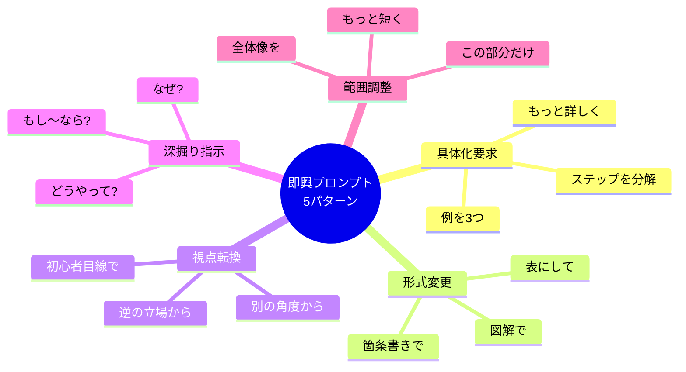

#### パターン1: 具体化要求
**使用タイミング**: 回答が抽象的すぎるとき

| 悪い例 | 良い例 | 効果 |
|--------|--------|------|
| もっと詳しく | この部分を3つの具体例で | 明確な数値指示で回答の方向性が定まる |
| わかりやすく | 小学生でもわかる言葉で | 対象レベルを明示することで言葉選びが変わる |

#### パターン2: 形式変更
**使用タイミング**: 理解しづらい形式で返ってきたとき

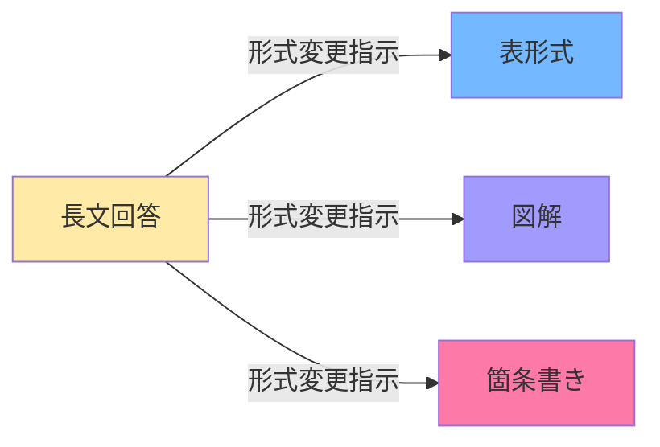

**即興プロンプト例**:
- 「これを比較表にして」
- 「図で説明して」
- 「ステップごとに分けて」

#### パターン3: 視点転換
**使用タイミング**: 説明が難しすぎる/簡単すぎるとき

```
通常視点: 技術的に正確だが難解
↓ 視点転換プロンプト
新視点: 子供に説明するなら?
```

#### パターン4: 深掘り指示
**使用タイミング**: 表面的な回答で満足できないとき

| 深掘りワード | 効果 | 例 |
|-------------|------|-----|
| なぜ? | 理由・背景を引き出す | なぜこの方法が選ばれた? |
| どうやって? | 具体的手順を引き出す | どうやって実装する? |
| もし〜なら? | 応用・例外を引き出す | もし失敗したら? |

#### パターン5: 範囲調整
**使用タイミング**: 情報量が多すぎる/少なすぎるとき

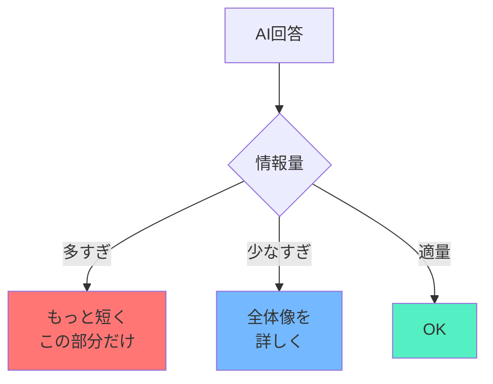

---

## 🎓 トレーニング手法

### レベル別習得システム

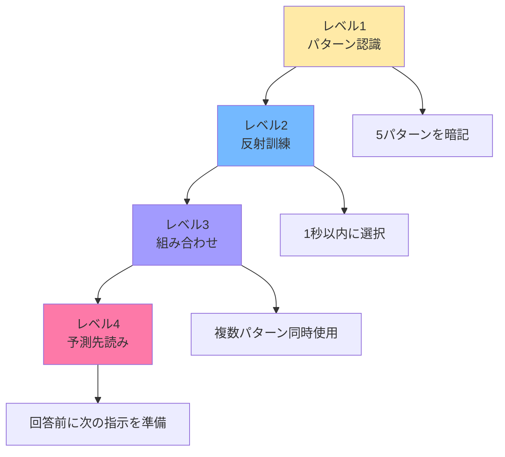

### レベル1: パターン認識訓練（1週間）

**目標**: 5パターンを見ただけで判断できる

**訓練方法**:
1. AI回答を読む
2. 「どのパターンが使えるか?」と自問
3. 実際に試す
4. 結果を比較

**1日のルーティン**:
```
朝: 5パターンを声に出して復唱（3分）
昼: AIと3回対話し、各パターンを1つずつ試す（15分）
夜: 今日使ったパターンを振り返り（5分）
```

### レベル2: 反射訓練（2週間）

**目標**: AI回答を見て1秒以内にプロンプトを投げられる

**訓練ゲーム**: 「プロンプト瞬殺チャレンジ」

1. AIに質問する
2. 回答が表示された瞬間にタイマースタート
3. 1秒以内に追加プロンプトを投入
4. 成功率を記録

**スピードアップのコツ**:
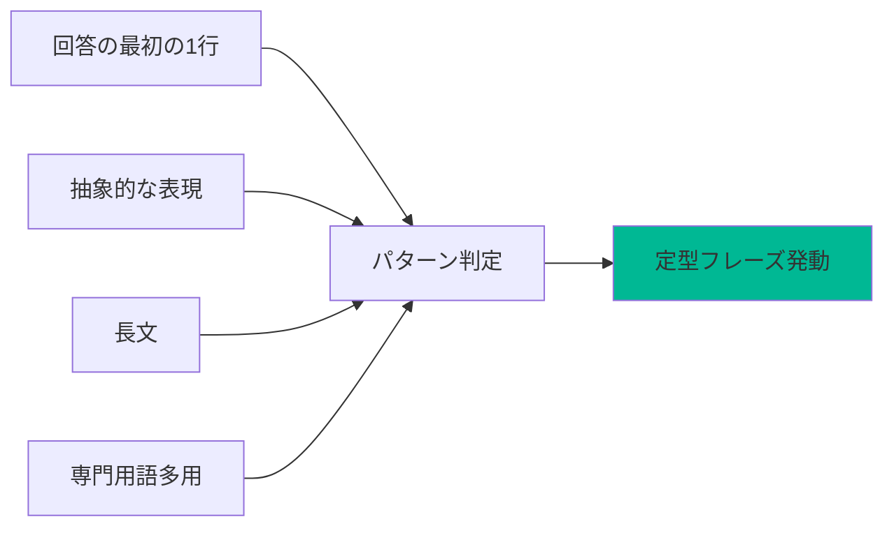

### レベル3: 組み合わせ訓練（2週間）

**目標**: 複数パターンを同時に使いこなす

**訓練例**:
```
単独使用: 「もっと詳しく」
組み合わせ: 「もっと詳しく、表形式で、初心者向けに」
```

**効果測定**:
| 組み合わせ数 | 回答の質 | 習得難易度 |
|-------------|---------|-----------|
| 1パターン | ★★☆☆☆ | ★☆☆☆☆ |
| 2パターン | ★★★★☆ | ★★☆☆☆ |
| 3パターン | ★★★★★ | ★★★★☆ |

### レベル4: 予測先読み訓練（継続）

**目標**: AIが答える前に次の指示を準備する

**訓練方法**:
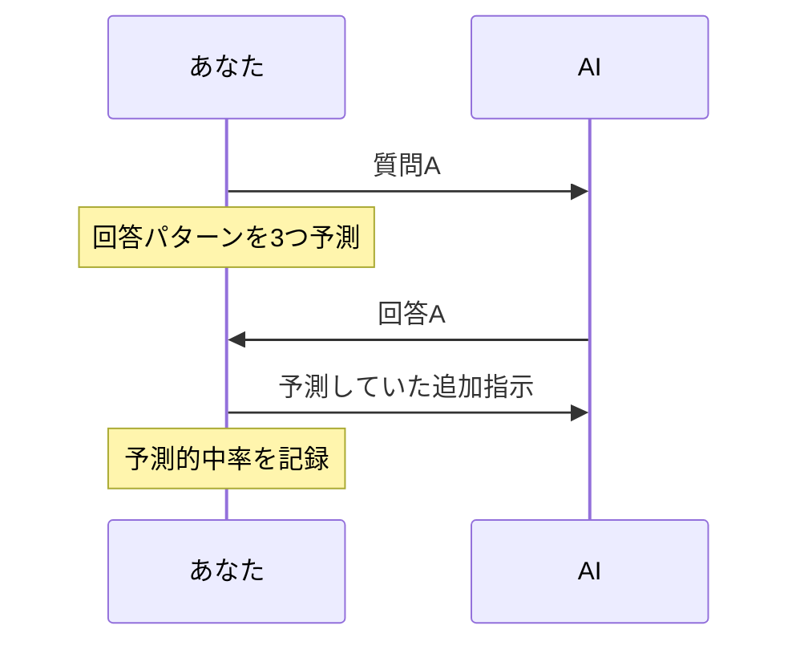

**予測の型**:
1. 「きっと抽象的に答えるだろう → 具体例を要求する準備」
2. 「きっと長文で来るだろう → 要約を要求する準備」
3. 「きっと専門用語を使うだろう → 言い換えを要求する準備」

---

## 💼 実践例

### シーン別即興プロンプト集

#### シーン1: コード説明が難解だったとき

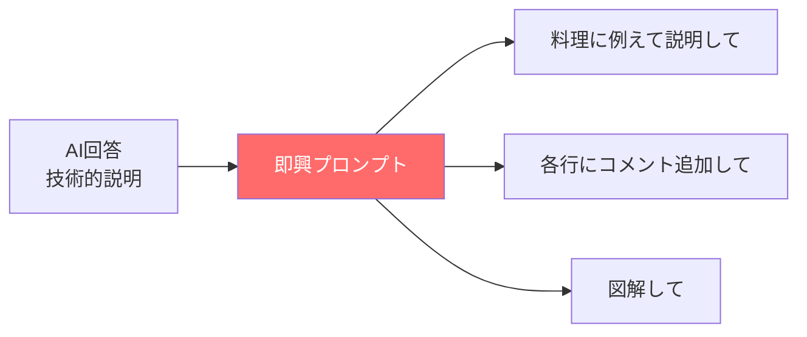

**実例**:
- ❌ 悪い: 「わかりやすく」
- ✅ 良い: 「このコードを料理のレシピに例えて、各ステップを説明して」

#### シーン2: 選択肢が多すぎて決められないとき

**即興プロンプトの流れ**:
```
AI: 10個の方法があります...
↓ 即座に
You: 初心者に最もおすすめの3つに絞って、比較表で
```

#### シーン3: 説明が抽象的すぎるとき

| 状況 | 即興プロンプト | 効果 |
|------|---------------|------|
| 「効率的です」 | 具体的に何秒短縮できる? | 数値で把握できる |
| 「人気があります」 | どのくらいの人が使ってる? | 規模感がつかめる |
| 「簡単です」 | どのレベルの人が使える? | 自分に合うか判断できる |

---

## 📊 評価指標

### 成長の測り方

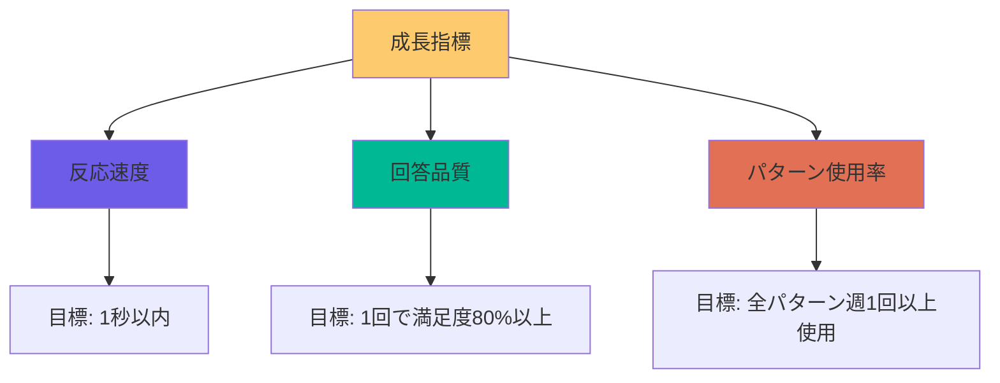

### セルフチェックリスト

**毎週金曜日に実施**:

- [ ] 5パターンを1秒以内に思い出せる
- [ ] 今週、各パターンを最低1回使った
- [ ] 追加プロンプトなしで満足した回答は何%か(目標: 20%以下)
- [ ] 組み合わせプロンプトを使えた回数(目標: 週5回以上)

### 上達の兆候

| レベル | 兆候 |
|--------|------|
| 初心者 | AIの回答をそのまま受け入れてしまう |
| 中級者 | 「何か違う」と感じて追加指示を出せる |
| 上級者 | 回答の最初の1文で次の指示が浮かぶ |
| 達人 | AIが答える前に3つの追加指示を準備している |

---

## 🎯 今日から始める30日プラン

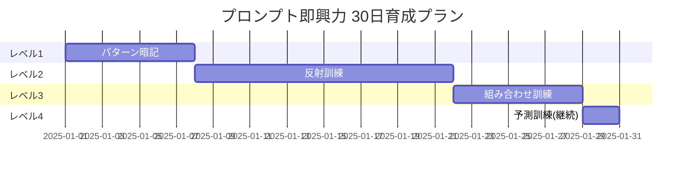

### Day 1-7: パターン暗記週間
- 朝: 5パターンを紙に書く(3分)
- 昼: AIと対話して1パターン使う(10分)
- 夜: 今日の対話を振り返る(5分)

### Day 8-21: 反射訓練期間
- 毎日5回以上AIと対話
- 各回答に1秒以内に追加プロンプト
- 成功率を記録(目標: 70%以上)

### Day 22-28: 組み合わせ習得
- 2パターン組み合わせに挑戦
- 回答の質の変化を観察
- ベストコンビを発見

### Day 29-30: 予測訓練開始
- 質問前に回答パターンを予測
- 的中率を測定
- 継続的な習慣化へ

---

## 🔥 最後に: 遠慮なく指示する技術

### AIと人間の決定的な違い

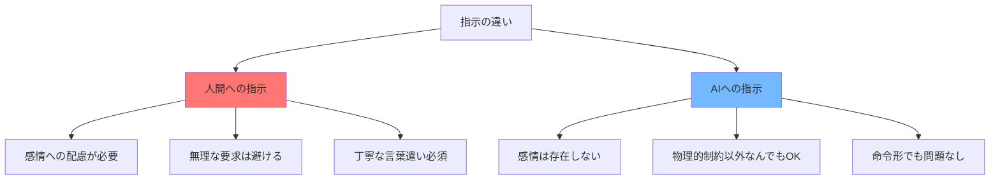

### 遠慮不要の指示例

**人間には言えないが、AIには言える**:

| 指示内容 | 人間 | AI |
|---------|------|-----|
| 全部やり直して | ❌ 失礼 | ✅ OK |
| もっと短く | ❌ 努力を否定 | ✅ OK |
| 10パターン考えて | ❌ 過重労働 | ✅ OK |
| 1秒で答えて | ❌ 不可能 | ✅ OK |

**効果的な「遠慮なし指示」のコツ**:
1. **数値を入れる**: 「3つの例を」「10秒で読める長さで」
2. **比較を求める**: 「AとBの違いを表で」
3. **形式を指定**: 「箇条書きで」「図で」
4. **視点を強制**: 「子供目線で」「専門家として」

---


**あなたの「プロンプト反射神経」を今日から鍛えましょう! 🚀**
