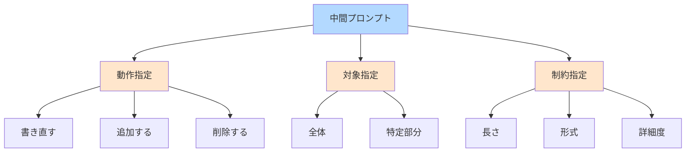
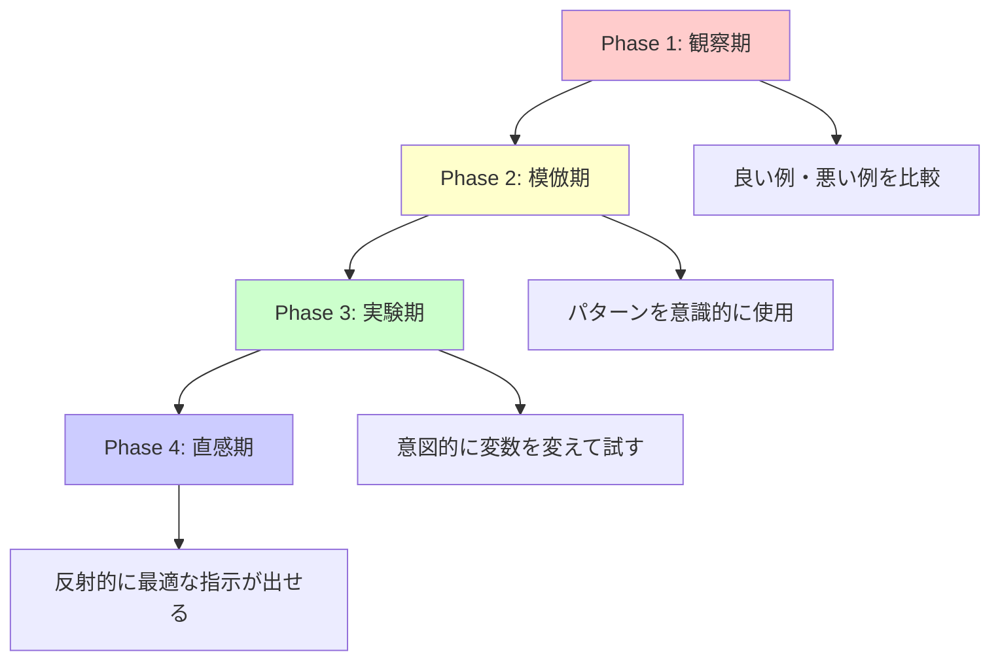
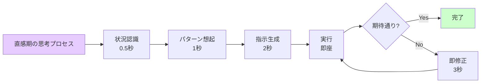
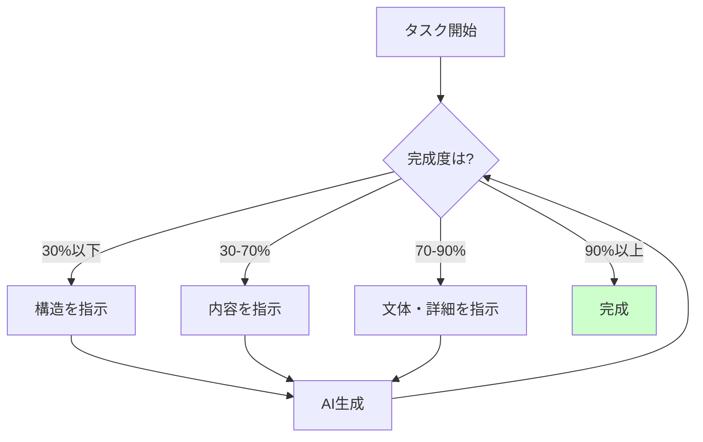
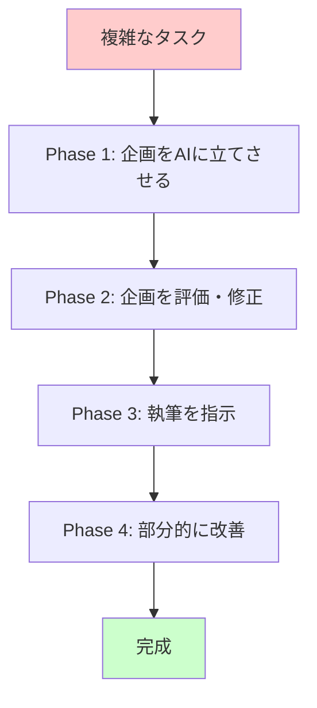
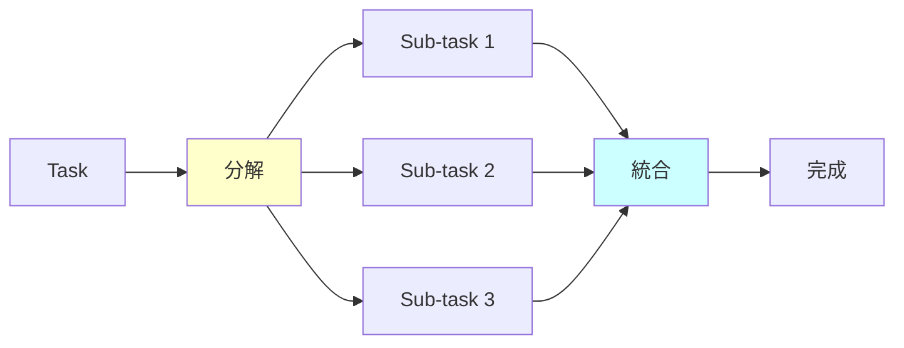

# AIとの対話における中間プロンプトの最適化技術

## 概要

AI対話において、初回プロンプトだけでなく会話途中に挟む「中間プロンプト」の質が、最終的な回答精度を大きく左右する。しかし毎回の指示を精密に設計する時間的余裕はなく、ユーザーは反射的・経験則的に指示を出す必要がある。本文書では、プロンプトエンジニアリングの知識がなくても、実践を通じて効果的な中間指示スキルを習得するトレーニング手法を解説する。

## 1. 中間プロンプトの基礎概念

### 1.1 中間プロンプトとは

**定義**: 会話の流れの中で、AIの前回答に対して次の行動を指示する短い命令文のこと。

初回プロンプトが「設計図」だとすれば、中間プロンプトは「軌道修正」である。AIは文脈を保持しているため、簡潔な指示でも前の内容を踏まえた応答が可能となる。


### 1.2 品質が変動する理由

中間プロンプトの微妙な表現差が結果に影響する要因：

- **曖昧性の解釈**: 「もっと詳しく」vs「具体例を3つ」では指示の明確さが異なる
- **文脈の継承**: 前の会話内容をどこまで踏襲するかの指定が不明瞭
- **期待値の不一致**: ユーザーの意図とAIの解釈にズレが生じる
- **制約の欠如**: 長さ、形式、範囲などの境界が示されていない

### 1.3 AI特有の性質

対人間とは異なるAIの特性：

- **遠慮不要性**: 「全部やり直して」「この部分だけ書き直して」など直接的命令が有効
- **無制限反復**: 同じ要求を何度繰り返しても疲労しない
- **明示性依存**: 暗黙の了解が通じない代わりに、明示すれば確実に従う
- **即時応答性**: 試行錯誤のフィードバックループを高速で回せる

## 2. 効果的な中間プロンプトの構成要素

### 2.1 三要素モデル

質の高い中間プロンプトは以下の要素を含む：

**①動作指定**: 何をするか（書き直す、追加する、削除する、変更する）  
**②対象指定**: どこを（全体、特定セクション、特定の段落）  
**③制約指定**: どのように（長さ、形式、トーン、詳細度）



### 2.2 指示の粒度スペクトラム

指示の具体性レベル：

| 粒度 | 例 | 効果 | 使い分け |
|------|-----|------|----------|
| 粗い | 「もっと詳しく」 | 予測不可能 | 初期探索時 |
| 中間 | 「具体例を追加」 | ある程度制御可能 | 方向性が見えている時 |
| 細かい | 「2つ目の段落に企業での使用例を150字で追加」 | 高精度 | 明確な修正イメージがある時 |

### 2.3 文脈継承の制御

前の内容をどう扱うかの明示：

- **上書き型**: 「〇〇の部分を△△に変更」
- **追加型**: 「〇〇に加えて△△も含めて」
- **置換型**: 「〇〇を削除して△△を書いて」
- **リセット型**: 「前の内容は無視して新しく〇〇を」

## 3. トレーニング方法論

### 3.1 段階的スキル習得モデル

4段階のトレーニングフェーズ：



### 3.2 Phase 1: 観察期（1-2週間）

**目的**: 効果的な指示パターンの認識

**実践方法**:

1. **比較ノートの作成**: 同じ目的で異なる指示を出し、結果を記録
   - 例: 「詳しく」vs「200字で」vs「3つの例を含めて」
   
2. **失敗コレクション**: うまくいかなかった指示を保存
   - 何が曖昧だったか分析
   - どう改善できたか仮説を立てる

3. **成功パターンの抽出**: 期待通りの結果が得られた指示を分類
   - 動作語彙（追加、削除、変更、明確化 etc.）
   - 対象の指定方法（序盤、2つ目の項目、技術的な部分 etc.）

**日課例**:
- 毎日15分、1つのトピックで5つの異なる指示を試す
- 結果の違いをスプレッドシートに記録

### 3.3 Phase 2: 模倣期（2-4週間）

**目的**: 有効パターンの意識的な適用

**実践方法**:

1. **テンプレート使用**: 観察期で見つけたパターンを定式化
   ```
   [動作] + [対象] + [制約]
   「〇〇の部分を△△に変更して、長さは□□で」
   ```

2. **チェックリスト方式**: 指示を出す前に自問
   - [ ] 何をしてほしいか明確か？
   - [ ] どこを対象にするか指定したか？
   - [ ] 長さ・形式は伝えたか？

3. **段階的複雑化**: 単純な指示から始めて徐々に複雑に
   - Week 1: 単一動作（「追加して」のみ）
   - Week 2-3: 動作+対象（「2段落目に追加して」）
   - Week 4: 動作+対象+制約（「2段落目に具体例を100字で追加」）

**練習課題例**:
- 技術記事を3回の中間プロンプトで完成させる
- 各プロンプトでテンプレートを意識的に使用

### 3.4 Phase 3: 実験期（4-8週間）

**目的**: 指示の効果を予測し、変数を操作する能力の獲得

**実践方法**:

1. **変数分離実験**: 1つの要素だけを変えて比較
   - 同じ内容で長さ指定を変える（50字 vs 200字 vs 制約なし）
   - 同じ内容でトーンを変える（技術的 vs 平易 vs カジュアル）

2. **予測→実行→検証サイクル**:
   - 指示を出す前に結果を予測
   - 実際の結果と比較
   - ズレの原因を分析

3. **極端な指示の試行**: 限界を知るための実験
   - 超短い指示（「短く」だけ）
   - 超詳細な指示（すべての要素を細かく指定）
   - 矛盾する指示（「詳しくかつ簡潔に」）

**記録フォーマット**:
```
実験日: 2025-10-18
仮説: 数値指定があると精度が上がる
指示A: 「例を追加」
指示B: 「例を3つ追加」
結果: Bの方が期待に近い。Aは1例のみ追加された
学び: 数量は明示すべき
```

### 3.5 Phase 4: 直感期（8週間以降）

**目的**: 反射的に最適な指示を出せる状態

**到達指標**:
- プロンプトを考える時間が5秒以内
- 1回の指示で期待通りの結果が得られる頻度が70%以上
- 失敗時も即座に修正指示を出せる

**維持方法**:
- 週1回の振り返り（新しい発見を記録）
- 未知のトピックでの定期的な練習
- 複雑なタスクへの挑戦（多段階の指示連鎖）



## 4. 実践的トレーニング課題

### 4.1 基礎ドリル（Phase 1-2向け）

**課題1: 指示分解ドリル**
- ゴール: 「Pythonのリスト内包表記を説明する記事」を完成させる
- 制約: 5回以内の中間プロンプトで
- 各プロンプトで意識すること:
  1. 動作を明確に
  2. 対象を特定
  3. 1つの制約を追加

**課題2: 比較実験**
- 同じ改善を3つの異なる指示で依頼
- 結果の違いを観察
- 例: 「文章を短くして」vs「各段落を100字以内に」vs「重要でない部分を削除」

### 4.2 応用課題（Phase 3-4向け）

**課題3: 段階的精緻化**
- 初回: 概要のみのプロンプト（例: 「機械学習について説明して」）
- 中間プロンプトのみで以下を実現:
  1. 特定のアルゴリズムにフォーカス
  2. コード例を追加
  3. 初心者向けに調整
  4. 図を追加
  5. 実用例を補足

**課題4: エラーリカバリー**
- わざと曖昧な指示を出す
- AIの誤解を検出
- 1回の修正プロンプトで軌道修正

### 4.3 実戦シミュレーション

**シナリオベース訓練**:

1. **時間制約シナリオ**: 3分以内に技術記事を完成させる
2. **専門外トピックシナリオ**: 知識のない分野で質問→深掘り
3. **複雑要求シナリオ**: 複数の条件を満たす文書作成

## 5. 効率化テクニック

### 5.1 メンタルモデルの構築

**AIを道具として捉える視点**:

- **彫刻モデル**: 粗削り→細部調整の順序
- **レイヤーモデル**: 構造→内容→文体の順に指示
- **イテレーションモデル**: 70%の完成度で一旦完成→改善サイクル



### 5.2 ショートカットパターン

頻出する指示の定型化：

| 目的 | 短縮指示 | 効果 |
|------|----------|------|
| 詳細化 | 「深掘り」 | 前の内容を詳しく |
| 簡潔化 | 「圧縮」 | 要点のみに |
| 具体化 | 「例3つ」 | 抽象→具体 |
| 形式変更 | 「箇条書きで」 | 構造変換 |
| 対象変更 | 「初心者向けに」 | トーン調整 |

### 5.3 フィードバックループの高速化

**2ターン原則**: 3回以上修正が必要なら指示が悪い

改善サイクル：
1. 指示を出す
2. 結果が50%以上期待外れなら→指示を根本的に見直す
3. 結果が80%期待通りなら→微調整の指示
4. 2回目で完成しなければ→アプローチを変える

## 6. 高度な戦略

### 6.1 メタ指示の活用

**AIに指示の改善を依頼する**:

- 「この指示は曖昧？ 改善案は？」
- 「〇〇を実現するための最適な指示は？」
- 「前回の指示で足りなかった情報は？」

### 6.2 文脈の明示的管理

**コンテキストコントロール**:

- 「前の3つの回答を踏まえて」（継承）
- 「前の内容は忘れて」（リセット)
- 「最初の回答に戻って」（巻き戻し）

### 6.3 段階的委譲

**複雑タスクの分解**:



## 7. よくある失敗パターンと対策

### 7.1 失敗パターン類型

| パターン | 症状 | 原因 | 対策 |
|----------|------|------|------|
| 曖昧指示症候群 | 期待と違う結果 | 「もっと」「ちゃんと」等の抽象語 | 数値・具体例で指定 |
| 過剰委譲 | 的外れな内容 | 判断をAIに丸投げ | 方向性は人間が決める |
| 文脈喪失 | 話が噛み合わない | 長い会話で前提が崩れる | 定期的に要約させる |
| 微調整地獄 | 永遠に完成しない | 細部から始めている | 大枠→詳細の順守 |

### 7.2 デバッグ戦略

**指示が効かない時のチェックリスト**:

1. [ ] 動作語は明確か？（書く、追加、変更、削除）
2. [ ] 対象は特定されているか？（どの部分を）
3. [ ] 制約は数値化されているか？（長さ、数量）
4. [ ] 前提は共有されているか？（AIが理解しているか確認）
5. [ ] 矛盾する指示を出していないか？

## 8. 測定とフィードバック

### 8.1 進捗指標

**定量的指標**:
- 期待通りの結果を得るまでの平均試行回数
- 中間プロンプト1つあたりの平均文字数
- タスク完了までの平均時間

**定性的指標**:
- 指示を考える時の迷いの少なさ
- 予測と結果の一致度
- 修正指示の的確さ

### 8.2 学習ログの構造

**記録すべき情報**:

```
日付: 2025-10-18
タスク: 技術記事作成
試行回数: 3回
成功した指示: 「2つ目のセクションに具体例を200字で追加」
失敗した指示: 「もっと詳しく」
学び: 対象と長さの明示が重要
次の実験: トーンの指定効果を検証
```

### 8.3 定期評価

**月次レビュー項目**:
- 最も頻繁に使う指示パターン（有効性の確認）
- 新しく発見した有効パターン
- まだ苦手な状況（次月の重点課題）
- 指示の平均長さの変化（簡潔化の進行度）

## 9. 実用例とケーススタディ

### 9.1 ケース1: 技術ドキュメント作成

**状況**: APIドキュメントを30分で作成

**プロンプト連鎖**:
1. 初回: 「〇〇APIの基本的な使い方を説明するドキュメント」
2. 中間1: 「認証の部分を詳しく、コード例を含めて200字で」
3. 中間2: 「エラーハンドリングのセクションを追加」
4. 中間3: 「全体を初心者向けに、専門用語に説明を付けて」

**所要時間**: 18分（指示考案 3分、生成待ち 15分）

### 9.2 ケース2: プレゼン資料の下書き

**状況**: 社内発表用スライドの原稿作成

**プロンプト連鎖**:
1. 初回: 「〇〇プロジェクトの進捗報告、5分間のプレゼン原稿」
2. 中間1: 「各セクションに見出しを付けて」
3. 中間2: 「2つ目のセクション、成果の部分を数値で示して」
4. 中間3: 「最後に次のアクションを3つ追加」

**成果**: 通常1時間→15分に短縮

### 9.3 ケース3: トラブルシューティング

**状況**: コードのエラー解決

**プロンプト連鎖**:
1. 初回: 「このエラーの原因は？」
2. 中間1: 「具体的な修正コードを示して」
3. 中間2: 「なぜこのエラーが起きたか、根本原因を説明」
4. 中間3: 「同じエラーを防ぐチェックリストを作成」

**特徴**: トラブル時は説明→解決→理解→予防の順序

## 10. 発展的トピック

### 10.1 マルチモーダル指示

**テキスト以外の要素を含む指示**:
- 「この画像の内容を説明して、次に類似例を3つ」
- 「このコードを解析して、改善点を箇条書きで」

### 10.2 連鎖的タスク設計

**複数の中間プロンプトを事前設計**:



### 10.3 パーソナライゼーション

**自分専用のパターン辞書構築**:
- 業務でよく使うタスク
- 自分の思考パターンに合う指示スタイル
- 特定分野での専門用語の扱い

## まとめ

### 核心原則

1. **明示性が全て**: 曖昧さは必ず誤解を生む
2. **反復は資産**: 試行錯誤のデータが経験知になる
3. **構造化思考**: 動作・対象・制約の三要素
4. **段階的精緻化**: 大枠→詳細の順序を守る
5. **遠慮不要**: AIには直接的に要求する

### トレーニングの本質

このスキルは「AIに命令する技術」ではなく、**「自分の意図を構造化して言語化する技術」**である。観察期→模倣期→実験期→直感期の段階を経て、プロンプト考案の時間は指数的に短縮される。

### 次のステップ

- **今日**: 1つのタスクで5つの異なる指示を試す
- **今週**: 比較ノートを作成し、パターンを3つ見つける
- **今月**: テンプレートを使って10回のタスクを完了
- **3ヶ月後**: 反射的に最適な指示を出せる状態を目指す

最も重要なのは、**失敗を記録すること**である。うまくいかなかった指示こそが、次の成功の鍵となる。AIは無限に試行錯誤に付き合ってくれる唯一の相手である。この特性を活かし、遠慮なく実験を重ねることで、直感的な対話スキルは必ず身につく。
