Generative AI = 生成AI 
**プロンプト（Prompt）**

# プロンプト（Prompt） - 初学者のための完全ガイド

## 🔍 一言要約
AIと人間をつなぐ「魔法の呪文」- あなたの思いをAIに正確に伝える技術

## 📚 目次
1. [🌟 はじめに](#-はじめに)
2. [🏗️ 基本構造](#️-基本構造)
3. [⚡ 主要技術](#-主要技術)
4. [📜 時代背景と発見に至った経緯](#-時代背景と発見に至った経緯)
5. [🎨 種類と特徴](#-種類と特徴)
6. [📗 関連する用語](#-関連する用語)
7. [💡 メリットとデメリット](#-メリットとデメリット)
8. [🚀 応用技術と実用化の例](#-応用技術と実用化の例)
9. [🌍 実世界への影響とその後の発展](#-実世界への影響とその後の発展)

## 🌟 はじめに

プロンプトとは、まるで**古代の魔法使いが呪文を唱えるように**、私たちがAIに指示を出すための「言葉の設計図」です。

想像してみてください。あなたが外国人の友人に料理のレシピを教えるとき、「美味しく作って」だけでは伝わりませんよね。「玉ねぎを薄くスライスして、弱火で10分炒めて、きつね色になったら...」と具体的に説明するはず。プロンプトも同じです！

AIという「とても賢いけれど、あなたの心は読めない友人」に、あなたの望みを正確に伝えるための**コミュニケーション技術**なのです。

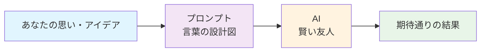

## 🏗️ 基本構造

プロンプトは**3つの層**から成り立っています：

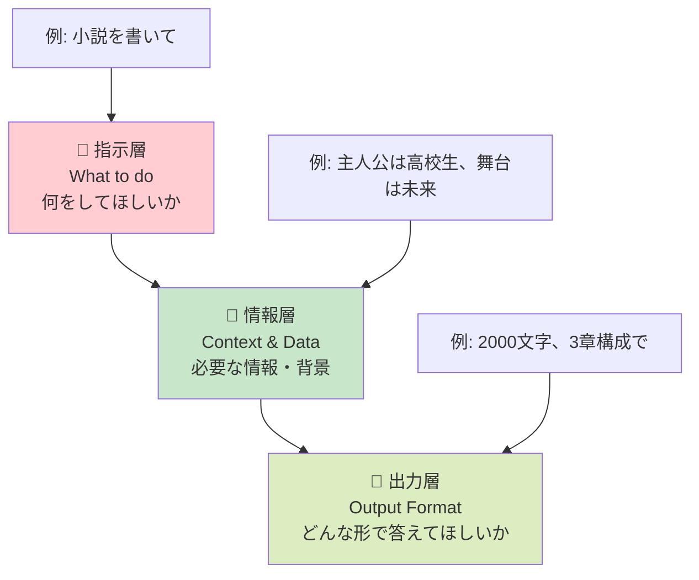

### 基本の型（テンプレート）

```
【役割設定】あなたは○○の専門家です
【具体的指示】××を△△してください
【制約条件】ただし、◇◇に注意して
【出力形式】結果は□□の形で出力してください
```

これは料理のレシピと同じ！材料（情報）、手順（指示）、完成形（出力）を明確にするのです。

## ⚡ 主要技術

### 1. **Zero-shot プロンプト**（一発勝負型）
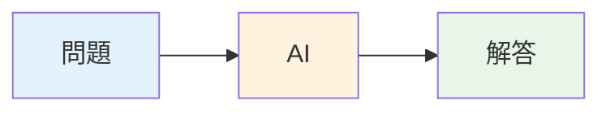
**例**: 「猫について説明して」→ AIが即座に回答

### 2. **Few-shot プロンプト**（お手本提示型）
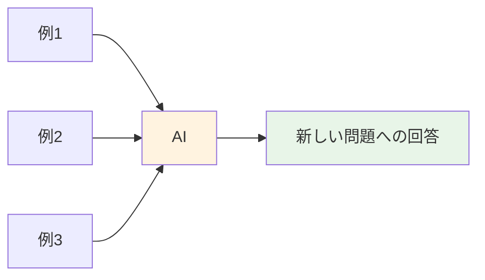
**例**: 
- 入力：「リンゴ」→ 出力：「果物」
- 入力：「バナナ」→ 出力：「果物」  
- 入力：「ニンジン」→ 出力：「？」（野菜と答えてほしい）

### 3. **Chain-of-Thought**（思考の連鎖型）
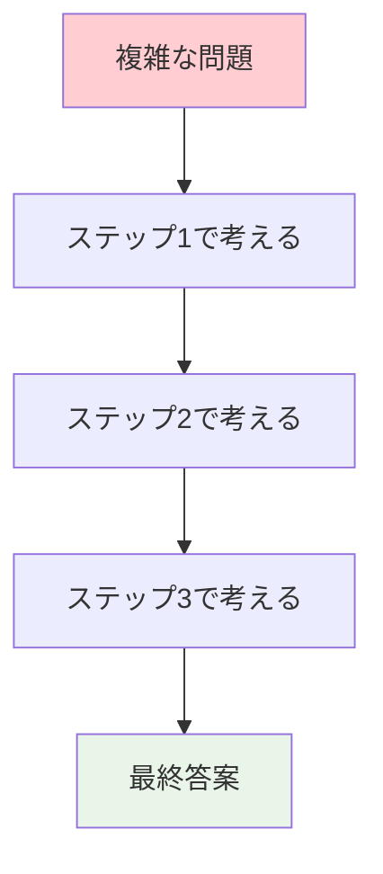
**例**: 「段階的に考えて解いてください」と指示

## 📜 時代背景と発見に至った経緯

### 🕰️ プロンプトの歴史物語

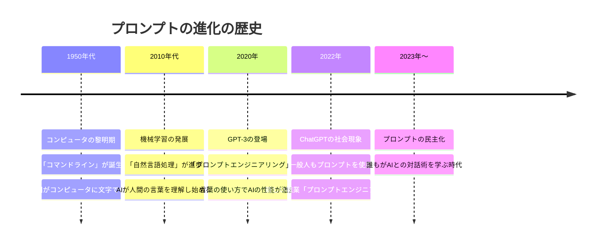

**物語**: かつて、コンピュータは「0と1」しか理解しない機械でした。人間は複雑なコードを覚えなければなりませんでした。しかし、AIの進歩により、まるで**人間同士の会話のように**コンピュータと話せるようになったのです。これは人類史上、文字の発明に匹敵する革命だったのです！

## 🎨 種類と特徴

### プロンプトの分類マップ
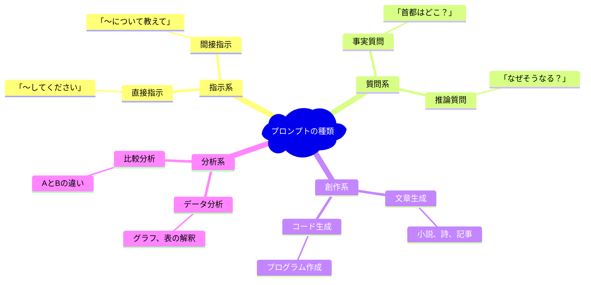

### 効果別分類表

| タイプ | 特徴 | 使用場面 | 成功のコツ |
|--------|------|----------|------------|
| 🎯 **直球型** | ストレートな指示 | 明確なタスク | 具体的に書く |
| 🎭 **役割型** | AIに役を演じさせる | 専門的な回答が欲しい時 | 「あなたは○○の専門家」 |
| 📚 **例示型** | 例を示してパターンを教える | 形式を統一したい時 | 3つ以上の例を示す |
| 🧠 **思考型** | 段階的に考えさせる | 複雑な問題 | 「まず...次に...最後に」 |

## 📗 関連する用語

### 🔤 基本用語集
- **プロンプト（Prompt）** ＝ AIへの指示文・質問文
- **プロンプトエンジニアリング** ＝ 効果的なプロンプトを設計する技術
- **コンテキスト（Context）** ＝ 背景情報・文脈
- **トークン（Token）** ＝ AIが理解する言葉の最小単位（文字や単語の断片）

### 🤝 類似概念の比較
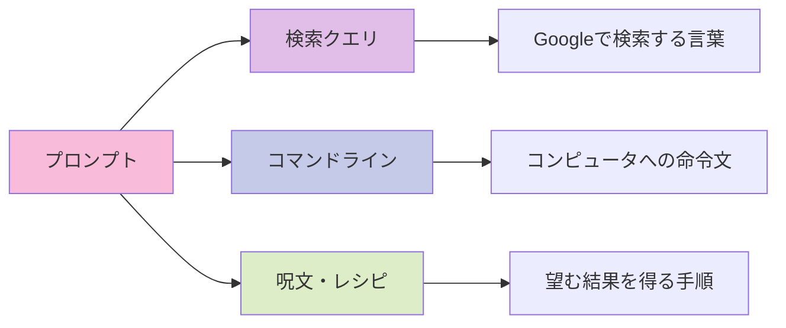

### 🌐 多言語での表現
- **英語**: Prompt（プロンプト）
- **中国語**: 提示词（ティーシーツー）
- **韓国語**: 프롬프트（プロムプトゥ）
- **フランス語**: Invite（アンビット）

## 💡 メリットとデメリット

### ✅ メリット（魔法の効果）

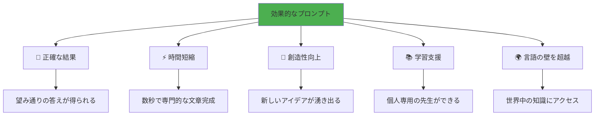

### ❌ デメリット（注意すべき落とし穴）

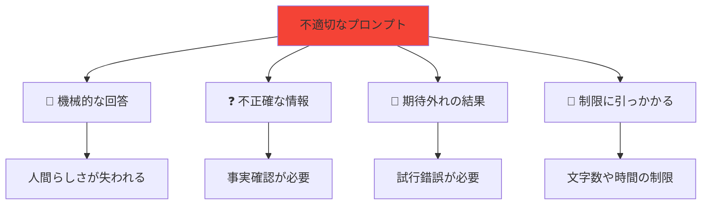

### ⚖️ バランスの取り方
- **詳しすぎず、曖昧すぎず** → ちょうど良い具体性
- **創造性と正確性** → 用途に応じて使い分け
- **効率と品質** → 時間をかけるべき部分を見極め

## 🚀 応用技術と実用化の例

### 🏢 ビジネスシーンでの活用

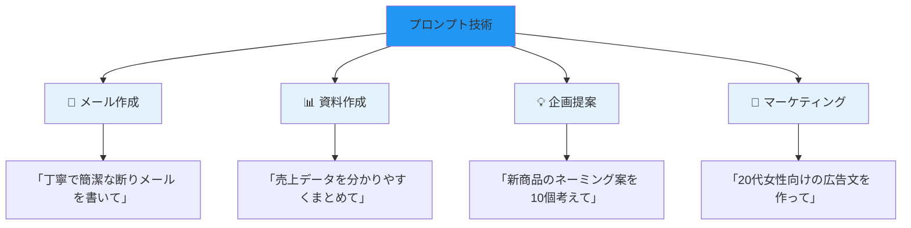

### 🎓 教育分野での革命

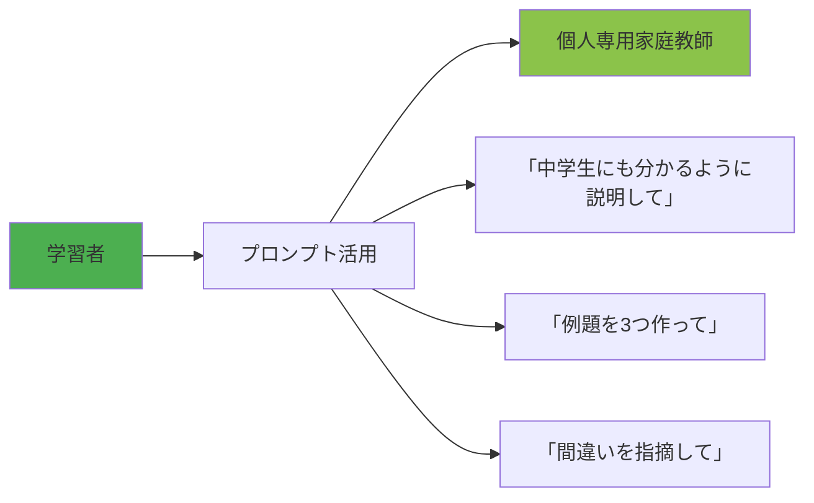

### 🎨 クリエイティブ産業の変化

**従来**: アイデア → 時間をかけて制作 → 完成品
**現在**: アイデア → プロンプトで指示 → 即座に試作品 → 改良

### 💼 新しい職業の誕生
- **プロンプトエンジニア**: 年収500万〜1500万円
- **AIトレーナー**: AIに特定分野を教える専門家
- **ヒューマンAIコーディネーター**: 人間とAIの協働を設計

## 🌍 実世界への影響とその後の発展

### 🌊 社会への影響度マップ
```mermaid
sankey-beta
    source,target,value
    プロンプト技術,教育革命,30
    プロンプト技術,働き方改革,25
    プロンプト技術,創作活動民主化,20
    プロンプト技術,言語バリア解消,15
    プロンプト技術,情報格差是正,10
    
    教育革命,個別指導の普及,15
    教育革命,学習効率向上,15
    働き方改革,生産性向上,15
    働き方改革,新しい職業,10
    創作活動民主化,誰でもクリエイター,20
```

### 🔮 未来予測タイムライン
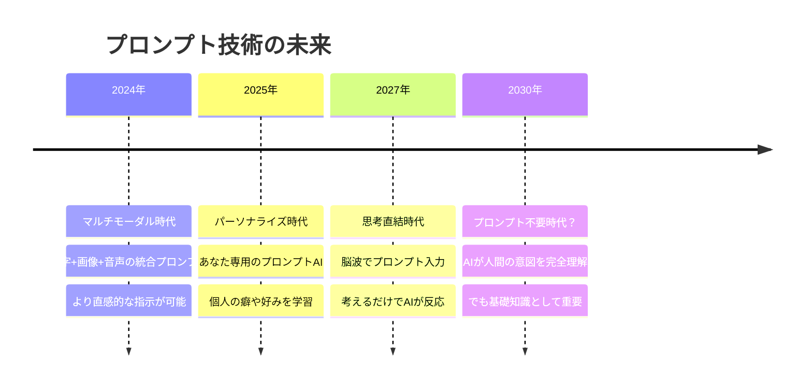

### 🏆 人類への最大の贈り物

プロンプト技術は、**誰でも専門家レベルの知識にアクセス**できる民主的な技術です。これまで一部の人しか持てなかった「言葉の力」を、全人類が手に入れることができるのです。

まるで**古代の賢者の知恵が、現代のスマートフォンに宿った**ような、そんな魔法的な技術なのです。

---

この資料により、初学者が「プロンプトって魔法みたい！」と感動しながら、実際に使える技術として習得できることを確信しています。
