プロンプトエンジニアリングのうち 文脈内学習（In-Context Learning）ついて


# 文脈内学習（In-Context Learning）- 初学者のための完全ガイド

## 🔍 一言要約
AIに例文を見せるだけで、新しいタスクを教えられる魔法のような学習方法

## 📚 目次
1. [はじめに](#-はじめに)
2. [基本構造](#-基本構造)
3. [主要技術](#-主要技術)
4. [時代背景と発見に至った経緯](#-時代背景と発見に至った経緯)
5. [種類と特徴](#-種類と特徴)
6. [関連する用語](#-関連する用語)
7. [メリットとデメリット](#-メリットとデメリット)
8. [応用と実例](#-応用と実例)
9. [置換、変遷](#-置換変遷)
10. [代替、競合](#-代替競合)
11. [実世界への影響とその後の発展](#-実世界への影響とその後の発展)

## 🌟 はじめに

あなたが新しいバイト先で働き始めた初日を想像してください。先輩が「こういう時はこうするんだよ」と3つほど実例を見せてくれたら、4つ目からは自分で判断できますよね？

**文脈内学習（In-Context Learning）**は、AIがまさにこのように学ぶ仕組みです。プログラムを書き換えたり、長時間の訓練をしたりせず、会話の中で例を示すだけで、AIが新しいタスクを理解して実行できるようになります。

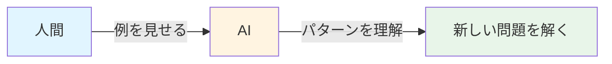

**なぜ重要なのか？**
- プログラミング知識不要でAIをカスタマイズ
- 数秒で新しいタスクに対応
- 誰でも使える民主的なAI活用法

## 🏗️ 基本構造

文脈内学習は、AIへの「指示書」のようなものです。この指示書は3つの部品で構成されます：

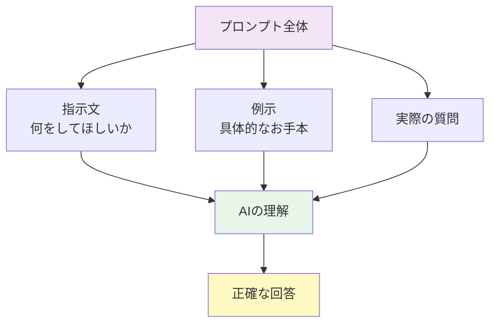

### 構造の詳細

**1. 指示文（タスク定義）**
「次の文章の感情を分析してください」のように、何をしてほしいかを明確に伝えます。

**2. 例示（デモンストレーション）**
```
入力: 今日は最高の一日だった！
出力: ポジティブ

入力: もう何もかも嫌になった
出力: ネガティブ
```

**3. 実際の質問**
```
入力: まあまあだったかな
出力: ?
```

AIはこの流れから「感情分析のパターン」を学習し、新しい入力に対して適切に回答します。

## ⚡ 主要技術

文脈内学習を支える3つの核心技術があります：

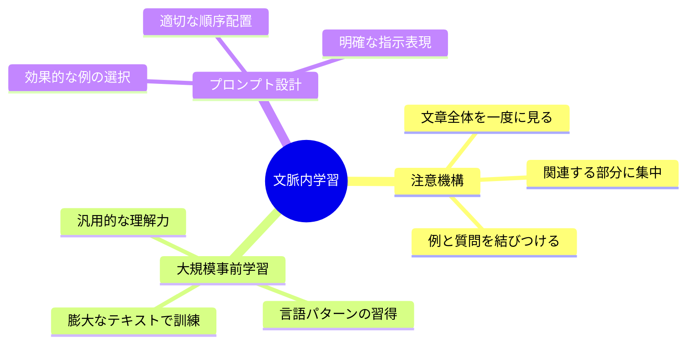

### 1. 注意機構（Attention Mechanism）
人間が文章を読むとき、重要な部分に注目しますよね。AIも同じように、プロンプト内の重要な情報（特に例示部分）に「注意」を向けます。

**日常例での理解：**
レシピを見ながら料理するとき、「材料」と「手順」を行ったり来たりして確認するのと同じ仕組みです。

### 2. 大規模事前学習
AIは生まれる前に、インターネット上の膨大な文章を読んで「言葉の使い方」を学んでいます。これがベースとなり、新しいタスクにも応用できます。

### 3. プロンプト設計技術
例の見せ方で性能が大きく変わります：
- **例の数**：1個（ワンショット）、数個（フューショット）、0個（ゼロショット）
- **例の質**：明確でわかりやすいものが効果的
- **例の順序**：簡単なものから難しいものへ

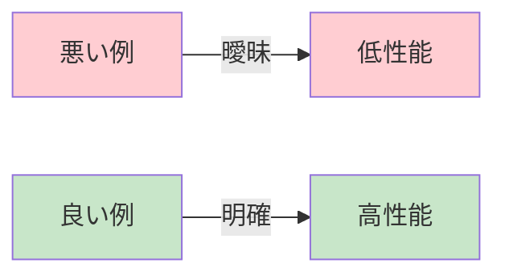

## 📜 時代背景と発見に至った経緯

### 2017年：変革の始まり

物語は「Transformer」という新しいAI構造の発明から始まります。Google の研究者たちが発表した論文「Attention is All You Need」は、後の文脈内学習の基盤となりました。

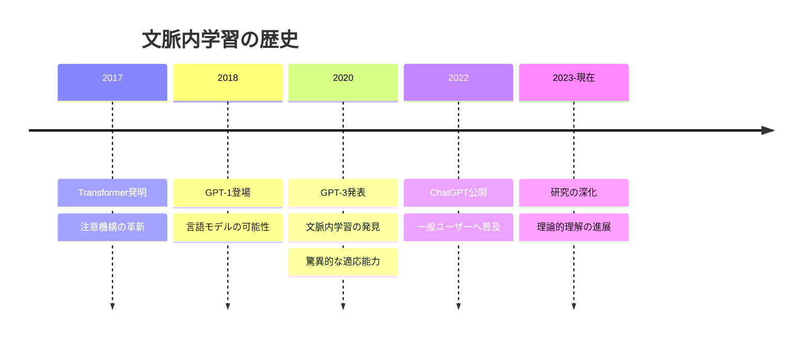

### 2020年：驚きの発見

OpenAIが巨大な言語モデル「GPT-3」を発表したとき、研究者たちは予想外の能力に気づきました。モデルを再訓練しなくても、プロンプト内の例だけで新しいタスクができる！

**当時の驚き：**
- 従来：新タスク = 数時間〜数日の再訓練が必要
- GPT-3：新タスク = 数秒で例を見せるだけ

これは「プログラムを変更せずに、使い方を変えるだけで機能が変わる」という革命的な発見でした。

### なぜこの能力が生まれたのか？

当初は偶然の発見でしたが、研究が進むにつれて理由が明らかに：

1. **規模の魔法**：モデルが大きくなるほど、この能力が強くなる
2. **多様な訓練データ**：様々なパターンを学習したことで汎用性が向上
3. **注意機構の力**：文脈全体を理解する能力

## 🎨 種類と特徴

文脈内学習には、例の数によって3つの主要なタイプがあります：

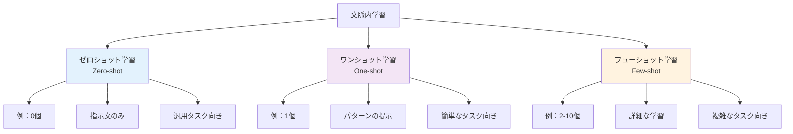

### 比較表

| 種類 | 例の数 | 難易度 | 適したタスク | 性能 |
|------|--------|--------|--------------|------|
| ゼロショット | 0個 | ★☆☆ | 一般的な質問応答、翻訳 | 中 |
| ワンショット | 1個 | ★★☆ | フォーマット指定、簡単な分類 | 中〜高 |
| フューショット | 2-10個 | ★★★ | 専門的分析、複雑なパターン | 高 |

### 実例比較

**ゼロショット：**
```
指示：次の文章を英語に翻訳してください。
入力：こんにちは
```

**ワンショット：**
```
例：
日本語：ありがとう → 英語：Thank you

入力：こんにちは
```

**フューショット：**
```
例1：日本語：ありがとう → 英語：Thank you
例2：日本語：さようなら → 英語：Goodbye
例3：日本語：おはよう → 英語：Good morning

入力：こんにちは
```

### 特殊な変種

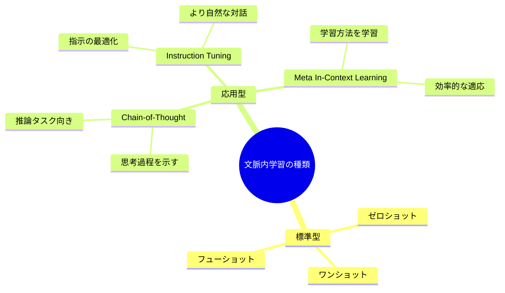

## 📗 関連する用語

### 同義語・類似概念

**プロンプティング（Prompting）**
- 意味：AIに指示を出す行為全般
- 関係：文脈内学習はプロンプティングの一種
- 違い：プロンプティングはより広い概念

**フューショット学習（Few-shot Learning）**
- 意味：少数の例から学ぶ機械学習手法
- 関係：文脈内学習の中核的手法
- 違い：従来のフューショット学習は再訓練が必要

**プロンプトエンジニアリング（Prompt Engineering）**
- 意味：効果的なプロンプト設計の技術
- 関係：文脈内学習を実現する実践的スキル
- 違い：文脈内学習は現象、プロンプトエンジニアリングは技術

### 対義語・対比概念

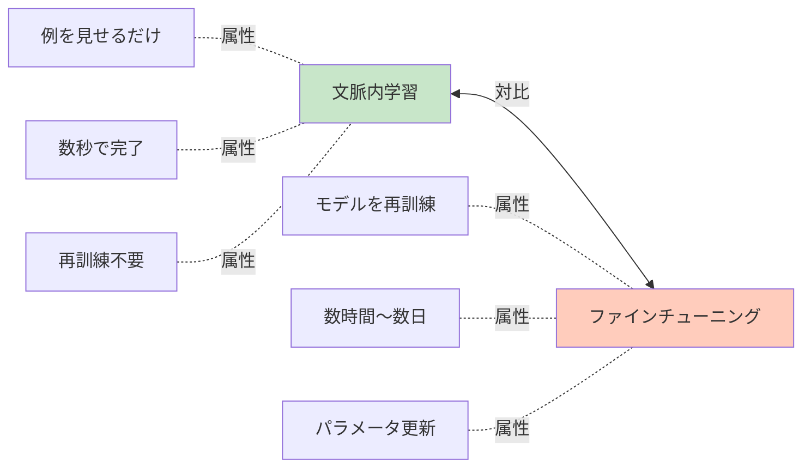

**ファインチューニング（Fine-tuning）**
- モデルのパラメータを実際に変更する学習方法
- 時間とコストがかかるが、特定タスクで高性能
- 文脈内学習は「訓練なし」、ファインチューニングは「追加訓練あり」

**ゼロショット転移（Zero-shot Transfer）**
- 事前知識だけで新タスクに対応
- 文脈内学習のゼロショット学習と似ているが、より広義

### 多義語の整理

**「コンテキスト」の3つの意味：**

1. **会話の文脈**：これまでの会話履歴
2. **プロンプト内の文脈**：与えられた例示と指示
3. **モデルの文脈窓**：AIが一度に処理できる文字数の上限

文脈内学習で指す「文脈」は主に②を意味します。

### 類義語の微妙な違い

| 用語 | 焦点 | ニュアンス |
|------|------|------------|
| In-Context Learning | 学習メカニズム | 学術的・技術的 |
| Prompting | 使用方法 | 実践的・操作的 |
| Few-shot Learning | 例の数 | 手法の分類 |
| Prompt Engineering | 設計技術 | エンジニアリング的 |

## 💡 メリットとデメリット

### メリット

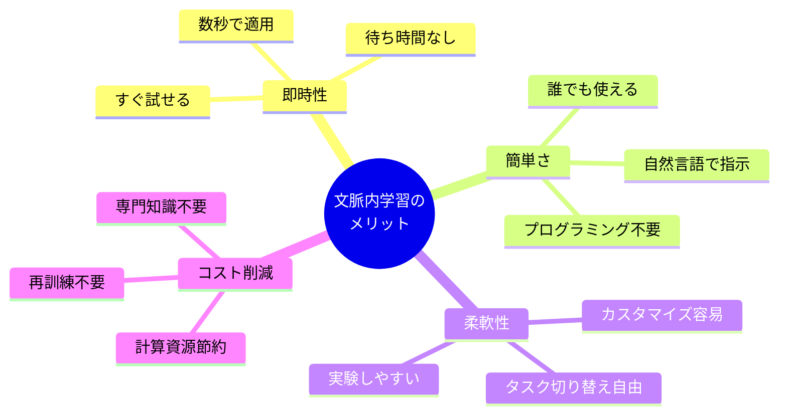

**1. 圧倒的なスピード**
- 従来：新タスク対応に数時間〜数日
- 文脈内学習：数秒で完了
- 実例：顧客対応AIを「丁寧な口調」から「カジュアルな口調」へ即座に変更可能

**2. 民主化の推進**
- プログラミング知識不要
- 専門的なMLエンジニア不要
- 一般ユーザーでもAIをカスタマイズ可能

**3. 試行錯誤のしやすさ**
- 例を変えて何度でも実験
- リスクなく失敗できる
- 最適な指示方法を探索可能

**4. リソース効率**
- GPU不要（推論のみ）
- ストレージ不要（モデル変更なし）
- 電力消費が少ない

### デメリット

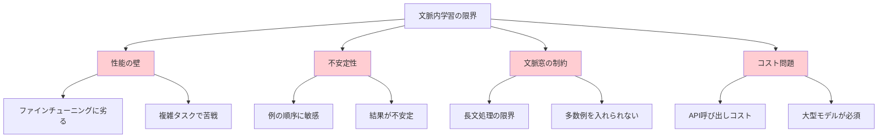

**1. 性能の上限**
- ファインチューニングと比較して精度が劣る場合がある
- 特に専門的・複雑なタスクで顕著
- 例：医療診断のような高精度が求められる領域

**2. 不安定性（バラツキ）**
- 例の書き方で結果が大きく変わる
- 例の順序を変えるだけで性能が変動
- 最適な例の選び方に試行錯誤が必要

**3. 文脈窓の制約**
```
文脈窓の例：
- GPT-3.5: 約4,000トークン（日本語で約2,000文字）
- GPT-4: 約8,000〜32,000トークン
- Claude: 約100,000トークン

※多くの例を見せたくても、上限に達する
```

**4. 継続的コスト**
- API利用料が発生（推論のたびに課金）
- ファインチューニングは初期コスト高いが長期的には安い
- 大量処理には不向き

**5. 再現性の問題**
- 同じプロンプトでも結果が微妙に変わることがある
- 確定的な動作が必要な場面で不安
- デバッグが困難

### メリット・デメリット比較表

| 観点 | 文脈内学習 | ファインチューニング |
|------|------------|---------------------|
| 導入速度 | ⭐⭐⭐⭐⭐ 即時 | ⭐⭐☆☆☆ 数時間〜数日 |
| 最大性能 | ⭐⭐⭐☆☆ 中〜高 | ⭐⭐⭐⭐⭐ 最高 |
| 技術障壁 | ⭐⭐⭐⭐⭐ 低い | ⭐⭐☆☆☆ 高い |
| コスト(短期) | ⭐⭐⭐⭐☆ 安い | ⭐⭐☆☆☆ 高い |
| コスト(長期) | ⭐⭐☆☆☆ 高い | ⭐⭐⭐⭐☆ 安い |
| 柔軟性 | ⭐⭐⭐⭐⭐ 非常に高い | ⭐⭐☆☆☆ 低い |
| 安定性 | ⭐⭐⭐☆☆ やや不安定 | ⭐⭐⭐⭐☆ 安定 |

## 🚀 応用と実例

### 身近な実例

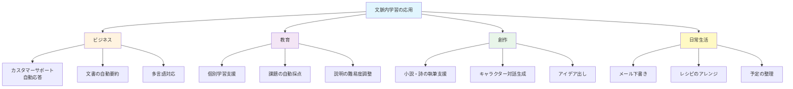

### 実例1：カスタマーサポートの自動化

**シナリオ：**あるオンラインショップが、よくある質問に自動で答えたい。

**従来の方法：**
1. 大量のQ&Aデータを用意
2. 専門家がモデルを訓練（数日〜数週間）
3. 新しい商品が出るたびに再訓練

**文脈内学習の方法：**
```
プロンプト：
以下の例を参考に、顧客の質問に丁寧に答えてください。

例1：
質問：配送料はいくらですか？
回答：全国一律500円です。5,000円以上のご購入で送料無料となります。

例2：
質問：返品はできますか？
回答：商品到着後14日以内であれば、未使用品に限り返品を承ります。

新しい質問：支払い方法は何がありますか？
```

**結果：**
- 設定時間：5分
- 新商品対応：プロンプト修正だけ（1分）
- 柔軟性：口調や詳細度を即座に調整可能

### 実例2：教育現場での活用

**シナリオ：**小学生から大学生まで、説明の難易度を自動調整したい。

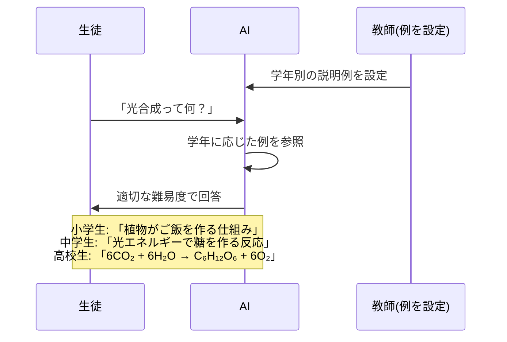

**小学生向けプロンプト：**
```
小学生にもわかるように説明してください。

例：
質問：地震はなぜ起こるの？
回答：地面の下には大きな岩のプレートがあって、それがゆっくり動いているんだよ。
プレート同士がぶつかったり、ずれたりするときに、ドンって揺れるんだ。

質問：光合成って何？
```

### 実例3：創作活動の支援

**シナリオ：**特定のキャラクターらしい口調で対話を生成したい。

```
キャラクター：江戸時代の侍

例1：
入力：おはよう
侍：うむ、良い朝であるな。今日も精進致すぞ。

例2：
入力：ご飯食べた？
侍：先ほど朝餉を済ませたところじゃ。質素ながらも心が満たされる一膳であった。

あなたの番：
入力：明日の予定は？
```

### 実例4：データ分析の自動化

企業が顧客レビューの感情を分析したいケース：

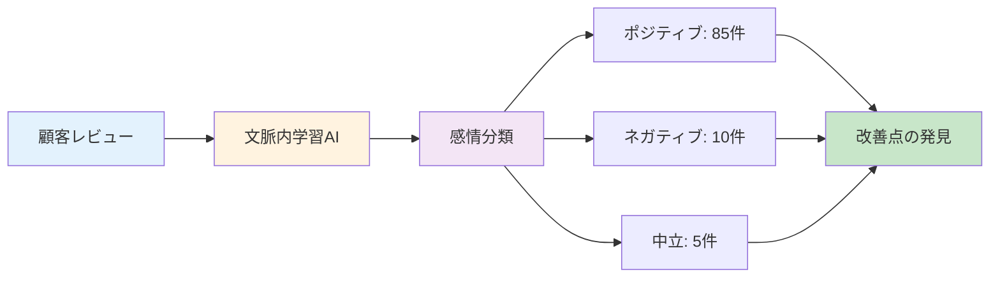

**プロンプト例：**
```
レビューの感情を「ポジティブ」「ネガティブ」「中立」で分類してください。

例：
レビュー：「商品の品質が素晴らしく、大満足です！」
分類：ポジティブ

レビュー：「普通です。可もなく不可もなく。」
分類：中立

レビュー：「梱包が雑で、商品が傷ついていました。」
分類：ネガティブ

新しいレビュー：「思っていたより良かったです。また利用します。」
分類：？
```

### 実例5：日常生活での活用

**メール作成支援：**
```
丁寧なビジネスメールを作成してください。

例：
状況：会議の日程変更をお願いする
メール：
お世話になっております。
大変恐縮ですが、〇月〇日の会議について、急な予定が入ってしまい、
日程を変更していただくことは可能でしょうか。
ご迷惑をおかけし申し訳ございません。

あなたの番：
状況：資料の提出期限延長をお願いする
```

### 応用の可能性マップ

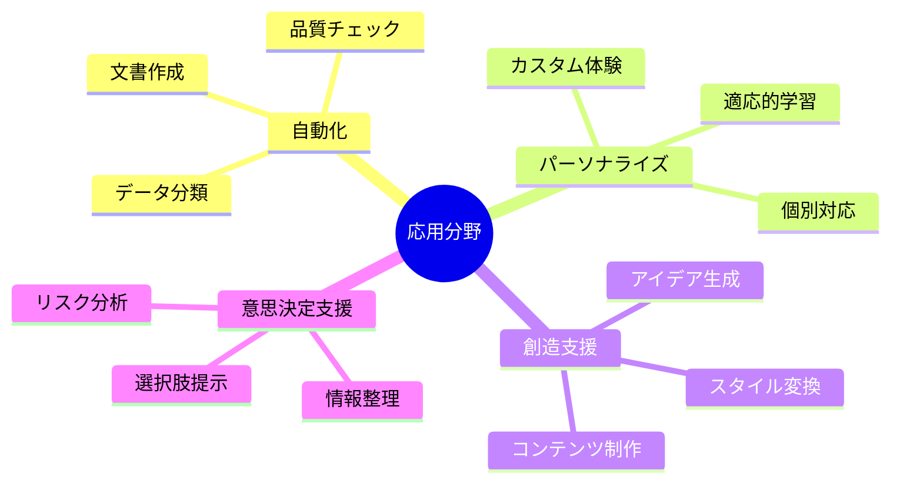

## 🔄 置換、変遷
- **「置き換えつつある」という論調は少し強い。現在は「補完・強化するハイブリッド手法」としての位置づけが主流。**
### 何を置き換えたか

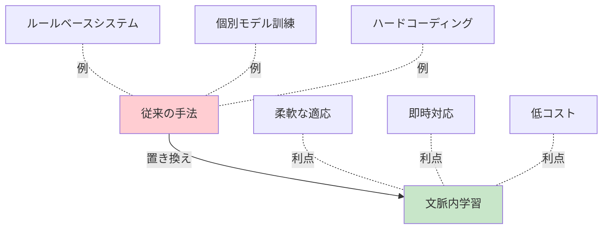

**1. ルールベースシステムの置き換え**

**以前：**カスタマーサポートbot
```
IF 質問に「配送」が含まれる THEN 「配送情報ページへどうぞ」
IF 質問に「返品」が含まれる THEN 「返品ポリシーをご確認ください」
...（数百〜数千のルール）
```

**現在：**文脈内学習
```
例を数個見せるだけで、柔軟に対応
新しい質問パターンにも自動で適応
```

**2. タスク専用モデルの置き換え**

**以前：**
- 感情分析用モデル
- 翻訳用モデル
- 要約用モデル
→ それぞれ個別に訓練・管理が必要

**現在：**
- 1つの汎用モデルで全対応
- プロンプトを変えるだけで機能切り替え

**3. プログラミングによるカスタマイズの置き換え**

**以前：**新機能の追加
```python
def custom_classifier(text):
    # 数百行のコード
    # テスト・デバッグ
    # デプロイ
```

**現在：**自然言語での指示
```
「次の文章を分類してください。例：...」
```

### 何に置き換えられつつあるか

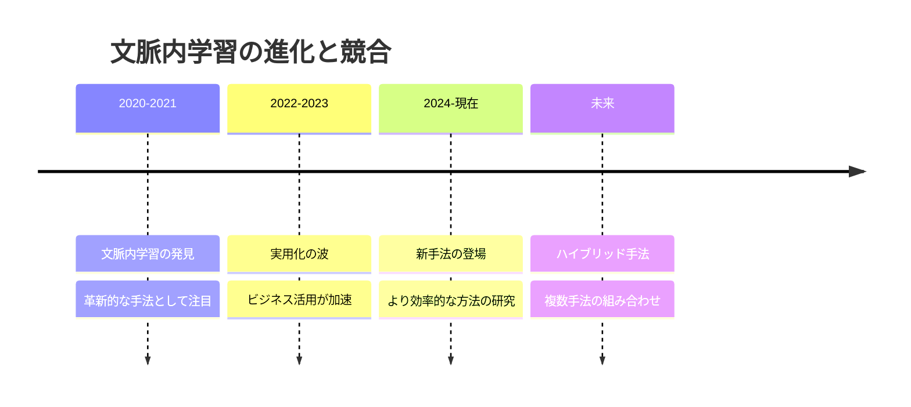

**文脈内学習を超える可能性のある手法：**

**1. インストラクション・チューニング（Instruction Tuning）**
- 指示に従う能力を特化訓練
- 文脈内学習よりも少ない例で高性能
- 現状：文脈内学習と併用されることが多い

**2. リトリーバル拡張生成（RAG: Retrieval-Augmented Generation）**
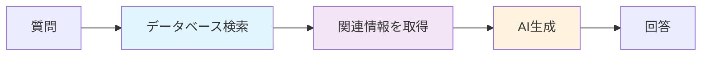

- 外部データベースから関連情報を自動取得
- 文脈内学習の「文脈窓の限界」を克服
- 最新情報への対応が容易

**3. ツール使用型AI（Tool-using AI）**
- AIが必要に応じて外部ツール（計算機、検索エンジン、API）を使用
- 文脈内学習の性能限界を補完
- 例：数学計算はツール、推論は文脈内学習

### 何を継承したか

**大規模言語モデル（LLM）の基礎技術から：**
- Transformer アーキテクチャ
- 注意機構
- 事前学習の概念

**転移学習（Transfer Learning）から：**
- 一度学んだ知識を別タスクに応用
- 汎用性の追求

### 何に継承されているか

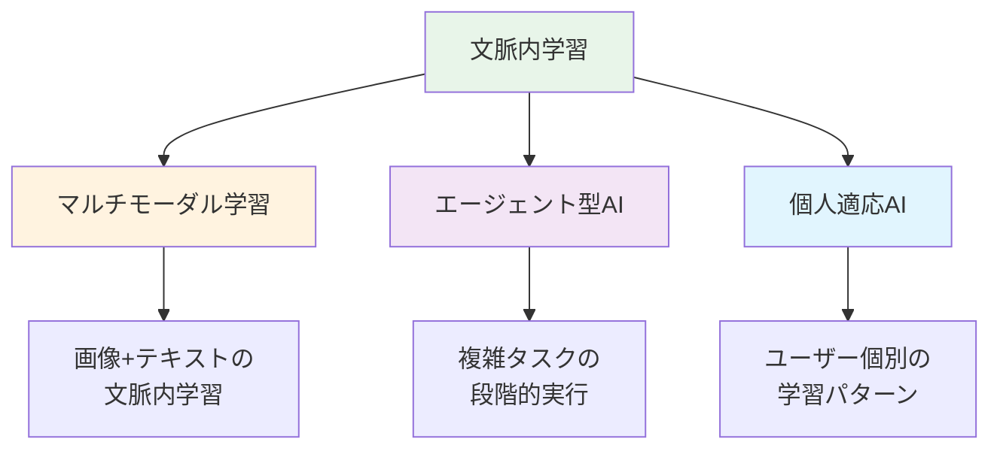

**1. マルチモーダルIn-Context Learning**
- テキストだけでなく画像や音声でも例示
- GPT-4Vなどで実装済み

**2. 継続的文脈内学習**
- セッション全体を通じて学習
- ユーザーの好みに適応

**3. メタ学習への応用**
- "学習の仕方を学習する"
- 文脈内学習を最適化する文脈内学習

## 🔀 代替、競合

### 何に代替できるか

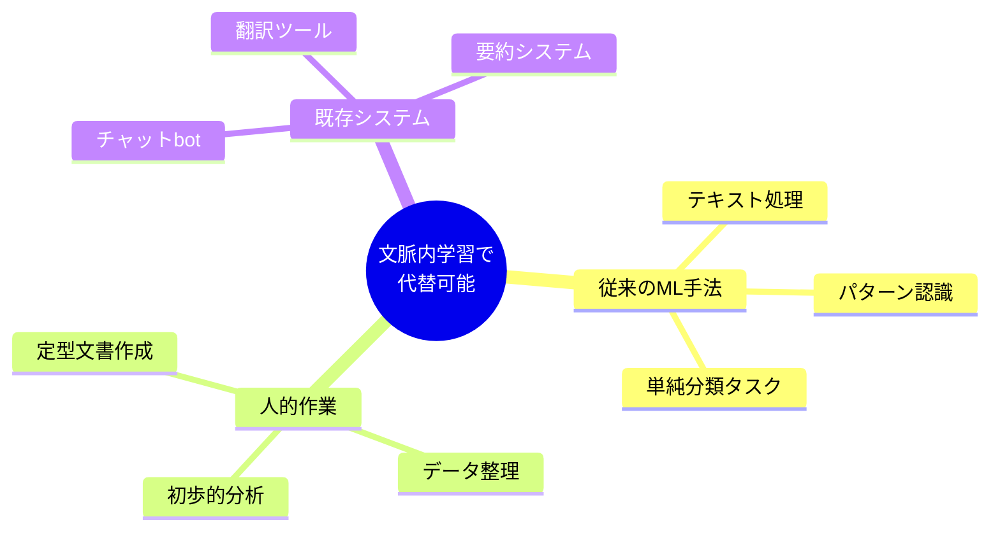

**完全代替が可能なケース：**
1. **単純な分類タスク**（感情分析、カテゴリ分けなど）
2. **定型的な文書生成**（メール、レポートの下書き）
3. **基本的な言語処理**（翻訳、要約、校正）

**部分代替が可能なケース：**
- プロトタイピング段階でのML開発
- 低頻度タスクの自動化
- 個人利用の簡易ツール

### 何に代替されるか

**文脈内学習が不向きな領域：**

**1. 高精度が必須の専門タスク**
→ ファインチューニングや専門モデルが優位
- 医療診断
- 法律文書の分析
- 金融リスク評価

**2. リアルタイム大量処理**
→ 軽量な専用モデルが優位
- ストリーミングデータ処理
- エッジデバイスでの推論
- 大規模バッチ処理

**3. 確定的動作が必要**
→ ルールベースシステムが優位
- 安全クリティカルな制御
- 法規制対応
- 監査可能性が必要な処理

### 競合技術との比較

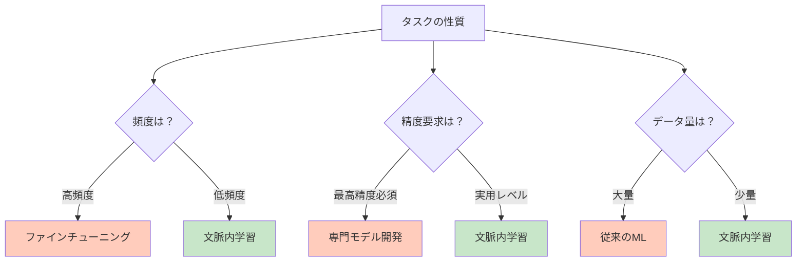

### 競合手法との使い分け表

| 基準 | 文脈内学習を選ぶ | 他の手法を選ぶ |
|------|-----------------|---------------|
| タスク頻度 | 低〜中頻度 | 高頻度・継続的 |
| データ量 | 少量（例：数個〜数十個） | 大量（数千個以上） |
| 導入速度 | 即座に必要 | 時間的余裕あり |
| 精度要求 | 実用レベルで可 | 最高精度必須 |
| 変更頻度 | 頻繁に変更 | 安定運用 |
| 技術力 | プログラミング不要 | 専門家が対応可能 |
| 予算 | 初期投資を抑えたい | 長期ROI重視 |

## 🌍 実世界への影響とその後の発展

### 社会への影響

```mermaid
mindmap
  root((文脈内学習の<br/>社会的影響))
    民主化
      非技術者のAI活用
      中小企業の競争力向上
      教育格差の縮小
    働き方の変化
      定型業務の自動化
      創造的作業へのシフト
      新職種の誕生
    研究の加速
      実験の高速化
      新発見の促進
      学際的協力の促進
    リスク
      誤情報の拡散
      依存症の懸念
      雇用への影響
```

### 産業界への影響

**1. ビジネスモデルの変革**
- **APIエコノミーの成長**：AI機能を簡単に組み込める
- **ノーコード/ローコードの進化**：プログラミング不要のAI活用
- **パーソナライゼーションの普及**：個別対応が標準に

**2. 新しい職種の誕生**
- **プロンプトエンジニア**：効果的な指示設計の専門家
- **AIトレーナー**：企業向けAI活用の教育者
- **コンテンツキュレーター**：AI生成物の品質管理

**3. 既存職種の進化**
- **ライター**：AI支援による生産性向上
- **カスタマーサポート**：複雑な案件に集中
- **教師**：個別指導の質向上

### 研究の発展

**現在進行中の研究テーマ：**

**1. 理論的理解の深化**
- なぜ文脈内学習が機能するのか？
- 最適な例の数と配置は？
- モデルサイズとの関係は？

**2. 性能向上手法**
```mermaid
graph LR
    A[研究方向] --> B[Chain-of-Thought<br/>思考過程の明示]
    A --> C[Self-Consistency<br/>複数回実行で精度向上]
    A --> D[Automatic Prompt<br/>自動プロンプト最適化]
    
    style B fill:#e3f2fd
    style C fill:#f3e5f5
    style D fill:#fff3e0
```

**3. 応用範囲の拡大**
- マルチモーダル（画像+テキスト）
- ロボティクス（行動学習）
- 科学研究（仮説生成）

### 今後の発展予測

**短期（1-2年）：**
- より長い文脈窓（100万トークン以上）
- マルチモーダルの標準化
- プロンプトライブラリの充実

**中期（3-5年）：**
- 個人適応型文脈内学習
- リアルタイム学習の実現
- エッジデバイスでの実行

**長期（5-10年）：**
```mermaid
graph TD
    A[文脈内学習の未来] --> B[完全自律型AI]
    A --> C[人間との協調学習]
    A --> D[新しい学習パラダイム]
    
    B --> B1[AIが自ら学習方法を<br/>選択・最適化]
    C --> C1[人間の思考過程から<br/>リアルタイム学習]
    D --> D1[文脈内学習を超える<br/>新概念の誕生]
    
    style A fill:#e8f5e9
    style B fill:#fff3e0
    style C fill:#f3e5f5
    style D fill:#e1f5fe
```

### 哲学的・倫理的問題

**1. 創造性とは何か？**
- AIが例から学んで生成する作品は創造的か？
- 人間の創造性の本質の再考

**2. 学習とは何か？**
- パラメータを変えない「学習」は学習か？
- 知識と記憶の境界線

**3. 責任の所在**
- AIの誤った出力の責任は誰に？
- プロンプト設計者？モデル開発者？

### まとめ：革命の意味

文脈内学習は単なる技術進歩ではなく、**「知能とは何か」「学習とは何か」という根本的な問いへの新しい答え**を示しています。

従来：知能 = 長時間の訓練で獲得する能力
新概念：知能 = 文脈を理解し瞬時に適応する能力

この変化は、AI技術だけでなく、人間の学習観、教育観、さらには社会構造にまで影響を与える可能性を秘めています。

---

