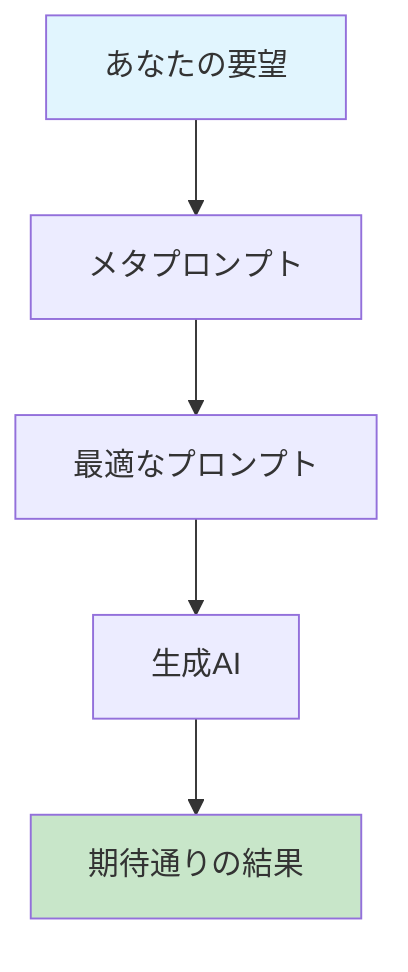
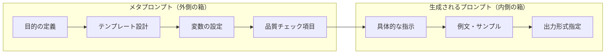
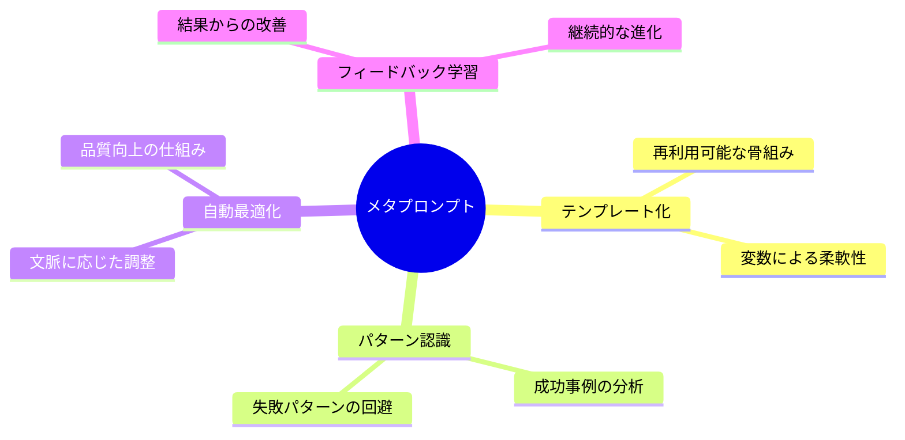
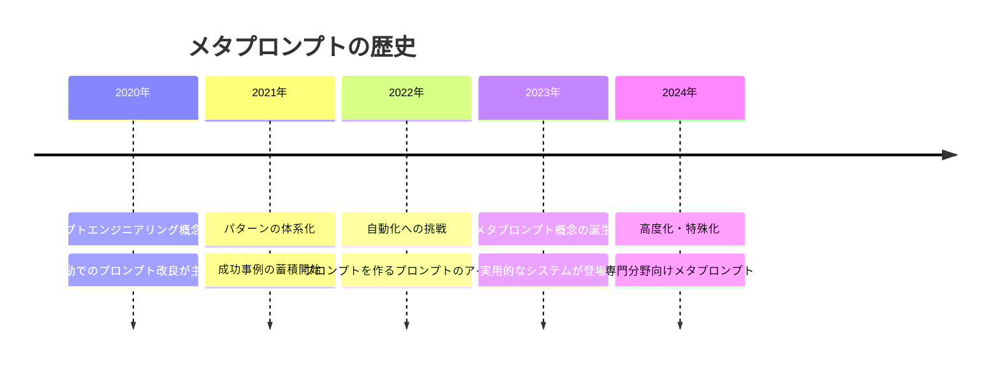
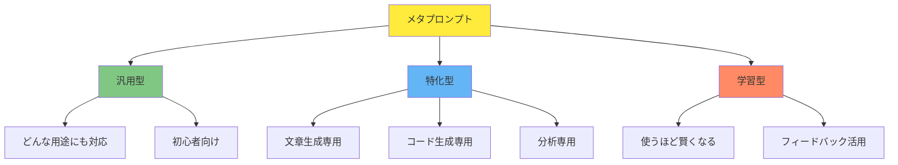
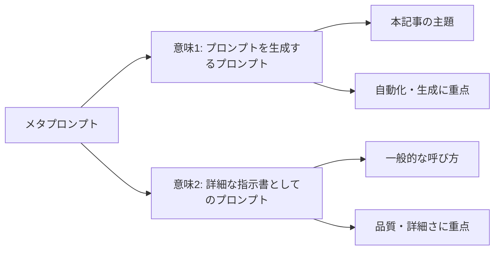
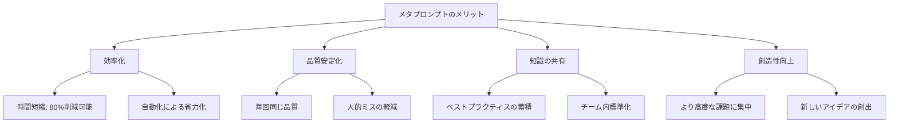
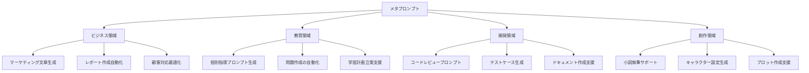
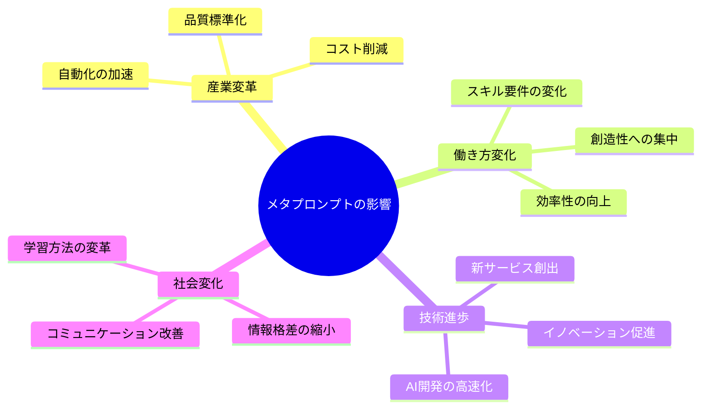

生成AIにおいて、プロンプトエンジニアリングのうち、メタプロンプト（Meta Prompt）（プロンプトを生成するプロンプト）について
 - メタプロンプトは「生成AIに対する詳細な指示書としてのプロンプト」としても語られることがありますが、ここでは「プロンプトを生成するプロンプト」について語ります。

# メタプロンプト - 初学者のための完全ガイド

## 🔍 一言要約
プロンプトを自動で作ってくれる「魔法の指示書」

## 📚 目次
1. [🌟 はじめに](#はじめに)
2. [🏗️ 基本構造](#基本構造)
3. [⚡ 主要技術](#主要技術)
4. [📜 時代背景と発見に至った経緯](#時代背景と発見に至った経緯)
5. [🎨 種類と特徴](#種類と特徴)
6. [📗 関連する用語](#関連する用語)
7. [💡 メリットとデメリット](#メリットとデメリット)
8. [🚀 応用技術と実用化の例](#応用技術と実用化の例)
9. [🌍 実世界への影響とその後の発展](#実世界への影響とその後の発展)

## 🌟 はじめに

想像してください。あなたが料理のレシピを考えるのが苦手だとします。でも、「どんな料理のレシピでも自動で考えてくれるレシピ作成マシン」があったらどうでしょう？

**メタプロンプト**とは、まさにそんな存在です。生成AIに「こういう目的のプロンプトを作って」と頼むと、その目的にピッタリのプロンプトを自動で生成してくれる「プロンプト製造機」なのです。

従来は「良いプロンプトを書く」ために試行錯誤が必要でしたが、メタプロンプトがあれば「良いプロンプトを作るプロンプト」を一度作れば、あとは自動化できるのです。

## 🏗️ 基本構造

メタプロンプトは「入れ子構造」になっています。まるで**ロシアの入れ子人形マトリョーシカ**のように、プロンプトの中にプロンプトが入っているイメージです。

### 基本的な仕組み
1. **外側（メタプロンプト）**：「こんなプロンプトを作って」という指示
2. **内側（生成プロンプト）**：実際にAIが実行する具体的な指示

これは「説明書の説明書」のような概念です。

## ⚡ 主要技術

メタプロンプトを構成する主要な技術要素を、料理に例えて説明します。

### 1. **テンプレート化技術**
レシピの「基本の型」のようなもの。「○○を作るときは、この手順で」という再利用可能な枠組みを作ります。

### 2. **変数システム**
レシピで「お好みの野菜を追加」と書くように、状況に応じて変更できる部分を設計します。

### 3. **品質保証機能**
作られたプロンプトが「ちゃんと動くか」を自動でチェックする仕組みです。

### 4. **学習機能**
過去の成功・失敗例から学んで、より良いプロンプトを作れるように進化します。

## 📜 時代背景と発見に至った経緯

### 第1章：プロンプトエンジニアリングの誕生（2020年頃）

**物語の始まり**は、生成AIが普及し始めた頃でした。人々はこんな問題に直面していました：

> 「AIに同じことを頼んでも、言い方によって全然違う結果が出る...」

### 第2章：職人の技の発見
優秀なプロンプトエンジニアたちは、まるで**寿司職人**のように、経験と勘で素晴らしいプロンプトを作っていました。しかし、これには問題がありました：

- 属人的なスキルに依存
- 再現性が低い
- 学習に時間がかかる

### 第3章：工場化への転換点
ある日、研究者たちは気づきました：

> 「職人の技を『型』として残せれば、誰でも同じクオリティが出せるのでは？」

この発想から**メタプロンプト**が誕生したのです。

## 🎨 種類と特徴

メタプロンプトには、目的に応じてさまざまな「味」があります。まるでアイスクリームのフレーバーのように！

### 1. 汎用型メタプロンプト
**特徴**: 何でも屋さん
**メリット**: 1つ覚えれば色々使える
**デメリット**: 専門性では劣る場合がある

### 2. 特化型メタプロンプト
**特徴**: 専門店
**メリット**: その分野では最高品質
**デメリット**: 他の用途には使えない

### 3. 学習型メタプロンプト
**特徴**: 成長する
**メリット**: 使うほど性能向上
**デメリット**: 最初は普通の性能

## 📗 関連する用語

### 同義語・類似概念
- **プロンプトテンプレート**: メタプロンプトの「型」部分
- **プロンプトジェネレーター**: メタプロンプトの「実行機能」
- **システムプロンプト**: 全体の動作を制御する上位プロンプト

### 対義語
- **固定プロンプト**: 変更できない決まった指示
- **アドホックプロンプト**: その場限りの一回性プロンプト

### 多義語の整理
**「メタプロンプト」の2つの意味**:

### 類義語の比較
| 用語 | 重点 | 使用場面 |
|------|------|----------|
| メタプロンプト | 生成・自動化 | プロンプト作成の効率化 |
| システムプロンプト | 制御・管理 | AI全体の動作設定 |
| プロンプトテンプレート | 再利用性 | 同種タスクの標準化 |

## 💡 メリットとデメリット

### ✅ メリット

**1. 時間効率の劇的向上**
- 手動作成: 30分 → メタプロンプト使用: 5分
- まるで「電卓」の発明のような効果

**2. 品質の安定化**
- 人の気分や疲労に左右されない
- 常に「ベストな状態」のプロンプトを生成

**3. 知識の民主化**
- 専門家の知見を誰でも活用可能
- 「秘伝のタレ」を共有する効果

### ❌ デメリット

**1. 初期コストの高さ**
- 良いメタプロンプトを作るには時間と経験が必要
- 最初の投資は従来方式より大きい

**2. 柔軟性の制約**
- テンプレートに縛られがち
- 完全にユニークな要求には対応しづらい

**3. ブラックボックス化のリスク**
- なぜそのプロンプトが生成されたか分からない場合
- デバッグや改良が困難になることも

## 🚀 応用技術と実用化の例

メタプロンプトは現在、様々な分野で「魔法の道具」として活用されています。

### 実用例1: カスタマーサポート革命
**従来**: サポート担当者が個別に対応文を考案
**メタプロンプト活用**: 顧客の問題を入力するだけで最適な回答文を自動生成

### 実用例2: 教育現場での個別対応
**従来**: 先生が生徒一人ひとりに合わせて説明を考案
**メタプロンプト活用**: 生徒の理解度に応じた説明プロンプトを自動生成

### 実用例3: コンテンツマーケティング
**従来**: マーケターが商品ごとに訴求文を手作り
**メタプロンプト活用**: 商品特徴を入力するだけでターゲット別訴求文を生成

## 🌍 実世界への影響とその後の発展

### 現在の影響マップ

### 🔮 未来予測：2025年以降の展開

**第1段階（2025-2026）：メタプロンプト2.0時代**
- 自己進化型メタプロンプトの登場
- 業界特化型の高度化
- リアルタイム最適化技術

**第2段階（2027-2029）：統合プラットフォーム時代**
- メタプロンプトのマーケットプレイス
- AI同士がプロンプトを売買
- 品質評価システムの確立

**第3段階（2030年以降）：自律型時代**
- メタプロンプトが自分でメタプロンプトを作成
- 人間の関与なしでの完全自動化
- 新しい「AI言語学」の誕生

### 社会への長期的影響

**ポジティブな変化**:
- **知識の民主化**: 専門知識へのアクセス障壁が消失
- **創造性の解放**: ルーチンワークから解放され、よりクリエイティブな作業に集中
- **教育革命**: 個人に最適化された学習体験の実現

**注意すべき課題**:
- **依存性リスク**: 人間の基本的な思考スキルの退化
- **同質化の危険**: 画一的な回答パターンの蔓延
- **雇用への影響**: プロンプトエンジニア職の自動化

---

## 🎯 まとめ：あなたの次のステップ

メタプロンプトは単なる技術ではありません。それは**人間とAIの協働方式を根本から変える革命**です。

今日学んだことを活かして、あなたも：
1. 簡単なメタプロンプトを作ってみる
2. 日常業務での活用場面を探してみる  
3. 継続的な改善サイクルを回してみる

**次の学習におすすめ**:
- [プロンプトエンジニアリング基礎](/docs/prompt-engineering-basics.md)
- [テンプレート設計入門](/docs/template-design.md)
- [実践メタプロンプト集](/docs/meta-prompt-examples.md)

未来は、メタプロンプトを使いこなせる人のものです。今こそ、その第一歩を踏み出しましょう！

---
