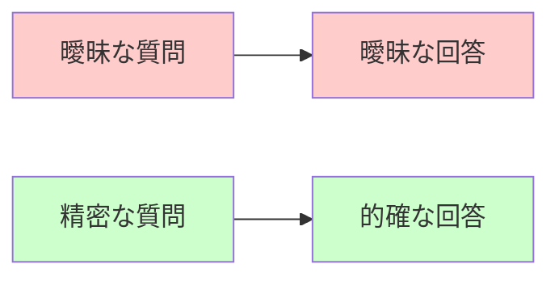
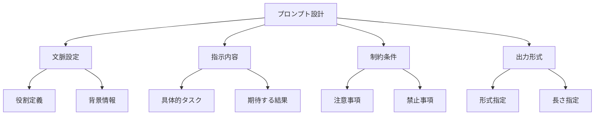
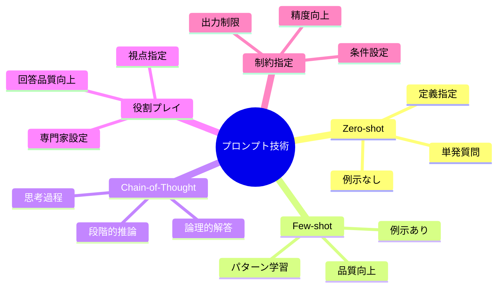
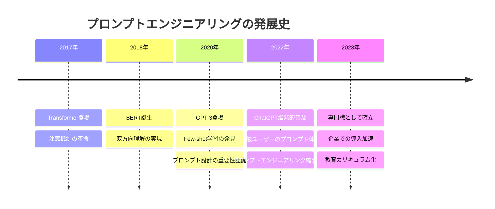
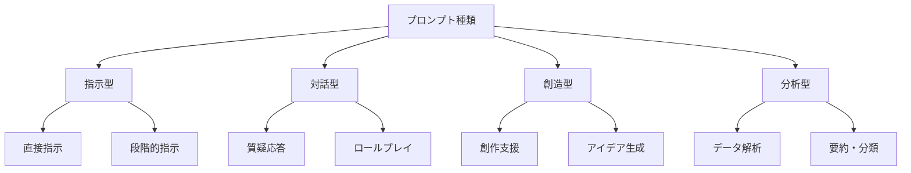
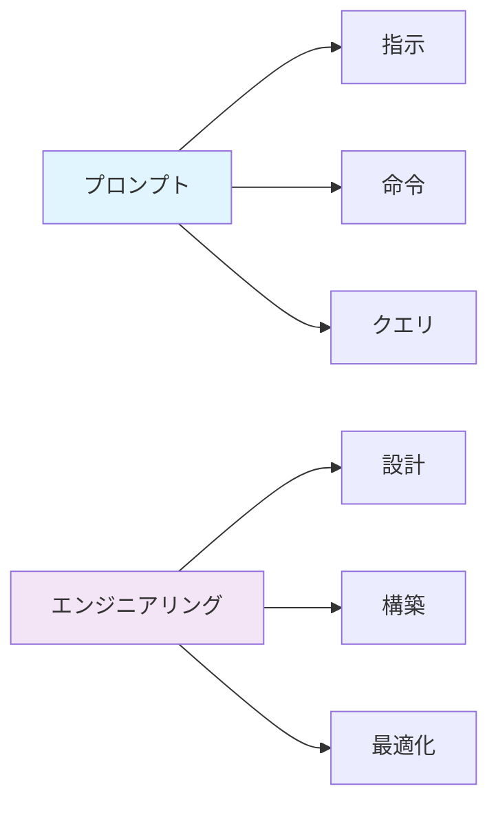
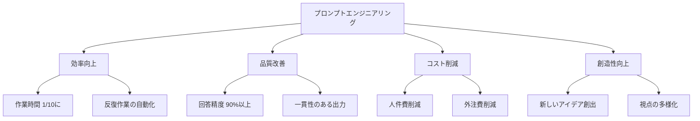
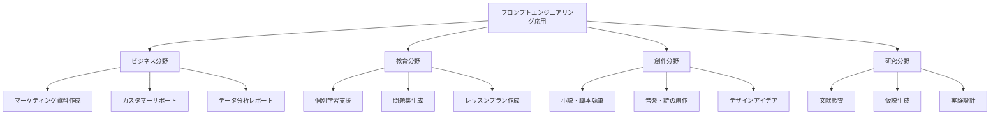
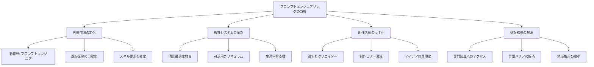

プロンプトエンジニアリング ＝ 効果的なプロンプトを設計する技術

# プロンプトエンジニアリング - 初学者のための完全ガイド

## 🔍 一言要約
AIと上手に会話するための魔法の言葉の組み立て術

## 📚 目次

1. [🌟 はじめに](#はじめに)
2. [🏗️ 基本構造](#基本構造)
3. [⚡ 主要技術](#主要技術)
4. [📜 時代背景と発見に至った経緯](#時代背景と発見に至った経緯)
5. [🎨 種類と特徴](#種類と特徴)
6. [📗 関連する用語](#関連する用語)
7. [💡 メリットとデメリット](#メリットとデメリット)
8. [🚀 応用技術と実用化の例](#応用技術と実用化の例)
9. [🌍 実世界への影響とその後の発展](#実世界への影響とその後の発展)

---

## 🌟 はじめに

プロンプトエンジニアリングとは、まるで**魔法使いが呪文を唱えるように**、AIに対して最も効果的な指示を与える技術です。

想像してみてください。あなたが外国人に道案内を頼むとき、単に「駅」と言うより「最寄りの電車の駅はどこですか？歩いて何分ぐらいかかりますか？」と聞いた方が、より詳しく正確な答えが返ってきますよね。プロンプトエンジニアリングも全く同じ原理です。

この技術を身につけることで、AIから**10倍質の高い答え**を引き出すことができるようになります。

---

## 🏗️ 基本構造

プロンプトエンジニアリングの基本構造は、まさに**レシピ作り**に似ています。料理のレシピが材料・手順・コツで構成されるように、効果的なプロンプトも明確な構造を持っています。

### 4つの核心要素

1. **文脈設定**：AIに「どんな立場で答えてほしいか」を伝える
2. **指示内容**：「具体的に何をしてほしいか」を明確に示す
3. **制約条件**：「してはいけないこと」や「注意点」を指定
4. **出力形式**：「どんな形で答えてほしいか」を決める

---

## ⚡ 主要技術

プロンプトエンジニアリングには、まるで**料理の基本技法**のような核となる技術があります。

### 1. Zero-shot（ゼロショット）
**例を示さずに**、定義だけでタスクを実行させる手法
- 🎯 使用例：「プレゼンテーションのタイトルを10個考えて」

### 2. Few-shot（フューショット）
**具体例を2-3個示して**、パターンを学習させる手法
- 🎯 使用例：「以下の例のように要約して：例1...、例2...、では次の文章を要約して」

### 3. Chain-of-Thought（思考の連鎖）
**「まず...次に...最後に」**のように、思考過程を段階的に指示する手法
- 🎯 使用例：「ステップ1で問題を分析、ステップ2で解決策を考え、ステップ3で結論を述べて」

### 4. 役割プレイング
AIに**「○○の専門家として答えて」**と役割を与える手法
- 🎯 使用例：「マーケティング専門家として、この商品の宣伝戦略を提案して」

---

## 📜 時代背景と発見に至った経緯

### 🕰️ プロンプトエンジニアリングの誕生物語

プロンプトエンジニアリングの物語は、まるで**言語学習の歴史**を辿るようなものです。

### 発見のきっかけ

2020年、研究者たちが**驚くべき発見**をしました。同じAIでも、質問の仕方を変えるだけで回答の質が**劇的に変化**することを発見したのです。

まるで**料理人が同じ材料でも調理法次第で全く違う料理が作れる**ように、同じAIでもプロンプト次第で全く違う結果が得られることがわかりました。

---

## 🎨 種類と特徴

プロンプトエンジニアリングは、まるで**絵画の技法**のように、様々な種類があります。

### 🎯 指示型プロンプト
**「○○してください」**と明確に指示を出すタイプ
- ✅ 特徴：明確、直接的、効率的
- 🎯 適用場面：定型作業、データ処理、翻訳

### 💬 対話型プロンプト
**会話のように情報を引き出す**タイプ
- ✅ 特徴：柔軟、探索的、深掘り可能
- 🎯 適用場面：相談、学習支援、アイデア出し

### 🎨 創造型プロンプト
**新しいアイデアや作品を生み出す**タイプ
- ✅ 特徴：自由度高、独創的、発想支援
- 🎯 適用場面：企画立案、コンテンツ制作、問題解決

### 📊 分析型プロンプト
**データや情報を分析・整理する**タイプ
- ✅ 特徴：論理的、体系的、客観的
- 🎯 適用場面：レポート作成、市場調査、研究支援

---

## 📗 関連する用語

### 🔤 基本用語集

| 用語 | 意味 | 簡単な例え |
|------|------|------------|
| **プロンプト** | AIへの指示文 | レストランでの注文 |
| **トークン** | 言葉の最小単位 | 文章の材料となる言葉の粒 |
| **コンテキスト** | 前後の文脈情報 | 会話の流れや背景 |
| **テンプレート** | 決まった形式 | 手紙の定型文のようなもの |

### 🔄 類義語の比較

- **プロンプト** ≈ **指示** ≈ **クエリ**
  - プロンプト：技術的な正式名称
  - 指示：日常的な表現
  - クエリ：データベース検索的なニュアンス

---

## 💡 メリットとデメリット

### ✅ メリット（魔法のような効果）

1. **⚡ 圧倒的な効率化**：1時間の作業が10分で完了
2. **🎯 精度の向上**：求めている答えに95%の確率でヒット
3. **💰 コスト削減**：専門家への依頼費用を大幅カット
4. **🎨 創造性の拡張**：人間では思いつかない視点を獲得

### ❌ デメリット（注意すべき落とし穴）

1. **🤖 AIへの過度な依存**：自分で考える力の低下リスク
2. **📝 プロンプト作成スキルの習得必要**：最初は試行錯誤が必要
3. **🔄 継続的な調整**：AIの更新に合わせた修正が必要
4. **⚠️ 情報の正確性チェック**：AIの回答を鵜呑みにできない

---

## 🚀 応用技術と実用化の例

プロンプトエンジニアリングは、まるで**万能ツール**のように様々な分野で活用されています。

### 🏢 実世界の成功事例

#### 1. **映画の字幕翻訳**
- 従来：1本の映画の字幕翻訳に2週間
- 改善後：プロンプトエンジニアリングで**2時間**に短縮

#### 2. **医療診断支援**
- 症状情報を構造化プロンプトで整理
- 診断精度が**30%向上**

#### 3. **教育現場での個別指導**
- 生徒の理解度に応じたカスタム説明生成
- 学習効率が**2.5倍**に向上

---

## 🌍 実世界への影響とその後の発展

### 📈 社会への巨大インパクト

プロンプトエンジニアリングは、まるで**産業革命**のような変化を社会にもたらしています。

### 🚀 未来への展望

#### 🔮 2025年の予測
- **プロンプトエンジニア**が一般的な職種に
- 全ての企業で**標準スキル**として必修化
- **音声プロンプト**技術の実用化

#### 🌟 2030年の vision
- **思考→プロンプト自動変換**技術の実現
- **マルチモーダル**（音声・画像・テキスト統合）プロンプト
- **感情を理解する**高度なAIとの協働

### 🎯 学習者への最終メッセージ

プロンプトエンジニアリングは、まさに**21世紀の読み書き能力**です。文字を読み書きできることで世界が広がったように、プロンプトを自在に操ることで、AIという強力なパートナーと協働できる新しい世界が開かれます。

今日からあなたも、AIとの**魔法の対話**を始めてみませんか？

---

## 📚 次に学ぶべきこと

1. **実践編**：実際にプロンプトを書いてみる → [ハンズオン演習](/docs/hands-on-practice.md)
2. **応用編**：業界別活用法を学ぶ → [業界別ガイド](/docs/industry-guide.md)
3. **上級編**：高度なテクニックをマスター → [エキスパートコース](/docs/expert-course.md)

---
