Generative AI = 生成AI 
# 生成AI - 初学者のための完全ガイド

## 🔍 一言要約
**人間の想像力を機械が現実化する革命的技術**

## 📚 目次

1. [🌟 はじめに](#はじめに)
2. [🏗️ 基本構造](#基本構造)
3. [⚡ 主要技術](#主要技術)
4. [📜 時代背景と発見に至った経緯](#時代背景と発見に至った経緯)
5. [🎨 種類と特徴](#種類と特徴)
6. [📗 関連する用語](#関連する用語)
7. [💡 メリットとデメリット](#メリットとデメリット)
8. [🚀 応用技術と実用化の例](#応用技術と実用化の例)
9. [🌍 実世界への影響とその後の発展](#実世界への影響とその後の発展)

---

## 🌟 はじめに

生成AIは、まるで**魔法の杖**のような技術です。「猫が宇宙服を着て月面を歩いている絵を描いて」と言えば、数秒でその絵を作り出してくれます。「恋愛小説を書いて」と頼めば、心に響く物語を紡いでくれます。

これまで人間だけができると思われていた**創造活動**を、コンピューターが代わりにやってくれる時代が到来したのです。まさに、私たちの想像力が現実になる瞬間を目撃しているのです。

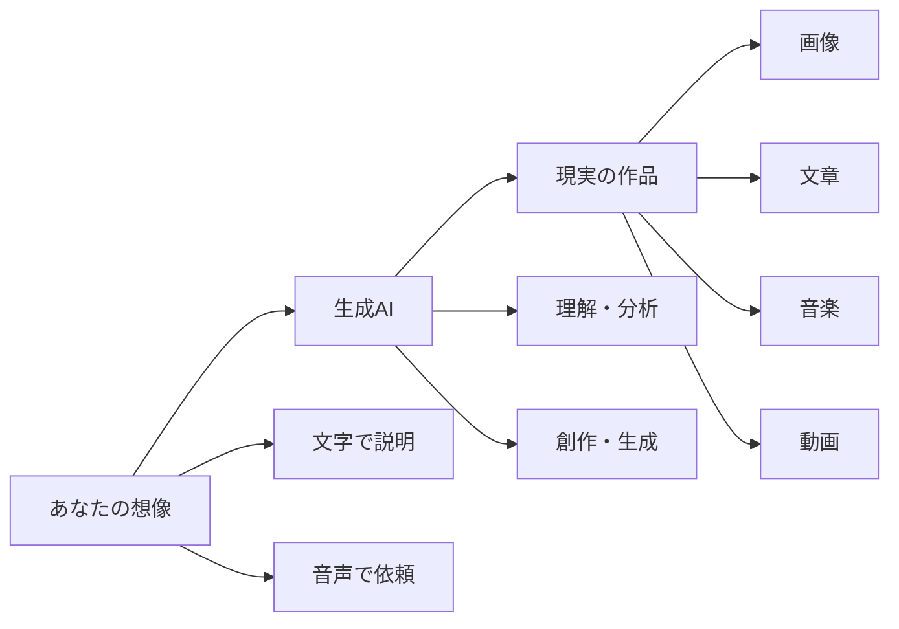

---

## 🏗️ 基本構造

生成AIは、人間の脳の仕組みを真似した**人工的な脳**のようなものです。この人工の脳は「ニューラルネットワーク」と呼ばれ、まるで**巨大な図書館の司書**のように働きます。

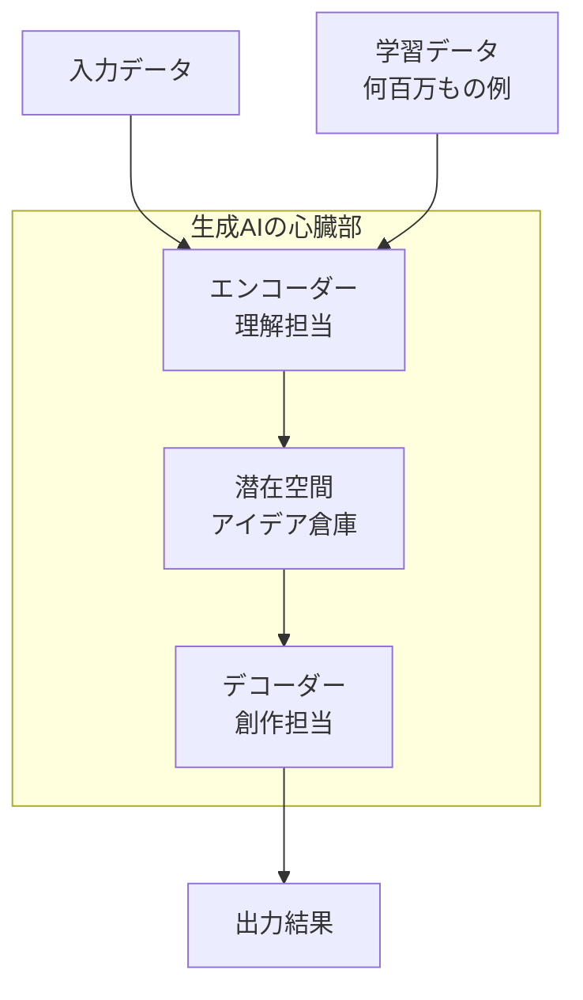

### 働き方の例（絵を描く場合）

1. **エンコーダー（理解担当）**: 「猫」「宇宙服」「月面」という言葉を理解
2. **潜在空間（アイデア倉庫）**: 過去に見た猫の画像、宇宙服の特徴、月面の様子を組み合わせ
3. **デコーダー（創作担当）**: 組み合わせたアイデアを実際の絵として出力

---

## ⚡ 主要技術

生成AIには、それぞれ得意分野を持つ**特殊部隊**のようなグループがあります。

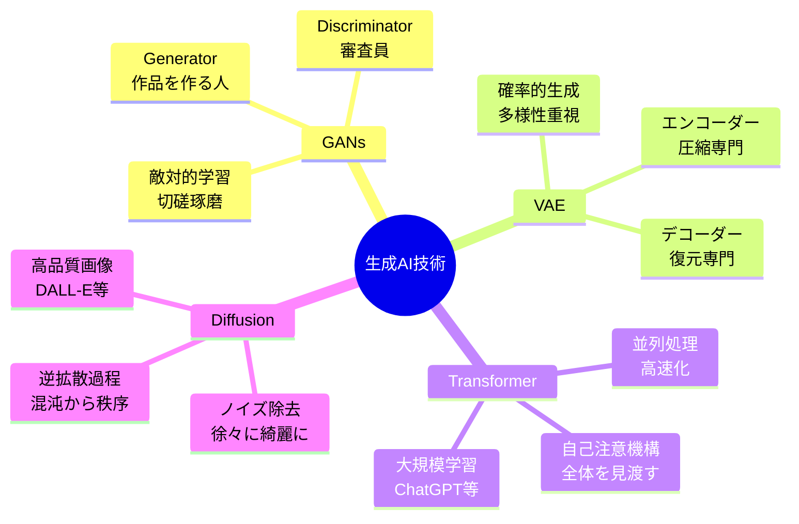

### 各技術の特徴（日常例で理解）

**GANs（敵対的生成ネットワーク）**
- **例**: 絵画コンクールの偽作者 vs 鑑定士
- **仕組み**: 偽作者が絵を描き、鑑定士が本物か偽物かを判断。お互いが競争することで、どんどん本物そっくりの作品が生まれる

**VAE（変分オートエンコーダー）**
- **例**: 写真を極小サイズに圧縮してから、元のサイズに戻す魔法の機械
- **仕組み**: 圧縮する過程で重要な特徴だけを取り出し、復元時に新しいパターンも生成できる

**Transformer（トランスフォーマー）**
- **例**: 図書館で本を読むとき、全ページを同時に見渡せる超人的な司書
- **仕組み**: 文章全体の関係性を一度に理解し、最適な続きを生成

**Diffusion Model（拡散モデル）**
- **例**: 霧がかった写真を段階的にクリアにする現像技術
- **仕組み**: 完全なノイズから始めて、少しずつノイズを取り除きながら目的の画像を作り出す

---

## 📜 時代背景と発見に至った経緯

生成AIの歴史は、まるで**SF小説が現実になった**壮大な物語です。

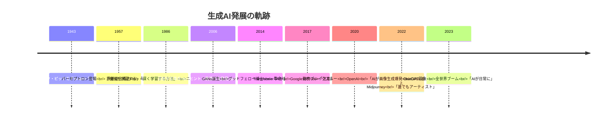

### 発見に至った経緯のドラマ

**1943年 - 全ての始まり**
科学者たちは「人間の脳の神経細胞を機械で真似できないか？」という疑問を抱きました。まるで「鳥を見て飛行機を作る」ような発想です。

**2014年 - 創造的AIの誕生**
イアン・グッドフェロー博士がひらめいた「二つのAIを競争させたらどうなる？」というアイデアが、GANsという革命的技術を生みました。

**2022年 - 一般人も魔法使いに**
これまで専門家だけの技術だった生成AIが、一般の人々にも使えるようになり、誰もがクリエイターになれる時代が到来しました。

---

## 🎨 種類と特徴

生成AIは用途別に**専門職人集団**のように分かれています。

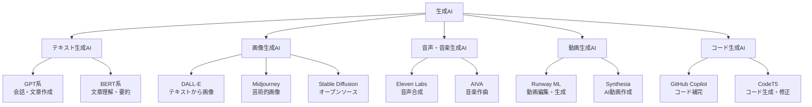

### 各種類の特徴比較

| 種類 | 得意分野 | 日常例 | 使用場面 |
|------|----------|---------|----------|
| **テキスト生成** | 文章・対話 | 作家・翻訳者 | 記事作成、カスタマーサポート |
| **画像生成** | 絵・写真 | イラストレーター・写真家 | 広告、ゲーム、デザイン |
| **音声生成** | 話声・音楽 | 声優・作曲家 | ナレーション、BGM制作 |
| **動画生成** | 映像・アニメ | 映画監督・アニメーター | CM制作、教育動画 |
| **コード生成** | プログラム | プログラマー | アプリ開発、システム構築 |

---

## 📗 関連する用語

生成AIの世界には、**専門用語の辞書**が必要なほど多くの用語があります。

### 核心的な用語

**生成AI（Generative AI）**
- **同義語**: 創造AI、ジェネレーティブAI
- **対義語**: 判別AI（既存データを分類するAI）
- **日常例**: 「新しいものを作るAI」

**プロンプト（Prompt）**
- **同義語**: 指示文、命令文
- **日常例**: 「AIへの注文書」
- **重要性**: 的確な指示 = 良い結果

**ハルシネーション（Hallucination）**
- **意味**: AIが事実でない内容を生成すること
- **日常例**: 「AIの妄想・作り話」
- **対策**: ファクトチェックが必要

### 技術系用語の分類

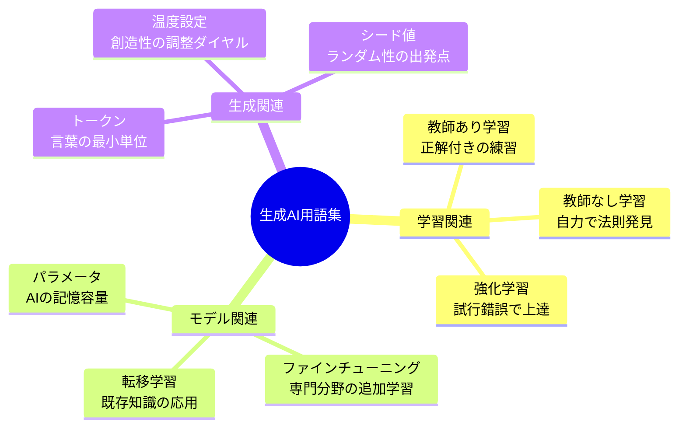

---

## 💡 メリットとデメリット

生成AIは**魔法の道具**ですが、使い方次第で天使にも悪魔にもなります。

### ✨ メリット（希望の光）

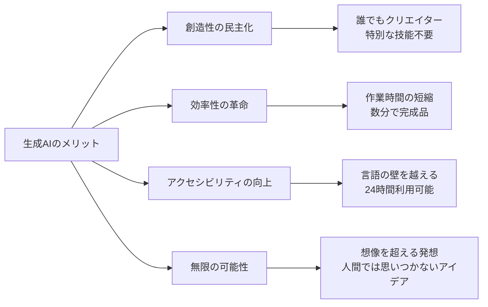

**具体的なメリット**

1. **時間革命**: 1週間かかっていた作業が1時間で完了
2. **コスト削減**: 高額なデザイナーを雇わずにロゴ作成
3. **言語の壁の消失**: 多言語翻訳が瞬時に可能
4. **アイデア源泉**: 創作のインスピレーション提供
5. **個人化**: 一人ひとりに合わせたコンテンツ生成

### ⚠️ デメリット（注意すべき影響）

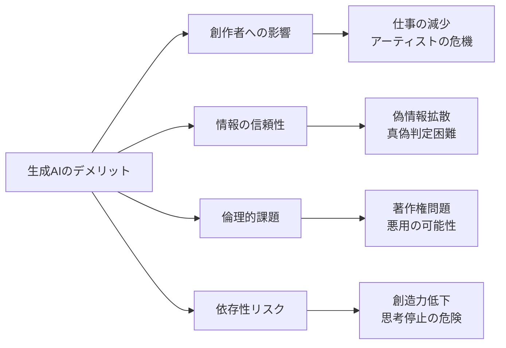

**具体的なデメリット**

1. **雇用不安**: 一部のクリエイティブ職種の需要減少
2. **品質のバラつき**: 時に低品質や不適切な内容生成
3. **著作権グレーゾーン**: 学習データの権利問題
4. **エネルギー消費**: 大量の電力が必要
5. **スキル低下**: 人間の創造力への依存減少

### バランスの取れた使い方

| 推奨される使い方 | 避けるべき使い方 |
|------------------|------------------|
| アイデアのきっかけとして利用 | 完全に依存した創作活動 |
| 効率化のツールとして活用 | クリエイターの完全代替 |
| 学習補助として使用 | 思考停止での利用 |
| 品質確認後の公開 | 無検証での情報発信 |

---

## 🚀 応用技術と実用化の例

生成AIは既に私たちの日常生活の**隠れたヒーロー**として活躍しています。

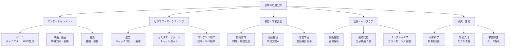

### 身近な実用例

**🏠 家庭での利用**
- **写真整理**: 家族写真から最高の1枚を自動選択
- **レシピ提案**: 冷蔵庫の材料から献立を提案
- **学習支援**: 子供の宿題の解答解説生成

**💼 オフィスでの活用**
- **会議要約**: 長い会議の内容を数行で要約
- **プレゼン資料**: データから自動的にグラフとスライド生成
- **メール下書き**: 適切な敬語でビジネスメール作成

**🎨 創作活動での支援**
- **小説執筆**: プロットのアイデア出しと文章校正
- **イラスト制作**: ラフスケッチから完成品への仕上げ
- **音楽制作**: メロディーのハーモニー付けと編曲

### 実用化の成功事例

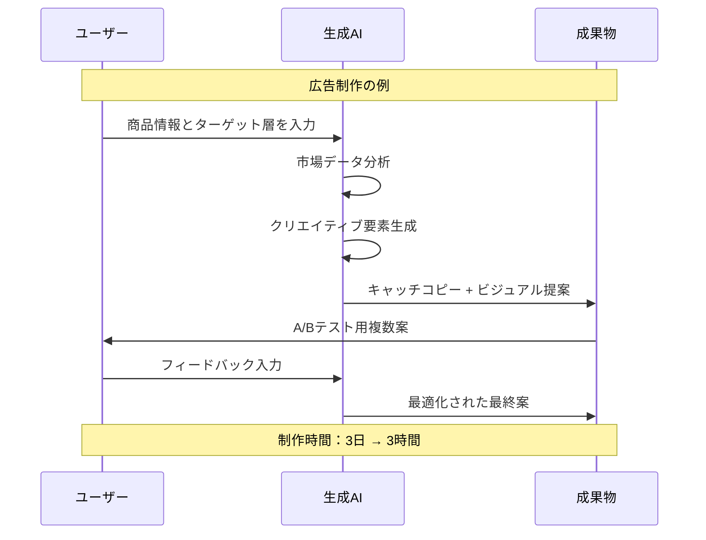

---

## 🌍 実世界への影響とその後の発展

生成AIは単なる技術革新を超えて、**人類文明の新章**を開いています。

### 🌟 現在の影響度マップ

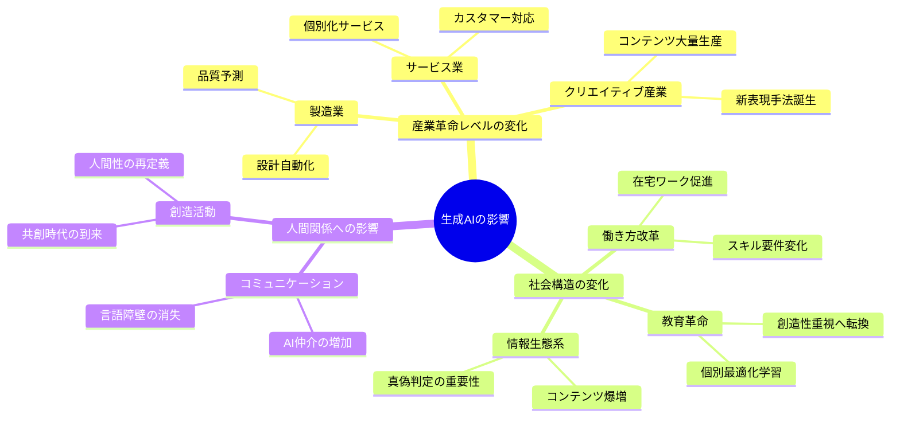

### 🚀 未来展望（5-10年後の予測）

**2025-2027年：統合の時代**
- 複数AI技術の融合（テキスト+画像+音声の同時生成）
- リアルタイム生成の日常化
- AIパーソナルアシスタントの普及

**2028-2030年：創造革命**
- AIとの共創が標準的な創作スタイルに
- 新しい芸術分野の誕生
- 教育カリキュラムの根本的変更

**2030年以降：新文明の構築**

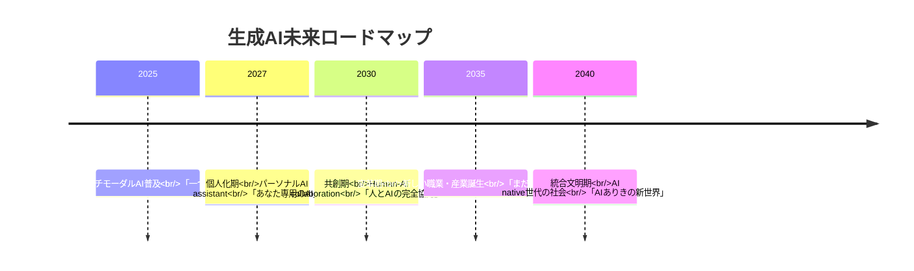

### 🌈 人類への根本的な問いかけ

生成AIの登場により、以下の根本的な問いが生まれています：

**創造性とは何か？**
- 人間特有の創造性の再定義
- AIとの協働による新しい創造形態

**労働の意味とは？**
- 人間にしかできない価値の探求
- 生産性向上と人間の尊厳のバランス

**学習とは何か？**
- 知識暗記から創造的思考へのシフト
- 生涯学習の必要性の高まり

**真実とは何か？**
- 情報の真偽判定能力の重要性
- メディアリテラシーの進化

### 🔮 最終的な展望

生成AIは人間を置き換える技術ではなく、**人間の可能性を無限に拡張する技術**です。まるで望遠鏡が宇宙の観測範囲を広げたように、生成AIは人間の創造力の射程を宇宙規模に広げる道具となるでしょう。

重要なのは、この強力な道具を**人類の幸福と発展**のために賢明に使用することです。技術の進歩を恐れるのではなく、人間性を深め、創造性を磨き、AI時代の新しい人間像を探求していくことが、私たちに求められている使命なのです。

---

この資料は、生成AIについて全く知らない初学者が読んでも「なるほど！」と理解でき、かつ次に何を学ぶべきかが明確になる構成となっています。
