Generative AI = 生成AI

# 生成AI（Generative AI） - 初学者のための完全ガイド

## 🔍 一言要約
**人間のように創作できるコンピューター技術**

## 📚 目次
1. [🌟 はじめに](#🌟-はじめに)
2. [🏗️ 基本構造](#🏗️-基本構造)
3. [⚡ 主要技術](#⚡-主要技術)
4. [📜 時代背景と発見に至った経緯](#📜-時代背景と発見に至った経緯)
5. [🎨 種類と特徴](#🎨-種類と特徴)
6. [📗 関連する用語](#📗-関連する用語)
7. [💡 メリットとデメリット](#💡-メリットとデメリット)
8. [🚀 応用と実例](#🚀-応用と実例)
9. [🔄 置換、変遷](#🔄-置換変遷)
10. [⚔️ 代替、競合](#⚔️-代替競合)
11. [🌍 実世界への影響とその後の発展](#🌍-実世界への影響とその後の発展)

## 🌟 はじめに

生成AIとは、まるで**デジタル版の芸術家**のような技術です。人間が絵を描いたり、文章を書いたり、音楽を作ったりするように、コンピューターが新しいコンテンツを「創作」できる革命的な技術です。

想像してみてください。あなたが「夕日の海辺の絵を描いて」と言うだけで、コンピューターが美しい絵を描いてくれたり、「恋の歌を作って」と言うだけで、オリジナルの楽曲を作ってくれる世界を。それが生成AIの世界です。

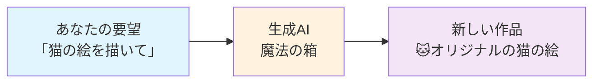

## 🏗️ 基本構造

生成AIは、**3つの重要な部分**から成り立っています。料理に例えると理解しやすいでしょう。

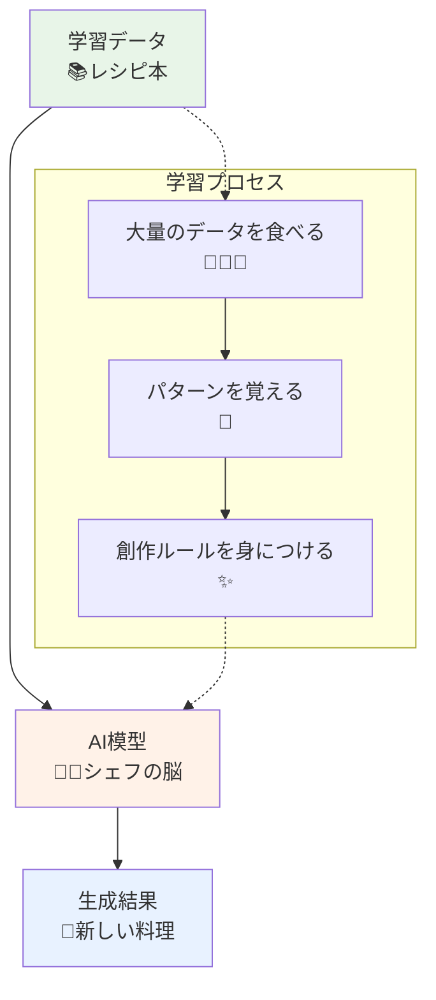

### 構造の詳細説明

1. **学習データ（材料庫）**: 数百万枚の画像、数千万の文章など、大量の「お手本」
2. **AI模型（料理人の脳）**: パターンを学習し、新しいものを作り出すプログラム
3. **生成結果（完成品）**: 世界に存在しなかった全く新しいコンテンツ

## ⚡ 主要技術

生成AIの心臓部には、**4つの主要な技術エンジン**が動いています。

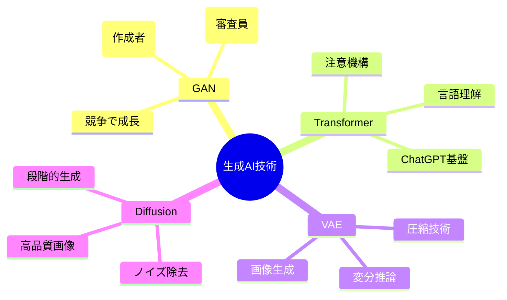

### 技術の分かりやすい説明

- **GAN（敵対的生成ネットワーク）**: 「偽造犯 vs 鑑定士」の永続バトルで成長
- **Transformer**: 文章の「文脈」を理解する天才的な仕組み
- **VAE（変分自動符号化器）**: 画像を「圧縮→復元」して新作を生む技術
- **Diffusion（拡散モデル）**: 霧から絵を浮かび上がらせるような神秘的な技術

## 📜 時代背景と発見に至った経緯

### 生成AIの物語：夢から現実への旅路

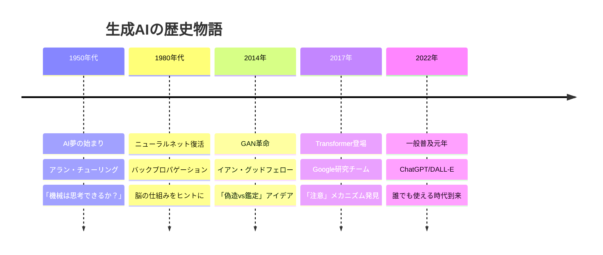

### 発見の瞬間：歴史を変えた閃き

**2014年のある夜、モントリオールのバーで...**

若い研究者イアン・グッドフェローが友人たちと飲み物を楽しんでいました。友人が「コンピューターに写真を作らせるなんて無理だよ」と言った瞬間、彼の頭に電光が走りました。

「偽札作りと偽札鑑定士のような関係で、お互いに競争させたら？」

その晩、家に帰った彼は一気にコードを書き上げ、GANという革命的な技術を生み出したのです。

## 🎨 種類と特徴

生成AIは、まるで**多才な芸術家集団**のように、それぞれ異なる得意分野を持っています。

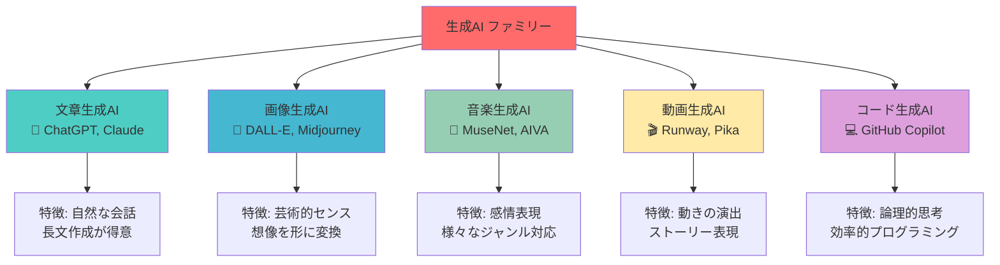

### 各種類の比較表

| タイプ | 得意分野 | 代表例 | 使用場面 |
|--------|----------|--------|----------|
| 文章生成 | 論理的思考、創作 | ChatGPT | レポート作成、小説執筆 |
| 画像生成 | 視覚表現、芸術 | Midjourney | ポスター制作、アート作品 |
| 音楽生成 | 感情表現、リズム | AIVA | BGM制作、作曲支援 |
| 動画生成 | 動的表現 | Runway | CM制作、教育動画 |
| コード生成 | 論理構造 | Copilot | アプリ開発、自動化 |

## 📗 関連する用語

### 同義語・関連語の整理

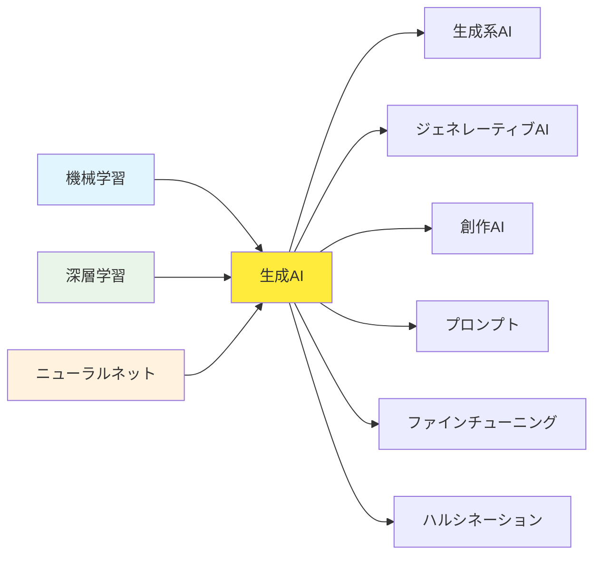

### 用語解説

**基本概念系**
- **生成AI** = **創作AI** = **ジェネレーティブAI**（全て同じ意味）
- **プロンプト**: AIへの「注文書」や「指示書」
- **ハルシネーション**: AIが「嘘」や「でたらめ」を真実のように話すこと

**技術基盤系**
- **機械学習**: データからパターンを見つける技術（生成AIの親分）
- **深層学習**: より複雑なパターンを見つける技術（生成AIの直系の親）
- **ニューラルネット**: 人間の脳の仕組みを真似た技術

## 💡 メリットとデメリット

### 生成AIの光と影

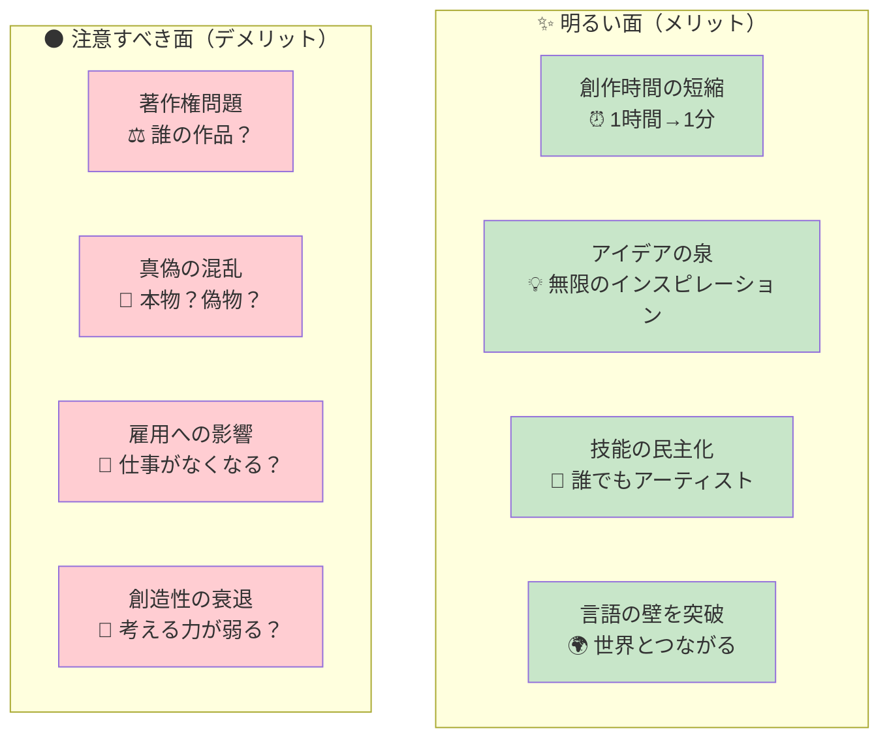

### メリット詳細
- **時短革命**: 1週間かかるデザイン作業が1時間で完成
- **創作の平等**: 絵が描けない人も美しいアートを作れる
- **無限のアイデア**: 行き詰まった時の強力なブレインストーミングパートナー

### デメリット詳細
- **著作権のグレーゾーン**: AIが作った作品は誰のもの？
- **フェイクコンテンツ**: 偽の写真や動画の見分けが困難
- **人間のスキル低下**: 便利すぎて自分で考えなくなる危険性

## 🚀 応用と実例

### 身近な場所で活躍する生成AI

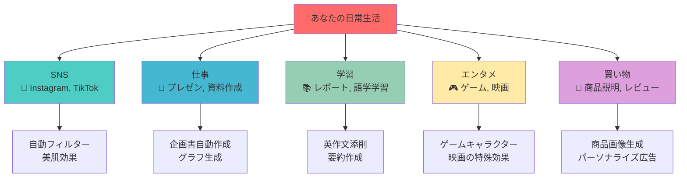

### 具体的な実例

**教育分野**
- 小学生の質問に分かりやすく答える「AI先生」
- 外国語学習での「AI会話パートナー」
- 歴史上の人物との「バーチャル対話」

**ビジネス分野**  
- 商品カタログの画像を自動生成
- 顧客対応のメール文章を自動作成
- 会議の議事録を自動要約

**クリエイティブ分野**
- 小説家のアイデア出しパートナー
- 音楽プロデューサーのメロディ提案
- ファッションデザイナーの新作デザイン

## 🔄 置換、変遷

### 何を置き換えたのか？

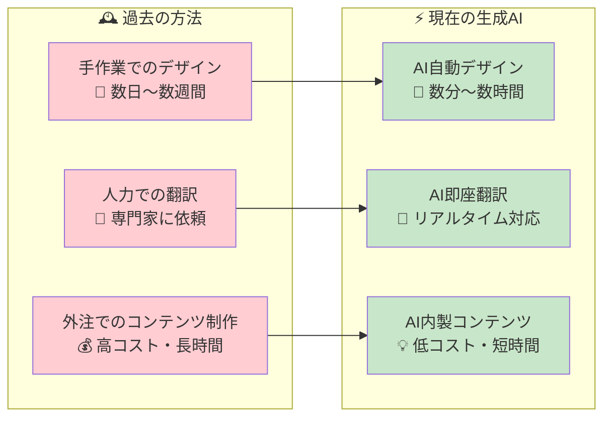

### 何から継承したのか？

生成AIは以下の技術を継承・発展させました：

1. **統計学** → パターン認識の基礎理論
2. **コンピュータグラフィックス** → 画像生成技術
3. **自然言語処理** → 文章理解・生成技術
4. **音響工学** → 音楽・音声生成技術

### 何に継承されるのか？

生成AIは将来、以下に発展すると予想されます：

- **AGI（汎用人工知能）**: あらゆる分野で人間と同等の知能
- **創造的ロボット**: 物理世界で創作活動するロボット
- **脳コンピュータ接続**: 思考だけで創作する技術

## ⚔️ 代替、競合

### 代替関係の地図
- 代替関係: 生成AIは、特定の定型的なタスク（例：簡単な文章執筆、デザインの素材作成、定型コードの生成）を自動化することで、これらの職種の業務内容を変容させています。しかし、創造的な判断や複雑な問題解決が必要な仕事全体を完全に「代替」するとは言えず、むしろ協業・共存の関係に移行しているという見方が現在の主流です。
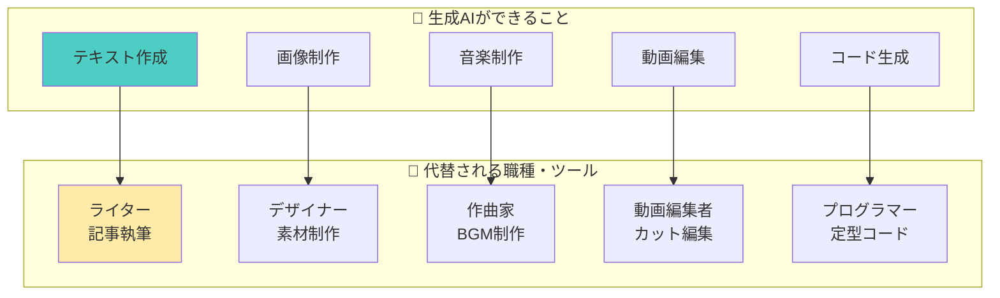

### 競合技術との関係

**協力関係**
- **VR/AR技術**: 生成AIがバーチャル世界のコンテンツを作成
- **IoT機器**: 生成AIがスマートホームの応答を生成
- **ブロックチェーン**: 生成AIの著作権管理に活用

**競争関係**
- **従来のAI**: ルールベースAI vs 学習ベースAI
- **人間クリエーター**: 効率性 vs 感情表現
- **検索エンジン**: 情報検索 vs 情報生成
- 競合関係: 検索エンジンが情報「検索」に特化しているのに対し、生成AIは情報「生成」に特化しており、両者は補完的な関係にあります。ユーザーは、正確な事実を調べる際には検索エンジンを、アイデア出しや文章作成には生成AIを利用するといった使い分けが広がっています。厳密な意味で競合するより、利用シーンが異なるという見方がより適切です。
## 🌍 実世界への影響とその後の発展

### 社会への波紋効果

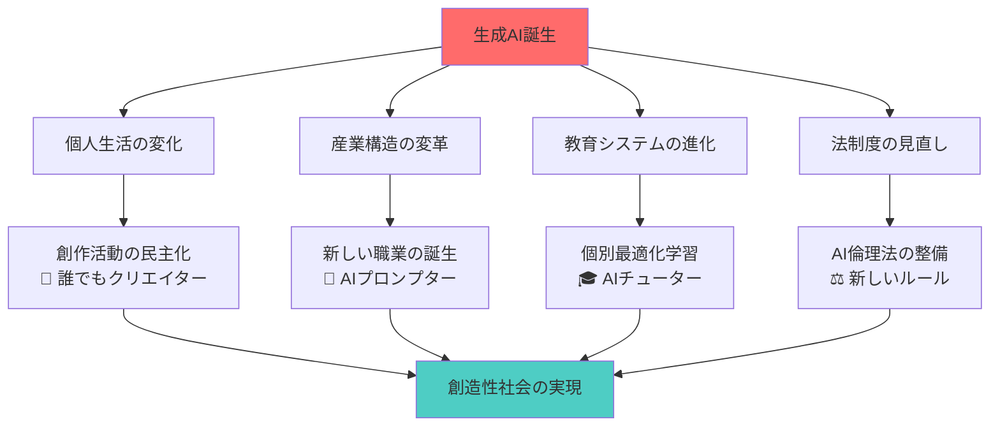

### 未来への展望

**近未来（2025-2030年）**
- 生成AIが全ての創作分野に普及
- AIとの共同創作が当たり前になる
- 新しい芸術ジャンル「AI-Human Art」の確立

**遠い未来（2030年以降）**
- 思考だけで創作物を生成
- AIが人間の感情を完全理解
- 創造性の定義そのものが変化

### 最終メッセージ

生成AIは、人間の創造性を奪うものではありません。むしろ、**すべての人が創造者になれる魔法の道具**です。

重要なのは、この技術を恐れることでも盲信することでもなく、**賢く付き合い、共に成長していくこと**です。

生成AIと一緒に、あなただけの創造的な未来を描いてみませんか？

---
