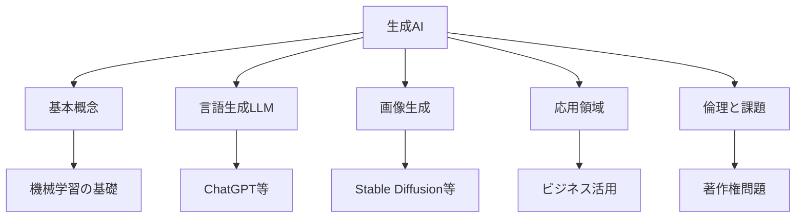
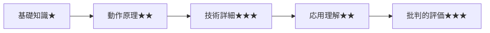
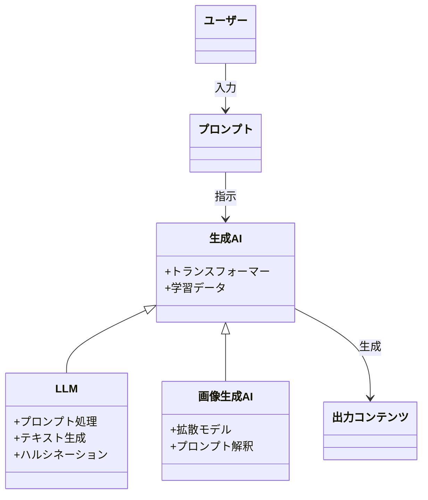
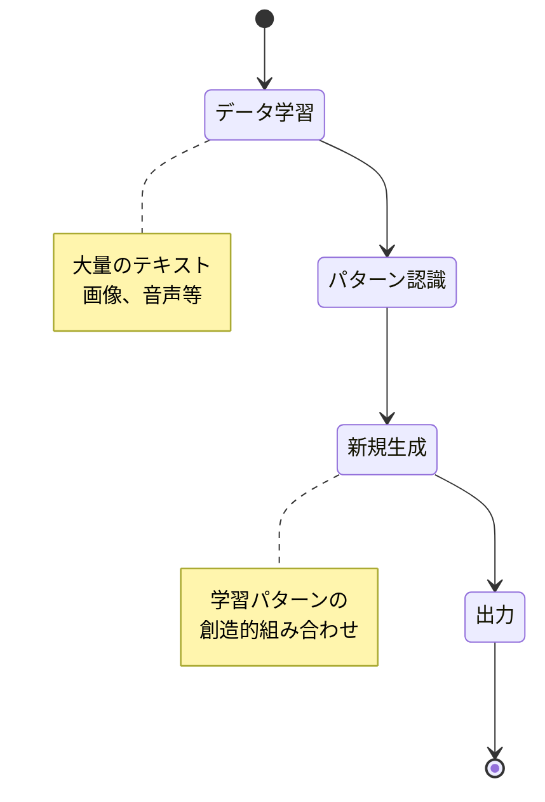
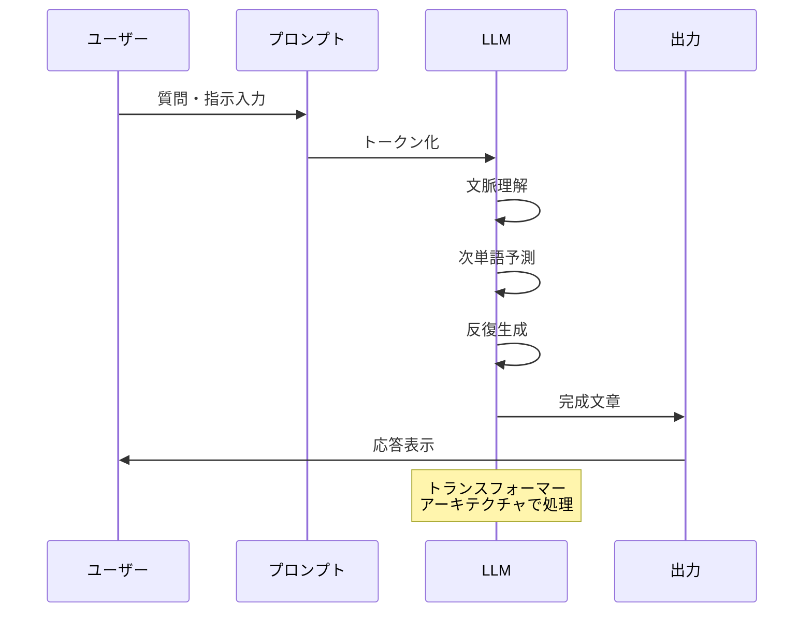
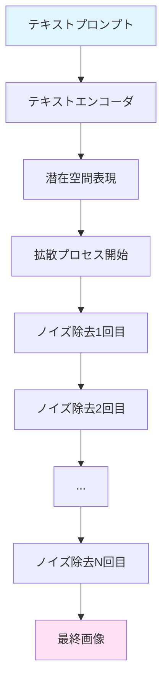
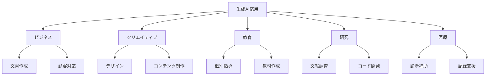
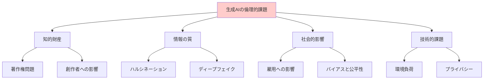
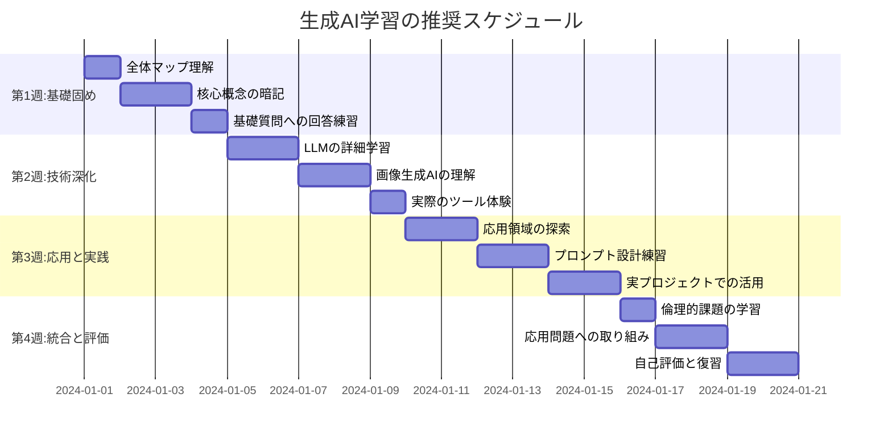

# 生成AI: 段階的理解ガイド

> **学習目標**: 生成AIの基本原理、主要技術、実用例を理解し、その可能性と限界を適切に評価できるようになる
> **推奨学習時間**: 3-4時間
> **前提知識**: コンピュータの基本操作ができること

## 1. 全体マップ

### 生成AIとは何か

**生成AI**とは、テキスト、画像、音声、動画などの新しいコンテンツを自動的に作り出す人工知能技術です。従来のAIが「認識・分類」を得意としたのに対し、生成AIは「創造・生成」を実現します。

### 本ガイドの学習範囲

**含むもの**: 生成AIの基本原理、主要な技術（LLM、画像生成、音声合成）、実用例、倫理的課題
**含まないもの**: 深層学習の数学的詳細、モデル開発の実装手順、ビジネス戦略論

### 主要サブトピック

1. **生成AIの基本概念**（30分）
2. **大規模言語モデル（LLM）**（45分）
3. **画像・動画生成AI**（40分）
4. **生成AIの応用領域**（45分）
5. **倫理と課題**（30分）



*この図は生成AIの学習内容全体を表しています。中心から5つの主要トピックが展開されます。*

---

## 2. ガイド質問

### 基本概念に関する質問

**Q1**: 生成AIは従来のAIとどのように違いますか？ ★☆☆
**Q2**: 生成AIはどのようにして新しいコンテンツを作り出すのですか？ ★★☆
**Q3**: なぜ生成AIは近年急速に発展したのですか？ ★★☆

### 技術的理解に関する質問

**Q4**: 大規模言語モデル（LLM）の「大規模」とは何を意味しますか？ ★☆☆
**Q5**: プロンプトエンジニアリングとは何で、なぜ重要ですか？ ★★☆
**Q6**: 画像生成AIはどのように文章から画像を生成しますか？ ★★★

### 応用と課題に関する質問

**Q7**: 生成AIはどのような業務で活用できますか？ ★☆☆
**Q8**: 生成AIの出力は常に正確ですか？どんな限界がありますか？ ★★☆
**Q9**: 生成AIの倫理的問題にはどのようなものがありますか？ ★★★



*質問は基礎から応用へと段階的に難易度が上がります。各段階をクリアしてから次へ進みましょう。*

---

## 3. 核心概念

### 重要用語と定義

**生成AI（Generative AI）**: 学習データのパターンを学び、新しいコンテンツを創造するAIシステム。入力に応じて文章、画像、音声などを生成します。

**大規模言語モデル（LLM: Large Language Model）**: 膨大なテキストデータで訓練され、人間のような文章を理解・生成できる深層学習モデル。パラメータ数が数十億から数千億に及びます。

**プロンプト（Prompt）**: 生成AIに与える指示文や質問文のこと。プロンプトの質が出力の質を大きく左右します。

**トークン（Token）**: テキストを処理する最小単位。英語では単語や単語の一部、日本語では1-3文字程度が1トークンになります。

**ハルシネーション（Hallucination）**: AIが事実でない情報をもっともらしく生成してしまう現象。「幻覚」とも訳されます。

**ファインチューニング（Fine-tuning）**: 既存の学習済みモデルを特定のタスクやデータに合わせて再訓練する手法。効率的に専門性を高められます。

**拡散モデル（Diffusion Model）**: 画像生成AIで主流の技術。ノイズから徐々に画像を生成する仕組みです。

**トランスフォーマー（Transformer）**: 現代の生成AIの基盤となる深層学習アーキテクチャ。注意機構により長い文脈を理解できます。

### 概念間の関係性

生成AIは**機械学習**の一分野であり、特に**深層学習**を基盤とします。その中で**トランスフォーマー**アーキテクチャが**LLM**と**画像生成AI**の両方を支えています。ユーザーは**プロンプト**を通じてAIと対話し、**ファインチューニング**によってカスタマイズが可能です。ただし**ハルシネーション**などの限界も理解する必要があります。

### 記憶補助（ニーモニック）

**GPTLH**で主要概念を覚えましょう：
- **G**enerative AI（生成AI）
- **P**rompt（プロンプト）
- **T**ransformer（トランスフォーマー）
- **L**LM（大規模言語モデル）
- **H**allucination（ハルシネーション）



*この図は核心概念がどのように関連しているかを示しています。生成AIを中心に、技術要素とユーザー操作が結びついています。*

---

## 4. 段階的詳細展開

### 4.1 生成AIの基本概念

#### 層1: 導入

生成AIは2020年代に入って爆発的に普及した技術ですが、その基礎は数十年前から研究されてきた機械学習にあります。従来のAIが「分類」や「予測」を得意としたのに対し、生成AIは「創造」を可能にする点で革新的です。

#### 層2: 展開

**従来のAIとの違い**を具体例で理解しましょう。従来のAI（識別AI）は、例えば写真を見て「これは猫です」と判断します。一方、生成AIは「茶トラの子猫が日向ぼっこしている画像」という指示から、実際にその画像を創り出します。

生成AIが実現できることは多岐にわたります：
- **テキスト生成**: 記事執筆、プログラムコード作成、翻訳
- **画像生成**: イラスト作成、デザイン案の提示
- **音声合成**: ナレーション生成、音楽作曲
- **動画生成**: アニメーション制作、映像編集

一般的な誤解として「生成AIは自分で考えている」というものがありますが、実際には膨大なデータから学んだパターンを組み合わせているに過ぎません。人間のような意識や意図は持っていません。

**実世界での応用例**: カスタマーサポートのチャットボット、マーケティング用の画像素材作成、プログラマーのコーディング補助などで既に広く使われています。

#### 層3: 要約

生成AIは学習データのパターンから新しいコンテンツを創造する技術であり、従来の識別AIとは本質的に異なります。次は、その中でも最も影響力の大きい大規模言語モデル（LLM）について学びます。



*この図は生成AIがコンテンツを作り出すまでの流れを示しています。データ学習から出力まで、各段階を経て生成が行われます。*

---

### 4.2 大規模言語モデル（LLM）

#### 層1: 導入

大規模言語モデル（LLM）は生成AIの中でも特に注目を集めている技術で、ChatGPT、Claude、Geminiなどがその代表例です。これらは数千億のパラメータを持ち、インターネット上の膨大なテキストから学習しています。

#### 層2: 展開

**「大規模」の意味**を理解することが重要です。LLMの「大規模」とは、主に2つの意味があります：
1. **パラメータ数**: モデルが学習する変数の数で、GPT-3は大規模、GPT-4はさらに大規模
2. **学習データ量**: インターネット上の書籍、記事、ウェブページなど数兆トークン

LLMの動作原理は**次の単語を予測する**という単純なタスクの積み重ねです。例えば「空は」という入力に対して「青い」と予測します。この予測を何度も繰り返すことで、文章全体を生成します。ただし、単なる次単語予測以上に、文脈理解、論理的推論、創造的な文章生成が可能になっています。

**プロンプトエンジニアリング**はLLMを効果的に使うための技術です。良いプロンプトの例：
- ❌ 悪い例: 「レポート書いて」
- ✅ 良い例: 「大学1年生向けに、環境問題について800字程度でレポートを作成してください。序論、本論、結論の構成で、具体例を2つ含めてください」

一般的な誤解として「LLMは検索エンジンである」というものがありますが、実際には学習データを基に文章を生成しているため、最新情報や正確な数値は必ずしも正しくありません。これが**ハルシネーション**（事実でない情報の生成）につながります。

**実世界での応用例**: 文書作成支援、プログラミング補助、言語学習、アイデア出し、要約作成など、知的作業の多くで活用されています。

#### 層3: 要約

LLMは膨大なパラメータと学習データを持つ言語モデルで、次単語予測の仕組みから高度な文章生成を実現しています。効果的に使うにはプロンプトエンジニアリングが重要であり、ハルシネーションなどの限界も理解する必要があります。次は視覚的なコンテンツを生成する画像AIについて学びます。



*この図はLLMがユーザーの入力を処理して出力を生成するまでの流れを示しています。各段階で言語処理が行われます。*

---

### 4.3 画像・動画生成AI

#### 層1: 導入

画像生成AIは、テキストの説明文（プロンプト）から画像を創り出す技術です。Stable Diffusion、DALL-E、Midjourneyなどが代表的で、イラスト、写真風画像、デザイン素材などを数秒で生成できます。

#### 層2: 展開

**画像生成の仕組み**は主に**拡散モデル**という技術に基づいています。簡単に言えば：
1. ランダムなノイズ（砂嵐のような画像）から始める
2. プロンプトの内容に合うように、少しずつノイズを除去する
3. 数十回の反復で、明瞭な画像が現れる

この過程は、霧がかった写真が徐々にクリアになっていくイメージです。

**プロンプトの書き方**が画質を大きく左右します。効果的なプロンプトの例：
- ❌ 基本: 「猫」
- ✅ 詳細: 「茶トラの子猫、ふわふわの毛並み、大きな瞳、日向ぼっこ、写真風、高解像度」

画像生成AIには様々なスタイルがあります：
- **フォトリアリスティック**: 実写のような写真
- **アニメ・イラスト風**: 日本のアニメ調、水彩画風など
- **アート風**: 印象派、抽象画など芸術的スタイル

一般的な誤解として「AIが完全にオリジナルな画像を創る」というものがありますが、実際には学習データの膨大な画像のパターンを組み合わせています。このため、既存の作品に似た出力が生まれることもあり、著作権の問題が議論されています。

**実世界での応用例**: SNS用の画像作成、広告素材の試作、ゲームのコンセプトアート、商品デザインの検討など、ビジュアルコンテンツ制作の初期段階で広く使われています。

**動画生成AI**も急速に発展しており、Runway、Pika、Soraなどが登場しています。静止画の延長として、短い動画クリップを生成できるようになってきました。

#### 層3: 要約

画像生成AIは拡散モデルを用いてテキストから画像を創り出し、詳細なプロンプトが高品質な出力につながります。様々なスタイルで生成可能ですが、著作権などの課題も存在します。次は生成AIの具体的な応用領域について学びます。



*この図は画像生成AIがプロンプトから画像を生成するまでのプロセスを示しています。拡散モデルが段階的にノイズを除去します。*

---

### 4.4 生成AIの応用領域

#### 層1: 導入

生成AIは既に多くの業界で実用化されており、仕事の進め方を大きく変えつつあります。ここでは主要な応用領域と、それぞれでどのように活用されているかを見ていきます。

#### 層2: 展開

**ビジネス・業務効率化**
- **文書作成**: 報告書、メール、企画書の下書き作成
- **データ分析**: 大量のテキストデータの要約と洞察抽出
- **カスタマーサポート**: チャットボットによる24時間対応
- **翻訳**: 多言語間の高精度な翻訳

具体例：マーケティング部門では、広告コピーのバリエーションを数十パターン瞬時に生成し、A/Bテストの効率が大幅に向上しています。

**クリエイティブ産業**
- **コンテンツ制作**: ブログ記事、SNS投稿、動画スクリプト
- **デザイン**: ロゴ、バナー、UI/UXのモックアップ
- **音楽・音声**: BGM生成、ナレーション合成
- **ゲーム開発**: キャラクターデザイン、背景画像、対話システム

具体例：インディーゲーム開発者が、予算をかけずに高品質なコンセプトアートを生成し、クラウドファンディングのプレゼンテーション資料を作成しています。

**教育・学習支援**
- **個別指導**: 学習者のレベルに合わせた説明
- **教材作成**: 練習問題、クイズ、教案の生成
- **言語学習**: 会話練習の相手、添削
- **プログラミング学習**: コードの説明、デバッグ支援

具体例：学生が難解な概念を理解できるまで、何度でも異なる例え話で説明を受けられます。

**研究・専門分野**
- **文献調査**: 論文の要約、関連研究の発見
- **仮説生成**: データから新しい仮説を提案
- **コード開発**: 研究用プログラムの作成補助
- **科学コミュニケーション**: 専門用語の一般向け説明

**医療・ヘルスケア**
- **診断補助**: 医療画像の分析支援（最終判断は医師が行う）
- **カルテ記録**: 音声からの自動文字起こしと要約
- **患者教育**: 病状や治療法の分かりやすい説明生成

注意点：医療分野では生成AIの出力を鵜呑みにせず、必ず専門家の確認が必要です。

一般的な誤解として「生成AIがあれば人間の仕事は不要になる」というものがありますが、実際には**人間と協働するツール**として位置づけられています。生成AIは下書きやアイデア出しを担当し、人間が最終的な判断、編集、創造的な決定を行うという役割分担が効果的です。

#### 層3: 要約

生成AIはビジネス、クリエイティブ、教育、研究、医療など幅広い領域で活用されており、業務効率化と創造性の向上を実現しています。人間との協働により最大の効果を発揮します。次は、これらの技術がもたらす倫理的課題について学びます。



*この図は生成AIの主要な応用領域と具体的な活用例を示しています。各分野で多様な用途があります。*

---

### 4.5 倫理と課題

#### 層1: 導入

生成AIの急速な普及に伴い、技術的な可能性だけでなく、倫理的・社会的な課題も浮上しています。これらを理解し、責任ある利用を心がけることが重要です。

#### 層2: 展開

**著作権と知的財産権の問題**

生成AIは既存の作品を学習データとして使用しているため、著作権の観点から議論があります。主な論点：
- 学習データとして著作物を使うことは合法か？
- 生成された画像が既存作品に酷似している場合、侵害にあたるか？
- AIが生成したコンテンツの著作権は誰に帰属するか？

現状、法的な解釈は国や地域で異なり、判例も蓄積中です。使用する際は利用規約を確認し、商用利用の場合は特に注意が必要です。

**ハルシネーションと情報の信頼性**

LLMは事実でない情報をもっともらしく生成することがあります。対策：
- 重要な情報は必ず一次情報源で確認する
- 統計データや引用は検証する
- 医療・法律など専門的判断が必要な分野では専門家に相談する

具体例：「〇〇大学の△△教授の論文によると...」という出力があっても、その論文が実在しない場合があります。

**偽情報とディープフェイク**

生成AIは説得力のある虚偽情報や、実在の人物になりすました画像・動画（ディープフェイク）を作成できます。悪用されると：
- フェイクニュースの拡散
- 詐欺や恐喝
- 選挙への不正な影響
- 個人の名誉毀損

対策として、情報リテラシーの向上と、技術的な検出手法の開発が進められています。

**雇用への影響**

一部の職種では生成AIが人間の仕事を代替する可能性があります。特に影響を受ける可能性がある分野：
- ライティング（記事作成、コピーライティング）
- データ入力・分類
- 基本的なカスタマーサポート
- 翻訳
- 一部のプログラミング業務

ただし、創造的判断、人間関係、複雑な問題解決が必要な業務では、人間の役割は依然として重要です。新しいスキルの習得（プロンプトエンジニアリング、AI活用能力など）が重要になっています。

**バイアスと公平性**

生成AIは学習データに含まれる偏見を反映することがあります：
- 性別、人種、年齢に関するステレオタイプ
- 文化的偏り
- 歴史的な不平等の再生産

開発者側では、多様なデータセットの使用やバイアス軽減技術の導入が進められています。

**環境への影響**

大規模な生成AIモデルの訓練と運用には膨大な計算資源とエネルギーが必要です。GPT-3クラスのモデル訓練には、一般家庭数年分の電力消費に相当するエネルギーが使われると推定されています。持続可能な開発とのバランスが課題です。

**プライバシーとデータセキュリティ**

生成AIに入力した情報が学習データとして使われる可能性があります。注意点：
- 個人情報や機密情報を入力しない
- 利用規約でデータの扱いを確認する
- 企業向けの専用サービスではプライバシー保護が強化されている場合がある

#### 層3: 要約

生成AIには著作権、ハルシネーション、偽情報、雇用影響、バイアス、環境負荷、プライバシーなど多様な倫理的課題があり、責任ある利用が求められます。技術の可能性と限界の両方を理解し、批判的に活用することが重要です。



*この図は生成AIに関する主要な倫理的課題を分類しています。各カテゴリに複数の具体的問題が含まれます。*

---

## 5. 統合・実践

### ガイド質問への模範回答

**Q1: 生成AIは従来のAIとどのように違いますか？** ★☆☆

従来のAI（識別AI）は既存のデータを分析・分類することが主な役割でした（例：画像に写っているものが猫か犬かを判定）。一方、生成AIは新しいコンテンツを創造します（例：「海辺の夕日」という指示から実際の画像を生成）。つまり、認識から創造へと役割が拡大したのが大きな違いです。

**Q2: 生成AIはどのようにして新しいコンテンツを作り出すのですか？** ★★☆

生成AIは膨大な学習データからパターンを抽出し、それらを組み合わせることで新しいコンテンツを作ります。例えばLLMは「次に来る単語」を予測する訓練を繰り返すことで、文脈に合った文章を生成できるようになります。画像生成AIは拡散モデルを使い、ランダムなノイズから段階的にプロンプトに合った画像を形成します。

**Q3: なぜ生成AIは近年急速に発展したのですか？** ★★☆

主に3つの要因があります。1）トランスフォーマーなどの効率的なアーキテクチャの開発、2）GPU等の計算能力の向上により大規模モデルの訓練が可能に、3）インターネット上の膨大なデータが利用可能になったこと。これらが2017年以降に組み合わさり、急速な発展につながりました。

**Q4: 大規模言語モデル（LLM）の「大規模」とは何を意味しますか？** ★☆☆

「大規模」には2つの意味があります。1つ目は**パラメータ数の多さ**で、GPT-3は1750億、GPT-4はさらに多くのパラメータを持ちます。これは人間の脳のシナプス接続に相当するもので、多いほど複雑なパターンを学習できます。2つ目は**学習データの膨大さ**で、インターネット上の書籍、記事、ウェブページなど数兆トークンを学習しています。

**Q5: プロンプトエンジニアリングとは何で、なぜ重要ですか？** ★★☆

プロンプトエンジニアリングは、生成AIから望ましい出力を得るために効果的な指示文を設計する技術です。同じ質問でも、詳細さや構造が異なると出力の質が大きく変わります。例えば「レポート書いて」よりも「大学1年生向けに環境問題について800字で、序論・本論・結論の構成で」と指定する方が、目的に合った出力が得られます。AIの能力を最大限引き出すために重要です。

**Q6: 画像生成AIはどのように文章から画像を生成しますか？** ★★★

拡散モデルという技術を使います。まず、テキストプロンプトがテキストエンコーダで数値表現（潜在空間）に変換されます。次に、ランダムなノイズ画像から始めて、プロンプトの内容に合うように段階的にノイズを除去していきます。この除去プロセスを数十回繰り返すことで、徐々に明瞭な画像が現れます。霧がかった写真が次第にクリアになるイメージです。

**Q7: 生成AIはどのような業務で活用できますか？** ★☆☆

多様な業務で活用されています。文書作成（報告書、メール）、カスタマーサポート（チャットボット）、マーケティング（広告コピー、画像素材）、プログラミング補助（コード生成、デバッグ）、教育（個別指導、教材作成）、デザイン（ロゴ、UI/UXモックアップ）などです。基本的には、下書き作成やアイデア出しなど、初期段階の作業で特に効果を発揮します。

**Q8: 生成AIの出力は常に正確ですか？どんな限界がありますか？** ★★☆

いいえ、生成AIの出力は必ずしも正確ではありません。主な限界は以下の通りです。1）**ハルシネーション**：事実でない情報をもっともらしく生成する、2）**知識の古さ**：学習データの時点までの情報しか持たない、3）**文脈の誤解**：複雑な指示や曖昧な表現を誤って解釈する、4）**専門的判断の不足**：医療や法律など専門知識が必要な分野での判断は不確実。重要な情報は必ず一次情報源で確認する必要があります。

**Q9: 生成AIの倫理的問題にはどのようなものがありますか？** ★★★

多岐にわたる倫理的課題があります。**著作権**：学習データとしての既存作品使用の是非、**偽情報**：ディープフェイクやフェイクニュースの生成、**バイアス**：学習データに含まれる偏見の再生産、**雇用**：一部職種の代替による失業リスク、**プライバシー**：入力データの扱いと機密情報の漏洩リスク、**環境**：大規模モデル訓練の膨大なエネルギー消費。責任ある利用には、これらの課題を理解し、適切な対策を講じることが求められます。

---

### 応用問題

**問題1: 統合理解**

あなたは小規模なマーケティング会社で働いています。新規クライアント向けの広告キャンペーン企画で、生成AIをどのように活用できるか、LLMと画像生成AIの両方を使った具体的なワークフローを提案してください。ただし、倫理的課題への対処も含めてください。

**模範回答例**:

```
【ワークフロー提案】

1. アイデア発想フェーズ（LLM活用）
   - プロンプト: 「〇〇業界の新製品向け広告キャンペーンのコンセプトを5つ提案してください」
   - 複数のアプローチを短時間で検討可能

2. コピーライティング（LLM活用）
   - 各コンセプトに対する広告コピーのバリエーションを生成
   - A/Bテスト用に複数パターンを準備

3. ビジュアルモックアップ（画像生成AI活用）
   - 広告コンセプトに合った画像を複数スタイルで生成
   - クライアントへのプレゼン用素材として活用

4. 人間によるレビューと編集
   - AIの出力を必ず確認し、ブランドイメージに合うよう調整
   - ハルシネーションや不適切な表現をチェック

【倫理的対処】
- 生成された画像が既存作品に酷似していないか確認
- 最終版の制作は人間のデザイナーが担当（AI出力は参考資料）
- クライアントにAI活用について透明性を持って説明
- 生成されたコンテンツに偏見やステレオタイプが含まれていないかレビュー
```

**問題2: 批判的思考**

ある教育機関が「生成AIを使って学生のレポートを全て自動採点するシステム」の導入を検討しています。この計画の利点と潜在的な問題点を分析し、改善案を提案してください。

**模範回答例**:

```
【利点】
- 採点時間の大幅削減により、教員が個別指導に時間を使える
- 一貫した採点基準の適用が可能
- 即座のフィードバックにより学生の学習サイクルが速くなる

【潜在的問題点】
1. 創造性の評価困難: AIは独創的な視点や深い洞察を適切に評価できない
2. 文脈理解の限界: 複雑な論理展開や微妙なニュアンスを誤解する可能性
3. 不正の助長: 学生がAI生成レポートを提出するリスク
4. バイアス: AIの採点基準に特定の文体や構造への偏りがある可能性
5. 教育的対話の喪失: 採点プロセスでの教員と学生の対話機会が減少

【改善案】
- AI採点は予備評価のみに使用し、最終判断は教員が行う
- 創造性や批判的思考を評価する部分は完全に人間が担当
- AI採点基準の透明性を確保し、学生にフィードバック方法を説明
- 定期的にAI採点と教員採点を比較し、バイアスや誤差を検証
- レポート作成プロセスの中間チェック（アウトライン提出等）を導入し、AI不正使用を抑制
```

**問題3: 実践的応用**

あなたは生成AIを初めて使う友人に、効果的なプロンプトの書き方を教えることになりました。悪いプロンプトと良いプロンプトの具体例を3組作成し、それぞれなぜ良いプロンプトが効果的なのか説明してください。

**模範回答例**:

```
【例1: 文章作成】
❌ 悪い例: 「環境問題について書いて」
✅ 良い例: 「高校生向けに、プラスチック海洋汚染について800字で説明してください。現状、原因、私たちにできる対策の3部構成でお願いします」

理由: 対象読者、具体的テーマ、文字数、構成が明示されており、目的に合った出力が得られやすい。

【例2: 画像生成】
❌ 悪い例: 「犬」
✅ 良い例: 「柴犬の子犬、ふわふわの毛並み、笑顔、桜の木の下、春の日差し、高解像度、写真風、温かい雰囲気」

理由: 犬種、年齢、表情、背景、季節、画質、スタイル、雰囲気など詳細を指定することで、イメージに近い画像が生成される。

【例3: プログラミング支援】
❌ 悪い例: 「ソートのコード」
✅ 良い例: 「Pythonで、整数のリストをクイックソートで昇順に並べ替える関数を作成してください。コメントで各ステップの説明も含めてください」

理由: 言語、データ型、アルゴリズム、処理内容、追加要件（コメント）が明確で、実用的なコードが得られる。
```

---

### 自己評価チェックリスト

学習の完了度を確認してください。すべてにチェックが入れば、生成AIの基礎を理解したと言えます。

#### 基礎理解
- [ ] 生成AIと従来のAIの違いを説明できる
- [ ] 生成AIの主要な種類（LLM、画像生成など）を挙げられる
- [ ] なぜ生成AIが近年急速に発展したか理解している

#### 技術的理解
- [ ] LLMの基本的な動作原理（次単語予測）を説明できる
- [ ] プロンプトエンジニアリングの重要性を理解している
- [ ] 画像生成における拡散モデルの概念を理解している
- [ ] トークン、パラメータ、ファインチューニングなどの用語を説明できる

#### 応用知識
- [ ] 生成AIの主要な応用領域を3つ以上挙げられる
- [ ] 効果的なプロンプトと非効果的なプロンプトの違いを説明できる
- [ ] 自分の業務や学習にどう活用できるか具体例を考えられる

#### 批判的理解
- [ ] ハルシネーションとは何か、なぜ起こるかを理解している
- [ ] 生成AIの出力を鵜呑みにせず、検証する必要性を認識している
- [ ] 著作権、偽情報、バイアスなどの倫理的課題を説明できる
- [ ] 生成AIの限界と、人間の役割の重要性を理解している

#### 実践的スキル
- [ ] 実際に生成AIツール（ChatGPT等）を使ったことがある
- [ ] 目的に応じて適切なプロンプトを設計できる
- [ ] 生成された出力を評価し、必要に応じて修正できる

---

### 学習計画ガントチャート



*この学習計画は4週間で生成AIの基礎から応用まで段階的に習得できるよう設計されています。各自のペースに合わせて調整してください。*

---

## 学習の次のステップ

生成AIの基礎を理解したあなたは、次のいずれかの方向に学習を深めることができます：

### 技術的深化
- **プロンプトエンジニアリング上級**: Chain-of-Thought、Few-Shot Learning等の高度な技法
- **ファインチューニング**: 独自データでモデルをカスタマイズする方法
- **RAG（Retrieval-Augmented Generation）**: 外部知識ベースと組み合わせた生成
- **機械学習の基礎**: ニューラルネットワーク、深層学習の数学的背景

### 専門応用
- **ビジネス活用**: ROI分析、導入戦略、組織変革
- **クリエイティブ制作**: 高度な画像編集、動画生成、音楽制作
- **プログラミング**: AIアシストによるコード開発、自動テスト生成
- **研究・学術**: 文献レビュー、データ分析、論文執筆支援

### 倫理と社会
- **AI倫理**: 公平性、透明性、説明責任の深い理解
- **法律と規制**: 各国のAI規制、著作権法の最新動向
- **社会的影響**: 労働市場、教育システム、情報エコシステムへの影響
- **責任あるAI開発**: ガイドライン、ベストプラクティス

### 推奨リソース
- **公式ドキュメント**: OpenAI、Anthropic、Google等の開発者向けガイド
- **オンラインコース**: Coursera、Udemy、edXの生成AI関連講座
- **コミュニティ**: Reddit r/ChatGPT、Discord AI開発コミュニティ
- **最新情報**: arXiv論文、AI関連ニュースサイト、技術ブログ

---

**おめでとうございます！** この段階的理解ガイドを完了したあなたは、生成AIの基本原理、主要技術、応用例、倫理的課題について体系的な知識を得ました。次は実際にツールを使いながら、実践的なスキルを磨いていきましょう。
