情報技術（Information Technology）のうち、情報工学（Information Engineering）について

# 情報工学 - 初学者のための完全ガイド

## 🔍 一言要約
情報を計算機で処理するための理論と技術を研究する工学分野

## 📚 目次
1. [はじめに](#-はじめに)
2. [基本構造](#-基本構造)
3. [主要技術](#-主要技術)
4. [時代背景と発見に至った経緯](#-時代背景と発見に至った経緯)
5. [種類と特徴](#-種類と特徴)
6. [関連する用語](#-関連する用語)
7. [メリットとデメリット](#-メリットとデメリット)
8. [応用と実例](#-応用と実例)
9. [置換と変遷](#-置換変遷)
10. [代替と競合](#-代替競合)
11. [実世界への影響とその後の発展](#-実世界への影響とその後の発展)

## 🌟 はじめに

スマートフォンでメッセージを送る、動画を見る、ゲームをする。これらすべてに共通するのが「情報の処理」です。情報工学は、この「情報をコンピュータで扱う方法」を研究する学問です。

料理に例えると、**情報技術（IT）**は「料理全般」、**情報工学**は「調理科学・料理の作り方を研究する分野」に相当します。レシピ開発、調理器具の改良、新しい調理法の発明などを担当します。

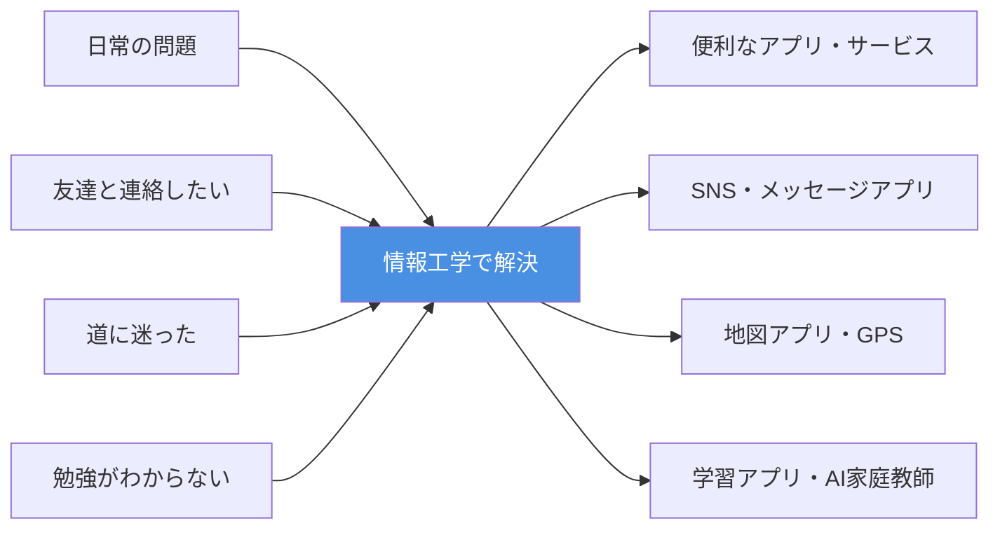

## 🏗️ 基本構造

情報工学は大きく**4つの柱**で構成されています。

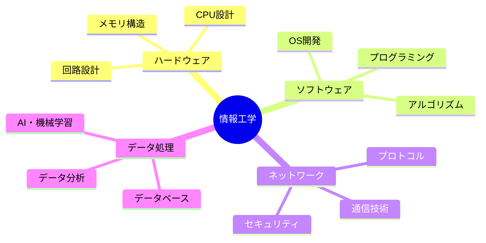

### 情報の流れ

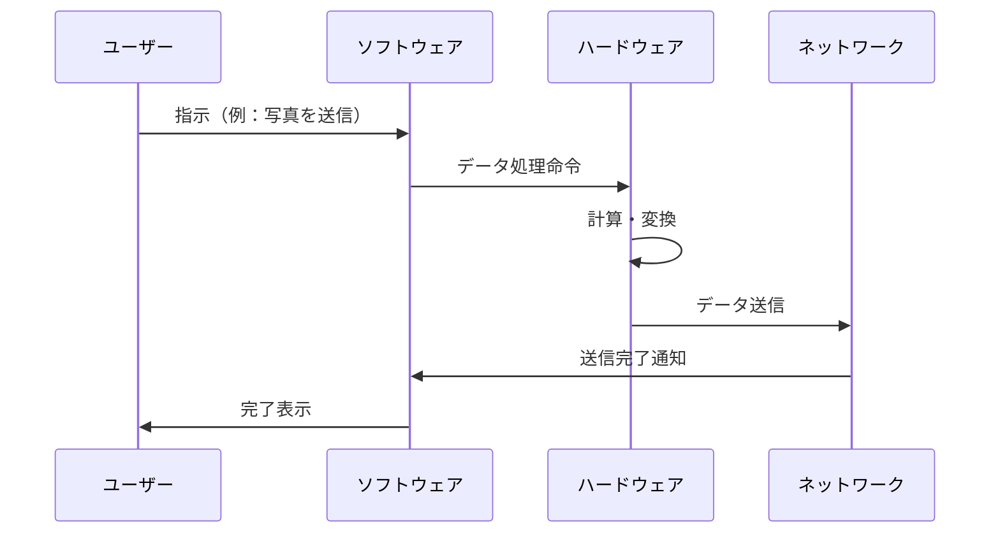

## ⚡ 主要技術

### 1. **アルゴリズム** - 問題解決の手順書
料理のレシピのように、コンピュータが問題を解く手順を定めたもの。効率的な手順ほど処理が速くなります。

### 2. **データ構造** - 情報の整理術
本棚の整理方法に似ています。辞書順、ジャンル別など、目的に応じた整理方法で情報を素早く取り出せます。

### 3. **プログラミング** - コンピュータへの指示書き
人間の言葉をコンピュータが理解できる言語に翻訳して、やってほしいことを伝える技術。

### 4. **人工知能（AI）** - 学習するコンピュータ
大量のデータから規則性を見つけ、予測や判断を自動化する技術。

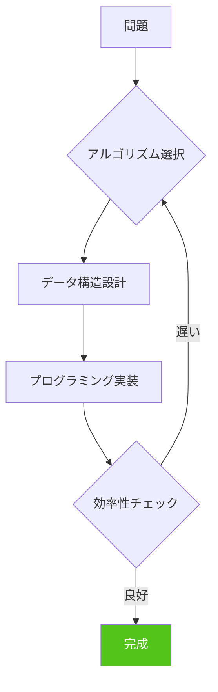

## 📜 時代背景と発見に至った経緯

### 第1章：計算機の誕生前（〜1940年代）

人類は古代から「計算を自動化したい」という夢を持っていました。そろばん、歯車式計算機など、手作業の計算を助ける道具が発明されます。

**転機**：第二次世界大戦中、暗号解読や弾道計算のため、高速計算の必要性が急増。

### 第2章：コンピュータの黎明期（1940〜1960年代）

- **1946年**: ENIAC（最初の電子計算機）誕生
- **1950年代**: プログラム内蔵方式の確立（ノイマン型コンピュータ）
- この時期、**情報工学という分野が独立**し始めます

### 第3章：ソフトウェア革命（1960〜1980年代）

- プログラミング言語の発展（FORTRAN、C言語など）
- アルゴリズム理論の体系化
- データベース技術の確立

### 第4章：インターネット時代（1990年代〜2000年代）

- ネットワーク技術が中心に
- Web技術の爆発的発展
- セキュリティの重要性増大

### 第5章：AI・ビッグデータ時代（2010年代〜現在）

- 機械学習・深層学習の実用化
- クラウドコンピューティング
- IoT（モノのインターネット）

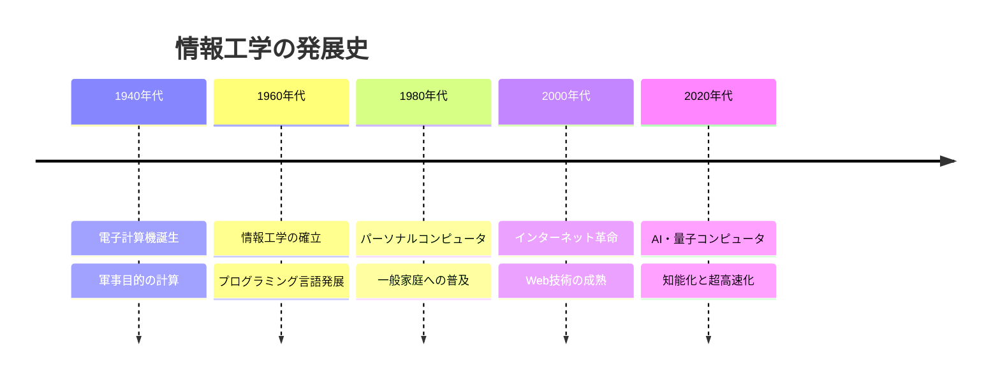

## 🎨 種類と特徴

情報工学は研究対象によって複数の分野に分かれます。

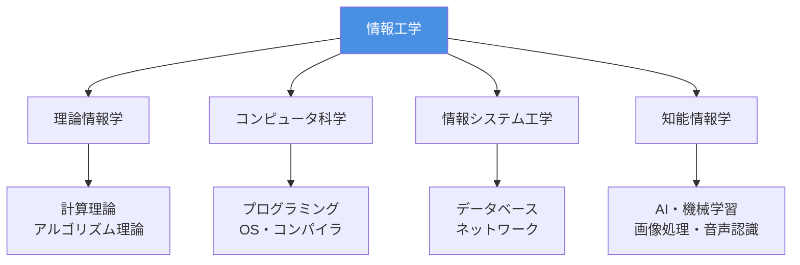

### 主要分野の比較

| 分野 | 焦点 | 身近な例 | 難易度 |
|------|------|----------|--------|
| **理論情報学** | 数学的基礎・計算可能性 | 暗号技術、圧縮アルゴリズム | ★★★★★ |
| **コンピュータ科学** | プログラム・システム設計 | アプリ開発、OS | ★★★☆☆ |
| **情報システム工学** | 実用システム構築 | 銀行システム、EC サイト | ★★★★☆ |
| **知能情報学** | AI・人間との対話 | 音声アシスタント、自動運転 | ★★★★★ |

## 📗 関連する用語

### 同義語・類似概念
- **コンピュータサイエンス（Computer Science）**: 情報工学とほぼ同義。学術的な文脈で使用
- **計算機科学**: 日本語での別称
- **情報科学**: より広義、数学的・理論的側面を強調

### 対義語・補完概念
- **情報技術（IT）**: 実践・応用面を指す（工学は理論・研究面）
- **電気工学**: ハードウェアの物理的側面を扱う

### 多義語の区別
**「情報」の3つの意味**:
1. **日常語**: ニュース、知識
2. **情報理論**: 不確実性の減少を数値化したもの（シャノンの情報量）
3. **情報工学**: コンピュータで処理可能なデータ全般

### 類義語の比較

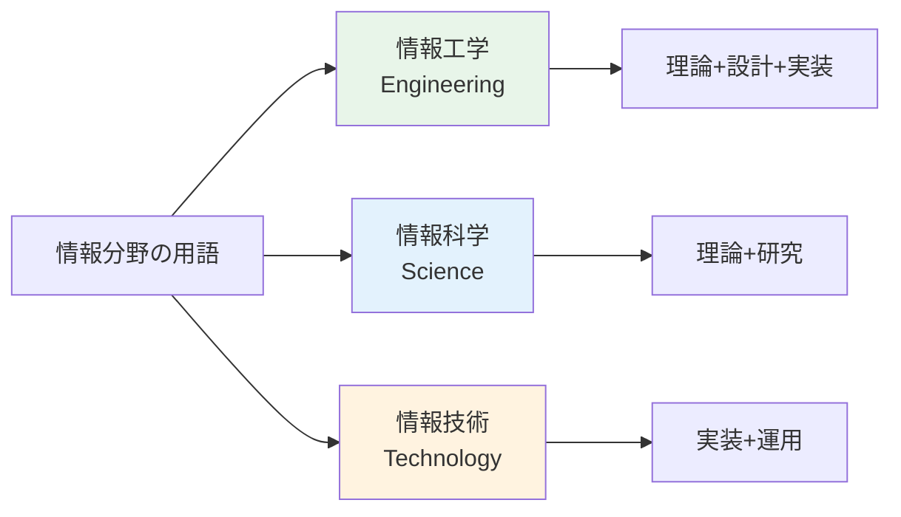

## 💡 メリットとデメリット

### メリット

1. **問題解決の自動化**
   - 繰り返し作業から人間を解放
   - 例：給与計算、在庫管理の自動化

2. **大量データの高速処理**
   - 人間では不可能な速度と規模
   - 例：1秒間に数百万件の検索

3. **遠隔コミュニケーション**
   - 地理的制約の克服
   - 例：ビデオ通話、リモートワーク

4. **知識の民主化**
   - 情報へのアクセス平等化
   - 例：オンライン教育、Wikipedia

5. **新産業の創出**
   - まったく新しい仕事とサービス
   - 例：YouTuber、アプリ開発者

### デメリット

1. **セキュリティリスク**
   - 個人情報漏洩、サイバー攻撃
   - 対策：暗号化、多要素認証

2. **デジタルデバイド**
   - 技術格差による社会的不平等
   - 対策：教育プログラム、使いやすいUI

3. **雇用への影響**
   - 自動化による仕事の消失
   - 対策：リスキリング、新職種創出

4. **依存とバグのリスク**
   - システム障害時の社会的影響大
   - 対策：冗長化、フェイルセーフ設計

5. **倫理的課題**
   - AIの判断の公平性、プライバシー
   - 対策：倫理ガイドライン、法整備

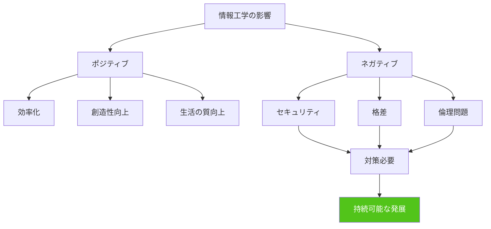

## 🚀 応用と実例

### 日常生活での応用

| 場面 | 使われている技術 | 情報工学の役割 |
|------|------------------|----------------|
| **朝起きる** | スマホアラーム | OS、タイマー処理、UI設計 |
| **通勤・通学** | 地図アプリ | GPS、経路探索アルゴリズム |
| **勉強・仕事** | オンライン会議 | ネットワーク、映像圧縮技術 |
| **買い物** | ECサイト | データベース、推薦システム |
| **娯楽** | 動画配信 | ストリーミング技術、CDN |
| **健康管理** | スマートウォッチ | センサー技術、データ分析 |

### 産業別の実例

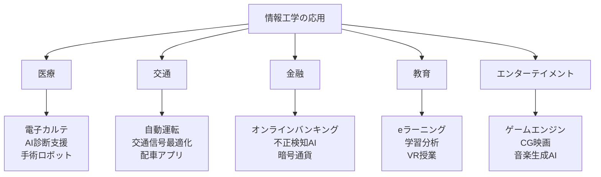

### 先端研究の例

1. **量子コンピュータ**: 現在のスーパーコンピュータを遥かに超える計算能力
2. **脳型コンピュータ**: 人間の脳を模倣した省エネ・高性能AI
3. **ブロックチェーン**: 改ざん不可能な分散型データベース
4. **メタバース**: 仮想空間での社会活動基盤

## 🔄 置換・変遷

### 何を置き換えたか

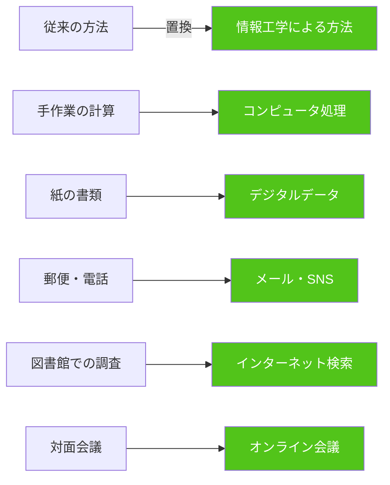

### 何に置き換えられつつあるか

現在も進化中で、一部の領域では次の技術に移行しつつあります：

- **クラウドからエッジコンピューティングへ**: データ処理を端末側で実行（遅延削減）
- **プログラミングからノーコード開発へ**: 専門知識なしでアプリ作成
- **検索からAI対話へ**: ChatGPTのような対話型情報取得

### 継承関係

**継承したもの（ルーツ）**:
- 数学（論理学、集合論、代数学）
- 電気工学（回路理論、信号処理）
- 言語学（形式言語理論）

**継承されたもの（派生分野）**:
- データサイエンス
- サイバーセキュリティ
- 生物情報学（バイオインフォマティクス）

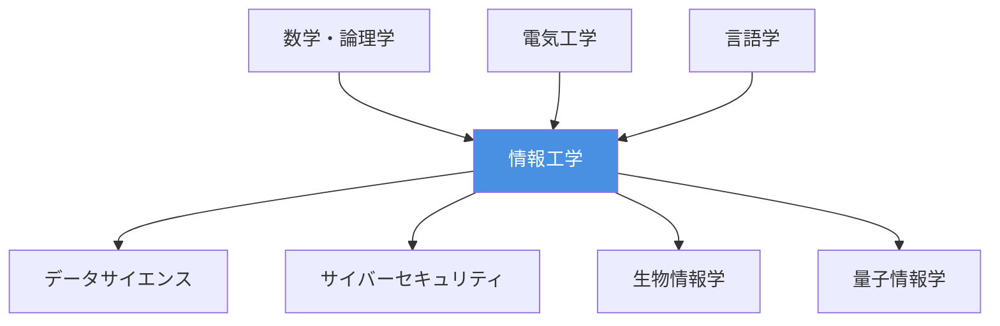

## 🔀 代替・競合

### 代替可能な技術

情報工学の一部機能は、以下でも実現可能（ただし効率や規模で劣る）：

| 情報工学の機能 | 代替手段 | 限界 |
|----------------|----------|------|
| データ保存 | 紙の記録 | 検索困難、劣化、容量小 |
| 計算 | 暗算・筆算 | 速度遅い、大規模処理不可 |
| 通信 | 郵便・電話 | 遅い、コスト高、記録残らない |
| 情報検索 | 図書館 | 時間かかる、最新情報不足 |

### 競合する分野

直接的な競合はありませんが、関連分野との境界領域があります：

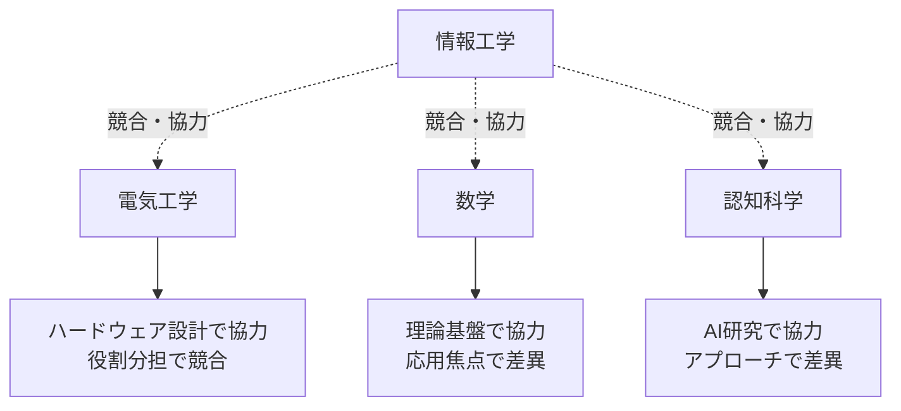

### 内部での競合（パラダイム競争）

情報工学内部でも、異なるアプローチが競合：

- **手続き型 vs 関数型プログラミング**
- **集中型 vs 分散型システム**
- **ルールベース vs 機械学習（AI手法）**

これらは競合しつつも共存し、用途によって使い分けられます。

## 🌍 実世界への影響とその後の発展

### 社会への影響

**経済面**:
- IT産業の急成長（世界経済の中心的存在に）
- 既存産業のデジタル変革（DX）
- ギグエコノミー、リモートワークの普及

**社会構造面**:
- 情報格差（デジタルデバイド）問題
- SNSによる社会運動の変化
- プライバシーとセキュリティのバランス

**文化面**:
- デジタルネイティブ世代の出現
- オンラインコミュニティ文化
- バーチャルとリアルの融合

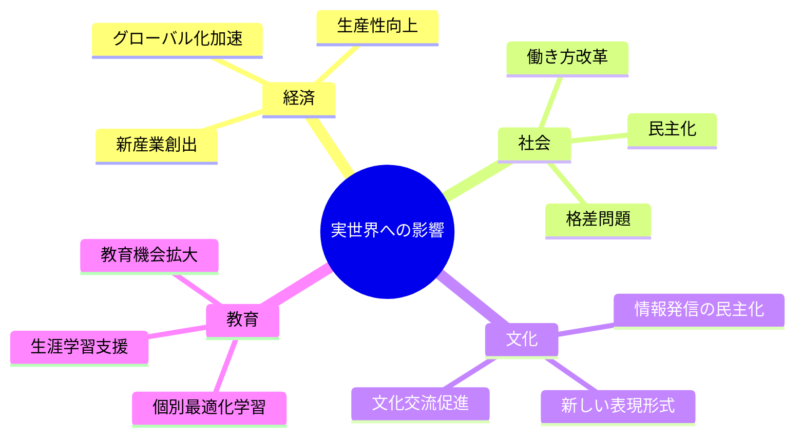

### 今後の発展予測

**短期（〜2030年）**:
- AI の社会実装加速（医療、法律、教育など）
- 6G通信による超高速・低遅延通信
- 量子コンピュータの実用化開始

**中期（2030〜2050年）**:
- 脳とコンピュータの直接接続（BMI）
- 汎用人工知能（AGI）の実現可能性
- デジタルツインによる都市管理

**長期（2050年〜）**:
- シンギュラリティ（技術的特異点）の可能性
- 人間の知能拡張技術
- 宇宙開発との融合

### 解決すべき課題

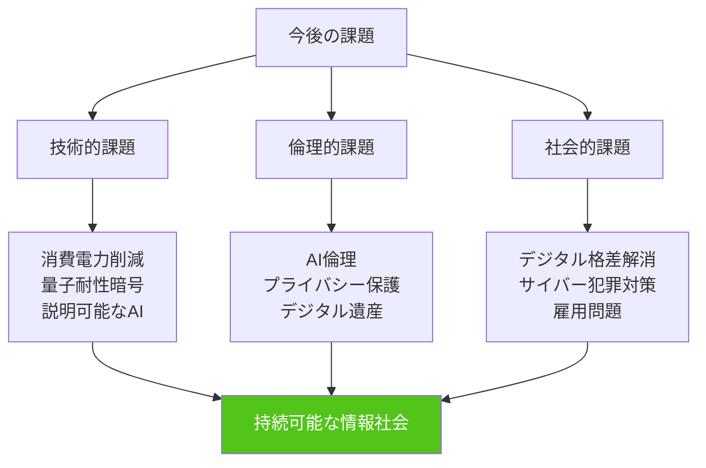

---

## 🎓 学習ロードマップ

初学者が情報工学を学ぶための推奨ステップ：

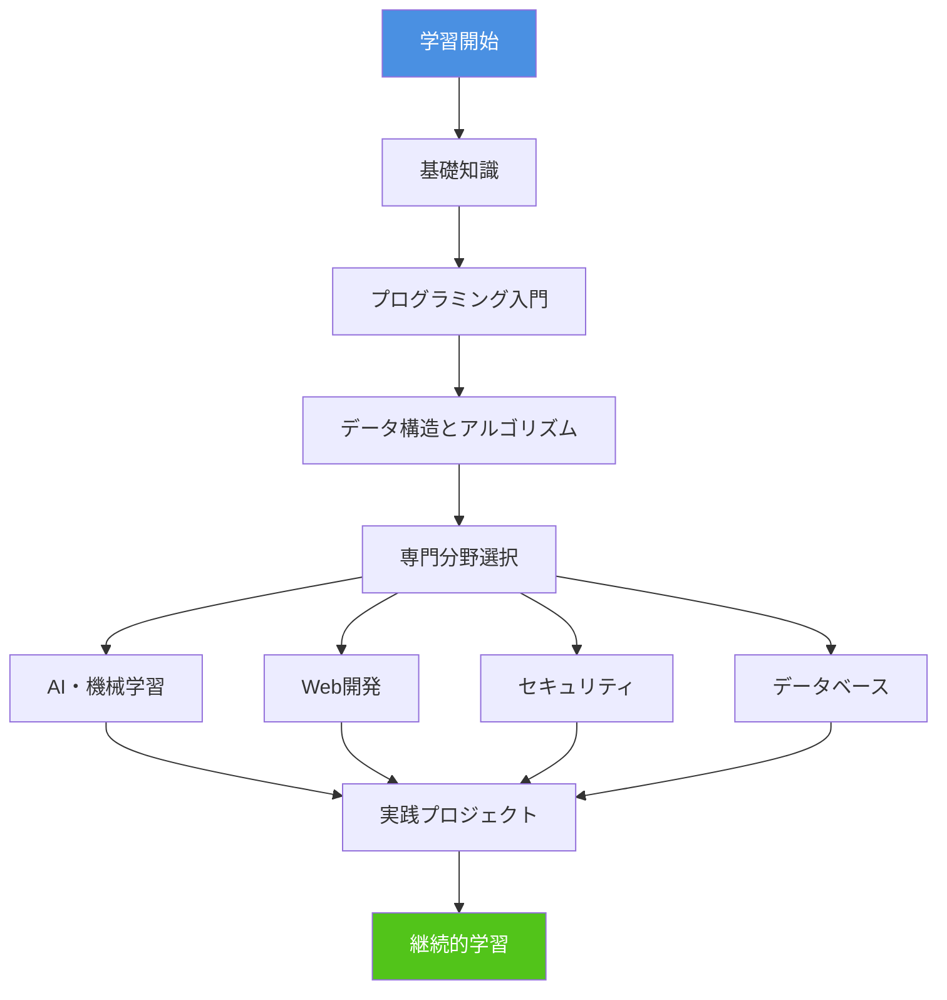

---
