情報技術（Information Technology）に関する工学の種類について

# 情報技術工学 - 初学者のための完全ガイド

## 🔍 一言要約
コンピュータとネットワークを使って情報を創り、運び、守る技術の体系

## 📚 目次
1. [はじめに](#-はじめに)
2. [情報技術工学の全体像](#-情報技術工学の全体像)
3. [主要な工学分野](#-主要な工学分野)
4. [時代背景と発展経緯](#-時代背景と発展経緯)
5. [分野間の関係性](#-分野間の関係性)
6. [関連用語](#-関連用語)
7. [メリットとデメリット](#-メリットとデメリット)
8. [実世界への影響](#-実世界への影響)

## 🌟 はじめに

スマートフォンで写真を撮り、SNSで共有する。この一連の動作には、実は10種類以上の工学技術が関わっています。画像を処理する技術、データを圧縮する技術、インターネットで送る技術、セキュリティで守る技術...これら全てが「情報技術工学」の領域です。

本ガイドでは、情報技術を支える工学の種類を、まるで料理の調理工程を理解するように、わかりやすく解説します。

## 🏗️ 情報技術工学の全体像

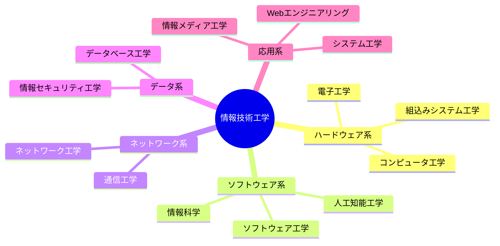

情報技術工学は「情報を扱う全ての技術」を研究・開発する学問です。大きく5つのカテゴリーに分類できます：

- **ハードウェア系**：物理的な機械を設計
- **ソフトウェア系**：プログラムやアルゴリズムを開発
- **ネットワーク系**：情報の伝達経路を構築
- **データ系**：情報の保存と保護を管理
- **応用系**：技術を実用サービスに統合

## ⚡ 主要な工学分野

### 1. コンピュータ工学（Computer Engineering）

**日常例**：パソコンやスマホの中身を設計する技術

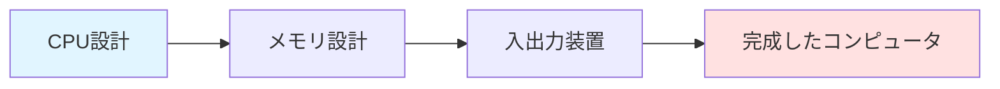

**何をする分野？**
- プロセッサ（脳）の設計
- メモリ（記憶）の最適化
- ハードとソフトの橋渡し

**身近な応用**：スマートフォンのチップ、ゲーム機の高速処理

---

### 2. ソフトウェア工学（Software Engineering）

**日常例**：アプリを作る「設計図」と「組み立て方」の学問

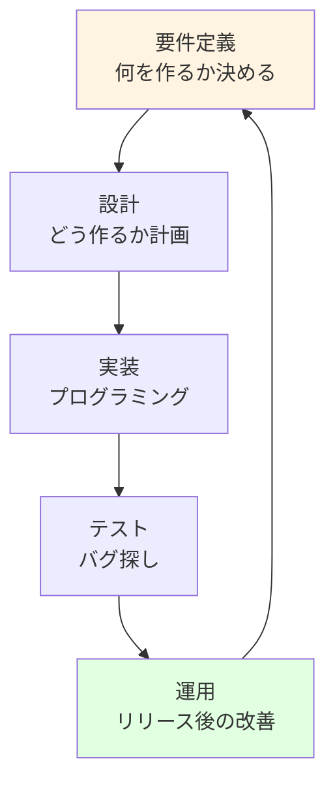

**何をする分野？**
- 大規模プログラムの設計方法
- チーム開発の効率化
- 品質保証とテスト手法

**身近な応用**：LINE、Instagram、Microsoft Officeの開発

---

### 3. ネットワーク工学（Network Engineering）

**日常例**：情報を遠くまで届ける「デジタル配送業」

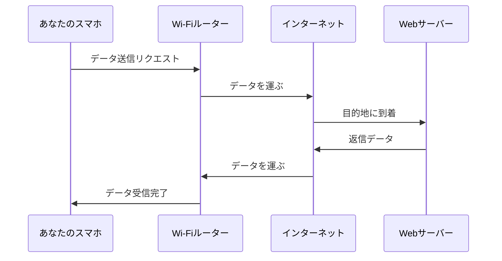

**何をする分野？**
- データの効率的な送受信方法
- ネットワーク機器の配置設計
- 通信速度の最適化

**身近な応用**：Wi-Fi、5G通信、クラウドサービス

---

### 4. データベース工学（Database Engineering）

**日常例**：情報を整理整頓して、すぐ取り出せる「デジタル図書館」

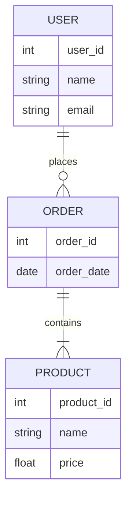

**何をする分野？**
- 大量データの効率的な保存方法
- データの検索速度向上
- データの整合性保証

**身近な応用**：Amazonの商品データベース、病院の電子カルテ

---

### 5. 情報セキュリティ工学（Information Security Engineering）

**日常例**：デジタル世界の「鍵と金庫」を設計

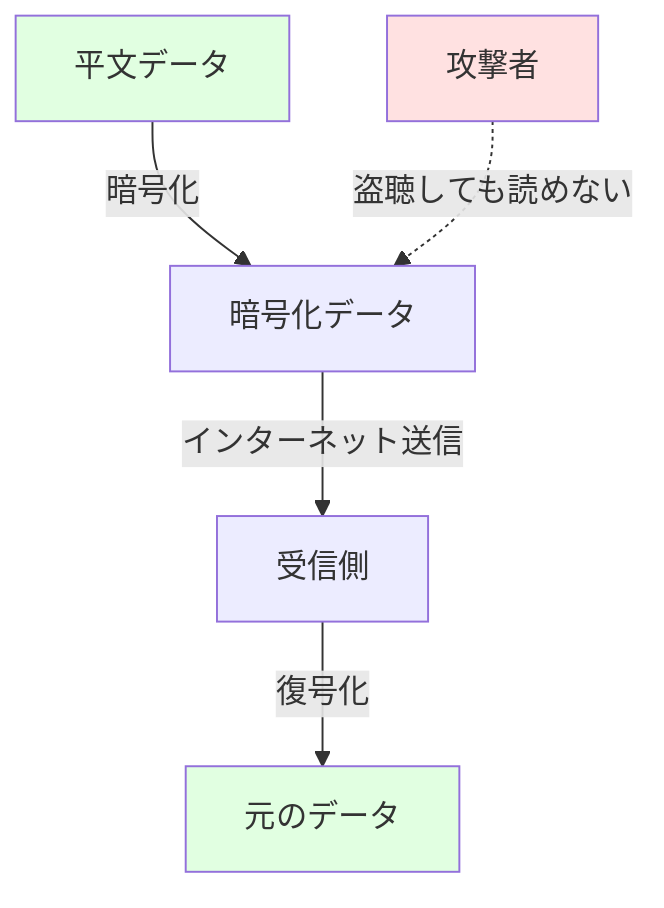

**何をする分野？**
- 暗号技術の開発
- 不正アクセス防止
- 個人情報保護

**身近な応用**：オンラインバンキング、パスワード管理、HTTPSの鍵マーク

---

### 6. 人工知能工学（AI Engineering）

**日常例**：コンピュータに「学習」と「判断」を教える技術

**何をする分野？**
- 機械学習アルゴリズム開発
- 画像・音声認識
- 自然言語処理

**身近な応用**：ChatGPT、顔認証、音声アシスタント（Siri）

---

### 7. 通信工学（Communication Engineering）

**日常例**：電波や光で情報を運ぶ「見えない配達人」

**何をする分野？**
- 無線通信技術
- 光ファイバー通信
- 信号処理

**身近な応用**：携帯電話、衛星放送、Bluetooth

---

### 8. Webエンジニアリング（Web Engineering）

**日常例**：インターネット上のお店や情報掲示板を作る技術

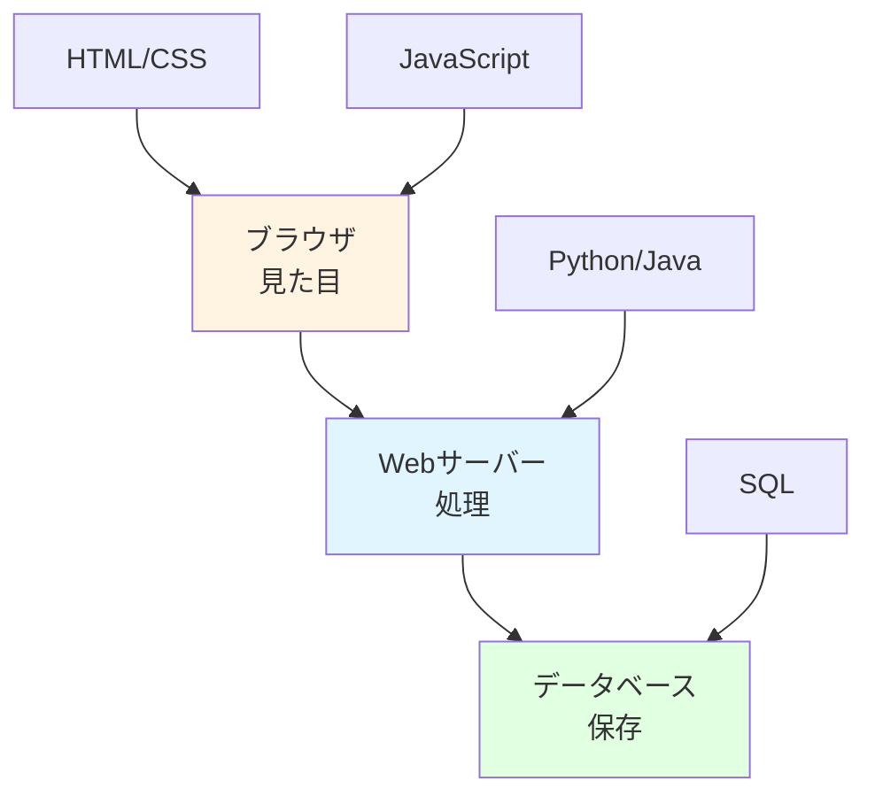

**何をする分野？**
- Webサイトの設計
- ユーザー体験（UX）の最適化
- サーバーとクライアントの連携

**身近な応用**：YouTube、Twitter、オンラインショッピング

---

### 9. 組込みシステム工学（Embedded Systems Engineering）

**日常例**：家電や車に潜む「小さなコンピュータ」の設計

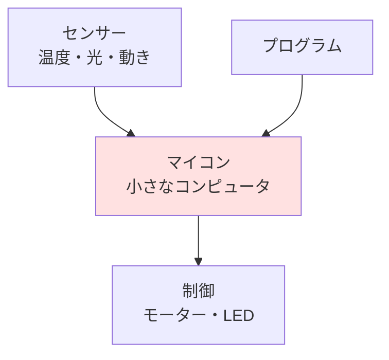

**何をする分野？**
- 省電力設計
- リアルタイム制御
- ハードウェア制約下のプログラミング

**身近な応用**：エアコンの温度調整、自動車のエンジン制御、ロボット掃除機

---

### 10. システム工学（Systems Engineering）

**日常例**：複雑な技術を「オーケストラ」のように統合

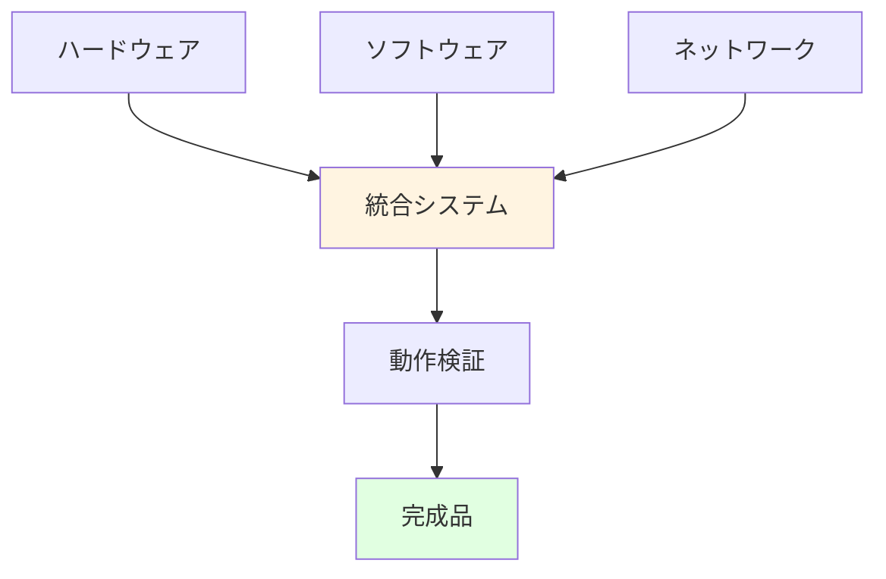

**何をする分野？**
- 大規模システムの設計
- 各技術の統合管理
- プロジェクト全体の最適化

**身近な応用**：新幹線の運行システム、工場の生産ライン、宇宙ロケット

---

## 📜 時代背景と発展経緯

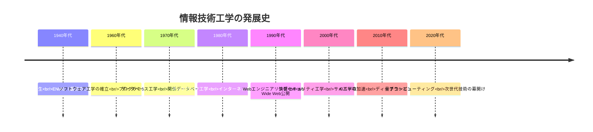

### 誕生の背景

**第二次世界大戦（1940年代）**
- 暗号解読のため、最初の電子計算機が開発
- 軍事目的から科学技術への転換

**情報爆発の時代（1960-1980年代）**
- データが増え続け、管理手法が必要に
- ソフトウェア危機（プログラムが複雑すぎて管理不能）

**インターネット革命（1990年代）**
- 世界中がつながり、新たな工学分野が誕生
- Webエンジニアリング、セキュリティ工学の重要性増大

**AI時代（2010年代以降）**
- ビッグデータと計算能力の向上
- 人間の知能をコンピュータで再現する試み

## 🔄 分野間の関係性

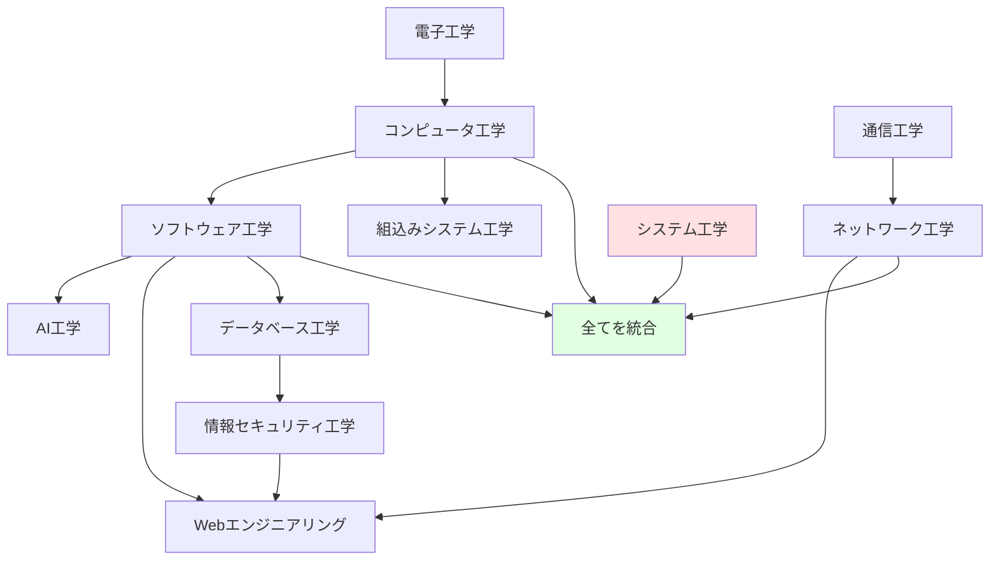

**依存関係の例**：
- **AI工学**はソフトウェア工学とデータベース工学の上に成立
- **Webエンジニアリング**はネットワーク工学、セキュリティ工学、ソフトウェア工学を統合
- **システム工学**は全分野を俯瞰して設計

## 📗 関連用語

### 同義語・類義語
| 用語 | 同義語 | 説明 |
|------|--------|------|
| 情報技術（IT） | インフォメーションテクノロジー | 情報を扱う技術全般 |
| コンピュータサイエンス | 計算機科学 | 理論寄り（工学より学問的） |
| ICT | 情報通信技術 | IT + 通信技術を強調 |

### 対義語
| 用語 | 対義語 | 説明 |
|------|--------|------|
| デジタル技術 | アナログ技術 | 0と1 vs 連続的な値 |
| ハードウェア | ソフトウェア | 物理 vs プログラム |

### 多義語の注意
- **工学（Engineering）**：実用化を目指す技術開発
- **科学（Science）**：原理の探求

## 💡 メリットとデメリット

### メリット
✅ **自動化による効率化**：人間の作業を機械が代行  
✅ **情報の瞬時共有**：世界中とリアルタイム通信  
✅ **大量データ処理**：人間では不可能な計算を実現  
✅ **イノベーション創出**：新サービス・ビジネスの誕生  

### デメリット
❌ **セキュリティリスク**：サイバー攻撃の脅威  
❌ **技術格差**：デジタルデバイド問題  
❌ **プライバシー懸念**：個人情報の収集・監視  
❌ **依存性増大**：システム障害時の社会的影響  

## 🚀 応用と実例

### 医療分野
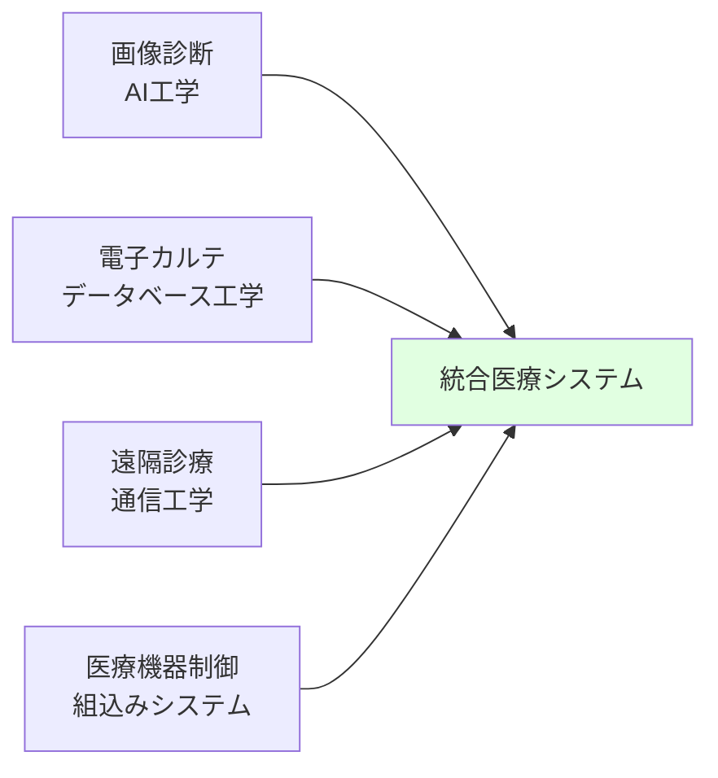

### 自動運転
- **センサー技術**：組込みシステム工学
- **画像認識**：AI工学
- **通信**：ネットワーク工学
- **制御**：システム工学

### エンターテインメント
- **ゲーム開発**：コンピュータ工学 + ソフトウェア工学
- **動画配信**：ネットワーク工学 + データベース工学
- **VR/AR**：コンピュータ工学 + 情報メディア工学

## 🔄 置換と変遷

### 置き換えたもの
| 旧技術 | 新技術（IT工学） | 変化 |
|--------|------------------|------|
| 紙の書類 | データベース | 検索・共有が瞬時に |
| 郵便 | ネットワーク通信 | 数日→数秒 |
| 手作業計算 | コンピュータ | 人間→機械 |
| 対面会議 | Web会議 | 場所の制約解消 |

### 継承したもの
- **論理学**→**コンピュータ科学**（アルゴリズムの基礎）
- **電気工学**→**電子工学**→**コンピュータ工学**
- **数学（暗号理論）**→**情報セキュリティ工学**

### 次世代への継承
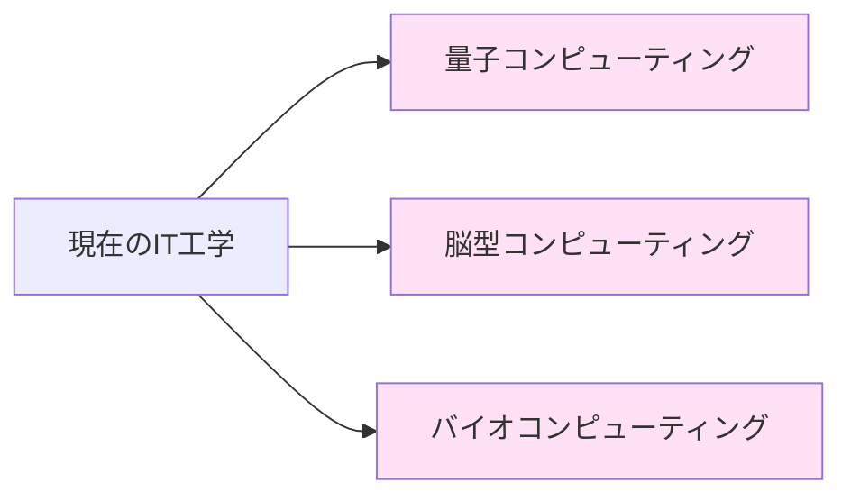

## 🌐 代替と競合

### 代替可能な技術
- **クラウドコンピューティング** ⇔ **エッジコンピューティング**  
  （中央集約 vs 分散処理）
  
- **関係データベース** ⇔ **NoSQLデータベース**  
  （構造化データ vs 柔軟なデータ）

### 競合する分野
- **AI開発**：ルールベース vs 機械学習
- **通信方式**：有線 vs 無線
- **セキュリティ**：暗号化 vs 生体認証

## 🌍 実世界への影響とその後の発展

### 社会への影響

**経済**
- IT産業の巨大化（GAFAM：Google, Apple, Facebook, Amazon, Microsoft）
- リモートワークの普及

**教育**
- オンライン教育の一般化
- プログラミング教育の必修化

**生活**
- スマートホーム
- キャッシュレス決済

### 未来展望

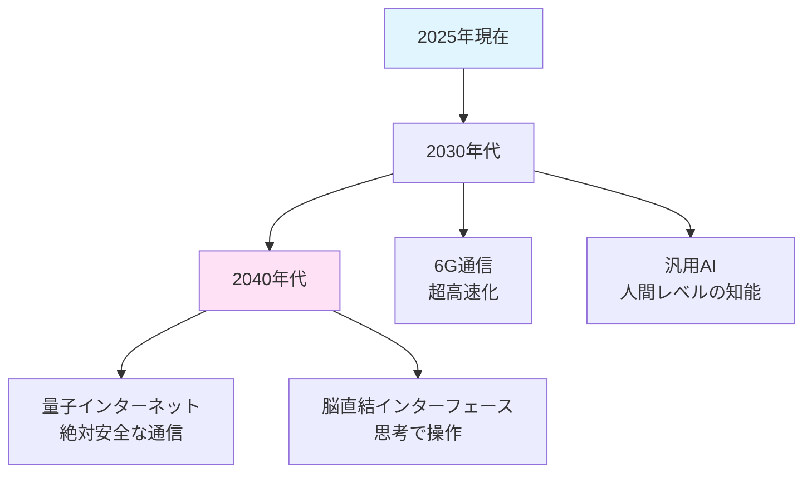

**期待される発展**：
1. **量子コンピュータ**：現在のスパコンの100万倍の計算能力
2. **脳型AI**：人間の脳を模倣した省電力AI
3. **完全自動化社会**：あらゆる作業をAIとロボットが実行

---

