# システムエンジニア - 初学者のための完全ガイド

## 🔍 一言要約
**ITシステムという「巨大な機械」を設計・構築・運用する、現代のデジタル建築家**

## 📚 目次
1. [🌟 はじめに](#-はじめに)
2. [🏗️ システムエンジニアの基本構造](#️-システムエンジニアの基本構造)
3. [⚡ 主要な仕事内容](#-主要な仕事内容)
4. [📜 職業の誕生と発展の歴史](#-職業の誕生と発展の歴史)
5. [🎨 種類と専門分野](#-種類と専門分野)
6. [📗 関連する用語](#-関連する用語)
7. [💡 メリットとデメリット](#-メリットとデメリット)
8. [🚀 実際の応用と事例](#-実際の応用と事例)
9. [🔄 職業の変遷と進化](#-職業の変遷と進化)
10. [🌍 社会への影響と未来展望](#-社会への影響と未来展望)

---

## 🌟 はじめに

### なぜシステムエンジニアが必要なのか？

想像してみてください。あなたが毎日使っているスマートフォンのアプリ、銀行のATM、オンラインショッピングサイト。これらすべてに「見えない設計図」があります。

**システムエンジニア（SE）**は、この設計図を描き、実際に動くシステムを作り上げる職業です。家を建てる建築家のように、デジタルの世界で「何が必要か」「どう作るか」「どう維持するか」を考え、実現します。

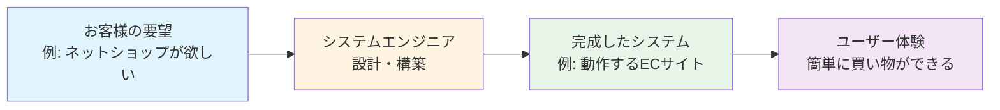

---

## 🏗️ システムエンジニアの基本構造

### SEの仕事は「5つの柱」で成り立っている

システムエンジニアの仕事は、家づくりのプロセスに似ています：

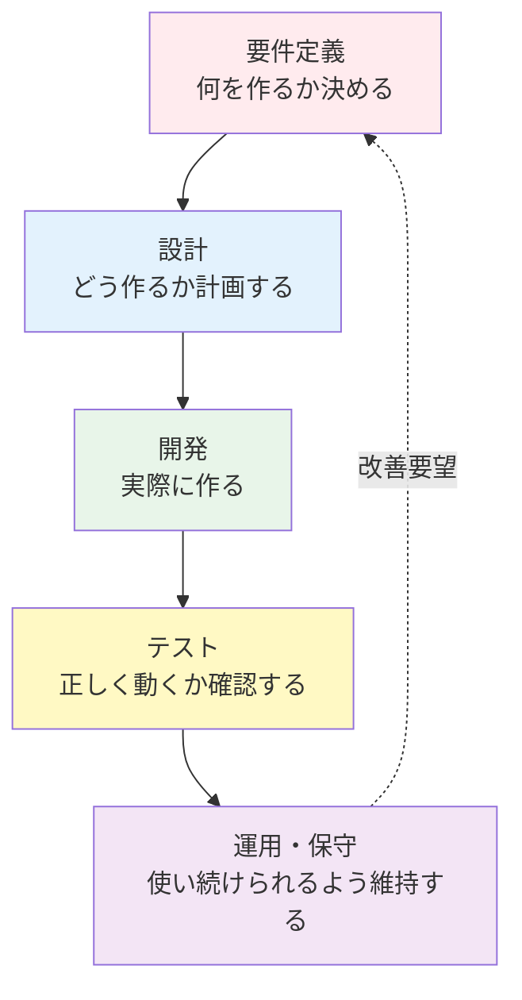

#### 各フェーズの詳細

**🔍 要件定義（ヒアリング）**
- お客様が「何を実現したいか」を聞き出す探偵のような作業
- 例：「毎月の売上管理を自動化したい」→ どんな機能が必要？

**📐 設計（設計図作成）**
- システムの全体像を描く建築士の仕事
- 例：データベースの構造、画面のレイアウト、処理の流れ

**👨‍💻 開発（プログラミング）**
- 設計図をもとに実際にコードを書く
- 自分で書く場合とプログラマーに指示する場合がある

**🔬 テスト（品質チェック）**
- バグ（不具合）がないか徹底的に確認
- 例：100万件のデータでも正常に動くか？

**🔧 運用・保守（メンテナンス）**
- システムが安定して動き続けるよう監視・改善
- トラブル対応や機能追加も含む

---

## ⚡ 主要な仕事内容

### SEの1日の流れと具体的なタスク

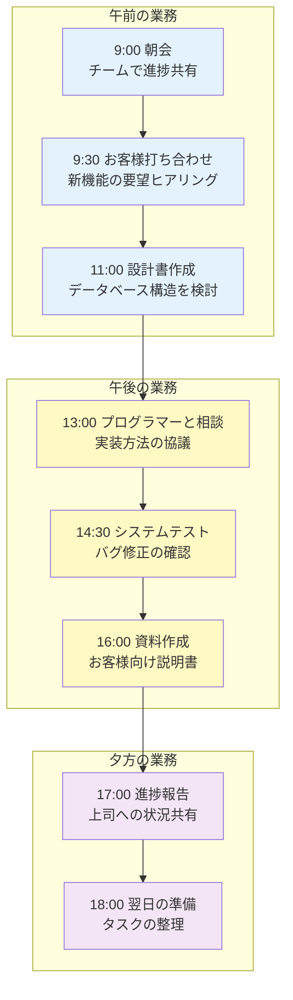

### 必要なスキルセット

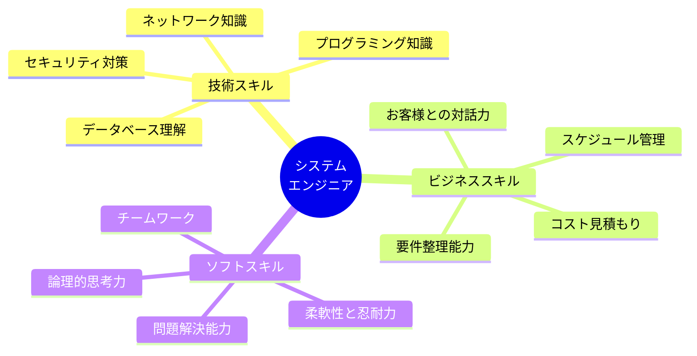

---

## 📜 職業の誕生と発展の歴史

### コンピューター黎明期から現代まで

**1950年代：職業の萌芽**
当初、コンピューターは軍事・科学研究用の巨大な機械でした。操作する人は「オペレーター」と呼ばれ、専門技術者というより「機械を動かす人」でした。

**1960年代：システム設計者の誕生**
企業でコンピューターが使われ始めると、「何を計算させるか」を考える人が必要になりました。これが初期のシステムエンジニアです。

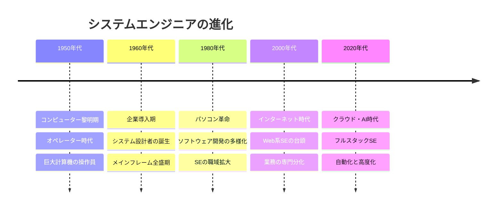

**1980年代：パソコンの普及**
個人用コンピューターが登場し、ソフトウェア会社が急増。「プログラムを作る人」と「システム全体を設計する人」が分かれ始めました。

**2000年代以降：インターネット革命**
Webサービスが爆発的に増加。システムエンジニアの仕事は、社内システムからグローバルなサービスへと拡大しました。

---

## 🎨 種類と専門分野

### SEの多様な専門領域

システムエンジニアは、扱う分野によって大きく異なるスキルが求められます。

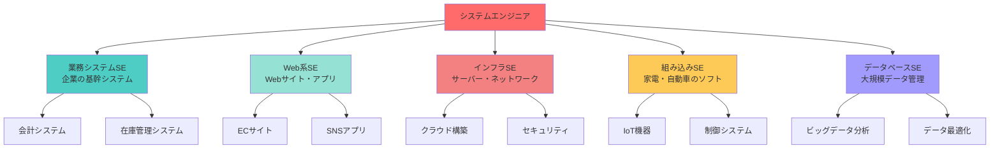

### 専門分野別の特徴比較

| 分野 | 主な仕事 | 求められるスキル | 活躍の場 |
|------|---------|-----------------|---------|
| **業務系SE** | 企業の業務を効率化するシステム構築 | 業務知識、設計力、コミュニケーション | SIer、メーカー系IT企業 |
| **Web系SE** | Webサービス・アプリの開発 | 最新技術、UX設計、スピード感 | IT系ベンチャー、メガベンチャー |
| **インフラSE** | サーバー・ネットワークの構築・運用 | ハードウェア知識、障害対応力 | クラウド事業者、通信会社 |
| **組み込みSE** | 製品に組み込むソフトウェア開発 | C言語、リアルタイム制御 | 自動車メーカー、家電メーカー |
| **データベースSE** | 大規模データの設計・最適化 | SQL、パフォーマンスチューニング | 金融機関、データセンター |

---

## 📗 関連する用語

### 職種の同義語・類義語

**同義語（ほぼ同じ意味）**
- **SE（エスイー）**：System Engineerの略称
- **システム開発エンジニア**：開発に重点を置いた表現

**類義語（似ているが微妙に違う）**
- **プログラマー（PG）**：主にコードを書く人。SEは設計も担当
- **ソフトウェアエンジニア**：より広い範囲のソフトウェア開発者
- **ITコンサルタント**：技術提案に特化。開発は別の人が行うことも
- **プロジェクトマネージャー（PM）**：プロジェクト全体の管理者。SEより上流工程

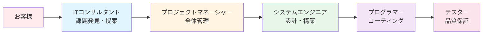

### 対義語・多義語

**対義語的な存在**
- **ハードウェアエンジニア**：物理的な機器を設計・開発する人（SEはソフトウェア側）

**多義語の注意**
「システムエンジニア」という言葉は、国や企業によって指す範囲が異なります：
- 日本：設計からテストまで幅広く担当
- 欧米：より専門分化されており、"Software Engineer"などの呼称が一般的

---

## 💡 メリットとデメリット

### システムエンジニアという職業の光と影

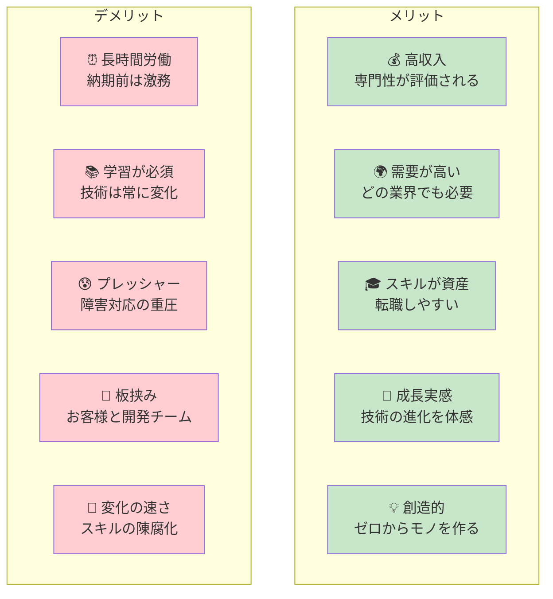

### 詳細な解説

**✨ メリット**

1. **経済的安定性**：平均年収は400万〜800万円。経験と専門性で1000万円超も可能

2. **キャリアの選択肢**：技術を極める、マネジメントに進む、独立するなど多様な道

3. **社会貢献の実感**：自分が作ったシステムで多くの人が便利になる達成感

4. **グローバルな可能性**：プログラミング言語は世界共通。海外でも活躍可能

5. **在宅勤務の可能性**：コロナ禍でリモートワークが一般化し、柔軟な働き方が実現

**⚠️ デメリット**

1. **精神的負荷**：システム障害が起きると深夜でも対応が必要な場合がある

2. **コミュニケーションストレス**：技術を知らないお客様に説明する難しさ

3. **責任の重さ**：金融システムなど、ミスが大きな損失につながる分野もある

4. **健康リスク**：長時間のデスクワークによる運動不足、眼精疲労

5. **キャッチアップの疲労**：新技術が次々登場し、学習が追いつかないことも

---

## 🚀 実際の応用と事例

### 私たちの生活を支えるSEの仕事

システムエンジニアが作ったシステムは、あなたの日常のあらゆる場面に存在します。

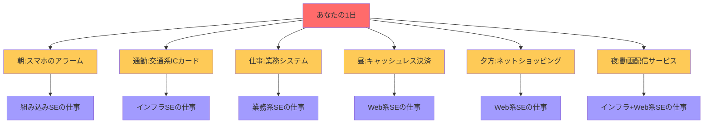

### 具体的な成功事例

**事例1：銀行のATMシステム（1970年代〜）**
- 課題：窓口業務の効率化、24時間サービス
- SEの役割：現金引き出しの安全な仕組み設計、不正防止の実装
- 成果：銀行員の負担軽減、利用者の利便性向上

**事例2：ECサイトの構築（2000年代〜）**
- 課題：実店舗を持たずに商品を販売したい
- SEの役割：在庫管理、決済システム、配送連携の設計
- 成果：小規模事業者でも全国販売が可能に

**事例3：自動運転車の制御システム（2010年代〜）**
- 課題：安全に自動走行する仕組み
- SEの役割：センサーデータの処理、瞬時の判断アルゴリズム設計
- 成果：交通事故の削減、高齢者の移動支援

**事例4：コロナワクチン予約システム（2021年）**
- 課題：全国民が公平に予約できる仕組み
- SEの役割：大量アクセスに耐えるインフラ設計、予約の二重防止
- 成果：短期間で効率的なワクチン接種を実現

---

## 🔄 職業の変遷と進化

### 何を置き換えたか

**紙と手作業からの解放**

かつて、企業の業務はすべて紙の書類と人の手で行われていました。システムエンジニアが作るシステムは、これを置き換えました。

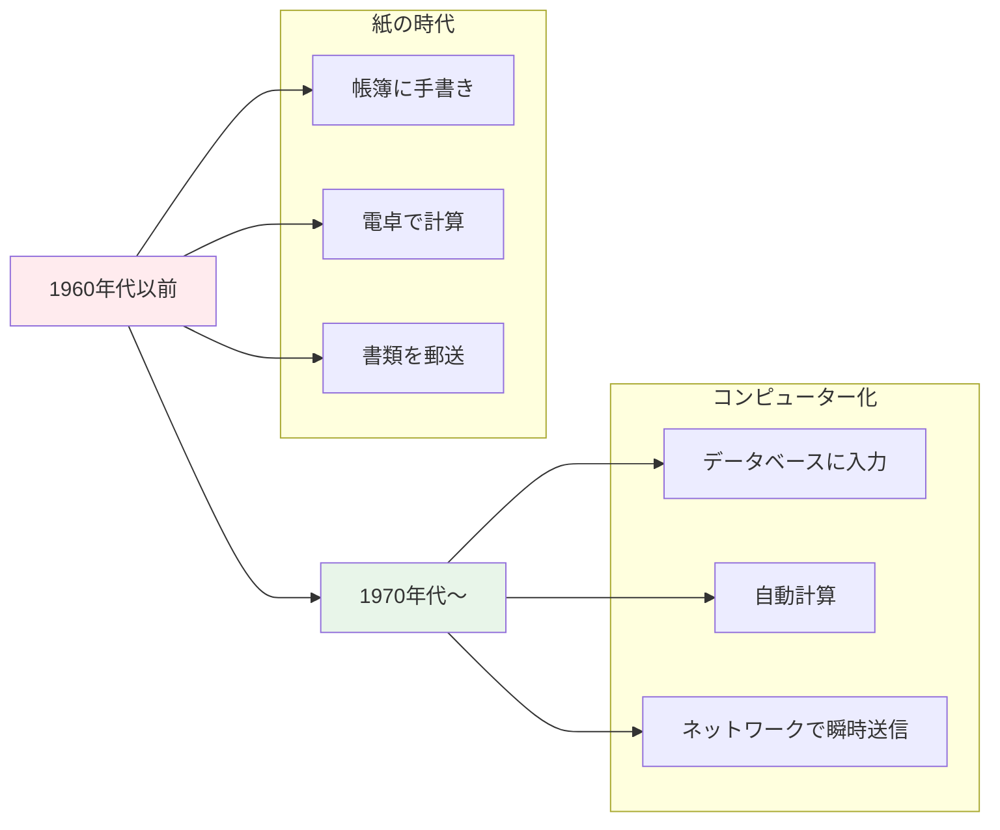

**具体例：**
- 銀行の通帳記帳 → ATMとオンラインバンキング
- 図書館のカード目録 → 電子検索システム
- 手書きの設計図 → CADシステム

### 何に置き換えられつつあるか

**AIと自動化の波**

現在、システムエンジニアの一部の仕事は、AIや自動化ツールに置き換えられつつあります。

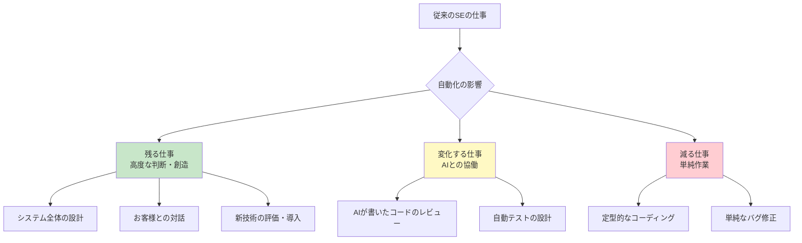

**具体例：**
- GitHub Copilot：AIがコードを自動生成
- ノーコード/ローコードツール：プログラミング不要でアプリ作成
- 自動テストツール：テストの自動化

### 何を継承したか

システムエンジニアという職業は、古くからある「エンジニアリング思考」を継承しています：

- **建築家**：全体設計、構造の安全性確保
- **技師**：論理的思考、問題解決アプローチ
- **職人**：品質へのこだわり、継続的な技術向上

### 何に継承されるか

SEの仕事は、今後さらに専門分化・高度化していくでしょう：

- **AIエンジニア**：機械学習モデルの設計・運用
- **クラウドアーキテクト**：クラウドネイティブなシステム設計
- **DevOpsエンジニア**：開発と運用の融合
- **セキュリティエンジニア**：サイバー攻撃からの防御

---

## 🔀 代替と競合

### 何に代替できるか

システムエンジニアのスキルは、多くの職業で応用可能です。

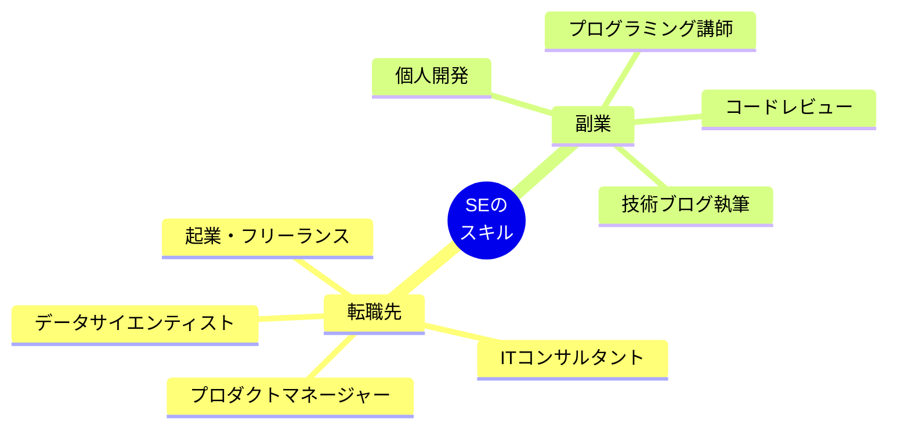

**代替可能性の例：**
- 論理的思考力 → 経営企画、戦略立案
- 問題解決能力 → コンサルタント、アナリスト
- 技術知識 → テクニカルライター、研修講師

### 何に代替されるか

一部の業務は、すでに別の手段で代替可能になっています。

**ノーコード/ローコードツール**
- Webflowなど：Webサイト制作にSE不要
- Airtableなど：簡易データベースアプリを誰でも作成可能

**クラウドサービス**
- AWS、Azure：インフラ構築が大幅に簡略化
- SaaSツール：既製品で済む業務が増加

### 競合する職業

現代のIT業界では、職種の境界が曖昧になっています。

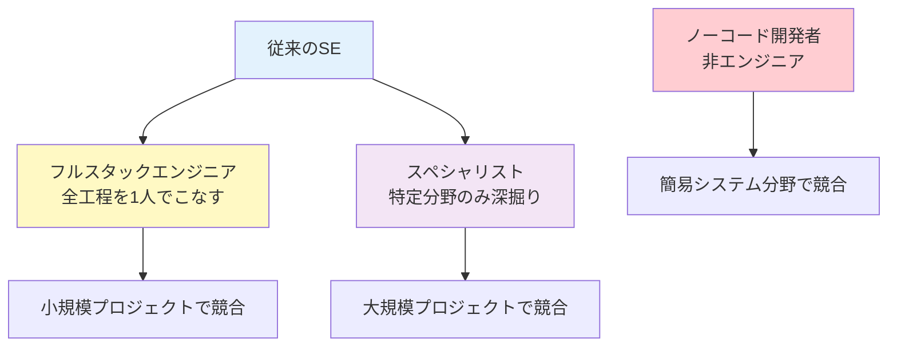

**競合例：**
- フルスタックエンジニアが小規模案件を独占
- データサイエンティストがデータ分野で専門性を発揮
- 非エンジニアがノーコードツールで簡易システムを自作

---

## 🌍 社会への影響と未来展望

### システムエンジニアが変えた世界

**産業革命に匹敵する変革**

18世紀の産業革命が蒸気機関で物理的労働を変えたように、システムエンジニアは情報処理で知的労働を変えました。

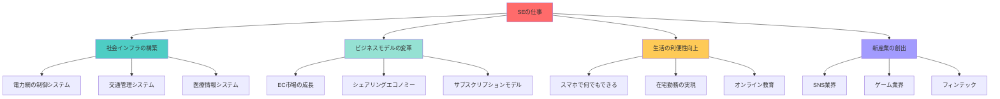

### 未来のシステムエンジニア像

**2030年代のSEはこうなる（予測）**

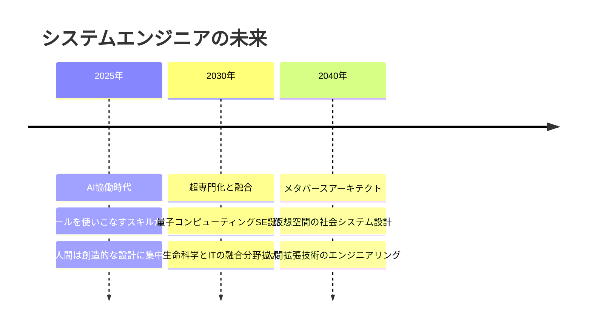

**求められるスキルの変化**

| 時代 | 必須スキル | 重要度が下がるスキル |
|------|-----------|---------------------|
| **現在** | プログラミング、データベース設計 | - |
| **2030年** | AIプロンプト設計、倫理的判断 | 単純なコーディング |
| **2040年** | 人間理解、創造的発想 | 定型的な設計作業 |

### 次世代が目指すべき方向性

**これからSEを目指す人へ：3つの戦略**

1. **AIとの共存を学ぶ**
   - AIが得意なこと（コード生成、パターン認識）
   - 人間が得意なこと（創造、倫理判断、対人理解）
   - 両者の最適な組み合わせを考える

2. **ドメイン知識を深める**
   - IT技術だけでなく、特定業界の専門知識を持つ
   - 例：医療×IT、金融×IT、農業×IT

3. **生涯学習の習慣化**
   - 技術は5年で変わる前提で学び続ける
   - オンラインコース、技術書、コミュニティ参加

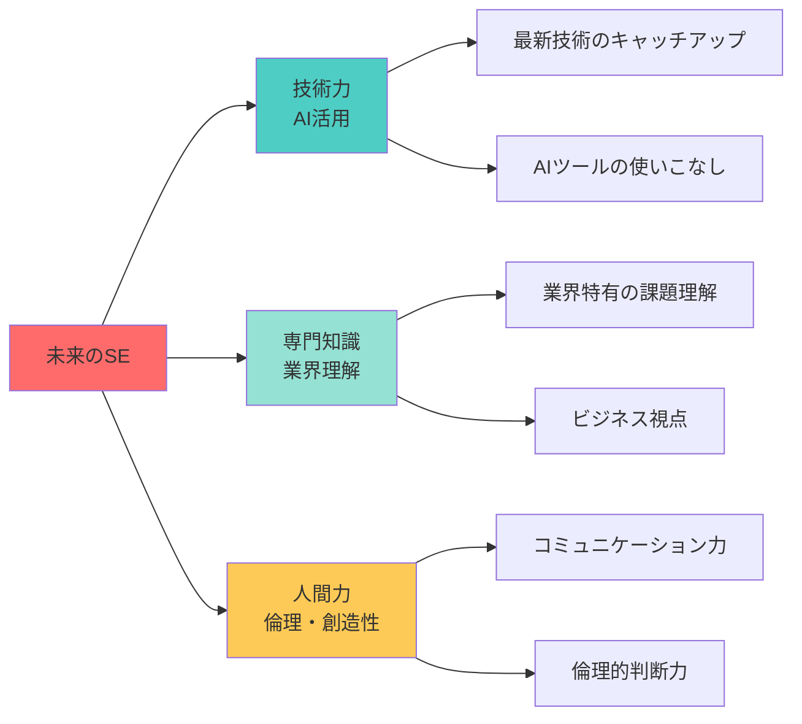

### 社会課題の解決者として

システムエンジニアは、今後ますます社会課題の解決に直接関わっていきます。

**SDGs（持続可能な開発目標）への貢献例**

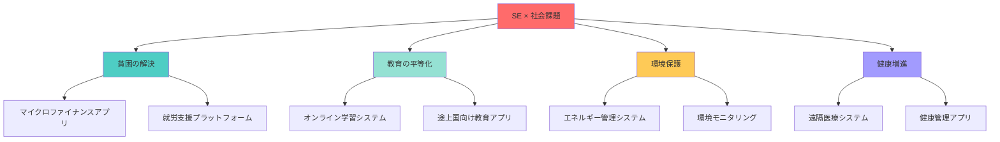

**具体的なプロジェクト例：**

- **アフリカの農業支援**：スマホで天候予測・市場価格を提供し、農家の収入向上
- **災害予測システム**：地震・津波の早期警報で人命を救う
- **医療格差の解消**：オンライン診療で地方でも専門医の診察を受けられる
- **教育格差の是正**：無料のプログラミング学習プラットフォームで誰でも学べる環境

### 倫理的課題と責任

技術の進歩とともに、システムエンジニアが直面する倫理的ジレンマも増えています。

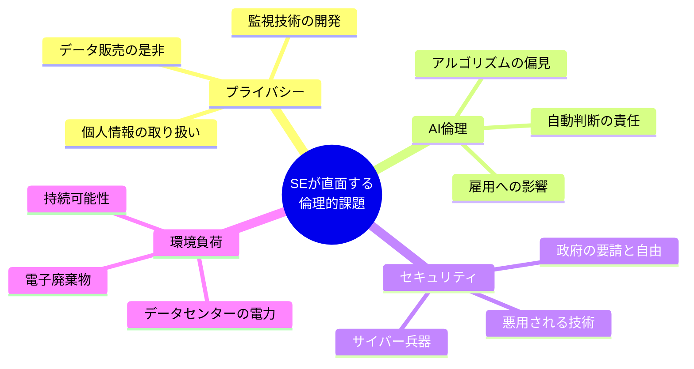

**SEが意識すべき倫理原則：**

1. **透明性**：システムがどう動くか説明できる
2. **公平性**：特定の人を不利にしない設計
3. **安全性**：悪用されにくい仕組み
4. **プライバシー尊重**：必要最小限のデータ収集
5. **説明責任**：問題が起きた時に対応できる

### 終わりに：SEという職業の本質

システムエンジニアは単なる「技術者」ではありません。

**21世紀の社会設計者**として、私たちの未来を形作る重要な役割を担っています。

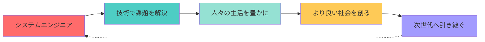

**これからSEを目指す人へのメッセージ：**

この職業は、決して楽な道ではありません。常に学び続け、変化に適応し、時には深夜までトラブル対応をすることもあります。

しかし、**自分が作ったシステムで誰かが笑顔になる瞬間**、**社会の仕組みが便利になる実感**、**ゼロから何かを創り上げる達成感**は、他では得られない喜びです。

もしあなたが「世界を少しでも良くしたい」「技術で人を助けたい」と思うなら、システムエンジニアという選択肢は、あなたの人生を豊かにする素晴らしいキャリアになるでしょう。

---

