情報技術（Information Technology）に関する数学の種類について
# 情報技術のための数学 - 初学者のための完全ガイド

## 🔍 一言要約
ITを支える数学は「データを扱う」「論理を組み立てる」「最適化する」ための道具箱

## 📚 目次
1. [はじめに](#-はじめに)
2. [全体像](#-全体像)
3. [6つの主要分野](#-6つの主要分野)
4. [時代背景と発展経緯](#-時代背景と発展経緯)
5. [関連用語](#-関連する用語)
6. [メリットとデメリット](#-メリットとデメリット)
7. [実世界への応用](#-応用と実例)
8. [学習の変遷](#-置換変遷)
9. [代替と競合](#-代替競合)
10. [影響と未来](#-実世界への影響とその後の発展)

## 🌟 はじめに

情報技術（IT）の背後には、実は数学が隠れています。例えば：
- **スマホの顔認識** → 線形代数（画像を数字の集まりとして処理）
- **Google検索の順位** → グラフ理論（ウェブページの繋がりを分析）
- **Netflix のおすすめ** → 統計学（あなたの好みをパターンから予測）

数学は「裏方のヒーロー」。見えないところでITを動かしています。

## 🏗️ 全体像

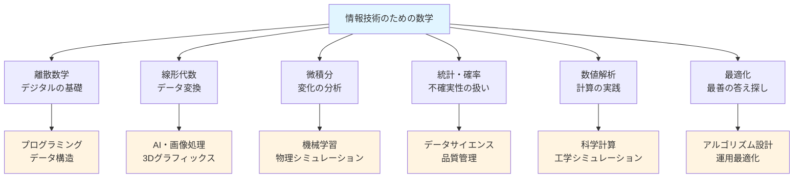

## ⚡ 6つの主要分野

### 1️⃣ 離散数学（Discrete Mathematics）

**日常例で言うと**: レゴブロック（個別のパーツを組み合わせる）

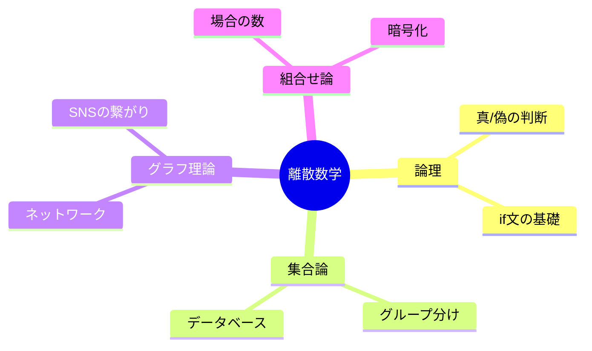

**何に使う？**
- プログラミングのロジック構築
- データベース設計
- ネットワーク経路の最適化
- 暗号技術

**特徴**: 「連続していない」数や構造を扱う（整数、ON/OFF、繋がっている/いないなど）

---

### 2️⃣ 線形代数（Linear Algebra）

**日常例で言うと**: 写真の拡大縮小・回転（画像を数字の表として変形）

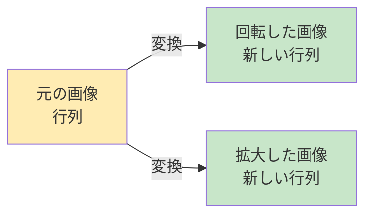

**何に使う？**
- AI（ディープラーニング）
- 3Dゲームのグラフィックス
- 画像・音声処理
- 量子コンピューティング

**キーワード**: ベクトル（方向と大きさ）、行列（数字の表）、変換（データの変形）

---

### 3️⃣ 微積分（Calculus）

**日常例で言うと**: 車のスピードメーター（瞬間の変化率を測る）

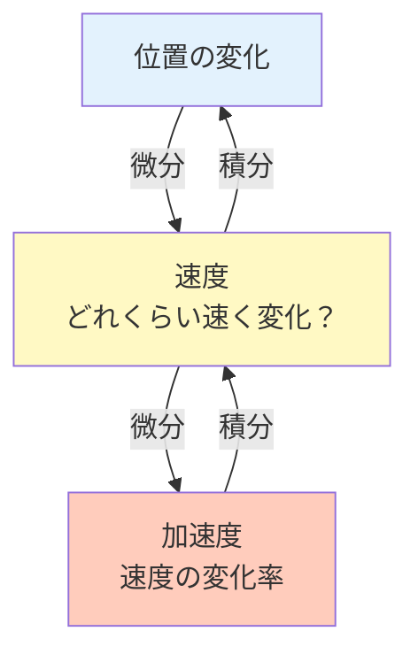

**何に使う？**
- 機械学習の最適化（誤差を最小化）
- 物理エンジン（ゲーム内の動き）
- 信号処理（音や電波の分析）

**2つの逆操作**:
- **微分**: 「変化の速さ」を求める
- **積分**: 「積み重ねた量」を求める

---

### 4️⃣ 統計学・確率論（Statistics & Probability）

**日常例で言うと**: 天気予報（過去のデータから未来を予測）

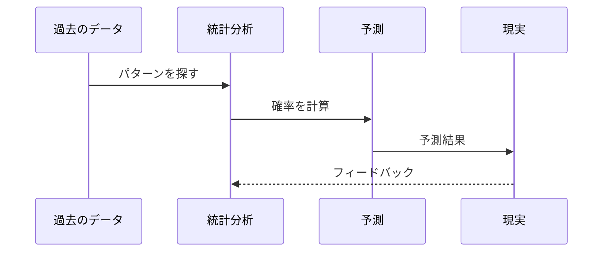

**何に使う？**
- データ分析（ビジネス判断）
- AIの学習（パターン認識）
- リスク管理（金融、保険）
- A/Bテスト（ウェブサービス改善）

**核心概念**: 
- **統計**: データから傾向を見つける
- **確率**: 不確実な未来を数値化

---

### 5️⃣ 数値解析（Numerical Analysis）

**日常例で言うと**: 電卓（複雑すぎて手計算できない問題を近似計算）

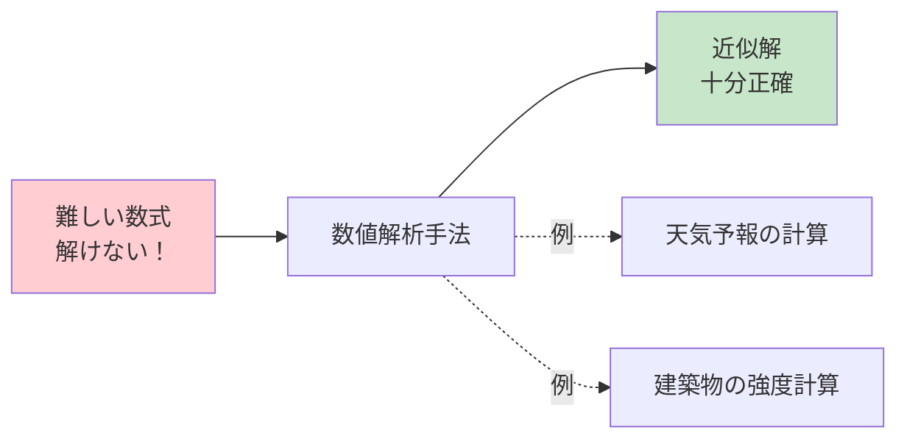

**何に使う？**
- 科学技術計算（宇宙開発、気象予測）
- 工学シミュレーション（橋の設計）
- 大規模データ処理

**重要性**: コンピュータは「完全な答え」より「十分正確な答え」を高速に出す

---

### 6️⃣ 最適化理論（Optimization）

**日常例で言うと**: カーナビ（最短ルートを探す）

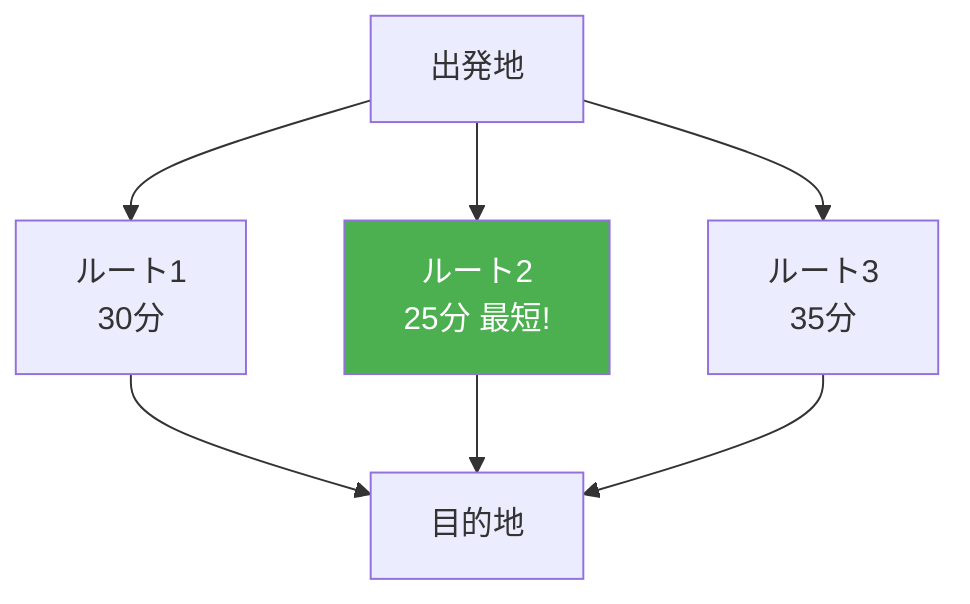

**何に使う？**
- アルゴリズム設計（効率的なプログラム）
- 物流（配送ルート最適化）
- 機械学習（最良のモデル探し）
- 資源配分（予算、人員）

**目標**: 「制約条件の中で最善の解を見つける」

## 📜 時代背景と発展経緯

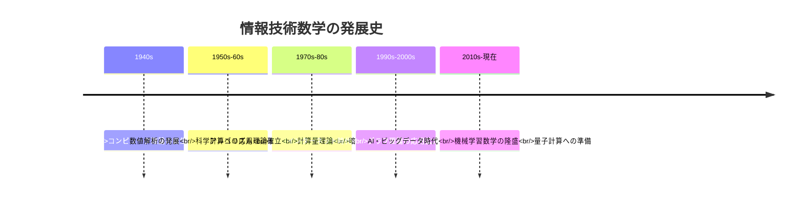

### 📖 ストーリー

**1940年代**: 第二次世界大戦中、暗号解読のため「計算する機械」が必要に。アラン・チューリングが理論を構築。

**1950-60年代**: コンピュータは「連続的な現実世界」を「離散的なデジタル」に変換する必要があった。ここで離散数学と数値解析が橋渡し役に。

**1970-80年代**: プログラミングが普及。「効率的なアルゴリズム」を作るため、最適化理論と計算量理論が発展。

**1990-2000年代**: インターネット爆発。ウェブページの繋がり（グラフ理論）、検索アルゴリズム、暗号化が重要に。

**2010年代以降**: ビッグデータとAI。統計学と線形代数が機械学習の核心に。微積分で「学習」を数学的に最適化。

## 📗 関連する用語

### 同義語・類義語
- **離散数学** ≈ 組合せ数学、有限数学
- **数値解析** ≈ 計算数学、科学計算
- **最適化** ≈ 数理計画法、オペレーションズリサーチ

### 対比概念
- **離散数学** ⟷ **連続数学**（微積分）
  - 離散: 1,2,3...（整数、デジタル）
  - 連続: 実数全体（アナログ）

### 多義語の整理
- **行列（Matrix）**: 
  - 数学: 数字を長方形に並べたもの
  - 映画: 仮想現実の世界（偶然の一致？）
  
- **関数（Function）**:
  - 数学: 入力→出力の対応関係
  - プログラミング: 処理をまとめたコード

## 💡 メリットとデメリット

### ✅ メリット

| 分野 | メリット |
|------|----------|
| **離散数学** | プログラミング思考の基礎、論理的思考力向上 |
| **線形代数** | 大量データを効率的に処理、AIの核心技術 |
| **微積分** | 変化を数学的に扱える、最適化の基盤 |
| **統計・確率** | 不確実性を定量化、データ駆動の意思決定 |
| **数値解析** | 理論上解けない問題を実用的に解決 |
| **最適化** | 限られた資源で最大効果、効率性向上 |

### ❌ デメリット・学習の壁

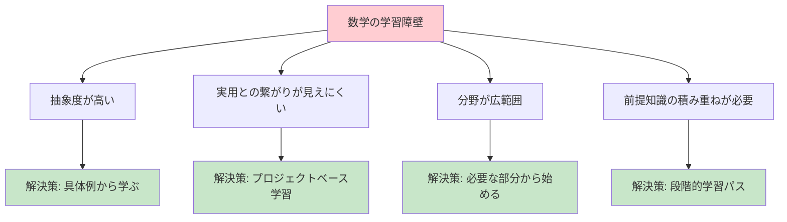

**共通課題**:
- 「なぜ学ぶのか」が見えにくい → **解決**: IT応用例を先に知る
- 記号や専門用語が多い → **解決**: 日常語での言い換えを心がける

## 🚀 応用と実例

### 身近な実例マップ

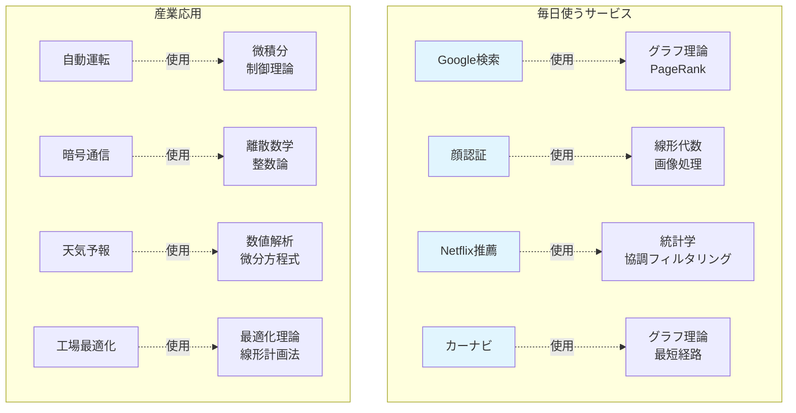

### 分野別応用詳細

**AI・機械学習**: 線形代数（ニューラルネット）+ 微積分（誤差逆伝播）+ 統計学（確率モデル）

**セキュリティ**: 離散数学（暗号理論）+ 整数論（RSA暗号）

**ゲーム開発**: 線形代数（3D変換）+ 微積分（物理エンジン）+ 最適化（AI行動）

**データサイエンス**: 統計学（仮説検定）+ 線形代数（次元削減）+ 最適化（モデル選択）

## 🔄 置換・変遷

### 何を置き換えたか

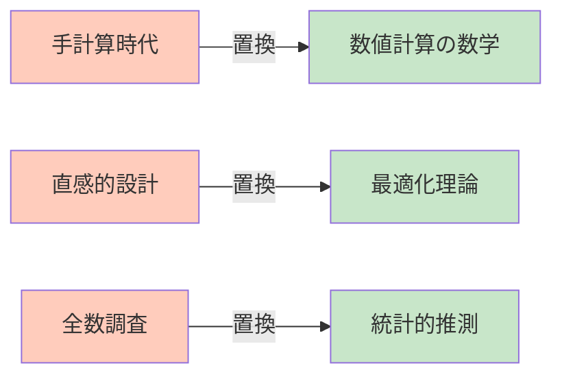

- **手計算 → 数値解析**: 複雑な計算を機械化
- **試行錯誤 → 最適化理論**: 系統的な最善解探索
- **経験則 → データサイエンス**: 統計的根拠に基づく判断

### 何に置き換えられつつあるか

**一部の分野で**:
- **従来の統計モデル → 深層学習**: 特徴量設計が不要に（ただし解釈性は低下）
- **手動最適化 → 自動機械学習（AutoML）**: 数学知識なしでもAI構築可能に

**重要**: 完全に置き換わるのではなく、「基礎理解」は依然重要。ブラックボックスに頼りすぎるリスク。

## 🔀 代替・競合

### 代替可能性マトリクス

| 元の分野 | 代替手段 | 限界 |
|---------|---------|------|
| **数値解析** | シンボリック計算（数式処理） | 複雑な問題は不可能 |
| **統計学** | 機械学習（深層学習） | データ量が少ないと不適 |
| **最適化** | 遺伝的アルゴリズム（進化計算） | 最適性保証なし |
| **離散数学** | 直感的プログラミング | 大規模では非効率 |

### 競合する思想

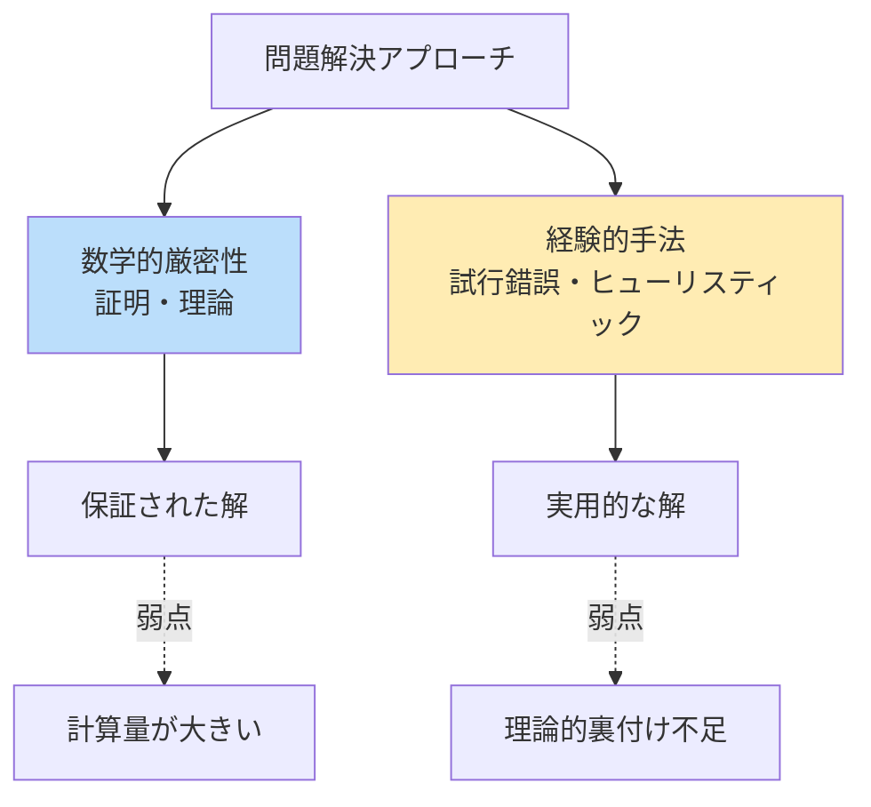

**現代の傾向**: 両者の融合（理論+実験）

## 🌍 実世界への影響とその後の発展

### 社会への影響

**過去の影響**:
1. **情報革命の基盤**: インターネット、スマートフォンは数学なしに存在不可能
2. **科学技術の加速**: シミュレーション技術により、実験なしで設計・検証可能に
3. **経済活動の変革**: アルゴリズム取引、在庫最適化、需要予測

**現在進行形の影響**:
- **AI社会**: 推薦システム、自動翻訳、画像認識が日常に
- **データ駆動社会**: すべての判断が統計的根拠を求められる時代

### 未来展望

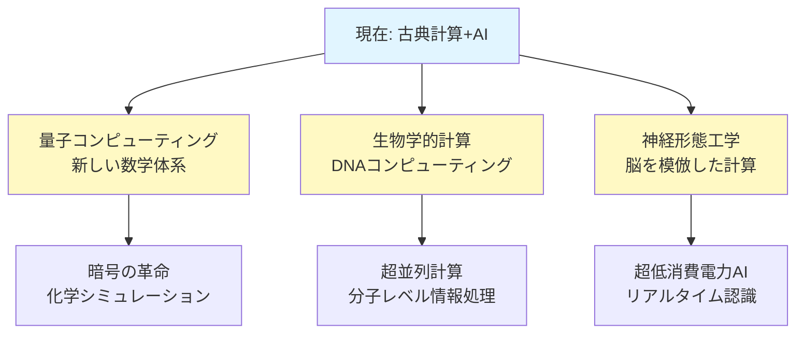

### 次世代の数学的課題

1. **量子情報理論**: 量子ビットの数学、量子アルゴリズム
2. **トポロジカルデータ解析**: 高次元データの「形」を理解
3. **因果推論**: 相関から因果へ（「なぜ？」に答える統計学）
4. **説明可能AI**: ブラックボックスを開ける数学的手法

### 学習者へのメッセージ

情報技術の数学は「すべてを一度に」学ぶ必要はありません：

**学習パス例**:
```
1. プログラミング興味 → 離散数学
2. AI・データサイエンス → 線形代数 + 統計学
3. ゲーム開発 → 線形代数 + 微積分
4. 最適化・アルゴリズム → 最適化理論 + グラフ理論
```

**重要原則**: 「使いながら学ぶ」。理論だけでなく、実際のプロジェクトで手を動かすことで理解が深まります。

---
