情報技術（Information Technology）について

# 情報技術（Information Technology）- 初学者のための完全ガイド

## 🔍 一言要約
情報を扱い、人々の生活を便利にするための技術の総称

## 📚 目次
1. [🌟 はじめに - なぜITが重要なのか](#-はじめに---なぜitが重要なのか)
2. [🏗️ ITの基本構造](#️-itの基本構造)
3. [⚡ 主要技術分野](#-主要技術分野)
4. [📜 ITの歴史と発展の物語](#-itの歴史と発展の物語)
5. [🎨 ITの分野と特徴](#-itの分野と特徴)
6. [📗 関連する用語](#-関連する用語)
7. [💡 ITのメリットとデメリット](#-itのメリットとデメリット)
8. [🚀 身近なIT応用例](#-身近なit応用例)
9. [🌍 ITが変えた世界と未来](#-itが変えた世界と未来)

---

## 🌟 はじめに - なぜITが重要なのか

朝起きてスマートフォンのアラームで目覚め、電車の運行情報をチェックし、コンビニでキャッシュレス決済をする。これらすべてに**情報技術（IT）**が関わっています。

ITとは、**情報を集める・保存する・処理する・伝える**ための技術の集合体です。まるで**現代の魔法**のように、私たちの生活を便利で豊かにしてくれています。

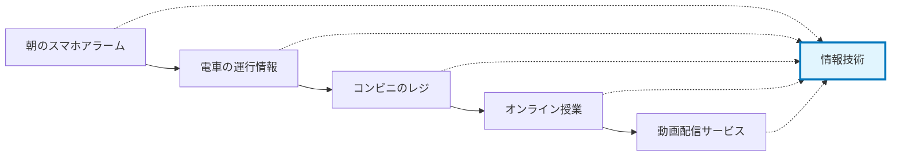

---

## 🏗️ ITの基本構造

ITは大きく4つの要素で構成されています。これを**家の建築**に例えて理解しましょう。

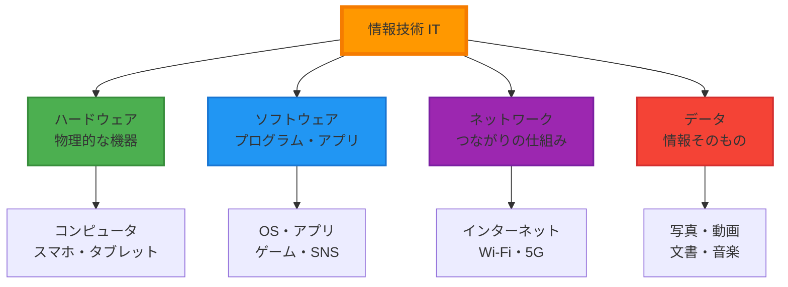

### 各要素の役割

- **ハードウェア**：家の土台や柱（物理的な基盤）
- **ソフトウェア**：家の間取りや設備（機能を提供）
- **ネットワーク**：道路や電線（情報の通り道）
- **データ**：家具や生活用品（実際に使う情報）

---

## ⚡ 主要技術分野

ITの世界は、専門分野ごとに**職人のギルド**のように分かれています。

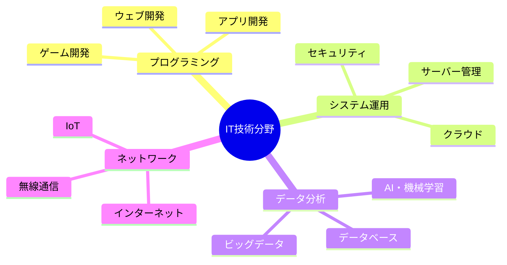

### 分野別の特徴

| 分野 | 主な仕事 | 身近な例 |
|------|----------|----------|
| **プログラミング** | アプリやサイトを作る | LINE、YouTube、ゲーム |
| **システム運用** | ITシステムを管理する | 銀行のATM、電子マネー |
| **データ分析** | 大量のデータから価値を見つける | おすすめ機能、天気予報 |
| **ネットワーク** | 機器同士をつなぐ | Wi-Fi、スマホの通信 |

---

## 📜 ITの歴史と発展の物語

### 第1章：計算機の誕生（1940年代）
「計算をもっと早く、正確にできないか？」という人類の願いから、最初のコンピュータが生まれました。

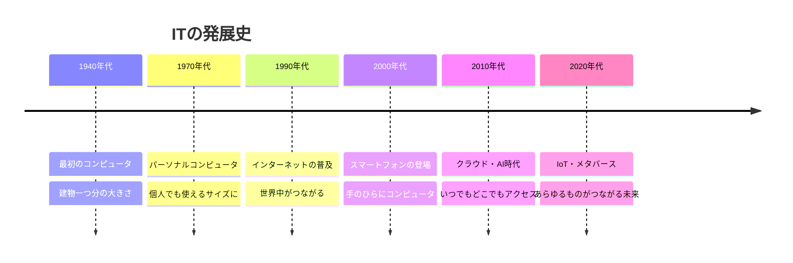

### 第2章：インターネット革命（1990年代）
「世界中の人と情報を共有したい」という夢が、インターネットを生み出しました。これにより、地球が一つの巨大な図書館になったのです。

### 第3章：モバイル時代（2000年代）
スマートフォンの登場で、コンピュータが**ポケットに収まる**時代がやってきました。

---

## 🎨 ITの分野と特徴

ITは用途や技術特性によって、さまざまな分野に分類できます。

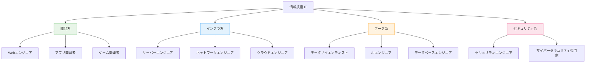

---

## 📗 関連する用語

### 基本用語
- **IT（Information Technology）**：情報技術の略称
- **ICT（Information and Communication Technology）**：情報通信技術。ITよりも通信を重視
- **DX（Digital Transformation）**：デジタル変革。ITを使って社会や企業を変えること

### 同義語・関連語
| 用語 | 意味 | 使用例 |
|------|------|--------|
| **コンピュータサイエンス** | コンピュータの学問分野 | 大学の専攻名 |
| **情報処理** | データを加工・変換すること | 情報処理試験 |
| **デジタル技術** | アナログの反対。0と1で表現 | デジタル化 |
| **サイバー** | インターネット空間の | サイバー犯罪 |

### 対義語
- **アナログ** ↔ **デジタル**
- **ハードウェア** ↔ **ソフトウェア**
- **オンライン** ↔ **オフライン**
- **クラウド** ↔ **オンプレミス**

---

## 💡 ITのメリットとデメリット

### 🌟 メリット

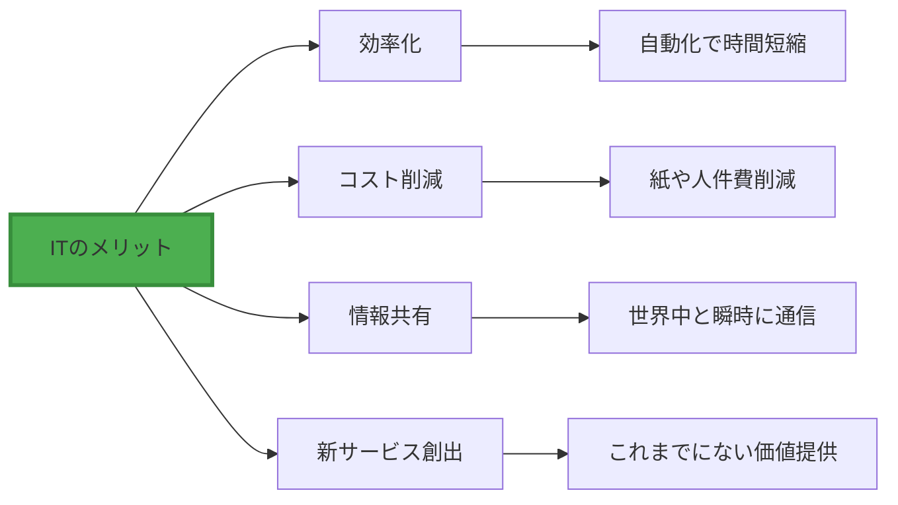

### ⚠️ デメリット

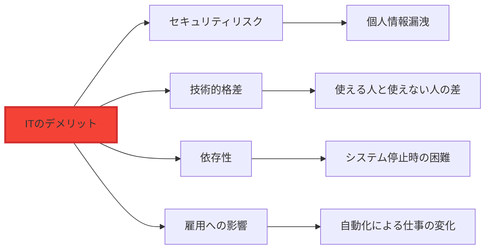

### バランスの取れた活用

| 側面 | 良い使い方 | 注意すべき使い方 |
|------|------------|------------------|
| **情報収集** | 複数の信頼できる情報源 | 一つの情報だけを信じる |
| **コミュニケーション** | 対面とデジタルの使い分け | デジタルのみに依存 |
| **学習** | ITツールで効率化 | ITに思考を委ね過ぎる |

---

## 🚀 身近なIT応用例

私たちの日常は、ITによって支えられています。

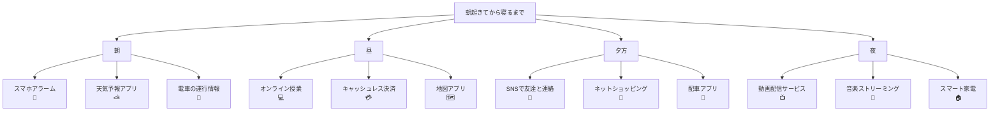

### 産業別IT活用

| 分野 | IT活用例 | 効果 |
|------|----------|------|
| **医療** | 電子カルテ、遠隔診療 | 医療の質向上、アクセス改善 |
| **教育** | オンライン授業、学習アプリ | 個別学習、距離の克服 |
| **金融** | インターネットバンキング、仮想通貨 | 24時間サービス、新しい価値 |
| **流通** | ECサイト、在庫管理システム | 効率化、利便性向上 |
| **農業** | IoTセンサー、ドローン | 精密農業、生産性向上 |

---

## 🌍 ITが変えた世界と未来

### 社会への影響マップ

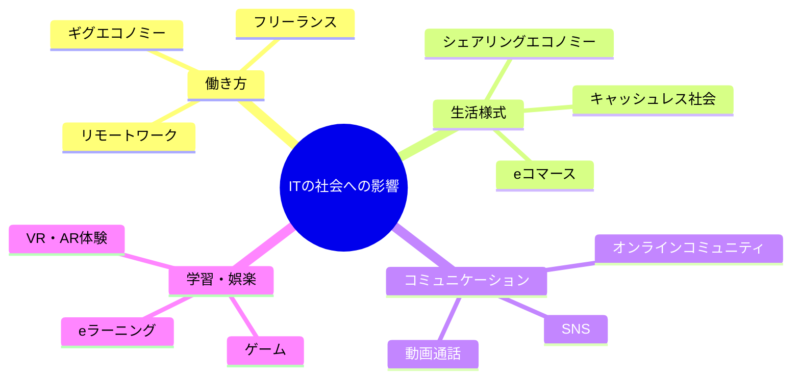

### 未来の技術トレンド

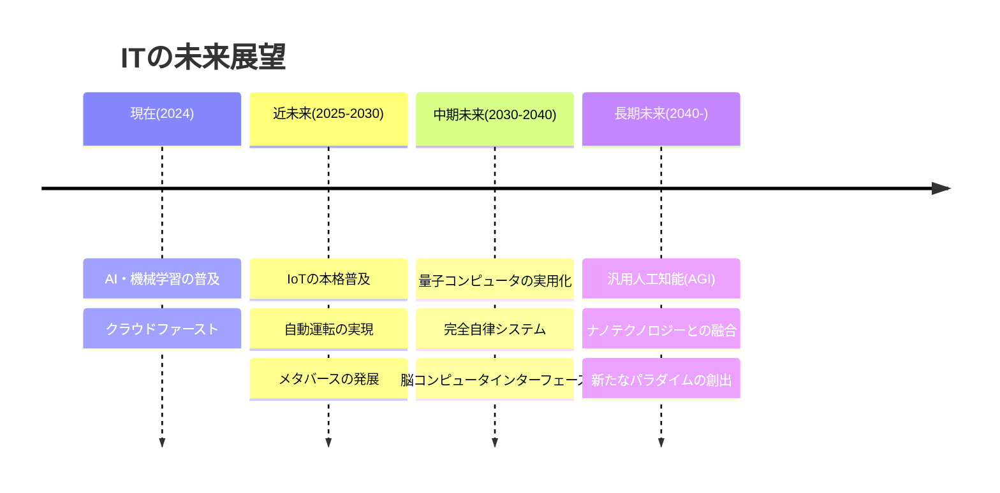

### 未来社会の予測

| 分野 | 現在 | 10年後 | 30年後 |
|------|------|--------|--------|
| **仕事** | 一部リモート | ハイブリッド標準 | AI協働が当たり前 |
| **移動** | 自家用車中心 | 自動運転開始 | 完全自律交通システム |
| **医療** | 対面診療中心 | 遠隔診療普及 | 予防医療・個別化医療 |
| **教育** | 対面・オンライン併用 | 個別最適化学習 | AI家庭教師標準 |

---

## 🎓 まとめ：ITとともに歩む未来

情報技術（IT）は、もはや私たちの生活から切り離すことのできない、**現代文明の基盤**となっています。

### IT学習のロードマップ

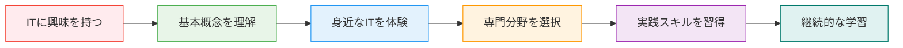

ITは決して難しい技術ではありません。毎日使っているスマートフォンやアプリも、すべてITの成果です。大切なのは、ITを**道具として上手に活用**し、より豊かで便利な生活を送ることです。

この技術があなたの学習や仕事、そして人生をより素晴らしいものにしてくれることを願っています。

---

## 📚 次のステップ

もっと詳しく学びたい方は、以下のトピックを探求してみてください：

- [プログラミング入門ガイド](/docs/programming-guide.md)
- [データサイエンス基礎](/docs/data-science-basics.md)
- [クラウド技術概要](/docs/cloud-technology.md)
- [AIと機械学習入門](/docs/ai-ml-introduction.md)
- [サイバーセキュリティの基本](/docs/cybersecurity-basics.md)

---

*このガイドが、あなたのIT学習の第一歩となることを心から願っています。技術の世界は広く、深く、そして常に進化しています。一緒に学び続けましょう！*
