情報技術（Information Technology）に関する科学の種類について

# 情報技術科学の分類体系 - 初学者のための完全ガイド

## 🔍 一言要約
コンピュータとデータを扱う学問領域の全体像を、実生活との結びつきで理解する

## 📚 目次
1. [はじめに](#-はじめに)
2. [情報技術科学の全体像](#-情報技術科学の全体像)
3. [主要な分野](#-主要な分野)
4. [時代背景と発展経緯](#-時代背景と発展経緯)
5. [各分野の特徴](#-各分野の特徴)
6. [関連用語](#-関連する用語)
7. [メリットとデメリット](#-メリットとデメリット)
8. [実社会への応用](#-応用と実例)
9. [学問の変遷](#-置換変遷)
10. [代替・競合関係](#-代替競合)
11. [未来への影響](#-実世界への影響とその後の発展)

## 🌟 はじめに

スマートフォンで写真を撮る、ネットで買い物をする、AIと会話する――これらすべてが「情報技術科学」の成果です。

情報技術科学は、**情報を生み出し、蓄え、運び、処理し、守る方法を研究する学問の総称**です。料理に例えるなら、食材（データ）を選び、保存し、運び、調理し、安全に提供するまでの全工程を科学的に研究するようなものです。

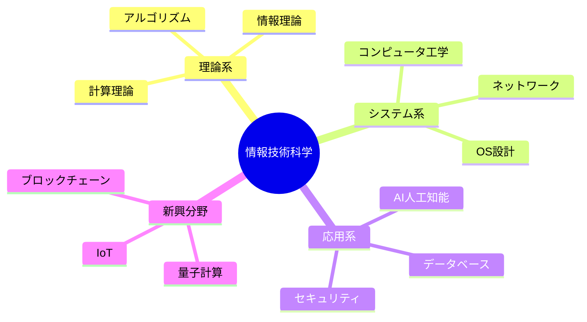

## 🏗️ 情報技術科学の全体像

情報技術科学は大きく**4つの層**で構成されています：

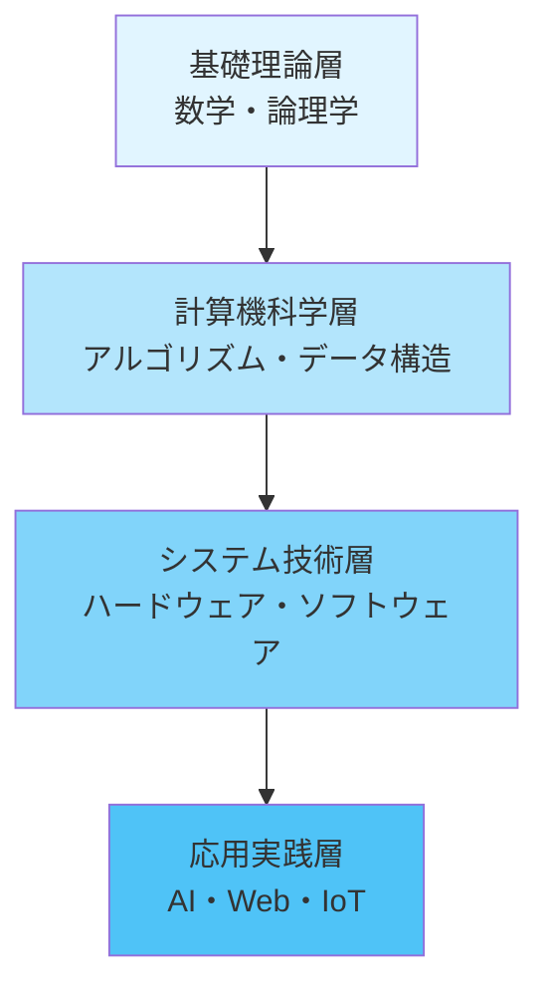

**各層の役割：**
- **基礎理論層**: 家の設計図（どんな計算が可能か）
- **計算機科学層**: 建築技術（効率的な処理方法）
- **システム技術層**: 建物本体（コンピュータそのもの）
- **応用実践層**: 家具・インテリア（私たちが使うアプリ）

## ⚡ 主要な分野

### 1️⃣ **計算機科学（Computer Science）**
コンピュータで「何ができるか」「どう効率的に解くか」を研究

**日常例**: 
- Google検索が瞬時に結果を返す仕組み
- スマホの顔認証が速い理由

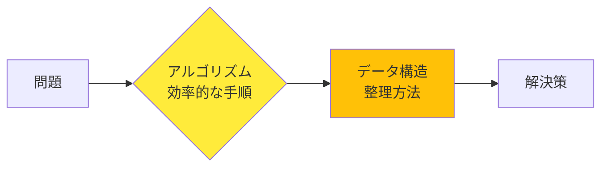

### 2️⃣ **人工知能（Artificial Intelligence）**
機械に「学習」「判断」「予測」能力を持たせる

**日常例**:
- ChatGPTとの会話
- Netflix の映画レコメンド
- 自動運転車の判断

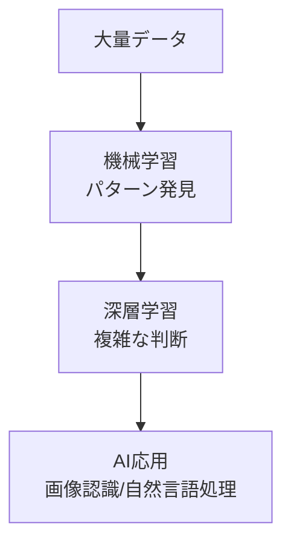

### 3️⃣ **データサイエンス（Data Science）**
膨大なデータから価値ある知見を引き出す

**日常例**:
- Amazon の「この商品を買った人は…」
- 天気予報の精度向上
- 医療診断の支援

### 4️⃣ **ネットワーク工学（Network Engineering）**
情報を遠くへ正確に届ける技術

**日常例**:
- Zoom 会議がつながる仕組み
- 世界中のWebサイトにアクセス
- 5G 通信の高速化

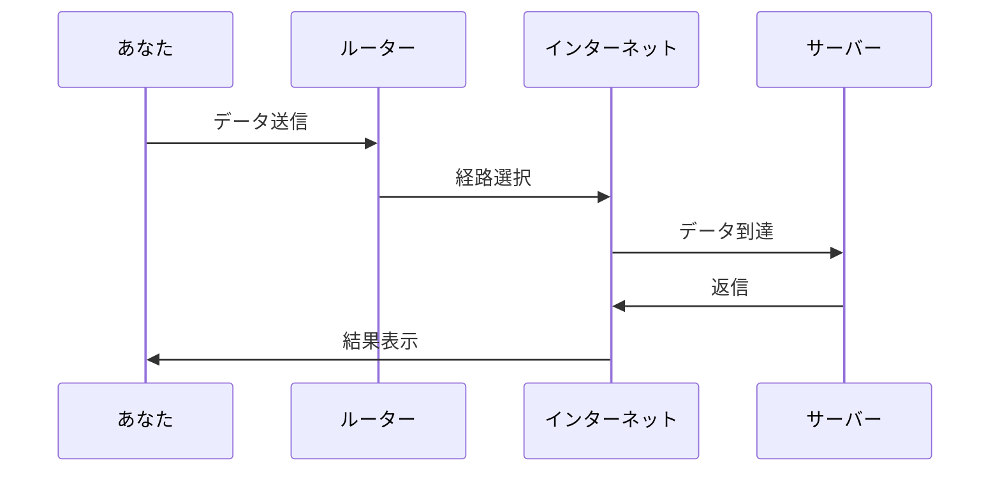

### 5️⃣ **サイバーセキュリティ（Cybersecurity）**
デジタル世界の「鍵と警備員」

**日常例**:
- パスワード保護
- ウイルス対策ソフト
- オンライン決済の暗号化

### 6️⃣ **ソフトウェア工学（Software Engineering）**
バグのない、使いやすいプログラムを作る技術

**日常例**:
- アプリのアップデート
- 大規模システム（銀行・病院）の安定稼働

## 📜 時代背景と発展経緯

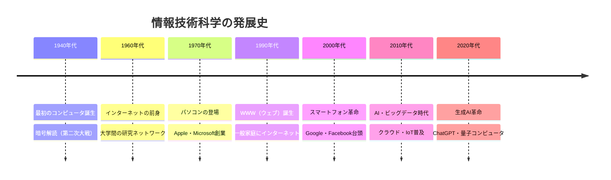

### 発展の物語

**第1章: 計算の自動化（1940-1960年代）**
第二次大戦中、暗号を解読するために数学者たちが最初の電子計算機を開発。当時のコンピュータは部屋全体を占める巨大な機械でした。

**第2章: 個人への普及（1970-1990年代）**
トランジスタ、IC（集積回路）の発明により小型化が進み、「個人が持てるコンピュータ」が実現。ビル・ゲイツの「すべての机にコンピュータを」という夢が現実に。

**第3章: 接続の時代（1990-2010年代）**
インターネットが世界中をつなぎ、情報の流通が爆発的に増加。検索エンジン、SNS、eコマースが生活を変革。

**第4章: 知能の誕生（2010年代～現在）**
ディープラーニングの突破により、AIが画像認識・言語理解で人間に匹敵。データが「新しい石油」と呼ばれる時代へ。

## 🎨 各分野の特徴

| 分野 | 研究対象 | 日常例 | 必要な知識 |
|------|----------|--------|------------|
| 計算機科学 | アルゴリズム・効率性 | 検索エンジン | 数学・論理学 |
| AI | 学習・予測 | 顔認証・翻訳 | 統計・線形代数 |
| データサイエンス | データ分析・可視化 | 販売予測 | 統計・プログラミング |
| ネットワーク | 通信・プロトコル | Wi-Fi・5G | 通信理論 |
| セキュリティ | 暗号・防御 | パスワード保護 | 暗号理論 |
| ソフトウェア工学 | 開発手法・品質 | アプリ開発 | プログラミング |

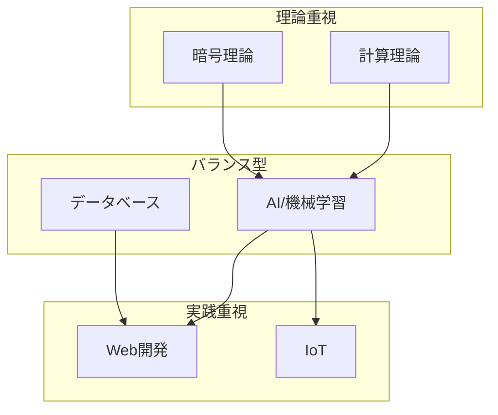

## 📗 関連する用語

### 同義語・類似語
- **情報技術（IT）** = Information Technology（より実務寄り）
- **計算機科学** = Computer Science（より学術寄り）
- **情報工学** = Information Engineering（工学的側面）
- **ICT** = Information and Communication Technology（通信含む）

### 対義語的概念
- **アナログ技術** ↔ デジタル技術
- **ハードウェア**（物理的機器）↔ **ソフトウェア**（プログラム）
- **オンライン** ↔ **オフライン**

### 多義語
- **クラウド**: ①気象の雲 ②インターネット上のサーバー
- **ネットワーク**: ①人的つながり ②コンピュータの接続
- **プロトコル**: ①外交儀礼 ②通信規約

### 上位・下位概念
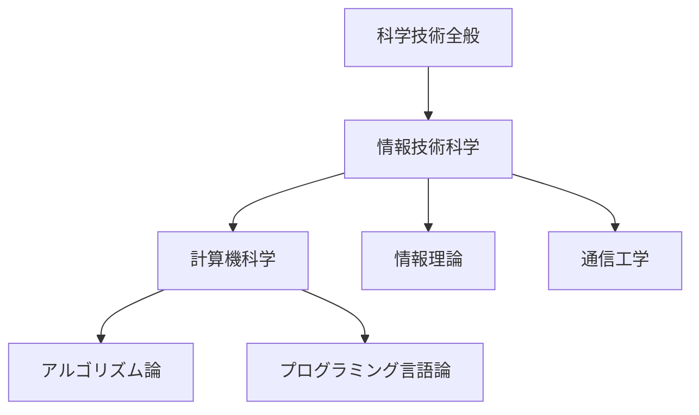

## 💡 メリットとデメリット

### ✅ メリット

1. **効率化の極致**
   - 瞬時の計算（人間なら何年もかかる処理）
   - 24時間365日稼働
   - 例: 銀行の自動取引、工場の無人化

2. **知識の民主化**
   - 誰でも世界中の情報にアクセス
   - オンライン教育で学習機会平等化
   - 例: Wikipedia、YouTube 教育動画

3. **新産業の創出**
   - IT企業の経済規模（Apple・Google等）
   - 新しい職業（データサイエンティスト、YouTuber）

4. **生活の質向上**
   - 遠隔医療、スマート家電
   - 交通渋滞の緩和（AI信号制御）

### ❌ デメリット

1. **デジタル格差**
   - 技術にアクセスできない人の不利益
   - 高齢者・発展途上国の取り残し

2. **プライバシー侵害**
   - 個人データの収集・悪用
   - 監視社会のリスク

3. **依存症・健康問題**
   - スマホ依存、睡眠障害
   - 運動不足、視力低下

4. **雇用の変化**
   - 自動化による仕事の消失
   - 再教育の必要性

5. **セキュリティリスク**
   - サイバー攻撃、情報漏洩
   - インフラへの攻撃リスク

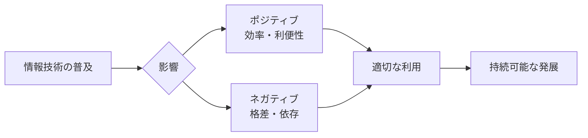

## 🚀 応用と実例

### 医療分野
- **AI診断**: レントゲン画像からがんを検出（精度95%以上）
- **遠隔手術**: 5G通信で専門医が遠隔地を手術
- **ゲノム解析**: 個別化医療の実現

### 教育分野
- **適応学習**: 生徒のレベルに合わせた教材提示
- **VR授業**: 歴史的場所への仮想訪問
- **自動採点**: 教師の負担軽減

### 農業分野
- **精密農業**: ドローンとセンサーで最適な水・肥料管理
- **収穫予測**: 気象データとAIで収量予測
- **自動収穫ロボット**

### エンターテインメント
- **ゲームAI**: リアルな敵キャラの動き
- **映画CG**: リアルな特殊効果
- **音楽生成**: AIによる作曲

### 身近な応用マップ
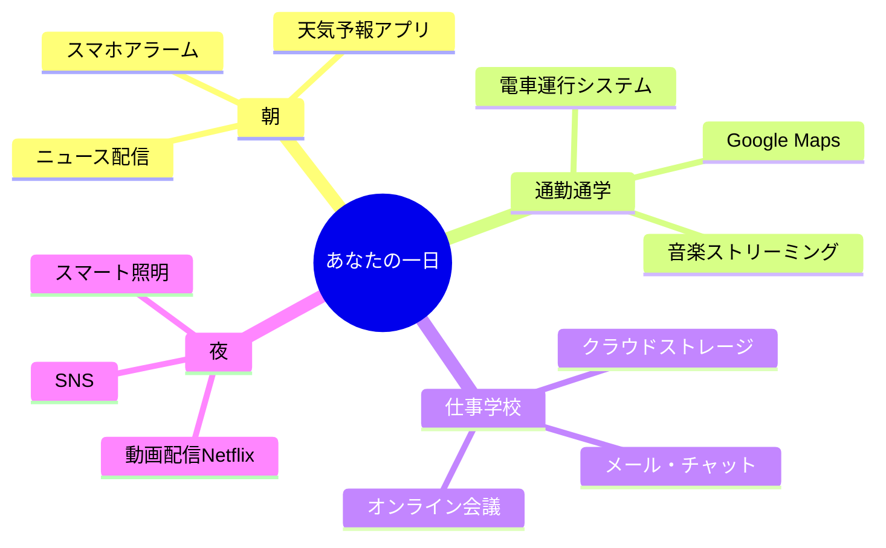

## 🔄 置換・変遷

### 何を置き換えたか

| 従来技術 | 情報技術による置換 | 変化の本質 |
|----------|-------------------|------------|
| 紙の書類 | デジタル文書・クラウド | 検索可能・共有容易 |
| 対面会議 | Zoom・Teams | 場所の制約撤廃 |
| 現金 | 電子マネー・暗号通貨 | 即時決済・記録自動化 |
| 図書館 | インターネット検索 | 24時間アクセス |
| レコード店 | Spotify・Apple Music | サブスク・無限選択肢 |
| タクシー無線 | Uber・配車アプリ | マッチング自動化 |

### 何に置き換えられつつあるか

- **初期のIT技術自体も進化**:
  - CD-ROM → クラウドストレージ
  - デスクトップPC → スマートフォン
  - キーボード入力 → 音声入力

## 🔀 代替・競合

### 分野内の競合

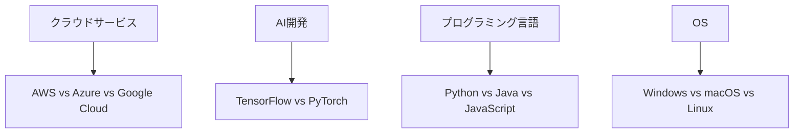

### 学問間の協力と競合

**協力関係**:
- 情報技術 + 生物学 = **バイオインフォマティクス**
- 情報技術 + 心理学 = **ユーザーインターフェース設計**
- 情報技術 + 経済学 = **フィンテック**

**代替される懸念**:
- 量子コンピュータが従来型コンピュータを置換？
  - 現実: 特定用途での共存が予想される
- AGI（汎用AI）が人間の知的労働を代替？
  - 現実: 人間とAIの協働体制へ

## 🌍 実世界への影響とその後の発展

### 現在の影響

**経済**:
- IT企業が時価総額トップ5を独占（Apple、Microsoft、Google等）
- デジタル経済が世界GDPの15%超

**社会**:
- リモートワークの普及（コロナ禍で加速）
- SNSが政治・社会運動に影響

**環境**:
- スマートシティによるエネルギー効率化
- データセンターの電力消費問題

### 未来の発展方向

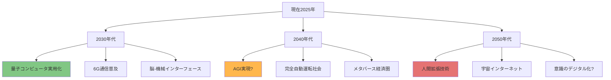

### 今後の重要テーマ

1. **AI倫理**: 誰がAIの判断に責任を持つか
2. **デジタル主権**: 国家がデータをどう管理するか
3. **サステナビリティ**: 環境に優しいIT
4. **人間中心設計**: 技術が人間に奉仕する社会

### 学習者へのメッセージ

情報技術科学は**まだ発展途上**です。あなたが学び始める今が、新しい分野を創造するチャンスです。

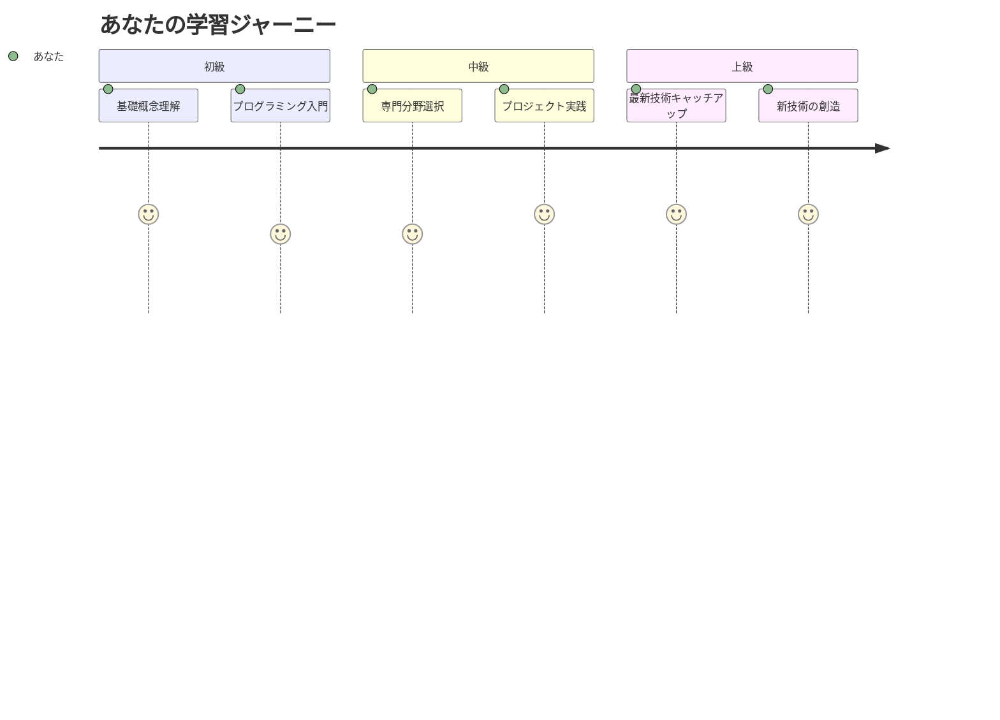

---

## 📚 学習の次のステップ

各分野をさらに深く学ぶには：

1. **計算機科学**: アルゴリズムとデータ構造の基礎
2. **AI**: Python + 機械学習ライブラリ
3. **Web開発**: HTML/CSS/JavaScript
4. **セキュリティ**: 暗号理論と倫理的ハッキング
5. **データサイエンス**: 統計学 + SQL + 可視化

**すべての基礎**: プログラミング言語を1つマスターすることから始めましょう！
