情報技術（Information Technology）に関する技術の種類について

# 情報技術（IT）の全体像 - 初学者のための完全ガイド

## 🔍 一言要約
コンピュータとネットワークで情報を扱う技術の総称

## 📚 目次
1. [はじめに](#-はじめに)
2. [基本構造](#-基本構造)
3. [主要技術領域](#-主要技術領域)
4. [時代背景と発展経緯](#-時代背景と発展経緯)
5. [ITの分類体系](#-itの分類体系)
6. [関連用語](#-関連する用語)
7. [メリットとデメリット](#-メリットとデメリット)
8. [応用と実例](#-応用と実例)
9. [技術の変遷](#-置換変遷)
10. [競合と代替](#-代替競合)
11. [実世界への影響](#-実世界への影響とその後の発展)

## 🌟 はじめに

情報技術（IT）とは、スマホで写真を撮る、メールを送る、オンラインショッピングをする──これら全てを可能にする「情報を扱う技術の集合体」です。

**日常例で理解する：**
- レストランで注文→厨房に伝達→料理提供
- これをデジタル化したのがIT（タブレット注文→システム伝達→調理指示）

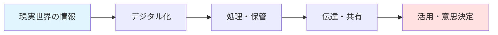

## 🏗️ 基本構造

ITは「4つの柱」で成り立っています。

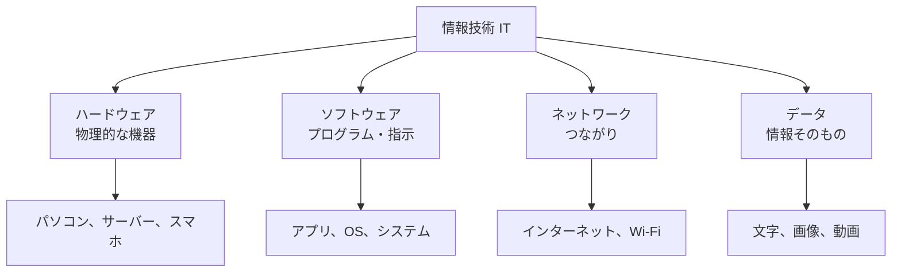

**わかりやすく例えると：**
- **ハードウェア** = 料理道具（包丁、鍋）
- **ソフトウェア** = レシピ（作り方の指示）
- **ネットワーク** = 配達システム
- **データ** = 食材・完成した料理

## ⚡ 主要技術領域

IT技術は大きく8つの領域に分類されます。

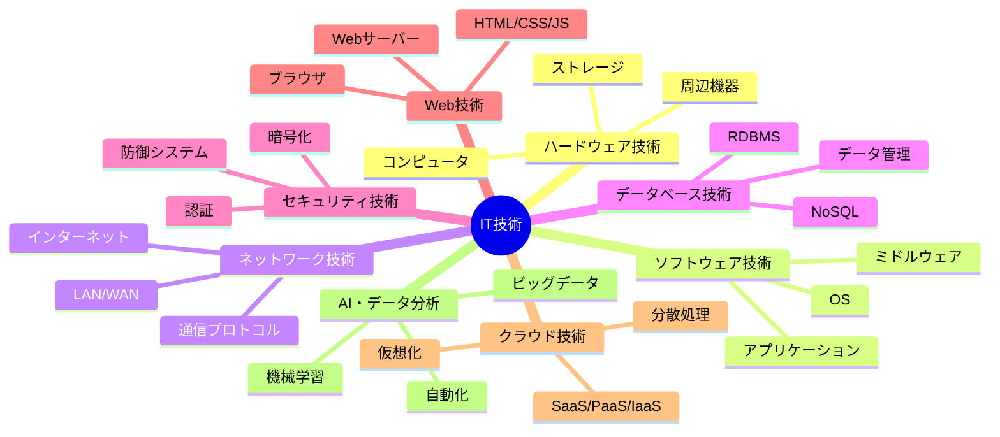

### 各技術の役割

| 技術領域 | 役割 | 身近な例 |
|---------|------|---------|
| ハードウェア | 物理的な処理を担当 | スマホ本体 |
| ソフトウェア | 指示・制御を担当 | LINE、Instagram |
| ネットワーク | 情報の伝達を担当 | Wi-Fi、4G/5G |
| データベース | 情報の保管を担当 | 連絡先リスト |
| セキュリティ | 情報の保護を担当 | 指紋認証、パスワード |
| Web技術 | 情報の公開を担当 | Webサイト閲覧 |
| クラウド | 遠隔利用を可能に | Google Drive |
| AI・分析 | 知的処理を担当 | 音声認識、推薦機能 |

## 📜 時代背景と発展経緯

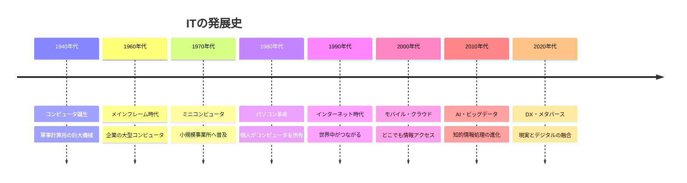

### 発展のストーリー

**第1章：計算機の誕生（1940年代）**
- 戦時中の弾道計算のニーズから誕生
- 部屋一杯の大きさ、真空管使用
- 専門家しか操作できない

**第2章：ビジネスへの普及（1960-70年代）**
- トランジスタ→集積回路で小型化
- 銀行、企業が導入開始
- まだ一般人には縁遠い存在

**第3章：個人の手に（1980年代）**
- Apple、IBMがパソコン発売
- ゲーム、表計算で家庭に浸透
- 「IT」という言葉の普及

**第4章：つながる世界（1990年代）**
- インターネット商用化
- メール、Webサイトの登場
- 情報革命の始まり

**第5章：モバイル革命（2000年代）**
- スマートフォン登場
- クラウドサービス普及
- いつでもどこでもIT活用

**第6章：知能化の時代（2010年代以降）**
- AI、機械学習の実用化
- IoT（モノのインターネット）
- デジタルトランスフォーメーション（DX）

## 🎨 ITの分類体系

### レイヤー別分類

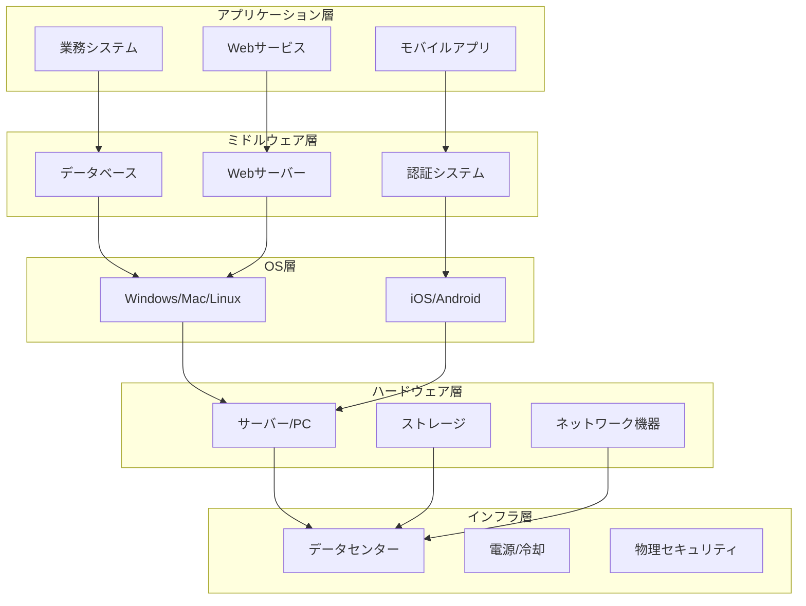

### 用途別分類

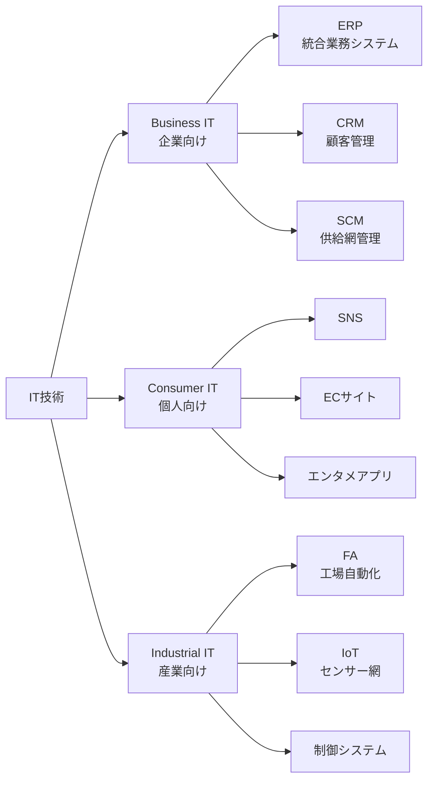

## 📗 関連する用語

### 同義語・類義語

| 用語 | 同義語 | ニュアンスの違い |
|------|--------|------------------|
| IT（Information Technology） | ICT（情報通信技術） | ICTは「通信」をより強調 |
| コンピュータ | 電子計算機 | 後者は古い呼び方 |
| ソフトウェア | プログラム、アプリ | ソフトが最も広義 |
| インターネット | ネット、Web | Webはインターネットの一部 |
| クラウド | オンラインストレージ | クラウドはより広範な概念 |

### 対義語・対比語

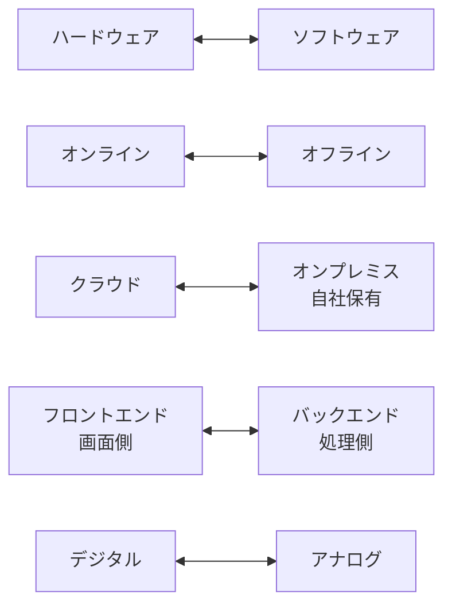

### 多義語・文脈による違い

**「プラットフォーム」の3つの意味：**
1. **技術的意味** = OS、実行環境（Windows, iOS）
2. **ビジネス的意味** = サービス基盤（Amazon, YouTube）
3. **物理的意味** = 駅のホーム（元の意味）

**「クラウド」の意味：**
- IT文脈 = インターネット上のサービス
- 気象文脈 = 雲
- 由来 = ネットワーク図で雲☁️マークで表現したことから

## 💡 メリットとデメリット

### メリット

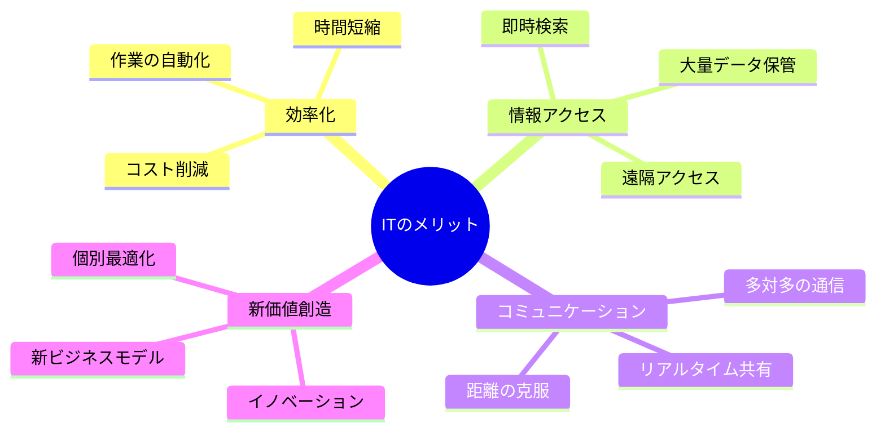

**具体例：**
- **効率化**: 手書き書類→デジタル入力（時間1/10）
- **情報アクセス**: 図書館→Google検索（秒で結果）
- **コミュニケーション**: 手紙→メール→ビデオ通話
- **新価値**: Uber（スマホでタクシー）、Netflix（見放題）

### デメリット

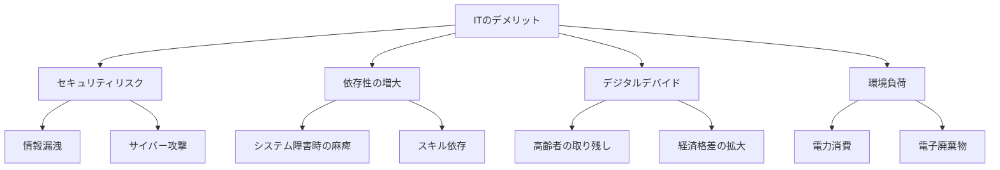

**リアルな問題例：**
- **2021年みずほ銀行システム障害** = 依存性リスクの顕在化
- **高齢者のワクチン予約困難** = デジタルデバイド問題
- **ランサムウェア攻撃** = セキュリティリスク
- **データセンター電力消費** = 環境負荷

## 🚀 応用と実例

### 産業別IT活用

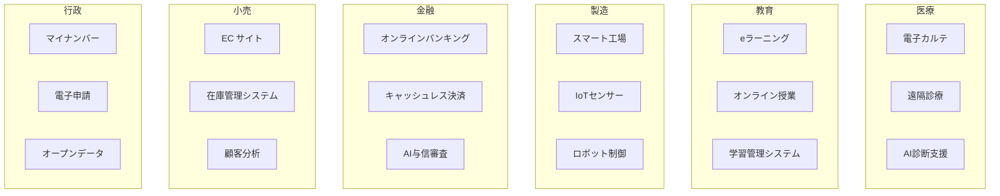

### 身近な実例

| 場面 | IT技術 | 使われている技術 |
|------|--------|------------------|
| 朝起きる | スマホアラーム | OS、センサー、時刻同期 |
| 通勤 | 乗換案内アプリ | GPS、データベース、API |
| 仕事 | メール、Web会議 | ネットワーク、クラウド |
| 昼食 | キャッシュレス決済 | 暗号化、データベース |
| 帰宅 | 動画配信視聴 | CDN、ストリーミング技術 |
| 就寝前 | SNSチェック | Webサーバー、プッシュ通知 |

## 🔄 置換・変遷

### ITが置き換えたもの

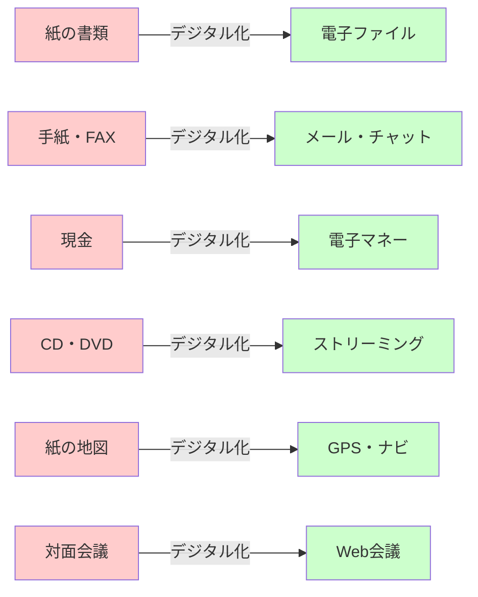

### IT自体の進化

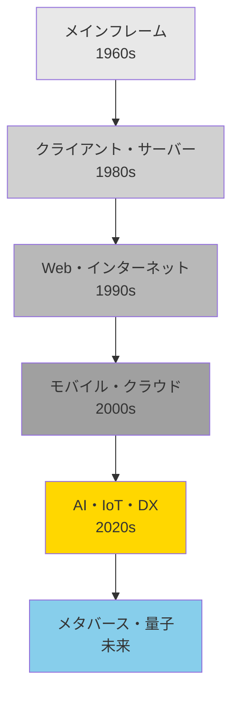

**技術の継承関係：**
- **UNIXの思想** → Linux → Android（哲学の継承）
- **ARPANETの技術** → インターネット（プロトコルの継承）
- **メインフレームの信頼性技術** → クラウド（設計思想の継承）

## 🔀 代替・競合

### 技術スタックの代替例

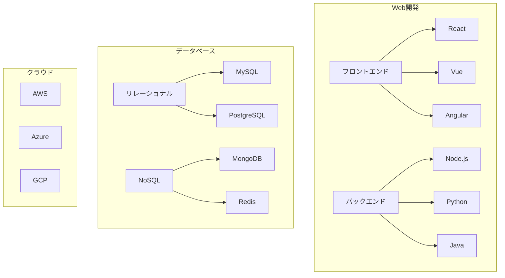

### ベンダー間競合

| 領域 | 主要競合 | 選択基準 |
|------|----------|----------|
| OS | Windows vs Mac vs Linux | 用途、コスト、慣れ |
| クラウド | AWS vs Azure vs GCP | 機能、価格、既存システム |
| オフィス | Microsoft 365 vs Google Workspace | 組織文化、互換性 |
| スマホOS | iOS vs Android | エコシステム、価格帯 |
| チャット | Slack vs Teams vs Discord | 組織規模、機能要件 |

### オープンソース vs プロプライエタリ

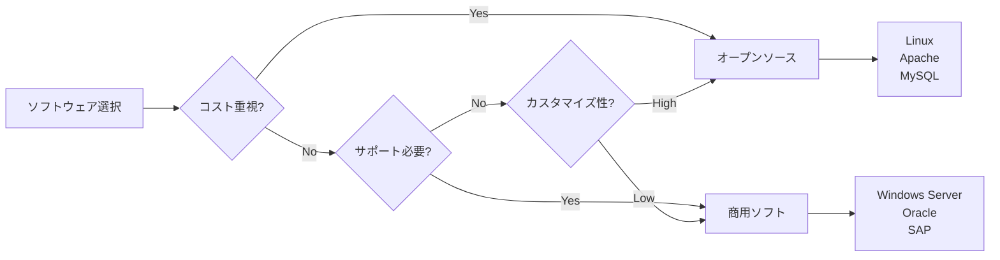

## 🌍 実世界への影響とその後の発展

### 社会変革

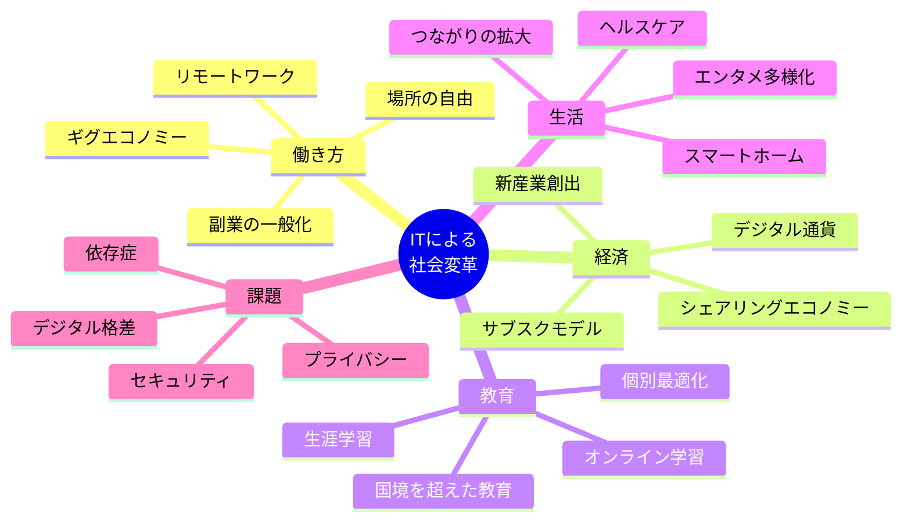

### 具体的インパクト

**統計データ：**
- **リモートワーク**: 2019年 5% → 2023年 30%（日本）
- **EC市場**: 2010年 7.8兆円 → 2022年 22.7兆円
- **スマホ普及率**: 2010年 4% → 2023年 97%（日本）
- **デジタル決済比率**: 2015年 18% → 2023年 39%

### 未来展望（2025-2035）

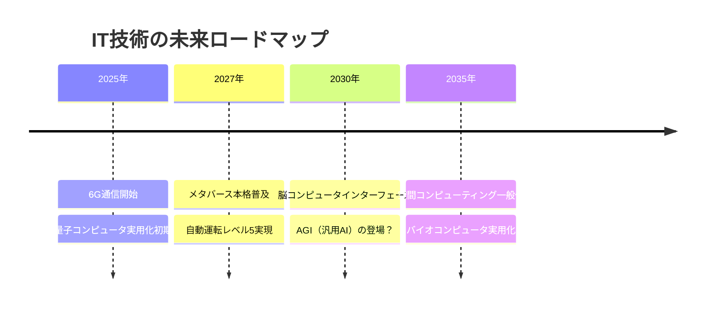

**予測される変化：**

1. **仕事の変化**
   - 単純作業→AI完全自動化
   - 創造的・対人業務に人間は集中
   - プログラミングも自然言語で指示

2. **生活の変化**
   - AR/VRが日常に溶け込む
   - 健康管理の完全デジタル化
   - 物理とデジタルの境界消失

3. **社会の変化**
   - DAO（分散型自律組織）の増加
   - デジタルツインで都市管理
   - 教育の完全個別最適化

### 解決すべき課題

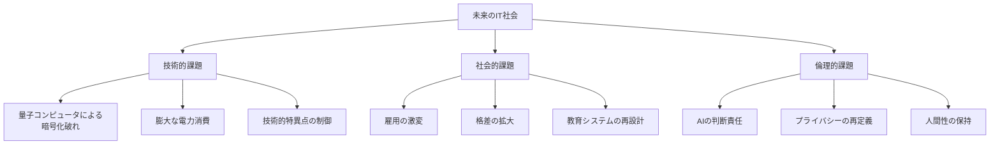

---
