メンタルモデル（Mental Model）のうち、文字について

# 文字 - 初学者のための完全ガイド

## 🔍 一言要約
思考を可視化し、時空を超えて伝える人類最大の発明

## 📚 目次
1. [はじめに](#-はじめに)
2. [文字の本質](#-文字の本質)
3. [文字誕生の歴史](#-文字誕生の歴史)
4. [文字の種類と特徴](#-文字の種類と特徴)
5. [関連する用語](#-関連する用語)
6. [メリットとデメリット](#-メリットとデメリット)
7. [応用と実例](#-応用と実例)
8. [補完と強化](#-補完と強化)
9. [代替と競合](#-代替と競合)
10. [実世界への影響](#-実世界への影響)

## 🌟 はじめに

想像してください。友達との約束を忘れないために、石に印を刻む。それが5000年後も残り、未来の人々があなたの思いを読み取る——これが文字の力です。

文字は「頭の中の考え」を「目に見える形」に変換する技術です。声は消えますが、文字は残ります。

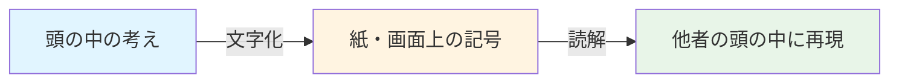

## 🏗️ 文字の本質

文字は3つの要素で成り立っています：

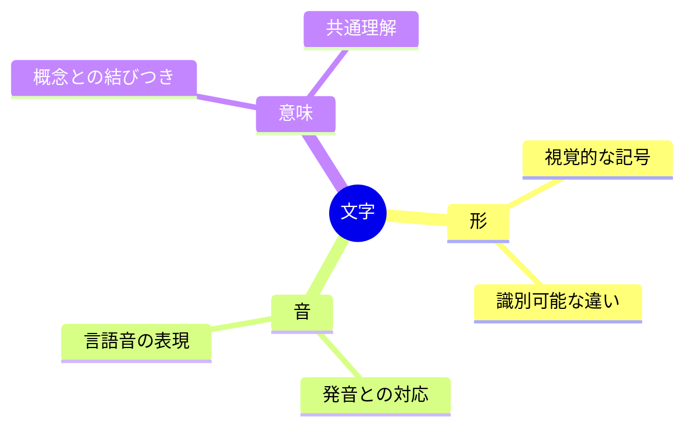

### 文字の働き方

1. **記録機能**: 時間を超える（昨日の考えを今日読む）
2. **伝達機能**: 空間を超える（日本の考えをアメリカに送る）
3. **思考機能**: 考えを整理する（書くことで理解が深まる）

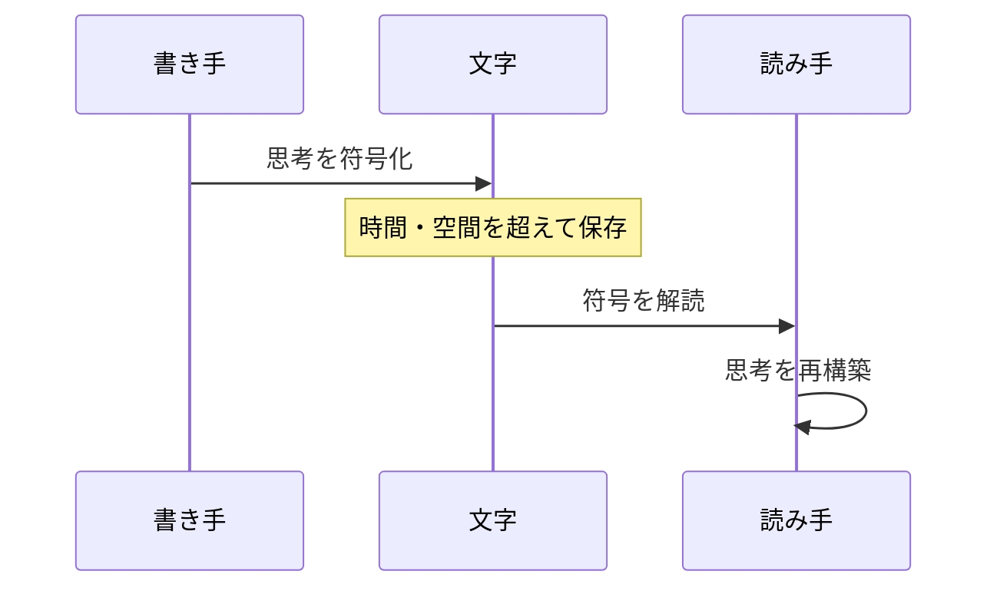

## 📜 文字誕生の歴史

### 紀元前3500年：必要性から生まれた発明

古代メソポタミアの商人たちは困っていました。「誰が何個の羊を持っているか」を覚えきれなくなったのです。

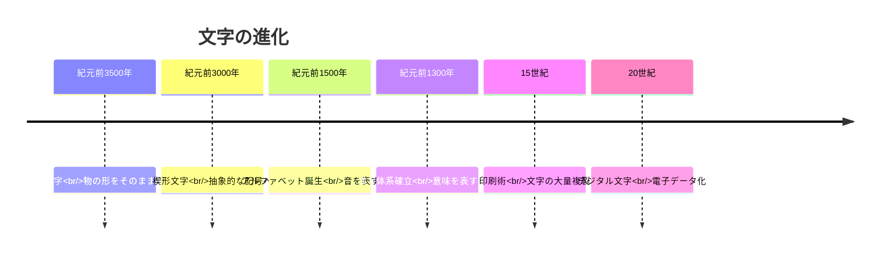

### 発明の瞬間

**段階1: 絵文字** → 羊の絵 = 羊
**段階2: 抽象化** → 簡略化された記号 = 羊
**段階3: 音の表現** → 記号 = 「ヒツジ」という音
**段階4: 体系化** → 組み合わせで無限の表現

## 🎨 文字の種類と特徴

世界の文字は大きく3つに分類されます：

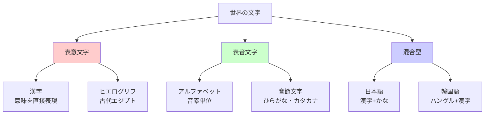

### 特徴比較表

| 種類 | 代表例 | 文字数 | 学習難易度 | 表現力 |
|------|--------|--------|------------|--------|
| 表意文字 | 漢字 | 数万字 | ★★★★★ | 一字で多意 |
| 表音文字（音素） | アルファベット | 20-30字 | ★★☆☆☆ | 組合せ無限 |
| 表音文字（音節） | ひらがな | 50-100字 | ★★★☆☆ | 音に忠実 |

## 📗 関連する用語

### 同義語・類似概念
- **文字（もじ）** = 書記記号、字
- **書体（しょたい）** = フォント、字体
- **文章（ぶんしょう）** = テキスト、記述

### 関連する基礎概念

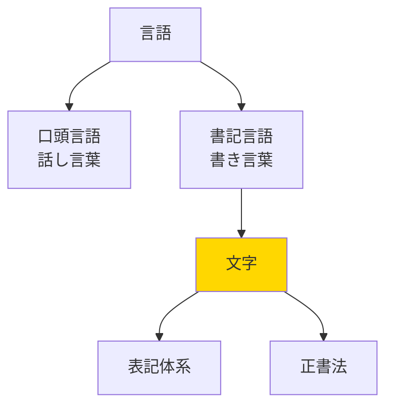

### 混同しやすい用語

| 用語 | 意味 | 例 |
|------|------|-----|
| 文字 | 言語を書き表す記号 | あ、A、漢 |
| 記号 | 意味を表す視覚的マーク | ♡、→、© |
| 符号 | 情報を表現する約束事 | モールス符号 |

## 💡 メリットとデメリット

### ✅ メリット

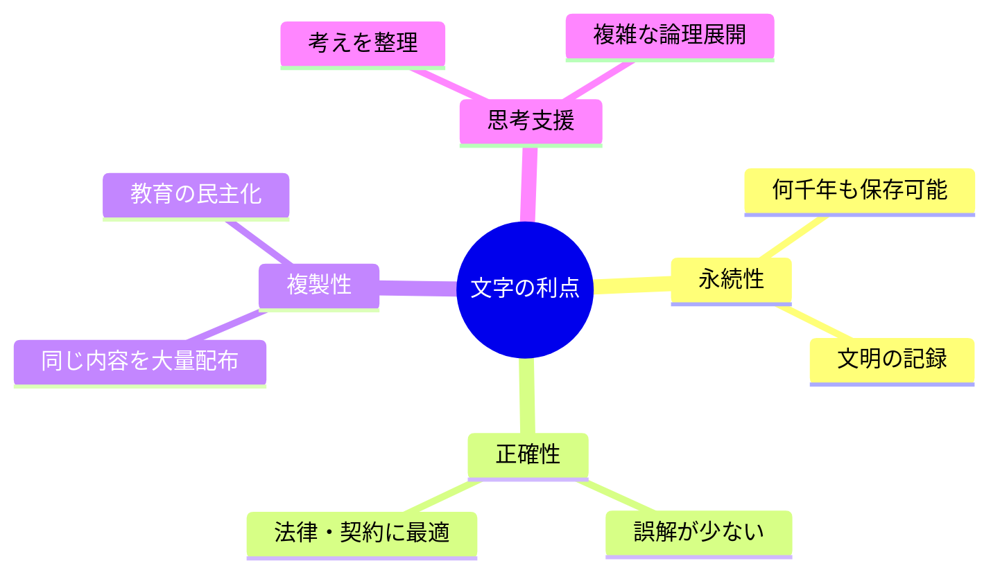

1. **時空を超える**: 紀元前の知恵を今読める
2. **証拠が残る**: 契約書、歴史記録
3. **複雑な思考**: 哲学・数学・科学を可能に
4. **同時に多数へ**: 一度書けば無限にコピー

### ❌ デメリット

1. **習得の壁**: 読み書きの学習に数年必要
2. **識字率の格差**: 教育機会による不平等
3. **感情の欠落**: 声のトーンや表情が伝わらない
4. **誤読の可能性**: 同じ文字でも解釈が分かれる

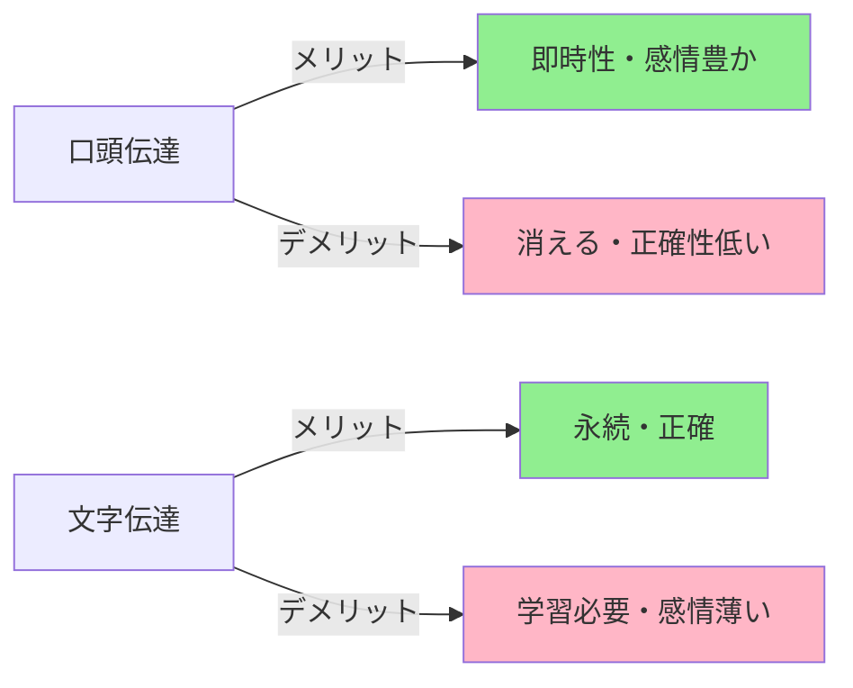

## 🚀 応用と実例

### 日常生活での応用

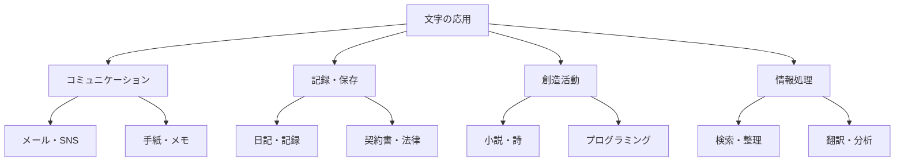

### 具体例

1. **道路標識**: 瞬時に情報伝達（「止まれ」）
2. **プログラミング**: コンピュータへの命令を文字で記述
3. **楽譜**: 音楽を文字化（五線譜は音の文字）
4. **数式**: 数学的関係を文字で表現（E=mc²）

## 🔄 補完と強化

### 何を補完したか

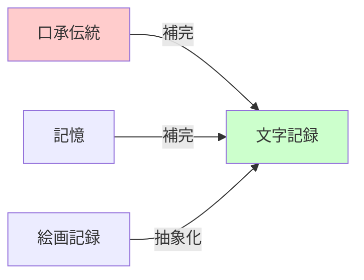

**補完前**: 語り部が暗記→世代ごとに変化
**補完後**: 文字で固定→正確に保存

### 何を強化したか

**部分的強化**（完全には消えていない）:
- **音声入力**: 話すと文字になる
- **画像・動画**: 視覚情報で直接伝達
- **絵文字**: 感情を視覚的に表現

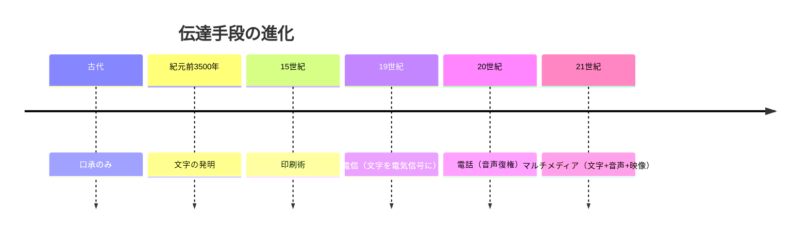

## 🔀 代替と競合

### 代替可能なもの

| 状況 | 文字で代替できるもの | 例 |
|------|---------------------|-----|
| 会議 | 口頭説明 | 議事録 |
| 教育 | 対面授業 | 教科書 |
| 記憶 | 頭の中の保存 | メモ |

### 文字を代替できるもの

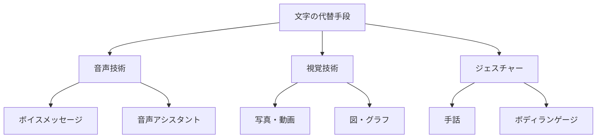

### 競合関係

**文字 vs 音声**
- 音声: 速い、感情豊か / 記録に不向き
- 文字: 正確、永続的 / 時間がかかる

**現代の融合**: 音声→自動文字化（AI技術）

## 🌍 実世界への影響とその後の発展

### 文明への影響

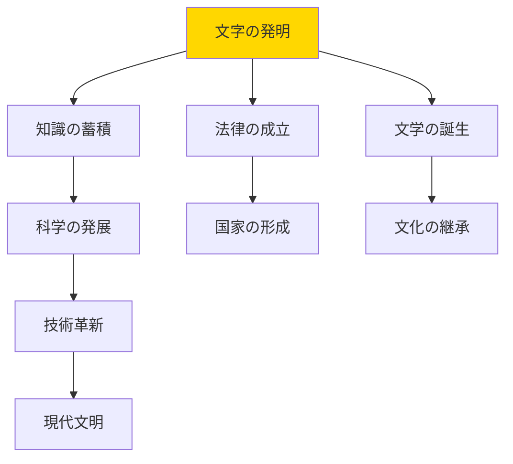

### 人類史上の転換点

1. **知識の民主化**: 印刷術で誰でも本を読める
2. **科学革命**: 実験結果を共有→急速な進歩
3. **グローバル化**: 異文化間のコミュニケーション
4. **デジタル革命**: 瞬時に世界中へ配信

### 未来への展望

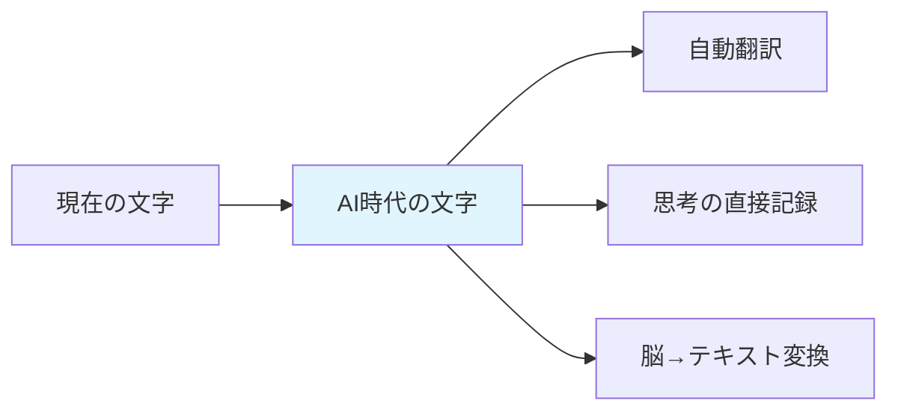

**予測される変化**:
- **ユニバーサル翻訳**: 言語の壁の消滅
- **思考インターフェース**: 脳波から直接文字化
- **AI執筆**: 人間とAIの共同執筆
- **3D文字**: 立体空間での情報表示

### 文字がもたらした世界

「図書館」「インターネット」「学校」「契約社会」「歴史学」——これらすべては文字なしには存在しません。人類の全知識は、この小さな記号の組み合わせで保存されています。

---

