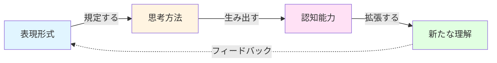
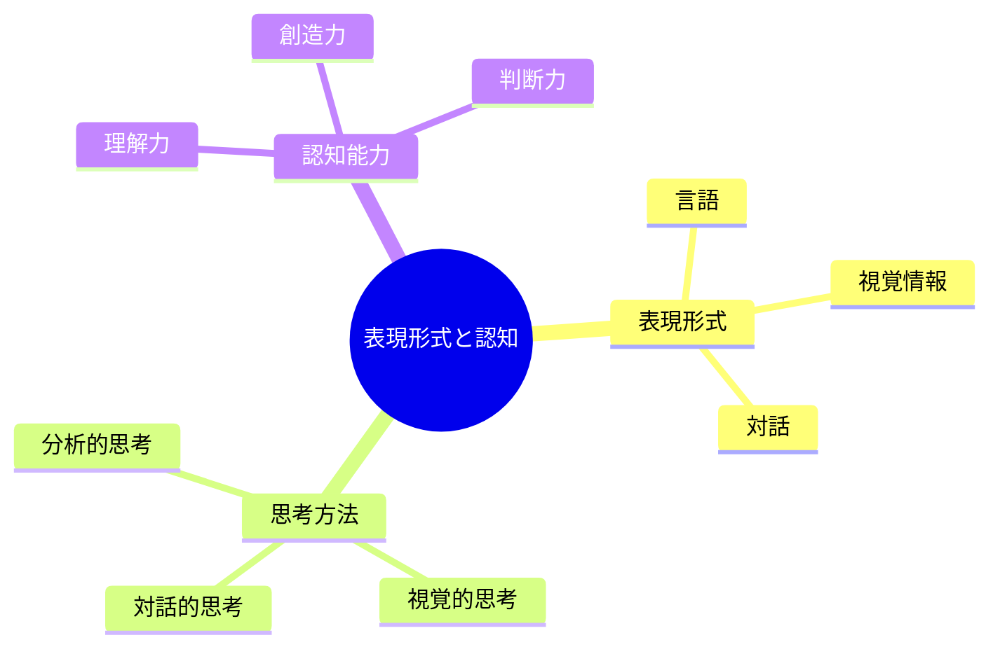
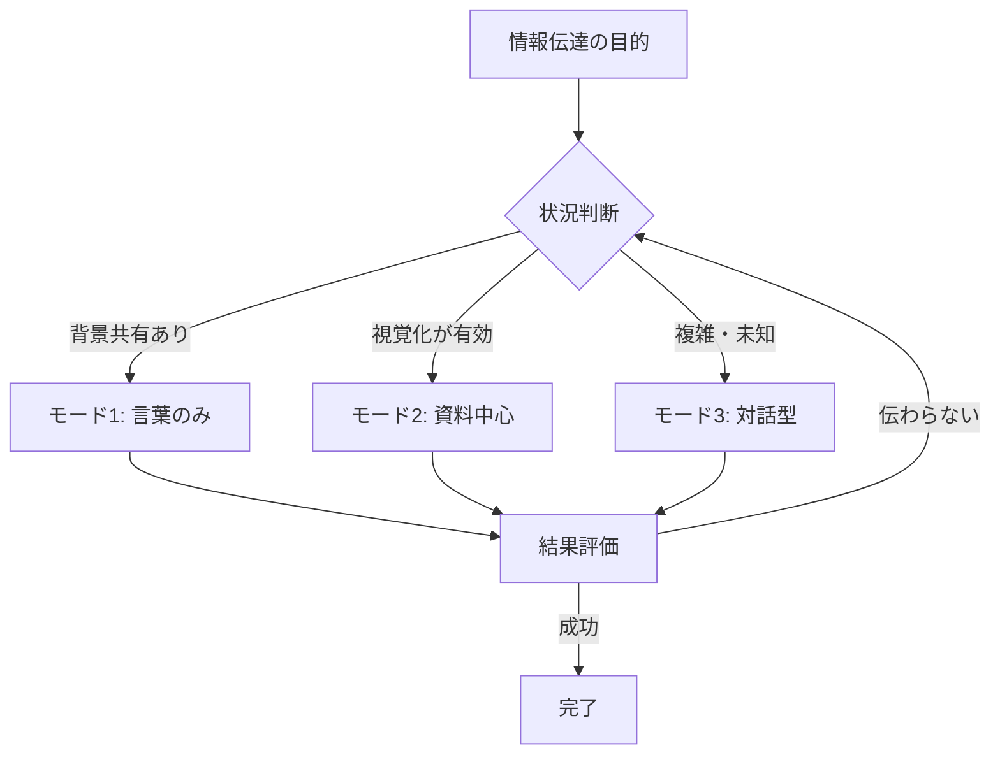
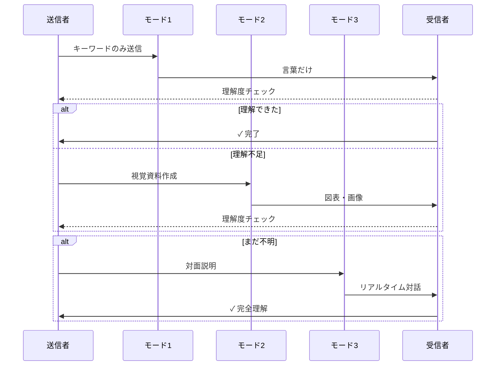
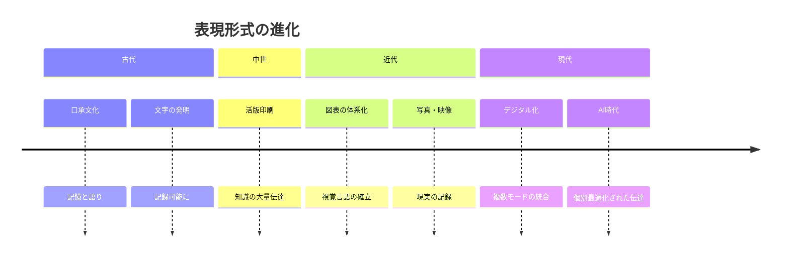
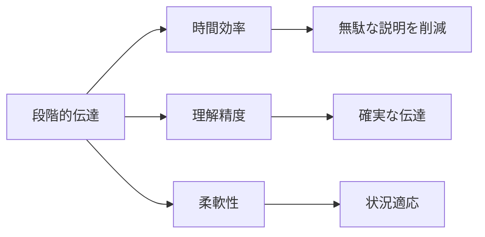
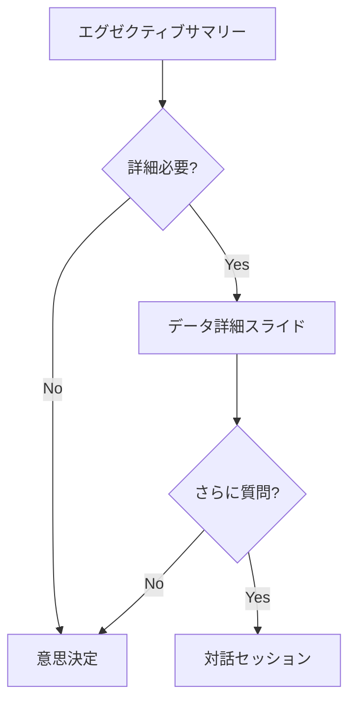
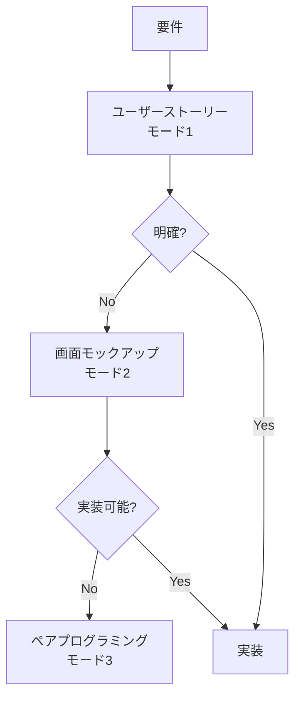
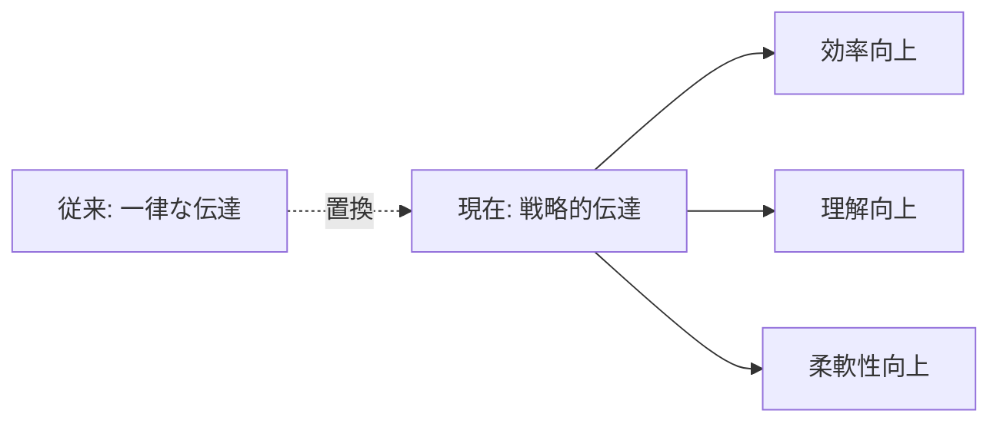
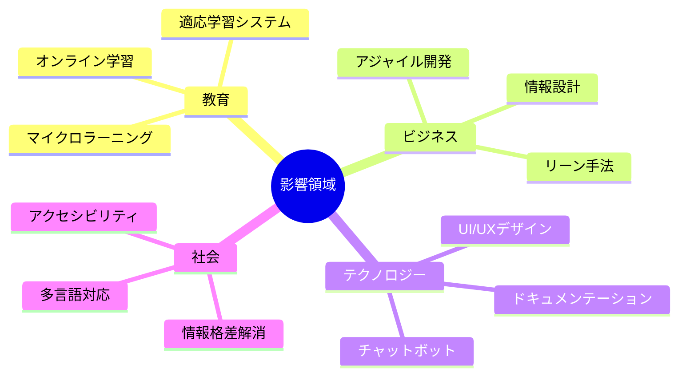

表現形式が思考方法を規定し、各モードの習得が新たな認知能力を解放する

**最短最速で段階的に伝達する3つの段階**
- 1.双方で背景情報を理解している前提とする、ごく限られた単語の組み合わせレベルの文だけの、伝達の仕方。相手の読解力や想像力に頼る。伝わらなければ次の段階へ。
- 2.軽い 説明 程度の文と、表、図、絵、写真、動画など 視覚的な情報を中心とした資料のみの 伝達の仕方。資料を用意する 負担がある分、相手に伝わりやすいことを期待。伝わらなければ次の段階へ。
- 3.実際に現物を見せながら 口頭で説明し 不明点があったらその場でやり取りするような、伝達の仕方。直接伝わっているかを確認しながら進める。双方 その場で 情報交換し 新たな情報が生じるので 後から 整理して 資料作りし 合意を得る必要がある。

# 表現形式と認知能力 - 初学者のための完全ガイド

## 🔍 一言要約
言葉の使い方が思考の質を決め、新しい表現方法の習得が新しい考え方を可能にする

## 📚 目次
1. [はじめに](#-はじめに)
2. [基本構造](#-基本構造)
3. [主要概念](#-主要概念)
4. [3段階伝達モデル](#-3段階伝達モデル)
5. [時代背景](#-時代背景と発見に至った経緾)
6. [関連用語](#-関連する用語)
7. [メリット・デメリット](#-メリットとデメリット)
8. [応用と実例](#-応用と実例)
9. [置換・変遷](#-置換変遷)
10. [代替・競合](#-代替競合)
11. [実世界への影響](#-実世界への影響とその後の発展)

## 🌟 はじめに

料理のレシピを考えてみてください。文章だけで伝えるのか、写真付きで伝えるのか、実際に作りながら教えるのか。これらの**伝え方の違い**が、相手の理解度を大きく変えます。

このガイドが扱うのは、「**どう表現するかが、何を考えられるかを決める**」という、コミュニケーションと思考の本質的な関係です。

## 🏗️ 基本構造

この理論は3つの柱で構成されています：

### 核心原理

1. **表現が思考を作る**：新しい言葉を覚えると、それまで気づかなかった概念を認識できるようになる
2. **モード切り替え**：状況に応じて最適な伝達方法を選ぶことで、効率と理解度が劇的に変わる
3. **段階的深化**：簡単な方法から始め、必要に応じて詳細化していく

## ⚡ 主要概念

### 表現形式（モード）とは

**日常例**：道案内を想像してください
- 「駅の近く」（言葉だけ）
- 地図を描く（視覚情報）
- 一緒に歩いて案内する（対話・体験）

これらは全て同じ目的地を示しますが、**伝わり方**が全く異なります。

### 認知能力の解放

新しい表現方法を習得すると：
- **見える世界が変わる**：専門用語を学ぶと、それまで「なんとなく」だったものが明確になる
- **考え方が増える**：図で考える、言葉で考える、手を動かして考える
- **問題解決力が上がる**：複数の角度から物事を見られる

## 🚀 3段階伝達モデル

最短最速で情報を伝えるための戦略的フレームワーク：

### モード1：キーワード伝達
- **特徴**：最小限の単語、最速の伝達
- **前提**：共通の背景知識
- **例**：「明日、いつもの店、7時」

### モード2：視覚資料伝達
- **特徴**：表、図、写真、動画を活用
- **負担**：資料作成の時間が必要
- **効果**：言葉では説明しにくい情報を直感的に伝達

### モード3：対話型伝達
- **特徴**：リアルタイムの双方向コミュニケーション
- **利点**：即座の確認とフィードバック
- **課題**：後で資料化して合意形成が必要

## 📜 時代背景と発見に至った経緯

### 古代からの探求

人類は常に「いかに伝えるか」と格闘してきました：

### 言語相対性仮説

20世紀、言語学者エドワード・サピアとベンジャミン・ウォーフが提唱：
**「使う言語が思考を形作る」**

例：
- エスキモーには雪を表す言葉が数十種類 → 雪の微細な違いを認識できる
- 日本語の「よろしく」→ 英語に直訳不可能だが、日本人には明確な意味

### マルチモーダル学習理論

1980年代以降、教育心理学が証明：
- 言葉だけより、言葉+図の方が記憶定着率40%向上
- 実際に体験すると、理解度75%向上

## 📗 関連する用語

### 同義語・類似概念
- **表現形式** ≈ 伝達モード、コミュニケーション様式、メディア
- **認知能力** ≈ 思考力、理解力、知的処理能力
- **モード切り替え** ≈ コンテクストスイッチング、表現方法の選択

### 対比される概念
| 概念A | 概念B | 違い |
|-------|-------|------|
| 言語的思考 | 視覚的思考 | 言葉 vs イメージ |
| 明示的知識 | 暗黙知 | 説明可能 vs 体感的 |
| 同期伝達 | 非同期伝達 | リアルタイム vs 記録保存 |

### 関連分野
- **言語学**：言語と思考の関係
- **認知科学**：人間の情報処理メカニズム
- **教育学**：効果的な学習方法
- **UI/UXデザイン**：情報の視覚的伝達

## 💡 メリットとデメリット

### メリット

1. **効率化**：必要最小限から始め、段階的に詳細化
2. **確実性**：理解度を確認しながら進む
3. **適応性**：相手のレベルに合わせた伝達
4. **認知拡張**：新しい表現方法が新しい思考を可能に

### デメリット

1. **準備コスト**：複数モードの準備が必要な場合がある
2. **判断負荷**：どのモードを選ぶか判断が必要
3. **習得時間**：効果的な図表作成や対話技術の習得に時間がかかる
4. **過信リスク**：「言葉だけで伝わる」と思い込み、段階を飛ばす

## 🎨 応用と実例

### ビジネスシーン

**プレゼンテーション**

### 教育現場

**数学の教え方**
1. 公式だけ（モード1）：「a² + b² = c²」
2. 図解（モード2）：直角三角形の図
3. 実演（モード3）：紙を切って実際に測る

### 日常生活

**料理レシピ**
- モード1：「カレーを作る」
- モード2：レシピサイトの写真付き手順
- モード3：料理教室で先生と一緒に調理

### ソフトウェア開発

**仕様伝達**

## 🔄 置換・変遷

### 何を置き換えたか

**単一モード伝達 → マルチモーダル伝達**

古い方法：
- 全て文章で説明（非効率）
- 全て口頭説明（記録なし）

新しい方法：
- 状況に応じた最適モード選択
- 複数モードの組み合わせ

### 何に置き換えられる可能性

**AI支援伝達**
- 自動的に最適モード提案
- リアルタイム翻訳（言語・視覚形式間）
- パーソナライズされた説明生成

## 🔀 代替・競合

### 代替可能な手法

| 従来手法 | この理論による代替 |
|----------|-------------------|
| マニュアル全文 | 段階的FAQ |
| 長時間研修 | マイクロラーニング+必要時対話 |
| メール長文 | 要点+詳細リンク |

### 競合する理論・アプローチ

**情報理論**
- 焦点：情報量の定量化
- 違い：「どう伝えるか」より「どれだけ伝わるか」

**ミニマリズム**
- 焦点：情報の削減
- 違い：この理論は「必要に応じた段階的増加」

**リッチメディア理論**
- 焦点：メディアの豊かさ
- 違い：常に豊かなメディアを使うのではなく、段階的選択

## 🌍 実世界への影響とその後の発展

### 現在の影響

### 今後の発展

**短期（2-5年）**
- AI による自動モード選択
- AR/VR による没入型対話
- リアルタイム視覚化ツールの普及

**中期（5-10年）**
- 脳波インターフェースによる直接伝達
- 個人最適化された学習経路
- 言語障壁の完全除去

**長期（10年以上）**
- 思考の直接共有技術
- 集合知の新しい形態
- 人間の認知能力の拡張

### 社会的意義

この理論は単なる伝達技術ではなく：
- **教育の民主化**：誰もが自分に合った方法で学べる
- **生産性革命**：無駄なコミュニケーションの削減
- **創造性の解放**：新しい表現方法が新しいアイデアを生む

---

