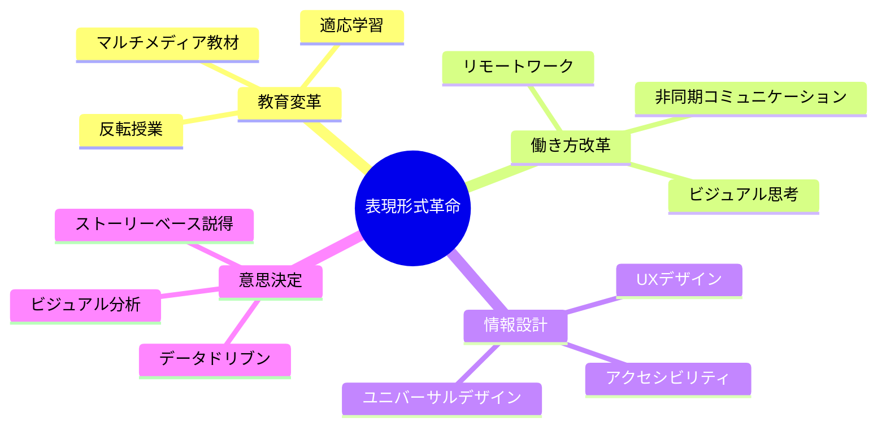

表現形式が思考方法を規定し、各モードの習得が新たな認知能力を解放する。

**ビジネスでの表現形式について具体例を交えた資料**
- プレゼン：書き言葉資料+話し言葉説明の分離
- 技術文書：形式的表現と自然言語説明の併用
- 会議：モード切り替えによる創造性と論理性の両立

# 表現形式とビジネスコミュニケーション - 初学者のための完全ガイド

## 🔍 一言要約
表現形式の選択が思考の質を決め、ビジネスでの成果を左右する

## 📚 目次
1. はじめに - なぜ表現形式が重要なのか
2. 表現形式の基本構造
3. 主要な表現形式の種類
4. 時代背景と発見に至った経緯
5. ビジネスでの3つの実践例
6. 関連する用語
7. メリットとデメリット
8. 応用と実例
9. 置換と変遷
10. 代替と競合
11. 実世界への影響と未来

## 🌟 はじめに

「何を言うか」より「どう言うか」が重要な場面に遭遇したことはありませんか？

例えば、同じアイデアでも：
- **箇条書き**で書くと「整理された印象」
- **物語形式**で書くと「感動的な印象」
- **図解**で書くと「直感的な印象」

これが**表現形式**の力です。本資料では、ビジネスシーンで即活用できる表現形式の選び方と使い分けを学びます。


## 🏗️ 基本構造

表現形式は「思考の容器」です。料理を盛る器が料理の印象を変えるように、同じ内容でも表現形式で受け取られ方が変わります。


### 核心原理

1. **形式が思考を規定**：使う形式によって、考え方自体が変わる
2. **モード切り替え**：状況に応じて表現形式を変える能力
3. **併用の効果**：複数の形式を組み合わせることで理解が深まる

## ⚡ 主要な表現形式

### 1. 書き言葉 vs 話し言葉

| 表現形式 | 特徴 | 適した場面 |
|---------|------|-----------|
| 書き言葉 | 正確、永続的、推敲可能 | 契約書、報告書、マニュアル |
| 話し言葉 | 柔軟、感情的、即興的 | プレゼン、商談、会議 |

### 2. 形式的表現 vs 自然言語


### 3. 視覚表現

- **図解**：関係性を一目で把握
- **表形式**：データの比較が容易
- **フローチャート**：プロセスの可視化

## 📜 時代背景と発見に至った経緯

### 古代：口承文化の時代
人類は数万年間、**話し言葉のみ**で知識を伝承していました。この時代、記憶に残りやすい「物語形式」や「韻を踏んだ表現」が発達しました。

### 紀元前3000年：文字の発明
文字の登場で**書き言葉**が誕生。永続的な記録が可能になり、複雑な思考が発展しました。


### 17世紀：科学革命
数学記号や図表など**形式的表現**が確立。ニュートンの『プリンキピア』では、数式という新しい表現形式が物理学を革命的に進歩させました。

### 現代：マルチモーダル時代
デジタル技術により、テキスト・音声・映像・インタラクティブ要素を組み合わせた**複合的表現**が可能になりました。

## 🎨 ビジネスでの3つの実践例

### 実践例1：プレゼンテーション

**課題**：聴衆が資料を読んでしまい、話を聞いてくれない

**解決策**：書き言葉と話し言葉の分離


**具体的手法**：
- スライド：見出し + 図解のみ（3行以内）
- 口頭説明：背景・理由・具体例を詳しく
- 効果：聴衆の注目が分散せず、理解度が向上

### 実践例2：技術文書

**課題**：専門家と非専門家が同じ文書を読む必要がある

**解決策**：形式的表現と自然言語説明の併用


**具体的構成**：

1. **概要セクション**（自然言語）
   - 「このシステムは、オンラインショッピングでの購入手続きを3ステップで完了できるようにします」

2. **仕様セクション**（形式的表現）
   ```
   API Endpoint: POST /api/v1/purchase
   Parameters: {user_id, items[], payment_method}
   Response: {order_id, status, estimated_delivery}
   ```

3. **使用例セクション**（自然言語 + コード）
   - 「実際の購入フローを見てみましょう…」

**効果**：
- 専門家：仕様セクションで素早く正確な情報取得
- 非専門家：概要と使用例で直感的に理解
- 両者がスムーズに協働可能

### 実践例3：会議でのモード切り替え

**課題**：創造的なアイデアと論理的な検証を両立したい

**解決策**：時間帯で表現形式（モード）を切り替える


**具体的進行**：

**フェーズ1：創造モード（30分）**
- 表現形式：付箋、ホワイトボード、スケッチ
- ルール：批判禁止、量を重視、自由連想OK
- 発言スタイル：「もしかして…」「面白いのは…」

**移行（5分）**
- アイデアをカテゴリ分け
- 評価基準の確認（実現可能性、コスト、効果）

**フェーズ2：論理モード（25分）**
- 表現形式：評価表、チェックリスト、数値データ
- ルール：根拠を求める、定量的評価
- 発言スタイル：「データによると…」「リスクは…」

**効果の実例**：
- 従来：アイデア出しの最中に批判が入り、発想が萎縮
- 改善後：創造モードで30個のアイデア → 論理モードで5個に絞り込み → 実行可能な具体策を決定

## 📗 関連する用語

### 同義語・類義語
- **表現形式** ≈ 表現方法、記述方式、コミュニケーション様式
- **モード切り替え** ≈ 文脈転換、フレーム変更、視点転換

### 対義語
- 形式的表現 ⇔ 自然言語表現
- 書き言葉 ⇔ 話し言葉
- 構造化 ⇔ 自由形式

### 多義語の整理
**「形式」の3つの意味**：

1. **表現の形式**（本資料のテーマ）
   - 例：「プレゼンは図解形式で」

2. **手続きの形式**
   - 例：「正式な形式で申請する」

3. **形だけの形式**（形式主義）
   - 例：「形式的な謝罪」

### 類義語の微妙な違い

| 用語 | ニュアンス | 使用例 |
|------|----------|--------|
| 表現形式 | 中立的、包括的 | 「適切な表現形式を選ぶ」 |
| フォーマット | 技術的、定型的 | 「レポートのフォーマット」 |
| スタイル | 個性的、美的 | 「プレゼンスタイル」 |
| モダリティ | 学術的、認知科学的 | 「マルチモダリティ学習」 |

## 💡 メリットとデメリット

### メリット


1. **理解の深化**：複数の形式で同じ内容を表現すると、多角的理解が可能
2. **効率向上**：状況に最適な形式を選ぶことで、コミュニケーション時間を短縮
3. **創造性向上**：形式の切り替えが新しい視点をもたらす

### デメリット

1. **学習コスト**：複数の表現形式を習得するには時間がかかる
2. **選択の負担**：どの形式が最適か判断する必要がある
3. **過剰な複雑化**：不要に多様な形式を使うと逆に混乱を招く

### リスク軽減策


## 🚀 応用と実例

### 応用分野マップ


### 身近な実例

**実例1：料理レシピ**
- 材料リスト（表形式）
- 手順説明（番号付きリスト + 写真）
- コツ（自然な文章）
→ 複数形式の併用で初心者でも作れる

**実例2：道案内**
- 地図（視覚表現）
- 「3つ目の信号を右」（言語表現）
- ランドマーク「赤い看板の隣」（視覚 + 言語）
→ モダリティの組み合わせで迷いにくい

**実例3：IKEA家具の説明書**
- 言語を使わず図解のみ
- 世界中で通用する普遍性
→ 形式の制約が明確さを生む

## 🔄 置換と変遷

### 何を置き換えたか


**具体例**：
- **ビジネス報告書**：文字の羅列 → グラフ・図解・要約の組み合わせ
- **プレゼン**：読み上げ式 → ビジュアル中心 + 口頭補足
- **技術マニュアル**：長文説明 → 動画チュートリアル + 参照用テキスト

### 何に置き換えられつつあるか

**AI時代の変化**：
- 静的な文書 → 対話型・適応型コンテンツ
- 単一形式 → リアルタイム変換（音声↔テキスト↔図解）

### 継承と被継承

**継承したもの**：
- 古代の**口承文化**から：ストーリーテリングの力
- 中世の**写本文化**から：視覚装飾の重要性
- 近代の**科学論文**から：形式的表現の正確性

**継承されるもの**：
- 将来の**AI アシスタント**へ：人間の多様な表現形式の理解
- **VR/AR コンテンツ**へ：没入型表現の基礎
- **脳直接インターフェース**へ：認知に最適化された情報構造

## 🔀 代替と競合

### 代替可能性


**代替可能な場合**：
- 数値データ：文章 → グラフ
- プロセス説明：文章 → フローチャート
- 構造説明：文章 → マインドマップ

**代替不可能な場合**：
- 微妙なニュアンス：形式表現 → 自然言語が必要
- 文脈依存の意味：図解 → 言語説明が必要
- 感情的説得：データ → ストーリーが必要

### 競合する表現形式

**プレゼンシーンでの競合**：

| 形式 | 強み | 弱み | 適した状況 |
|------|------|------|-----------|
| スライド | 視覚的整理 | 動的表現に制約 | 構造的説明 |
| ホワイトボード | 柔軟性、インタラクティブ | 事前準備困難 | ブレスト、議論 |
| 動画 | 情報量大 | 一方向的 | デモ、物語 |
| ライブコーディング | リアリティ | リスク高 | 技術解説 |

**最適解**：競合ではなく**併用**
- メイン：スライド（構造提示）
- サブ：ホワイトボード（質疑応答時の図解）
- 補助：動画（複雑なプロセスのデモ）

## 🌍 実世界への影響とその後の発展

### 現在の影響



### 具体的インパクト

**1. ビジネスでの生産性向上**
- Miro、Figmaなどの協働ツール普及
- 図解思考の一般化
- 年間数百時間の会議時間削減事例多数

**2. 教育の民主化**
- Khan Academyなど、視覚的教材で学習効果向上
- 言語障壁の低減
- 個別最適化された学習体験

**3. 科学コミュニケーションの進化**
- Nature誌もインフォグラフィック重視
- 市民への科学知識普及が加速
- 政策決定への科学的根拠の活用促進

### 未来展望

**近未来（5年以内）**：
- **AI による表現形式自動変換**
  - 論文 → インフォグラフィック自動生成
  - 会議音声 → マインドマップ自動作成
  
- **適応型コンテンツ**
  - 読者の理解度に応じて説明形式が変化
  - 専門家向け/初学者向けを自動切り替え

**中期未来（10年以内）**：
- **脳波連動インターフェース**
  - 理解しづらい部分を検知し、別の表現形式を提示
  - 思考パターンに最適化された情報提示

**長期未来（20年以降）**：
- **直接認知転送**
  - 言語を介さない概念共有
  - ただし、表現形式の多様性は失われない
  - 人間の創造性の源泉として残存


### 不変の本質

技術がどれほど進化しても、**人間の認知特性**は変わりません：
- 物語に感動する
- 視覚情報を素早く処理する
- パターンを見出す

したがって、表現形式の多様性は人類が存在する限り重要であり続けます。

---

## 🎯 まとめ：今日から実践できること

1. **プレゼン時**：スライドには図解のみ、詳細は口頭で
2. **文書作成時**：冒頭に図、続いて説明文
3. **会議時**：創造フェーズと評価フェーズを明確に分離

**最初の一歩**：明日の会議で、ホワイトボードに図を1つ描いてみる

---

