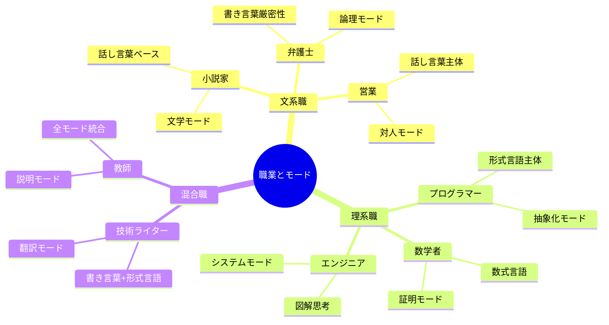

人が物事を捉え 理解しメンタルモデルを構成する際に目にするテキストにおいて、あるいは メンタルモデルを通して 思考する際に利用するテキストにおいて、その表現方法について 網羅的に体系立ててください。例えば話し言葉でテキストを表現しそれを読み取り 頭の中で 話し言葉でテキストで考え アウトプットする、といったような表現方法に対して、例えば 書き言葉でテキストを表現しそれを読み取り やっぱり頭の中で 書き言葉でテキストを構成し アウトプットするといったような違いに着目しています。この時 特に重要なのが頭の中で 話し言葉で思考するか 書き言葉で思考するかという違いにおいては全く異なる 思考プロセス 頭の使いどころなのではないかと考えているところ。このことから それぞれの思考方法に慣れていなければ話し言葉と書き言葉とで それぞれ うまく理解や表現ができないのではないかと。分かりやすい例で行くと プログラマーがプログラミング言語 読んだり逆に頭の中で思考して記述したりする時にその際に頭の中で自然言語で色々と考えているかというとそうではなくて やっぱり頭の中では プログラミング言語で考えているはず。それと同じように話し言葉と書き言葉とでは方法も異なるのではないかと考えている。このように表現方法によって 思考方法も変わるということであれば それらを全て 体系的に 網羅し それぞれに対してマスターすることで それぞれの思考方法が得られるのではないかという考え。


# 思考言語モード論 - 完全ガイド

## 🔍 一言要約
表現形式が思考方法を規定し、各モードの習得が新たな認知能力を解放する

## 📚 目次
1. [はじめに](#はじめに)
2. [基本構造](#基本構造)
3. [思考言語の分類体系](#思考言語の分類体系)
4. [各モードの特性](#各モードの特性)
5. [時代背景と発見経緯](#時代背景と発見経緯)
6. [関連用語](#関連用語)
7. [メリットとデメリット](#メリットとデメリット)
8. [習得プロセス](#習得プロセス)
9. [実世界への応用](#実世界への応用)
10. [今後の発展](#今後の発展)

## 🌟 はじめに

「日本語で考える」と一言で言っても、実は複数の思考モードが存在します。

**日常例：**
- 友人との会話を思い出す時 → 話し言葉で再生される
- 論文を書く時 → 書き言葉で構成される
- プログラミング時 → コードそのもので思考する

これは単なる「表現の違い」ではなく、**脳の使い方そのものが変わる**現象です。


## 🏗️ 基本構造

### コア概念：表現-思考-理解の循環


**重要な洞察：**
- 入力形式と出力形式が一致しても、内部処理が異なる可能性
- 各モードは独立した「認知スキル」として習得が必要
- モード切り替えには認知的コストが発生

## ⚡ 思考言語の分類体系

### 第1層：自然言語系


### 第2層：詳細分類

| 大分類 | 中分類 | 小分類 | 思考特性 |
|--------|--------|--------|----------|
| **自然言語系** | 話し言葉 | 方言モード | 地域文化に根ざした認知 |
| | | 敬語モード | 社会関係性を含む思考 |
| | 書き言葉 | 論文モード | 厳密な論理構築 |
| | | 文学モード | 美的・感情的思考 |
| **形式言語系** | プログラミング | 宣言的 | 「何を」中心 |
| | | 手続き的 | 「どうやって」中心 |
| | 数学 | 代数的 | 変数・方程式思考 |
| | | 幾何的 | 図形・空間思考 |
| **混合系** | 擬似コード | 自然言語+構文 | ブリッジ思考 |
| | 技術文書 | 専門用語+論理 | ドメイン特化思考 |

## 📗 各モードの特性

### 1. 話し言葉モード

**認知プロセス：**


**特徴：**
- 時間軸に沿った線形処理
- 省略・言い直しが自然
- 感情・ニュアンスを含む
- リアルタイム性が高い

### 2. 書き言葉モード

**認知プロセス：**


**特徴：**
- 空間的・構造的処理
- 完結性・明示性重視
- 論理的接続が明確
- 推敲・編集が可能

### 3. 形式言語モード（プログラミング）

**認知プロセス：**


**特徴：**
- 抽象的構造の操作
- 厳密な構文規則
- 実行可能性を含む
- 自然言語なしで完結

## 📜 時代背景と発見経緯

### 認知科学の発展史


**重要な発見：**

1. **ヴィゴツキーの内言（1930s）**
   - 外言（話し言葉）→内言（思考言語）への変換
   - 内言は圧縮され、述語中心

2. **サピア＝ウォーフ仮説（1940s）**
   - 言語が思考を規定する（強い解釈）
   - 言語が思考に影響する（弱い解釈）

3. **プログラマーの認知研究（1980s-）**
   - 専門家は「コードで考える」
   - 初心者は自然言語経由で理解

4. **バイリンガル研究（2000s-）**
   - 使用言語で性格が変わる現象
   - 言語ごとの思考パターン

## 📗 関連用語

### 同義語・類義語
- **内言**：ヴィゴツキーの用語、思考言語の原型
- **メンタル言語**：認知科学での表現
- **思考コード**：内部表現形式の総称
- **認知モード**：処理方式を強調

### 対義語
- **外言**：外部に表出された言語
- **表層表現**：深層思考と対比

### 多義的な関連概念
- **言語相対性**：言語が思考に与える影響度
- **コードスイッチング**：モード切り替え現象
- **翻訳思考**：モード間変換プロセス

### 比較：類似概念との違い

| 概念 | 焦点 | 本理論との関係 |
|------|------|----------------|
| 内言 | 言語の内面化 | 思考言語モードの基礎 |
| メタ認知 | 思考の監視 | モード切り替えの制御 |
| ワーキングメモリ | 一時的保持 | モード処理の作業域 |
| スキーマ | 知識構造 | モード内の表象形式 |

## 💡 メリットとデメリット

### 📊 モード別比較


### 統合的評価

**認知負荷の比較：**
- 話し言葉 < 書き言葉 < 形式言語（習得前）
- 話し言葉 ≒ 書き言葉 ≒ 形式言語（習得後）

**表現力の比較：**
- 感情表現：話し言葉 > 書き言葉 > 形式言語
- 論理性：形式言語 > 書き言葉 > 話し言葉
- 創造性：全モードで高いが質が異なる

## 🚀 習得プロセス

### 段階的学習モデル


### 実践的トレーニング法

**1. 話し言葉→書き言葉変換訓練**
```
練習：
1. 会話を録音
2. 書き起こし
3. 書き言葉に変換
4. 違いを分析
```

**2. 書き言葉→形式言語変換訓練**
```
練習：
1. 手順書を書く
2. フローチャート化
3. 擬似コード化
4. 実コード化
```

**3. モード切り替え訓練**
```
練習：
1. 同じ内容を3モードで表現
2. 各モードの思考プロセスを観察
3. 切り替え時の感覚を記録
```

## 🌍 実世界への応用

### 職業別の重要モード



### 具体的応用例

**1. 教育現場**
- 数学：自然言語→数式への変換訓練
- プログラミング：擬似コードを経由した段階的習得
- 作文：話し言葉からの書き言葉化指導

**2. ビジネス**
- プレゼン：書き言葉資料+話し言葉説明の分離
- 技術文書：形式的表現と自然言語説明の併用
- 会議：モード切り替えによる創造性と論理性の両立

**3. 個人の認知能力向上**
- マルチモーダル思考による問題解決力向上
- モード切り替えによる認知柔軟性獲得
- 各モードの強みを活かした学習効率化

## 🔄 置換と変遷

### 何を置き換えたか

**従来の二分法を置換：**


### 何に置き換えられる可能性

**将来の発展：**
- AI思考モード：LLM的な連想・生成思考
- 拡張現実モード：3D空間での思考表現
- 脳-機械インターフェース：直接的思考伝達

## ⚔️ 代替と競合

### 代替可能性

**モード間の代替：**


**ただし完全代替は不可：**
- 話し言葉の即興性は書き言葉で再現困難
- 形式言語の厳密性は自然言語で模倣のみ
- 各モードに固有の「思考の質」が存在

### 競合する理論

| 理論 | 主張 | 本理論との違い |
|------|------|----------------|
| 言語思考同一説 | 言語=思考 | モード多様性を認める |
| 普遍言語説 | 思考言語は万国共通 | 文化・形式依存を認める |
| 非言語的思考説 | 言語なしで思考可能 | 言語形式的表現を含む |

## 🌐 実世界への影響とその後の発展

### 現在の影響

**教育分野：**
- モード別トレーニングの導入
- プログラミング教育の再設計
- 多言語教育の新アプローチ

**技術分野：**
- プログラミング言語設計の人間工学的改善
- IDE（開発環境）のマルチモーダル化
- コード可読性の新基準

**認知科学：**
- 脳活動研究の新視点
- バイリンガリズム研究の深化
- 人工知能の思考モデル

### 未来展望


**期待される発展：**
1. **教育革命**：各モードの体系的習得により認知能力が大幅向上
2. **コミュニケーション改善**：モード意識による誤解の減少
3. **創造性の解放**：モード切り替えによる新しい発想法
4. **AI協働**：人間とAIがそれぞれ得意なモードで協力

---
