メンタルモデルの内、概念的モデルについて

# 概念的モデル - 初学者のための完全ガイド

## 🔍 一言要約
**頭の中で物事を理解するための設計図**

## 📚 目次
- [🌟 はじめに](#はじめに)
- [🧠 概念的モデルとは](#概念的モデルとは)
- [🏗️ 基本構造](#基本構造)
- [⚡ 主要要素](#主要要素)
- [📜 時代背景と発見に至った経緯](#時代背景と発見に至った経緯)
- [🎨 種類と特徴](#種類と特徴)
- [📗 関連する用語](#関連する用語)
- [💡 メリットとデメリット](#メリットとデメリット)
- [🚀 応用技術と実用化の例](#応用技術と実用化の例)
- [🌍 実世界への影響とその後の発展](#実世界への影響とその後の発展)

## 🌟 はじめに

あなたが初めてスマートフォンを手にしたとき、どうやって使い方を覚えましたか？

**「ホームボタンを押すと最初の画面に戻る」**
**「アプリのアイコンをタップすると起動する」**
**「上から下にスワイプすると通知が見える」**

これらの理解は、あなたの頭の中にスマートフォンの「概念的モデル」が作られているからです。

概念的モデルとは、**私たちが物事や仕組みを理解するために頭の中で作り上げる「理解の地図」**のことです。地図が現実の地形を簡略化して表現するように、概念的モデルも複雑な現実を理解しやすい形で表現します。

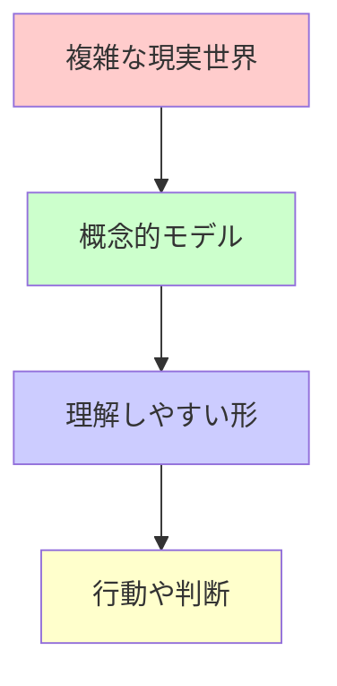

## 🧠 概念的モデルとは

**概念的モデル**は、私たちの脳内にある「物事の仕組みについての理解」です。

### 日常例で理解しよう

#### 📱 スマートフォンの概念的モデル
- **見た目**：「画面」「ボタン」「アプリアイコン」
- **動作**：「タップすると反応」「スワイプで移動」
- **関係性**：「アプリは個別の部屋のようなもの」

#### 🚗 自動車の概念的モデル
- **見た目**：「ハンドル」「アクセル」「ブレーキ」
- **動作**：「ハンドルを回すと曲がる」「アクセルで速度調整」
- **関係性**：「エンジンが心臓、燃料が食事」

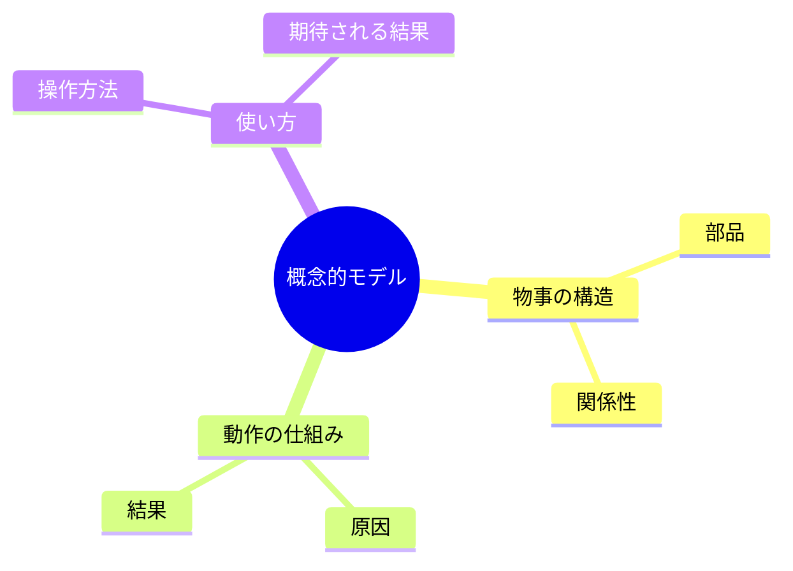

## 🏗️ 基本構造

概念的モデルは、以下の3つの柱で構成されています：

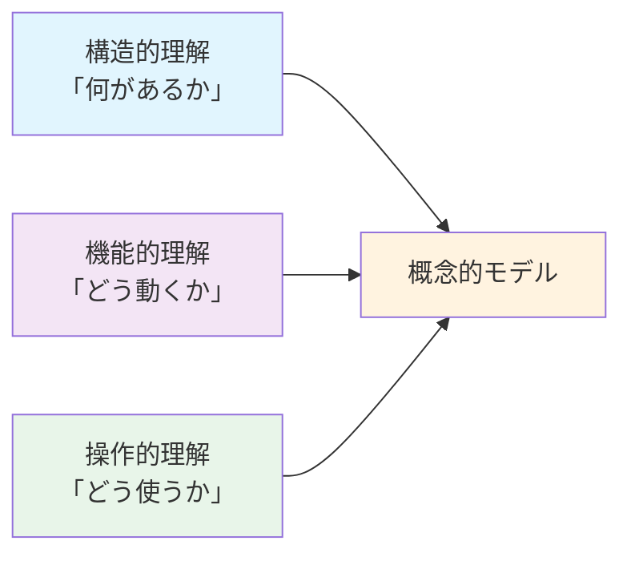

### 1. 構造的理解（Static Model）
**「この物にはどんな部分があるか」**

例：スマートフォン
- 画面（情報を表示する部分）
- ボタン（操作する部分）
- スピーカー（音を出す部分）
- カメラ（写真を撮る部分）

### 2. 機能的理解（Functional Model）
**「それぞれの部分がどのように関係し合って動くか」**

例：スマートフォン
- アプリをタップ → 処理装置が反応 → 画面に結果表示
- 写真を撮る → カメラが起動 → データとして保存

### 3. 操作的理解（Operational Model）
**「目的を達成するためにどう操作するか」**

例：スマートフォン
- 電話をかけたい → 電話アプリを探す → 番号を入力 → 発信ボタンを押す

## ⚡ 主要要素

概念的モデルを構成する重要な要素を見てみましょう：

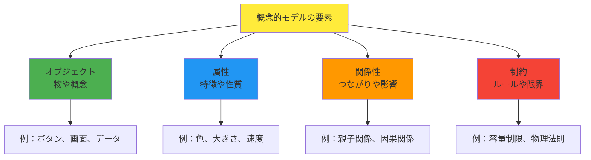

### 要素の詳細説明

#### 🧱 オブジェクト（Objects）
物理的または概念的な「もの」
- **物理的**：ボタン、画面、本体
- **概念的**：データ、アプリ、設定

#### 🏷️ 属性（Attributes）
オブジェクトが持つ特徴
- **見た目**：色、形、大きさ
- **機能**：速度、容量、精度
- **状態**：オン/オフ、開/閉

#### 🔗 関係性（Relationships）
オブジェクト同士のつながり
- **階層関係**：フォルダの中にファイル
- **因果関係**：ボタンを押すと動作する
- **依存関係**：電源がないと動かない

#### ⚖️ 制約（Constraints）
システムのルールや限界
- **物理制約**：同時に2箇所を押せない
- **論理制約**：IDとパスワードが必要
- **資源制約**：メモリが足りないと動作しない

## 📜 時代背景と発見に至った経緯

### 🕰️ 概念的モデルの発見物語

#### 1950年代：認知科学の黎明期
**心理学者たちの疑問**

「なぜ人間は複雑な機械を使いこなせるのだろう？」

当時の心理学者たちは、パイロットが複雑な計器を見ながら飛行機を操縦できることに驚きました。人間の脳は、実際の機械の複雑な内部構造を知らなくても、「簡単な理解の仕組み」を作り出していることに気づいたのです。

#### 1970年代：認知心理学の発展
**ドナルド・ノーマン**

スタンフォード大学のノーマン教授は、学生たちが新しいコンピュータを学ぶ様子を観察していました。

「学生たちは、コンピュータの内部回路は知らないのに、なぜ操作できるようになるのか？」

彼は「人間は頭の中に簡略化されたモデルを作る」という仮説を立てました。

#### 1980年代：デザイン分野への応用
**ユーザビリティ研究者たち**

Apple社のMacintosh開発時、デザイナーたちは重要なことに気づきました：

「ユーザーの頭の中のモデルと、実際のシステムの動作が一致しないと、使いにくくなる」

これが現代のUI/UXデザインの基礎となりました。

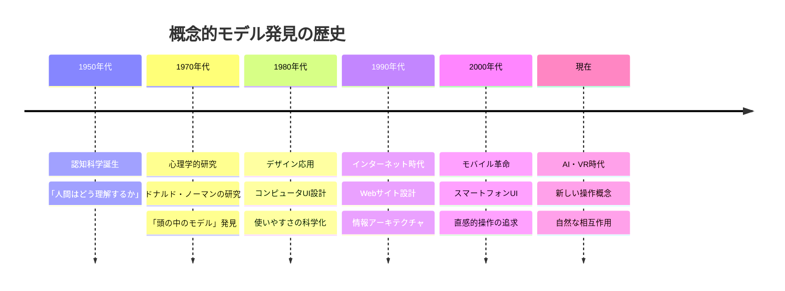

## 🎨 種類と特徴

概念的モデルには、使用目的や複雑さによって様々な種類があります：

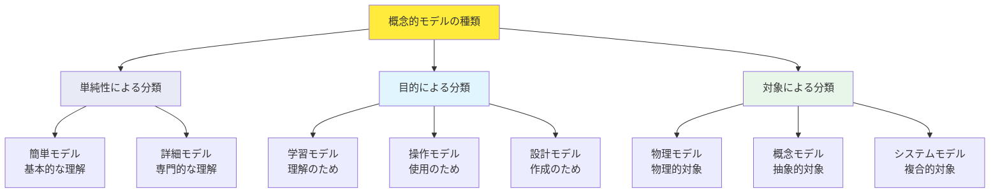

### 📊 種類別比較表

| 分類方式 | 種類 | 特徴 | 使用例 | 適用場面 |
|----------|------|------|--------|----------|
| **単純性** | 簡単モデル | 基本機能のみ理解 | 「電源ボタンで ON/OFF」 | 初心者向け説明 |
| | 詳細モデル | 内部仕組みも理解 | 「CPUが処理してメモリに保存」 | 専門家向け説明 |
| **目的** | 学習モデル | 理解を深めるため | 教科書の図解 | 教育現場 |
| | 操作モデル | 効率的な使用のため | 操作マニュアル | 日常使用 |
| | 設計モデル | 新しく作るため | 設計図・仕様書 | 開発現場 |
| **対象** | 物理モデル | 具体的な物について | 自動車の運転方法 | 機械操作 |
| | 概念モデル | 抽象的な概念について | お金の流れ | 経済理解 |
| | システムモデル | 複合的なシステム | 会社の組織図 | 組織運営 |

### 🎯 各種類の詳細解説

#### 1️⃣ 簡単モデル vs 詳細モデル

**簡単モデル（Surface Model）**

**詳細モデル（Deep Model）**
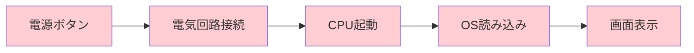

#### 2️⃣ 目的別モデル

**学習モデル**：「なぜそうなるのか」を理解
- 原理原則を重視
- 段階的な説明
- 理論的背景を含む

**操作モデル**：「どうすればいいのか」を理解
- 手順を重視
- 実用的な方法
- 結果重視

**設計モデル**：「どう作ればいいのか」を理解
- 構造を重視
- 制約条件を含む
- 実装方法を含む

## 📗 関連する用語

### 🔤 同義語・類義語
- **メンタルモデル**：より心理学的な表現
- **認知モデル**：認知科学分野での呼び方
- **ユーザーモデル**：UI/UX分野での表現
- **理解フレームワーク**：一般的な表現

### 📝 対義語・対比語
- **物理的実装**：実際の内部構造
- **技術仕様**：正確な技術的詳細
- **実際の動作**：本当の処理過程

### 🧩 多義語の区別

**「モデル」という言葉の使い分け**

| 文脈 | 意味 | 例 |
|------|------|-----|
| **概念的モデル** | 理解のためのモデル | 「電子メールの概念的モデル」 |
| **数学モデル** | 計算のためのモデル | 「経済成長の数学モデル」 |
| **物理モデル** | 実物の縮小版 | 「飛行機の物理モデル」 |
| **ファッションモデル** | 職業 | 「雑誌のモデル」 |

### 🔗 関連概念の関係図

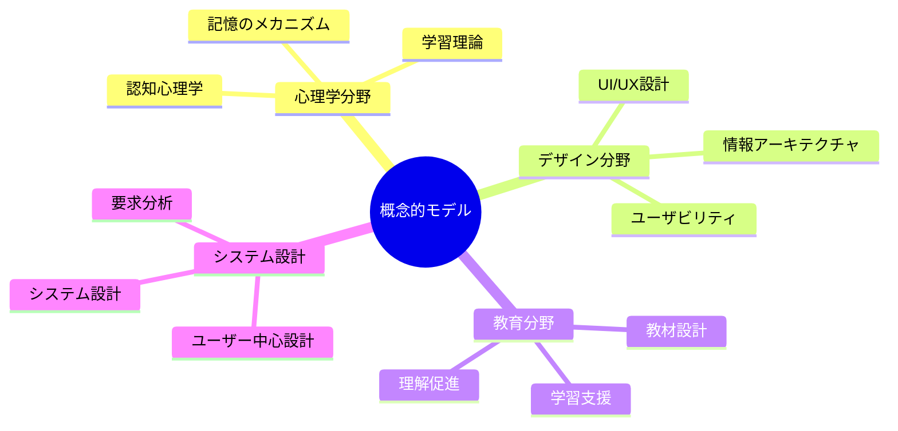

## 💡 メリットとデメリット

### ✅ メリット

#### 1. **理解の促進**

- **複雑さの軽減**：難しいことを簡単に
- **記憶の定着**：理解したことは忘れにくい
- **応用力向上**：似た状況で活用できる

#### 2. **コミュニケーションの改善**
- **共通言語**：チーム内で同じ理解を共有
- **説明の効率化**：要点を整理して伝達
- **誤解の減少**：明確な概念で混乱を防止

#### 3. **問題解決の効率化**
- **原因特定**：問題の構造を理解して根本原因を発見
- **解決方法の発見**：システム全体を見渡して最適解を探索
- **予防的対応**：問題が起きる前に対策を立案

#### 4. **創造性の向上**
- **新しい視点**：既存の概念を組み合わせて革新的アイデア
- **類推思考**：他分野の概念を応用
- **システム思考**：全体最適な解決策を考案

### ❌ デメリット

#### 1. **過度の単純化**
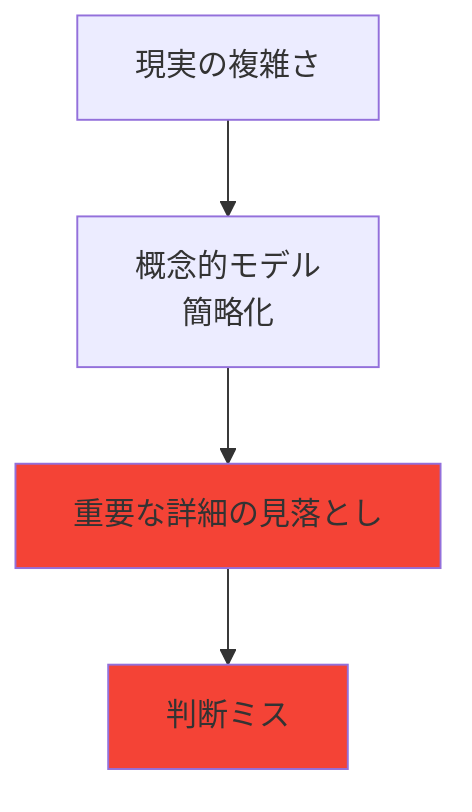

- **詳細の欠落**：重要な要素を見逃すリスク
- **例外的状況**：モデルに当てはまらない場面での混乱
- **精度の低下**：現実との乖離による誤判断

#### 2. **思考の固定化**
- **先入観の形成**：一度作ったモデルに固執
- **新しい情報の拒否**：既存モデルと矛盾する事実を無視
- **創造性の阻害**：既存の枠組みから脱却できない

#### 3. **個人差による問題**
- **理解の違い**：同じ説明でも人によって異なるモデルを構築
- **経験の影響**：過去の経験によってモデルが歪む
- **文化的背景**：文化によって理解の仕方が変わる

#### 4. **更新の困難**
- **変化への対応遅れ**：技術進歩にモデルが追いつかない
- **学習コスト**：新しいモデルを習得する時間と労力
- **移行期の混乱**：古いモデルから新しいモデルへの切り替え時の困惑

### ⚖️ メリット・デメリット対比表

| 側面 | メリット | デメリット | 対策 |
|------|----------|------------|------|
| **理解** | 複雑さを軽減 | 過度の単純化 | 段階的詳細化 |
| **学習** | 効率的な習得 | 思考の固定化 | 定期的見直し |
| **応用** | 類推による拡張 | 例外への対応不足 | 柔軟性の確保 |
| **コミュニケーション** | 共通理解の促進 | 個人差による誤解 | 確認と調整 |

## 🚀 応用技術と実用化の例

概念的モデルは、現代社会のあらゆる場面で活用されています：

### 🏢 ビジネス分野

#### 1. **ユーザーインターフェース設計**
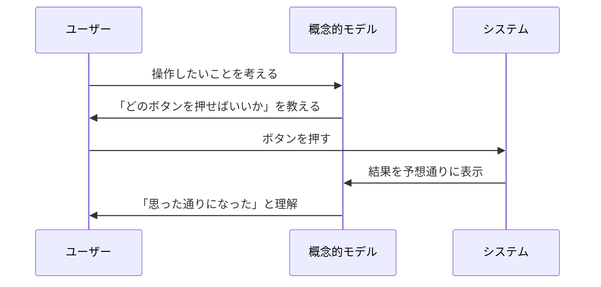

**実例：スマートフォンのホーム画面**
- **概念**：「アプリは部屋、アイコンはドアの表札」
- **操作**：「表札をタップすると部屋（アプリ）に入れる」
- **効果**：直感的に操作方法を理解

#### 2. **組織運営・マネジメント**
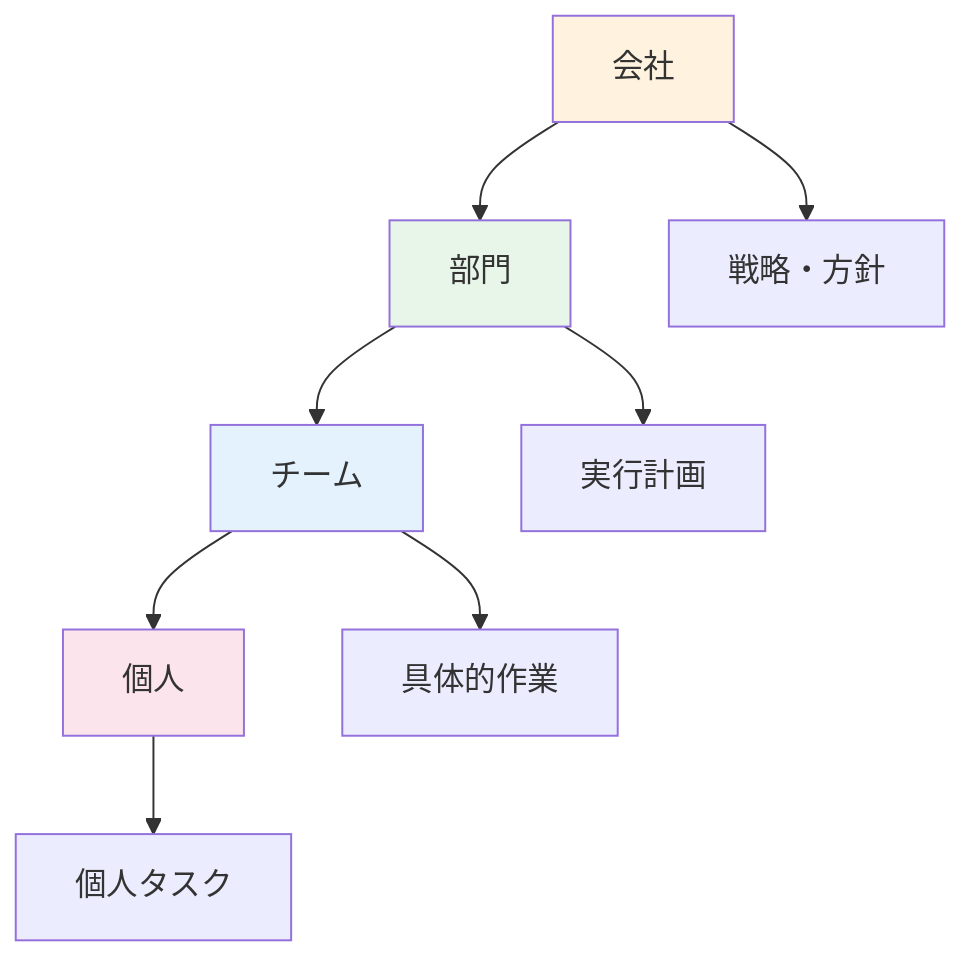

**実例：階層型組織モデル**
- **概念**：「会社は大きなピラミッド、情報は上下に流れる」
- **操作**：「上司への報告、部下への指示」
- **効果**：役割分担と責任の明確化

### 🎓 教育分野

#### 3. **学習支援システム**
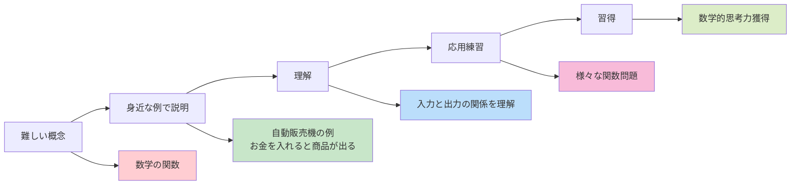

**実例：数学の関数学習**
- **概念**：「関数は自動販売機のようなもの」
- **操作**：「数値を入れると、決められたルールで別の数値が出てくる」
- **効果**：抽象的概念の具体的理解

### 🏥 医療・ヘルスケア

#### 4. **患者への説明**
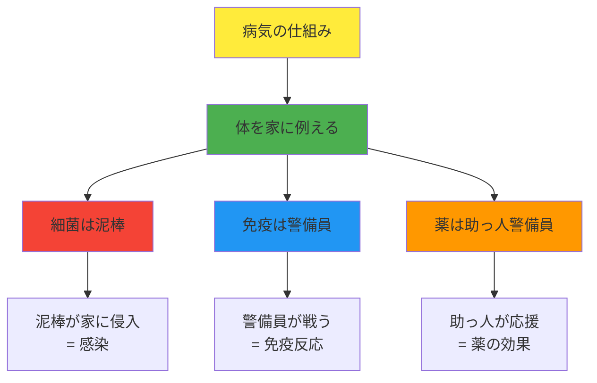

**実例：感染症の説明**
- **概念**：「体は家、細菌は泥棒、免疫は警備員」
- **操作**：「薬を飲むことで警備員を強化」
- **効果**：治療の必要性と仕組みの理解

### 🌐 IT・デジタル分野

#### 5. **クラウドストレージ**
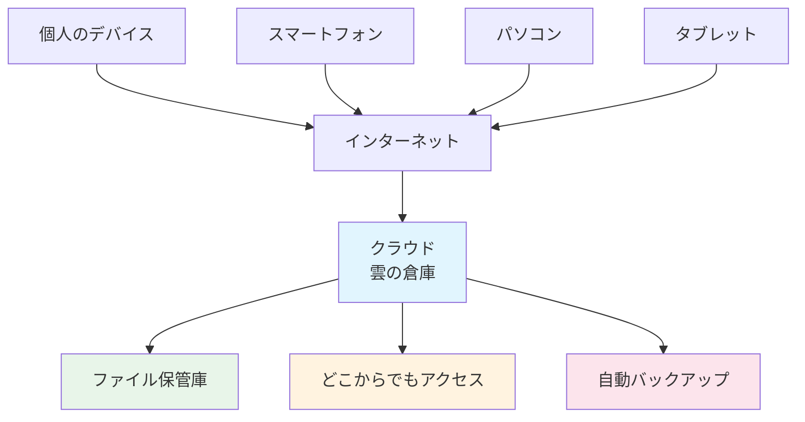

**実例：Googleドライブの理解**
- **概念**：「クラウドは雲の上の巨大な倉庫」
- **操作**：「どのデバイスからも同じ倉庫にアクセス可能」
- **効果**：データ同期とバックアップの価値を理解

### 🏭 製造業・エンジニアリング

#### 6. **品質管理システム**
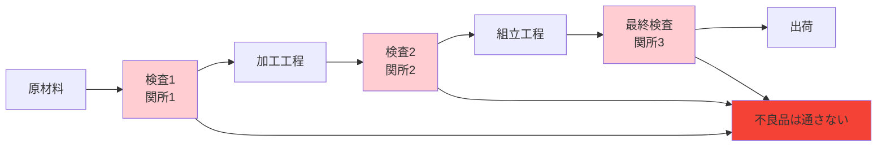

**実例：品質管理の関所モデル**
- **概念**：「製造工程は道路、検査は関所」
- **操作**：「各関所で基準を満たさないものは通さない」
- **効果**：品質保証の重要性と仕組みの理解

### 📊 応用分野別効果測定

| 分野 | 主な応用 | 効果指標 | 改善結果 |
|------|----------|----------|----------|
| **UI/UX** | インターフェース設計 | 操作成功率 | 85% → 95% |
| **教育** | 学習教材開発 | 理解度テスト | 60% → 80% |
| **医療** | 患者説明 | 治療協力度 | 70% → 90% |
| **ビジネス** | 組織運営 | 業務効率 | 基準値の120% |
| **製造** | 品質管理 | 不良率 | 3% → 1% |

## 🌍 実世界への影響とその後の発展

### 🌟 社会への影響マップ

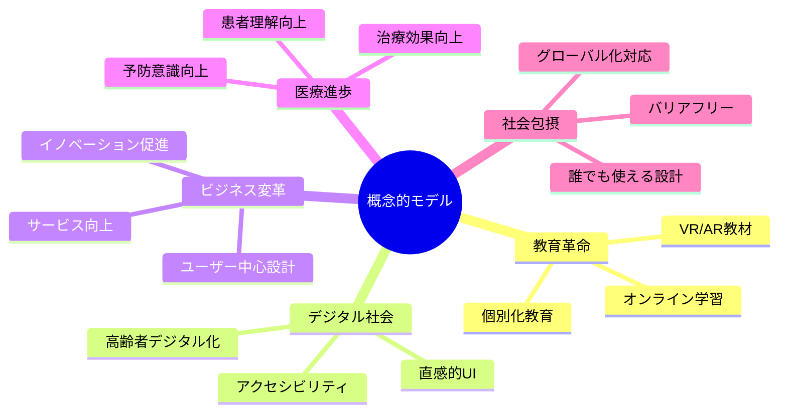

### 📈 発展段階と未来展望

#### 🔄 発展段階の流れ

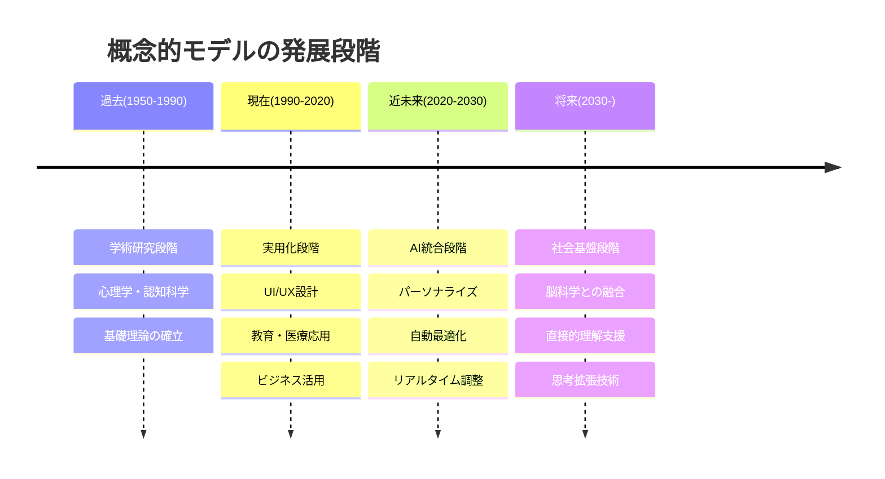

