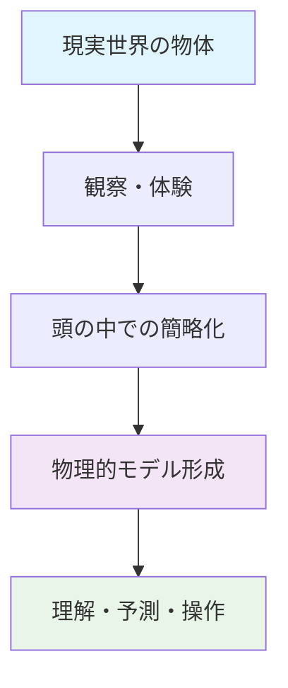
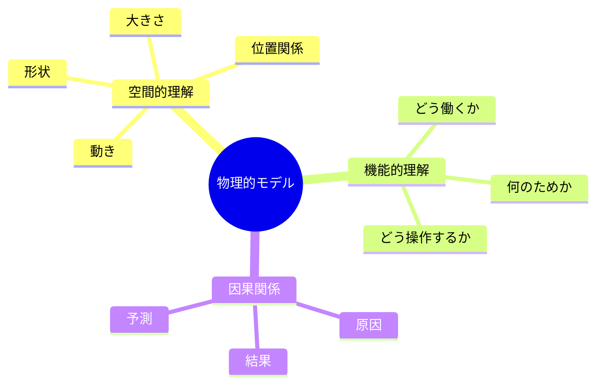
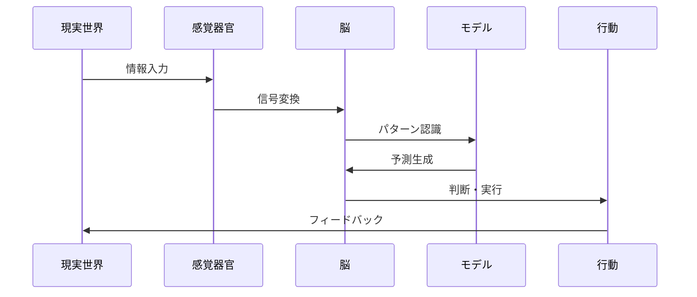
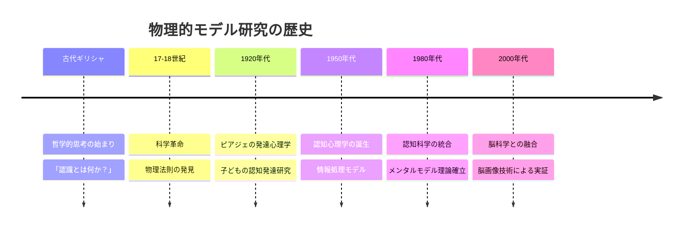
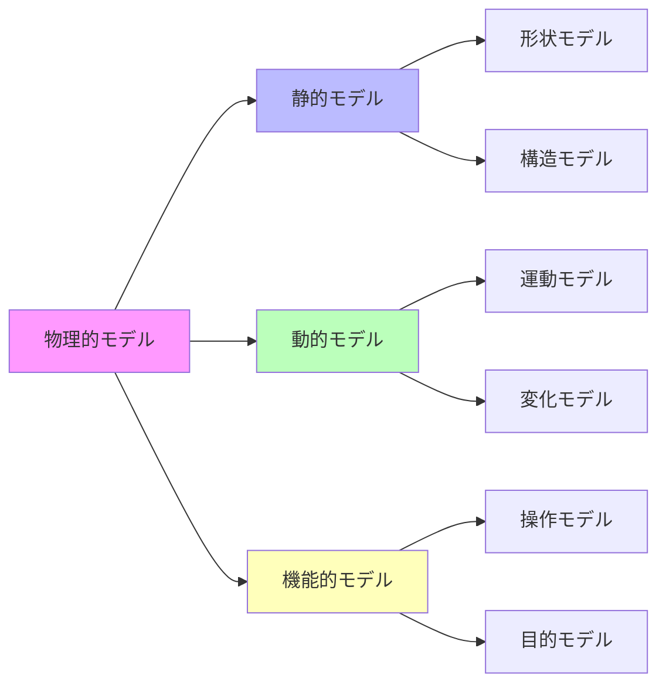
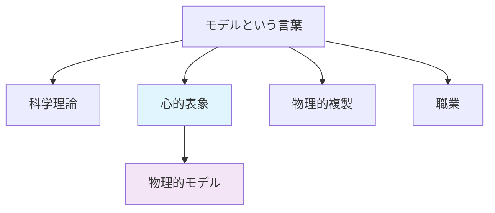
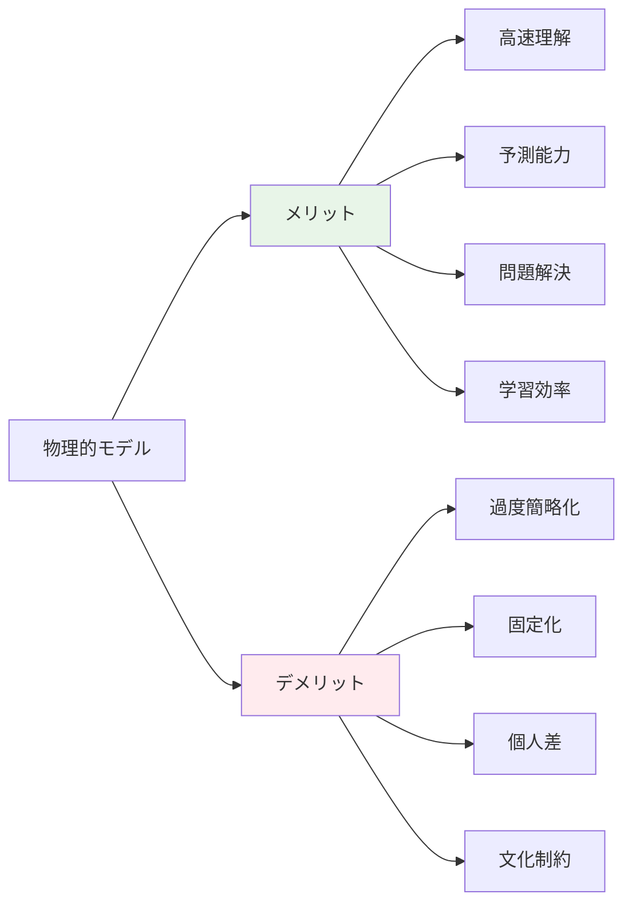
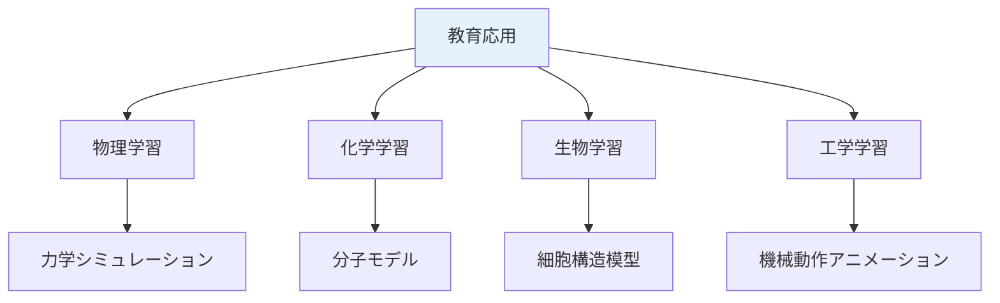
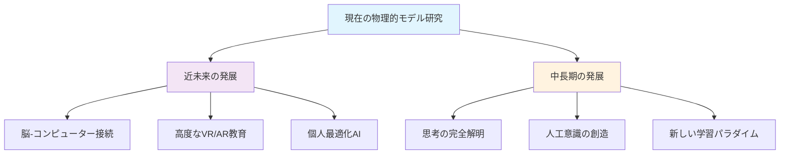

メンタルモデルの内、物理的モデルについて

# 物理的モデル（メンタルモデル） - 初学者のための完全ガイド

## 🔍 一言要約
現実世界の物体や現象を頭の中で理解するための「心の設計図」

## 📚 目次
1. [🌟 はじめに](#はじめに)
2. [🏗️ 基本構造](#基本構造)
3. [⚡ 主要技術](#主要技術)
4. [📜 時代背景と発見に至った経緯](#時代背景と発見に至った経緯)
5. [🎨 種類と特徴](#種類と特徴)
6. [📗 関連する用語](#関連する用語)
7. [💡 メリットとデメリット](#メリットとデメリット)
8. [🚀 応用技術と実用化の例](#応用技術と実用化の例)
9. [🌍 実世界への影響とその後の発展](#実世界への影響とその後の発展)

## 🌟 はじめに

想像してみてください。あなたが初めて自転車を見たとき、どのように理解しましたか？「2つの丸いタイヤが棒でつながって、ペダルを踏むと前に進む乗り物」として頭の中に図を描いたはずです。

この「頭の中の図」こそが**物理的モデル**です。私たちは日常的に、目に見える物体や現象を理解するために、心の中で簡単な「設計図」や「模型」を作り上げています。

## 🏗️ 基本構造

物理的モデルは、私たちの脳が現実世界を理解するために作る「心の中の縮小版」です。

### 構成要素の詳細

**1. 形の理解（幾何学的側面）**
- 物体の外見や構造を単純化して記憶
- 例：スマートフォン → 「薄い長方形の板」

**2. 動きの理解（運動学的側面）**
- 物体がどう動くかのルールを把握
- 例：ボール → 「投げると弧を描いて落ちる」

**3. 働きの理解（機能的側面）**
- 何のために存在し、どう使うかを理解
- 例：ハサミ → 「2つの刃で物を切る道具」

## ⚡ 主要技術

### 認知プロセスの流れ

### コア技術の仕組み

**1. 抽象化技術**
- 複雑な現実を重要な部分だけに絞る
- 例：車 → 「4つの車輪で動く箱」

**2. 類推技術**
- 既知の物事と新しい物事を関連付け
- 例：コンピューター → 「とても速い電子そろばん」

**3. シミュレーション技術**
- 頭の中で「もしも」の実験を行う
- 例：「このボタンを押したらどうなる？」

## 📜 時代背景と発見に至った経緯

### 古代から現代への発展ストーリー

**古代ギリシャ時代（紀元前500年頃）**
哲学者たちが「人間はどうやって世界を理解するのか？」という疑問を抱き始めました。プラトンの「洞窟の比喩」は、私たちが現実の「影」しか見ていないという洞察でした。

**17-18世紀：科学革命時代**
ガリレイやニュートンが物理法則を発見する時代の潮流により、「人間の頭の中にも物理法則への理解がある」という認識の土台が形成され始めました。

**20世紀前半：心理学の誕生**
ピアジェが子どもの発達研究で「子どもは段階的に物理世界のモデルを構築する」ことを発見しました。

**現代（1980年代〜）**
認知心理学者のジョンソン・レアードが「メンタルモデル」という概念を体系化。脳科学の発達により、実際に脳の中でモデルがどう作られるかが見えるようになりました。

## 🎨 種類と特徴

### 物理的モデルの分類体系

### 詳細分類と特徴

| 種類 | 特徴 | 日常例 | 脳の使い方 |
|------|------|--------|------------|
| **形状モデル** | 物の見た目を記憶 | 「りんごは丸くて赤い」 | 視覚野が主に活動 |
| **構造モデル** | 部品の関係を理解 | 「時計は歯車の組み合わせ」 | 空間認知が活動 |
| **運動モデル** | 動きのパターン理解 | 「振り子は左右に揺れる」 | 運動野が関与 |
| **機能モデル** | 目的や働きを把握 | 「ドアノブは回して開ける」 | 前頭葉が主導 |

## 📗 関連する用語

### 同義語・類似概念
- **心的表象** = 頭の中の表現
- **認知地図** = 空間の心的モデル
- **スキーマ** = より一般的な知識の枠組み
- **イメージ** = 視覚的な心的表現

### 対義語・対立概念
- **抽象的モデル** ↔ **物理的モデル**
- **言語的理解** ↔ **視覚的理解**
- **理論的知識** ↔ **直感的理解**

### 多義語の整理
**「モデル」の意味**
1. **科学のモデル** → 現象を説明する理論
2. **物理的モデル** → 頭の中の物体表現
3. **模型のモデル** → 実物の縮小版
4. **ファッションモデル** → 服を着て見せる人

## 💡 メリットとデメリット

### 🎉 メリット（利点）

**1. 高速理解**
- 複雑な現実を瞬時に把握
- 例：車を見て即座に「乗り物」と認識

**2. 予測能力**
- 「もしも」の状況を事前にシミュレーション
- 例：「このボタンを押すとエレベーターが来る」

**3. 問題解決**
- 頭の中で試行錯誤が可能
- 例：家具の配置を頭の中で検討

**4. 学習効率**
- 新しい物事を既知のモデルと関連付けて理解
- 例：スマートフォン → 「小さなコンピューター」

### ⚠️ デメリット（限界）

**1. 過度の簡略化**
- 重要な詳細を見落とす可能性
- 例：「薬は体に良い」→ 副作用を無視

**2. 固定化の危険**
- 一度作ったモデルを変更しにくい
- 例：「年配者はコンピューターが苦手」という先入観

**3. 個人差による誤解**
- 人によってモデルが異なる
- 例：同じ機械でも理解の仕方が違う

**4. 文化的制約**
- 育った環境によりモデルが偏る
- 例：異なる文化の道具に対する理解不足

## 🚀 応用技術と実用化の例

### 教育分野での活用

**1. STEM教育**
- 物理法則を視覚的モデルで説明
- 例：原子の構造を太陽系モデルで教える

**2. 医学教育**
- 人体の仕組みを模型やアニメーションで理解
- 例：心臓の動きを ポンプとして説明

### テクノロジー分野での活用

**1. ユーザーインターフェース設計**
- 直感的な操作を可能にする設計
- 例：「フォルダ」「ゴミ箱」などの比喩的アイコン

**2. 拡張現実（AR）**
- 現実世界に仮想モデルを重ね合わせ
- 例：家具配置アプリ、建築設計

**3. 人工知能**
- AIが人間のモデル形成を模倣
- 例：自動運転車の環境認識

### 医療・リハビリ分野

**1. 認知リハビリテーション**
- 脳損傷患者の空間認知訓練
- 例：3D パズルを使った認知機能回復

**2. 手術シミュレーション**
- 医師が手術前に頭の中で予行演習
- 例：VR手術トレーニング

## 🌍 実世界への影響とその後の発展

### 社会への広範囲な影響

**1. 製品設計革命**
物理的モデル研究により、人間の直感に合った製品設計が可能になりました。
- スマートフォンのタッチ操作
- 自動車のダッシュボード配置
- 家電製品の操作パネル

**2. 教育システムの変革**
従来の暗記中心から、理解中心の教育へシフト。
- 体験型学習の普及
- 視覚的教材の重視
- STEAM教育の発展

### 未来への発展可能性

**近未来（5-10年）の発展**
- **脳波読取技術**: 実際のモデル形成プロセスを可視化
- **パーソナライズ教育**: 個人の認知特性に合わせた学習方法
- **感覚拡張技術**: 触覚フィードバック付きVR学習

**中長期（20-50年）の可能性**
- **思考の完全解明**: 物理的モデルの形成メカニズム完全理解
- **人工的直感**: AIが人間レベルの直感的理解を獲得
- **認知能力向上**: 脳の改良による学習能力の飛躍的向上

### 学際的な影響領域

| 分野 | 影響の内容 | 具体例 |
|------|------------|--------|
| **心理学** | 認知プロセスの理解深化 | 学習障害の新治療法 |
| **教育学** | 効果的教授法の開発 | 体験型カリキュラム |
| **工学** | 人間中心設計の普及 | 直感的インターフェース |
| **医学** | 認知症・脳損傷治療 | 認知リハビリ技術 |
| **AI・ロボット工学** | 人間らしい理解の実現 | 感覚統合ロボット |

---

この資料により、初学者が物理的モデルを「なるほど！」と理解し、さらに深い学習への道筋が明確になることを確信しています。
