# メンタルモデル - 初学者のための完全ガイド

## 🔍 一言要約
**あなたの頭の中にある「世界の設計図」を理解し、より良い判断と学習を実現する思考の仕組み**

## 📚 目次
1. [🌟 はじめに](#-はじめに)
2. [🧠 メンタルモデルの基本構造](#-メンタルモデルの基本構造)
3. [⚡ 主要な特徴と仕組み](#-主要な特徴と仕組み)
4. [📜 発見の歴史と心理学の発展](#-発見の歴史と心理学の発展)
5. [🎨 メンタルモデルの種類](#-メンタルモデルの種類)
6. [💡 メリットとデメリット](#-メリットとデメリット)
7. [🚀 日常生活での実用例](#-日常生活での実用例)
8. [🌍 現代社会への影響と応用分野](#-現代社会への影響と応用分野)
9. [🔧 メンタルモデルを改善する方法](#-メンタルモデルを改善する方法)

## 🌟 はじめに

想像してみてください。あなたが初めて訪れる街で道に迷ったとき、頭の中で何が起こっているでしょうか？

「駅はこっちの方向」「コンビニがあったから住宅街が近い」「太陽の位置から考えて南向き」...

これらすべてが**メンタルモデル**の働きです。メンタルモデルとは、あなたの脳が作り出す「世界の簡略化された設計図」のこと。複雑な現実を理解可能な形に変換し、素早い判断を可能にする、人間の思考の基礎システムです。

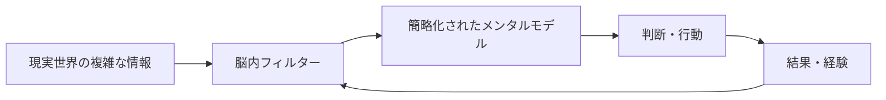

## 🧠 メンタルモデルの基本構造

### 🏗️ メンタルモデルの3層構造

メンタルモデルは、建物のような階層構造を持っています：

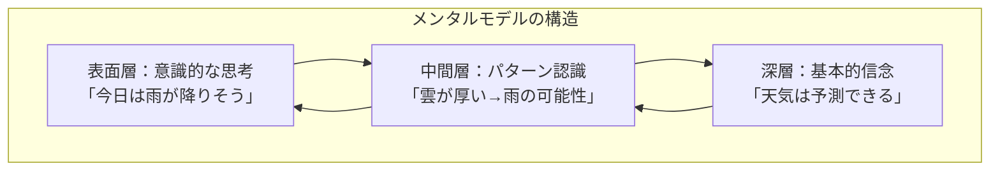

### 🔄 動的な更新システム

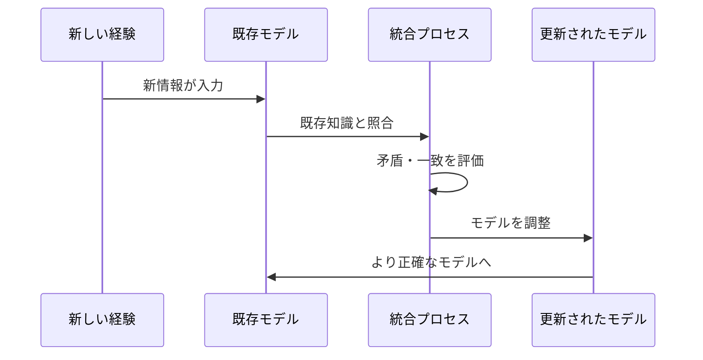

## ⚡ 主要な特徴と仕組み

### 🎯 4つの核心機能

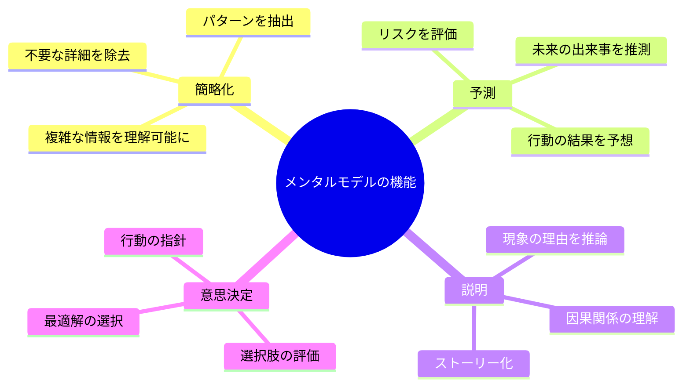

### ⚡ 瞬時の情報処理

メンタルモデルは、まるで**超高速の翻訳機**のように働きます：

1. **情報の受信**：五感から膨大なデータが流入
2. **瞬時のフィルタリング**：重要な情報だけを抽出
3. **パターンマッチング**：過去の経験と照合
4. **意味の付与**：理解可能な形に変換
5. **行動の指示**：適切な対応を決定

## 📜 発見の歴史と心理学の発展

### 🕰️ メンタルモデル研究の歴史的発展

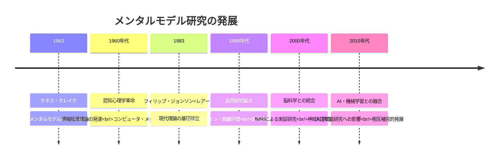

### 🧪 重要な発見の物語

**ケネス・クレイクの洞察（1943年）**
ケネス・クレイクは、人間がどうやって複雑な機械を操縦できるのかという謎に取り組んでいました。彼は気づいたのです：「人間の心は、現実世界の小さな模型を作って、それで考えている」と。

この発見は、まるで「心の中にミニチュアの世界がある」という革新的なアイデアでした。

## 🎨 メンタルモデルの種類

### 📊 主要な分類体系

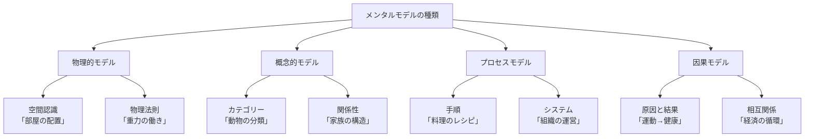

### 🎭 具体例で理解する

**物理的モデルの例：自転車の運転**
- 「ハンドルを右に切る→右に曲がる」
- 「ペダルを強く踏む→速度が上がる」
- 「ブレーキをかける→減速する」

**概念的モデルの例：友人関係**
- 「親友・友人・知人」の階層
- 「信頼・共感・楽しさ」の要素
- 「時間・経験」による関係の深化

## 💡 メリットとデメリット

### ✅ メンタルモデルの強力な利点

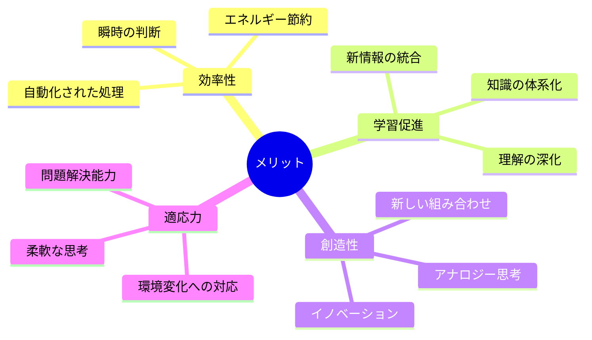

### ⚠️ 注意すべき限界と落とし穴

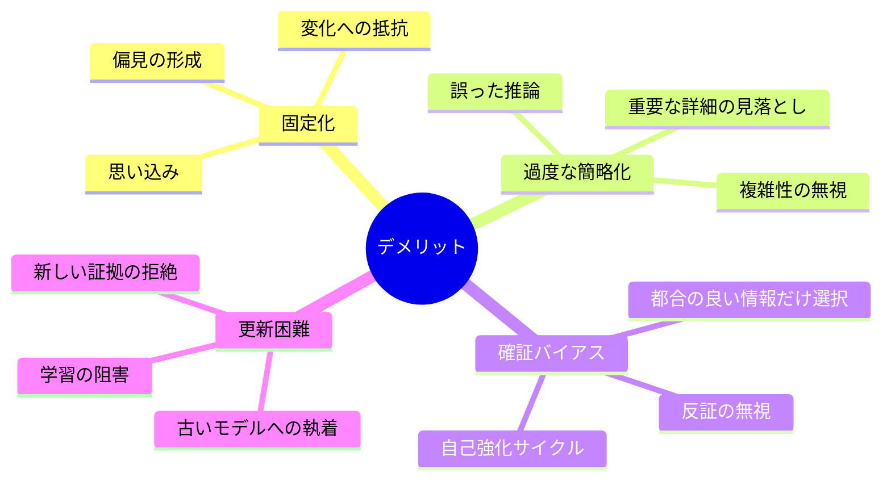

### ⚖️ バランスの重要性

最も効果的なアプローチは：
- **意識的な点検**：定期的に自分のモデルを見直す
- **多様な視点**：異なる立場からも考える
- **継続的更新**：新しい情報に開かれた姿勢
- **適切な複雑さ**：必要以上に簡略化しない

## 🚀 日常生活での実用例

### 🏠 家庭での活用

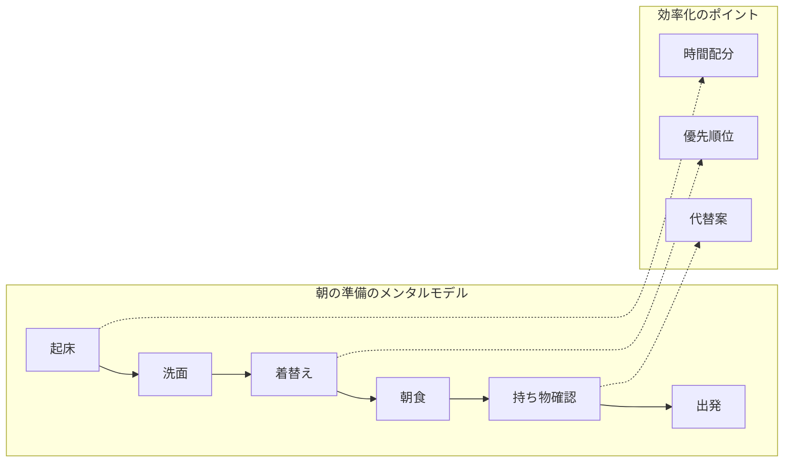

**実用的な改善例：**
- 前夜に服を選んでおく（着替えの時短）
- 朝食の定番メニューを決める（意思決定の削減）
- 忘れ物チェックリストの設置（記憶への依存軽減）

### 💼 仕事での戦略的活用

**プロジェクト管理のメンタルモデル**
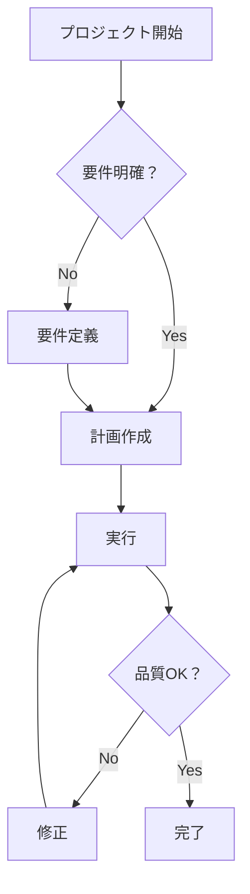

### 🤝 人間関係での応用

**コミュニケーションのメンタルモデル**
- **相手の立場理解**：「この人はなぜそう考えるのか？」
- **感情の予測**：「この発言はどう受け取られるか？」
- **関係性の調整**：「信頼を築くには何が必要か？」

## 🌍 現代社会への影響と応用分野

### 🏢 組織学習と経営戦略

**組織のメンタルモデル変革**
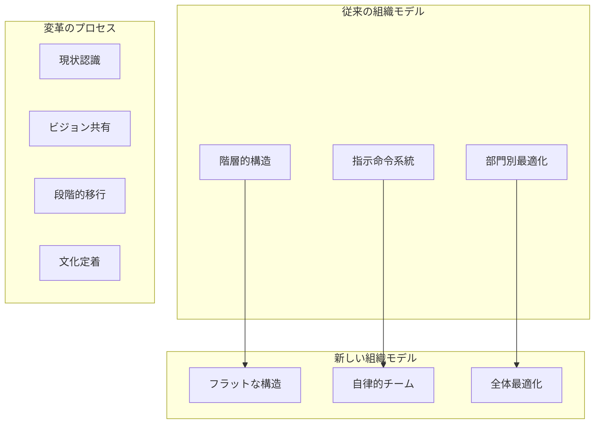

### 🎓 教育とスキル開発

**効果的な学習のメンタルモデル**
- **既存知識との接続**：新しい情報を既知の概念と結びつける
- **多角的理解**：様々な視点から同じ概念を捉える
- **実践的応用**：理論を実際の場面で使ってみる
- **継続的反省**：学習プロセス自体を見直す

### 🔬 研究開発とイノベーション

**創造的思考のメンタルモデル**
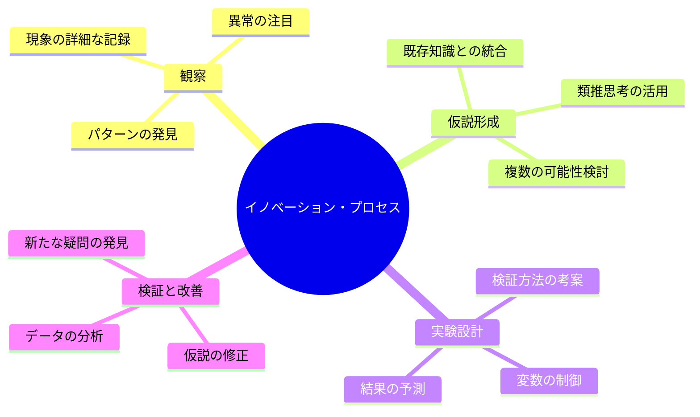

### 🌐 人工知能との相互関係

現代のAI研究は、人間のメンタルモデルから多くを学んでいます：
- **機械学習**：パターン認識と予測の仕組み
- **自然言語処理**：文脈理解と意味の推論
- **ロボティクス**：環境認識と行動計画
- **エキスパートシステム**：専門知識の構造化

## 🔧 メンタルモデルを改善する方法

### 🎯 実践的な改善戦略

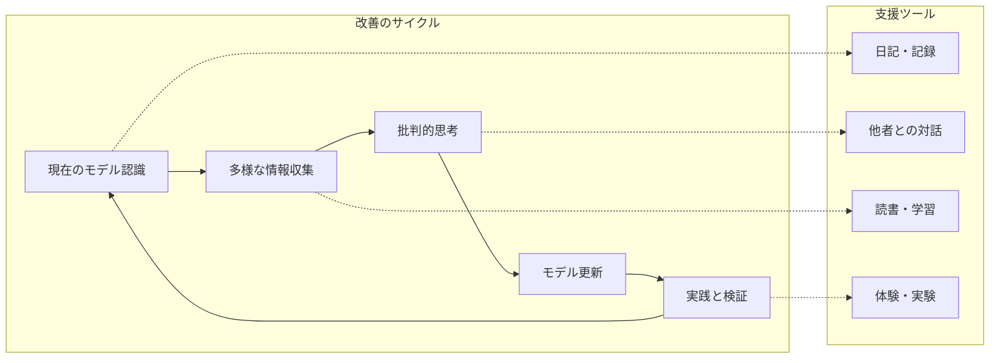

### 🧘 意識的な練習方法

**1. メタ認知の強化**
- 「今、自分はどんな前提で考えているか？」
- 「この判断の根拠は何か？」
- 「他の可能性はないか？」

**2. 多様な視点の獲得**
- 異なる立場の人と議論する
- 様々な分野の本を読む
- 新しい環境に身を置く

**3. 仮説検証の習慣**
- 予測を明確に記録する
- 結果と予測を比較する
- 間違いから学ぶ姿勢を保つ

### 📈 継続的な成長のために

**短期目標（1-3ヶ月）**
- 一つの分野で自分のメンタルモデルを意識化
- 定期的な振り返りの習慣化
- 新しい情報源の開拓

**中期目標（6-12ヶ月）**
- 複数分野でのモデル統合
- 批判的思考スキルの向上
- フィードバックループの最適化

**長期目標（1-3年）**
- 学習方法自体の進化
- 創造的思考パターンの開発
- 専門知識と汎用知識の融合

---

## 🎉 まとめ：あなたの思考の設計図を描き直そう

メンタルモデルは、私たちの思考の基盤となる「見えない設計図」です。この設計図を意識し、継続的に改善していくことで：

✨ **より正確な判断**ができるようになります
✨ **効果的な学習**が可能になります  
✨ **創造的な思考**が育まれます
✨ **柔軟な適応力**が身につきます

あなたの頭の中にある設計図は、一生涯にわたって書き換え続けることができる、最も個人的で最も強力な学習ツールなのです。

今日から、自分のメンタルモデルに意識を向け、より豊かで正確な「内なる世界の地図」を描いていきませんか？

---
