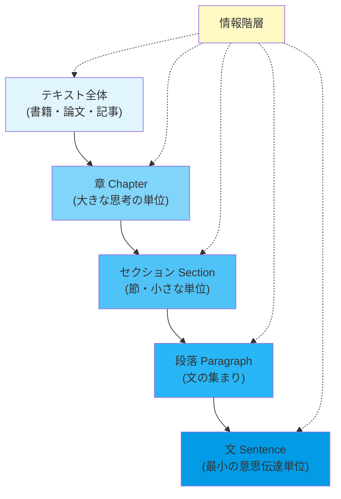
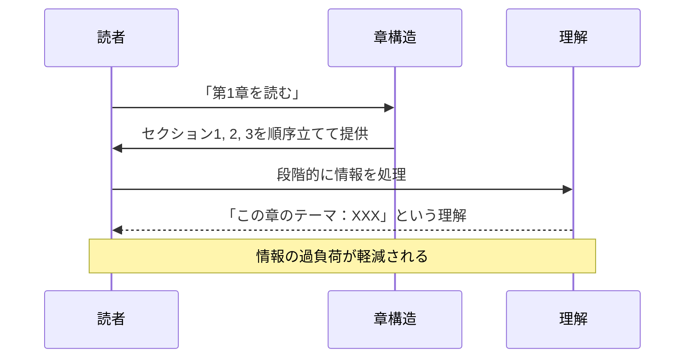
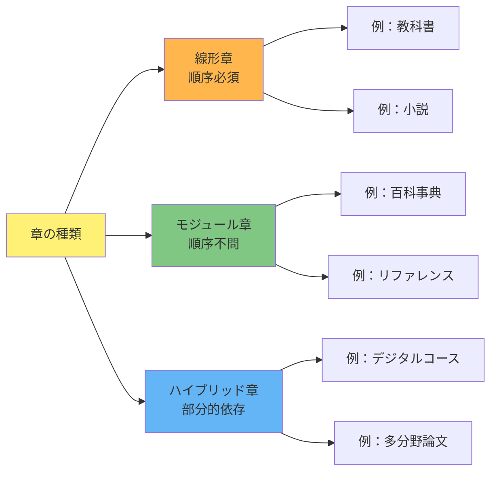
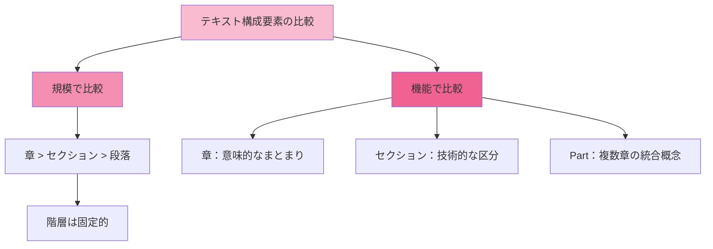
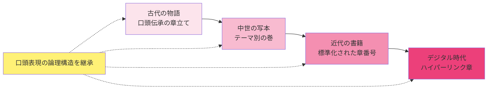
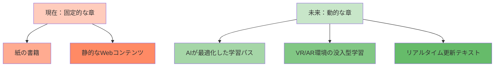

メンタルモデル（Mental Model）における、セクションで構成された章の役割について。

# テキストコミュニケーションにおける章構造 - 初学者のための完全ガイド

## 🔍 一言要約
**複雑な情報を整理し、読者の理解を段階的に深める「思考の建築設計図」**

## 📚 目次
1. [はじめに](#はじめに)
2. [基本構造](#基本構造)
3. [主要機能](#主要機能)
4. [時代背景](#時代背景)
5. [種類と特徴](#種類と特徴)
6. [関連用語](#関連用語)
7. [メリットとデメリット](#メリットとデメリット)
8. [応用と実例](#応用と実例)
9. [変遷と発展](#変遷と発展)
10. [実世界への影響](#実世界への影響)

---

## 🌟 はじめに

あなたは一冊の本を読むとき、章という「単位」に頼っています。章がなかったら、情報は砂粒のように散乱したままです。

**章とは何か？** 簡単に言えば、セクション（節）をまとめた「より大きな思考の塊」です。セクションが「小石」なら、章は「積み石で作られた壁」。その壁が複数合わさることで、読者の心に「完全な建造物」が立ち上がります。

テキストコミュニケーションの世界では、章は単なる目印ではなく、**著者と読者の間の「理解の架け橋」**です。

---

## 🏗️ 基本構造



**視覚的理解：** ピラミッドの階層構造で、上層ほど大きな「思考の単位」、下層ほど細かい「言語要素」を示します。

---

## ⚡ 主要機能

### 1. **情報の分割と整理機能**
セクションを章という「容器」に入れることで、関連する思考をグループ化します。

| 機能 | 説明 | 例 |
|------|------|-----|
| **グループ化** | 関連するセクションを束ねる | 「第1章：基礎知識」に「1.1 定義」「1.2 歴史」を含める |
| **論理的順序付け** | 思考の流れを明示 | 「第2章」が「第1章」の上に成立 |
| **心理的ブレーク** | 読者に休息を提供 | 章終了時に「一旦ここまで理解した」と思わせる |

### 2. **読者の認知負荷軽減機能**
人間の短期記憶は限られています。章は**情報を咀嚼可能な大きさ**に分割します。



### 3. **ナビゲーション機能**
読者が「どこにいるのか」「どこへ向かうのか」を明示します。

---

## 📜 時代背景と発見に至った経緯

### 古代：口頭から文字へ
紀元前、人類は情報を**口頭で伝承**していました。長い話も「起承転結」という自然な章立てで、聞き手は理解できました。

### 中世：写本時代の章の誕生
印刷技術が発明される前、本は手写本でした。スペースを節約するため、複数の「話題」を1つの巻物に詰め込む必要がありました。ここで初めて、**意図的な「章立て」**が生まれました。
- 中世の写本における区切り（後に章となる単位）の導入は、「スペース節約」よりも、むしろ「聖書や法律書など、長大なテキストにおける特定の箇所への参照を容易にするため」という機能的・ナビゲーション的動機がより重要であったとされています。参照の容易化は、学問の発展に直結するより本質的な要因です。

- 例：聖書も「創世記」「出エジプト記」など、テーマ別に分割されています。

### 15世紀：印刷革命と章番号の確立
グーテンベルクの活版印刷により、一括生産が可能になりました。**標準化された章番号（第1章、第2章...）**が登場し、読者は共通の参照点を持つようになりました。

### 19世紀：学術論文と章の体系化
科学革命により、複雑な理論を体系的に説明する必要が生じました。章は単なる「話題の分割」から、**論理的段階の表現**へと進化しました。

### 現在：デジタル化と章の多様化
電子書籍やWebコンテンツの普及により、章は固定的な構造から、**ハイパーリンクで接続可能な柔軟な単位**へと変わりました。

---

## 🎨 種類と特徴



**比較表：**

| タイプ | 特徴 | 読み順序 | 活用分野 |
|--------|------|---------|---------|
| **線形章** | 各章が前章を前提とする | 第1章→第2章→... | 教科書、物語、哲学書 |
| **モジュール章** | 各章が独立している | 自由 | 辞書、百科事典、マニュアル |
| **ハイブリッド** | 基礎章は必須、応用章は選択可 | 部分的 | オンラインコース、技術書 |

---

## 📗 関連する用語

### 同義語・類似概念
- **Part（部）**：複数の章をさらに束ねた単位（例：第Ⅰ部「基礎」、第Ⅱ部「応用」）
- **Unit（ユニット）**：オンライン教育での「学習単位」（モジュール章に相当）
- **Module（モジュール）**：独立した機能単位（特にプログラミングやe-ラーニング）

### 対義語・下位概念
- **Section（セクション）**：章より小さい単位
- **Subsection（小節）**：セクションより小さい単位
- **Paragraph（段落）**：最も小さい文構成単位

### 区別が難しい用語の比較



---

## 💡 メリットとデメリット

### ✅ メリット

**1. 読者の理解度向上**
- 情報を消化しやすい大きさに分割
- 学習の進捗が視覚的に明確
- 「一区切り」の達成感が動機付けになる

**2. 著者の思考の明示**
- 論理的構造を表現
- 執筆時の思考プロセスが伝わる

**3. ナビゲーションの容易性**
- 目次から特定の内容へ直接移動可能
- 参照や引用が簡単

**4. 認知負荷の軽減**
- 一度に処理する情報量が制限される
- 短期記憶の過負荷を防止

### ❌ デメリット

**1. 柔軟性の制限**
- 線形章は非線形な学習に不向き
- 相互参照が多いと読み進みが複雑に

**2. 冗長性の可能性**
- 複数の章で同じ概念を説明する必要が生じる可能性
- ページ数の増加

**3. 個人差への対応困難**
- 統一された章立ては全読者に最適ではない
- 速読者には進みが遅く、遅読者には進みが早い

**4. デジタル環境での制約**
- 紙の書籍用に設計された章構造は、Web上では必ずしも最適ではない
- スクロール体験との不一致

---

## 🚀 応用と実例

### 現実世界の章構造の例

**例1：大学の教科書「物理学入門」**
```
第I部：古典力学
  第1章：運動の法則
    1.1 ニュートンの3法則
    1.2 力と加速度
    1.3 演習問題
  第2章：仕事とエネルギー
    2.1 仕事の定義
    2.2 運動エネルギー
```
→ 線形構造。第1章を理解しないと第2章が理解できません。

**例2：Webサイト「料理レシピ集」**
```
- 第1章：和食
- 第2章：洋食
- 第3章：中華
```
→ モジュール構造。どの章から読んでも問題ありません。

**例3：オンラインコース「Pythonプログラミング」**
```
基礎部分（必須）
  第1章：環境構築
  第2章：基本文法
応用部分（選択）
  第3章：Webスクレイピング
  第4章：機械学習
```
→ ハイブリッド構造。基礎は必須、応用は自由に選択可能。

---

## 🔄 変遷と発展

### 何を置き換えたか

**従来の形式：連続した巻物（scroll）**
- エジプトのパピルス、ペルシャの写本
- 読み方が一方向のみ
- 特定の箇所の参照が難しい

**章の登場** → 巻物から「書籍（codex）」へ移行
- ページ単位での管理が可能
- ランダムアクセスが容易に
- 目次や索引が機能するように

### 何に置き換えられたか

**デジタル時代への進化**
- 固定的な紙の章 → ハイパーリンク化された動的な章
- 一方向の読み → 非線形なナビゲーション
- 静的なテキスト → インタラクティブなコンテンツ

### 継承関係



---

## 🌍 実世界への影響とその後の発展

### 影響：章構造がもたらしたもの

**1. 教育の民主化**
- 複雑な知識を段階的に学べるようになった
- 大学の教科書により、高度な学問が広がった

**2. 論文・学術の体系化**
- 学問的な「厳密性」の表現
- 科学的発見の論理的叙述が可能に

**3. 出版業界の成立**
- 標準化された構造により、大量印刷が効率化
- 書籍の価格低下と普及

### 未来展望：章構造の進化

**1. AI時代の章の多様化**
- 読者の理解度に応じた動的な章立て
- 個人カスタマイズされた学習パス

**2. マルチメディア章**
- テキスト + 動画 + インタラクティブ要素の融合
- リニア・ハイパーリンク・ネットワーク型の共存

**3. リアルタイム更新される章**
- 新しい情報が加わっても、章構造は維持
- 「生きた教科書」の実現



---

