メンタルモデル（Mental Model）のうち、文字を扱う上での、単語を組み合わせて作る、文を構成する文節の役割について


# 文節の役割 - 初学者のための完全ガイド

## 🔍 一言要約
文節は「文の意味を壊さない最小の言葉のまとまり」であり、文章理解の基本単位

## 📚 目次
1. [はじめに](#-はじめに)
2. [基本構造](#-基本構造)
3. [文節の種類と役割](#-文節の種類と役割)
4. [時代背景と発見に至った経緯](#-時代背景と発見に至った経緯)
5. [関連する用語](#-関連する用語)
6. [メリットとデメリット](#-メリットとデメリット)
7. [応用と実例](#-応用と実例)
8. [置換と変遷](#-置換と変遷)
9. [代替と競合](#-代替と競合)
10. [実世界への影響とその後の発展](#-実世界への影響とその後の発展)

## 🌟 はじめに

「今日は良い天気ですね」という文章を見たとき、私たちの脳は自動的にこれを「今日は／良い／天気ですね」という3つの塊に分けて理解しています。この「意味を持つ最小の塊」が**文節**です。

レゴブロックで家を作る場面を想像してください。一つ一つのブロック（単語）だけでは意味が不完全ですが、いくつか組み合わせた「壁」や「屋根」（文節）になると、それぞれが役割を持ち始めます。文節は、単語と文の中間に位置する「意味の橋渡し役」なのです。

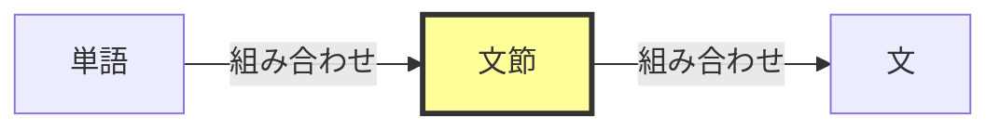

## 🏗️ 基本構造

文節は**自立語**（それだけで意味を持つ言葉）と**付属語**（他の言葉に付いて意味を補う言葉）の組み合わせで構成されます。

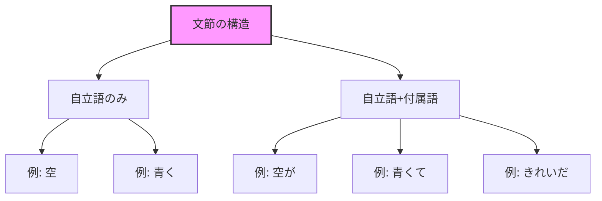

### 文節の分け方の基本ルール

**「ネ」を入れて不自然でない場所で切る**

- 「今日は（ネ）／良い（ネ）／天気ですね（ネ）」 ✓
- 「今日（ネ）／は良い（ネ）／天気（ネ）／ですね」 ✗

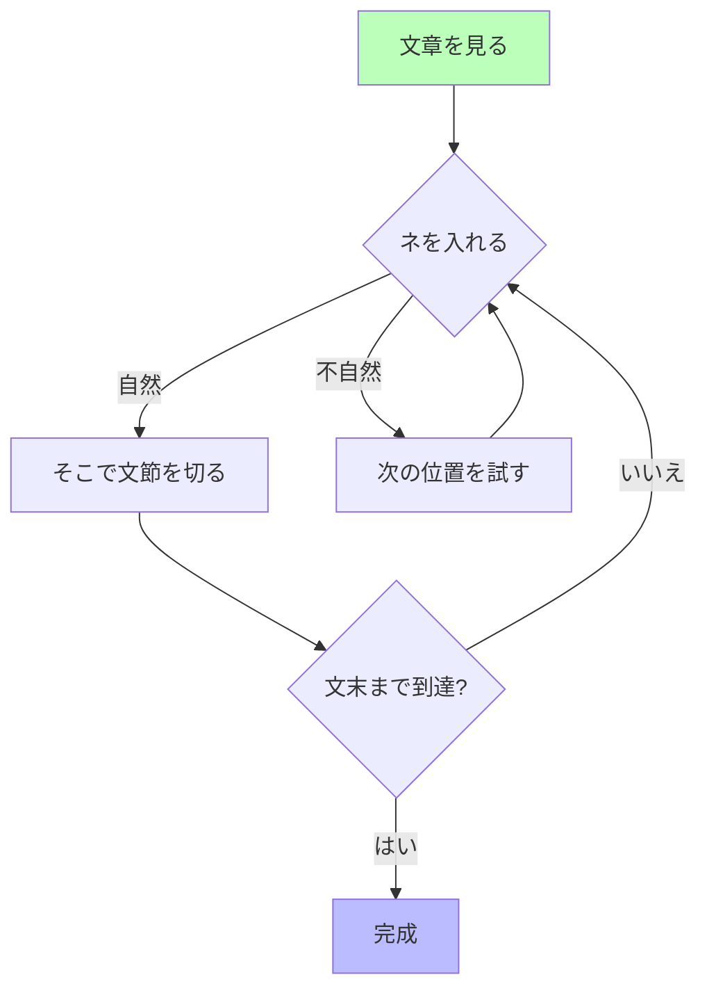

## ⚡ 文節の種類と役割

文節には、文の中での**役割**（はたらき）によって分類できます。

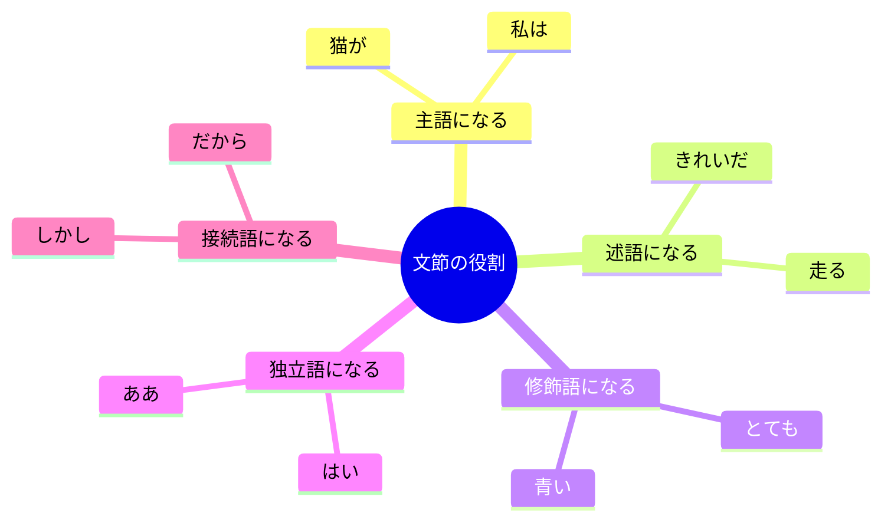

### 主な文節の役割

| 役割 | 説明 | 例 |
|------|------|-----|
| **主語** | 「何が・誰が」を示す | 私が／犬が／彼女は |
| **述語** | 「どうする・どんなだ・何だ」を示す | 走る／美しい／学生だ |
| **修飾語** | 他の言葉を詳しく説明する | とても／青い／ゆっくり |
| **独立語** | 他の文節と関係なく独立 | ええ／おい／まあ |
| **接続語** | 前後の文をつなぐ | しかし／だから／また |

### 文節の連鎖パターン

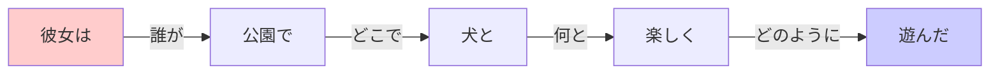

この図が示すように、文節は**質問と答え**の関係で連鎖します。
- 「彼女は」→「どうした？」→「遊んだ」
- 「遊んだ」→「どこで？」→「公園で」
- 「遊んだ」→「どのように？」→「楽しく」

## 📜 時代背景と発見に至った経緯

### 日本語文法研究の黎明期

江戸時代まで、日本語の文法は体系化されていませんでした。明治時代に入り、西洋の言語学が導入されると、日本語を科学的に分析する動きが始まります。

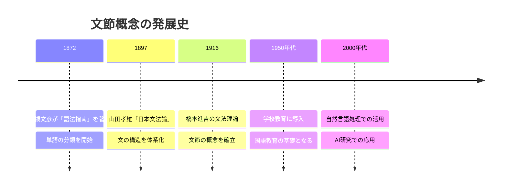

### なぜ「文節」が必要だったのか

西洋言語（英語など）は単語が空白で区切られていますが、日本語は区切りがありません。

**英語**: I / love / cats. （空白で明確に区切られる）  
**日本語**: 私は猫が好きです（区切りが不明瞭）

橋本進吉は、日本語を理解するための「意味の最小単位」として文節を定義し、日本語教育と言語研究に革命をもたらしました。

## 📗 関連する用語

### 同義語・類義語

| 用語 | 関係 | 説明 |
|------|------|------|
| **文節** | 本概念 | 意味を壊さない最小のまとまり |
| **フレーズ** | 類義語 | 英語文法での phrase に相当 |
| **語群** | 類義語 | 複数の語のまとまり（より広義） |

### 対比される概念

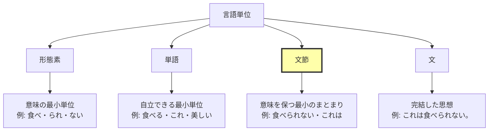

### 多義語としての「節」

「節」という言葉には複数の意味があります：

1. **文節**: 日本語文法での意味のまとまり
2. **節（Clause）**: 英文法での主語+述語を含む単位
3. **節目**: 時期や区切りの意味

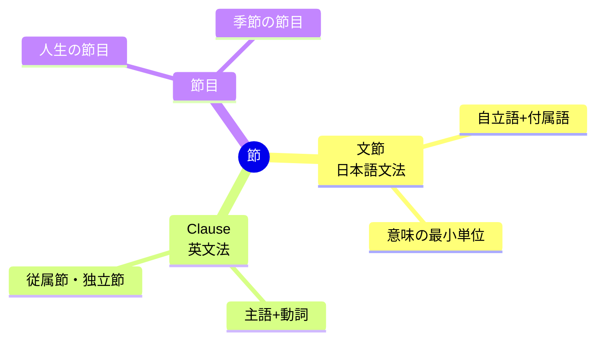

## 💡 メリットとデメリット

### メリット

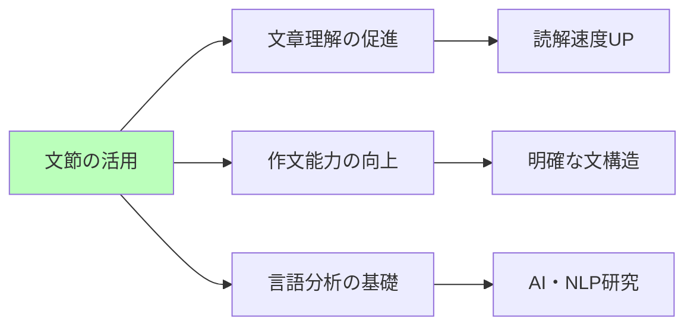

| メリット | 具体例 |
|---------|--------|
| **文章理解が容易** | 複雑な文も分節化して理解できる |
| **作文の質向上** | 文節を意識すると論理的な文が書ける |
| **教育効果** | 国語教育での体系的な指導が可能 |
| **自然言語処理** | コンピュータでの日本語解析の基礎 |

### デメリット

| デメリット | 内容 |
|----------|------|
| **曖昧性** | 切り方に個人差が生じることがある |
| **学習負荷** | 初学者には概念理解が難しい場合がある |
| **言語依存性** | 日本語特有の概念で他言語に直接適用不可 |
| **過度な分析** | 自然な言語感覚を損なう可能性 |

## 🚀 応用と実例

### 日常生活での応用

#### 1. メール・文章作成

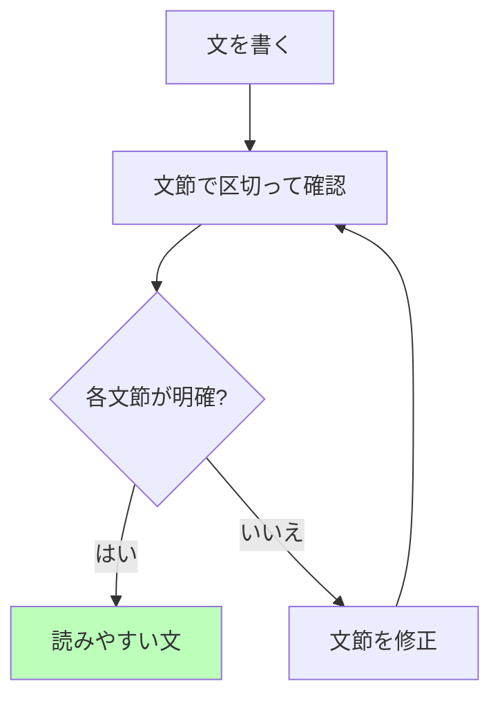

**悪い例**: 「私は昨日買った本を読んだ友達に会った」  
**改善**: 「私は／昨日／友達に／会った／その友達は／私が買った／本を／読んでいた」

#### 2. プレゼンテーション

スライドの文章を文節で区切ると、聴衆の理解度が向上します。

**改善前**: 本製品は高性能で低価格です  
**改善後**: 
```
本製品は
  ↓
高性能で
  ↓
低価格です
```

### 技術分野での応用

#### 自然言語処理（NLP）

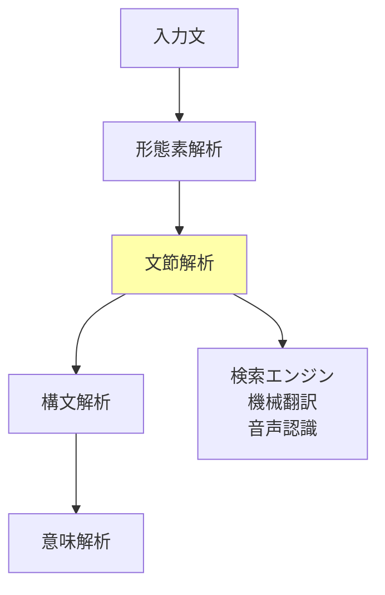

文節解析は、Google検索、機械翻訳、音声アシスタント（Siri、Alexaなど）の基盤技術です。

#### 音声合成

文節の区切りで自然な「間」を作ることで、より人間らしい音声を生成できます。

## 🔄 置換と変遷

### 何を置き換えたか

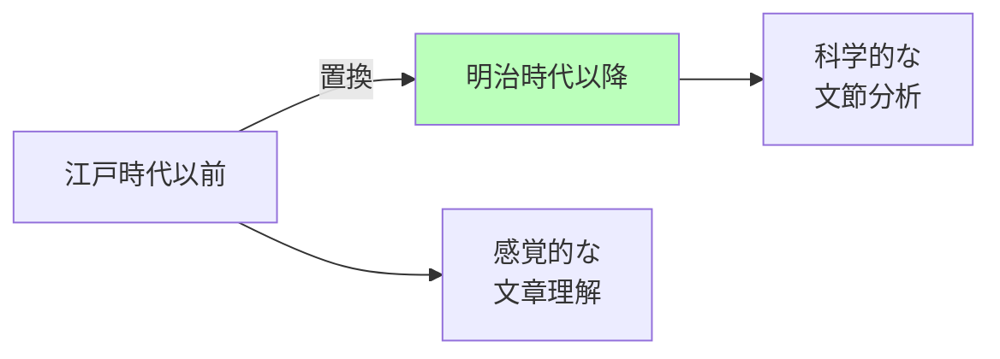

文節の概念は、**感覚的・経験的な日本語理解**を**論理的・体系的な理解**に置き換えました。

### 何に置き換えられたか

現在も文節は基本概念として使われていますが、一部の分野では進化しています：

| 分野 | 従来 | 現在 |
|------|------|------|
| **言語学研究** | 文節分析 | 依存構造解析（より詳細） |
| **AI・NLP** | 文節区切り | ニューラルネットワークによる統合処理 |
| **教育** | 文節の暗記 | 文節を使った思考訓練 |

### 何を継承したか

文節の概念は、橋本進吉の**文法理論**と**品詞分類**を継承しています。

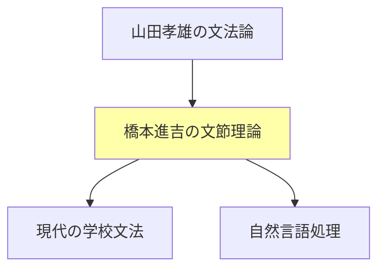

### 何に継承されたか

- **係り受け解析**: 文節間の関係を解析する技術
- **依存構造文法**: 文節の依存関係をグラフで表現
- **統語解析アルゴリズム**: コンピュータでの自動処理

## 🔁 代替と競合

### 何に代替できるか

文節は以下の分析手法の代替として使えます：

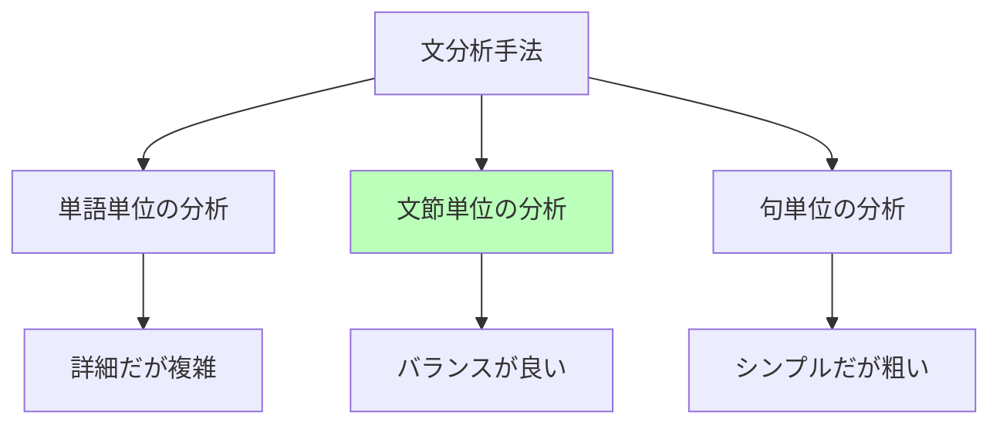

| 代替対象 | 文節の優位性 |
|---------|-------------|
| 単語分析 | より意味的なまとまりを保つ |
| 形態素分析 | 初学者に理解しやすい |
| 句構造分析 | 日本語の特性に適合 |

### 何に代替されるか

近年、AI分野では**深層学習モデル**が文節を意識せずに文章を処理できるようになっています。

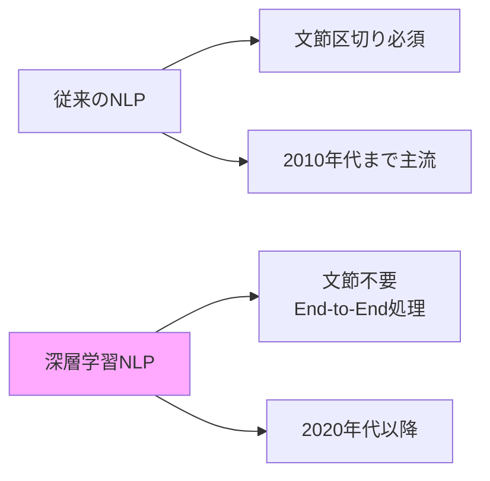

ただし、**教育分野**や**文法理解**では文節は依然として重要です。

### 競合する概念

| 競合概念 | 特徴 | 使い分け |
|---------|------|---------|
| **チャンク（chunk）** | 英語文法での意味の塊 | 英語学習では有効 |
| **句（phrase）** | より大きな文法単位 | 複雑な構文分析に使用 |
| **形態素** | より小さな単位 | 詳細な言語学研究で使用 |

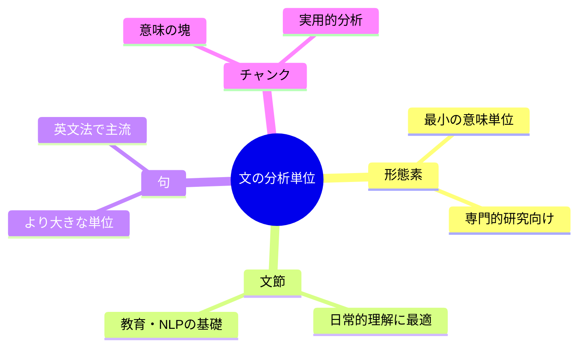

## 🌍 実世界への影響とその後の発展

### 教育への影響

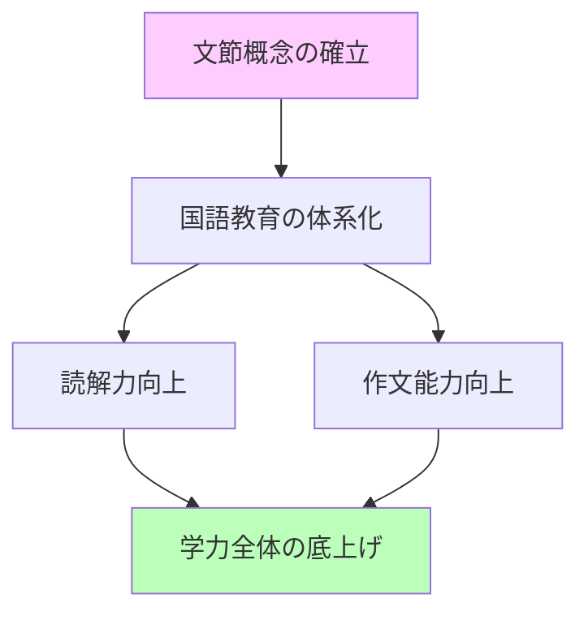

文節を使った教育により、日本の識字率と言語能力は世界トップレベルに到達しました。

### 技術分野への影響

#### 1. 検索エンジン

Googleなどの検索エンジンは、文節を理解することで検索精度を向上させています。

**例**: 「美しい花」と検索すると
- 「美しい」と「花」を別々に検索するのではなく
- 「美しい花」という文節として認識
- より適切な結果を表示

#### 2. 機械翻訳

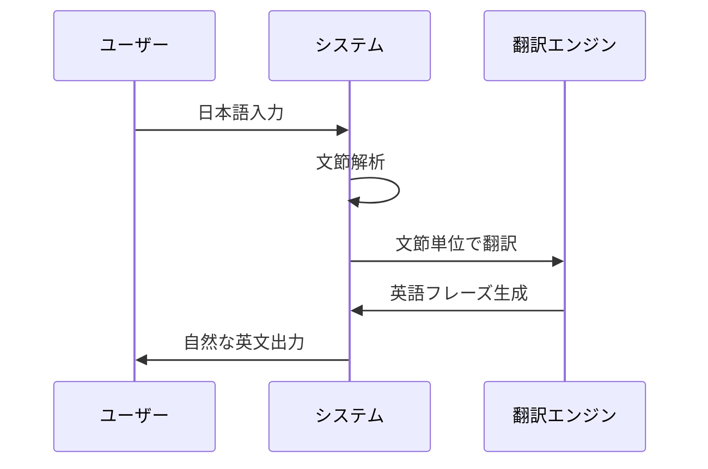

文節を理解することで、より自然な翻訳が可能になりました。

### 今後の発展

#### AI時代の文節

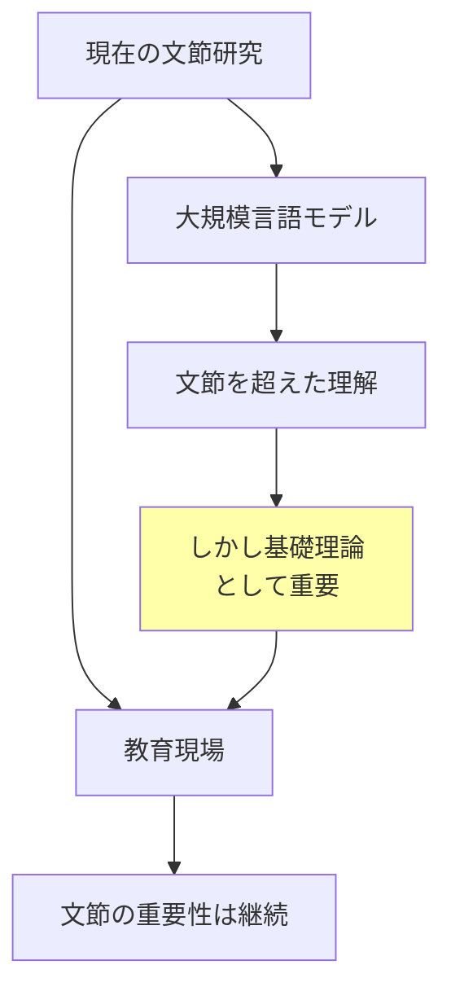

ChatGPTなどの大規模言語モデルは文節を明示的に使わずに文章を理解しますが、その基礎には文節の概念が活かされています。

#### 未来の可能性

1. **多言語での文節概念の応用**: 日本語以外の言語への適用研究
2. **認知科学との融合**: 人間の言語理解メカニズムの解明
3. **教育テクノロジー**: AIを使った文節ベースの個別指導

---

