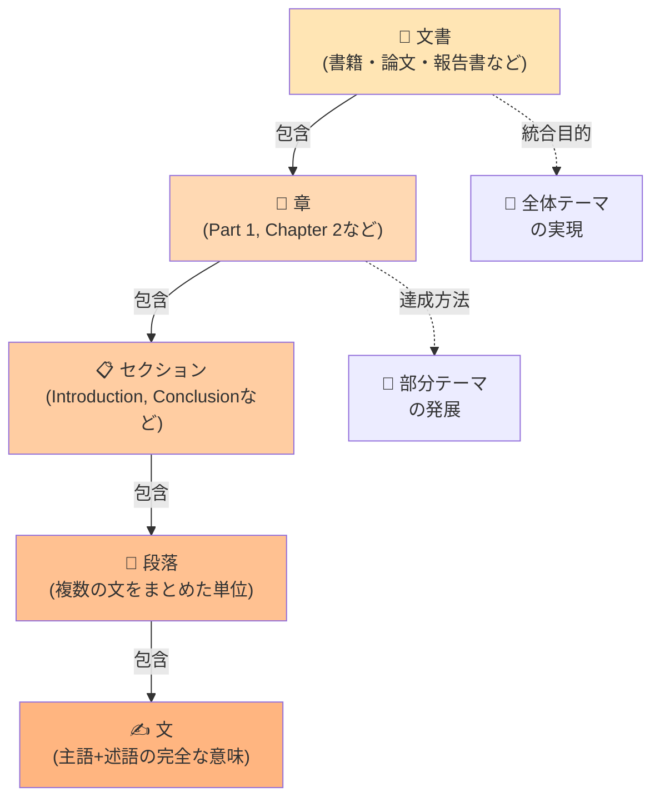
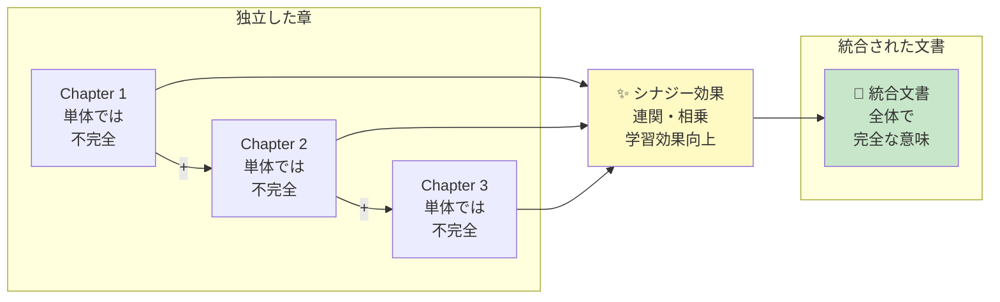
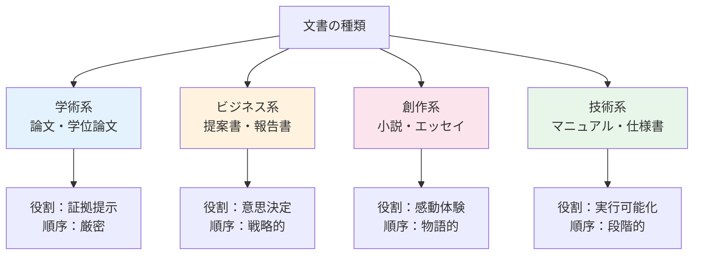
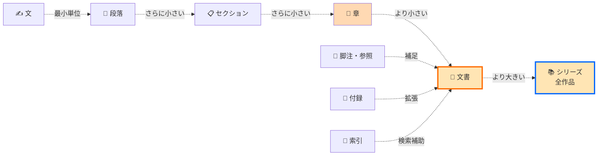
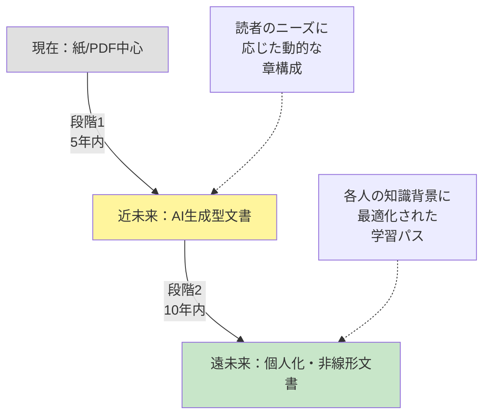

テキストコミュニケーションにおける、章で構成された章より大きな単位である文書の役割について。

# テキストコミュニケーション：文書構成単位の完全ガイド

## 🔍 一言要約
**複数の章を組み合わせた「文書」というより大きな単位が、情報を体系的に伝え、読者の理解を導く最上位の構造**

## 📚 目次
1. はじめに
2. 基本構造：文書の階層
3. 各構成要素の役割
4. 文書構造の発展史
5. 文書の種類と特徴
6. 関連用語
7. メリットとデメリット
8. 実世界への影響

---

## 🌟 はじめに

あなたが何かを説明するとき、**ただ言葉を並べるだけでは伝わりません**。「章」という単位で整理し、それらをさらに「文書」として統合することで、初めて相手は完全に理解できるようになります。

例えば、料理のレシピを考えてください：
- **段落**＝「油を熱する」「塩を加える」という個別の指示
- **章**＝「準備」「調理」「盛り付け」というカテゴリ
- **文書**＝レシピ全体。これ全部を読むことで「この料理の全体像が分かる」

このように、**文書という大きな枠組みが、バラバラな情報を意味のある全体へと変えるのです**。

---

## 🏗️ 基本構造：文書の階層

**各層の役割：**
- **文書層**：全体的なメッセージと目的を統一
- **章層**：大きなテーマを分割し、段階的に深掘り
- **セクション層**：章内の小分け単位、流れを作る
- **段落層**：一つの考えを完結させる基本単位
- **文層**：最小の意味単位

---

## ⚡ 文書がより大きな単位である理由

**単なる「章の集まり」ではなく、文書という枠組みが加わることで：**
1. **先後関係の明確化**：どの章を先に読むべきか
2. **相互参照の形成**：章同士が関連し合う
3. **全体的な統一性**：バラバラな内容が一つのテーマに統合
4. **読者の心理的準備**：「この本は何について学べるのか」が事前に分かる

---

## 📜 文書構造の発展史

**古代から現代への進化：**

- **古代（紙以前）**：物語は口頭伝承。「章」という概念がなく、流動的
- **中世（羊皮紙時代）**：聖書などで「章・節」システムが確立。検索性向上
- **活版印刷時代（15世紀〜）**：ページ番号、目次、索引の登場。「文書」が固定化され、参照が容易に
- **デジタル時代（1990年代〜）**：ハイパーリンク、目次の自動生成。文書の順序が相対化
- **AI時代（2020年代〜）**：非線形な学習パス、要約と詳細の自動生成

**転機のポイント：** 「文書が章より大きな単位である」という認識が確立したのは、**活版印刷技術によって『本全体を統一的に制作する必要性』が生まれた時代**です。

---

## 🎨 文書の種類と役割の違い

**各種文書での「章より大きな単位」の価値：**

| 文書種 | 章の役割 | 文書全体の役割 |
|--------|--------|--------------|
| 論文 | 議論の段階 | 総合的な結論・貢献の提示 |
| 報告書 | テーマ別の分析 | 経営判断の根拠づくり |
| 小説 | ストーリーの展開 | 完結した感情体験の提供 |
| マニュアル | 機能別の説明 | 全体的な使用方法の習得 |

---

## 📗 関連用語の比較

**類似概念との区別：**
- **「文書」vs「章」**：文書は複数章の統合体。章だけでは個別の主張
- **「文書」vs「作品」**：作品は芸術的・完成的意図を含む。文書は情報伝達が主
- **「文書」vs「テキスト」**：テキストは文字列一般。文書は構造化された意図的な集合

---

## 💡 メリットとデメリット

### ✅ メリット

1. **読者の理解促進**
   - 段階的な学習が可能
   - 全体像が掴みやすい

2. **情報の整理と検索**
   - 目次で必要な部分に素早くアクセス
   - 索引で用語を効率的に探索

3. **作者の思考整理**
   - 構成を考えることで論理を整える
   - 重複や矛盾を発見しやすい

4. **権威性と信頼性**
   - 「きちんと書かれた文書」という認識
   - 参考資料としての価値向上

### ❌ デメリット

1. **作成コストの増加**
   - 構成の企画に時間が必要
   - 章間の調整作業が増加

2. **柔軟性の低下**
   - 後から大幅な修正が難しい（特に紙）
   - 線形の順序に縛られる

3. **読者の選別**
   - 全部読むことが暗黙の前提
   - 急いでいる読者には不向き

4. **陳腐化リスク**
   - 文書全体が古くなると、一部の更新では対応困難
   - デジタル化により、この問題は緩和中

---

## 🚀 文書が何を置き換えたか、何に置き換えられているか

**置き換え史：**
- **前身**：口頭伝承 → **文書** ：保存性と正確性の獲得
- **文書** → **デジタルドキュメント**（PDF、HTML等）：検索性と共有の容易化
- **従来型文書** → **ハイパーテキスト・ウィキ**：非線形の参照が可能に

**継承関係：**
- 古い「羊皮紙の巻物」の「章・節システム」を継承
- 活版印刷本の「目次・ページ番号」を継承
- デジタル時代もこれらの論理的構造は保持

---

## 🌍 実世界への影響と未来展望

### 現在の影響

1. **学術・ビジネス領域**
   - 論文・報告書は文書形式が標準
   - 「きちんとした文書化」が評価基準に

2. **法律・行政領域**
   - 契約書や法律は文書として記録・管理
   - 章番号システムで正確性を確保

3. **教育領域**
   - 教科書は「段階的な章構成」で学習効果向上
   - デジタル化でも基本構造は維持

### 未来の発展予想

**予測される変化：**
1. **AI時代**：ユーザーの質問に応じて、必要な章だけを自動生成
2. **個人化の加速**：「万人向けの文書」から「あなた向けの文書」へ
3. **リアルタイム更新**：固定的な「出版」から常時進化する「文書ストリーム」へ
4. **マルチモーダル化**：テキスト＋音声＋映像の統合ドキュメント

ただし、**「情報を体系的に構成し、段階的に理解させる」という文書の本質的な役割は、デジタル化・AI化の後も変わらない**と予想されます。

---

## 📌 まとめ

**「文書」というより大きな単位の役割：**

1. **情報を体系化**：バラバラな「章」を意味のある全体へ
2. **読者を導く**：適切な順序で段階的に理解させる
3. **信頼性を付与**：「きちんと構成されている」という認識で権威性向上
4. **検索性を確保**：目次・索引で必要な情報へのアクセス効率化

**あなたが何かを説明する際：**
- 単なる「いくつかの文」ではなく
- 複数の「章」として整理し
- 全体として一つの「文書」として統合すること

これが、初心者が「あ、ようやく分かった！」と感動する瞬間を作り出します。

---

