メンタルモデル（Mental Model）における、文で構成された段落の役割について。

  
# メンタルモデルにおける段落の役割 - 初学者のための完全ガイド

## 🔍 一言要約
段落は読者の頭の中に「理解の部屋」を一つずつ作る設計図

## 📚 目次
1. [はじめに](#-はじめに)
2. [メンタルモデルとは](#-メンタルモデルとは)
3. [段落の本質的役割](#-段落の本質的役割)
4. [段落の構造設計](#-段落の構造設計)
5. [時代背景と発見経緯](#-時代背景と発見経緯)
6. [段落の種類と特徴](#-段落の種類と特徴)
7. [関連用語](#-関連用語)
8. [メリットとデメリット](#-メリットとデメリット)
9. [応用と実例](#-応用と実例)
10. [置換と変遷](#-置換と変遷)
11. [代替と競合](#-代替と競合)
12. [実世界への影響](#-実世界への影響)

## 🌟 はじめに

家を建てるとき、一度にすべての部屋を作ろうとすると混乱します。まず玄関、次にリビング、そして寝室…と順番に作りますよね。

**段落も同じです。** 読者の頭の中に「理解の家」を建てるとき、段落は一つの部屋に相当します。各部屋（段落）が明確な目的を持ち、適切な順序で配置されることで、読者は迷わず理解の家を完成できます。


## 🏗️ メンタルモデルとは

メンタルモデルは「頭の中の理解の形」です。

**日常例：**
- スマホの使い方を説明されると、頭の中に「ホーム画面→アプリ→機能」という地図ができる
- 料理レシピを読むと、「材料→下準備→調理→完成」という流れが見える
- これらが**メンタルモデル**

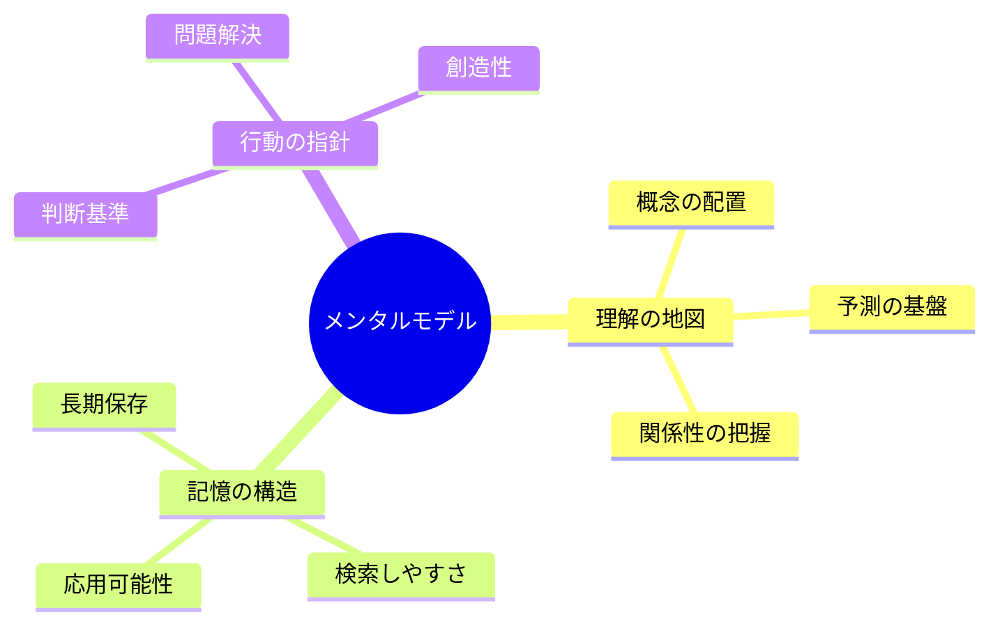

## 🔧 段落の本質的役割

### 1. 認知負荷の管理

人間の脳は一度に3-7個の情報しか処理できません。段落は情報を「消化可能なサイズ」に分割します。

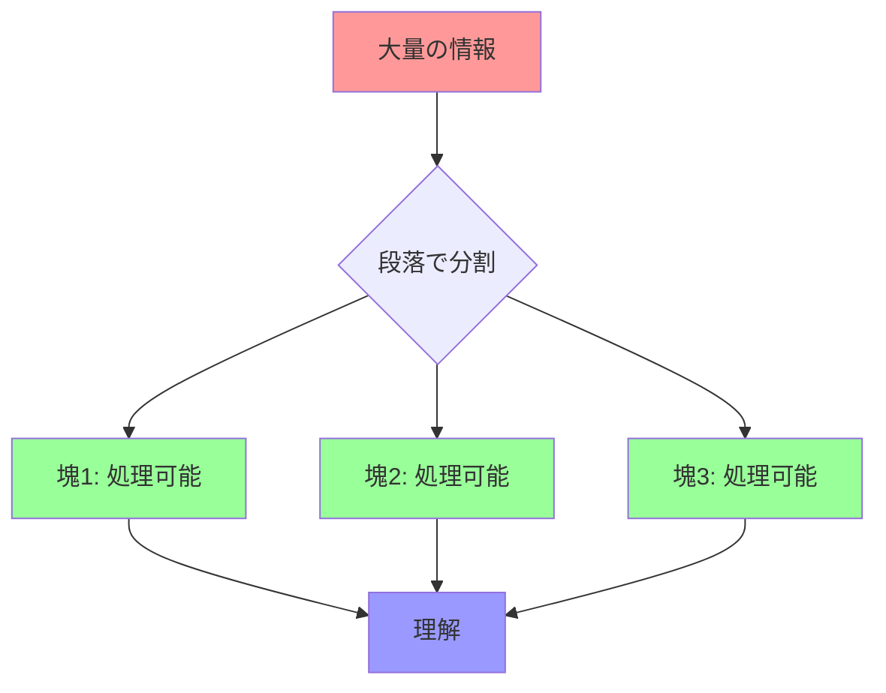

### 2. 概念の単位化

各段落は「一つのアイデア」を持ちます。これにより：
- 読者は「今、何について読んでいるか」を常に把握
- 理解の積み木を一つずつ積める
- 混乱せずに複雑な概念を構築

### 3. メンタルモデルの構築支援

段落の順序が、読者の頭の中の理解の順序になります。

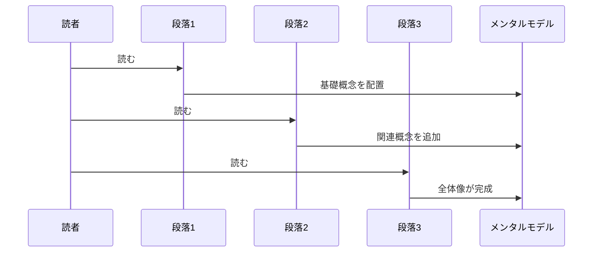

## 🏗️ 段落の構造設計

### 理想的な段落の解剖図

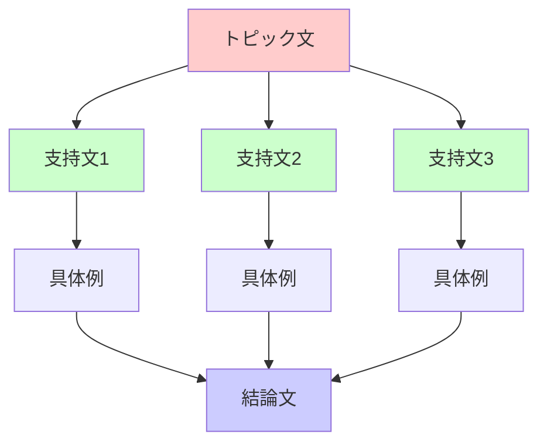

**各要素の役割：**
- **トピック文**：この部屋（段落）で何を学ぶか宣言
- **支持文**：トピックを支える柱
- **具体例**：抽象を具体に変換
- **結論文**：この部屋で学んだことを確認

### 段落間の接続設計


## 📜 時代背景と発見経緯

### 古代：口承から文字へ

紀元前3000年頃、メソポタミアで文字が発明されましたが、**段落の概念はありませんでした。**

**なぜ？**
- 粘土板や石に刻むため、連続した文字列のみ
- 読むのは専門の書記官だけ
- 一般人は読み書き不要

### 中世：段落の萌芽

12-13世紀、ヨーロッパの修道院で変化が起きます：
- 写本作成時に「赤い文字」で新しい話題を開始
- **Paragraph**の語源：ギリシャ語「paragraphos」（横に書く）
- まだ形式的で、意味的な区切りではない

### 近代：印刷革命と段落の確立

1450年、グーテンベルクの印刷術により大量生産が可能に：
- 一般人が読書する時代へ
- **読みやすさが重要課題に**
- 段落が「意味のまとまり」として確立

### 現代：認知科学との融合

1960年代以降、認知心理学の発展：
- **ジョージ・ミラー**：人間の短期記憶の限界（7±2個）
- **段落は認知負荷を管理する技術**と判明
- メンタルモデル理論の確立（1980年代）

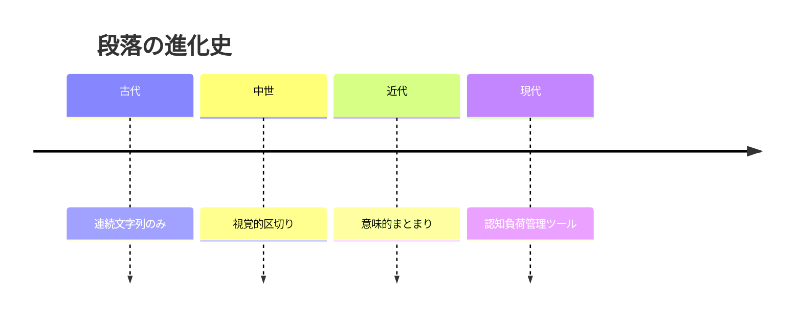

## 🎨 段落の種類と特徴

### 1. 機能別分類

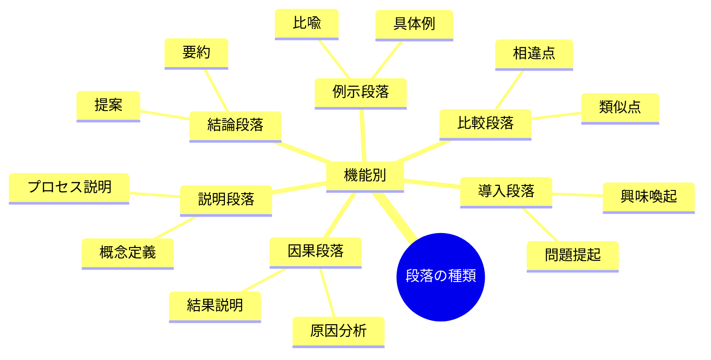

### 2. 構造別分類

| 構造タイプ | 特徴 | 適用場面 | 例 |
|-----------|------|---------|-----|
| **演繹型** | 一般→具体 | 論理的説明 | 「人間は動物である。したがって…」 |
| **帰納型** | 具体→一般 | 説得・発見 | 「事例A、B、C…つまり○○だ」 |
| **並列型** | 複数要素を並列 | 分類・列挙 | 「第一に…第二に…第三に…」 |
| **対比型** | AとBを比較 | 選択肢提示 | 「一方では…他方では…」 |
| **時系列型** | 時間順 | プロセス説明 | 「まず…次に…最後に…」 |

### 3. 長さ別分類

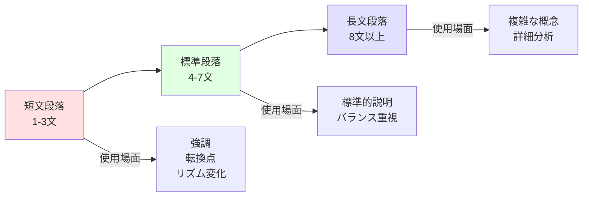

## 📗 関連用語

### 同義語・類義語

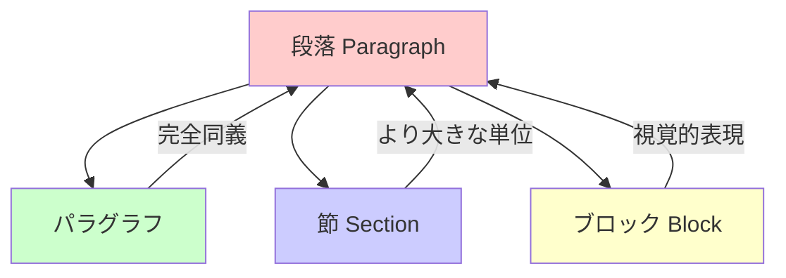

**ニュアンスの違い：**
- **段落**：意味的まとまり重視（日本語）
- **パラグラフ**：形式的まとまり重視（英語由来）
- **節**：より大きな構造単位、複数段落を含む
- **ブロック**：視覚的・デザイン的表現

### 対義語・反対概念

| 概念 | 段落あり | 段落なし |
|------|---------|---------|
| **構造** | 階層的・整理された | 平坦・混沌 |
| **読みやすさ** | 高い | 低い |
| **理解速度** | 速い | 遅い |
| **認知負荷** | 低い | 高い |

### 多義語としての「段落」

**文脈による意味の変化：**
1. **形式的意味**：改行で区切られたテキスト塊
2. **意味的意味**：一つのアイデアを持つ文の集合
3. **機能的意味**：メンタルモデル構築の単位
4. **デザイン的意味**：視覚的な空白を持つブロック

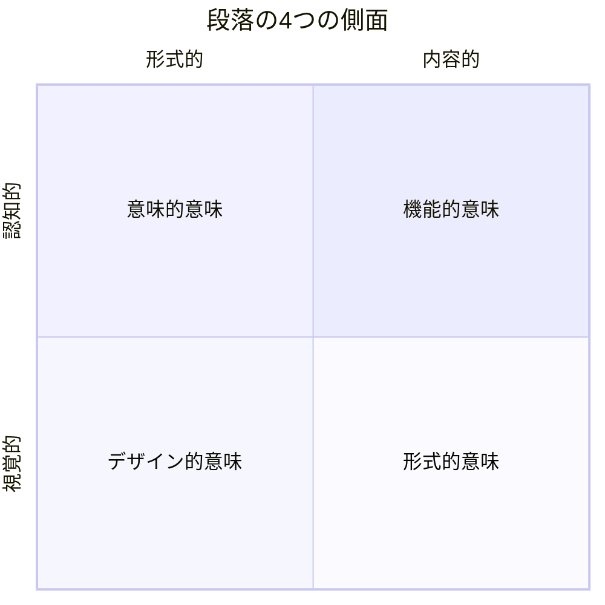

## 💡 メリットとデメリット

### メリット

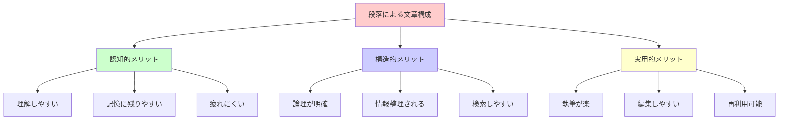

**具体的メリット：**
1. **読者視点**
   - 一度に処理する情報量が適切
   - 「今どこ」が分かる
   - 休憩ポイントが明確

2. **書き手視点**
   - アイデアを整理しやすい
   - 論理の流れを確認できる
   - 修正・改善が容易

3. **メンタルモデル構築**
   - 段階的に理解が深まる
   - 概念間の関係が明確
   - 長期記憶に定着しやすい

### デメリット

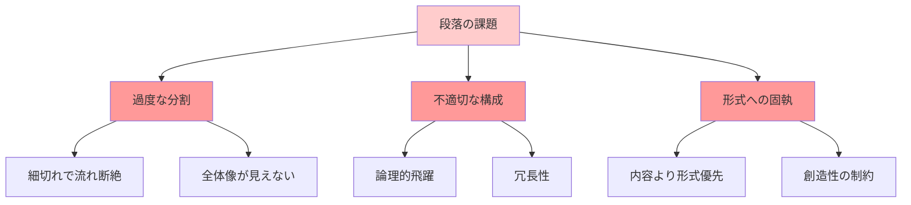

**具体的デメリット：**
1. **過剰な分割**
   - 一文段落の乱用
   - リズムの喪失
   - 断片的理解

2. **不適切な構成**
   - 段落の論理的つながりが弱い
   - 同じ内容の繰り返し
   - 唐突な話題転換

3. **形式主義の罠**
   - 「段落は5-7文」などの硬直したルール
   - 内容より形式を優先
   - 自然な表現の阻害

## 🚀 応用と実例

### 1. 教育分野

**小学校の作文指導：**
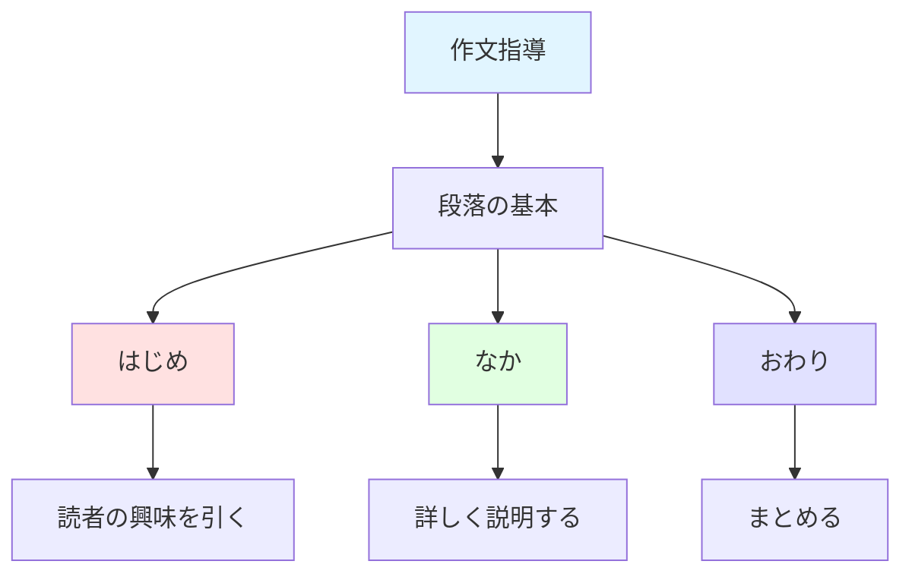

**効果：**
- 子どもが文章の構造を理解
- 論理的思考力の育成
- 表現力の向上

### 2. ビジネス文書

**提案書の段落構成例：**

| 段落 | 目的 | 内容 | メンタルモデルへの寄与 |
|------|------|------|---------------------|
| 1 | 問題提起 | 現状の課題 | 「何が問題か」を配置 |
| 2 | 原因分析 | なぜ問題か | 「なぜ問題か」を理解 |
| 3 | 解決策提示 | 具体的提案 | 「どう解決するか」を構築 |
| 4 | メリット説明 | 期待される効果 | 「結果どうなるか」を予測 |
| 5 | 実行計画 | スケジュール | 「いつ何をするか」を整理 |

### 3. Web記事

**ブログ記事の最適化：**
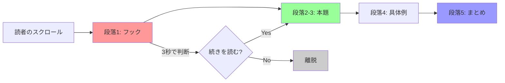

**段落設計のポイント：**
- 短めの段落（3-5文）
- 最初の1文で興味喚起
- ビジュアルの挿入（画像・図）
- モバイル画面での読みやすさ

### 4. 技術文書

**API ドキュメントの構成：**
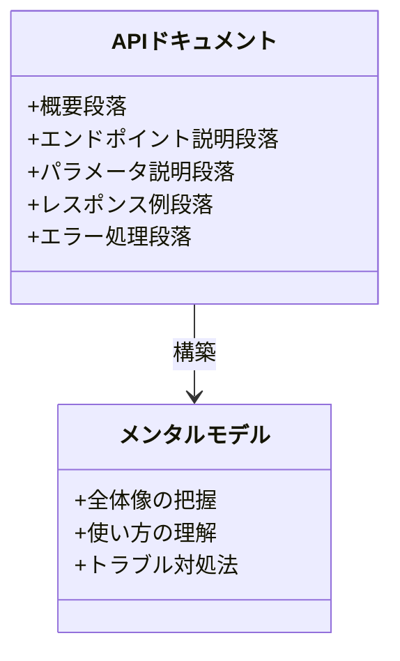

**各段落の役割：**
- **概要**：API全体の目的
- **エンドポイント**：どう呼び出すか
- **パラメータ**：何を渡すか
- **レスポンス**：何が返るか
- **エラー**：失敗時の対処

### 5. 学術論文

**IMRAD構造と段落：**
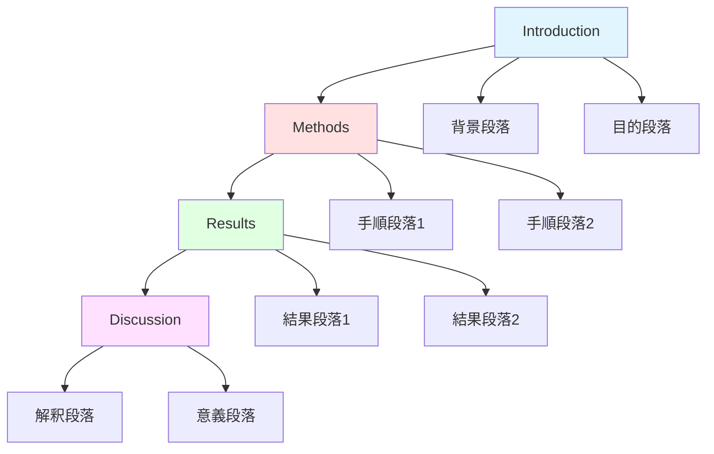

## 🔄 置換と変遷

### 何を置き換えたか

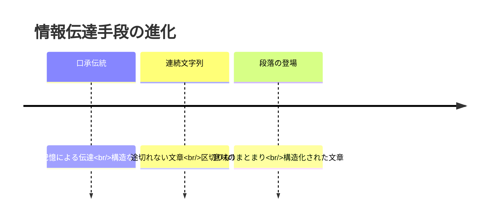

**置き換えの詳細：**

1. **口承から書記へ**
   - **Before**: 吟遊詩人の韻文、リズムで記憶
   - **After**: 段落による論理的説明
   - **変化**: 記憶重視→理解重視

2. **連続文字列から構造化テキストへ**
   - **Before**: 切れ目のない文字の羅列
   - **After**: 段落で区切られた読みやすい文章
   - **変化**: 書記官専用→一般人向け

### 何に置き換えられつつあるか

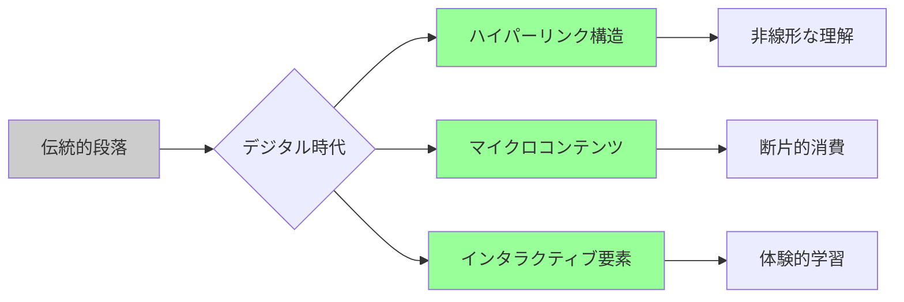

**現代の変化：**

1. **マイクロコンテンツ化**
   - Twitter/X（140→280文字）
   - TikTokの短尺動画
   - 段落→一文で完結

2. **ハイパーテキスト**
   - Wikipedia のリンク構造
   - 線形な段落→網状の情報
   - 読者が経路を選択

3. **マルチメディア統合**
   - テキスト段落＋動画＋図解
   - 単一メディア→複合メディア

### 何を継承したか

**修辞学の伝統：**
- アリストテレス『弁論術』（紀元前4世紀）
- 「序論・本論・結論」の三部構成
- 段落はこの構造を小規模に継承

**認知心理学の原理：**
- ゲシュタルト心理学の「まとまり」
- チャンク理論（情報の塊化）
- 段落は認知的に最適な情報単位

### 何に継承されるか

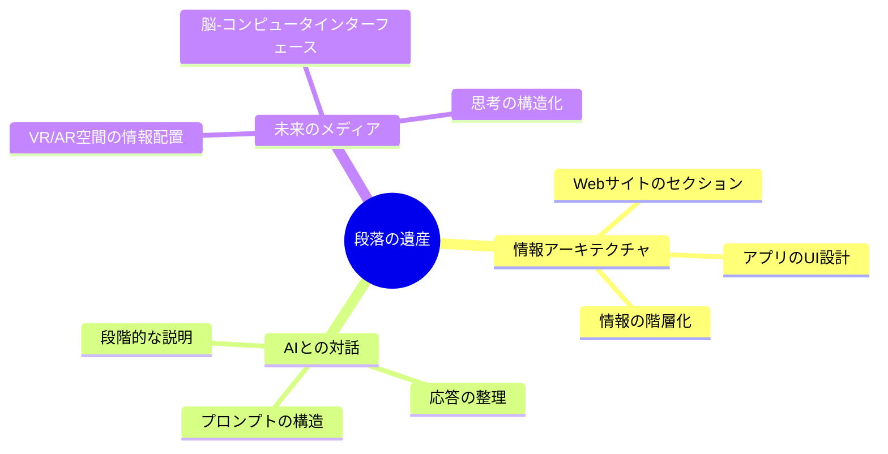

## 🔀 代替と競合

### 何に代替できるか

**段落が代替可能な表現手法：**

```mermaid
graph TD
    A[段落による説明] --> B[代替手法]
    
    B --> C[箇条書き]
    B --> D[図解]
    B --> E[表]
    B --> F[動画]
    
    C -->|適する場面| C1[簡潔な列挙]
    D -->|適する場面| D1[関係性の可視化]
    E -->|適する場面| E1[数値データ]
    F -->|適する場面| F1[プロセス説明]
    
    style A fill:#ffcccc
    style C fill:#ccffcc
    style D fill:#ccccff
    style E fill:#ffffcc
    style F fill:#ffccff
```

**比較表：**

| 手法 | 適する内容 | メリット | デメリット |
|------|----------|---------|-----------|
| **段落** | 論理的説明、物語 | 詳細な説明可能 | 読むのに時間 |
| **箇条書き** | 項目列挙、手順 | 一覧性が高い | 関係性が不明確 |
| **図解** | 構造、関係性 | 直感的理解 | 作成に手間 |
| **表** | 比較、数値 | 情報密度が高い | 読みづらい場合も |
| **動画** | 動的プロセス | 没入感がある | 制作コスト大 |

### 何に代替されるか

**段落が不要になる場面：**

1. **検索エンジン最適化（SEO）の世界**
   ```mermaid
   graph LR
       A[長文段落] --> B[検索意図]
       B --> C{ユーザーの求める情報}
       C -->|即答が必要| D[短文＋箇条書き]
       C -->|深い理解が必要| E[段落維持]
       
       style D fill:#99ff99
       style E fill:#9999ff
   ```

2. **AIチャットボットの時代**
   - ユーザー：「○○って何？」
   - AI：対話形式で段階的に説明
   - 段落→質問応答のやり取り

3. **没入型メディア（VR/AR）**
   - テキスト段落→空間配置された情報
   - 線形→非線形な体験

### 何と競合するか

**注意力をめぐる競争：**

```mermaid
pie title 現代人の注意力の奪い合い
    "動画コンテンツ" : 35
    "SNS" : 25
    "ゲーム" : 15
    "長文記事（段落あり）" : 10
    "その他" : 15
```

**段落の弱点：**
- 読むのに時間がかかる
- 受動的な体験
- 即座の満足感がない

**段落の強み：**
- 深い理解が可能
- 論理的思考を促進
- 長期記憶に残る

**共存戦略：**
```mermaid
graph TD
    A[複合的アプローチ] --> B[導入: 短尺動画]
    B --> C[詳細: 段落による説明]
    C --> D[視覚化: 図解]
    D --> E[実践: インタラクティブ要素]
    
    style A fill:#ffcccc
    style B fill:#ccffcc
    style C fill:#ccccff
    style D fill:#ffffcc
    style E fill:#ffccff
```

## 🌍 実世界への影響とその後の発展

### 教育への影響

**段落の導入による変革：**

```mermaid
graph TD
    A[段落の普及] --> B[教育の民主化]
    B --> C[識字率の向上]
    C --> D[知識の大衆化]
    D --> E[社会の発展]
    
    B --> F[教科書の標準化]
    F --> G[教育システムの確立]
    G --> H[人材育成の効率化]
    
    style A fill:#e1f5ff
    style E fill:#e1ffe1
    style H fill:#ffe1e1
```

**具体的影響：**
- 19世紀：義務教育の普及と段落形式の教科書
- 20世紀：大量教育を可能にした構造化テキスト
- 21世紀：オンライン学習でも段落は基本単位

### メディア産業への影響

**新聞・出版業界の変化：**

1. **19世紀末：大衆紙の登場**
   - 段落による読みやすい記事
   - 識字率向上→購読者増加
   - メディアの大衆化

2. **20世紀：雑誌文化の隆盛**
   - 段落とビジュアルの融合
   - 特集記事の発展
   - 情報デザインの確立

3. **21世紀：デジタルメディア**
   - スクロール最適化された段落
   - SEOを意識した構造化
   - ソーシャルシェア可能な単位

### 科学コミュニケーションへの影響

```mermaid
sequenceDiagram
    participant 研究者
    participant 科学論文
    participant 一般読者
    
    研究者->>科学論文: IMRAD形式で執筆
    科学論文->>科学論文: 段落で構造化
    科学論文->>一般読者: 理解可能な形で伝達
    一般読者->>一般読者: メンタルモデル構築
    一般読者->>研究者: 科学リテラシー向上
```

**影響：**
- 科学の再現性向上（明確な方法記述）
- 査読プロセスの効率化
- 一般向け科学記事の発展


### 未来展望：段落の進化

**1. AIとの協働時代**

```mermaid
graph LR
    A[人間が書く段落] --> B[AIが構造分析]
    B --> C[最適化提案]
    C --> D[読者適応型段落]
    
    D --> E[初心者向け: 詳細]
    D --> F[専門家向け: 簡潔]
    D --> G[子供向け: 物語調]
    
    style A fill:#e1f5ff
    style D fill:#ffe1e1
    style E fill:#e1ffe1
    style F fill:#ffffcc
    style G fill:#ffccff
```

**AIによる段落革命：**
- **自動最適化**：読者の理解度に応じて段落を再構成
- **リアルタイム翻訳**：文化圏ごとの最適な段落構造
- **個人化**：読者の知識レベルに合わせた説明密度

**2. 脳科学との融合**

```mermaid
mindmap
  root((神経科学×段落))
    脳波測定
      理解度の可視化
      最適な段落長の特定
      認知負荷のモニタリング
    アイトラッキング
      視線の動き分析
      読みやすい配置
      疲労度の測定
    fMRI研究
      理解時の脳活動
      記憶定着のメカニズム
      最適な情報構造
```

**研究の最前線：**
- MIT Media Lab：段落の認知負荷を脳波で測定
- スタンフォード大学：最適な段落長の神経科学的根拠
- 東京大学：日本語の段落特性と脳活動の関係

**3. 量子的情報構造へ**

従来の段落は**線形**（一方向）ですが、未来は**非線形**（多方向）へ：

```mermaid
graph TD
    A[中心概念] --> B[詳細1]
    A --> C[詳細2]
    A --> D[詳細3]
    
    B <--> C
    C <--> D
    D <--> B
    
    B --> E[応用例1]
    C --> F[応用例2]
    D --> G[応用例3]
    
    E <--> F
    F <--> G
    G <--> E
    
    style A fill:#ff9999
    style B fill:#99ff99
    style C fill:#9999ff
    style D fill:#ffff99
```

**特徴：**
- 読者が自由に経路を選択
- 概念間の関係が多次元的
- メンタルモデルが網状に構築

**4. 没入型メディアでの段落**

VR/AR空間での情報設計：

```mermaid
graph LR
    A[3D空間] --> B[段落1: 眼前]
    A --> C[段落2: 右側]
    A --> D[段落3: 上方]
    
    B --> E[詳細情報: 奥行き]
    C --> F[関連情報: 横展開]
    D --> G[補足情報: 浮遊]
    
    style A fill:#e1f5ff
    style B fill:#ffe1e1
    style C fill:#e1ffe1
    style D fill:#ffffcc
```

**空間的段落の特性：**
- **位置が意味を持つ**：重要度＝近さ
- **視線誘導**：自然な情報探索
- **身体性**：手を伸ばして情報取得

### 社会への長期的影響

**思考様式の変化：**

```mermaid
timeline
    title 段落が育んだ思考文化
    18世紀 : 啓蒙思想の普及<br/>論理的思考の大衆化
    19世紀 : 科学革命<br/>体系的記述の確立
    20世紀 : 情報爆発<br/>構造化思考の必要性
    21世紀 : デジタル革命<br/>非線形思考との共存
```

**具体的影響：**

1. **批判的思考の育成**
   - 段落ごとに論理を検証する習慣
   - 主張と根拠の区別
   - 反証可能性の理解

2. **システム思考の普及**
   - 全体と部分の関係理解
   - 相互依存性の認識
   - 複雑性の管理能力

3. **民主主義の発展**
   - 複雑な政策を理解できる市民
   - 論理的議論の文化
   - 情報に基づく意思決定

### 今後の課題と可能性

**課題：**

```mermaid
graph TD
    A[現代の課題] --> B[注意力の断片化]
    A --> C[情報過多]
    A --> D[多様な読者層]
    
    B --> B1[長文離れ]
    C --> C1[読む時間の欠如]
    D --> D1[一律の構造の限界]
    
    style A fill:#ffcccc
    style B1 fill:#ff9999
    style C1 fill:#ff9999
    style D1 fill:#ff9999
```

**可能性：**

```mermaid
graph TD
    A[未来の可能性] --> B[適応的段落]
    A --> C[マルチモーダル統合]
    A --> D[集合知との融合]
    
    B --> B1[読者に自動最適化]
    C --> C1[テキスト+音声+映像]
    D --> D1[集合的メンタルモデル]
    
    style A fill:#ccffcc
    style B1 fill:#99ff99
    style C1 fill:#99ff99
    style D1 fill:#99ff99
```

---
