人がテキストのみで情報やり取りする時、全ての構成要素を考えた場合、それをツリー形式で示して欲しいです。例えば 単語は文字で構成されるとか、段落は文で構成されるとか、そういった関係性を全て網羅してください

# テキストコミュニケーション - 構成要素の完全体系

## 🔍 一言要約
人間のテキストによる情報交換は、文字から文書まで10階層以上の構造で成り立つ

## 📚 目次
1. [全体構造図](#全体構造図)
2. [階層別詳細解説](#階層別詳細解説)
3. [意味層の構造](#意味層の構造)
4. [時系列構造](#時系列構造)
5. [関連用語](#関連用語)
6. [実世界への応用](#実世界への応用)

## 🌟 はじめに

メールを送る、チャットする、レポートを書く——私たちは毎日テキストで情報をやり取りしています。しかし、その「当たり前」の裏には、文字という最小単位から文書全体まで、精密に積み重なった構造が存在します。

料理に例えるなら、文字は「食材の分子」、単語は「食材」、文は「料理」、段落は「コース」、文書は「フルコースディナー」です。

## 🏗️ 全体構造図

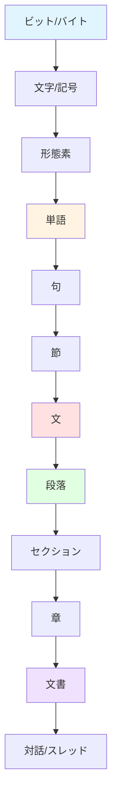

## 📊 階層別詳細解説

### レベル1: ビット/バイト層
**構成**: 0と1のデジタル信号  
**役割**: コンピュータがテキストを認識する最小単位

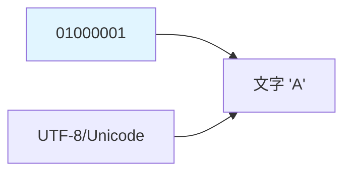

### レベル2: 文字/記号層
**構成**: ビット/バイトから生成  
**種類**:
- アルファベット（A-Z, a-z）
- 数字（0-9）
- 記号（!, ?, .）
- 空白文字（スペース、改行、タブ）

**例**: `H`, `3`, `!`, ` `

### レベル3: 形態素層
**構成**: 文字の組み合わせ  
**定義**: 意味を持つ最小単位

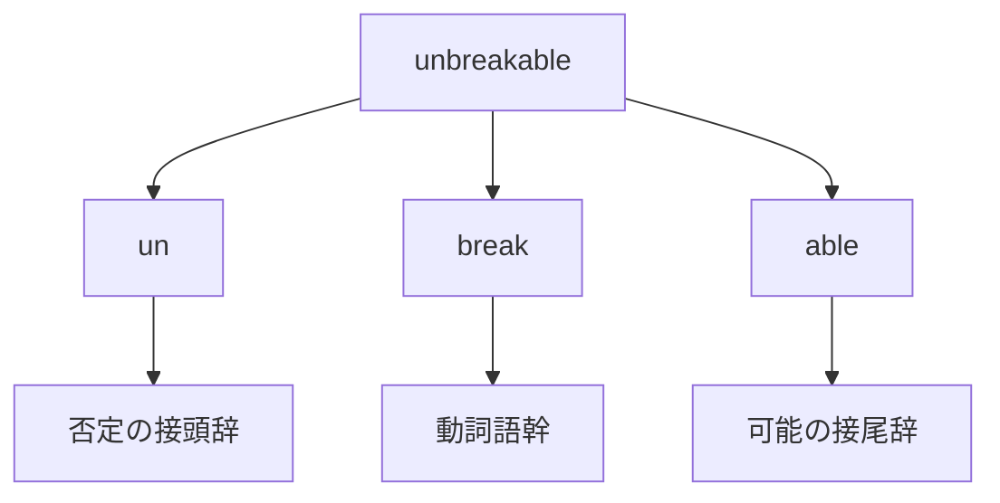

**例**: 
- 日本語: 「食べられない」→「食べ」+「られ」+「ない」
- 英語: "unhappy" → "un" + "happy"

### レベル4: 単語層
**構成**: 形態素の組み合わせ  
**種類**:
- 内容語（名詞、動詞、形容詞）
- 機能語（助詞、接続詞、冠詞）

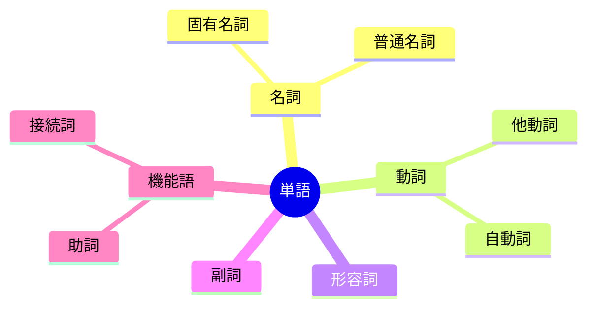

### レベル5: 句層
**構成**: 単語の組み合わせ（文法的まとまり）  
**特徴**: 主語や述語にはならない

**例**:
- 名詞句: "赤いリンゴ"
- 動詞句: "速く走る"
- 前置詞句: "机の上に"

### レベル6: 節層
**構成**: 句の組み合わせ  
**特徴**: 主語+述語を含むが、単独で完結しない

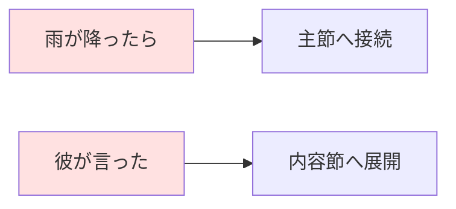

**例**:
- "彼が来たら"（条件節）
- "私が思うに"（挿入節）

### レベル7: 文層
**構成**: 節の組み合わせ、または単独の節  
**特徴**: 完結した意味を持つ

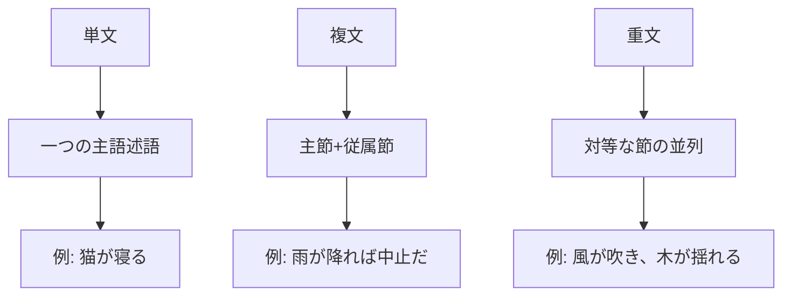

**種類**:
- 平叙文: 事実を述べる
- 疑問文: 質問する
- 命令文: 指示する
- 感嘆文: 感情を表す

### レベル8: 段落層
**構成**: 文の集合  
**役割**: 一つのトピックを展開

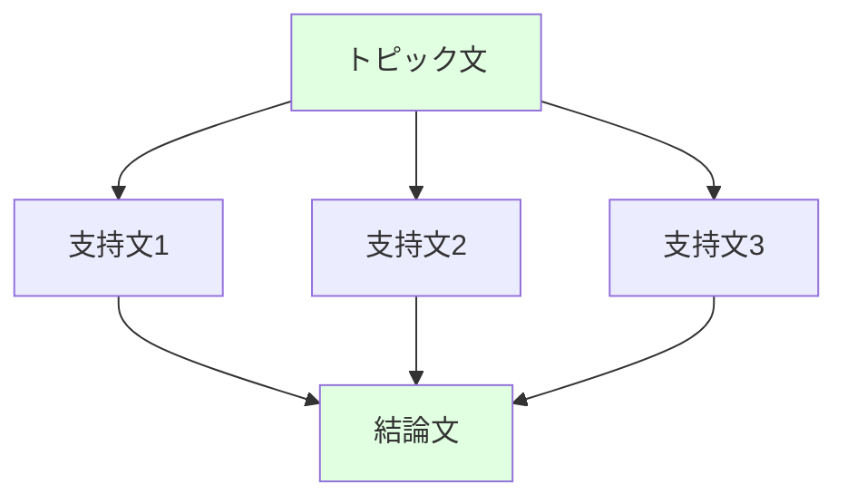

**構造**:
1. トピック文（主題提示）
2. 支持文（詳細・例示）
3. 結論文（まとめ）

### レベル9: セクション層
**構成**: 段落の集合  
**役割**: 文書内の大きなテーマ区分

**例**: 
- 「序論」セクション
- 「方法」セクション
- 「結果」セクション

### レベル10: 章層
**構成**: セクションの集合  
**役割**: 大規模文書の主要区分

**例**: 
- 第1章「基礎編」
- 第2章「応用編」

### レベル11: 文書層
**構成**: 章、セクション、段落の統合体  
**種類**:
- レポート
- 論文
- メール
- チャットメッセージ
- 小説

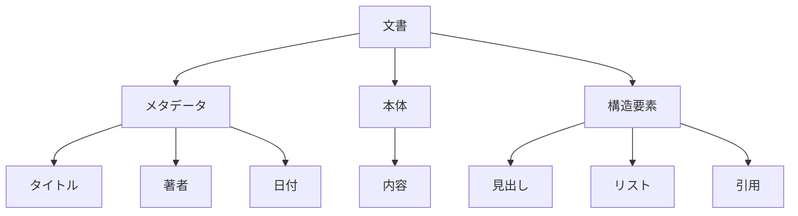

### レベル12: 対話/スレッド層
**構成**: 複数文書の時系列的交換  
**特徴**: 送信者と受信者の往復

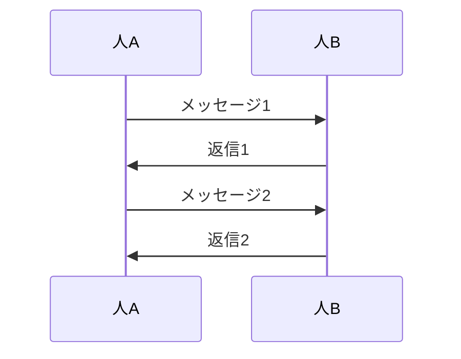

**例**:
- メールスレッド
- チャット会話
- 掲示板のスレッド

## 🎨 意味層の構造

テキストには構造以外に「意味の層」も存在します:

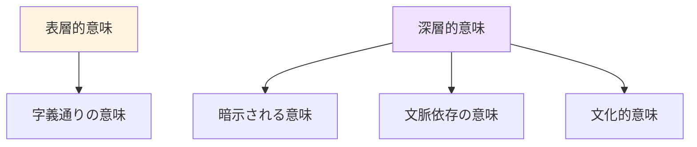

**例**: "冷たい人だね"
- 表層: 体温が低い
- 深層: 感情的に冷淡だ

## ⚡ 時系列構造

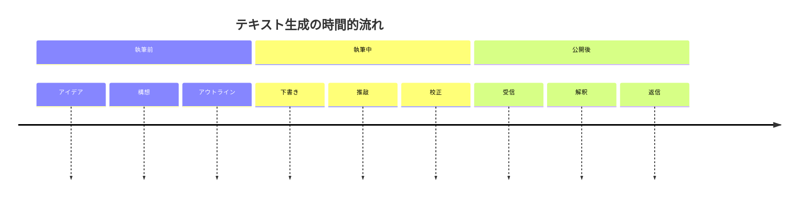

## 📗 関連する用語

### 同義語・類義語
- **テキスト** = 文章 ≈ 文書
- **段落** = パラグラフ
- **文** = センテンス = 文章（狭義）

### 対義語
- 書き言葉 ⇔ 話し言葉
- 形式的 ⇔ 口語的

### 多義語
- **文章**: 
  1. 単独の文
  2. 文の集合（広義）
  3. 文書全体

### 分野別用語
| 言語学 | プログラミング | 出版 |
|--------|----------------|------|
| 形態素 | トークン | 文字 |
| 構文木 | AST | レイアウト |
| 意味論 | セマンティクス | 校正 |

## 💡 メリットとデメリット

### メリット
✅ **非同期性**: いつでも読み書き可能  
✅ **記録性**: 永続的に保存できる  
✅ **編集性**: 送信前に修正できる  
✅ **明確性**: 構造化された情報伝達  

### デメリット
❌ **非言語情報の欠如**: 表情、声のトーンが伝わらない  
❌ **誤解のリスク**: 文脈が不明確だと解釈が分かれる  
❌ **時間コスト**: 音声より入力に時間がかかる  
❌ **感情の制約**: ニュアンスを伝えにくい  

## 🚀 実世界への応用

### 1. 自然言語処理（NLP）
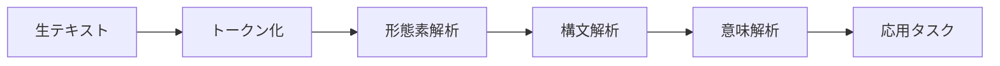

**活用例**: 
- 機械翻訳
- チャットボット
- 感情分析

### 2. 情報設計
- Webサイト構造の設計
- 技術文書のテンプレート作成
- データベースのスキーマ設計

### 3. コミュニケーション最適化
| レベル | 最適化手法 |
|--------|------------|
| 単語 | 平易な語彙選択 |
| 文 | 短文化（20-25語以下） |
| 段落 | トピック文の明示 |
| 文書 | 見出しの階層化 |

## 🔄 置換と変遷

### 置き換えたもの
- **口頭伝承** → テキスト記録（文書化革命）
- **手書き文書** → デジタルテキスト
- **紙の手紙** → メール・メッセージ

### 置き換えられる可能性
- **テキスト入力** → 音声入力（部分的）
- **長文テキスト** → 音声メッセージ（カジュアル場面）
- **静的テキスト** → マルチメディア統合（リッチテキスト）

### 継承関係
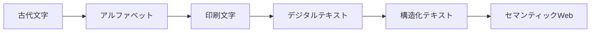

## 🌐 代替と競合

### 代替可能な手段
| シチュエーション | テキスト | 代替手段 |
|------------------|----------|----------|
| カジュアル会話 | チャット | 音声通話 |
| プレゼン | 文書 | 動画・スライド |
| 感情表現 | 長文 | 絵文字・スタンプ |

### 競合関係
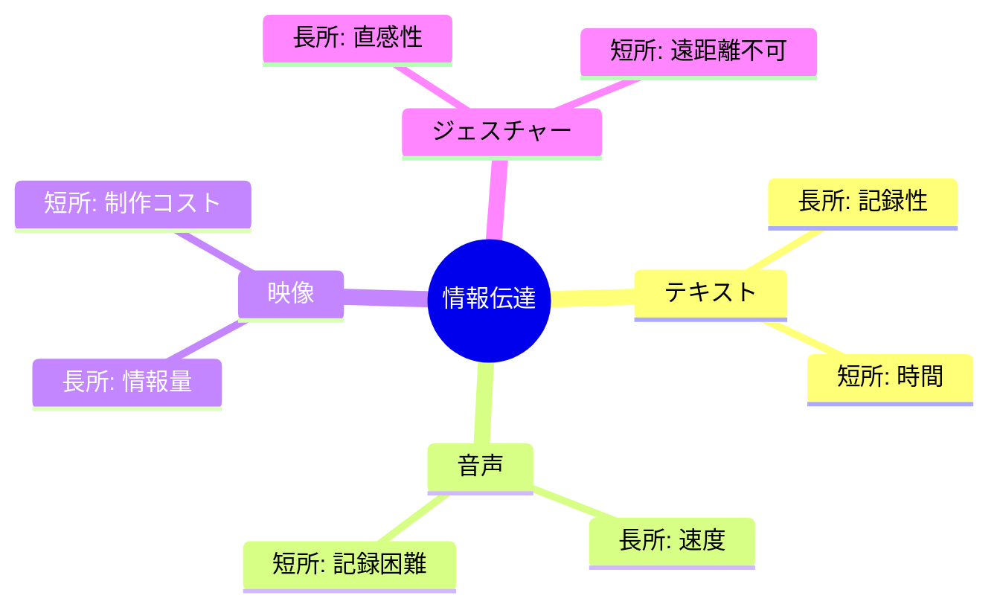

## 🌍 実世界への影響

### 歴史的影響
1. **文字の発明** (紀元前3000年頃)  
   → 知識の蓄積・文明の発展

2. **印刷術** (15世紀)  
   → 情報の民主化・宗教改革

3. **インターネット** (20世紀末)  
   → グローバルなテキストコミュニケーション

### 現代への影響
- **働き方**: リモートワーク（テキストベース協働）
- **教育**: eラーニング、オンライン教材
- **社会**: SNSによる世論形成
- **ビジネス**: メールマーケティング、チャットサポート

### 未来展望
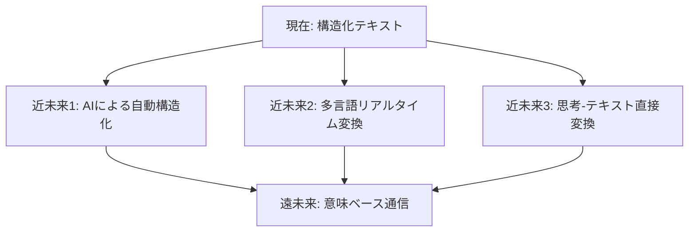

**発展可能性**:
- 🧠 **脳-コンピュータインターフェース**: 思考を直接テキスト化
- 🤖 **AI執筆アシスタント**: 構造最適化の自動化
- 🌐 **ユニバーサル翻訳**: 言語の壁の消失
- 📊 **セマンティックWeb**: 機械可読な意味構造

---

