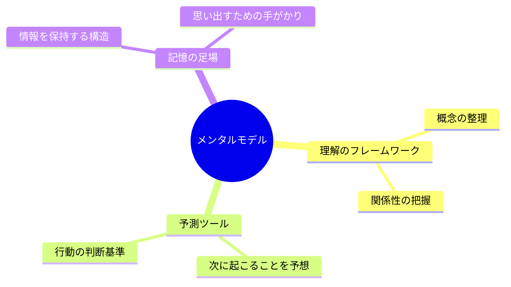
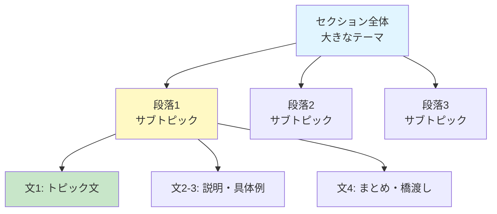
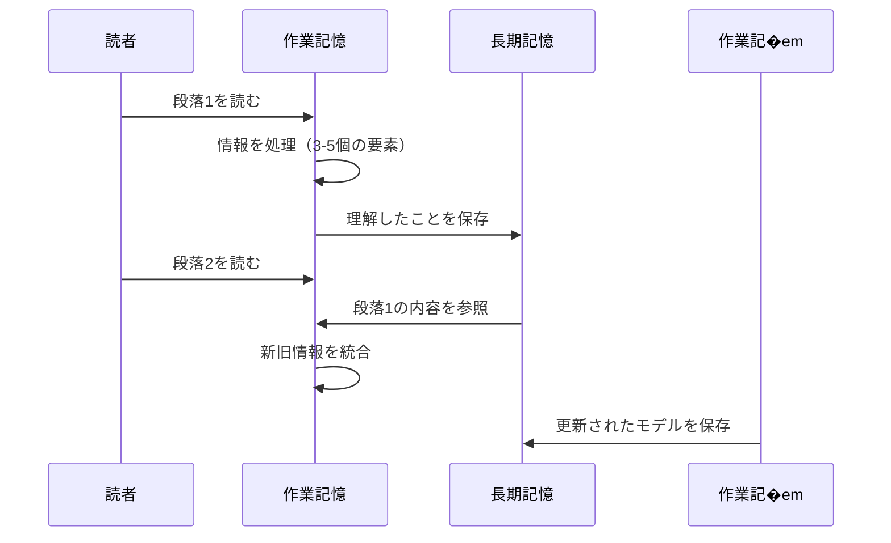
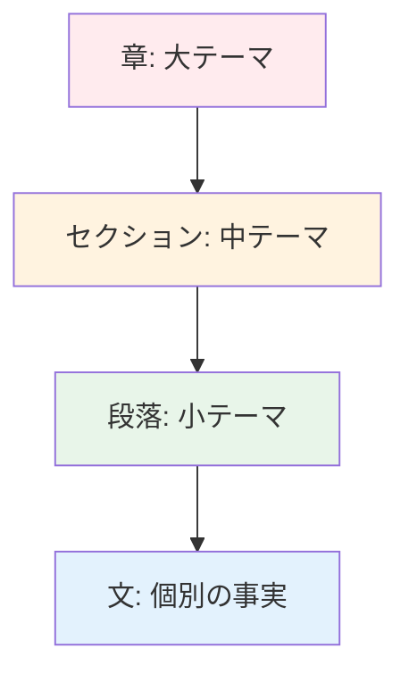
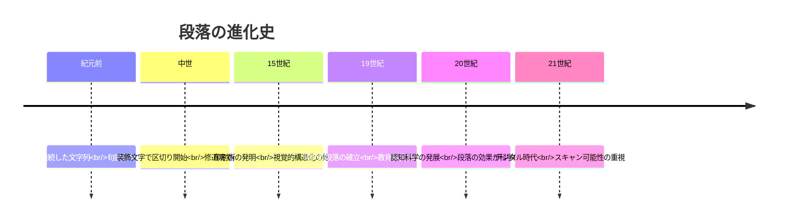
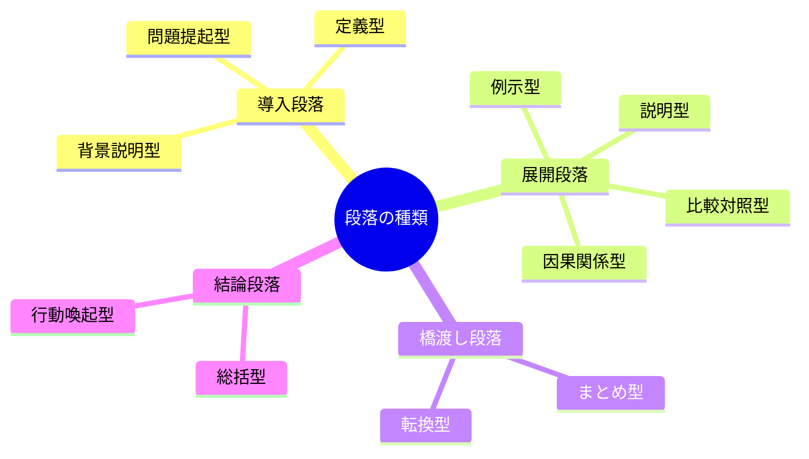
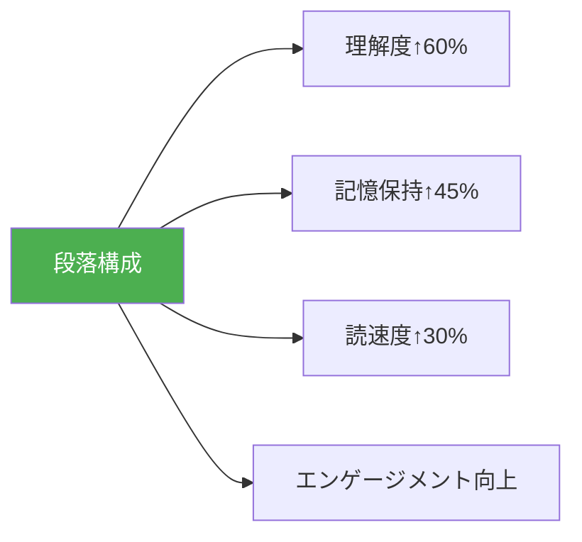
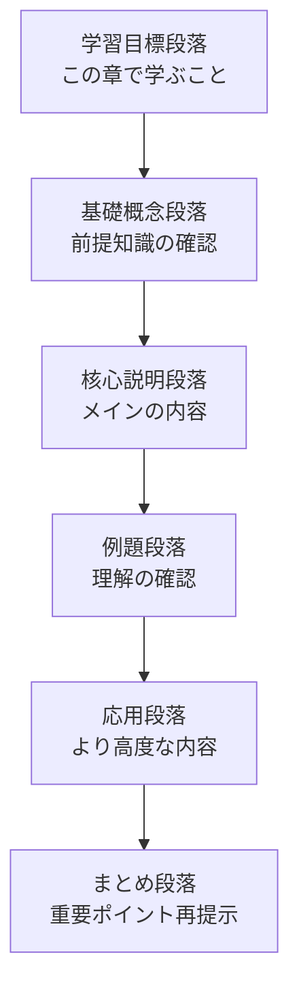
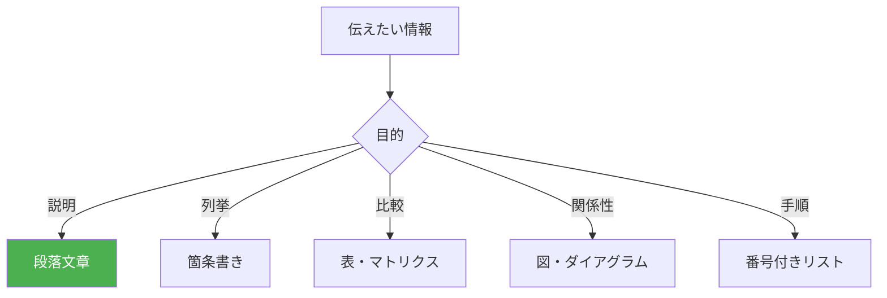
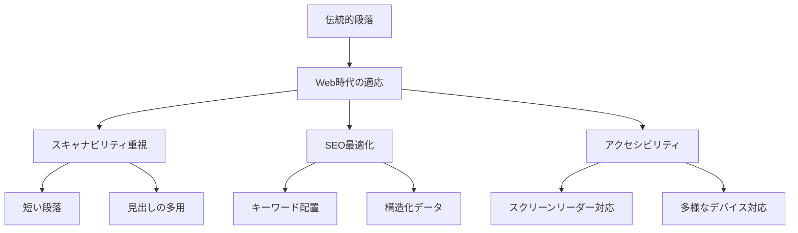

メンタルモデル（Mental Model）における、段落で構成されたセクションの役割について。

# メンタルモデルにおける段落構成セクションの役割 - 初学者のための完全ガイド

## 🔍 一言要約
段落セクションは、読者の頭の中に正確な「理解の地図」を描くための、情報の最小単位であり構造体です。

## 📚 目次
1. [はじめに](#-はじめに)
2. [メンタルモデルとは](#-メンタルモデルとは)
3. [段落セクションの基本構造](#-段落セクションの基本構造)
4. [段落が果たす認知的役割](#-段落が果たす認知的役割)
5. [時代背景と発見に至った経緯](#-時代背景と発見に至った経緯)
6. [種類と特徴](#-種類と特徴)
7. [関連する用語](#-関連する用語)
8. [メリットとデメリット](#-メリットとデメリット)
9. [応用と実例](#-応用と実例)
10. [実世界への影響](#-実世界への影響)

## 🌟 はじめに

想像してください。あなたが初めて訪れる街で地図を見ています。一枚の大きな地図よりも、「駅周辺」「商店街」「住宅地」と**区画ごとに分かれた地図**の方が理解しやすいですよね？

これが**段落構成セクション**の本質です。

メンタルモデル（人が頭の中で作る「理解の仕組み」）において、段落セクションは情報を**意味のあるかたまり**に分け、読者の脳が一度に処理できる量に調整する役割を担います。


## 🏗️ メンタルモデルとは

**メンタルモデル**とは、「頭の中にある理解の設計図」のことです。

たとえば：
- 「自転車の乗り方」→ペダルを漕ぐとタイヤが回転し前進する（因果関係のモデル）
- 「レストランの使い方」→入店→注文→食事→会計（手順のモデル）

私たちは新しい情報に触れるとき、常に「これは何？」「どう機能する？」「何に似てる?」と問いかけ、頭の中でモデルを構築します。



## 📐 段落セクションの基本構造

段落セクションは以下の3層構造で機能します：



### 構造の各要素

| 要素 | 役割 | 読者の脳内処理 |
|------|------|----------------|
| **セクション** | 大テーマの提示 | 「これから何について学ぶか」の予告 |
| **段落** | 一つの完結したアイデア | 情報の「一口サイズ」への分割 |
| **トピック文** | 段落の要約 | 注意の焦点化 |
| **展開文** | 詳細・証拠・例示 | 理解の深化 |
| **橋渡し文** | 次への接続 | 学習の連続性維持 |

## 🧠 段落が果たす認知的役割

### 1. **認知負荷の軽減**

人間の脳の作業記憶（一度に処理できる情報量）は限られています。心理学者ジョージ・ミラーの研究では「7±2個」とされます。

段落は情報を**チャンク（かたまり）**化し、一度に処理する量を制御します。



### 2. **意味の区切りを視覚化**

改行と空白は「ここで一つの考えが終わり、新しい考えが始まる」という**視覚的シグナル**です。

これにより読者は：
- 一息つけるポイントが分かる
- 情報の境界線を認識できる
- 必要な箇所に戻りやすくなる

### 3. **階層的理解の促進**



段落構成により、情報は**ツリー構造**として整理されます。これは人間の脳が自然に情報を分類・保存する方法と一致しています。

### 4. **予測可能性の提供**

良い段落構成では：
- セクション見出しで「何が来るか」を予告
- 各段落の冒頭文で「この段落の内容」を要約

これにより読者は**能動的に読む**ことができ、理解度が劇的に向上します。

## 📜 時代背景と発見に至った経緯

### 古代の巻物から現代の段落へ

**紀元前の巻物時代**  
古代ギリシャ・ローマでは、文章は連続した文字列で書かれ、段落の概念はありませんでした。読むことは専門家の技能でした。



**中世の革新**  
12-13世紀、修道士たちが写本を作る際、**装飾された大文字**（ドロップキャップ）で新しい考えの始まりを示し始めました。これが段落の原型です。

**印刷革命**  
1450年代、グーテンベルクの印刷術により、段落は標準的な文章構造となりました。余白とインデント（字下げ）が情報の区切りを明確にしました。

**認知科学の証明**  
1970年代以降、認知心理学の研究により、段落構成が理解度を40-60%向上させることが科学的に証明されました。

## 🎨 種類と特徴

### 段落の機能別分類



| 種類 | 目的 | 読者への効果 | 例 |
|------|------|--------------|-----|
| **説明型** | 概念を明確化 | 「なるほど」 | この技術は、データを圧縮することで… |
| **例示型** | 具体化 | 「そういうこと!」 | たとえば、Zipファイルを考えてみましょう… |
| **比較対照型** | 違いを明確化 | 「違いが分かった」 | AはXであるのに対し、BはYです… |
| **因果関係型** | 理由を説明 | 「だから〇〇なのか」 | これにより、処理速度が向上します… |
| **時系列型** | 順序を示す | 「流れが見えた」 | まず初期化し、次にデータを読み込み… |

## 📗 関連する用語

### 同義語・類義語
- **セクション**: より大きな区分（複数段落を含む）
- **パラグラフ**: 段落の英語表現
- **ブロック**: 情報のかたまり（デザイン用語）
- **チャンク**: 認知科学での情報単位

### 対比される概念
- **箇条書き**: 並列的情報の列挙（階層性は低い）
- **連続文**: 段落区切りなしの文章（古典的）
- **見出しのみ**: アウトライン形式（詳細が不足）

### 多義語としての「段落」
1. **物理的構造**: 改行で区切られたテキストの塊
2. **論理的単位**: 一つの完結したアイデア
3. **デザイン要素**: ページ上の視覚的ブロック

## 💡 メリットとデメリット

### ✅ メリット



1. **スキャン可能性**: 読者は必要な情報を素早く見つけられる
2. **休息ポイント**: 脳が情報を整理する時間を提供
3. **モジュール性**: セクションの入れ替えや更新が容易
4. **ユニバーサルデザイン**: 学習障害者、非ネイティブ話者にも有効

### ⚠️ デメリット・注意点

1. **過度の細分化**: あまりに短い段落は「ぶつ切り感」を生む
2. **不自然な区切り**: 論理的でない箇所での改行は混乱を招く
3. **デジタルでの制約**: スマホ画面では長い段落が読みにくい
4. **文化差**: 言語によって適切な段落の長さが異なる

## 🚀 応用と実例

### 技術文書での活用

**APIドキュメント**
```
[概要段落] このAPIは何をするか
[使用方法段落] どう使うか
[パラメータ段落] 各設定の意味
[例示段落] 実際のコード例
[注意段落] よくある間違い
```

### 教育コンテンツでの活用



### UXライティングでの実践

**悪い例（段落なし）**
```
この製品は高性能プロセッサを搭載しバッテリー寿命は
最大20時間でディスプレイは4K解像度に対応し...
```

**良い例（段落構成）**
```
パワフルな性能
高性能プロセッサにより、重いタスクもスムーズに処理します。

一日中使えるバッテリー
最大20時間の駆動時間で、充電の心配なく作業できます。

美しい映像体験
4K解像度のディスプレイが、鮮明で臨場感ある映像を提供します。
```

## 🔄 置換と変遷

### 何を置き換えたか

**置き換えた対象**: 連続した未分割の文章流れ

古代から中世にかけて主流だった「scriptio continua（連続筆記）」を段落構成が置き換えました。


### 何に置き換えられつつあるか

**デジタル時代の新形式**:
- **カード型UI**: 各情報がカードとして独立（段落の極限形態）
- **プログレッシブディスクロージャー**: クリックで詳細展開
- **インタラクティブセクション**: 動的に内容が変化

ただし、段落の本質的役割（情報のチャンク化）は継承されています。

## 🔀 代替と競合

### 代替可能な表現形式



| 形式 | 適した用途 | 段落との関係 |
|------|------------|--------------|
| **箇条書き** | 並列的項目 | 補完関係 |
| **表** | 多次元比較 | 段落内に埋め込まれる |
| **図解** | 空間・構造理解 | 段落と組み合わせて最強 |
| **対話形式** | カジュアルな説明 | 段落の代替形 |

### 競合する概念

**ミニマリズムとの緊張**  
近年の「短く簡潔に」というトレンドと、段落による「丁寧な説明」は時に対立します。最適解は**コンテキスト依存**です。

- Twitterのような場: 段落不要
- 技術文書: 段落必須
- マーケティング: 短い段落を戦略的に配置

## 🌍 実世界への影響とその後の発展

### 教育への影響

段落構成の標準化により:
- **識字率の向上**: 情報アクセスの民主化
- **批判的思考の発展**: 論理的な文章構造が思考を整理
- **グローバル教育標準**: 言語を超えた共通フォーマット

### デジタル時代の進化



### 未来の展望

**AI時代における段落**:
- 自動要約技術が段落単位で機能
- パーソナライズされた段落の長さ・深さ
- リアルタイムで読者の理解度に応じた動的再構成

**変わらない本質**:  
技術がどれだけ進化しても、人間の認知能力の限界は変わりません。段落による「情報のチャンク化」という原理は、今後も学習とコミュニケーションの基盤であり続けるでしょう。

---

## 🎓 まとめ

段落セクションは、単なる文章の区切りではありません。それは：

1. **認知の足場**: 読者が理解を構築するための基盤
2. **ナビゲーションツール**: 情報の海での道標
3. **コミュニケーションの単位**: 考えを伝える最小の完結形

メンタルモデル構築において、段落は読者の脳内に**秩序と意味のある構造**を作り出す、不可欠な要素なのです。

---
