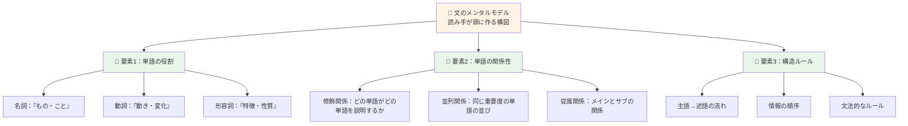
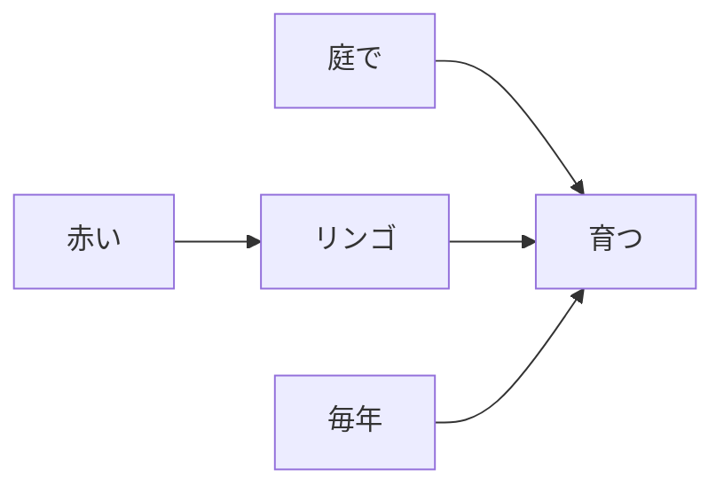
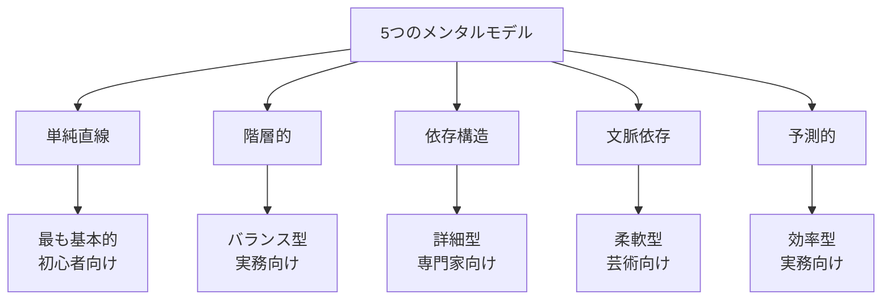

メンタルモデル（Mental Model）のうち、文字を扱う上での、単語を組み合わせて作る、文の役割について


# メンタルモデル：文と単語の関係 - 初学者のための完全ガイド

## 🔍 一言要約
文を理解するために頭の中に作る「文章のしくみ」という設計図。

## 📚 目次
1. はじめに
2. 基本構造
3. 主要要素
4. 時代背景
5. 種類と特徴
6. 関連用語
7. メリットとデメリット
8. 応用と実例
9. 置換と変遷
10. 代替と競合
11. 実世界への影響と未来展望

---

## 🌟 はじめに

### なぜこれが重要？
あなたは文を読むとき、何も考えずに意味を理解していますが、実はその瞬間、頭の中で「文がどう構成されているか」という青写真（メンタルモデル）を無意識に組み立てています。

例えば、「猫がおもちゃを追いかけた」と読むとき、あなたの脳は自動的に「主語＝猫」「動作＝追いかける」「対象＝おもちゃ」という構造を作ります。これが**文のメンタルモデル**です。

このモデルを意識的に理解することで、複雑な文も簡単に読め、自分でも正確な文が書けるようになります。

---

## 🏗️ 基本構造



### わかりやすく言うと

文を理解するプロセスは、レゴブロックを組み立てるのに似ています：

1. **個々のブロック（単語）** を認識する
2. **ブロック同士の接続方法** を理解する
3. **全体の形（意味）** が見えてくる

文の中で単語が「どんな役割か」「どの単語に関連しているか」を把握することで、初めて文全体の意味が立体的に浮かび上がります。

---

## ⚡ 主要技術：5つのコア・メンタルモデル

### 1️⃣ **階層モデル**（最も基本的）
文には常に「上下関係」があります。

```
上位層：主語＝文の中心人物
   ↓
中位層：述語＝起こった動作
   ↓
下位層：修飾語＝詳しい情報
```

**例：** 「昨日、田中さんが、図書館で、本を読んだ」
- 昨日（時間情報）
- 田中さんが（主語）← **最上位**
- 図書館で（場所情報）
- 本を（対象）
- 読んだ（述語）

### 2️⃣ **依存構造モデル**
各単語が「誰に依存しているか」という関係図。



赤い → リンゴに依存（「赤い」は「リンゴ」の特徴を説明）

### 3️⃣ **並列モデル**
同じ重要度の要素を認識する力。

**例：** 「りんご、ぶどう、みかん」
→ これら3つは「同じランク」「同じ種類」

文が複数の要素を並べるとき、読み手はそれらが「同じグループ」と自動判断します。

### 4️⃣ **予測モデル**
文を読み進める中で「次は何が来そうか」を予測。

主語「太郎が」と読むと、脳は無意識に「動詞が来るはず」と期待。この期待があるから、読むのが速く、理解も深まります。

### 5️⃣ **修飾範囲モデル**
修飾語が「何を修飾しているか」の範囲を理解。

**例：** 「古い木製の机」
- 「古い」は「木製の机」全体を修飾
- 「木製の」は「机」を修飾
- **最も近い単語ほど、修飾範囲が明確**

---

## 📜 時代背景と発見に至った経緯

### 昔（言語学以前）
昔の人々は、文を「何らかの役割を持つ要素の集まり」だと漠然と理解していました。

### 明治〜昭和初期
日本の国語学者たちが、文法を体系化し始めます。「主語」「述語」「修飾語」といった概念が確立されました。ここで初めて、文の構造が「目に見える形」になりました。

### 20世紀中盤（認知科学の登場）
心理学者たちが「人間がどうやって文を理解しているのか」という脳の活動に注目。

**重要な発見：**
- 人間は文を「一語一語、順番に処理」するのではなく、「複数の要素の関係性を同時に捉えている」
- つまり、文を理解するとき、脳は自動的に「構造図（メンタルモデル）」を作っていた

### 現在
コンピュータが自然言語を理解するようになったことで、メンタルモデルがさらに明確に。人工知能が文を理解するためには、この「構造の捉え方」が不可欠だとわかりました。

---

## 🎨 種類と特徴
- 分類自体は解説者の創意工夫であり、学術界で公認された**「5大モデル」**というわけではありません。

| メンタルモデルの種類 | 特徴 | 用途 |
|-------------------|------|------|
| **単純直線モデル** | 「主語→述語」だけに注目 | 簡単な文の理解、子どもの学習 |
| **階層的モデル** | 主語・述語・修飾語の上下関係を把握 | 日常の読み書き、ニュース理解 |
| **依存構造モデル** | 各単語がどの単語に「引っ張られているか」を理解 | 複雑な文の解析、翻訳 |
| **文脈依存モデル** | 前後の文から意味を推測 | 文学的な解釈、隠喩の理解 |
| **予測的モデル** | 次の単語が何か予測しながら読む | 速読、リアルタイム理解 |



---

## 📗 関連する用語

### 同義語・類義語
- **構文（こうぶん）**：単語の配列ルール
- **文法構造**：文のしくみ
- **言語モデル**：言葉の全体的パターン
- **概念図**：考えをまとめた図

### 対義語・対比
- ❌ **「単語の列」** ← → ✅ **「単語の関係図」**
  - ただ単語が並んでいるだけではなく、相互に関係を持つ構造

- ❌ **「表面的な意味」** ← → ✅ **「深層的な構造」**
  - 字面だけ読むのではなく、何をどう説明しているかという内部構造

### 多義語の区別
**「モデル」の多様な使い方：**
1. **メンタルモデル**：脳内の想像図
2. **言語モデル**：AI学習用の統計パターン
3. **ビジネスモデル**：商売の方式
→ ここでは1番の意味です

---

## 💡 メリットとデメリット

### ✅ メリット

1. **複雑な文が読みやすくなる**
   - 文の構造を理解することで、長い文や難しい文も筋道立てて理解できます

2. **正確な文が書ける**
   - 「何をどう説明するか」という構造が見える。そのため、自分が書く文も論理的になります

3. **誤解が減る**
   - 表面的な意味だけでなく、深い構造を理解するから、著者の真意を正確に捉えやすい

4. **学習が加速する**
   - 新しい言語を学ぶ時も、この構造ルールを一度理解していれば、応用がききます

5. **翻訳・説明が上手になる**
   - 文の骨組みが見えるから、別の言葉で説明するのが得意になります

### ❌ デメリット

1. **最初は複雑に感じる**
   - 図や図解が増えるから、初心者には「また別の勉強か」と感じるかもしれません

2. **過度な分析のリスク**
   - 構造を意識しすぎると、読むスピードが落ちることがあります
   - 簡単な文まで細かく分析してしまい、かえって理解が遅くなる可能性

3. **文脈や感情が見落とされる可能性**
   - メンタルモデルは「客観的な構造」に焦点を当てるため、著者の感情や言語の美しさを見落とすことも

4. **言語ごとの違いに対応が必要**
   - 日本語と英語では文法が違うため、各言語ごとにメンタルモデルを調整する必要があります

---

## 🚀 応用と実例

### 📰 実例1：ニュース記事の理解
**元の文：** 「経済悪化の影響で、失業率が過去最高となった東京では、求人数が前年比30%減少した。」

**メンタルモデル化：**
```
主語：東京
述語：求人数が減少した

修飾1：「経済悪化の影響で」← 理由
修飾2：「失業率が過去最高となった」← 背景情報
修飾3：「前年比30%」← 度合い
```

このようにバラバラにしておくと、文全体が理解しやすくなります。

### 📚 実例2：小説の一文分析
**元の文：** 「雨の中、彼女を待ちながら、俺は心のどこかで彼女は来ないと思っていた。」

**メンタルモデル化：**
- 主人公の行動：「待ちながら」
- 情景：「雨の中」
- 心理：「心のどこかで来ないと思っていた」

→ 主人公の複雑な心理状態（期待と諦め）が層状に見えます。

### 🎓 実例3：子どもへの説明
**大人が使う文：** 「その赤い本は、図書館で借りた、大事な本だから、乱暴に扱わないでください。」

**子ども向けに構造を使って説明：**
- これ＝「赤い本」
- その本はどこから＝「図書館から」
- どうなってる＝「大事」
- だから＝「丁寧に扱おう」

→ 構造がわかると、長い文も「短い説明の集まり」に見えて、子どもにもわかります。

---

## 🔄 置換と変遷

### 📊 何を置き換えたか
**「文法規則の暗記」から「文の構造理解」へ**
- 昔：「主語の後には述語が来る」← ルールの丸暗記
- 今：「主語と述語の関係を図で理解」← 理由の理解

このシフトで、言語学習の効率が大幅に向上しました。

### 🔗 何に置き換えられたか
メンタルモデルは、今度は**機械学習・AI技術**に置き換わられつつあります。
- 従来：人間が「文の構造を手作業で分析」
- 現在：コンピュータが「数百万の文のパターンから自動学習」

ただし、AIでもメンタルモデルという概念が基礎として重要です。

### 🌱 何を継承したか
**伝統的な文法学** → メンタルモデルが継承
- 「主語・述語」といった古い概念が、新しい形で統合されました

### 📈 何に継承されたか
**認知科学・心理言語学・自然言語処理**へ継承中
- 現在も研究者たちが、さらに精密なモデルを開発しています

---

## 🆚 代替と競合

### 何に代替できるか

| 従来の学習方法 | メンタルモデルでの置き換え |
|-------------|--------------------------|
| 文法規則の丸暗記 | 文構造を図で理解、応用へ |
| 一文一文の単語訳 | 全体構造を把握後に意味把握 |
| 試行錯誤の読み方 | 構造ルールに基づく読み方 |

### 何に代替されるか
- **AI翻訳・言語モデル**：人間が文を分析しなくても、AIが構造を自動解析
- しかし、人間の「理解度」や「創意工夫」までは代替できないため、メンタルモデルの価値は残存

### 何と競合するか

1. **直感的読み理解**
   - 「考えずに読む」 vs 「構造を意識して読む」
   - どちらも有効だが、複雑さが増すほど構造理解が有利

2. **感情的読解**
   - 「心で感じる読み方」 vs 「理性で理解する読み方」
   - 文学では両方必要です

---
